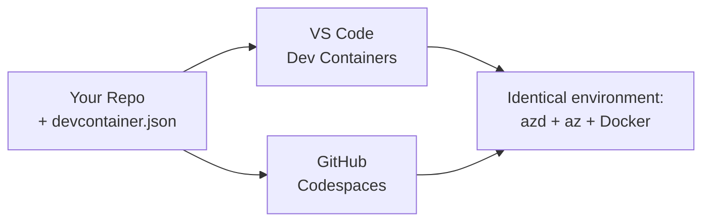

# Dev Containers & GitHub Codespaces for azd

**Chapter Navigation:**
- **📚 Course Home**: [AZD For Beginners](../../README.md)
- **📖 Current Chapter**: Chapter 1 - Foundation & Quick Start
- **⬅️ Previous**: [Bring Your Own App](bring-your-own-app.md)
- **🚀 Next Chapter**: [Chapter 2: AI-First Development](../chapter-02-ai-development/README.md)

> Validated against `azd 1.27.1` in July 2026.

## Introduction

Installing azd, the right language runtime, Docker, and the Azure CLI on every machine is a chore—and it's the number-one reason a tutorial that "works on my machine" fails for someone else. A **dev container** solves this by describing your whole toolchain in a file. Anyone who opens the project in VS Code or GitHub Codespaces gets the exact same environment, with azd already installed. This lesson shows you how to add one.

## Learning Goals

By the end of this lesson, you will:
- Understand what a dev container is and why it helps with azd
- Add a minimal `.devcontainer/devcontainer.json` to a project
- Include azd, the Azure CLI, and Docker via Dev Container *features*
- Open the project in GitHub Codespaces or VS Code

## Learning Outcomes

After completing this lesson, you will be able to:
- Author a `devcontainer.json` for an azd project
- Add azd and Azure tooling without manual installs
- Run `azd up` from inside a container or Codespace

---

## What Is a Dev Container?

A dev container is a Docker-based development environment defined by a `.devcontainer/devcontainer.json` file in your repository. When you open the project:

- **VS Code** (with the Dev Containers extension) builds the container and attaches to it.
- **GitHub Codespaces** builds the same container in the cloud and gives you a browser-based editor.

Either way, every contributor gets identical tools—no "did you install azd?" troubleshooting.



---

## Step 1: Create the devcontainer File

Create `.devcontainer/devcontainer.json` in the root of your project:

```json
{
  "name": "azd-project",
  "image": "mcr.microsoft.com/devcontainers/base:bookworm",
  "features": {
    "ghcr.io/devcontainers/features/azure-cli:1": {},
    "ghcr.io/azure/azure-dev/azd:latest": {},
    "ghcr.io/devcontainers/features/docker-in-docker:2": {},
    "ghcr.io/devcontainers/features/node:1": {}
  },
  "customizations": {
    "vscode": {
      "extensions": [
        "ms-azuretools.azure-dev",
        "ms-azuretools.vscode-bicep"
      ]
    }
  },
  "forwardPorts": [3000],
  "postCreateCommand": "azd version"
}
```

What each part does:

| Key | Purpose |
|-----|---------|
| `image` | The base OS for the container |
| `features` | Prebuilt installers—here: Azure CLI, **azd**, Docker, and Node.js |
| `customizations.vscode.extensions` | Auto-installs the azd and Bicep VS Code extensions |
| `forwardPorts` | Exposes your app's port to your browser |
| `postCreateCommand` | Runs once after the container is built (here, a sanity check) |

> The `ghcr.io/azure/azure-dev/azd:latest` feature is the official way to get azd in a container. Pin a specific version (for example `azd:1.27.1`) if you need reproducibility.

---

## Step 2: Match the Feature to Your App's Language

Swap the `node` feature for whatever your app uses:

```jsonc
// Python project
"ghcr.io/devcontainers/features/python:1": {},

// .NET project
"ghcr.io/devcontainers/features/dotnet:2": {},

// Java project
"ghcr.io/devcontainers/features/java:1": {},

// Go project
"ghcr.io/devcontainers/features/go:1": {}
```

Keep `docker-in-docker` if your `host` is `containerapp`, `aks`, or anything that builds a container image—azd needs Docker to build and push images.

---

## Step 3: Open It

**In VS Code:**
1. Install the **Dev Containers** extension.
2. Open the project folder.
3. Click **Reopen in Container** when prompted (or run *Dev Containers: Reopen in Container*).

**In GitHub Codespaces:**
1. Push the repo to GitHub.
2. Click **Code → Codespaces → Create codespace on main**.
3. Wait for the container to build—azd is ready in the terminal.

---

## Step 4: Deploy From Inside the Container

The container has azd preinstalled, so the normal workflow just works:

```bash
azd auth login --use-device-code   # device code is handy inside Codespaces
azd up
```

> **Why `--use-device-code`?** In a remote container or Codespace there's no local browser to redirect to, so device-code login is the reliable path. You'll paste a code into a browser tab to complete sign-in.

---

## Common Pitfalls

| Pitfall | Fix |
|---------|-----|
| `azd up` can't build an image | Add the `docker-in-docker` feature |
| Browser login hangs in Codespaces | Use `azd auth login --use-device-code` |
| Tools differ between teammates | Pin feature versions (e.g. `azd:1.27.1`) |
| App not reachable in browser | Add the port to `forwardPorts` |

---

## Summary

- A dev container makes your azd toolchain reproducible for everyone.
- Add azd, the Azure CLI, and Docker through Dev Container *features*.
- Match the language feature to your app and keep `docker-in-docker` for container hosts.
- Use device-code login when running inside Codespaces.

---

## 🔗 Navigation

| Direction | Resource |
|-----------|----------|
| **Previous** | [Bring Your Own App](bring-your-own-app.md) |
| **Chapter Home** | [Chapter 1: Foundation & Quick Start](README.md) |
| **Next Chapter** | [Chapter 2: AI-First Development](../chapter-02-ai-development/README.md) |

## 📖 Related Resources

- [Installation & Setup](installation.md)
- [Command Cheat Sheet](../../resources/cheat-sheet.md)
- [Official Dev Containers specification](https://containers.dev/)
- [azd Dev Container feature](https://github.com/Azure/azure-dev/tree/main/ext/devcontainer)
