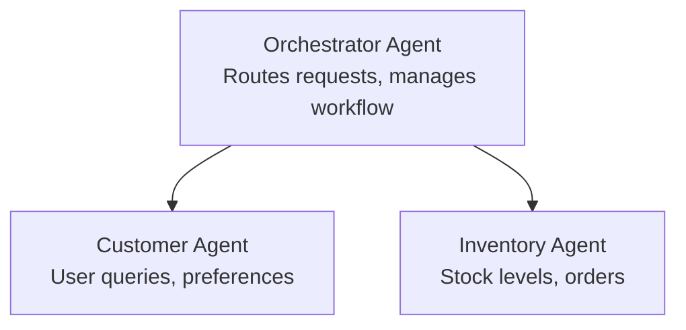

# Chapter 5: Multi-Agent AI Solutions

**📚 Course**: [AZD For Beginners](../../README.md) | **⏱️ Duration**: 2-3 hours | **⭐ Complexity**: Advanced

---

## Overview

This chapter covers advanced multi-agent architecture patterns, agent orchestration, and production-ready AI deployments for complex scenarios.

## Learning Objectives

By completing this chapter, you will:
- Understand multi-agent architecture patterns
- Deploy coordinated AI agent systems
- Implement agent-to-agent communication
- Build production-ready multi-agent solutions

---

## 📚 Lessons

| # | Lesson | Description | Time |
|---|--------|-------------|------|
| 1 | [Retail Multi-Agent Solution](../../examples/retail-scenario.md) | Complete implementation walkthrough | 90 min |
| 2 | [Coordination Patterns](../chapter-06-pre-deployment/coordination-patterns.md) | Agent orchestration strategies | 30 min |
| 3 | [ARM Template Deployment](../../examples/retail-multiagent-arm-template/README.md) | One-click deployment | 30 min |

---

## 🚀 Quick Start

```bash
# Option 1: Deploy from a template
azd init --template agent-openai-python-prompty
azd up

# Option 2: Deploy from an agent manifest (requires azure.ai.agents extension)
azd extension install azure.ai.agents
azd ai agent init -m agent-manifest.yaml
azd up
```

> **Which approach?** Use `azd init --template` to start from a working sample. Use `azd ai agent init` when you have your own agent manifest. See the [AZD AI CLI reference](../chapter-08-production/production-ai-practices.md#azd-ai-cli-commands-and-extensions) for full details.

---

## 🤖 Multi-Agent Architecture



---

## 🎯 Featured Solution: Retail Multi-Agent

The [Retail Multi-Agent Solution](../../examples/retail-scenario.md) demonstrates:

- **Customer Agent**: Handles user interactions and preferences
- **Inventory Agent**: Manages stock and order processing
- **Orchestrator**: Coordinates between agents
- **Shared Memory**: Cross-agent context management

### Services Used

| Service | Purpose |
|---------|---------|
| Microsoft Foundry Models | Language understanding |
| Azure AI Search | Product catalog |
| Cosmos DB | Agent state and memory |
| Container Apps | Agent hosting |
| Application Insights | Monitoring |

---

## 🔗 Navigation

| Direction | Chapter |
|-----------|---------|
| **Previous** | [Chapter 4: Infrastructure](../chapter-04-infrastructure/README.md) |
| **Next** | [Chapter 6: Pre-Deployment](../chapter-06-pre-deployment/README.md) |

---

## 📖 Related Resources

- [AI Agents Guide](../chapter-02-ai-development/agents.md)
- [Production AI Practices](../chapter-08-production/production-ai-practices.md)
- [AI Troubleshooting](../chapter-07-troubleshooting/ai-troubleshooting.md)
