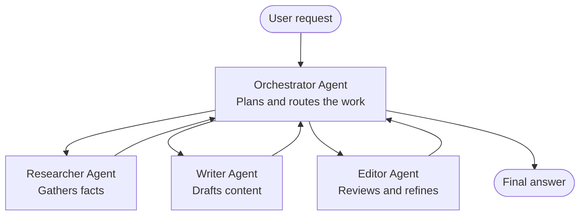

# Multi-Agent Basics - Deploy Your First Coordinated AI System

**Chapter Navigation:**
- **📚 Course Home**: [AZD For Beginners](../../README.md)
- **📖 Current Chapter**: Chapter 5 - Multi-Agent AI Solutions
- **⬅️ Previous**: [Chapter 4: Infrastructure](../chapter-04-infrastructure/README.md)
- **➡️ Next**: [Coordination Patterns](../chapter-06-pre-deployment/coordination-patterns.md)

> Validated against `azd 1.27.1` in July 2026.

## Introduction

In the earlier chapters you deployed a single application—and in Chapter 2 you deployed a single AI agent. This lesson takes the next step: deploying a **multi-agent system**, where several specialized agents work together to solve a problem no single agent could handle well on its own.

The good news for beginners: **you do not need new commands.** A multi-agent solution is still an azd project. You will `azd init`, `azd up`, test, and `azd down`—exactly the workflow you already know. What changes is the *shape* of the app inside.

## Learning Goals

By the end of this lesson, you will:
- Understand what "multi-agent" means and when it's worth the extra complexity
- Recognize the common roles in a multi-agent system (orchestrator + specialists)
- Deploy a real, working multi-agent template with `azd up`
- Understand the Azure resources that back a multi-agent app
- Know how to verify, customize, and tear down the solution safely

## Learning Outcomes

After completing this lesson, you will be able to:
- Explain the difference between a single agent and a multi-agent system
- Choose between a single agent with tools and a true multi-agent design
- Deploy and test a multi-agent template end to end with azd
- Identify where each agent runs and how they communicate
- Clean up all resources to avoid ongoing charges

---

## What Is a Multi-Agent System?

A single AI agent is one model with a set of instructions and (optionally) some tools. That works well for focused tasks. But as a task grows—research, then writing, then editing, then fact-checking—stuffing everything into one prompt makes the agent slower, less reliable, and harder to debug.

A **multi-agent system** breaks the work into specialists that each do one job well, coordinated by an orchestrator:



### The two roles you'll always see

| Role | Job | Example |
|------|-----|---------|
| **Orchestrator** | Decides *what happens next* and routes work between agents | "First research, then write, then edit" |
| **Specialist** | Does one focused job and returns a result | A "researcher" that only gathers facts |

### Do you actually need multiple agents?

Start simple. Reach for multi-agent **only** when one of these is true:

- ✅ The task has **distinct stages** that benefit from different instructions (research vs. write vs. review)
- ✅ You want specialists to run **in parallel** to save time
- ✅ Different steps need **different tools or data sources**
- ✅ You need each step to be **independently testable and debuggable**

If your task is a single question-and-answer or a simple tool call, a **single agent with tools** (Chapter 2) is simpler, cheaper, and easier to operate.

> **Beginner tip:** "More agents" is not "better." Every agent adds latency, cost, and a new thing to monitor. Add agents only when the problem clearly splits into parts.

---

## Two Ways to Build Multi-Agent on Azure

| Approach | What it is | Best for |
|----------|-----------|----------|
| **Single agent + tools** | One Foundry agent that calls functions/tools | Simple workflows, getting started |
| **Multiple coordinated agents** | Several agents with an orchestrator | Distinct stages, parallel work, specialization |

This lesson focuses on the second approach using a **ready-made template**, so you can see a real multi-agent system running before you build your own.

---

## Hands-On: Deploy a Working Multi-Agent App

We'll deploy **Contoso Creative Writer**, an official Azure sample that uses multiple agents (researcher, writer, editor) coordinated to produce an article. It's a great first multi-agent app because the roles are easy to understand.

### Step 1: Initialize the template

```bash
# Create a working folder
mkdir creative-writer && cd creative-writer

# Initialize from the official multi-agent template
azd init --template contoso-creative-writer
```

> Browse more multi-agent templates anytime in the [Awesome AZD AI gallery](https://azure.github.io/awesome-azd/?tags=ai). Other beginner-friendly options include `get-started-with-ai-agents` and `azure-ai-travel-agents`.

### Step 2: Authenticate

```bash
# Required for azd workflows
azd auth login
```

### Step 3: Create an environment

```bash
azd env new dev
```

### Step 4: Preview, then deploy

```bash
# See what will be created before spending anything (recommended)
azd provision --preview

# Provision infrastructure and deploy all agents in one step
azd up
```

`azd up` will prompt for a subscription and region, then provision the Azure resources and deploy the application. AI deployments can take longer than a simple web app—if you're deploying larger models, you can extend the deploy timeout:

```bash
azd deploy --timeout 1800
```

> **Heads up on cost and capacity:** Multi-agent apps deploy AI models that consume quota and incur cost. If `azd up` fails on model quota, see [AI Troubleshooting](../chapter-07-troubleshooting/ai-troubleshooting.md) for region and quota fixes, and Chapter 6 [Capacity Planning](../chapter-06-pre-deployment/capacity-planning.md).

---

## Understanding What You Deployed

A typical multi-agent app like this provisions a set of Azure resources that map directly to the responsibilities in the diagram above:

| Resource | Why it's there |
|----------|----------------|
| **Microsoft Foundry / Models** | Hosts the language models each agent uses |
| **Azure AI Search** | Gives the researcher agent grounded data to search |
| **Container Apps** (or App Service) | Hosts the orchestrator and agent code |
| **Cosmos DB** (in some samples) | Stores shared state/memory passed between agents |
| **Application Insights** | Traces requests *across* agents so you can debug the flow |

### How the agents talk to each other

In most azd multi-agent samples, the **orchestrator runs in your application code** (for example, using a framework like Semantic Kernel or the Microsoft Agent Framework). The orchestrator calls each specialist agent in turn, passes along the results, and assembles the final answer. The agents share context through:

- **Function/tool calls** — the orchestrator invokes a specialist and gets a result back
- **Shared memory** — a database (often Cosmos DB) holds state both agents can read
- **Messages/events** — for looser coupling, agents communicate via a queue or Service Bus

> **Why this matters for debugging:** because each step is separate, Application Insights shows you *which* agent was slow or failed. That's a major reason to split work across agents in the first place.

---

## Verify the Deployment

Confirm the system is actually working before moving on:

```bash
# Show the deployed endpoints
azd show

# Open the app's monitoring dashboard
azd monitor

# Tail logs if something looks off
azd monitor --logs
```

Then open the app URL from `azd show` and try a request that exercises all the agents (for Creative Writer, ask it to write a short article on a topic). In the Application Insights **transaction search**, you should see the request fan out across the researcher, writer, and editor steps.

**Success criteria:**
- ✅ `azd show` lists a reachable endpoint
- ✅ A request produces a result that clearly went through multiple stages
- ✅ Application Insights shows traces for more than one agent step

---

## Customize: Add or Adjust an Agent

Because each agent is just instructions plus tools, customizing is approachable:

1. **Find the agent definitions** in the template (often a `prompts/`, `agents/`, or `*.prompty` set of files).
2. **Tune an agent's instructions** — for example, tell the editor agent to enforce a specific tone or word count.
3. **Redeploy only the code** (infrastructure is unchanged):

   ```bash
   azd deploy
   ```

To go further and build agents from your *own* manifest, use the agent extension and its full lifecycle:

```bash
azd extension install azure.ai.agents
azd ai agent init -m agent-manifest.yaml
azd up
azd ai agent invoke      # test, with response timing
```

See [Chapter 2: Agents](../chapter-02-ai-development/agents.md) and the [AZD AI CLI reference](../chapter-08-production/production-ai-practices.md#azd-ai-cli-commands-and-extensions) for the complete agent lifecycle (`invoke`, `eval generate`, `optimize`, `delete`).

---

## Clean Up

Multi-agent apps run multiple billable services. Tear everything down when you're done:

```bash
azd down --force --purge
```

The `--purge` flag also removes soft-deleted AI resources (like Foundry/Azure AI Services accounts) so they don't block a future redeploy or keep incurring cost.

---

## A Note on Production Multi-Agent Systems

The [Retail Multi-Agent Solution](../../examples/retail-scenario.md) in this repo is an **architecture blueprint**, not a one-command template—it documents how a production retail system *would* be built (and is explicit that a full build is a substantial effort). Use it as a design reference *after* you've deployed a working sample here. For production concerns (resilience, cost, monitoring, governance), continue to [Chapter 8: Production AI Practices](../chapter-08-production/production-ai-practices.md).

---

## Summary

- A multi-agent system splits work across specialists coordinated by an orchestrator.
- Use it only when the task has distinct stages, parallelism, or different tools per step—otherwise prefer a single agent.
- The azd workflow is unchanged: `azd init` → `azd up` → test → `azd down`.
- A real template like `contoso-creative-writer` lets you see and customize a working multi-agent app today.
- Application Insights tracing across agents is one of the biggest practical benefits of the multi-agent design.

---

## 🔗 Navigation

| Direction | Lesson |
|-----------|--------|
| **Previous** | [Chapter 4: Infrastructure](../chapter-04-infrastructure/README.md) |
| **Next** | [Coordination Patterns](../chapter-06-pre-deployment/coordination-patterns.md) |

## 📖 Related Resources

- [AI Agents Guide](../chapter-02-ai-development/agents.md)
- [Coordination Patterns](../chapter-06-pre-deployment/coordination-patterns.md)
- [Production AI Practices](../chapter-08-production/production-ai-practices.md)
- [AI Troubleshooting](../chapter-07-troubleshooting/ai-troubleshooting.md)
