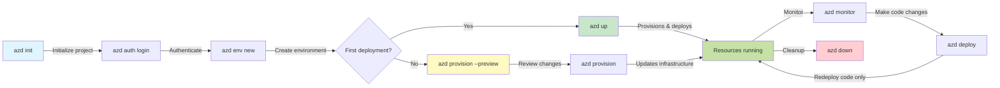
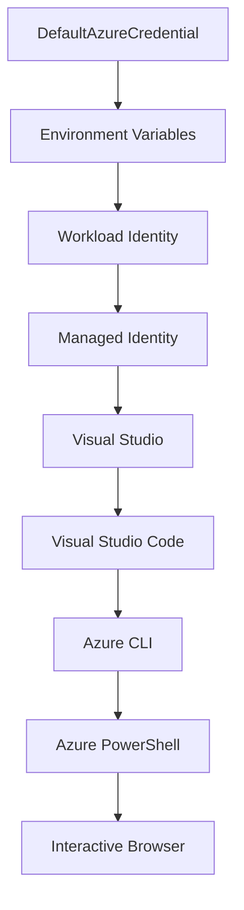

# AZD Basics - Understanding Azure Developer CLI

# AZD Basics - Core Concepts and Fundamentals

**Chapter Navigation:**
- **📚 Course Home**: [AZD For Beginners](../../README.md)
- **📖 Current Chapter**: Chapter 1 - Foundation & Quick Start
- **⬅️ Previous**: [Course Overview](../../README.md#-chapter-1-foundation--quick-start)
- **➡️ Next**: [Installation & Setup](installation.md)
- **🚀 Next Chapter**: [Chapter 2: AI-First Development](../microsoft-foundry/microsoft-foundry-integration.md)

## Introduction

This lesson introduces you to Azure Developer CLI (azd), a powerful command-line tool that accelerates your journey from local development to Azure deployment. You'll learn the fundamental concepts, core features, and understand how azd simplifies cloud-native application deployment.

## Learning Goals

By the end of this lesson, you will:
- Understand what Azure Developer CLI is and its primary purpose
- Learn the core concepts of templates, environments, and services
- Explore key features including template-driven development and Infrastructure as Code
- Understand the azd project structure and workflow
- Be prepared to install and configure azd for your development environment

## Learning Outcomes

After completing this lesson, you will be able to:
- Explain the role of azd in modern cloud development workflows
- Identify the components of an azd project structure
- Describe how templates, environments, and services work together
- Understand the benefits of Infrastructure as Code with azd
- Recognize different azd commands and their purposes

## What is Azure Developer CLI (azd)?

Azure Developer CLI (azd) is a command-line tool designed to accelerate your journey from local development to Azure deployment. It simplifies the process of building, deploying, and managing cloud-native applications on Azure.

### 🎯 Why Use AZD? A Real-World Comparison

Let's compare deploying a simple web app with database:

#### ❌ WITHOUT AZD: Manual Azure Deployment (30+ minutes)

```bash
# Step 1: Create resource group
az group create --name myapp-rg --location eastus

# Step 2: Create App Service Plan
az appservice plan create --name myapp-plan \
  --resource-group myapp-rg \
  --sku B1 --is-linux

# Step 3: Create Web App
az webapp create --name myapp-web-unique123 \
  --resource-group myapp-rg \
  --plan myapp-plan \
  --runtime "NODE:18-lts"

# Step 4: Create Cosmos DB account (10-15 minutes)
az cosmosdb create --name myapp-cosmos-unique123 \
  --resource-group myapp-rg \
  --kind MongoDB

# Step 5: Create database
az cosmosdb mongodb database create \
  --account-name myapp-cosmos-unique123 \
  --resource-group myapp-rg \
  --name tododb

# Step 6: Create collection
az cosmosdb mongodb collection create \
  --account-name myapp-cosmos-unique123 \
  --resource-group myapp-rg \
  --database-name tododb \
  --name todos

# Step 7: Get connection string
CONN_STR=$(az cosmosdb keys list \
  --name myapp-cosmos-unique123 \
  --resource-group myapp-rg \
  --type connection-strings \
  --query "connectionStrings[0].connectionString" -o tsv)

# Step 8: Configure app settings
az webapp config appsettings set \
  --name myapp-web-unique123 \
  --resource-group myapp-rg \
  --settings MONGODB_URI="$CONN_STR"

# Step 9: Enable logging
az webapp log config --name myapp-web-unique123 \
  --resource-group myapp-rg \
  --application-logging filesystem \
  --detailed-error-messages true

# Step 10: Set up Application Insights
az monitor app-insights component create \
  --app myapp-insights \
  --location eastus \
  --resource-group myapp-rg

# Step 11: Link App Insights to Web App
INSTRUMENTATION_KEY=$(az monitor app-insights component show \
  --app myapp-insights \
  --resource-group myapp-rg \
  --query "instrumentationKey" -o tsv)

az webapp config appsettings set \
  --name myapp-web-unique123 \
  --resource-group myapp-rg \
  --settings APPINSIGHTS_INSTRUMENTATIONKEY="$INSTRUMENTATION_KEY"

# Step 12: Build application locally
npm install
npm run build

# Step 13: Create deployment package
zip -r app.zip . -x "*.git*" "node_modules/*"

# Step 14: Deploy application
az webapp deployment source config-zip \
  --resource-group myapp-rg \
  --name myapp-web-unique123 \
  --src app.zip

# Step 15: Wait and pray it works 🙏
# (No automated validation, manual testing required)
```

**Problems:**
- ❌ 15+ commands to remember and execute in order
- ❌ 30-45 minutes of manual work
- ❌ Easy to make mistakes (typos, wrong parameters)
- ❌ Connection strings exposed in terminal history
- ❌ No automated rollback if something fails
- ❌ Hard to replicate for team members
- ❌ Different every time (not reproducible)

#### ✅ WITH AZD: Automated Deployment (5 commands, 10-15 minutes)

```bash
# Step 1: Initialize from template
azd init --template todo-nodejs-mongo

# Step 2: Authenticate
azd auth login

# Step 3: Create environment
azd env new dev

# Step 4: Preview changes (optional but recommended)
azd provision --preview

# Step 5: Deploy everything
azd up

# ✨ Done! Everything is deployed, configured, and monitored
```

**Benefits:**
- ✅ **5 commands** vs. 15+ manual steps
- ✅ **10-15 minutes** total time (mostly waiting for Azure)
- ✅ **Zero errors** - automated and tested
- ✅ **Secrets managed securely** via Key Vault
- ✅ **Automatic rollback** on failures
- ✅ **Fully reproducible** - same result every time
- ✅ **Team-ready** - anyone can deploy with same commands
- ✅ **Infrastructure as Code** - version controlled Bicep templates
- ✅ **Built-in monitoring** - Application Insights configured automatically

### 📊 Time & Error Reduction

| Metric | Manual Deployment | AZD Deployment | Improvement |
|:-------|:------------------|:---------------|:------------|
| **Commands** | 15+ | 5 | 67% fewer |
| **Time** | 30-45 min | 10-15 min | 60% faster |
| **Error Rate** | ~40% | <5% | 88% reduction |
| **Consistency** | Low (manual) | 100% (automated) | Perfect |
| **Team Onboarding** | 2-4 hours | 30 minutes | 75% faster |
| **Rollback Time** | 30+ min (manual) | 2 min (automated) | 93% faster |

## Core Concepts

### Templates
Templates are the foundation of azd. They contain:
- **Application code** - Your source code and dependencies
- **Infrastructure definitions** - Azure resources defined in Bicep or Terraform
- **Configuration files** - Settings and environment variables
- **Deployment scripts** - Automated deployment workflows

### Environments
Environments represent different deployment targets:
- **Development** - For testing and development
- **Staging** - Pre-production environment
- **Production** - Live production environment

Each environment maintains its own:
- Azure resource group
- Configuration settings
- Deployment state

### Services
Services are the building blocks of your application:
- **Frontend** - Web applications, SPAs
- **Backend** - APIs, microservices
- **Database** - Data storage solutions
- **Storage** - File and blob storage

## Key Features

### 1. Template-Driven Development
```bash
# Browse available templates
azd template list

# Initialize from a template
azd init --template <template-name>
```

### 2. Infrastructure as Code
- **Bicep** - Azure's domain-specific language
- **Terraform** - Multi-cloud infrastructure tool
- **ARM Templates** - Azure Resource Manager templates

### 3. Integrated Workflows
```bash
# Complete deployment workflow
azd up            # Provision + Deploy this is hands off for first time setup

# 🧪 NEW: Preview infrastructure changes before deployment (SAFE)
azd provision --preview    # Simulate infrastructure deployment without making changes

azd provision     # Create Azure resources if you update the infrastructure use this
azd deploy        # Deploy application code or redeploy application code once update
azd down          # Clean up resources
```

#### 🛡️ Safe Infrastructure Planning with Preview
The `azd provision --preview` command is a game-changer for safe deployments:
- **Dry-run analysis** - Shows what will be created, modified, or deleted
- **Zero risk** - No actual changes are made to your Azure environment
- **Team collaboration** - Share preview results before deployment
- **Cost estimation** - Understand resource costs before commitment

```bash
# Example preview workflow
azd provision --preview           # See what will change
# Review the output, discuss with team
azd provision                     # Apply changes with confidence
```

### 📊 Visual: AZD Development Workflow



**Workflow Explanation:**
1. **Init** - Start with template or new project
2. **Auth** - Authenticate with Azure
3. **Environment** - Create isolated deployment environment
4. **Preview** - 🆕 Always preview infrastructure changes first (safe practice)
5. **Provision** - Create/update Azure resources
6. **Deploy** - Push your application code
7. **Monitor** - Observe application performance
8. **Iterate** - Make changes and redeploy code
9. **Cleanup** - Remove resources when done

### 4. Environment Management
```bash
# Create and manage environments
azd env new <environment-name>
azd env select <environment-name>
azd env list
```

## 📁 Project Structure

A typical azd project structure:
```
my-app/
├── .azd/                    # azd configuration
│   └── config.json
├── .azure/                  # Azure deployment artifacts
├── .devcontainer/          # Development container config
├── .github/workflows/      # GitHub Actions
├── .vscode/               # VS Code settings
├── infra/                 # Infrastructure code
│   ├── main.bicep        # Main infrastructure template
│   ├── main.parameters.json
│   └── modules/          # Reusable modules
├── src/                  # Application source code
│   ├── api/             # Backend services
│   └── web/             # Frontend application
├── azure.yaml           # azd project configuration
└── README.md
```

## 🔧 Configuration Files

### azure.yaml
The main project configuration file:
```yaml
name: my-awesome-app
metadata:
  template: my-template@1.0.0

services:
  web:
    project: ./src/web
    language: js
    host: appservice
  api:
    project: ./src/api
    language: js
    host: appservice

hooks:
  preprovision:
    shell: pwsh
    run: echo "Preparing to provision..."
```

### .azure/config.json
Environment-specific configuration:
```json
{
  "version": 1,
  "defaultEnvironment": "dev",
  "environments": {
    "dev": {
      "subscriptionId": "your-subscription-id",
      "location": "eastus"
    }
  }
}
```

## 🎪 Common Workflows with Hands-On Exercises

> **💡 Learning Tip:** Follow these exercises in order to build your AZD skills progressively.

### 🎯 Exercise 1: Initialize Your First Project

**Goal:** Create an AZD project and explore its structure

**Steps:**
```bash
# Use a proven template
azd init --template todo-nodejs-mongo

# Explore the generated files
ls -la  # View all files including hidden ones

# Key files created:
# - azure.yaml (main config)
# - infra/ (infrastructure code)
# - src/ (application code)
```

**✅ Success:** You have azure.yaml, infra/, and src/ directories

---

### 🎯 Exercise 2: Deploy to Azure

**Goal:** Complete end-to-end deployment

**Steps:**
```bash
# 1. Authenticate
az login && azd auth login

# 2. Create environment
azd env new dev
azd env set AZURE_LOCATION eastus

# 3. Preview changes (RECOMMENDED)
azd provision --preview

# 4. Deploy everything
azd up

# 5. Verify deployment
azd show    # View your app URL
```

**Expected Time:** 10-15 minutes  
**✅ Success:** Application URL opens in browser

---

### 🎯 Exercise 3: Multiple Environments

**Goal:** Deploy to dev and staging

**Steps:**
```bash
# Already have dev, create staging
azd env new staging
azd env set AZURE_LOCATION westus2
azd up

# Switch between them
azd env list
azd env select dev
```

**✅ Success:** Two separate resource groups in Azure Portal

---

### 🛡️ Clean Slate: `azd down --force --purge`

When you need to completely reset:

```bash
azd down --force --purge
```

**What it does:**
- `--force`: No confirmation prompts
- `--purge`: Deletes all local state and Azure resources

**Use when:**
- Deployment failed mid-way
- Switching projects
- Need fresh start

---

## 🎪 Original Workflow Reference

### Starting a New Project
```bash
# Method 1: Use existing template
azd init --template todo-nodejs-mongo

# Method 2: Start from scratch
azd init

# Method 3: Use current directory
azd init .
```

### Development Cycle
```bash
# Set up development environment
azd auth login
azd env new dev
azd env select dev

# Deploy everything
azd up

# Make changes and redeploy
azd deploy

# Clean up when done
azd down --force --purge # command in the Azure Developer CLI is a **hard reset** for your environment—especially useful when you're troubleshooting failed deployments, cleaning up orphaned resources, or prepping for a fresh redeploy.
```

## Understanding `azd down --force --purge`
The `azd down --force --purge` command is a powerful way to completely tear down your azd environment and all associated resources. Here's a breakdown of what each flag does:
```
--force
```
- Skips confirmation prompts.
- Useful for automation or scripting where manual input isn’t feasible.
- Ensures the teardown proceeds without interruption, even if the CLI detects inconsistencies.

```
--purge
```
Deletes **all associated metadata**, including:
Environment state
Local `.azure` folder
Cached deployment info
Prevents azd from "remembering" previous deployments, which can cause issues like mismatched resource groups or stale registry references.


### Why use both?
When you've hit a wall with `azd up` due to lingering state or partial deployments, this combo ensures a **clean slate**.

It’s especially helpful after manual resource deletions in the Azure portal or when switching templates, environments, or resource group naming conventions.


### Managing Multiple Environments
```bash
# Create staging environment
azd env new staging
azd env select staging
azd up

# Switch back to dev
azd env select dev

# Compare environments
azd env list
```

## 🔐 Authentication and Credentials

Understanding authentication is crucial for successful azd deployments. Azure uses multiple authentication methods, and azd leverages the same credential chain used by other Azure tools.

### Azure CLI Authentication (`az login`)

Before using azd, you need to authenticate with Azure. The most common method is using Azure CLI:

```bash
# Interactive login (opens browser)
az login

# Login with specific tenant
az login --tenant <tenant-id>

# Login with service principal
az login --service-principal -u <app-id> -p <password> --tenant <tenant-id>

# Check current login status
az account show

# List available subscriptions
az account list --output table

# Set default subscription
az account set --subscription <subscription-id>
```

### Authentication Flow
1. **Interactive Login**: Opens your default browser for authentication
2. **Device Code Flow**: For environments without browser access
3. **Service Principal**: For automation and CI/CD scenarios
4. **Managed Identity**: For Azure-hosted applications

### DefaultAzureCredential Chain

`DefaultAzureCredential` is a credential type that provides a simplified authentication experience by automatically trying multiple credential sources in a specific order:

#### Credential Chain Order


#### 1. Environment Variables
```bash
# Set environment variables for service principal
export AZURE_CLIENT_ID="<app-id>"
export AZURE_CLIENT_SECRET="<password>"
export AZURE_TENANT_ID="<tenant-id>"
```

#### 2. Workload Identity (Kubernetes/GitHub Actions)
Used automatically in:
- Azure Kubernetes Service (AKS) with Workload Identity
- GitHub Actions with OIDC federation
- Other federated identity scenarios

#### 3. Managed Identity
For Azure resources like:
- Virtual Machines
- App Service
- Azure Functions
- Container Instances

```bash
# Check if running on Azure resource with managed identity
az account show --query "user.type" --output tsv
# Returns: "servicePrincipal" if using managed identity
```

#### 4. Developer Tools Integration
- **Visual Studio**: Automatically uses signed-in account
- **VS Code**: Uses Azure Account extension credentials
- **Azure CLI**: Uses `az login` credentials (most common for local development)

### AZD Authentication Setup

```bash
# Method 1: Use Azure CLI (Recommended for development)
az login
azd auth login  # Uses existing Azure CLI credentials

# Method 2: Direct azd authentication
azd auth login --use-device-code  # For headless environments

# Method 3: Check authentication status
azd auth login --check-status

# Method 4: Logout and re-authenticate
azd auth logout
azd auth login
```

### Authentication Best Practices

#### For Local Development
```bash
# 1. Login with Azure CLI
az login

# 2. Verify correct subscription
az account show
az account set --subscription "Your Subscription Name"

# 3. Use azd with existing credentials
azd auth login
```

#### For CI/CD Pipelines
```yaml
# GitHub Actions example
- name: Azure Login
  uses: azure/login@v1
  with:
    creds: ${{ secrets.AZURE_CREDENTIALS }}

- name: Deploy with azd
  run: |
    azd auth login --client-id ${{ secrets.AZURE_CLIENT_ID }} \
                    --client-secret ${{ secrets.AZURE_CLIENT_SECRET }} \
                    --tenant-id ${{ secrets.AZURE_TENANT_ID }}
    azd up --no-prompt
```

#### For Production Environments
- Use **Managed Identity** when running on Azure resources
- Use **Service Principal** for automation scenarios
- Avoid storing credentials in code or configuration files
- Use **Azure Key Vault** for sensitive configuration

### Common Authentication Issues and Solutions

#### Issue: "No subscription found"
```bash
# Solution: Set default subscription
az account list --output table
az account set --subscription "<subscription-id>"
azd env set AZURE_SUBSCRIPTION_ID "<subscription-id>"
```

#### Issue: "Insufficient permissions"
```bash
# Solution: Check and assign required roles
az role assignment list --assignee $(az account show --query user.name --output tsv)

# Common required roles:
# - Contributor (for resource management)
# - User Access Administrator (for role assignments)
```

#### Issue: "Token expired"
```bash
# Solution: Re-authenticate
az logout
az login
azd auth logout
azd auth login
```

### Authentication in Different Scenarios

#### Local Development
```bash
# Personal development account
az login
azd auth login
```

#### Team Development
```bash
# Use specific tenant for organization
az login --tenant contoso.onmicrosoft.com
azd auth login
```

#### Multi-tenant Scenarios
```bash
# Switch between tenants
az login --tenant tenant1.onmicrosoft.com
# Deploy to tenant 1
azd up

az login --tenant tenant2.onmicrosoft.com  
# Deploy to tenant 2
azd up
```

### Security Considerations

1. **Credential Storage**: Never store credentials in source code
2. **Scope Limitation**: Use least-privilege principle for service principals
3. **Token Rotation**: Regularly rotate service principal secrets
4. **Audit Trail**: Monitor authentication and deployment activities
5. **Network Security**: Use private endpoints when possible

### Troubleshooting Authentication

```bash
# Debug authentication issues
azd auth login --check-status
az account show
az account get-access-token

# Common diagnostic commands
whoami                          # Current user context
az ad signed-in-user show      # Azure AD user details
az group list                  # Test resource access
```

## Understanding `azd down --force --purge`

### Discovery
```bash
azd template list              # Browse templates
azd template show <template>   # Template details
azd init --help               # Initialization options
```

### Project Management
```bash
azd show                     # Project overview
azd env show                 # Current environment
azd config list             # Configuration settings
```

### Monitoring
```bash
azd monitor                  # Open Azure portal
azd pipeline config          # Set up CI/CD
azd logs                     # View application logs
```

## Best Practices

### 1. Use Meaningful Names
```bash
# Good
azd env new production-east
azd init --template web-app-secure

# Avoid
azd env new env1
azd init --template template1
```

### 2. Leverage Templates
- Start with existing templates
- Customize for your needs
- Create reusable templates for your organization

### 3. Environment Isolation
- Use separate environments for dev/staging/prod
- Never deploy directly to production from local machine
- Use CI/CD pipelines for production deployments

### 4. Configuration Management
- Use environment variables for sensitive data
- Keep configuration in version control
- Document environment-specific settings

## Learning Progression

### Beginner (Week 1-2)
1. Install azd and authenticate
2. Deploy a simple template
3. Understand project structure
4. Learn basic commands (up, down, deploy)

### Intermediate (Week 3-4)
1. Customize templates
2. Manage multiple environments
3. Understand infrastructure code
4. Set up CI/CD pipelines

### Advanced (Week 5+)
1. Create custom templates
2. Advanced infrastructure patterns
3. Multi-region deployments
4. Enterprise-grade configurations

## Next Steps

**📖 Continue Chapter 1 Learning:**
- [Installation & Setup](installation.md) - Get azd installed and configured
- [Your First Project](first-project.md) - Complete hands-on tutorial
- [Configuration Guide](configuration.md) - Advanced configuration options

**🎯 Ready for Next Chapter?**
- [Chapter 2: AI-First Development](../microsoft-foundry/microsoft-foundry-integration.md) - Start building AI applications

## Additional Resources

- [Azure Developer CLI Overview](https://learn.microsoft.com/en-us/azure/developer/azure-developer-cli/)
- [Template Gallery](https://azure.github.io/awesome-azd/)
- [Community Samples](https://github.com/Azure-Samples)

---

## 🙋 Frequently Asked Questions

### General Questions

**Q: What's the difference between AZD and Azure CLI?**

A: Azure CLI (`az`) is for managing individual Azure resources. AZD (`azd`) is for managing entire applications:

```bash
# Azure CLI - Low-level resource management
az webapp create --name myapp --resource-group rg
az sql server create --name myserver --resource-group rg
# ...many more commands needed

# AZD - Application-level management
azd up  # Deploys entire app with all resources
```

**Think of it this way:**
- `az` = Operating on individual Lego bricks
- `azd` = Working with complete Lego sets

---

**Q: Do I need to know Bicep or Terraform to use AZD?**

A: No! Start with templates:
```bash
# Use existing template - no IaC knowledge needed
azd init --template todo-nodejs-mongo
azd up
```

You can learn Bicep later to customize infrastructure. Templates provide working examples to learn from.

---

**Q: How much does it cost to run AZD templates?**

A: Costs vary by template. Most development templates cost $50-150/month:

```bash
# Preview costs before deploying
azd provision --preview

# Always cleanup when not using
azd down --force --purge  # Removes all resources
```

**Pro tip:** Use free tiers where available:
- App Service: F1 (Free) tier
- Azure OpenAI: 50,000 tokens/month free
- Cosmos DB: 1000 RU/s free tier

---

**Q: Can I use AZD with existing Azure resources?**

A: Yes, but it's easier to start fresh. AZD works best when it manages the full lifecycle. For existing resources:

```bash
# Option 1: Import existing resources (advanced)
azd init
# Then modify infra/ to reference existing resources

# Option 2: Start fresh (recommended)
azd init --template matching-your-stack
azd up  # Creates new environment
```

---

**Q: How do I share my project with teammates?**

A: Commit the AZD project to Git (but NOT the .azure folder):

```bash
# Already in .gitignore by default
.azure/        # Contains secrets and environment data
*.env          # Environment variables

# Team members then:
git clone <your-repo>
azd auth login
azd env new <their-name>-dev
azd up
```

Everyone gets identical infrastructure from the same templates.

---

### Troubleshooting Questions

**Q: "azd up" failed halfway. What do I do?**

A: Check the error, fix it, then retry:

```bash
# View detailed logs
azd show

# Common fixes:

# 1. If quota exceeded:
azd env set AZURE_LOCATION "westus2"  # Try different region

# 2. If resource name conflict:
azd down --force --purge  # Clean slate
azd up  # Retry

# 3. If auth expired:
az login
azd auth login
azd up
```

**Most common issue:** Wrong Azure subscription selected
```bash
az account list --output table
az account set --subscription "<correct-subscription>"
```

---

**Q: How do I deploy just code changes without reprovisioning?**

A: Use `azd deploy` instead of `azd up`:

```bash
azd up          # First time: provision + deploy (slow)

# Make code changes...

azd deploy      # Subsequent times: deploy only (fast)
```

Speed comparison:
- `azd up`: 10-15 minutes (provisions infrastructure)
- `azd deploy`: 2-5 minutes (code only)

---

**Q: Can I customize the infrastructure templates?**

A: Yes! Edit the Bicep files in `infra/`:

```bash
# After azd init
cd infra/
code main.bicep  # Edit in VS Code

# Preview changes
azd provision --preview

# Apply changes
azd provision
```

**Tip:** Start small - change SKUs first:
```bicep
// infra/main.bicep
sku: {
  name: 'B1'  // Change to 'P1V2' for production
}
```

---

**Q: How do I delete everything AZD created?**

A: One command removes all resources:

```bash
azd down --force --purge

# This deletes:
# - All Azure resources
# - Resource group
# - Local environment state
# - Cached deployment data
```

**Always run this when:**
- Finished testing a template
- Switching to different project
- Want to start fresh

**Cost savings:** Deleting unused resources = $0 charges

---

**Q: What if I accidentally deleted resources in Azure Portal?**

A: AZD state can get out of sync. Clean slate approach:

```bash
# 1. Remove local state
azd down --force --purge

# 2. Start fresh
azd up

# Alternative: Let AZD detect and fix
azd provision  # Will create missing resources
```

---

### Advanced Questions

**Q: Can I use AZD in CI/CD pipelines?**

A: Yes! GitHub Actions example:

```yaml
# .github/workflows/deploy.yml
name: Deploy with AZD

on:
  push:
    branches: [main]

jobs:
  deploy:
    runs-on: ubuntu-latest
    steps:
      - uses: actions/checkout@v2
      
      - name: Install azd
        run: curl -fsSL https://aka.ms/install-azd.sh | bash
      
      - name: Azure Login
        run: |
          azd auth login \
            --client-id ${{ secrets.AZURE_CLIENT_ID }} \
            --client-secret ${{ secrets.AZURE_CLIENT_SECRET }} \
            --tenant-id ${{ secrets.AZURE_TENANT_ID }}
      
      - name: Deploy
        run: azd up --no-prompt
```

---

**Q: How do I handle secrets and sensitive data?**

A: AZD integrates with Azure Key Vault automatically:

```bash
# Secrets are stored in Key Vault, not in code
azd env set DATABASE_PASSWORD "$(openssl rand -base64 32)"

# AZD automatically:
# 1. Creates Key Vault
# 2. Stores secret
# 3. Grants app access via Managed Identity
# 4. Injects at runtime
```

**Never commit:**
- `.azure/` folder (contains environment data)
- `.env` files (local secrets)
- Connection strings

---

**Q: Can I deploy to multiple regions?**

A: Yes, create environment per region:

```bash
# East US environment
azd env new prod-eastus
azd env set AZURE_LOCATION eastus
azd up

# West Europe environment
azd env new prod-westeurope
azd env set AZURE_LOCATION westeurope
azd up

# Each environment is independent
azd env list
```

For true multi-region apps, customize Bicep templates to deploy to multiple regions simultaneously.

---

**Q: Where can I get help if I'm stuck?**

1. **AZD Documentation:** https://learn.microsoft.com/azure/developer/azure-developer-cli/
2. **GitHub Issues:** https://github.com/Azure/azure-dev/issues
3. **Discord:** [Azure Discord](https://discord.gg/microsoft-azure) - #azure-developer-cli channel
4. **Stack Overflow:** Tag `azure-developer-cli`
5. **This Course:** [Troubleshooting Guide](../troubleshooting/common-issues.md)

**Pro tip:** Before asking, run:
```bash
azd show       # Shows current state
azd version    # Shows your version
```
Include this info in your question for faster help.

---

## 🎓 What's Next?

You now understand AZD fundamentals. Choose your path:

### 🎯 For Beginners:
1. **Next:** [Installation & Setup](installation.md) - Install AZD on your machine
2. **Then:** [Your First Project](first-project.md) - Deploy your first app
3. **Practice:** Complete all 3 exercises in this lesson

### 🚀 For AI Developers:
1. **Skip to:** [Chapter 2: AI-First Development](../microsoft-foundry/microsoft-foundry-integration.md)
2. **Deploy:** Start with `azd init --template get-started-with-ai-chat`
3. **Learn:** Build while you deploy

### 🏗️ For Experienced Developers:
1. **Review:** [Configuration Guide](configuration.md) - Advanced settings
2. **Explore:** [Infrastructure as Code](../deployment/provisioning.md) - Bicep deep dive
3. **Build:** Create custom templates for your stack

---

**Chapter Navigation:**
- **📚 Course Home**: [AZD For Beginners](../../README.md)
- **📖 Current Chapter**: Chapter 1 - Foundation & Quick Start  
- **⬅️ Previous**: [Course Overview](../../README.md#-chapter-1-foundation--quick-start)
- **➡️ Next**: [Installation & Setup](installation.md)
- **🚀 Next Chapter**: [Chapter 2: AI-First Development](../microsoft-foundry/microsoft-foundry-integration.md)