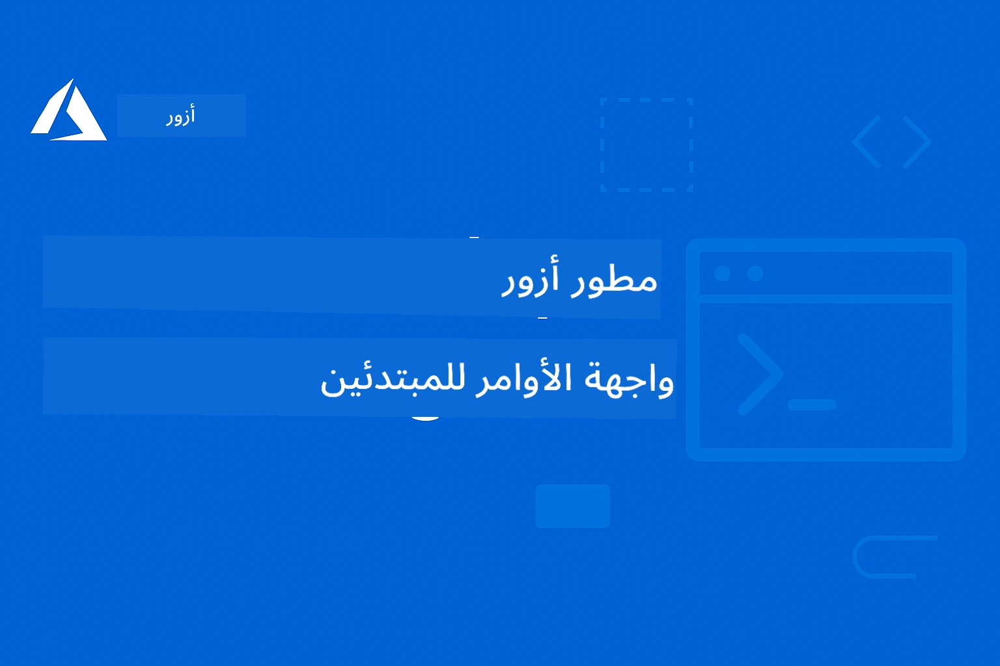

# AZD للمبتدئين: رحلة تعليمية منظمة

 

[](https://GitHub.com/microsoft/azd-for-beginners/watchers/)
[](https://GitHub.com/microsoft/azd-for-beginners/network/)
[](https://GitHub.com/microsoft/azd-for-beginners/stargazers/)

[](https://discord.gg/microsoft-azure)
[](https://discord.gg/nTYy5BXMWG)

## البدء مع هذا الدرس

اتبع هذه الخطوات لبدء رحلتك التعليمية في AZD:

1. **استنساخ المخزن (Fork the Repository)**: انقر [](https://GitHub.com/microsoft/azd-for-beginners/fork)
2. **نسخ المخزن محليًا (Clone the Repository)**: `git clone https://github.com/microsoft/azd-for-beginners.git`
3. **انضم إلى المجتمع**: [مجتمعات Azure Discord](https://discord.com/invite/ByRwuEEgH4) للدعم من الخبراء
4. **اختر مسار التعلم الخاص بك**: حدد الفصل أدناه الذي يتناسب مع مستوى خبرتك

### دعم متعدد اللغات

#### الترجمات الآلية (دائماً محدثة)

<!-- CO-OP TRANSLATOR LANGUAGES TABLE START -->
[العربية](./README.md) | [البنغالية](../bn/README.md) | [البلغارية](../bg/README.md) | [البورمية (ميانمار)](../my/README.md) | [الصينية (المبسطة)](../zh-CN/README.md) | [الصينية (التقليدية، هونغ كونغ)](../zh-HK/README.md) | [الصينية (التقليدية، ماكاو)](../zh-MO/README.md) | [الصينية (التقليدية، تايوان)](../zh-TW/README.md) | [الكرواتية](../hr/README.md) | [التشيكية](../cs/README.md) | [الدانماركية](../da/README.md) | [الهولندية](../nl/README.md) | [الإستونية](../et/README.md) | [الفنلندية](../fi/README.md) | [الفرنسية](../fr/README.md) | [الألمانية](../de/README.md) | [اليونانية](../el/README.md) | [العبرية](../he/README.md) | [الهندية](../hi/README.md) | [الهنغارية](../hu/README.md) | [الإندونيسية](../id/README.md) | [الإيطالية](../it/README.md) | [اليابانية](../ja/README.md) | [الكانادا](../kn/README.md) | [الكورية](../ko/README.md) | [الليتوانية](../lt/README.md) | [الملايو](../ms/README.md) | [المالايالامية](../ml/README.md) | [الماراثية](../mr/README.md) | [النيبالية](../ne/README.md) | [النيجيرية بيدجين](../pcm/README.md) | [النرويجية](../no/README.md) | [الفارسية (الفارسية)](../fa/README.md) | [البولندية](../pl/README.md) | [البرتغالية (البرازيل)](../pt-BR/README.md) | [البرتغالية (البرتغال)](../pt-PT/README.md) | [البنجابية (غورموخي)](../pa/README.md) | [الرومانية](../ro/README.md) | [الروسية](../ru/README.md) | [الصربية (السيريلية)](../sr/README.md) | [السلوفاكية](../sk/README.md) | [السلوفينية](../sl/README.md) | [الإسبانية](../es/README.md) | [السواحلية](../sw/README.md) | [السويدية](../sv/README.md) | [التاغالوغ (الفلبينية)](../tl/README.md) | [التاميل](../ta/README.md) | [التيلجو](../te/README.md) | [التايلاندية](../th/README.md) | [التركية](../tr/README.md) | [الأوكرانية](../uk/README.md) | [الأردية](../ur/README.md) | [الفيتنامية](../vi/README.md)

> **هل تفضل الاستنساخ محليًا؟**

> يتضمن هذا المستودع أكثر من 50 ترجمة للغات مما يزيد بشكل كبير من حجم التنزيل. للاستنساخ بدون الترجمات، استخدم sparse checkout:
> ```bash
> git clone --filter=blob:none --sparse https://github.com/microsoft/AZD-for-beginners.git
> cd AZD-for-beginners
> git sparse-checkout set --no-cone '/*' '!translations' '!translated_images'
> ```
> هذا يمنحك كل ما تحتاجه لإكمال الدورة بسرعة تنزيل أعلى.
<!-- CO-OP TRANSLATOR LANGUAGES TABLE END -->

## نظرة عامة على الدورة

تعلّم Azure Developer CLI (azd) من خلال فصول منظمة مصممة للتعلم التدريجي. **تركيز خاص على نشر تطبيقات الذكاء الاصطناعي مع تكامل Microsoft Foundry.**

### لماذا هذه الدورة ضرورية للمطورين المعاصرين

استنادًا إلى رؤى مجتمع Microsoft Foundry في ديسكورد، **45% من المطورين يرغبون في استخدام AZD لأعباء عمل الذكاء الاصطناعي** لكن يواجهون تحديات مثل:
- أطر عمل الذكاء الاصطناعي متعددة الخدمات المعقدة
- أفضل ممارسات نشر الذكاء الاصطناعي في الإنتاج  
- تكامل وخدمات ذكية لـ Azure AI
- تحسين التكاليف لأعباء عمل الذكاء الاصطناعي
- استكشاف الأخطاء المتعلقة بنشر الذكاء الاصطناعي وتصحيحها

### أهداف التعلم

بنهاية هذه الدورة المنظمة، ستتمكن من:
- **إتقان أساسيات AZD**: المفاهيم الأساسية، التثبيت، والإعداد
- **نشر تطبيقات الذكاء الاصطناعي**: استخدام AZD مع خدمات Microsoft Foundry
- **تنفيذ البنية التحتية كرمز**: إدارة موارد Azure باستخدام قوالب Bicep
- **استكشاف المشكلات وحلها**: إصلاح الأخطاء وتصحيح المشكلات
- **التحسين للإنتاج**: الأمان، التوسع، المراقبة، وإدارة التكاليف
- **بناء حلول متعددة الوكلاء**: نشر معماريات الذكاء الاصطناعي المعقدة

## 📚 فصول التعلم

*اختر مسار التعلم بناءً على مستوى خبرتك وأهدافك*

### 🚀 الفصل 1: الأساسيات والبداية السريعة
**المتطلبات**: اشتراك Azure، معرفة أساسية بسطر الأوامر  
**المدة**: 30-45 دقيقة  
**التعقيد**: ⭐

#### ما ستتعلمه
- فهم أساسيات Azure Developer CLI
- تثبيت AZD على منصتك
- أول عملية نشر ناجحة لك

#### مصادر التعلم
- **🎯 ابدأ هنا**: [ما هو Azure Developer CLI؟](../..)
- **📖 نظرية**: [أساسيات AZD](docs/getting-started/azd-basics.md) - المفاهيم والمصطلحات الأساسية
- **⚙️ الإعداد**: [التثبيت والإعداد](docs/getting-started/installation.md) - أدلة حسب المنصة
- **🛠️ التطبيق العملي**: [مشروعك الأول](docs/getting-started/first-project.md) - دورة تعليمية خطوة بخطوة
- **📋 المرجع السريع**: [ورقة غش الأوامر](resources/cheat-sheet.md)

#### تمرينات عملية
```bash
# فحص التثبيت السريع
azd version

# انشر تطبيقك الأول
azd init --template todo-nodejs-mongo
azd up
```

**💡 نتيجة الفصل**: نشر تطبيق ويب بسيط إلى Azure باستخدام AZD بنجاح

**✅ تحقق من النجاح:**
```bash
# بعد إكمال الفصل الأول، يجب أن تكون قادرًا على:
azd version              # يعرض النسخة المثبتة
azd init --template todo-nodejs-mongo  # يهيئ المشروع
azd up                  # ينشر على أزور
azd show                # يعرض رابط التطبيق الجاري تشغيله
# يفتح التطبيق في المتصفح ويعمل
azd down --force --purge  # ينظف الموارد
```

**📊 الوقت المستغرق:** 30-45 دقيقة  
**📈 المستوى بعد الإكمال:** قادر على نشر التطبيقات الأساسية بشكل مستقل

**✅ تحقق من النجاح:**
```bash
# بعد إكمال الفصل الأول، يجب أن تكون قادرًا على:
azd version              # يعرض الإصدار المثبت
azd init --template todo-nodejs-mongo  # يهيئ المشروع
azd up                  # ينشر إلى أزورو
azd show                # يعرض عنوان URL للتطبيق قيد التشغيل
# يفتح التطبيق في المتصفح ويعمل
azd down --force --purge  # ينظف الموارد
```

**📊 الوقت المستغرق:** 30-45 دقيقة  
**📈 المستوى بعد الإكمال:** قادر على نشر التطبيقات الأساسية بشكل مستقل

---

### 🤖 الفصل 2: تطوير الذكاء الاصطناعي أولاً (مُوصى به لمطوري الذكاء الاصطناعي)
**المتطلبات**: إكمال الفصل 1  
**المدة**: 1-2 ساعة  
**التعقيد**: ⭐⭐

#### ما ستتعلمه
- تكامل Microsoft Foundry مع AZD
- نشر تطبيقات مدعومة بالذكاء الاصطناعي
- فهم تكوينات خدمات الذكاء الاصطناعي

#### مصادر التعلم
- **🎯 ابدأ هنا**: [تكامل Microsoft Foundry](docs/microsoft-foundry/microsoft-foundry-integration.md)
- **📖 الأنماط**: [نشر نماذج الذكاء الاصطناعي](docs/microsoft-foundry/ai-model-deployment.md) - نشر وإدارة نماذج الذكاء الاصطناعي
- **🛠️ مختبر الورشة**: [مختبر ورشة الذكاء الاصطناعي](docs/microsoft-foundry/ai-workshop-lab.md) - اجعل حلول الذكاء الاصطناعي الخاصة بك جاهزة لـ AZD
- **🎥 دليل تفاعلي**: [مواد الورشة](workshop/README.md) - تعليم متصفح مع MkDocs * بيئة DevContainer
- **📋 القوالب**: [قوالب Microsoft Foundry المميزة](../..)
- **📝 أمثلة**: [أمثلة نشر AZD](examples/README.md)

#### تمرينات عملية
```bash
# قم بنشر تطبيق الذكاء الاصطناعي الأول الخاص بك
azd init --template azure-search-openai-demo
azd up

# جرّب قوالب ذكاء اصطناعي إضافية
azd init --template openai-chat-app-quickstart
azd init --template agent-openai-python-prompty
```

**💡 نتيجة الفصل**: نشر وتكوين تطبيق دردشة مدعوم بالذكاء الاصطناعي مع قدرات RAG

**✅ تحقق من النجاح:**
```bash
# بعد الفصل 2، يجب أن تكون قادرًا على:
azd init --template azure-search-openai-demo
azd up
# اختبار واجهة الدردشة بالذكاء الاصطناعي
# طرح الأسئلة والحصول على ردود مدعومة بالذكاء الاصطناعي مع المصادر
# التحقق من عمل تكامل البحث
azd monitor  # التحقق من أن Application Insights تعرض بيانات القياس Telemetry
azd down --force --purge
```

**📊 الوقت المستغرق:** 1-2 ساعة  
**📈 المستوى بعد الإكمال:** يمكنه نشر وتكوين تطبيقات ذكاء اصطناعي جاهزة للإنتاج  
**💰 الوعي بالتكاليف:** فهم تكاليف التطوير الشهرية بين 80-150 دولار وتكاليف الإنتاج بين 300-3500 دولار شهرياً

#### 💰 اعتبارات التكلفة لنشر الذكاء الاصطناعي

**بيئة التطوير (تقديرية 80-150 دولار شهرياً):**
- Azure OpenAI (الدفع حسب الاستخدام): 0-50 دولار شهرياً (حسب استخدام الرموز)
- AI Search (الطبقة الأساسية): 75 دولار شهرياً
- Container Apps (الاستهلاك): 0-20 دولار شهرياً
- التخزين (القياسي): 1-5 دولار شهرياً

**بيئة الإنتاج (تقديرية 300-3500+ دولار شهرياً):**
- Azure OpenAI (PTU للأداء المستقر): 3000+ دولار شهرياً أو الدفع حسب الاستخدام مع حجم عالٍ
- AI Search (الطبقة القياسية): 250 دولار شهرياً
- Container Apps (المخصصة): 50-100 دولار شهرياً
- Application Insights: 5-50 دولار شهرياً
- التخزين (المميز): 10-50 دولار شهرياً

**💡 نصائح تحسين التكاليف:**
- استخدم **الطبقة المجانية** من Azure OpenAI للتعلم (يشمل 50,000 رمز شهرياً)
- شغل `azd down` لتحرير الموارد عند عدم التطوير الفعلي
- ابدأ بالفوترة حسب الاستهلاك، ثم ترقَّ للـ PTU فقط للإنتاج
- استخدم `azd provision --preview` لتقدير التكاليف قبل النشر
- فعل التوسع التلقائي والدفع فقط حسب الاستخدام الفعلي

**مراقبة التكاليف:**
```bash
# تحقق من التكاليف الشهرية المقدرة
azd provision --preview

# راقب التكاليف الفعلية في بوابة أزور
az consumption budget list --resource-group <your-rg>
```

---

### ⚙️ الفصل 3: التهيئة والمصادقة
**المتطلبات**: إكمال الفصل 1  
**المدة**: 45-60 دقيقة  
**التعقيد**: ⭐⭐

#### ما ستتعلمه
- تهيئة البيئة وإدارتها
- أفضل الممارسات للأمان والمصادقة
- تسمية الموارد والتنظيم

#### مصادر التعلم
- **📖 التهيئة**: [دليل التهيئة](docs/getting-started/configuration.md) - إعداد البيئة
- **🔐 الأمان**: [نماذج المصادقة والهوية المُدارة](docs/getting-started/authsecurity.md) - نماذج المصادقة
- **📝 أمثلة**: [مثال تطبيق قاعدة بيانات](examples/database-app/README.md) - أمثلة قاعدة بيانات AZD

#### تمرينات عملية
- تهيئة بيئات متعددة (تطوير، اختبار، إنتاج)
- إعداد مصادقة الهوية المُدارة
- تنفيذ الإعدادات الخاصة بكل بيئة

**💡 نتيجة الفصل**: إدارة بيئات متعددة مع مصادقة وأمان صحيحين

---

### 🏗️ الفصل 4: البنية التحتية كرمز والنشر
**المتطلبات**: إكمال الفصول 1-3  
**المدة**: 1-1.5 ساعة  
**التعقيد**: ⭐⭐⭐

#### ما ستتعلمه
- أنماط النشر المتقدمة
- البنية التحتية كرمز باستخدام Bicep
- استراتيجيات توفير الموارد

#### مصادر التعلم
- **📖 النشر**: [دليل النشر](docs/deployment/deployment-guide.md) - سير العمل الكامل
- **🏗️ التوفير**: [توفير الموارد](docs/deployment/provisioning.md) - إدارة موارد Azure
- **📝 أمثلة**: [مثال تطبيق الحاويات](../../examples/container-app) - نشر التطبيقات المعبأة بالحاويات

#### تمرينات عملية
- إنشاء قوالب Bicep مخصصة
- نشر تطبيقات متعددة الخدمات
- تنفيذ استراتيجيات النشر الأزرق-الأخضر

**💡 نتيجة الفصل**: نشر تطبيقات متعددة الخدمات المعقدة باستخدام قوالب بنية تحتية مخصصة

---

### 🎯 الفصل 5: حلول الذكاء الاصطناعي المتعددة الوكلاء (متقدم)
**المتطلبات**: إكمال الفصول 1-2  
**المدة**: 2-3 ساعات  
**التعقيد**: ⭐⭐⭐⭐
#### ماذا ستتعلم
- أنماط العمارة متعددة الوكلاء
- تنظيم وتنسيق الوكلاء
- نشرات الذكاء الاصطناعي الجاهزة للإنتاج

#### موارد التعلم
- **🤖 مشروع مميز**: [حل متعدد الوكلاء للتجزئة](examples/retail-scenario.md) - تنفيذ كامل
- **🛠️ قوالب ARM**: [حزمة قالب ARM](../../examples/retail-multiagent-arm-template) - نشر بنقرة واحدة
- **📖 العمارة**: [أنماط تنسيق متعددة الوكلاء](/docs/pre-deployment/coordination-patterns.md) - أنماط

#### تمارين عملية
```bash
# نشر حل متعدد الوكلاء للبيع بالتجزئة بالكامل
cd examples/retail-multiagent-arm-template
./deploy.sh

# استكشاف إعدادات الوكلاء
az deployment group show --resource-group <rg-name> --name <deployment-name>
```

**💡 نتيجة الفصل**: نشر وإدارة حل ذكاء اصطناعي متعدد الوكلاء جاهز للإنتاج مع وكلاء العملاء والمخزون

---

### 🔍 الفصل 6: التحقق والتخطيط قبل النشر
**المتطلبات السابقة**: إتمام الفصل 4  
**المدة**: ساعة واحدة  
**التعقيد**: ⭐⭐

#### ماذا ستتعلم
- تخطيط السعة والتحقق من الموارد
- استراتيجيات اختيار رموز السلع (SKU)
- فحوصات ما قبل الإطلاق والأتمتة

#### موارد التعلم
- **📊 التخطيط**: [تخطيط السعة](docs/pre-deployment/capacity-planning.md) - التحقق من الموارد
- **💰 الاختيار**: [اختيار رموز السلع (SKU)](docs/pre-deployment/sku-selection.md) - اختيارات فعالة من حيث التكلفة
- **✅ التحقق**: [فحوصات ما قبل الإطلاق](docs/pre-deployment/preflight-checks.md) - سكريبتات مؤتمتة

#### تمارين عملية
- تشغيل سكريبتات التحقق من السعة
- تحسين اختيار رموز السلع من حيث التكلفة
- تنفيذ فحوصات ما قبل النشر المؤتمتة

**💡 نتيجة الفصل**: التحقق وتحسين عمليات النشر قبل التنفيذ

---

### 🚨 الفصل 7: استكشاف الأخطاء وإصلاحها وتصحيحها
**المتطلبات السابقة**: إتمام أي فصل للنشر  
**المدة**: 1-1.5 ساعة  
**التعقيد**: ⭐⭐

#### ماذا ستتعلم
- أساليب تصحيح الأخطاء المنظمة
- المشكلات الشائعة والحلول
- استكشاف أخطاء الذكاء الاصطناعي وإصلاحها

#### موارد التعلم
- **🔧 المشكلات الشائعة**: [مشكلات شائعة](docs/troubleshooting/common-issues.md) - الأسئلة الشائعة والحلول
- **🕵️ التصحيح**: [دليل التصحيح](docs/troubleshooting/debugging.md) - استراتيجيات خطوة بخطوة
- **🤖 مشكلات الذكاء الاصطناعي**: [استكشاف أخطاء AI المحددة](docs/troubleshooting/ai-troubleshooting.md) - مشاكل خدمات الذكاء الاصطناعي

#### تمارين عملية
- تشخيص فشل عمليات النشر
- حل مشكلات المصادقة
- تصحيح أخطاء اتصال خدمات الذكاء الاصطناعي

**💡 نتيجة الفصل**: تشخيص وإصلاح المشكلات الشائعة للنشر بشكل مستقل

---

### 🏢 الفصل 8: أنماط الإنتاج والمؤسسات
**المتطلبات السابقة**: إتمام الفصول 1-4  
**المدة**: 2-3 ساعات  
**التعقيد**: ⭐⭐⭐⭐

#### ماذا ستتعلم
- استراتيجيات نشر الإنتاج
- أنماط أمان المؤسسات
- المراقبة وتحسين التكلفة

#### موارد التعلم
- **🏭 الإنتاج**: [أفضل ممارسات الذكاء الاصطناعي للإنتاج](docs/microsoft-foundry/production-ai-practices.md) - أنماط المؤسسات
- **📝 أمثلة**: [مثال خدمات مصغرة](../../examples/microservices) - معماريات معقدة
- **📊 المراقبة**: [دمج Application Insights](docs/pre-deployment/application-insights.md) - المراقبة

#### تمارين عملية
- تنفيذ أنماط أمان المؤسسات
- إعداد المراقبة الشاملة
- النشر للإنتاج مع الحوكمة المناسبة

**💡 نتيجة الفصل**: نشر تطبيقات جاهزة للمؤسسات مع إمكانيات الإنتاج الكاملة

---

## 🎓 نظرة عامة على الورشة: تجربة تعلم تطبيقية

> **⚠️ حالة الورشة: تطوير نشط**  
> مواد الورشة قيد التطوير والتحسين حالياً. الوحدات الأساسية تعمل، لكن بعض الأقسام المتقدمة غير مكتملة. نحن نعمل بنشاط لإكمال كل المحتوى. [تتبع التقدم →](workshop/README.md)

### مواد الورشة التفاعلية
**تعلم عملي شامل باستخدام أدوات المستعرض وتمارين موجهة**

توفر مواد الورشة تجربة تعلم منظمة وتفاعلية تكمل المنهج القائم على الفصول أعلاه. الورشة مصممة لكل من التعلم الذاتي والجلسات بقيادة المدرب.

#### 🛠️ ميزات الورشة
- **واجهة مستعرض**: ورشة عمل كاملة مدعومة بـ MkDocs مع البحث والنسخ وميزات الثيم
- **تكامل GitHub Codespaces**: إعداد بيئة تطوير بنقرة واحدة
- **مسار تعلم منظم**: تمارين موجهة مكونة من 7 خطوات (3.5 ساعات إجمالاً)
- **اكتشاف → نشر → تخصيص**: منهجية تقدمية
- **بيئة DevContainer تفاعلية**: أدوات واعتمادات معدة مسبقًا

#### 📚 هيكل الورشة
تتبع الورشة منهجية **اكتشاف → نشر → تخصيص**:

1. **مرحلة الاكتشاف** (45 دقيقة)
   - استكشاف قوالب وخدمات Microsoft Foundry
   - فهم أنماط العمارة متعددة الوكلاء
   - مراجعة متطلبات النشر والمتطلبات المسبقة

2. **مرحلة النشر** (ساعتان)
   - نشر تطبيقي للذكاء الاصطناعي مع AZD عملياً
   - تهيئة خدمات ونقاط نهاية Azure AI
   - تنفيذ أنماط الأمان والمصادقة

3. **مرحلة التخصيص** (45 دقيقة)
   - تعديل التطبيقات لحالات استخدام محددة
   - تحسين النشر للإنتاج
   - تنفيذ المراقبة وإدارة التكلفة

#### 🚀 البدء مع الورشة
```bash
# الخيار 1: GitHub Codespaces (موصى به)
# انقر على "Code" → "إنشاء مساحة الأكواد على الرئيسية" في المستودع

# الخيار 2: التطوير المحلي
git clone https://github.com/microsoft/azd-for-beginners.git
cd azd-for-beginners/workshop
# اتبع تعليمات الإعداد في workshop/README.md
```

#### 🎯 مخرجات التعلم من الورشة
عند إكمال الورشة، سيتمكن المشاركون من:
- **نشر تطبيقات الذكاء الاصطناعي للإنتاج**: استخدام AZD مع خدمات Microsoft Foundry
- **إتقان معماريات متعددة الوكلاء**: تنفيذ حلول وكلاء الذكاء الاصطناعي المنسقة
- **تنفيذ أفضل ممارسات الأمان**: تهيئة المصادقة والتحكم في الوصول
- **التحسين من أجل التوسع**: تصميم نشرات فعالة من حيث التكلفة والأداء
- **استكشاف مشكلات النشر وحلها**: معالجة المشكلات الشائعة ذاتياً

#### 📖 موارد الورشة
- **🎥 دليل تفاعلي**: [مواد الورشة](workshop/README.md) - بيئة تعلم مستعرضة
- **📋 تعليمات خطوة بخطوة**: [تمارين موجهة](../../workshop/docs/instructions) - شروحات مفصلة
- **🛠️ مختبر ورشة AI**: [مختبر ورشة AI](docs/microsoft-foundry/ai-workshop-lab.md) - تمارين مركزة على الذكاء الاصطناعي
- **💡 بدء سريع**: [دليل إعداد الورشة](workshop/README.md#quick-start) - تهيئة البيئة

**مثالية لـ**: التدريب المؤسسي، الدورات الجامعية، التعلم الذاتي، وبرامج تدريب المطورين.

---

## 📖 ما هو Azure Developer CLI؟

Azure Developer CLI (azd) هو واجهة سطر أوامر موجهة للمطورين تُسرّع عملية بناء ونشر التطبيقات على Azure. يوفر:

- **نشرات قائمة على القوالب** - استخدام قوالب جاهزة لأنماط التطبيقات الشائعة
- **البنية التحتية كرمز** - إدارة موارد Azure باستخدام Bicep أو Terraform  
- **سير عمل متكامل** - توفير، نشر، ومراقبة التطبيقات بسلاسة
- **صديق للمطور** - مُحسّن لإنتاجية وتجربة المطور

### **AZD + Microsoft Foundry: مثالي لنشرات الذكاء الاصطناعي**

**لماذا AZD لحلول الذكاء الاصطناعي؟** AZD يعالج التحديات الرئيسية التي يواجهها مطورو الذكاء الاصطناعي:

- **قوالب جاهزة للذكاء الاصطناعي** - قوالب مهيأة مسبقًا لـ Azure OpenAI، خدمات الإدراك، وأعباء عمل ML
- **نشرات آمنة للذكاء الاصطناعي** - أنماط أمان مدمجة لخدمات الذكاء الاصطناعي، مفاتيح API، ونقاط النموذج  
- **أنماط إنتاجية للذكاء الاصطناعي** - أفضل الممارسات لنشرات القابلة للتوسع وفعالة التكلفة لتطبيقات الذكاء الاصطناعي
- **سير عمل الذكاء الاصطناعي من البداية للنهاية** - من تطوير النموذج إلى نشر الإنتاج مع مراقبة مناسبة
- **تحسين التكلفة** - تخصيص ذكي للموارد واستراتيجيات التوسع لأعباء عمل الذكاء الاصطناعي
- **تكامل Microsoft Foundry** - اتصال سلس مع كتالوج النماذج ونقاط النهاية في Microsoft Foundry

---

## 🎯 مكتبة القوالب والأمثلة

### مميز: قوالب Microsoft Foundry
**ابدأ من هنا إذا كنت تنشر تطبيقات الذكاء الاصطناعي!**

> **ملاحظة:** هذه القوالب تعرض أنماطاً مختلفة من الذكاء الاصطناعي. بعضها عينات خارجية من Azure، وبعضها تنفيذات محلية.

| القالب | الفصل | التعقيد | الخدمات | النوع |
|----------|---------|------------|----------|------|
| [**البدء مع دردشة AI**](https://github.com/Azure-Samples/get-started-with-ai-chat) | الفصل 2 | ⭐⭐ | AzureOpenAI + Azure AI Model Inference API + Azure AI Search + Azure Container Apps + Application Insights | خارجي |
| [**البدء مع وكلاء AI**](https://github.com/Azure-Samples/get-started-with-ai-agents) | الفصل 2 | ⭐⭐ | خدمة وكيل Azure AI + AzureOpenAI + Azure AI Search + Azure Container Apps + Application Insights| خارجي |
| [**عرض Azure Search + OpenAI**](https://github.com/Azure-Samples/azure-search-openai-demo) | الفصل 2 | ⭐⭐ | AzureOpenAI + Azure AI Search + App Service + Storage | خارجي |
| [**بدء سريع لتطبيق دردشة OpenAI**](https://github.com/Azure-Samples/openai-chat-app-quickstart) | الفصل 2 | ⭐ | AzureOpenAI + Container Apps + Application Insights | خارجي |
| [**Agent OpenAI Python Prompty**](https://github.com/Azure-Samples/agent-openai-python-prompty) | الفصل 5 | ⭐⭐⭐ | AzureOpenAI + Azure Functions + Prompty | خارجي |
| [**Contoso Chat RAG**](https://github.com/Azure-Samples/contoso-chat) | الفصل 8 | ⭐⭐⭐⭐ | AzureOpenAI + AI Search + Cosmos DB + Container Apps | خارجي |
| [**حل متعدد الوكلاء للتجزئة**](examples/retail-scenario.md) | الفصل 5 | ⭐⭐⭐⭐ | AzureOpenAI + AI Search + Storage + Container Apps + Cosmos DB | **محلي** |

### مميز: سيناريوهات تعلم كاملة
**قوالب تطبيقات جاهزة للإنتاج مرتبطة بفصول التعلم**

| القالب | فصل التعلم | التعقيد | التعلم الرئيسي |
|----------|------------------|------------|--------------|
| [**openai-chat-app-quickstart**](https://github.com/Azure-Samples/openai-chat-app-quickstart) | الفصل 2 | ⭐ | أنماط نشر الذكاء الاصطناعي الأساسية |
| [**azure-search-openai-demo**](https://github.com/Azure-Samples/azure-search-openai-demo) | الفصل 2 | ⭐⭐ | تنفيذ RAG مع Azure AI Search |
| [**ai-document-processing**](https://github.com/Azure-Samples/ai-document-processing) | الفصل 4 | ⭐⭐ | تكامل ذكاء المستندات |
| [**agent-openai-python-prompty**](https://github.com/Azure-Samples/agent-openai-python-prompty) | الفصل 5 | ⭐⭐⭐ | إطار عمل الوكلاء واستدعاء الوظائف |
| [**contoso-chat**](https://github.com/Azure-Samples/contoso-chat) | الفصل 8 | ⭐⭐⭐ | تنظيم ذكاء اصطناعي للمؤسسات |
| [**retail-multi-agent-solution**](examples/retail-scenario.md) | الفصل 5 | ⭐⭐⭐⭐ | هندسة متعددة الوكلاء مع وكلاء العملاء والمخزون |

### التعلم عبر نوع المثال

> **📌 أمثلة محلية مقابل خارجية:**  
> **الأمثلة المحلية** (في هذا المستودع) = جاهزة للاستخدام فوراً  
> **الأمثلة الخارجية** (عينات Azure) = استنساخ من المستودعات المرتبطة

#### أمثلة محلية (جاهزة للاستخدام)
- [**حل متعدد الوكلاء للتجزئة**](examples/retail-scenario.md) - تنفيذ كامل جاهز للإنتاج مع قوالب ARM
  - معمارية متعددة الوكلاء (عملاء + وكلاء المخزون)
  - مراقبة وتقييم شامل
  - نشر بنقرة واحدة عبر قالب ARM

#### أمثلة محلية - تطبيقات الحاويات (الفصول 2-5)
**أمثلة شاملة لنشر الحاويات في هذا المستودع:**
- [**أمثلة تطبيقات الحاويات**](examples/container-app/README.md) - دليل كامل للنشرات الحاوية
  - [API Flask بسيط](../../examples/container-app/simple-flask-api) - REST API أساسي مع مقياس للصفر
  - [هندسة الخدمات المصغرة](../../examples/container-app/microservices) - نشر متعدد الخدمات جاهز للإنتاج
  - أنماط بدء سريع، إنتاج، ومتقدمة للنشر
  - إرشادات للمراقبة، الأمان، وتحسين التكلفة

#### أمثلة خارجية - تطبيقات بسيطة (الفصول 1-2)
**انسخ مستودعات عينات Azure هذه للبدء:**
- [تطبيق ويب بسيط - Node.js + MongoDB](https://github.com/Azure-Samples/todo-nodejs-mongo) - أنماط نشر أساسية
- [موقع ويب ثابت - React SPA](https://github.com/Azure-Samples/todo-csharp-sql-swa-func) - نشر محتوى ثابت
- [تطبيق حاوية - Python Flask](https://github.com/Azure-Samples/container-apps-store-api-microservice) - نشر REST API

#### أمثلة خارجية - تكامل قواعد البيانات (الفصول 3-4)  
- [تطبيق قاعدة بيانات - C# + SQL](https://github.com/Azure-Samples/todo-csharp-sql) - أنماط اتصال قواعد البيانات
- [وظائف + Cosmos DB](https://github.com/Azure-Samples/todo-python-mongo-swa-func) - سير عمل بيانات بدون خادم

#### أمثلة خارجية - أنماط متقدمة (الفصول 4-8)
- [خدمات مصغرة جافا](https://github.com/Azure-Samples/java-microservices-aca-lab) - معماريات متعددة الخدمات
- [وظائف تطبيقات الحاويات](https://github.com/Azure-Samples/container-apps-jobs) - المعالجة في الخلفية  
- [خط أنابيب تعلم الآلة للمؤسسات](https://github.com/Azure-Samples/mlops-v2) - أنماط ML جاهزة للإنتاج

### مجموعات القوالب الخارجية
- [**معرض القوالب الرسمي لـ AZD**](https://azure.github.io/awesome-azd/) - مجموعة منتقاة من القوالب الرسمية والمجتمعية
- [**قوالب Azure Developer CLI**](https://learn.microsoft.com/en-us/azure/developer/azure-developer-cli/azd-templates) - وثائق نماذج Microsoft Learn
- [**دليل الأمثلة**](examples/README.md) - أمثلة تعليمية محلية مع شروحات مفصلة

---

## 📚 مصادر التعلم والمراجع

### مراجع سريعة
- [**ورقة غش للأوامر**](resources/cheat-sheet.md) - أوامر azd الأساسية منظمة حسب الفصل
- [**مسرد المصطلحات**](resources/glossary.md) - مصطلحات Azure و azd  
- [**الأسئلة الشائعة**](resources/faq.md) - أسئلة شائعة منظمة حسب فصل التعلم
- [**دليل الدراسة**](resources/study-guide.md) - تمارين شاملة للتطبيق

### ورش عمل عملية
- [**ورشة عمل AI**](docs/microsoft-foundry/ai-workshop-lab.md) - اجعل حلول الذكاء الاصطناعي الخاصة بك قابلة للنشر بواسطة AZD (2-3 ساعات)
- [**دليل ورشة العمل التفاعلية**](workshop/README.md) - ورشة عمل متصفح مع MkDocs وبيئة DevContainer
- [**مسار تعلم منظم**](../../workshop/docs/instructions) - تمارين موجهة بـ7 خطوات (الاكتشاف → النشر → التخصيص)
- [**ورشة AZD للمبتدئين**](workshop/README.md) - مواد ورشة عمل عملية كاملة مع تكامل GitHub Codespaces

### مصادر تعلم خارجية
- توثيق Azure Developer CLI (https://learn.microsoft.com/en-us/azure/developer/azure-developer-cli/)
- مركز هندسة Azure (https://learn.microsoft.com/en-us/azure/architecture/)
- حاسبة تسعير Azure (https://azure.microsoft.com/pricing/calculator/)
- حالة Azure (https://status.azure.com/)

---

## 🔧 دليل استكشاف الأخطاء وإصلاحها السريع

**المشكلات الشائعة التي يواجهها المبتدئون والحلول الفورية:**

### ❌ "azd: الأمر غير موجود"

```bash
# قم بتثبيت AZD أولاً
# ويندوز (PowerShell):
winget install microsoft.azd

# ماك أو إس:
brew tap azure/azd && brew install azd

# لينكس:
curl -fsSL https://aka.ms/install-azd.sh | bash

# تحقق من التثبيت
azd version
```

### ❌ "لا توجد اشتراك" أو "لم يتم تعيين الاشتراك"

```bash
# قائمة الاشتراكات المتاحة
az account list --output table

# تعيين الاشتراك الافتراضي
az account set --subscription "<subscription-id-or-name>"

# التعيين لبيئة AZD
azd env set AZURE_SUBSCRIPTION_ID "<subscription-id>"

# تحقق
az account show
```

### ❌ "الحصة غير كافية" أو "تم تجاوز الحصة"

```bash
# جرب منطقة أزور مختلفة
azd env set AZURE_LOCATION "westus2"
azd up

# أو استخدم وحدات SKU أصغر في التطوير
# حرر infra/main.parameters.json:
{
  "sku": "B1"  // Instead of "P1V2"
}
```

### ❌ فشل "azd up" في منتصف العملية

```bash
# الخيار 1: تنظيف وإعادة المحاولة
azd down --force --purge
azd up

# الخيار 2: إصلاح البنية التحتية فقط
azd provision

# الخيار 3: فحص السجلات التفصيلية
azd show
azd logs
```

### ❌ "فشل المصادقة" أو "انتهت صلاحية الرمز"

```bash
# إعادة المصادقة
az logout
az login

azd auth logout
azd auth login

# التحقق من المصادقة
az account show
```

### ❌ "المورد موجود بالفعل" أو تعارض في الأسماء

```bash
# يقوم AZD بإنشاء أسماء فريدة، ولكن إذا كان هناك تعارض:
azd down --force --purge

# ثم إعادة المحاولة باستخدام بيئة جديدة
azd env new dev-v2
azd up
```

### ❌ استغراق نشر النموذج وقتًا طويلاً جدًا

**أوقات الانتظار العادية:**
- تطبيق ويب بسيط: 5-10 دقائق
- تطبيق مع قاعدة بيانات: 10-15 دقيقة
- تطبيقات الذكاء الاصطناعي: 15-25 دقيقة (توفير OpenAI بطيء)

```bash
# تحقق من التقدم
azd show

# إذا توقفت لأكثر من ٣٠ دقيقة، تحقق من بوابة أزور:
azd monitor
# ابحث عن النشر الفاشل
```

### ❌ "تم رفض الإذن" أو "ممنوع"

```bash
# تحقق من دور Azure الخاص بك
az role assignment list --assignee $(az account show --query user.name -o tsv)

# تحتاج إلى دور "مُساهم" على الأقل
# اطلب من مسؤول Azure الخاص بك منح:
# - مُساهم (للموارد)
# - مسؤول وصول المستخدم (لتعيينات الأدوار)
```

### ❌ لا يمكن إيجاد عنوان URL لتطبيق تم نشره

```bash
# عرض جميع نقاط نهاية الخدمة
azd show

# أو افتح بوابة أزور
azd monitor

# تحقق من الخدمة المحددة
azd env get-values
# ابحث عن متغيرات *_URL
```

### 📚 موارد استكشاف الأخطاء وإصلاحها كاملة

- **دليل المشكلات الشائعة:** [حلول مفصلة](docs/troubleshooting/common-issues.md)
- **مشكلات الذكاء الاصطناعي:** [استكشاف أخطاء AI وإصلاحها](docs/troubleshooting/ai-troubleshooting.md)
- **دليل التصحيح:** [تصحيح خطوة بخطوة](docs/troubleshooting/debugging.md)
- **الحصول على المساعدة:** [Azure Discord](https://discord.gg/microsoft-azure) #azure-developer-cli

---

## 🔧 دليل استكشاف الأخطاء وإصلاحها السريع

**المشكلات الشائعة التي يواجهها المبتدئون والحلول الفورية:**

<details>
<summary><strong>❌ "azd: الأمر غير موجود"</strong></summary>

```bash
# قم بتثبيت AZD أولاً
# ويندوز (PowerShell):
winget install microsoft.azd

# ماك أو إس:
brew tap azure/azd && brew install azd

# لينكس:
curl -fsSL https://aka.ms/install-azd.sh | bash

# تحقق من التثبيت
azd version
```
</details>

<details>
<summary><strong>❌ "لا توجد اشتراك" أو "لم يتم تعيين الاشتراك"</strong></summary>

```bash
# قائمة الاشتراكات المتاحة
az account list --output table

# تعيين الاشتراك الافتراضي
az account set --subscription "<subscription-id-or-name>"

# التعيين لبيئة AZD
azd env set AZURE_SUBSCRIPTION_ID "<subscription-id>"

# تحقق
az account show
```
</details>

<details>
<summary><strong>❌ "الحصة غير كافية" أو "تم تجاوز الحصة"</strong></summary>

```bash
# جرب منطقة Azure مختلفة
azd env set AZURE_LOCATION "westus2"
azd up

# أو استخدم وحدات SKU أصغر في التطوير
# حرر infra/main.parameters.json:
{
  "sku": "B1"  // Instead of "P1V2"
}
```
</details>

<details>
<summary><strong>❌ فشل "azd up" في منتصف العملية</strong></summary>

```bash
# الخيار 1: تنظيف وأعد المحاولة
azd down --force --purge
azd up

# الخيار 2: إصلاح البنية التحتية فقط
azd provision

# الخيار 3: تحقق من السجلات التفصيلية
azd show
azd logs
```
</details>

<details>
<summary><strong>❌ "فشل المصادقة" أو "انتهت صلاحية الرمز"</strong></summary>

```bash
# أعد المصادقة
az logout
az login

azd auth logout
azd auth login

# تحقق من المصادقة
az account show
```
</details>

<details>
<summary><strong>❌ "المورد موجود بالفعل" أو تعارض في الأسماء</strong></summary>

```bash
# يقوم AZD بإنشاء أسماء فريدة، ولكن إذا حدث تعارض:
azd down --force --purge

# ثم أعد المحاولة باستخدام بيئة جديدة
azd env new dev-v2
azd up
```
</details>

<details>
<summary><strong>❌ استغراق نشر النموذج وقتًا طويلاً جدًا</strong></summary>

**أوقات الانتظار العادية:**
- تطبيق ويب بسيط: 5-10 دقائق
- تطبيق مع قاعدة بيانات: 10-15 دقيقة
- تطبيقات الذكاء الاصطناعي: 15-25 دقيقة (توفير OpenAI بطيء)

```bash
# تحقق من التقدم
azd show

# إذا توقفت لأكثر من 30 دقيقة، تحقق من بوابة أزور:
azd monitor
# ابحث عن عمليات النشر الفاشلة
```
</details>

<details>
<summary><strong>❌ "تم رفض الإذن" أو "ممنوع"</strong></summary>

```bash
# تحقق من دورك في أزور
az role assignment list --assignee $(az account show --query user.name -o tsv)

# تحتاج إلى دور "مساهم" على الأقل
# اطلب من مسؤول أزور منح:
# - مساهم (للموارد)
# - مسؤول وصول المستخدم (لتعيينات الأدوار)
```
</details>

<details>
<summary><strong>❌ لا يمكن إيجاد عنوان URL لتطبيق تم نشره</strong></summary>

```bash
# عرض جميع نقاط نهاية الخدمة
azd show

# أو افتح بوابة Azure
azd monitor

# تحقق من خدمة محددة
azd env get-values
# ابحث عن متغيرات *_URL
```
</details>

### 📚 موارد استكشاف الأخطاء وإصلاحها كاملة

- **دليل المشكلات الشائعة:** [حلول مفصلة](docs/troubleshooting/common-issues.md)
- **مشكلات الذكاء الاصطناعي:** [استكشاف أخطاء AI وإصلاحها](docs/troubleshooting/ai-troubleshooting.md)
- **دليل التصحيح:** [تصحيح خطوة بخطوة](docs/troubleshooting/debugging.md)
- **الحصول على المساعدة:** [Azure Discord](https://discord.gg/microsoft-azure) #azure-developer-cli

---

## 🎓 إكمال الدورة والشهادة

### تتبع التقدم
تابع تقدم تعلمك عبر كل فصل:

- [ ] **الفصل 1**: الأساسيات والبداية السريعة ✅
- [ ] **الفصل 2**: تطوير يركز على الذكاء الاصطناعي ✅  
- [ ] **الفصل 3**: التهيئة والمصادقة ✅
- [ ] **الفصل 4**: البنية التحتية ككود والنشر ✅
- [ ] **الفصل 5**: حلول الذكاء الاصطناعي متعددة الوكلاء ✅
- [ ] **الفصل 6**: التحقق والتخطيط قبل النشر ✅
- [ ] **الفصل 7**: استكشاف الأخطاء وإصلاحها وتصحيحها ✅
- [ ] **الفصل 8**: أنماط الإنتاج والمؤسسات ✅

### التحقق من التعلم
بعد إكمال كل فصل، تحقق من معرفتك بـ:
1. **تمرين عملي**: أكمل نشر الفصل العملي
2. **اختبار المعرفة**: راجع قسم الأسئلة الشائعة لفصلك
3. **نقاش المجتمع**: شارك تجربتك في Azure Discord
4. **الفصل التالي**: انتقل إلى مستوى التعقيد التالي

### فوائد إكمال الدورة
بعد إكمال جميع الفصول، ستحصل على:
- **خبرة إنتاجية**: نشرت تطبيقات ذكاء اصطناعي حقيقية على Azure
- **مهارات مهنية**: قدرات نشر جاهزة للمؤسسات  
- **اعتراف مجتمعي**: عضو نشط في مجتمع مطوري Azure
- **تقدم وظيفي**: خبرة مطلوبة في AZD ونشر الذكاء الاصطناعي

---

## 🤝 المجتمع والدعم

### الحصول على المساعدة والدعم
- **المشكلات التقنية**: [الإبلاغ عن الأخطاء وطلب الميزات](https://github.com/microsoft/azd-for-beginners/issues)
- **أسئلة التعلم**: [مجتمع مايكروسوفت أزور ديسكورد](https://discord.gg/microsoft-azure) و[](https://discord.gg/nTYy5BXMWG)
- **مساعدة AI محددة**: انضم إلى [](https://discord.gg/nTYy5BXMWG)
- **التوثيق**: [توثيق Azure Developer CLI الرسمي](https://learn.microsoft.com/en-us/azure/developer/azure-developer-cli/)

### رؤى المجتمع من Microsoft Foundry Discord

**نتائج استطلاع حديث من قناة #Azure:**
- **45%** من المطورين يريدون استخدام AZD لوظائف الذكاء الاصطناعي
- **التحديات الكبرى**: نشر الخدمات المتعددة، إدارة بيانات الاعتماد، جاهزية الإنتاج  
- **الأكثر طلبًا**: قوالب مخصصة للذكاء الاصطناعي، أدلة استكشاف الأخطاء، أفضل الممارسات

**انضم إلى مجتمعنا لتتمكن من:**
- مشاركة خبرات AZD + AI والحصول على المساعدة
- الوصول إلى معاينات مبكرة لنماذج AI الجديدة
- المساهمة في أفضل ممارسات نشر AI
- التأثير في تطوير ميزات AI + AZD المستقبلية

### المساهمة في الدورة
نرحب بالمساهمات! يرجى قراءة [دليل المساهمين](CONTRIBUTING.md) للتفاصيل حول:
- **تحسين المحتوى**: تعزيز الفصول والأمثلة القائمة
- **أمثلة جديدة**: إضافة سيناريوهات وحالات واقعية  
- **الترجمة**: المساعدة في دعم تعدد اللغات
- **تقارير الأخطاء**: تحسين الدقة والوضوح
- **معايير المجتمع**: اتباع إرشادات مجتمعنا الشاملة

---

## 📄 معلومات الدورة

### الترخيص
هذا المشروع مرخص بموجب رخصة MIT - راجع ملف [LICENSE](../../LICENSE) للمزيد من التفاصيل.

### موارد تعلم Microsoft ذات الصلة

يقوم فريقنا بإنتاج دورات تعليمية شاملة أخرى:

<!-- CO-OP TRANSLATOR OTHER COURSES START -->
### LangChain
[](https://aka.ms/langchain4j-for-beginners)
[](https://aka.ms/langchainjs-for-beginners?WT.mc_id=m365-94501-dwahlin)
[](https://github.com/microsoft/langchain-for-beginners?WT.mc_id=m365-94501-dwahlin)
---

### Azure / Edge / MCP / Agents
[](https://github.com/microsoft/AZD-for-beginners?WT.mc_id=academic-105485-koreyst)
[](https://github.com/microsoft/edgeai-for-beginners?WT.mc_id=academic-105485-koreyst)
[](https://github.com/microsoft/mcp-for-beginners?WT.mc_id=academic-105485-koreyst)
[](https://github.com/microsoft/ai-agents-for-beginners?WT.mc_id=academic-105485-koreyst)

---
 
### سلسلة الذكاء الاصطناعي التوليدي
[](https://github.com/microsoft/generative-ai-for-beginners?WT.mc_id=academic-105485-koreyst)
[-9333EA?style=for-the-badge&labelColor=E5E7EB&color=9333EA)](https://github.com/microsoft/Generative-AI-for-beginners-dotnet?WT.mc_id=academic-105485-koreyst)
[-C084FC?style=for-the-badge&labelColor=E5E7EB&color=C084FC)](https://github.com/microsoft/generative-ai-for-beginners-java?WT.mc_id=academic-105485-koreyst)
[-E879F9?style=for-the-badge&labelColor=E5E7EB&color=E879F9)](https://github.com/microsoft/generative-ai-with-javascript?WT.mc_id=academic-105485-koreyst)

---
 
### التعلم الأساسي
[](https://aka.ms/ml-beginners?WT.mc_id=academic-105485-koreyst)
[](https://aka.ms/datascience-beginners?WT.mc_id=academic-105485-koreyst)
[](https://aka.ms/ai-beginners?WT.mc_id=academic-105485-koreyst)
[](https://github.com/microsoft/Security-101?WT.mc_id=academic-96948-sayoung)
[](https://aka.ms/webdev-beginners?WT.mc_id=academic-105485-koreyst)
[](https://aka.ms/iot-beginners?WT.mc_id=academic-105485-koreyst)
[](https://github.com/microsoft/xr-development-for-beginners?WT.mc_id=academic-105485-koreyst)

---
 
### سلسلة Copilot
[](https://aka.ms/GitHubCopilotAI?WT.mc_id=academic-105485-koreyst)
[](https://github.com/microsoft/mastering-github-copilot-for-dotnet-csharp-developers?WT.mc_id=academic-105485-koreyst)
[](https://github.com/microsoft/CopilotAdventures?WT.mc_id=academic-105485-koreyst)
<!-- CO-OP TRANSLATOR OTHER COURSES END -->

---

## 🗺️ تنقل الدورة

**🚀 جاهز لبدء التعلم؟**

**المبتدئون**: ابدأ بـ [الفصل 1: الأساسيات والبدء السريع](../..)  
**مطورو الذكاء الاصطناعي**: انتقل إلى [الفصل 2: تطوير يركز على الذكاء الاصطناعي](../..)  
**المطورون ذو الخبرة**: ابدأ بـ [الفصل 3: التكوين والمصادقة](../..)

**الخطوات التالية**: [ابدأ الفصل 1 - أساسيات AZD](docs/getting-started/azd-basics.md) →

---

<!-- CO-OP TRANSLATOR DISCLAIMER START -->
**إخلاء المسؤولية**:
تمت ترجمة هذا المستند باستخدام خدمة الترجمة الذكية [Co-op Translator](https://github.com/Azure/co-op-translator). بينما نسعى لتحقيق الدقة، يرجى العلم أن الترجمات الآلية قد تحتوي على أخطاء أو عدم دقة. يجب اعتبار المستند الأصلي بلغته الأصلية المصدر الموثوق به. للمعلومات الهامة، يُنصح بالاعتماد على ترجمة بشرية محترفة. نحن غير مسؤولين عن أي سوء فهم أو تفسيرات خاطئة ناتجة عن استخدام هذه الترجمة.
<!-- CO-OP TRANSLATOR DISCLAIMER END -->