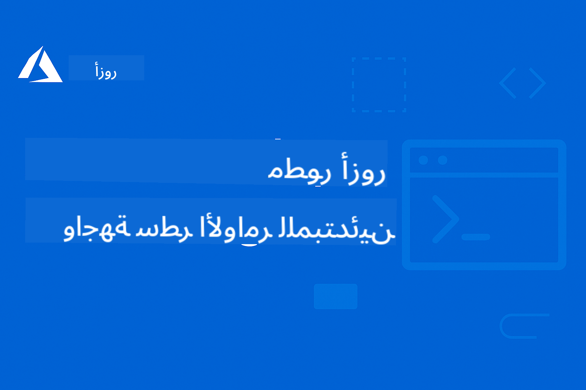

<!--
CO_OP_TRANSLATOR_METADATA:
{
  "original_hash": "05c30c9e5ed7951c72855108c6788034",
  "translation_date": "2025-12-24T23:29:36+00:00",
  "source_file": "README.md",
  "language_code": "ar"
}
-->
# AZD For Beginners: A Structured Learning Journey

 

[](https://GitHub.com/microsoft/azd-for-beginners/watchers/)
[](https://GitHub.com/microsoft/azd-for-beginners/network/)
[](https://GitHub.com/microsoft/azd-for-beginners/stargazers/)

[](https://discord.gg/microsoft-azure)
[](https://discord.gg/nTYy5BXMWG)

## البدء بهذه الدورة

اتبع هذه الخطوات لبدء رحلة تعلم AZD الخاصة بك:

1. **فَرِّع المستودع (Fork the Repository)**: اضغط على [](https://GitHub.com/microsoft/azd-for-beginners/fork)
2. **انسخ المستودع**: `git clone https://github.com/microsoft/azd-for-beginners.git`
3. **انضم إلى المجتمع**: [مجتمعات Azure Discord](https://discord.com/invite/ByRwuEEgH4) للحصول على دعم الخبراء
4. **اختر مسار التعلم الخاص بك**: اختر الفصل أدناه الذي يناسب مستوى خبرتك

### دعم متعدد اللغات

#### الترجمات التلقائية (محدثة دائمًا)

<!-- CO-OP TRANSLATOR LANGUAGES TABLE START -->
[العربية](./README.md) | [البنغالية](../bn/README.md) | [البلغارية](../bg/README.md) | [البورمية (ميانمار)](../my/README.md) | [الصينية (المبسطة)](../zh/README.md) | [الصينية (تقليدية، هونغ كونغ)](../hk/README.md) | [الصينية (تقليدية، ماكاو)](../mo/README.md) | [الصينية (تقليدية، تايوان)](../tw/README.md) | [الكرواتية](../hr/README.md) | [التشيكية](../cs/README.md) | [الدانمركية](../da/README.md) | [الهولندية](../nl/README.md) | [الإستونية](../et/README.md) | [الفنلندية](../fi/README.md) | [الفرنسية](../fr/README.md) | [الألمانية](../de/README.md) | [اليونانية](../el/README.md) | [العبرية](../he/README.md) | [الهندية](../hi/README.md) | [المجرية](../hu/README.md) | [الإندونيسية](../id/README.md) | [الإيطالية](../it/README.md) | [اليابانية](../ja/README.md) | [الكانادية](../kn/README.md) | [الكورية](../ko/README.md) | [الليتوانية](../lt/README.md) | [الماليزية](../ms/README.md) | [المالايالامية](../ml/README.md) | [الماراثية](../mr/README.md) | [النيبالية](../ne/README.md) | [بيجن نيجيريا](../pcm/README.md) | [النرويجية](../no/README.md) | [الفارسية (Farsi)](../fa/README.md) | [البولندية](../pl/README.md) | [البرتغالية (البرازيل)](../br/README.md) | [البرتغالية (البرتغال)](../pt/README.md) | [البنجابية (Gurmukhi)](../pa/README.md) | [الرومانية](../ro/README.md) | [الروسية](../ru/README.md) | [الصربية (السيريلية)](../sr/README.md) | [السلوفاكية](../sk/README.md) | [السلوفينية](../sl/README.md) | [الإسبانية](../es/README.md) | [السواحيلية](../sw/README.md) | [السويدية](../sv/README.md) | [التاغالوغ (الفلبينية)](../tl/README.md) | [التاميلية](../ta/README.md) | [التيلوجو](../te/README.md) | [التايلاندية](../th/README.md) | [التركية](../tr/README.md) | [الأوكرانية](../uk/README.md) | [الأردية](../ur/README.md) | [الفيتنامية](../vi/README.md)
<!-- CO-OP TRANSLATOR LANGUAGES TABLE END -->

## نظرة عامة على الدورة

أتقن Azure Developer CLI (azd) من خلال فصول منظمة مصممة للتعلم التدريجي. **تركيز خاص على نشر تطبيقات الذكاء الاصطناعي مع تكامل Microsoft Foundry.**

### لماذا هذه الدورة ضرورية للمطورين المعاصرين

استنادًا إلى رؤى مجتمع Microsoft Foundry على Discord، **45% من المطورين يرغبون في استخدام AZD لأحمال عمل الذكاء الاصطناعي** لكنهم يواجهون تحديات في:
- هندسة ذكاء اصطناعي متعددة الخدمات ومعقدة
- أفضل الممارسات لنشر الذكاء الاصطناعي في بيئات الإنتاج  
- تكامل وخَيار خدمات Azure AI والتكوين
- تحسين التكاليف لأحمال عمل الذكاء الاصطناعي
- استكشاف وحل مشكلات النشر المتخصصة في الذكاء الاصطناعي

### أهداف التعلم

بإكمال هذه الدورة المنظمة، ستتمكن من:
- **إتقان أساسيات AZD**: المفاهيم الأساسية، التثبيت، والتكوين
- **نشر تطبيقات الذكاء الاصطناعي**: استخدام AZD مع خدمات Microsoft Foundry
- **تنفيذ البنية التحتية كرمز**: إدارة موارد Azure باستخدام قوالب Bicep
- **استكشاف أخطاء النشر**: حل المشكلات الشائعة وتصحيح الأخطاء
- **التحسين للإنتاج**: الأمن، التوسيع، المراقبة، وإدارة التكاليف
- **بناء حلول متعددة الوكلاء**: نشر هياكل ذكاء اصطناعي معقدة

## 📚 فصول التعلم

*اختر مسار التعلم بناءً على مستوى الخبرة والأهداف*

### 🚀 الفصل 1: الأساسيات والبدء السريع
**المتطلبات المسبقة**: اشتراك Azure، معرفة أساسية بسطر الأوامر  
**المدة**: 30-45 دقيقة  
**التعقيد**: ⭐

#### ما الذي ستتعلمه
- فهم أساسيات Azure Developer CLI
- تثبيت AZD على منصتك
- أول نشر ناجح لك

#### موارد التعلم
- **🎯 ابدأ من هنا**: [ما هو Azure Developer CLI؟](../..)
- **📖 النظرية**: [أساسيات AZD](docs/getting-started/azd-basics.md) - المفاهيم والمصطلحات الأساسية
- **⚙️ الإعداد**: [التثبيت والإعداد](docs/getting-started/installation.md) - أدلة خاصة بالمنصة
- **🛠️ عمليًا**: [مشروعك الأول](docs/getting-started/first-project.md) - درس إرشادي خطوة بخطوة
- **📋 مرجع سريع**: [قائمة أوامر مختصرة](resources/cheat-sheet.md)

#### التمارين العملية
```bash
# فحص سريع للتثبيت
azd version

# انشر تطبيقك الأول
azd init --template todo-nodejs-mongo
azd up
```

**💡 نتيجة الفصل**: نشر تطبيق ويب بسيط إلى Azure باستخدام AZD بنجاح

**✅ معايير النجاح:**
```bash
# بعد إكمال الفصل الأول، يجب أن تكون قادرًا على:
azd version              # يعرض الإصدار المثبت
azd init --template todo-nodejs-mongo  # يهيئ المشروع
azd up                  # ينشر إلى أزور
azd show                # يعرض رابط التطبيق قيد التشغيل
# يفتح التطبيق في المتصفح ويعمل
azd down --force --purge  # ينظف الموارد
```

**📊 استثمار الوقت:** 30-45 دقيقة  
**📈 مستوى المهارة بعد:** قادر على نشر تطبيقات أساسية بشكل مستقل

**✅ معايير النجاح:**
```bash
# بعد إكمال الفصل الأول، يجب أن تكون قادرًا على:
azd version              # يعرض الإصدار المثبت
azd init --template todo-nodejs-mongo  # يهيئ المشروع
azd up                  # ينشر إلى أزور
azd show                # يعرض رابط التطبيق الجاري
# يفتح التطبيق في المتصفح ويعمل
azd down --force --purge  # ينظف الموارد
```

**📊 استثمار الوقت:** 30-45 دقيقة  
**📈 مستوى المهارة بعد:** قادر على نشر تطبيقات أساسية بشكل مستقل

---

### 🤖 الفصل 2: التطوير موجهًا للذكاء الاصطناعي (مستحسن لمطوري الذكاء الاصطناعي)
**المتطلبات المسبقة**: إتمام الفصل 1  
**المدة**: 1-2 ساعة  
**التعقيد**: ⭐⭐

#### ما الذي ستتعلمه
- تكامل Microsoft Foundry مع AZD
- نشر تطبيقات معززة بالذكاء الاصطناعي
- فهم تكوينات خدمات الذكاء الاصطناعي

#### موارد التعلم
- **🎯 ابدأ من هنا**: [تكامل Microsoft Foundry](docs/microsoft-foundry/microsoft-foundry-integration.md)
- **📖 الأنماط**: [نشر نماذج الذكاء الاصطناعي](docs/microsoft-foundry/ai-model-deployment.md) - نشر وإدارة نماذج الذكاء الاصطناعي
- **🛠️ ورشة عمل**: [مختبر ورشة عمل الذكاء الاصطناعي](docs/microsoft-foundry/ai-workshop-lab.md) - اجعل حلولك الذكية جاهزة لـ AZD
- **🎥 دليل تفاعلي**: [مواد الورشة](workshop/README.md) - تعلم في المتصفح مع MkDocs * بيئة DevContainer
- **📋 القوالب**: [قوالب Microsoft Foundry المميزة](../..)
- **📝 أمثلة**: [أمثلة نشر AZD](examples/README.md)

#### التمارين العملية
```bash
# انشر أول تطبيق ذكاء اصطناعي لك
azd init --template azure-search-openai-demo
azd up

# جرّب قوالب ذكاء اصطناعي إضافية
azd init --template openai-chat-app-quickstart
azd init --template agent-openai-python-prompty
```

**💡 نتيجة الفصل**: نشر وتكوين تطبيق دردشة معزز بالذكاء الاصطناعي مع قدرات RAG

**✅ معايير النجاح:**
```bash
# بعد الفصل الثاني، ستتمكن من:
azd init --template azure-search-openai-demo
azd up
# اختبار واجهة دردشة الذكاء الاصطناعي
# طرح الأسئلة والحصول على إجابات مدعومة بالذكاء الاصطناعي مع المصادر
# التحقق من أن تكامل البحث يعمل
azd monitor  # التحقق من أن Application Insights يعرض بيانات القياس عن بُعد
azd down --force --purge
```

**📊 استثمار الوقت:** 1-2 ساعة  
**📈 مستوى المهارة بعد:** قادر على نشر وتكوين تطبيقات ذكاء اصطناعي جاهزة للإنتاج  
**💰 وعي بالتكاليف:** فهم تكاليف التطوير $80-150/شهر، وتكاليف الإنتاج $300-3500/شهر

#### 💰 اعتبارات التكلفة لنشرات الذكاء الاصطناعي

**بيئة التطوير (تقديرية $80-150/شهر):**
- Azure OpenAI (الدفع حسب الاستخدام): $0-50/شهر (اعتمادًا على استخدام التوكن)
- AI Search (المستوى الأساسي): $75/شهر
- Container Apps (الاستهلاك): $0-20/شهر
- التخزين (قياسي): $1-5/شهر

**بيئة الإنتاج (تقديرية $300-3,500+/شهر):**
- Azure OpenAI (PTU للأداء المتسق): $3,000+/شهر أو الدفع حسب الاستخدام مع حجم عالٍ
- AI Search (المستوى القياسي): $250/شهر
- Container Apps (مخصص): $50-100/شهر
- Application Insights: $5-50/شهر
- التخزين (مميز): $10-50/شهر

**💡 نصائح لتحسين التكلفة:**
- استخدم **الخطة المجانية** لـ Azure OpenAI للتعلم (يشمل 50,000 توكن/شهر)
- شغّل `azd down` لتحرير الموارد عندما لا تكون في طور التطوير النشط
- ابدأ بالفوترة بناءً على الاستهلاك، وقم بالترقية إلى PTU فقط للإنتاج
- استخدم `azd provision --preview` لتقدير التكاليف قبل النشر
- قم بتمكين التوسيع التلقائي: ادفع فقط عن الاستخدام الفعلي

**مراقبة التكاليف:**
```bash
# تحقق من التكاليف الشهرية المقدرة
azd provision --preview

# راقب التكاليف الفعلية في بوابة Azure
az consumption budget list --resource-group <your-rg>
```

---

### ⚙️ الفصل 3: التكوين والمصادقة
**المتطلبات المسبقة**: إتمام الفصل 1  
**المدة**: 45-60 دقيقة  
**التعقيد**: ⭐⭐

#### ما الذي ستتعلمه
- تكوين وإدارة البيئات
- المصادقة وأفضل ممارسات الأمان
- تسمية وتنظيم الموارد

#### موارد التعلم
- **📖 التكوين**: [دليل التكوين](docs/getting-started/configuration.md) - إعداد البيئة
- **🔐 الأمان**: [أنماط المصادقة والهوية المُدارة](docs/getting-started/authsecurity.md) - أنماط المصادقة
- **📝 أمثلة**: [مثال تطبيق قاعدة بيانات](examples/database-app/README.md) - أمثلة قواعد بيانات AZD

#### التمارين العملية
- تكوين بيئات متعددة (dev، staging، prod)
- إعداد مصادقة بالهوية المُدارة
- تنفيذ تكوينات خاصة بكل بيئة

**💡 نتيجة الفصل**: إدارة بيئات متعددة مع مصادقة وأمان مناسبين

---

### 🏗️ الفصل 4: البنية التحتية كرمز والنشر
**المتطلبات المسبقة**: إتمام الفصول 1-3  
**المدة**: 1-1.5 ساعة  
**التعقيد**: ⭐⭐⭐

#### ما الذي ستتعلمه
- أنماط نشر متقدمة
- البنية التحتية كرمز باستخدام Bicep
- استراتيجيات توفير الموارد

#### موارد التعلم
- **📖 النشر**: [دليل النشر](docs/deployment/deployment-guide.md) - سير العمل الكامل
- **🏗️ التوفير**: [توفير الموارد](docs/deployment/provisioning.md) - إدارة موارد Azure
- **📝 أمثلة**: [مثال تطبيق الحاويات](../../examples/container-app) - نشرات محمولة بالحاويات

#### التمارين العملية
- إنشاء قوالب Bicep مخصصة
- نشر تطبيقات متعددة الخدمات
- تنفيذ استراتيجيات النشر الأزرق-الأخضر

**💡 نتيجة الفصل**: نشر تطبيقات متعددة الخدمات المعقدة باستخدام قوالب بنية تحتية مخصصة

---

### 🎯 الفصل 5: حلول الذكاء الاصطناعي متعددة الوكلاء (متقدم)
**المتطلبات المسبقة**: إتمام الفصول 1-2  
**المدة**: 2-3 ساعات  
**التعقيد**: ⭐⭐⭐⭐

#### ما الذي ستتعلمه
- أنماط هندسة متعددة الوكلاء
- تنسيق وأوركسترا الوكلاء
- نشرات ذكاء اصطناعي جاهزة للإنتاج

#### موارد التعلم
- **🤖 المشروع المميز**: [حل متعدد الوكلاء للبيع بالتجزئة](examples/retail-scenario.md) - تنفيذ كامل
- **🛠️ قوالب ARM**: [حزمة قوالب ARM](../../examples/retail-multiagent-arm-template) - نشر بنقرة واحدة
- **📖 العمارة**: [نماذج تنسيق الوكلاء المتعددين](/docs/pre-deployment/coordination-patterns.md) - نماذج

#### تمارين عملية
```bash
# نشر الحل المتكامل متعدد الوكلاء للبيع بالتجزئة
cd examples/retail-multiagent-arm-template
./deploy.sh

# استكشاف تكوينات الوكلاء
az deployment group show --resource-group <rg-name> --name <deployment-name>
```

**💡 نتيجة الفصل**: نشر وإدارة حل ذكاء اصطناعي متعدد الوكلاء جاهز للإنتاج مع وكلاء العميل والمخزون

---

### 🔍 الفصل 6: التحقق والتخطيط قبل النشر
**المتطلبات الأساسية**: إتمام الفصل 4  
**المدة**: ساعة واحدة  
**التعقيد**: ⭐⭐

#### ما الذي ستتعلمه
- تخطيط السعة والتحقق من الموارد
- استراتيجيات اختيار SKU
- فحوصات ما قبل النشر والتشغيل الآلي

#### مصادر التعلم
- **📊 التخطيط**: [تخطيط السعة](docs/pre-deployment/capacity-planning.md) - التحقق من الموارد
- **💰 الاختيار**: [اختيار SKU](docs/pre-deployment/sku-selection.md) - خيارات فعالة من حيث التكلفة
- **✅ التحقق**: [فحوصات ما قبل النشر](docs/pre-deployment/preflight-checks.md) - سكريبتات آلية

#### تمارين عملية
- تشغيل سكريبتات التحقق من السعة
- تحسين اختيارات SKU لتقليل التكلفة
- تنفيذ فحوصات ما قبل النشر الآلية

**💡 نتيجة الفصل**: التحقق من صحة عمليات النشر وتحسينها قبل التنفيذ

---

### 🚨 الفصل 7: استكشاف الأخطاء وإصلاحها وتصحيحها
**المتطلبات الأساسية**: إتمام أي فصل من فصول النشر  
**المدة**: 1-1.5 ساعة  
**التعقيد**: ⭐⭐

#### ما الذي ستتعلمه
- مناهج منهجية لتصحيح الأخطاء
- المشكلات الشائعة والحلول
- استكشاف الأخطاء المتعلقة بالذكاء الاصطناعي

#### مصادر التعلم
- **🔧 المشكلات الشائعة**: [المشكلات الشائعة](docs/troubleshooting/common-issues.md) - الأسئلة المتكررة والحلول
- **🕵️ التصحيح**: [دليل التصحيح](docs/troubleshooting/debugging.md) - استراتيجيات خطوة بخطوة
- **🤖 مشكلات الذكاء الاصطناعي**: [استكشاف أخطاء الذكاء الاصطناعي](docs/troubleshooting/ai-troubleshooting.md) - مشاكل خدمات الذكاء الاصطناعي

#### تمارين عملية
- تشخيص فشل عمليات النشر
- حل مشكلات المصادقة
- تصحيح اتصال خدمات الذكاء الاصطناعي

**💡 نتيجة الفصل**: تشخيص وحل المشكلات الشائعة في النشر بشكل مستقل

---

### 🏢 الفصل 8: نماذج الإنتاج والمؤسسات
**المتطلبات الأساسية**: إتمام الفصول 1-4  
**المدة**: 2-3 ساعات  
**التعقيد**: ⭐⭐⭐⭐

#### ما الذي ستتعلمه
- استراتيجيات النشر للإنتاج
- نماذج أمان للمؤسسات
- المراقبة وتحسين التكلفة

#### مصادر التعلم
- **🏭 الإنتاج**: [أفضل ممارسات الذكاء الاصطناعي للإنتاج](docs/microsoft-foundry/production-ai-practices.md) - نماذج للمؤسسات
- **📝 أمثلة**: [مثال الخدمات المصغرة](../../examples/microservices) - هياكل معمارية معقدة
- **📊 المراقبة**: [تكامل Application Insights](docs/pre-deployment/application-insights.md) - المراقبة

#### تمارين عملية
- تنفيذ نماذج أمان للمؤسسات
- إعداد مراقبة شاملة
- نشر للإنتاج مع الحوكمة المناسبة

**💡 نتيجة الفصل**: نشر تطبيقات جاهزة للمؤسسات بقدرات إنتاجية كاملة

---

## 🎓 نظرة عامة على الورشة: تجربة تعلم عملية

> **⚠️ حالة الورشة: قيد التطوير**  
> يتم حالياً تطوير وتحسين مواد الورشة. الوحدات الأساسية تعمل، لكن بعض الأقسام المتقدمة غير كاملة. نحن نعمل بنشاط لإكمال جميع المحتويات. [تتبع التقدم →](workshop/README.md)

### مواد الورشة التفاعلية
**تعلم عملي شامل باستخدام أدوات متصفح وتمارين موجهة**

توفر مواد الورشة تجربة تعلم تفاعلية ومنظمة تُكمل المنهج القائم على الفصول أعلاه. تم تصميم الورشة لكل من التعلم الذاتي وجلسات التدريس بقيادة مدرب.

#### 🛠️ مميزات الورشة
- **واجهة متصفح**: ورشة عمل متكاملة تعمل بـ MkDocs مع ميزات البحث والنسخ والثيمات
- **تكامل GitHub Codespaces**: إعداد بيئة تطوير بنقرة واحدة
- **مسار تعلم منظم**: تمارين موجهة مكونة من 7 خطوات (المجموع 3.5 ساعة)
- **اكتشاف → نشر → تخصيص**: منهجية تدرجية
- **بيئة DevContainer تفاعلية**: أدوات واعتماديات مهيأة مسبقاً

#### 📚 هيكل الورشة
تتبع الورشة منهجية **اكتشاف → نشر → تخصيص**:

1. **مرحلة الاكتشاف (45 دقيقة)**
   - استكشاف قوالب وخدمات Microsoft Foundry
   - فهم نماذج بنية الوكلاء المتعددين
   - مراجعة متطلبات النشر والمتطلبات الأساسية

2. **مرحلة النشر (ساعتان)**
   - نشر عملي لتطبيقات الذكاء الاصطناعي باستخدام AZD
   - تكوين خدمات ونقاط نهاية Azure AI
   - تنفيذ نماذج الأمان والمصادقة

3. **مرحلة التخصيص (45 دقيقة)**
   - تعديل التطبيقات لحالات استخدام محددة
   - تحسين للنشر في بيئة الإنتاج
   - تنفيذ المراقبة وإدارة التكلفة

#### 🚀 البدء بالورشة
```bash
# الخيار 1: GitHub Codespaces (موصى به)
# انقر على "Code" → "Create codespace on main" في المستودع

# الخيار 2: التطوير المحلي
git clone https://github.com/microsoft/azd-for-beginners.git
cd azd-for-beginners/workshop
# اتبع تعليمات الإعداد في workshop/README.md
```

#### 🎯 مخرجات تعلم الورشة
بإكمال الورشة، سيتمكن المشاركون من:
- **نشر تطبيقات ذكاء اصطناعي للإنتاج**: استخدام AZD مع خدمات Microsoft Foundry
- **إتقان بنى الوكلاء المتعددين**: تنفيذ حلول منسقة لوكلاء الذكاء الاصطناعي
- **تطبيق أفضل ممارسات الأمان**: تكوين المصادقة والتحكم في الوصول
- **التحسين من أجل التوسع**: تصميم نشرات فعالة من حيث التكلفة والأداء
- **استكشاف أخطاء النشر**: حل المشكلات الشائعة بشكل مستقل

#### 📖 موارد الورشة
- **🎥 الدليل التفاعلي**: [مواد الورشة](workshop/README.md) - بيئة تعلم قائمة على المتصفح
- **📋 تعليمات خطوة بخطوة**: [التمارين الموجهة](../../workshop/docs/instructions) - إرشادات مفصلة
- **🛠️ مختبر ورشة الذكاء الاصطناعي**: [AI Workshop Lab](docs/microsoft-foundry/ai-workshop-lab.md) - تمارين مركزة على الذكاء الاصطناعي
- **💡 بدء سريع**: [دليل إعداد الورشة](workshop/README.md#quick-start) - تكوين البيئة

**مثالي لـ**: التدريب المؤسسي، الدورات الجامعية، التعلم الذاتي، ومعسكرات تدريب المطورين.

---

## 📖 ما هو Azure Developer CLI؟

Azure Developer CLI (azd) هي واجهة سطر أوامر موجهة للمطورين تسرع عملية بناء ونشر التطبيقات إلى Azure. إنها توفر:

- **نشر قائم على القوالب** - استخدم قوالب مُعدة مسبقًا لأنماط التطبيقات الشائعة
- **البنية التحتية ككود** - إدارة موارد Azure باستخدام Bicep أو Terraform  
- **تدفقات عمل متكاملة** - توفير ونشر ومراقبة التطبيقات بسلاسة
- **صديق للمطور** - مُحسّن لإنتاجية وتجربة المطور

### **AZD + Microsoft Foundry: مثالي لنشر حلول الذكاء الاصطناعي**

**لماذا AZD لحلول الذكاء الاصطناعي؟** يتعامل AZD مع أبرز التحديات التي يواجهها مطورو الذكاء الاصطناعي:

- **قوالب جاهزة للذكاء الاصطناعي** - قوالب مهيأة مسبقًا لـ Azure OpenAI وCognitive Services وأحمال عمل ML
- **نشرات ذكاء اصطناعي آمنة** - نماذج أمان مدمجة لخدمات الذكاء الاصطناعي ومفاتيح واجهة برمجة التطبيقات ونقاط نهاية النماذج  
- **نماذج الذكاء الاصطناعي للإنتاج** - أفضل الممارسات لنشر تطبيقات الذكاء الاصطناعي القابلة للتوسع والفعالة من حيث التكلفة
- **تدفقات عمل الذكاء الاصطناعي من البداية للنهاية** - من تطوير النماذج إلى نشر الإنتاج مع المراقبة المناسبة
- **تحسين التكلفة** - تخصيص موارد ذكي واستراتيجيات تحجيم لأحمال عمل الذكاء الاصطناعي
- **تكامل Microsoft Foundry** - اتصال سلس إلى كتالوج نماذج Microsoft Foundry ونقاط النهاية

---

## 🎯 مكتبة القوالب والأمثلة

### مميز: قوالب Microsoft Foundry
**ابدأ من هنا إذا كنت تنشر تطبيقات الذكاء الاصطناعي!**

> **ملاحظة:** توضح هذه القوالب نماذج مختلفة للذكاء الاصطناعي. بعضها أمثلة Azure خارجية، وأخرى تنفيذات محلية.

| قالب | الفصل | التعقيد | الخدمات | النوع |
|----------|---------|------------|----------|------|
| [**بدء استخدام الدردشة بالذكاء الاصطناعي**](https://github.com/Azure-Samples/get-started-with-ai-chat) | الفصل 2 | ⭐⭐ | AzureOpenAI + Azure AI Model Inference API + Azure AI Search + Azure Container Apps + Application Insights | خارجي |
| [**بدء استخدام وكلاء الذكاء الاصطناعي**](https://github.com/Azure-Samples/get-started-with-ai-agents) | الفصل 2 | ⭐⭐ | Azure AI Agent Service + AzureOpenAI + Azure AI Search + Azure Container Apps + Application Insights| خارجي |
| [**عرض توضيحي Azure Search + OpenAI**](https://github.com/Azure-Samples/azure-search-openai-demo) | الفصل 2 | ⭐⭐ | AzureOpenAI + Azure AI Search + App Service + Storage | خارجي |
| [**البدء السريع لتطبيق دردشة OpenAI**](https://github.com/Azure-Samples/openai-chat-app-quickstart) | الفصل 2 | ⭐ | AzureOpenAI + Container Apps + Application Insights | خارجي |
| [**Agent OpenAI Python Prompty**](https://github.com/Azure-Samples/agent-openai-python-prompty) | الفصل 5 | ⭐⭐⭐ | AzureOpenAI + Azure Functions + Prompty | خارجي |
| [**Contoso Chat RAG**](https://github.com/Azure-Samples/contoso-chat) | الفصل 8 | ⭐⭐⭐⭐ | AzureOpenAI + AI Search + Cosmos DB + Container Apps | خارجي |
| [**حل التجزئة متعدد الوكلاء**](examples/retail-scenario.md) | الفصل 5 | ⭐⭐⭐⭐ | AzureOpenAI + AI Search + Storage + Container Apps + Cosmos DB | **محلي** |

### مميز: سيناريوهات التعلم الكاملة
**قوالب تطبيقات جاهزة للإنتاج مرتبطة بفصول التعلم**

| القالب | فصل التعلم | التعقيد | التعلم الرئيسي |
|----------|------------------|------------|--------------|
| [**openai-chat-app-quickstart**](https://github.com/Azure-Samples/openai-chat-app-quickstart) | الفصل 2 | ⭐ | أنماط النشر الأساسية للذكاء الاصطناعي |
| [**azure-search-openai-demo**](https://github.com/Azure-Samples/azure-search-openai-demo) | الفصل 2 | ⭐⭐ | تنفيذ RAG مع Azure AI Search |
| [**ai-document-processing**](https://github.com/Azure-Samples/ai-document-processing) | الفصل 4 | ⭐⭐ | تكامل ذكاء المستندات |
| [**agent-openai-python-prompty**](https://github.com/Azure-Samples/agent-openai-python-prompty) | الفصل 5 | ⭐⭐⭐ | إطار العمل للوكلاء واستدعاء الدوال |
| [**contoso-chat**](https://github.com/Azure-Samples/contoso-chat) | الفصل 8 | ⭐⭐⭐ | تنسيق AI للمؤسسات |
| [**retail-multi-agent-solution**](examples/retail-scenario.md) | الفصل 5 | ⭐⭐⭐⭐ | بنية متعددة الوكلاء مع وكلاء العميل والمخزون |

### التعلم بالأمثلة حسب النوع

> **📌 أمثلة محلية مقابل خارجية:**  
> **الأمثلة المحلية** (في هذا المستودع) = جاهزة للاستخدام فورًا  
> **الأمثلة الخارجية** (Azure Samples) = استنساخ من المستودعات المرتبطة

#### أمثلة محلية (جاهزة للاستخدام)
- [**حل التجزئة متعدد الوكلاء**](examples/retail-scenario.md) - تنفيذ كامل جاهز للإنتاج مع قوالب ARM
  - بنية متعددة الوكلاء (وكيل العميل + وكيل المخزون)
  - مراقبة وتقييم شاملة
  - نشر بنقرة واحدة عبر قالب ARM

#### أمثلة محلية - تطبيقات الحاويات (الفصول 2-5)
**أمثلة نشر شاملة للحاويات في هذا المستودع:**
- [**أمثلة تطبيقات الحاويات**](examples/container-app/README.md) - دليل كامل لنشر التطبيقات داخل الحاويات
  - [API Flask بسيط](../../examples/container-app/simple-flask-api) - واجهة REST أساسية مع التحجيم إلى الصفر
  - [بنية الخدمات المصغرة](../../examples/container-app/microservices) - نشر متعدد الخدمات جاهز للإنتاج
  - بدء سريع، إنتاج، وأنماط النشر المتقدمة
  - إرشادات المراقبة والأمان وتحسين التكلفة

#### أمثلة خارجية - تطبيقات بسيطة (الفصول 1-2)
**استنسخ هذه مستودعات Azure Samples للبدء:**
- [تطبيق ويب بسيط - Node.js + MongoDB](https://github.com/Azure-Samples/todo-nodejs-mongo) - أنماط النشر الأساسية
- [موقع ثابت - React SPA](https://github.com/Azure-Samples/todo-csharp-sql-swa-func) - نشر محتوى ثابت
- [تطبيق حاوية - Python Flask](https://github.com/Azure-Samples/container-apps-store-api-microservice) - نشر واجهة REST

#### أمثلة خارجية - تكامل قاعدة البيانات (الفصل 3-4)  
- [تطبيق قاعدة بيانات - C# + SQL](https://github.com/Azure-Samples/todo-csharp-sql) - أنماط اتصال قاعدة البيانات
- [Functions + Cosmos DB](https://github.com/Azure-Samples/todo-python-mongo-swa-func) - سير عمل بيانات بدون خادم

#### أمثلة خارجية - أنماط متقدمة (الفصول 4-8)
- [Java Microservices](https://github.com/Azure-Samples/java-microservices-aca-lab) - هياكل متعددة الخدمات
- [Container Apps Jobs](https://github.com/Azure-Samples/container-apps-jobs) - معالجة الخلفية  
- [Enterprise ML Pipeline](https://github.com/Azure-Samples/mlops-v2) - أنماط ML جاهزة للإنتاج

### مجموعات القوالب الخارجية
- [**معرض قوالب AZD الرسمي**](https://azure.github.io/awesome-azd/) - مجموعة منسقة من القوالب الرسمية ومجتمع المطورين
- [**قوالب Azure Developer CLI**](https://learn.microsoft.com/en-us/azure/developer/azure-developer-cli/azd-templates) - توثيق قوالب Microsoft Learn
- [**دليل الأمثلة**](examples/README.md) - أمثلة تعلم محلية مع شروح مفصلة

---

## 📚 موارد التعلم والمراجع

### مراجع سريعة
- [**دليل الأوامر المختصر**](resources/cheat-sheet.md) - أوامر azd الأساسية منظمة حسب الفصل
- [**مسرد المصطلحات**](resources/glossary.md) - مصطلحات Azure و azd  
- [**الأسئلة المتكررة**](resources/faq.md) - الأسئلة الشائعة منظمة حسب فصل التعلم
- [**دليل الدراسة**](resources/study-guide.md) - تمارين عملية شاملة

### ورش عمل عملية
- [**مختبر ورشة الذكاء الاصطناعي**](docs/microsoft-foundry/ai-workshop-lab.md) - اجعل حلول الذكاء الاصطناعي قابلة للنشر عبر AZD (2-3 ساعات)
- [**دليل الورشة التفاعلية**](workshop/README.md) - ورشة عمل قائمة على المتصفح باستخدام MkDocs وبيئة DevContainer
- [**مسار تعلم منظم**](../../workshop/docs/instructions) - تمارين مكونة من 7 خطوات موجهة (اكتشاف → نشر → تخصيص)
- [**ورشة AZD للمبتدئين**](workshop/README.md) - مواد ورشة عملية كاملة مع تكامل GitHub Codespaces

### موارد تعلم خارجية
- [توثيق Azure Developer CLI](https://learn.microsoft.com/en-us/azure/developer/azure-developer-cli/)
- [مركز هندسة Azure](https://learn.microsoft.com/en-us/azure/architecture/)
- [حاسبة تسعير Azure](https://azure.microsoft.com/pricing/calculator/)
- [حالة Azure](https://status.azure.com/)

---

## 🔧 دليل استكشاف الأخطاء وإصلاحها السريع

**المشكلات الشائعة التي يواجهها المبتدئون والحلول الفورية:**

### ❌ "azd: أمر غير موجود"

```bash
# قم بتثبيت AZD أولاً
# ويندوز (باورشيل):
winget install microsoft.azd

# ماك أو إس:
brew tap azure/azd && brew install azd

# لينكس:
curl -fsSL https://aka.ms/install-azd.sh | bash

# تحقق من التثبيت
azd version
```

### ❌ "لم يتم العثور على اشتراك" أو "الاشتراك غير مضبوط"

```bash
# عرض الاشتراكات المتاحة
az account list --output table

# تعيين الاشتراك الافتراضي
az account set --subscription "<subscription-id-or-name>"

# تعيين لبيئة AZD
azd env set AZURE_SUBSCRIPTION_ID "<subscription-id>"

# تحقق
az account show
```

### ❌ "InsufficientQuota" أو "تم تجاوز الحصة"

```bash
# جرّب منطقة Azure مختلفة
azd env set AZURE_LOCATION "westus2"
azd up

# أو استخدم SKUs أصغر في بيئة التطوير
# حرّر infra/main.parameters.json:
{
  "sku": "B1"  // Instead of "P1V2"
}
```

### ❌ "فشل azd up في منتصف العملية"

```bash
# الخيار 1: نظف وحاول مرة أخرى
azd down --force --purge
azd up

# الخيار 2: أصلح البنية التحتية فقط
azd provision

# الخيار 3: تحقق من السجلات التفصيلية
azd show
azd logs
```

### ❌ "فشل المصادقة" أو "انتهت صلاحية الرمز"

```bash
# إعادة المصادقة
az logout
az login

azd auth logout
azd auth login

# تحقق من المصادقة
az account show
```

### ❌ "المورد موجود بالفعل" أو تعارضات في الأسماء

```bash
# AZD يولد أسماء فريدة، ولكن إذا حدث تعارض:
azd down --force --purge

# ثم أعد المحاولة باستخدام بيئة جديدة
azd env new dev-v2
azd up
```

### ❌ استغراق نشر القالب وقتًا طويلاً

**أوقات الانتظار العادية:**
- تطبيق ويب بسيط: 5-10 دقائق
- تطبيق مع قاعدة بيانات: 10-15 دقائق
- تطبيقات الذكاء الاصطناعي: 15-25 دقائق (توفير OpenAI بطيء)

```bash
# تحقق من التقدم
azd show

# إذا كنت عالقًا لأكثر من 30 دقيقة، فتحقق من بوابة Azure:
azd monitor
# ابحث عن عمليات النشر الفاشلة
```

### ❌ "تم رفض الإذن" أو "ممنوع"

```bash
# تحقق من دور Azure الخاص بك
az role assignment list --assignee $(az account show --query user.name -o tsv)

# تحتاج إلى دور "Contributor" على الأقل
# اطلب من مسؤول Azure منح:
# - Contributor (للموارد)
# - User Access Administrator (لتعيينات الأدوار)
```

### ❌ لا يمكن العثور على رابط التطبيق المنشور

```bash
# عرض جميع نقاط نهاية الخدمة
azd show

# أو افتح بوابة Azure
azd monitor

# تحقق من خدمة محددة
azd env get-values
# ابحث عن متغيرات *_URL
```

### 📚 موارد استكشاف الأخطاء وإصلاحها الكاملة

- **دليل المشكلات الشائعة:** [حلول مفصلة](docs/troubleshooting/common-issues.md)
- **مشكلات خاصة بالذكاء الاصطناعي:** [استكشاف أخطاء الذكاء الاصطناعي](docs/troubleshooting/ai-troubleshooting.md)
- **دليل التصحيح:** [التصحيح خطوة بخطوة](docs/troubleshooting/debugging.md)
- **الحصول على المساعدة:** [Discord الخاص بـ Azure](https://discord.gg/microsoft-azure) #azure-developer-cli

---

## 🔧 دليل استكشاف الأخطاء وإصلاحها السريع

**المشكلات الشائعة التي يواجهها المبتدئون والحلول الفورية:**

<details>
<summary><strong>❌ "azd: أمر غير موجود"</strong></summary>

```bash
# قم بتثبيت AZD أولاً
# ويندوز (باورشيل):
winget install microsoft.azd

# ماك أو إس:
brew tap azure/azd && brew install azd

# لينكس:
curl -fsSL https://aka.ms/install-azd.sh | bash

# تحقق من التثبيت
azd version
```
</details>

<details>
<summary><strong>❌ "لم يتم العثور على اشتراك" أو "الاشتراك غير مضبوط"</strong></summary>

```bash
# عرض الاشتراكات المتاحة
az account list --output table

# تعيين الاشتراك الافتراضي
az account set --subscription "<subscription-id-or-name>"

# تعيين لبيئة AZD
azd env set AZURE_SUBSCRIPTION_ID "<subscription-id>"

# تحقق
az account show
```
</details>

<details>
<summary><strong>❌ "InsufficientQuota" أو "تم تجاوز الحصة"</strong></summary>

```bash
# جرّب منطقة Azure مختلفة
azd env set AZURE_LOCATION "westus2"
azd up

# أو استخدم SKUs أصغر في بيئة التطوير
# حرّر infra/main.parameters.json:
{
  "sku": "B1"  // Instead of "P1V2"
}
```
</details>

<details>
<summary><strong>❌ "فشل azd up في منتصف العملية"</strong></summary>

```bash
# الخيار 1: نظف وأعد المحاولة
azd down --force --purge
azd up

# الخيار 2: أصلح البنية التحتية فقط
azd provision

# الخيار 3: تحقق من السجلات التفصيلية
azd show
azd logs
```
</details>

<details>
<summary><strong>❌ "فشل المصادقة" أو "انتهت صلاحية الرمز"</strong></summary>

```bash
# إعادة المصادقة
az logout
az login

azd auth logout
azd auth login

# التحقق من المصادقة
az account show
```
</details>

<details>
<summary><strong>❌ "المورد موجود بالفعل" أو تعارضات في الأسماء</strong></summary>

```bash
# AZD يولد أسماء فريدة، لكن إذا حدث تعارض:
azd down --force --purge

# ثم أعد المحاولة باستخدام بيئة جديدة
azd env new dev-v2
azd up
```
</details>

<details>
<summary><strong>❌ استغراق نشر القالب وقتًا طويلاً</strong></summary>

**أوقات الانتظار العادية:**
- تطبيق ويب بسيط: 5-10 دقائق
- تطبيق مع قاعدة بيانات: 10-15 دقائق
- تطبيقات الذكاء الاصطناعي: 15-25 دقائق (توفير OpenAI بطيء)

```bash
# تحقق من التقدم
azd show

# إذا كنت عالقًا لأكثر من 30 دقيقة، فتحقق من بوابة Azure:
azd monitor
# ابحث عن عمليات النشر الفاشلة
```
</details>

<details>
<summary><strong>❌ "تم رفض الإذن" أو "ممنوع"</strong></summary>

```bash
# تحقق من دور Azure الخاص بك
az role assignment list --assignee $(az account show --query user.name -o tsv)

# تحتاج على الأقل إلى دور "المساهم"
# اطلب من مسؤول Azure منح:
# - دور "المساهم" (للموارد)
# - دور "مدير وصول المستخدم" (لتعيينات الأدوار)
```
</details>

<details>
<summary><strong>❌ لا يمكن العثور على رابط التطبيق المنشور</strong></summary>

```bash
# عرض جميع نقاط نهاية الخدمة
azd show

# أو افتح بوابة Azure
azd monitor

# تحقق من خدمة محددة
azd env get-values
# ابحث عن متغيرات *_URL
```
</details>

### 📚 موارد استكشاف الأخطاء وإصلاحها الكاملة

- **دليل المشكلات الشائعة:** [حلول مفصلة](docs/troubleshooting/common-issues.md)
- **مشكلات خاصة بالذكاء الاصطناعي:** [استكشاف أخطاء الذكاء الاصطناعي](docs/troubleshooting/ai-troubleshooting.md)
- **دليل التصحيح:** [التصحيح خطوة بخطوة](docs/troubleshooting/debugging.md)
- **الحصول على المساعدة:** [Discord الخاص بـ Azure](https://discord.gg/microsoft-azure) #azure-developer-cli

---

## 🎓 إتمام الدورة والشهادات

### تتبع التقدم
تتبع تقدم تعلمك عبر كل فصل:

- [ ] **الفصل 1**: الأساس والبدء السريع ✅
- [ ] **الفصل 2**: تطوير يركز على الذكاء الاصطناعي ✅  
- [ ] **الفصل 3**: التكوين والمصادقة ✅
- [ ] **الفصل 4**: البنية التحتية كرمز والنشر ✅
- [ ] **الفصل 5**: حلول الذكاء الاصطناعي متعددة الوكلاء ✅
- [ ] **الفصل 6**: التحقق والتخطيط قبل النشر ✅
- [ ] **الفصل 7**: استكشاف الأخطاء والتصحيح ✅
- [ ] **الفصل 8**: أنماط الإنتاج والمؤسسات ✅

### التحقق من التعلم
بعد إكمال كل فصل، تحقق من معرفتك عن طريق:
1. **تمرين عملي**: أكمل نشر الفصل العملي
2. **فحص المعرفة**: راجع قسم الأسئلة المتكررة للفصل
3. **نقاش مجتمعي**: شارك تجربتك في Discord الخاص بـ Azure
4. **الفصل التالي**: انتقل إلى مستوى التعقيد التالي

### فوائد إتمام الدورة
بعد إكمال جميع الفصول، ستحصل على:
- **خبرة إنتاجية**: نشر تطبيقات ذكاء اصطناعي فعلية إلى Azure
- **مهارات مهنية**: قدرات نشر جاهزة للمؤسسات  
- **اعتراف المجتمع**: عضو نشط في مجتمع مطوري Azure
- **تقدم مهني**: خبرة AZD ونشر الذكاء الاصطناعي المطلوبة في السوق

---

## 🤝 المجتمع والدعم

### الحصول على المساعدة والدعم
- **مشكلات تقنية**: [الإبلاغ عن الأخطاء وطلب الميزات](https://github.com/microsoft/azd-for-beginners/issues)
- **أسئلة التعلم**: [مجتمع Microsoft Azure على Discord](https://discord.gg/microsoft-azure) و [](https://discord.gg/nTYy5BXMWG)
- **مساعدة خاصة بالذكاء الاصطناعي**: انضم إلى [](https://discord.gg/nTYy5BXMWG)
- **التوثيق**: [التوثيق الرسمي لـ Azure Developer CLI](https://learn.microsoft.com/en-us/azure/developer/azure-developer-cli/)

### رؤى المجتمع من Microsoft Foundry Discord

**نتائج استطلاع حديث من قناة #Azure:**
- **45%** من المطورين يرغبون في استخدام AZD لأحمال عمل الذكاء الاصطناعي
- **أهم التحديات**: نشرات متعددة الخدمات، إدارة بيانات الاعتماد، الجاهزية للإنتاج  
- **الأكثر طلبًا**: قوالب خاصة بالذكاء الاصطناعي، أدلة استكشاف الأخطاء، أفضل الممارسات

**انضم إلى مجتمعنا لتستطيع:**
- مشاركة تجاربك مع AZD + الذكاء الاصطناعي والحصول على المساعدة
- الوصول إلى معاينات مبكرة للقوالب الجديدة الخاصة بالذكاء الاصطناعي
- المساهمة في أفضل ممارسات نشر الذكاء الاصطناعي
- التأثير في تطوير ميزات مستقبلية لـ AI + AZD

### المساهمة في الدورة
نرحب بالمساهمات! يرجى قراءة [دليل المساهمة](CONTRIBUTING.md) للحصول على تفاصيل حول:
- **تحسين المحتوى**: تحسين الفصول والأمثلة الموجودة
- **أمثلة جديدة**: إضافة سيناريوهات وقوالب من الواقع  
- **الترجمة**: المساعدة في الحفاظ على دعم متعدد اللغات
- **الإبلاغ عن الأخطاء**: تحسين الدقة والوضوح
- **معايير المجتمع**: اتبع إرشادات المجتمع الشاملة لدينا

---

## 📄 معلومات الدورة

### الترخيص
هذا المشروع مرخّص بموجب رخصة MIT - انظر ملف [LICENSE](../../LICENSE) للحصول على التفاصيل.

### موارد تعلم Microsoft ذات الصلة

فريقنا ينتج دورات تعلم شاملة أخرى:

<!-- CO-OP TRANSLATOR OTHER COURSES START -->
### LangChain
[](https://aka.ms/langchain4j-for-beginners)
[](https://aka.ms/langchainjs-for-beginners?WT.mc_id=m365-94501-dwahlin)

---

### Azure / Edge / MCP / Agents
[](https://github.com/microsoft/AZD-for-beginners?WT.mc_id=academic-105485-koreyst)
[](https://github.com/microsoft/edgeai-for-beginners?WT.mc_id=academic-105485-koreyst)
[](https://github.com/microsoft/mcp-for-beginners?WT.mc_id=academic-105485-koreyst)
[](https://github.com/microsoft/ai-agents-for-beginners?WT.mc_id=academic-105485-koreyst)

---
 
### سلسلة الذكاء الاصطناعي التوليدي
[](https://github.com/microsoft/generative-ai-for-beginners?WT.mc_id=academic-105485-koreyst)
[-9333EA?style=for-the-badge&labelColor=E5E7EB&color=9333EA)](https://github.com/microsoft/Generative-AI-for-beginners-dotnet?WT.mc_id=academic-105485-koreyst)
[-C084FC?style=for-the-badge&labelColor=E5E7EB&color=C084FC)](https://github.com/microsoft/generative-ai-for-beginners-java?WT.mc_id=academic-105485-koreyst)
[-E879F9?style=for-the-badge&labelColor=E5E7EB&color=E879F9)](https://github.com/microsoft/generative-ai-with-javascript?WT.mc_id=academic-105485-koreyst)

---
 
### التعلم الأساسي
[](https://aka.ms/ml-beginners?WT.mc_id=academic-105485-koreyst)
[](https://aka.ms/datascience-beginners?WT.mc_id=academic-105485-koreyst)
[](https://aka.ms/ai-beginners?WT.mc_id=academic-105485-koreyst)
[](https://github.com/microsoft/Security-101?WT.mc_id=academic-96948-sayoung)
[](https://aka.ms/webdev-beginners?WT.mc_id=academic-105485-koreyst)
[](https://aka.ms/iot-beginners?WT.mc_id=academic-105485-koreyst)
[](https://github.com/microsoft/xr-development-for-beginners?WT.mc_id=academic-105485-koreyst)

---
 
### سلسلة Copilot
[](https://aka.ms/GitHubCopilotAI?WT.mc_id=academic-105485-koreyst)
[](https://github.com/microsoft/mastering-github-copilot-for-dotnet-csharp-developers?WT.mc_id=academic-105485-koreyst)
[](https://github.com/microsoft/CopilotAdventures?WT.mc_id=academic-105485-koreyst)
<!-- CO-OP TRANSLATOR OTHER COURSES END -->

---

## 🗺️ التنقل في الدورة

**🚀 هل أنت مستعد لبدء التعلم؟**

**المبتدئون**: ابدأ بـ [الفصل 1: الأساس والبدء السريع](../..)  
**مطورو الذكاء الاصطناعي**: انتقل إلى [الفصل 2: تطوير يركز على الذكاء الاصطناعي](../..)  
**المطورون ذوو الخبرة**: ابدأ بـ [الفصل 3: التهيئة والمصادقة](../..)

**الخطوات التالية**: [ابدأ الفصل 1 - أساسيات AZD](docs/getting-started/azd-basics.md) →

---

<!-- CO-OP TRANSLATOR DISCLAIMER START -->
إخلاء المسؤولية:
تمت ترجمة هذا المستند باستخدام خدمة الترجمة بالذكاء الاصطناعي Co-op Translator (https://github.com/Azure/co-op-translator). بينما نسعى لتحقيق الدقة، يُرجى الانتباه إلى أن الترجمات الآلية قد تحتوي على أخطاء أو عدم دقة. ينبغي اعتبار المستند الأصلي بلغته الأصلية المصدر المعتمد. للمعلومات الحرجة، يُنصح بالاستعانة بترجمة بشرية محترفة. لا نتحمل أي مسؤولية عن أي سوء فهم أو تفسيرات خاطئة تنشأ عن استخدام هذه الترجمة.
<!-- CO-OP TRANSLATOR DISCLAIMER END -->