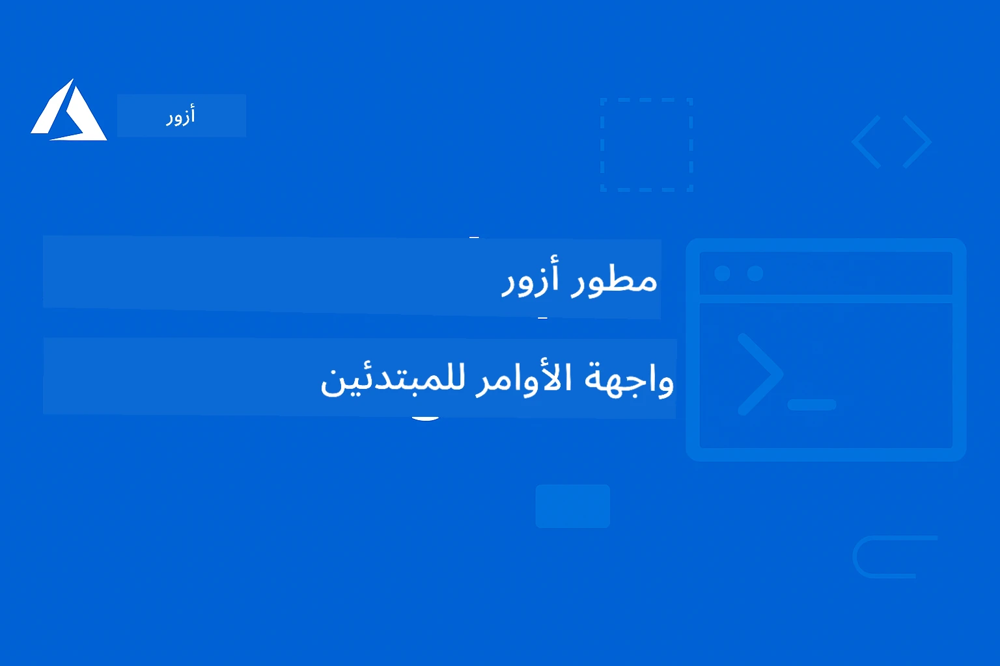

# AZD للمبتدئين: مسار تعلّم منظم

 

[](https://GitHub.com/microsoft/azd-for-beginners/watchers/)
[](https://GitHub.com/microsoft/azd-for-beginners/network/)
[](https://GitHub.com/microsoft/azd-for-beginners/stargazers/)

[](https://discord.com/invite/nkVh3dp)
[](https://discord.gg/nTYy5BXMWG)

---

### الترجمات التلقائية (محدّثة دائمًا)

<!-- CO-OP TRANSLATOR LANGUAGES TABLE START -->
[العربية](./README.md) | [البنغالية](../bn/README.md) | [البلغارية](../bg/README.md) | [البورمية (ميانمار)](../my/README.md) | [الصينية (مبسطة)](../zh-CN/README.md) | [الصينية (تقليدية، هونغ كونغ)](../zh-HK/README.md) | [الصينية (تقليدية، ماكاو)](../zh-MO/README.md) | [الصينية (تقليدية، تايوان)](../zh-TW/README.md) | [الكرواتية](../hr/README.md) | [التشيكية](../cs/README.md) | [الدنماركية](../da/README.md) | [الهولندية](../nl/README.md) | [الإستونية](../et/README.md) | [الفنلندية](../fi/README.md) | [الفرنسية](../fr/README.md) | [الألمانية](../de/README.md) | [اليونانية](../el/README.md) | [العبرية](../he/README.md) | [الهندية](../hi/README.md) | [المجرية](../hu/README.md) | [الإندونيسية](../id/README.md) | [الإيطالية](../it/README.md) | [اليابانية](../ja/README.md) | [الكنادية](../kn/README.md) | [الخميرية](../km/README.md) | [الكورية](../ko/README.md) | [الليتوانية](../lt/README.md) | [الماليزية](../ms/README.md) | [المالايالامية](../ml/README.md) | [الماراثية](../mr/README.md) | [النيبالية](../ne/README.md) | [البيجين النيجيري](../pcm/README.md) | [النرويجية](../no/README.md) | [الفارسية (اللغة الفارسية)](../fa/README.md) | [البولندية](../pl/README.md) | [البرتغالية (البرازيل)](../pt-BR/README.md) | [البرتغالية (البرتغال)](../pt-PT/README.md) | [البنجابية (غورموخي)](../pa/README.md) | [الرومانية](../ro/README.md) | [الروسية](../ru/README.md) | [الصربية (السيريلية)](../sr/README.md) | [السلوفاكية](../sk/README.md) | [السلوفينية](../sl/README.md) | [الإسبانية](../es/README.md) | [السواحلية](../sw/README.md) | [السويدية](../sv/README.md) | [التاغالوغية (الفلبينية)](../tl/README.md) | [التاميلية](../ta/README.md) | [التيلوجو](../te/README.md) | [التايلاندية](../th/README.md) | [التركية](../tr/README.md) | [الأوكرانية](../uk/README.md) | [الأردية](../ur/README.md) | [الفيتنامية](../vi/README.md)

> **تفضل الاستنساخ محليًا؟**
>
> يتضمن هذا المستودع أكثر من 50 ترجمة للغات مما يزيد بشكل كبير من حجم التنزيل. للاستنساخ بدون الترجمات، استخدم الاستنساخ الجزئي:
>
> **Bash / macOS / Linux:**
> ```bash
> git clone --filter=blob:none --sparse https://github.com/microsoft/AZD-for-beginners.git
> cd AZD-for-beginners
> git sparse-checkout set --no-cone '/*' '!translations' '!translated_images'
> ```
>
> **CMD (Windows):**
> ```cmd
> git clone --filter=blob:none --sparse https://github.com/microsoft/AZD-for-beginners.git
> cd AZD-for-beginners
> git sparse-checkout set --no-cone "/*" "!translations" "!translated_images"
> ```
>
> هذا يمنحك كل ما تحتاجه لإكمال الدورة مع تنزيل أسرع بكثير.
<!-- CO-OP TRANSLATOR LANGUAGES TABLE END -->

## 🆕 ما الجديد في azd اليوم

لقد توسع Azure Developer CLI ليشمل ما هو أبعد من تطبيقات الويب التقليدية وواجهات برمجة التطبيقات. اليوم، azd هو الأداة الوحيدة لنشر أي تطبيق إلى Azure — بما في ذلك التطبيقات المدعومة بالذكاء الاصطناعي والوكلاء الأذكياء.

إليك ما يعنيه ذلك لك:

- **الوكلاء المعتمدون على الذكاء الاصطناعي صاروا الآن أحمال عمل معترف بها في azd.** يمكنك تهيئة ونشر وإدارة مشاريع وكلاء الذكاء الاصطناعي باستخدام نفس تدفق العمل `azd init` → `azd up` الذي تعرفه بالفعل.
- **تكامل Microsoft Foundry** يجلب نشر النماذج واستضافة الوكلاء وتكوين خدمات الذكاء الاصطناعي مباشرة إلى نظام قوالب azd.
- **لم يتغير تدفق العمل الأساسي.** سواءً كنت تنشر تطبيق قائمة مهام، أو خدمة مصغرة، أو حل ذكاء اصطناعي متعدد الوكلاء، فإن الأوامر هي نفسها.

إذا كنت قد استخدمت azd من قبل، فإن دعم الذكاء الاصطناعي هو امتداد طبيعي — وليس أداة منفصلة أو مسارًا متقدمًا. إذا كنت تبدأ من الصفر، ستتعلم تدفق عمل واحد يعمل لكل شيء.

---

## 🚀 ما هو Azure Developer CLI (azd)؟

**Azure Developer CLI (azd)** هي أداة سطر أوامر صديقة للمطور تسهّل نشر التطبيقات إلى Azure. بدلاً من إنشاء وربط العشرات من موارد Azure يدويًا، يمكنك نشر تطبيقات كاملة بأمر واحد.

### سحر `azd up`

```bash
# هذا الأمر الواحد يقوم بكل شيء:
# ✅ ينشئ جميع موارد Azure
# ✅ يضبط الشبكات والأمان
# ✅ يبني شفرة التطبيق الخاص بك
# ✅ ينشر على Azure
# ✅ يوفر لك رابطًا يعمل
azd up
```

**هذا كل شيء!** لا نقر على بوابة Azure، لا قوالب ARM معقّدة لتعلّمها أولًا، ولا تكوين يدوي — فقط تطبيقات تعمل على Azure.

---

## ❓ Azure Developer CLI مقابل Azure CLI: ما الفرق؟

هذا هو السؤال الأكثر شيوعًا بين المبتدئين. إليك الإجابة البسيطة:

| Feature | **Azure CLI (`az`)** | **Azure Developer CLI (`azd`)** |
|---------|---------------------|--------------------------------|
| **الغرض** | إدارة موارد Azure الفردية | نشر تطبيقات كاملة |
| **النهج** | مركّز على البنية التحتية | مركّز على التطبيق |
| **مثال** | `az webapp create --name myapp...` | `azd up` |
| **منحنى التعلم** | يجب معرفة خدمات Azure | يكفي معرفة تطبيقك |
| **الأفضل لـ** | DevOps، البنية التحتية | المطورون، النماذج الأولية |

### تشبيه بسيط

- **Azure CLI** مثل امتلاك كل الأدوات لبناء منزل - مطارق، مناشير، مسامير. يمكنك بناء أي شيء، لكن عليك معرفة البناء.
- **Azure Developer CLI** مثل توظيف مقاول - تصف ما تريد، وهم يتولون البناء.

### متى تستخدم كلٍ منهما

| Scenario | Use This |
|----------|----------|
| "أريد نشر تطبيق الويب الخاص بي بسرعة" | `azd up` |
| "أحتاج لإنشاء حساب تخزين فقط" | `az storage account create` |
| "أقوم ببناء تطبيق ذكاء اصطناعي كامل" | `azd init --template azure-search-openai-demo` |
| "أحتاج إلى تصحيح مورد Azure محدد" | `az resource show` |
| "أريد نشر جاهز للإنتاج في دقائق" | `azd up --environment production` |

### يعمَلان معًا!

يستخدم AZD Azure CLI تحت الغطاء. يمكنك استخدام كلاهما:
```bash
# انشر تطبيقك باستخدام AZD
azd up

# ثم اضبط الموارد المحددة باستخدام Azure CLI
az webapp config set --name myapp --always-on true
```

---

## 🌟 اعثر على القوالب في Awesome AZD

لا تبدأ من الصفر! **Awesome AZD** هو مجموعة المجتمع من القوالب الجاهزة للنشر:

| Resource | Description |
|----------|-------------|
| 🔗 [**معرض Awesome AZD**](https://azure.github.io/awesome-azd/) | تصفح أكثر من 200 قالب مع إمكانية النشر بنقرة واحدة |
| 🔗 [**إرسال قالب**](https://github.com/Azure/awesome-azd/issues) | ساهم بقالبك الخاص للمجتمع |
| 🔗 [**مستودع GitHub**](https://github.com/Azure/awesome-azd) | ضع نجمة واستكشف المصدر |

### قوالب الذكاء الاصطناعي الشائعة من Awesome AZD

```bash
# دردشة RAG مع نماذج Microsoft Foundry + بحث الذكاء الاصطناعي
azd init --template azure-search-openai-demo

# تطبيق دردشة الذكاء الاصطناعي السريع
azd init --template openai-chat-app-quickstart

# وكلاء الذكاء الاصطناعي مع وكلاء Foundry
azd init --template get-started-with-ai-agents
```

---

## 🎯 ابدأ في 3 خطوات

قبل أن تبدأ، تأكد من أن جهازك جاهز للقالب الذي تريد نشره:

**Windows:**
```powershell
.\validate-setup.ps1
```

**macOS / Linux:**
```bash
bash ./validate-setup.sh
```

إذا فشل أي فحص مطلوب، أصلح ذلك أولًا ثم تابع البدء السريع.

### الخطوة 1: تثبيت AZD (دقيقتان)

**Windows:**
```powershell
winget install microsoft.azd
```

**macOS:**
```bash
brew tap azure/azd && brew install azd
```

**Linux:**
```bash
curl -fsSL https://aka.ms/install-azd.sh | bash
```

### الخطوة 2: المصادقة لـ AZD

```bash
# اختياري إذا كنت تخطط لاستخدام أوامر Azure CLI مباشرة في هذه الدورة
az login

# مطلوب لتدفقات عمل AZD
azd auth login
```

إذا لم تكن متأكدًا أي واحد تحتاجه، اتبع سير الإعداد الكامل في [التثبيت والإعداد](docs/chapter-01-foundation/installation.md#authentication-setup).

### الخطوة 3: نشر تطبيقك الأول

```bash
# التهيئة من قالب
azd init --template todo-nodejs-mongo

# النشر على أزور (ينشئ كل شيء!)
azd up
```

**🎉 هذا كل شيء!** تطبيقك الآن متاح على Azure.

### التنظيف (لا تنسَ!)

```bash
# Remove all resources when done experimenting
azd down --force --purge
```

---

## 📚 كيفية استخدام هذه الدورة

تم تصميم هذه الدورة للتعلّم التدريجي - ابدأ من حيث تشعر بالراحة وتقدّم تدريجيًا:

| Your Experience | Start Here |
|-----------------|------------|
| **جديد على Azure تمامًا** | [الفصل 1: الأساس](#-chapter-1-foundation--quick-start) |
| **تعرف على Azure، جديد على AZD** | [الفصل 1: الأساس](#-chapter-1-foundation--quick-start) |
| **تريد نشر تطبيقات ذكاء اصطناعي** | [الفصل 2: تطوير يركز على الذكاء الاصطناعي](#-chapter-2-ai-first-development-recommended-for-ai-developers) |
| **تريد ممارسة عملية** | [🎓 ورشة عمل تفاعلية](workshop/README.md) - مختبر إرشادي لمدة 3-4 ساعات |
| **تحتاج أنماط جاهزة للإنتاج** | [الفصل 8: أنماط الإنتاج والمؤسسات](#-chapter-8-production--enterprise-patterns) |

### الإعداد السريع

1. **افتح فورك لهذا المستودع**: [](https://GitHub.com/microsoft/azd-for-beginners/fork)
2. **انسخه**: `git clone https://github.com/YOUR-USERNAME/azd-for-beginners.git`
3. **احصل على المساعدة**: [مجتمع Azure على ديسكورد](https://discord.com/invite/ByRwuEEgH4)

> **تفضل الاستنساخ محليًا؟**

> يتضمن هذا المستودع أكثر من 50 ترجمة للغات مما يزيد بشكل كبير من حجم التنزيل. للاستنساخ بدون الترجمات، استخدم الاستنساخ الجزئي:
> ```bash
> git clone --filter=blob:none --sparse https://github.com/microsoft/AZD-for-beginners.git
> cd AZD-for-beginners
> git sparse-checkout set --no-cone '/*' '!translations' '!translated_images'
> ```
> هذا يمنحك كل ما تحتاجه لإكمال الدورة مع تنزيل أسرع بكثير.


## نظرة عامة على الدورة

اتقن Azure Developer CLI (azd) عبر فصول منظمة مصممة للتعلّم التدريجي. **تركيز خاص على نشر تطبيقات الذكاء الاصطناعي مع تكامل Microsoft Foundry.**

### لماذا هذه الدورة أساسية للمطورين المعاصرين

استنادًا إلى رؤى مجتمع Microsoft Foundry على ديسكورد، **45% من المطورين يريدون استخدام AZD لأحمال عمل الذكاء الاصطناعي** لكنهم يواجهون تحديات مع:
- هياكل الذكاء الاصطناعي المعقدة متعددة الخدمات
- ممارسات النشر للإنتاج في الذكاء الاصطناعي  
- تكامل وتكوين خدمات Azure للذكاء الاصطناعي
- تحسين التكلفة لأحمال عمل الذكاء الاصطناعي
- استكشاف مشكلات النشر الخاصة بالذكاء الاصطناعي وإصلاحها

### أهداف التعلم

من خلال إكمال هذه الدورة المنظمة، ستتمكن من:
- **إتقان أساسيات AZD**: المفاهيم الأساسية، التثبيت، والتكوين
- **نشر تطبيقات الذكاء الاصطناعي**: استخدام AZD مع خدمات Microsoft Foundry
- **تنفيذ البنية التحتية ككود**: إدارة موارد Azure بقوالب Bicep
- **استكشاف أخطاء النشر وإصلاحها**: حل المشكلات الشائعة وتصحيح الأخطاء
- **التحسين للإنتاج**: الأمان، القابلية للتوسع، المراقبة، وإدارة التكاليف
- **بناء حلول متعددة الوكلاء**: نشر هياكل ذكاء اصطناعي معقدة

## قبل أن تبدأ: الحسابات، الوصول، والافتراضات

قبل أن تبدأ الفصل 1، تأكد من أن لديك ما يلي. تفترض خطوات التثبيت لاحقًا في هذا الدليل أن هذه الأساسيات قد تم التعامل معها بالفعل.
- **اشتراك في Azure**: يمكنك استخدام اشتراك موجود من العمل أو من حسابك الشخصي، أو إنشاء [نسخة تجريبية مجانية](https://aka.ms/azurefreetrial) للبدء.
- **إذن لإنشاء موارد Azure**: بالنسبة لمعظم التمارين، يجب أن يكون لديك على الأقل وصول **Contributor** على الاشتراك المستهدف أو مجموعة الموارد. قد تفترض بعض الفصول أيضًا أنه يمكنك إنشاء مجموعات موارد، هويات مُدارة، وتعيينات RBAC.
- [**حساب GitHub**](https://github.com): هذا مفيد لإنشاء فورك للمستودع، تتبع تغييراتك، واستخدام GitHub Codespaces للورشة.
- **المتطلبات المسبقة لوقت تشغيل القوالب**: بعض القوالب تحتاج إلى أدوات محلية مثل Node.js أو Python أو Java أو Docker. شغّل مدقق الإعداد قبل البدء حتى تكتشف الأدوات المفقودة مبكرًا.
- **الإلمام الأساسي بالترمنال**: لست بحاجة لأن تكون خبيرًا، لكن ينبغي أن تكون مرتاحًا لتشغيل أوامر مثل `git clone`, `azd auth login`, و `azd up`.

> **هل تعمل في اشتراك مؤسسي؟**
> إذا كانت بيئة Azure الخاصة بك تدار بواسطة مسؤول، فاتفق مسبقًا على أنه يمكنك نشر الموارد في الاشتراك أو مجموعة الموارد التي تخطط لاستخدامها. إن لم يكن كذلك، اطلب اشتراك صندوق رمل أو وصول Contributor قبل أن تبدأ.

> **جديد في Azure؟**
> ابدأ بنسخة تجريبية خاصة بك من Azure أو اشتراك الدفع حسب الاستخدام على https://aka.ms/azurefreetrial حتى تتمكن من إكمال التمارين من البداية إلى النهاية دون الانتظار لموافقات على مستوى المستأجر.

## 🗺️ خريطة الدورة: التنقل السريع حسب الفصل

كل فصل له README مخصص بأهداف التعلم، بدايات سريعة، وتمارين:

| Chapter | Topic | Lessons | Duration | Complexity |
|---------|-------|---------|----------|------------|
| **[الفصل 1: الأساسيات](docs/chapter-01-foundation/README.md)** | البدء | [أساسيات AZD](docs/chapter-01-foundation/azd-basics.md) &#124; [التثبيت](docs/chapter-01-foundation/installation.md) &#124; [المشروع الأول](docs/chapter-01-foundation/first-project.md) | 30-45 دقيقة | ⭐ |
| **[الفصل 2: تطوير الذكاء الاصطناعي](docs/chapter-02-ai-development/README.md)** | تطبيقات محورها الذكاء الاصطناعي | [تكامل Foundry](docs/chapter-02-ai-development/microsoft-foundry-integration.md) &#124; [وكلاء الذكاء الاصطناعي](docs/chapter-02-ai-development/agents.md) &#124; [نشر النماذج](docs/chapter-02-ai-development/ai-model-deployment.md) &#124; [ورشة العمل](docs/chapter-02-ai-development/ai-workshop-lab.md) | 1-2 ساعة | ⭐⭐ |
| **[الفصل 3: التكوين](docs/chapter-03-configuration/README.md)** | المصادقة والأمن | [التكوين](docs/chapter-03-configuration/configuration.md) &#124; [المصادقة والأمن](docs/chapter-03-configuration/authsecurity.md) | 45-60 دقيقة | ⭐⭐ |
| **[الفصل 4: البنية التحتية](docs/chapter-04-infrastructure/README.md)** | IaC والنشر | [دليل النشر](docs/chapter-04-infrastructure/deployment-guide.md) &#124; [التوفير](docs/chapter-04-infrastructure/provisioning.md) | 1-1.5 ساعة | ⭐⭐⭐ |
| **[الفصل 5: متعدد الوكلاء](docs/chapter-05-multi-agent/README.md)** | حلول وكلاء الذكاء الاصطناعي | [سيناريو التجزئة](examples/retail-scenario.md) &#124; [أنماط التنسيق](docs/chapter-06-pre-deployment/coordination-patterns.md) | 2-3 ساعة | ⭐⭐⭐⭐ |
| **[الفصل 6: ما قبل النشر](docs/chapter-06-pre-deployment/README.md)** | التخطيط والتحقق | [فحوصات ما قبل الإقلاع](docs/chapter-06-pre-deployment/preflight-checks.md) &#124; [تخطيط السعة](docs/chapter-06-pre-deployment/capacity-planning.md) &#124; [اختيار SKU](docs/chapter-06-pre-deployment/sku-selection.md) &#124; [App Insights](docs/chapter-06-pre-deployment/application-insights.md) | 1 ساعة | ⭐⭐ |
| **[الفصل 7: استكشاف الأخطاء](docs/chapter-07-troubleshooting/README.md)** | التصحيح والإصلاح | [المشكلات الشائعة](docs/chapter-07-troubleshooting/common-issues.md) &#124; [التصحيح](docs/chapter-07-troubleshooting/debugging.md) &#124; [مشكلات الذكاء الاصطناعي](docs/chapter-07-troubleshooting/ai-troubleshooting.md) | 1-1.5 ساعة | ⭐⭐ |
| **[الفصل 8: الإنتاج](docs/chapter-08-production/README.md)** | أنماط المؤسسات | [ممارسات الإنتاج](docs/chapter-08-production/production-ai-practices.md) | 2-3 ساعة | ⭐⭐⭐⭐ |
| **[🎓 Workshop](workshop/README.md)** | مختبر عملي | [مقدمة](workshop/docs/instructions/0-Introduction.md) &#124; [الاختيار](workshop/docs/instructions/1-Select-AI-Template.md) &#124; [التحقق](workshop/docs/instructions/2-Validate-AI-Template.md) &#124; [التفكيك](workshop/docs/instructions/3-Deconstruct-AI-Template.md) &#124; [التكوين](workshop/docs/instructions/4-Configure-AI-Template.md) &#124; [التخصيص](workshop/docs/instructions/5-Customize-AI-Template.md) &#124; [إزالة البنية التحتية](workshop/docs/instructions/6-Teardown-Infrastructure.md) &#124; [الخلاصة](workshop/docs/instructions/7-Wrap-up.md) | 3-4 ساعات | ⭐⭐ |

**إجمالي مدة الدورة:** ~10-14 ساعة | **تدرج المهارة:** مبتدئ → جاهز للإنتاج

---

## 📚 فصول التعلم

*اختر مسارك التعليمي بناءً على مستوى الخبرة والأهداف*

### 🚀 الفصل 1: الأساسيات والبدء السريع
**المتطلبات المسبقة**: اشتراك Azure، معرفة أساسية بسطر الأوامر  
**المدة**: 30-45 دقيقة  
**التعقيد**: ⭐

#### ماذا ستتعلم
- فهم أساسيات Azure Developer CLI
- تثبيت AZD على منصتك
- نشرك الناجح الأول

#### مصادر التعلم
- **🎯 ابدأ هنا**: [ما هو Azure Developer CLI؟](#what-is-azure-developer-cli)
- **📖 النظرية**: [أساسيات AZD](docs/chapter-01-foundation/azd-basics.md) - المفاهيم الأساسية والمصطلحات
- **⚙️ الإعداد**: [التثبيت والإعداد](docs/chapter-01-foundation/installation.md) - أدلة خاصة بالمنصة
- **🛠️ عملي**: [مشروعك الأول](docs/chapter-01-foundation/first-project.md) - برنامج تعليمي خطوة بخطوة
- **📋 مرجع سريع**: [ورقة غش الأوامر](resources/cheat-sheet.md)

#### تمارين عملية
```bash
# التحقق السريع من التثبيت
azd version

# انشر تطبيقك الأول
azd init --template todo-nodejs-mongo
azd up
```

**💡 نتيجة الفصل**: نشر تطبيق ويب بسيط على Azure باستخدام AZD بنجاح

**✅ تحقق النجاح:**
```bash
# بعد إكمال الفصل الأول، يجب أن تكون قادرًا على:
azd version              # يعرض الإصدار المثبت
azd init --template todo-nodejs-mongo  # يهيئ المشروع
azd up                  # ينشر إلى Azure
azd show                # يعرض عنوان URL للتطبيق قيد التشغيل
# يفتح التطبيق في المتصفح ويعمل
azd down --force --purge  # ينظف الموارد
```

**📊 الوقت المستغرق:** 30-45 دقيقة  
**📈 مستوى المهارة بعد:** قادر على نشر تطبيقات أساسية بشكل مستقل
**📈 مستوى المهارة بعد:** قادر على نشر تطبيقات أساسية بشكل مستقل

---

### 🤖 الفصل 2: تطوير الذكاء الاصطناعي أولاً (مُوصى به لمطوري الذكاء الاصطناعي)
**المتطلبات المسبقة**: إكمال الفصل 1  
**المدة**: 1-2 ساعة  
**التعقيد**: ⭐⭐

#### ماذا ستتعلم
- تكامل Microsoft Foundry مع AZD
- نشر تطبيقات مدعومة بالذكاء الاصطناعي
- فهم تكوينات خدمات الذكاء الاصطناعي

#### مصادر التعلم
- **🎯 ابدأ هنا**: [تكامل Microsoft Foundry](docs/chapter-02-ai-development/microsoft-foundry-integration.md)
- **🤖 وكلاء الذكاء الاصطناعي**: [دليل وكلاء الذكاء الاصطناعي](docs/chapter-02-ai-development/agents.md) - نشر وكلاء ذكيين باستخدام AZD
- **📖 الأنماط**: [نشر نماذج الذكاء الاصطناعي](docs/chapter-02-ai-development/ai-model-deployment.md) - نشر وإدارة نماذج الذكاء الاصطناعي
- **🛠️ ورشة العمل**: [مختبر ورشة الذكاء الاصطناعي](docs/chapter-02-ai-development/ai-workshop-lab.md) - جعل حلول الذكاء الاصطناعي جاهزة لـ AZD
- **🎥 دليل تفاعلي**: [مواد الورشة](workshop/README.md) - تعلم متصفح باستخدام MkDocs * DevContainer Environment
- **📋 قوالب**: [قوالب Microsoft Foundry](#موارد-الورشة)
- **📝 أمثلة**: [أمثلة نشر AZD](examples/README.md)

#### تمارين عملية
```bash
# ‎‫انشر أول تطبيق ذكاء اصطناعي خاص بك‬‬
azd init --template azure-search-openai-demo
azd up

# ‎‫جرّب قوالب ذكاء اصطناعي إضافية‬
azd init --template openai-chat-app-quickstart
azd init --template agent-openai-python-prompty
```

**💡 نتيجة الفصل**: نشر وتكوين تطبيق دردشة مدعوم بالذكاء الاصطناعي مع إمكانيات RAG

**✅ تحقق النجاح:**
```bash
# بعد الفصل الثاني، يجب أن تكون قادرًا على:
azd init --template azure-search-openai-demo
azd up
# اختبار واجهة الدردشة الخاصة بالذكاء الاصطناعي
# طرح أسئلة والحصول على ردود مدعومة بالذكاء الاصطناعي مع المصادر
# التحقق من أن تكامل البحث يعمل
azd monitor  # التحقق من أن Application Insights يعرض بيانات القياس عن بُعد
azd down --force --purge
```

**📊 الوقت المستغرق:** 1-2 ساعة  
**📈 مستوى المهارة بعد:** قادر على نشر وتكوين تطبيقات ذكاء اصطناعي جاهزة للإنتاج  
**💰 وعي التكلفة:** فهم تكاليف التطوير $80-150/شهر، وتكاليف الإنتاج $300-3500/شهر

#### 💰 اعتبارات التكلفة لنشرات الذكاء الاصطناعي

**بيئة التطوير (تقديري $80-150/شهر):**
- Microsoft Foundry Models (الدفع حسب الاستخدام): $0-50/شهر (بناءً على استخدام التوكن)
- AI Search (المستوى الأساسي): $75/شهر
- Container Apps (الاستهلاك): $0-20/شهر
- التخزين (قياسي): $1-5/شهر

**بيئة الإنتاج (تقديري $300-3,500+/شهر):**
- Microsoft Foundry Models (PTU لأداء متسق): $3,000+/شهر أو الدفع حسب الاستخدام مع حجم مرتفع
- AI Search (المستوى القياسي): $250/شهر
- Container Apps (مُخصص): $50-100/شهر
- Application Insights: $5-50/شهر
- التخزين (ممتاز): $10-50/شهر

**💡 نصائح لتحسين التكلفة:**
- استخدم نماذج Microsoft Foundry في **المستوى المجاني** للتعلم (Azure OpenAI يتضمن 50,000 توكن/شهر)
- شغّل `azd down` لإلغاء تخصيص الموارد عندما لا تكون في طور التطوير النشط
- ابدأ بفوترة على أساس الاستهلاك، قم بالترقية إلى PTU فقط للإنتاج
- استخدم `azd provision --preview` لتقدير التكاليف قبل النشر
- فعّل التحجيم التلقائي: ادفع فقط مقابل الاستخدام الفعلي

**مراقبة التكلفة:**
```bash
# تحقق من التكاليف الشهرية المقدرة
azd provision --preview

# راقب التكاليف الفعلية في بوابة Azure
az consumption budget list --resource-group <your-rg>
```

---

### ⚙️ الفصل 3: التكوين والمصادقة
**المتطلبات المسبقة**: إكمال الفصل 1  
**المدة**: 45-60 دقيقة  
**التعقيد**: ⭐⭐

#### ماذا ستتعلم
- تكوين وإدارة البيئات
- أفضل ممارسات المصادقة والأمن
- تسمية الموارد وتنظيمها

#### مصادر التعلم
- **📖 التكوين**: [دليل التكوين](docs/chapter-03-configuration/configuration.md) - إعداد البيئة
- **🔐 الأمن**: [أنماط المصادقة والهوية المُدارة](docs/chapter-03-configuration/authsecurity.md) - أنماط المصادقة
- **📝 أمثلة**: [مثال تطبيق قاعدة بيانات](examples/database-app/README.md) - أمثلة قواعد بيانات AZD

#### تمارين عملية
- تكوين بيئات متعددة (dev, staging, prod)
- إعداد مصادقة بالهوية المُدارة
- تنفيذ تكوينات مخصصة لكل بيئة

**💡 نتيجة الفصل**: إدارة بيئات متعددة مع مصادقة وأمن مناسبين

---

### 🏗️ الفصل 4: البنية التحتية كرمز والنشر
**المتطلبات المسبقة**: إكمال الفصول 1-3  
**المدة**: 1-1.5 ساعة  
**التعقيد**: ⭐⭐⭐

#### ماذا ستتعلم
- أنماط النشر المتقدمة
- البنية التحتية كرمز باستخدام Bicep
- استراتيجيات توفير الموارد

#### مصادر التعلم
- **📖 النشر**: [دليل النشر](docs/chapter-04-infrastructure/deployment-guide.md) - سير عمل كامل
- **🏗️ التوفير**: [توفير الموارد](docs/chapter-04-infrastructure/provisioning.md) - إدارة موارد Azure
- **📝 أمثلة**: [مثال تطبيق الحاويات](../../examples/container-app) - نشرات محكمة الحاويات

#### تمارين عملية
- إنشاء قوالب Bicep مخصصة
- نشر تطبيقات متعددة الخدمات
- تنفيذ استراتيجيات النشر الأزرق-الأخضر

**💡 نتيجة الفصل**: نشر تطبيقات متعددة الخدمات المعقدة باستخدام قوالب بنية تحتية مخصصة

---

### 🎯 الفصل 5: حلول الذكاء الاصطناعي متعددة الوكلاء (متقدم)
**المتطلبات المسبقة**: إكمال الفصول 1-2  
**المدة**: 2-3 ساعة  
**التعقيد**: ⭐⭐⭐⭐

#### ماذا ستتعلم
- أنماط هندسة متعددة الوكلاء
- تنظيم وتنسيق الوكلاء
- نشرات ذكاء اصطناعي جاهزة للإنتاج

#### مصادر التعلم
- **🤖 المشروع المميز**: [حل متعدد الوكلاء للتجزئة](examples/retail-scenario.md) - تنفيذ كامل
- **🛠️ حزمة قوالب ARM**: [حزمة قوالب ARM متعددة الوكلاء للبيع بالتجزئة](../../examples/retail-multiagent-arm-template) - نشر بنقرة واحدة
- **📖 الهندسة المعمارية**: [أنماط تنسيق متعدد الوكلاء](docs/chapter-06-pre-deployment/coordination-patterns.md) - أنماط

#### تمارين عملية
```bash
# نشر الحل المتكامل متعدد الوكلاء لقطاع التجزئة
cd examples/retail-multiagent-arm-template
./deploy.sh

# استكشاف تكوينات الوكلاء
az deployment group show --resource-group <rg-name> --name <deployment-name>
```

**💡 نتيجة الفصل**: نشر وإدارة حل ذكاء اصطناعي متعدد الوكلاء جاهز للإنتاج مع وكلاء العملاء والمخزون

---

### 🔍 الفصل 6: التحقق والتخطيط ما قبل النشر
**المتطلبات المسبقة**: إكمال الفصل 4  
**المدة**: 1 ساعة  
**التعقيد**: ⭐⭐
#### ما الذي ستتعلمه
- تخطيط السعة والتحقق من الموارد
- استراتيجيات اختيار SKU
- فحوصات ما قبل الطيران والأتمتة

#### موارد التعلم
- **📊 التخطيط**: [Capacity Planning](docs/chapter-06-pre-deployment/capacity-planning.md) - التحقق من الموارد
- **💰 الاختيار**: [SKU Selection](docs/chapter-06-pre-deployment/sku-selection.md) - خيارات موفِّرة للتكلفة
- **✅ التحقق**: [Pre-flight Checks](docs/chapter-06-pre-deployment/preflight-checks.md) - نصوص آلية

#### تمارين عملية
- تشغيل نصوص التحقق من السعة
- تحسين اختيارات SKU من حيث التكلفة
- تنفيذ فحوصات ما قبل النشر المؤتمتة

**💡 نتيجة الفصل**: التحقق من النشر وتحسينه قبل التنفيذ

---

### 🚨 الفصل 7: استكشاف الأخطاء وإصلاحها وتصحيح الأخطاء
**المتطلبات المسبقة**: إكمال أي فصل حول النشر  
**المدة**: 1-1.5 ساعة  
**التعقيد**: ⭐⭐

#### ما الذي ستتعلمه
- مناهج منهجية لتصحيح الأخطاء
- المشكلات الشائعة والحلول
- استكشاف أخطاء الذكاء الاصطناعي وإصلاحها

#### موارد التعلم
- **🔧 المشكلات الشائعة**: [Common Issues](docs/chapter-07-troubleshooting/common-issues.md) - الأسئلة المتداولة والحلول
- **🕵️ تصحيح الأخطاء**: [Debugging Guide](docs/chapter-07-troubleshooting/debugging.md) - استراتيجيات خطوة بخطوة
- **🤖 مشكلات خاصة بالذكاء الاصطناعي**: [AI-Specific Troubleshooting](docs/chapter-07-troubleshooting/ai-troubleshooting.md) - مشكلات خدمات الذكاء الاصطناعي

#### تمارين عملية
- تشخيص حالات فشل النشر
- حل مشكلات المصادقة
- تصحيح اتصال خدمات الذكاء الاصطناعي

**💡 نتيجة الفصل**: تشخيص وحل مشكلات النشر الشائعة بشكل مستقل

---

### 🏢 الفصل 8: أنماط الإنتاج والمؤسسات
**المتطلبات المسبقة**: إكمال الفصول 1-4  
**المدة**: 2-3 ساعات  
**التعقيد**: ⭐⭐⭐⭐

#### ما الذي ستتعلمه
- استراتيجيات نشر الإنتاج
- أنماط أمنية مؤسسية
- المراقبة وتحسين التكلفة

#### موارد التعلم
- **🏭 الإنتاج**: [Production AI Best Practices](docs/chapter-08-production/production-ai-practices.md) - أنماط للمؤسسات
- **📝 أمثلة**: [Microservices Example](../../examples/microservices) - هياكل معقدة
- **📊 المراقبة**: [Application Insights integration](docs/chapter-06-pre-deployment/application-insights.md) - المراقبة

#### تمارين عملية
- تنفيذ أنماط أمنية مؤسسية
- إعداد مراقبة شاملة
- النشر إلى بيئة الإنتاج مع الحوكمة المناسبة

**💡 نتيجة الفصل**: نشر تطبيقات جاهزة للمؤسسات بقدرات إنتاجية كاملة

---

## 🎓 نظرة عامة على الورشة: تجربة تعلم عملية

> **⚠️ حالة الورشة: قيد التطوير**  
> مواد الورشة قيد الإعداد والتحسين حاليًا. الوحدات الأساسية تعمل، لكن بعض الأقسام المتقدمة غير مكتملة. نحن نعمل بنشاط لإتمام جميع المحتويات. [تتبع التقدّم →](workshop/README.md)

### مواد الورشة التفاعلية
**تعلّم عملي شامل باستخدام أدوات متصفح وتمارين موجهة**

توفر مواد الورشة تجربة تعلم منظمة وتفاعلية تكمل المنهج القائم على الفصول أعلاه. تم تصميم الورشة لكل من التعلم الذاتي وجلسات بقيادة مدرّس.

#### 🛠️ ميزات الورشة
- **واجهة قائمة على المتصفح**: ورشة كاملة مدعومة بـ MkDocs مع ميزات البحث والنسخ والثيمات
- **تكامل GitHub Codespaces**: إعداد بيئة تطوير بنقرة واحدة
- **مسار تعلم منظم**: تمارين موجهة من 8 وحدات (إجمالي 3-4 ساعات)
- **منهجية تصاعدية**: مقدمة → اختيار → تحقق → تفكيك → تكوين → تخصيص → إزالة → خاتمة
- **بيئة DevContainer تفاعلية**: أدوات واعتمادات مُعدّة مسبقًا

#### 📚 هيكل وحدات الورشة
تتبع الورشة منهجية تصاعدية مكونة من 8 وحدات تأخذك من الاكتشاف إلى إتقان النشر:

| Module | Topic | What You'll Do | Duration |
|--------|-------|----------------|----------|
| **0. Introduction** | نظرة عامة على الورشة | فهم أهداف التعلم والمتطلبات المسبقة وبنية الورشة | 15 min |
| **1. Selection** | اكتشاف القوالب | استكشاف قوالب AZD واختيار قالب الذكاء الاصطناعي المناسب لسيناريوك | 20 min |
| **2. Validation** | نشر والتحقق | نشر القالب باستخدام `azd up` والتحقق من أن البنية التحتية تعمل | 30 min |
| **3. Deconstruction** | فهم البنية | استخدام GitHub Copilot لاستكشاف بنية القالب، ملفات Bicep، وتنظيم الشيفرة | 30 min |
| **4. Configuration** | الغوص في azure.yaml | اتقان تكوين `azure.yaml`، خطافات دورة الحياة، والمتغيرات البيئية | 30 min |
| **5. Customization** | اجعله ملكك | تمكين البحث بالذكاء الاصطناعي، التتبع، التقييم، وتخصيصه لسيناريوك | 45 min |
| **6. Teardown** | التنظيف | إيقاف الموارد بأمان باستخدام `azd down --purge` | 15 min |
| **7. Wrap-up** | الخطوات التالية | مراجعة الإنجازات والمفاهيم الرئيسية ومواصلة رحلة التعلم | 15 min |

**تدفّق الورشة:**
```
Introduction → Selection → Validation → Deconstruction → Configuration → Customization → Teardown → Wrap-up
     ↓            ↓           ↓              ↓               ↓              ↓            ↓           ↓
  Overview    Find the     Deploy &      Explore        Master         Customize     Clean up    Review &
             right        verify        code &        azure.yaml      for your      resources   next steps
             template                   structure                     scenario
```

#### 🚀 البدء مع الورشة
```bash
# الخيار 1: GitHub Codespaces (موصى به)
# انقر على "Code" → "Create codespace on main" في المستودع

# الخيار 2: التطوير المحلي
git clone https://github.com/microsoft/azd-for-beginners.git
cd azd-for-beginners/workshop
# اتبع تعليمات الإعداد في workshop/README.md
```

#### 🎯 نتائج التعلم في الورشة
عند إكمال الورشة، سيستطيع المشاركون:
- **نشر تطبيقات ذكاء اصطناعي للإنتاج**: استخدام AZD مع خدمات Microsoft Foundry
- **إتقان هياكل الوكلاء المتعددين**: تنفيذ حلول منسقة لوكلاء الذكاء الاصطناعي
- **تنفيذ أفضل ممارسات الأمان**: تكوين المصادقة والتحكم في الوصول
- **التحسين من أجل القابلية للتوسع**: تصميم نشرات موفِّرة للتكلفة وعالية الأداء
- **استكشاف مشاكل النشر وإصلاحها**: حل المشكلات الشائعة بشكل مستقل

#### 📖 موارد الورشة
- **🎥 دليل تفاعلي**: [Workshop Materials](workshop/README.md) - بيئة تعلم قائمة على المتصفح
- **📋 تعليمات وحدة بوحدة**:
  - [0. Introduction](workshop/docs/instructions/0-Introduction.md) - نظرة عامة على الورشة والأهداف
  - [1. Selection](workshop/docs/instructions/1-Select-AI-Template.md) - العثور على قوالب الذكاء الاصطناعي واختيارها
  - [2. Validation](workshop/docs/instructions/2-Validate-AI-Template.md) - نشر والتحقق من القوالب
  - [3. Deconstruction](workshop/docs/instructions/3-Deconstruct-AI-Template.md) - استكشاف بنية القالب
  - [4. Configuration](workshop/docs/instructions/4-Configure-AI-Template.md) - اتقان azure.yaml
  - [5. Customization](workshop/docs/instructions/5-Customize-AI-Template.md) - تخصيص لسيناريوك
  - [6. Teardown](workshop/docs/instructions/6-Teardown-Infrastructure.md) - تنظيف الموارد
  - [7. Wrap-up](workshop/docs/instructions/7-Wrap-up.md) - مراجعة والخطوات التالية
- **🛠️ مختبر ورشة الذكاء الاصطناعي**: [AI Workshop Lab](docs/chapter-02-ai-development/ai-workshop-lab.md) - تمارين مركزة على الذكاء الاصطناعي
- **💡 البدء السريع**: [Workshop Setup Guide](workshop/README.md#quick-start) - تكوين البيئة

**مناسب لـ**: التدريب المؤسسي، الدورات الجامعية، التعلم الذاتي، ومعسكرات تدريب المطورين.

---

## 📖 نظرة معمقة: قدرات AZD

بعيدًا عن الأساسيات، يقدّم AZD ميزات قوية لنشر الإنتاج:

- **نشرات قائمة على القوالب** - استخدم قوالب مُعدة مسبقًا لأنماط التطبيقات الشائعة
- **البنية التحتية ككود** - إدارة موارد Azure باستخدام Bicep أو Terraform  
- **تدفقات عمل متكاملة** - توفير ونشر ومراقبة التطبيقات بسلاسة
- **صديق للمطور** - مُحسّن لزيادة إنتاجية وتجربة المطور

### **AZD + Microsoft Foundry: مثالي لنشر الذكاء الاصطناعي**

**لماذا AZD لحلول الذكاء الاصطناعي؟** يتناول AZD أهم التحديات التي يواجهها مطورو الذكاء الاصطناعي:

- **قوالب جاهزة للذكاء الاصطناعي** - قوالب مُعدة مسبقًا لنماذج Microsoft Foundry وCognitive Services وأعباء عمل ML
- **نشرات ذكاء اصطناعي آمنة** - أنماط أمان مدمجة لخدمات الذكاء الاصطناعي ومفاتيح API ونقاط نهاية النماذج  
- **أنماط إنتاجية للذكاء الاصطناعي** - أفضل الممارسات لنشر تطبيقات ذكاء اصطناعي قابلة للتوسع وموفِّرة للتكلفة
- **تدفقات عمل شاملة للذكاء الاصطناعي** - من تطوير النموذج إلى النشر الإنتاجي مع المراقبة المناسبة
- **تحسين التكلفة** - تخصيص موارد ذكي واستراتيجيات مقياس لأعباء عمل الذكاء الاصطناعي
- **تكامل Microsoft Foundry** - اتصال سلس إلى كتالوج نماذج Microsoft Foundry ونقاط النهاية

---

## 🎯 مكتبة القوالب والأمثلة

### مميز: قوالب Microsoft Foundry
**ابدأ من هنا إذا كنت تنشر تطبيقات ذكاء اصطناعي!**

> **ملاحظة:** تبيّن هذه القوالب أنماطًا مختلفة للذكاء الاصطناعي. بعضها عينات Azure خارجية، والبعض الآخر تطبيقات محلية.

| Template | Chapter | Complexity | Services | Type |
|----------|---------|------------|----------|------|
| [**Get started with AI chat**](https://github.com/Azure-Samples/get-started-with-ai-chat) | الفصل 2 | ⭐⭐ | AzureOpenAI + Azure AI Model Inference API + Azure AI Search + Azure Container Apps + Application Insights | خارجي |
| [**Get started with AI agents**](https://github.com/Azure-Samples/get-started-with-ai-agents) | الفصل 2 | ⭐⭐ | Foundry Agents + AzureOpenAI + Azure AI Search + Azure Container Apps + Application Insights| خارجي |
| [**Azure Search + OpenAI Demo**](https://github.com/Azure-Samples/azure-search-openai-demo) | الفصل 2 | ⭐⭐ | AzureOpenAI + Azure AI Search + App Service + Storage | خارجي |
| [**OpenAI Chat App Quickstart**](https://github.com/Azure-Samples/openai-chat-app-quickstart) | الفصل 2 | ⭐ | AzureOpenAI + Container Apps + Application Insights | خارجي |
| [**Agent OpenAI Python Prompty**](https://github.com/Azure-Samples/agent-openai-python-prompty) | الفصل 5 | ⭐⭐⭐ | AzureOpenAI + Azure Functions + Prompty | خارجي |
| [**Contoso Chat RAG**](https://github.com/Azure-Samples/contoso-chat) | الفصل 8 | ⭐⭐⭐⭐ | AzureOpenAI + AI Search + Cosmos DB + Container Apps | خارجي |
| [**Retail Multi-Agent Solution**](examples/retail-scenario.md) | الفصل 5 | ⭐⭐⭐⭐ | AzureOpenAI + AI Search + Storage + Container Apps + Cosmos DB | **محلي** |

### مميز: سيناريوهات تعلم كاملة
**قوالب تطبيقات جاهزة للإنتاج مرتبطة بفصول التعلم**

| Template | Learning Chapter | Complexity | Key Learning |
|----------|------------------|------------|--------------|
| [**openai-chat-app-quickstart**](https://github.com/Azure-Samples/openai-chat-app-quickstart) | الفصل 2 | ⭐ | أنماط النشر الأساسية للذكاء الاصطناعي |
| [**azure-search-openai-demo**](https://github.com/Azure-Samples/azure-search-openai-demo) | الفصل 2 | ⭐⭐ | تنفيذ RAG مع Azure AI Search |
| [**ai-document-processing**](https://github.com/Azure-Samples/ai-document-processing) | الفصل 4 | ⭐⭐ | تكامل Document Intelligence |
| [**agent-openai-python-prompty**](https://github.com/Azure-Samples/agent-openai-python-prompty) | الفصل 5 | ⭐⭐⭐ | إطار الوكلاء واستدعاء الدوال |
| [**contoso-chat**](https://github.com/Azure-Samples/contoso-chat) | الفصل 8 | ⭐⭐⭐ | تنظيم ذكاء اصطناعي للمؤسسات |
| [**retail-multi-agent-solution**](examples/retail-scenario.md) | الفصل 5 | ⭐⭐⭐⭐ | هندسة متعددة الوكلاء مع وكلاء العملاء والمخزون |

### التعلم بالمثال حسب النوع

> **📌 أمثلة محلية مقابل خارجية:**  
> **الأمثلة المحلية** (في هذا المستودع) = جاهزة للاستخدام فورًا  
> **الأمثلة الخارجية** (عينات Azure) = استنساخ من المستودعات المرتبطة

#### أمثلة محلية (جاهزة للاستخدام)
- [**Retail Multi-Agent Solution**](examples/retail-scenario.md) - تنفيذ جاهز للإنتاج كامل مع قوالب ARM
  - هندسة متعددة الوكلاء (وكيل العميل + وكيل المخزون)
  - مراقبة وتقييم شاملة
  - نشر بنقرة واحدة عبر قالب ARM

#### أمثلة محلية - تطبيقات الحاويات (الفصول 2-5)
**أمثلة شاملة لنشر الحاويات في هذا المستودع:**
- [**Container App Examples**](examples/container-app/README.md) - دليل كامل لنشرات الحاويات
  - [Simple Flask API](../../examples/container-app/simple-flask-api) - واجهة REST أساسية مع مقياس إلى الصفر
  - [Microservices Architecture](../../examples/container-app/microservices) - نشر متعدد الخدمات جاهز للإنتاج
  - بدء سريع، إنتاج، وأنماط نشر متقدمة
  - إرشادات المراقبة والأمان وتحسين التكلفة

#### أمثلة خارجية - تطبيقات بسيطة (الفصلان 1-2)
**استنسخ مستودعات عينات Azure هذه للبدء:**
- [Simple Web App - Node.js + MongoDB](https://github.com/Azure-Samples/todo-nodejs-mongo) - أنماط نشر أساسية
- [Static Website - React SPA](https://github.com/Azure-Samples/todo-csharp-sql-swa-func) - نشر محتوى ثابت
- [Container App - Python Flask](https://github.com/Azure-Samples/container-apps-store-api-microservice) - نشر واجهة REST

#### أمثلة خارجية - تكامل قواعد البيانات (الفصل 3-4)
- [تطبيق قاعدة بيانات - C# + SQL](https://github.com/Azure-Samples/todo-csharp-sql) - أنماط اتصال قاعدة البيانات
- [Functions + Cosmos DB](https://github.com/Azure-Samples/todo-python-mongo-swa-func) - تدفق عمل بيانات خالي من الخوادم

#### أمثلة خارجية - أنماط متقدمة (الفصول 4-8)
- [الخدمات المصغرة بلغة Java](https://github.com/Azure-Samples/java-microservices-aca-lab) - هندسة متعددة الخدمات
- [Container Apps Jobs](https://github.com/Azure-Samples/container-apps-jobs) - المعالجة في الخلفية  
- [خط أنابيب ML للمؤسسات](https://github.com/Azure-Samples/mlops-v2) - نماذج تعلم آلي جاهزة للإنتاج

### مجموعات القوالب الخارجية
- [**معرض قوالب AZD الرسمي**](https://azure.github.io/awesome-azd/) - مجموعة مُنسَّقة من القوالب الرسمية ومن قِبل المجتمع
- [**قوالب Azure Developer CLI**](https://learn.microsoft.com/en-us/azure/developer/azure-developer-cli/azd-templates) - توثيق قوالب Microsoft Learn
- [**دليل الأمثلة**](examples/README.md) - أمثلة محلية للتعلّم مع شروحات مفصلة

---

## 📚 الموارد والمراجع التعليمية

### مراجع سريعة
- [**مذكرة الأوامر**](resources/cheat-sheet.md) - أوامر azd الأساسية منظمة حسب الفصل
- [**المصطلحات**](resources/glossary.md) - مصطلحات Azure و azd  
- [**الأسئلة الشائعة**](resources/faq.md) - أسئلة شائعة منظمة حسب الفصل التعليمي
- [**دليل الدراسة**](resources/study-guide.md) - تمارين عملية شاملة

### ورش عمل تطبيقية
- [**مختبر ورشة عمل الذكاء الاصطناعي**](docs/chapter-02-ai-development/ai-workshop-lab.md) - اجعل حلول الذكاء الاصطناعي قابلة للنشر عبر AZD (2-3 ساعات)
- [**ورشة تفاعلية**](workshop/README.md) - تمارين إرشادية مكونة من 8 وحدات باستخدام MkDocs و GitHub Codespaces
  - يتبع: المقدمة → الاختيار → التحقق → التفكيك → التكوين → التخصيص → الإيقاف → الخلاصة

### مصادر تعلم خارجية
- [Azure Developer CLI Documentation](https://learn.microsoft.com/en-us/azure/developer/azure-developer-cli/)
- [Azure Architecture Center](https://learn.microsoft.com/en-us/azure/architecture/)
- [Azure Pricing Calculator](https://azure.microsoft.com/pricing/calculator/)
- [Azure Status](https://status.azure.com/)

### مهارات وكلاء الذكاء الاصطناعي لمحررك
- [**مهارات Microsoft Azure على skills.sh**](https://skills.sh/microsoft/github-copilot-for-azure) - 37 مهارة وكيل مفتوحة لـ Azure AI و Foundry والنشر والتشخيص وتحسين التكلفة والمزيد. قم بتثبيتها في GitHub Copilot، Cursor، Claude Code، أو أي وكيل مدعوم:
  ```bash
  npx skills add microsoft/github-copilot-for-azure
  ```

---

## 🔧 دليل استكشاف الأخطاء وإصلاحها السريع

**المشكلات الشائعة التي يواجهها المبتدئون والحلول الفورية:**

<details>
<summary><strong>❌ "azd: الأمر غير موجود"</strong></summary>

```bash
# قم بتثبيت AZD أولاً
# ويندوز (PowerShell):
winget install microsoft.azd

# ماك أو إس:
brew tap azure/azd && brew install azd

# لينكس:
curl -fsSL https://aka.ms/install-azd.sh | bash

# تحقق من التثبيت
azd version
```
</details>

<details>
<summary><strong>❌ "لم يتم العثور على اشتراك" أو "الاشتراك غير مضبوط"</strong></summary>

```bash
# عرض الاشتراكات المتاحة
az account list --output table

# تعيين الاشتراك الافتراضي
az account set --subscription "<subscription-id-or-name>"

# تعيين لبيئة AZD
azd env set AZURE_SUBSCRIPTION_ID "<subscription-id>"

# تحقق
az account show
```
</details>

<details>
<summary><strong>❌ "InsufficientQuota" أو "تم تجاوز الحصة"</strong></summary>

```bash
# جرّب منطقة Azure مختلفة
azd env set AZURE_LOCATION "westus2"
azd up

# أو استخدم SKUs أصغر أثناء التطوير
# حرّر infra/main.parameters.json:
{
  "sku": "B1"  // Instead of "P1V2"
}
```
</details>

<details>
<summary><strong>❌ فشل "azd up" في منتصف العملية</strong></summary>

```bash
# الخيار 1: نظف وحاول مرة أخرى
azd down --force --purge
azd up

# الخيار 2: أصلح البنية التحتية فقط
azd provision

# الخيار 3: تحقق من الحالة التفصيلية
azd show

# الخيار 4: تحقق من السجلات في Azure Monitor
azd monitor --logs
```
</details>

<details>
<summary><strong>❌ "فشل التوثيق" أو "انتهت صلاحية الرمز"</strong></summary>

```bash
# أعد المصادقة لـ AZD
azd auth logout
azd auth login

# اختياري: حدّث Azure CLI أيضًا إذا كنت تشغّل أوامر az
az logout
az login

# تحقق من المصادقة
az account show
```
</details>

<details>
<summary><strong>❌ "المورد موجود بالفعل" أو تعارضات التسمية</strong></summary>

```bash
# AZD ينشئ أسماءً فريدةً، ولكن إذا حدث تعارض:
azd down --force --purge

# ثم أعد المحاولة باستخدام بيئة جديدة
azd env new dev-v2
azd up
```
</details>

<details>
<summary><strong>❌ استغراق نشر القالب وقتًا طويلاً</strong></summary>

**أوقات الانتظار العادية:**
- تطبيق ويب بسيط: 5-10 دقائق
- تطبيق يحتوي على قاعدة بيانات: 10-15 دقيقة
- تطبيقات الذكاء الاصطناعي: 15-25 دقيقة (تجهيز OpenAI بطيء)

```bash
# تحقق من التقدم
azd show

# إذا كنت عالقًا لأكثر من 30 دقيقة، فتحقق من بوابة Azure:
azd monitor --overview
# ابحث عن عمليات النشر الفاشلة
```
</details>

<details>
<summary><strong>❌ "تم رفض الإذن" أو "ممنوع"</strong></summary>

```bash
# تحقق من دورك في Azure
az role assignment list --assignee $(az account show --query user.name -o tsv)

# تحتاج على الأقل إلى دور "المساهم"
# اطلب من مسؤول Azure الخاص بك منح:
# - دور المساهم (للموارد)
# - مسؤول وصول المستخدمين (لتعيينات الأدوار)
```
</details>

<details>
<summary><strong>❌ لا يمكن العثور على عنوان URL للتطبيق المنشور</strong></summary>

```bash
# عرض جميع نقاط نهاية الخدمة
azd show

# أو افتح بوابة Azure
azd monitor

# تحقق من خدمة محددة
azd env get-values
# ابحث عن متغيرات *_URL
```
</details>

### 📚 موارد استكشاف الأخطاء وإصلاحها الكاملة

- **دليل المشكلات الشائعة:** [حلول مفصلة](docs/chapter-07-troubleshooting/common-issues.md)
- **مشكلات خاصة بالذكاء الاصطناعي:** [استكشاف أخطاء الذكاء الاصطناعي وإصلاحها](docs/chapter-07-troubleshooting/ai-troubleshooting.md)
- **دليل التصحيح:** [التصحيح خطوة بخطوة](docs/chapter-07-troubleshooting/debugging.md)
- **احصل على مساعدة:** [Azure Discord](https://discord.gg/microsoft-azure) #azure-developer-cli

---

## 🎓 إكمال الدورة والشهادات

### تتبع التقدم
تتبع تقدمك التعليمي عبر كل فصل:

- [ ] **الفصل 1**: الأساس والانطلاق السريع ✅
- [ ] **الفصل 2**: تطوير يركز على الذكاء الاصطناعي ✅  
- [ ] **الفصل 3**: التكوين والمصادقة ✅
- [ ] **الفصل 4**: البنية التحتية ككود والنشر ✅
- [ ] **الفصل 5**: حلول الذكاء الاصطناعي متعددة الوكلاء ✅
- [ ] **الفصل 6**: التحقق والتخطيط قبل النشر ✅
- [ ] **الفصل 7**: استكشاف الأخطاء وإصلاحها وتصحيحها ✅
- [ ] **الفصل 8**: أنماط الإنتاج والمؤسسات ✅

### التحقق من التعلم
بعد إكمال كل فصل، تحقق من معرفتك عبر:
1. **التمرين العملي**: أكمل نشر الفصل العملي
2. **فحص المعرفة**: راجع قسم الأسئلة الشائعة للفصل
3. **مناقشة مجتمعية**: شارك تجربتك في Azure Discord
4. **الفصل التالي**: انتقل إلى مستوى التعقيد التالي

### فوائد إتمام الدورة
بمجرد إكمال جميع الفصول، ستحصل على:
- **خبرة إنتاجية**: نشر تطبيقات ذكاء اصطناعي حقيقية على Azure
- **مهارات مهنية**: قدرات نشر جاهزة للمؤسسات  
- **الاعتراف المجتمعي**: عضو نشط في مجتمع مطوري Azure
- **التقدم الوظيفي**: خبرات مطلوبة في نشر AZD والذكاء الاصطناعي

---

## 🤝 المجتمع والدعم

### الحصول على المساعدة والدعم
- **المشكلات التقنية**: [الإبلاغ عن الأخطاء وطلب الميزات](https://github.com/microsoft/azd-for-beginners/issues)
- **أسئلة التعلم**: [مجتمع Microsoft Azure على Discord](https://discord.gg/microsoft-azure) و [](https://discord.gg/nTYy5BXMWG)
- **مساعدة خاصة بالذكاء الاصطناعي**: انضم إلى [](https://discord.gg/nTYy5BXMWG)
- **التوثيق**: [التوثيق الرسمي لـ Azure Developer CLI](https://learn.microsoft.com/en-us/azure/developer/azure-developer-cli/)

### رؤى المجتمع من Microsoft Foundry Discord

**نتائج استطلاع الرأي الأخيرة من قناة #Azure:**
- **45%** من المطورين يرغبون في استخدام AZD لأعباء عمل الذكاء الاصطناعي
- **أهم التحديات**: نشر خدمات متعددة، إدارة بيانات الاعتماد، جاهزية الإنتاج  
- **الأكثر طلبًا**: قوالب مخصصة للذكاء الاصطناعي، أدلة استكشاف الأخطاء، أفضل الممارسات

**انضم إلى مجتمعنا لـ:**
- شارك تجاربك مع AZD + الذكاء الاصطناعي واحصل على المساعدة
- الوصول إلى عروض مبكرة للقوالب الجديدة للذكاء الاصطناعي
- المساهمة في أفضل ممارسات نشر الذكاء الاصطناعي
- التأثير على تطوير ميزات AI + AZD المستقبلية

### المساهمة في الدورة
نرحب بالمساهمات! الرجاء قراءة [دليل المساهمة](CONTRIBUTING.md) للتفاصيل حول:
- **تحسين المحتوى**: تعزيز الفصول والأمثلة الحالية
- **أمثلة جديدة**: أضف سيناريوهات وقوالب من العالم الحقيقي  
- **الترجمة**: ساعد في الحفاظ على دعم متعدد اللغات
- **تقارير الأخطاء**: حسّن الدقة والوضوح
- **معايير المجتمع**: اتبع إرشادات المجتمع الشاملة لدينا

---

## 📄 معلومات الدورة

### الترخيص
هذا المشروع مرخّص بموجب رخصة MIT - راجع ملف [LICENSE](../../LICENSE) للتفاصيل.

### موارد تعليمية متعلقة من Microsoft

فريقنا ينتج دورات تعليمية شاملة أخرى:

<!-- CO-OP TRANSLATOR OTHER COURSES START -->
### LangChain
[](https://aka.ms/langchain4j-for-beginners)
[](https://aka.ms/langchainjs-for-beginners?WT.mc_id=m365-94501-dwahlin)
[](https://github.com/microsoft/langchain-for-beginners?WT.mc_id=m365-94501-dwahlin)
---

### Azure / Edge / MCP / الوكلاء
[](https://github.com/microsoft/AZD-for-beginners?WT.mc_id=academic-105485-koreyst)
[](https://github.com/microsoft/edgeai-for-beginners?WT.mc_id=academic-105485-koreyst)
[](https://github.com/microsoft/mcp-for-beginners?WT.mc_id=academic-105485-koreyst)
[](https://github.com/microsoft/ai-agents-for-beginners?WT.mc_id=academic-105485-koreyst)

---
 
### سلسلة الذكاء الاصطناعي التوليدي
[](https://github.com/microsoft/generative-ai-for-beginners?WT.mc_id=academic-105485-koreyst)
[-9333EA?style=for-the-badge&labelColor=E5E7EB&color=9333EA)](https://github.com/microsoft/Generative-AI-for-beginners-dotnet?WT.mc_id=academic-105485-koreyst)
[-C084FC?style=for-the-badge&labelColor=E5E7EB&color=C084FC)](https://github.com/microsoft/generative-ai-for-beginners-java?WT.mc_id=academic-105485-koreyst)
[-E879F9?style=for-the-badge&labelColor=E5E7EB&color=E879F9)](https://github.com/microsoft/generative-ai-with-javascript?WT.mc_id=academic-105485-koreyst)

---
 
### التعلم الأساسي
[](https://aka.ms/ml-beginners?WT.mc_id=academic-105485-koreyst)
[](https://aka.ms/datascience-beginners?WT.mc_id=academic-105485-koreyst)
[](https://aka.ms/ai-beginners?WT.mc_id=academic-105485-koreyst)
[](https://github.com/microsoft/Security-101?WT.mc_id=academic-96948-sayoung)
[](https://aka.ms/webdev-beginners?WT.mc_id=academic-105485-koreyst)
[](https://aka.ms/iot-beginners?WT.mc_id=academic-105485-koreyst)
[](https://github.com/microsoft/xr-development-for-beginners?WT.mc_id=academic-105485-koreyst)

---
 
### سلسلة Copilot
[](https://aka.ms/GitHubCopilotAI?WT.mc_id=academic-105485-koreyst)
[](https://github.com/microsoft/mastering-github-copilot-for-dotnet-csharp-developers?WT.mc_id=academic-105485-koreyst)
[](https://github.com/microsoft/CopilotAdventures?WT.mc_id=academic-105485-koreyst)
<!-- CO-OP TRANSLATOR OTHER COURSES END -->

---

## 🗺️ التنقل في الدورة

**🚀 هل أنت مستعد للبدء بالتعلّم؟**

**المبتدئون**: ابدأ بـ [الفصل 1: الأساسيات والبداية السريعة](#-chapter-1-foundation--quick-start)  
**مطوروا الذكاء الاصطناعي**: انتقل إلى [الفصل 2: التطوير القائم على الذكاء الاصطناعي](#-chapter-2-ai-first-development-recommended-for-ai-developers)  
**المطورون ذوو الخبرة**: ابدأ بـ [الفصل 3: التهيئة والمصادقة](#️-chapter-3-configuration--authentication)

**الخطوات التالية**: [ابدأ الفصل 1 - أساسيات AZD](docs/chapter-01-foundation/azd-basics.md) →

---

<!-- CO-OP TRANSLATOR DISCLAIMER START -->
**إخلاء المسؤولية**:
تمت ترجمة هذا المستند باستخدام خدمة الترجمة الآلية [Co-op Translator](https://github.com/Azure/co-op-translator). بينما نسعى لتحقيق الدقة، يرجى العلم أن الترجمات الآلية قد تحتوي على أخطاء أو عدم دقة. يجب اعتبار المستند الأصلي بلغته الأصلية هو المصدر المعتمد. للمعلومات الحرجة، يوصى بالاستعانة بترجمة بشرية محترفة. لا نتحمل أي مسؤولية عن أي سوء فهم أو تفسيرات خاطئة ناتجة عن استخدام هذه الترجمة.
<!-- CO-OP TRANSLATOR DISCLAIMER END -->