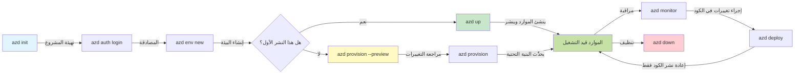
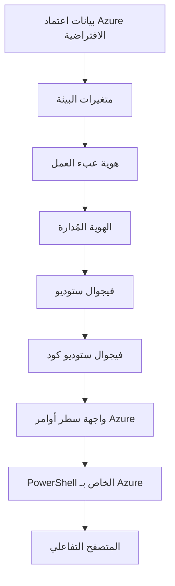

# AZD Basics - Understanding Azure Developer CLI

# AZD Basics - Core Concepts and Fundamentals

**تنقل الفصل:**
- **📚 الصفحة الرئيسية للدورة**: [AZD For Beginners](../../README.md)
- **📖 الفصل الحالي**: الفصل 1 - الأساس والبدء السريع
- **⬅️ السابق**: [Course Overview](../../README.md#-chapter-1-foundation--quick-start)
- **➡️ التالي**: [Installation & Setup](installation.md)
- **🚀 الفصل التالي**: [Chapter 2: AI-First Development](../chapter-02-ai-development/microsoft-foundry-integration.md)

## مقدمة

تقدم هذه الدرس مقدمة عن Azure Developer CLI (azd)، أداة سطر أوامر قوية تُسرّع رحلتك من التطوير المحلي إلى النشر على Azure. ستتعلم المفاهيم الأساسية والميزات الجوهرية وتفهم كيف يُبسط azd نشر التطبيقات السحابية الأصلية.

## أهداف التعلم

بنهاية هذا الدرس، ستتمكن من:
- فهم ما هو Azure Developer CLI وما هو هدفه الأساسي
- تعلم المفاهيم الأساسية للقوالب والبيئات والخدمات
- استكشاف الميزات الرئيسية بما في ذلك التطوير المدفوع بالقوالب والبنية التحتية ككود
- فهم بنية مشروع azd وسير العمل
- أن تكون مستعدًا لتثبيت وتكوين azd لبيئة التطوير الخاصة بك

## مخرجات التعلم

بعد إكمال هذا الدرس، ستتمكن من:
- شرح دور azd في سير عمل تطوير السحابة الحديثة
- تحديد مكونات بنية مشروع azd
- وصف كيف تعمل القوالب والبيئات والخدمات معًا
- فهم فوائد البنية التحتية ككود مع azd
- التعرف على أوامر azd المختلفة وأغراضها

## ما هو Azure Developer CLI (azd)?

Azure Developer CLI (azd) هو أداة سطر أوامر مصممة لتسريع رحلتك من التطوير المحلي إلى النشر على Azure. يبسط عملية بناء ونشر وإدارة التطبيقات السحابية الأصلية على Azure.

### 🎯 لماذا تستخدم AZD؟ مقارنة من العالم الواقعي

دعنا نقارن نشر تطبيق ويب بسيط مع قاعدة بيانات:

#### ❌ بدون AZD: نشر يدوي على Azure (30+ دقيقة)

```bash
# الخطوة 1: إنشاء مجموعة موارد
az group create --name myapp-rg --location eastus

# الخطوة 2: إنشاء خطة خدمة التطبيقات
az appservice plan create --name myapp-plan \
  --resource-group myapp-rg \
  --sku B1 --is-linux

# الخطوة 3: إنشاء تطبيق ويب
az webapp create --name myapp-web-unique123 \
  --resource-group myapp-rg \
  --plan myapp-plan \
  --runtime "NODE:18-lts"

# الخطوة 4: إنشاء حساب Cosmos DB (10–15 دقيقة)
az cosmosdb create --name myapp-cosmos-unique123 \
  --resource-group myapp-rg \
  --kind MongoDB

# الخطوة 5: إنشاء قاعدة بيانات
az cosmosdb mongodb database create \
  --account-name myapp-cosmos-unique123 \
  --resource-group myapp-rg \
  --name tododb

# الخطوة 6: إنشاء مجموعة
az cosmosdb mongodb collection create \
  --account-name myapp-cosmos-unique123 \
  --resource-group myapp-rg \
  --database-name tododb \
  --name todos

# الخطوة 7: الحصول على سلسلة الاتصال
CONN_STR=$(az cosmosdb keys list \
  --name myapp-cosmos-unique123 \
  --resource-group myapp-rg \
  --type connection-strings \
  --query "connectionStrings[0].connectionString" -o tsv)

# الخطوة 8: تكوين إعدادات التطبيق
az webapp config appsettings set \
  --name myapp-web-unique123 \
  --resource-group myapp-rg \
  --settings MONGODB_URI="$CONN_STR"

# الخطوة 9: تمكين السجلات
az webapp log config --name myapp-web-unique123 \
  --resource-group myapp-rg \
  --application-logging filesystem \
  --detailed-error-messages true

# الخطوة 10: إعداد Application Insights
az monitor app-insights component create \
  --app myapp-insights \
  --location eastus \
  --resource-group myapp-rg

# الخطوة 11: ربط Application Insights بتطبيق الويب
INSTRUMENTATION_KEY=$(az monitor app-insights component show \
  --app myapp-insights \
  --resource-group myapp-rg \
  --query "instrumentationKey" -o tsv)

az webapp config appsettings set \
  --name myapp-web-unique123 \
  --resource-group myapp-rg \
  --settings APPINSIGHTS_INSTRUMENTATIONKEY="$INSTRUMENTATION_KEY"

# الخطوة 12: بناء التطبيق محليًا
npm install
npm run build

# الخطوة 13: إنشاء حزمة النشر
zip -r app.zip . -x "*.git*" "node_modules/*"

# الخطوة 14: نشر التطبيق
az webapp deployment source config-zip \
  --resource-group myapp-rg \
  --name myapp-web-unique123 \
  --src app.zip

# الخطوة 15: انتظر وادعُ أن ينجح 🙏
# (لا يوجد تحقق آلي، مطلوب اختبار يدوي)
```

**المشاكل:**
- ❌ أكثر من 15 أمرًا لتتذكرها وتنفيذها بالترتيب
- ❌ 30-45 دقيقة عمل يدوي
- ❌ سهولة الوقوع في أخطاء (أخطاء هجائية، معلمات خاطئة)
- ❌ سلاسل الاتصال مكشوفة في سجل الطرفية
- ❌ لا استرجاع آلي في حال فشل شيء ما
- ❌ صعوبة التكرار لأعضاء الفريق
- ❌ يختلف كل مرة (غير قابل لإعادة الإنتاج)

#### ✅ مع AZD: نشر آلي (5 أوامر، 10-15 دقيقة)

```bash
# الخطوة 1: التهيئة من القالب
azd init --template todo-nodejs-mongo

# الخطوة 2: المصادقة
azd auth login

# الخطوة 3: إنشاء البيئة
azd env new dev

# الخطوة 4: معاينة التغييرات (اختياري لكنه موصى به)
azd provision --preview

# الخطوة 5: نشر كل شيء
azd up

# ✨ تم! كل شيء مُنشَر ومُكوَّن ومُراقَب
```

**الفوائد:**
- ✅ **5 أوامر** مقابل أكثر من 15 خطوة يدوية
- ✅ **10-15 دقيقة** إجمالي الوقت (معظمها انتظار Azure)
- ✅ **أخطاء صفرية** - مؤتمت ومُختبر
- ✅ **إدارة الأسرار بشكل آمن** عبر Key Vault
- ✅ **استرجاع تلقائي** عند الفشل
- ✅ **قابل لإعادة الإنتاج بالكامل** - نفس النتيجة في كل مرة
- ✅ **جاهز للفريق** - أي شخص يمكنه النشر بنفس الأوامر
- ✅ **البنية التحتية ككود** - قوالب Bicep تحت التحكم بالإصدار
- ✅ **مراقبة مدمجة** - Application Insights مُكوّن تلقائيًا

### 📊 تقليل الوقت والأخطاء

| Metric | Manual Deployment | AZD Deployment | Improvement |
|:-------|:------------------|:---------------|:------------|
| **Commands** | 15+ | 5 | 67% fewer |
| **Time** | 30-45 min | 10-15 min | 60% faster |
| **Error Rate** | ~40% | <5% | 88% reduction |
| **Consistency** | Low (manual) | 100% (automated) | Perfect |
| **Team Onboarding** | 2-4 hours | 30 minutes | 75% faster |
| **Rollback Time** | 30+ min (manual) | 2 min (automated) | 93% faster |

## المفاهيم الأساسية

### القوالب
القوالب هي أساس azd. تحتوي على:
- **كود التطبيق** - شفرتك المصدرية واعتمادياتك
- **تعريفات البنية التحتية** - موارد Azure المعرفة في Bicep أو Terraform
- **ملفات التكوين** - الإعدادات والمتغيرات البيئية
- **سكريبتات النشر** - سير العمل الآلي للنشر

### البيئات
تمثل البيئات أهداف نشر مختلفة:
- **التطوير** - للاختبار والتطوير
- **التجهيز** - بيئة ما قبل الإنتاج
- **الإنتاج** - بيئة الإنتاج الحية

كل بيئة تحتفظ بخاصية خاصة بها:
- مجموعة موارد Azure
- إعدادات التكوين
- حالة النشر

### الخدمات
الخدمات هي اللبنات الأساسية لتطبيقك:
- **الواجهة الأمامية** - تطبيقات الويب، SPAs
- **الواجهة الخلفية** - واجهات برمجة التطبيقات، الخدمات المصغرة
- **قاعدة البيانات** - حلول تخزين البيانات
- **التخزين** - تخزين الملفات والبلوب

## الميزات الرئيسية

### 1. التطوير المدفوع بالقوالب
```bash
# تصفح القوالب المتاحة
azd template list

# البدء من قالب
azd init --template <template-name>
```

### 2. البنية التحتية ككود
- **Bicep** - لغة نطاقية لـ Azure
- **Terraform** - أداة بنية تحتية متعددة السحب
- **ARM Templates** - قوالب Azure Resource Manager

### 3. سير العمل المتكامل
```bash
# سير عمل النشر الكامل
azd up            # توفير + نشر — هذا تلقائي لإعداد التشغيل الأول

# 🧪 جديد: معاينة تغييرات البنية التحتية قبل النشر (آمن)
azd provision --preview    # محاكاة نشر البنية التحتية دون إجراء تغييرات

azd provision     # إنشاء موارد Azure، استخدم هذا إذا قمت بتحديث البنية التحتية
azd deploy        # نشر كود التطبيق أو إعادة نشره بعد التحديث
azd down          # تنظيف الموارد
```

#### 🛡️ تخطيط آمن للبنية التحتية مع المعاينة
أمر `azd provision --preview` يغيّر قواعد اللعبة للنشر الآمن:
- **تحليل تشغيل تجريبي** - يعرض ما سيتم إنشاؤه أو تعديله أو حذفه
- **خطر صفري** - لا تُجرى تغييرات فعلية على بيئة Azure الخاصة بك
- **تعاون الفريق** - شارك نتائج المعاينة قبل النشر
- **تقدير التكلفة** - افهم تكاليف الموارد قبل الالتزام

```bash
# مثال على سير عمل المعاينة
azd provision --preview           # اطلع على ما سيتغير
# راجع المخرجات، وناقشها مع الفريق
azd provision                     # طبق التغييرات بثقة
```

### 📊 مرئي: سير عمل تطوير AZD


**شرح سير العمل:**
1. **Init** - ابدأ بقالب أو مشروع جديد
2. **Auth** - سجل الدخول إلى Azure
3. **Environment** - أنشئ بيئة نشر معزولة
4. **Preview** - 🆕 دائمًا عاين تغييرات البنية التحتية أولاً (ممارسة آمنة)
5. **Provision** - أنشئ/حدّث موارد Azure
6. **Deploy** - ادفع كود التطبيق الخاص بك
7. **Monitor** - راقب أداء التطبيق
8. **Iterate** - أجرِ تغييرات وأعد نشر الكود
9. **Cleanup** - أزل الموارد عند الانتهاء

### 4. إدارة البيئات
```bash
# إنشاء وإدارة البيئات
azd env new <environment-name>
azd env select <environment-name>
azd env list
```

## 📁 بنية المشروع

بنية مشروع azd النموذجية:
```
my-app/
├── .azd/                    # azd configuration
│   └── config.json
├── .azure/                  # Azure deployment artifacts
├── .devcontainer/          # Development container config
├── .github/workflows/      # GitHub Actions
├── .vscode/               # VS Code settings
├── infra/                 # Infrastructure code
│   ├── main.bicep        # Main infrastructure template
│   ├── main.parameters.json
│   └── modules/          # Reusable modules
├── src/                  # Application source code
│   ├── api/             # Backend services
│   └── web/             # Frontend application
├── azure.yaml           # azd project configuration
└── README.md
```

## 🔧 ملفات التكوين

### azure.yaml
ملف التكوين الرئيسي للمشروع:
```yaml
name: my-awesome-app
metadata:
  template: my-template@1.0.0

services:
  web:
    project: ./src/web
    language: js
    host: appservice
  api:
    project: ./src/api
    language: js
    host: appservice

hooks:
  preprovision:
    shell: pwsh
    run: echo "Preparing to provision..."
```

### .azure/config.json
تكوين خاص بالبيئة:
```json
{
  "version": 1,
  "defaultEnvironment": "dev",
  "environments": {
    "dev": {
      "subscriptionId": "your-subscription-id",
      "location": "eastus"
    }
  }
}
```

## 🎪 سير العمل الشائعة مع تمارين عملية

> **💡 نصيحة تعليمية:** اتبع هذه التمارين بالترتيب لبناء مهاراتك في AZD تدريجيًا.

### 🎯 التمرين 1: تهيئة مشروعك الأول

**الهدف:** إنشاء مشروع AZD واستكشاف بنيته

**الخطوات:**
```bash
# استخدم قالبًا مجرَّبًا
azd init --template todo-nodejs-mongo

# استعرض الملفات المُولَّدة
ls -la  # عرض جميع الملفات بما في ذلك الملفات المخفية

# الملفات الأساسية المُنشأة:
# - azure.yaml (التكوين الرئيسي)
# - infra/ (كود البنية التحتية)
# - src/ (كود التطبيق)
```

**✅ نجاح:** لديك azure.yaml ومجلدات infra/ و src/

---

### 🎯 التمرين 2: النشر إلى Azure

**الهدف:** إكمال النشر من البداية إلى النهاية

**الخطوات:**
```bash
# 1. المصادقة
az login && azd auth login

# 2. إنشاء بيئة
azd env new dev
azd env set AZURE_LOCATION eastus

# 3. معاينة التغييرات (موصى به)
azd provision --preview

# 4. نشر كل شيء
azd up

# 5. التحقق من النشر
azd show    # عرض رابط تطبيقك
```

**الوقت المتوقع:** 10-15 دقيقة  
**✅ نجاح:** يفتح عنوان التطبيق في المتصفح

---

### 🎯 التمرين 3: بيئات متعددة

**الهدف:** النشر إلى dev و staging

**الخطوات:**
```bash
# يوجد بالفعل فرع dev، أنشئ فرع staging
azd env new staging
azd env set AZURE_LOCATION westus2
azd up

# التبديل بينهما
azd env list
azd env select dev
```

**✅ نجاح:** مجموعتا موارد منفصلتان في بوابة Azure

---

### 🛡️ إعادة البداية النظيفة: `azd down --force --purge`

عندما تحتاج إلى إعادة ضبط كاملة:

```bash
azd down --force --purge
```

**ما الذي يفعله:**
- `--force`: لا يطلب تأكيدات
- `--purge`: يحذف كل الحالة المحلية وموارد Azure

**استخدمه عندما:**
- فشل النشر في منتصف الطريق
- تغيير المشاريع
- الحاجة إلى بداية جديدة

---

## 🎪 مرجع سير العمل الأصلي

### بدء مشروع جديد
```bash
# الطريقة 1: استخدم قالبًا موجودًا
azd init --template todo-nodejs-mongo

# الطريقة 2: ابدأ من الصفر
azd init

# الطريقة 3: استخدم الدليل الحالي
azd init .
```

### دورة التطوير
```bash
# إعداد بيئة التطوير
azd auth login
azd env new dev
azd env select dev

# نشر كل شيء
azd up

# إجراء تغييرات وإعادة النشر
azd deploy

# قم بتنظيف الموارد عند الانتهاء
azd down --force --purge # الأمر في Azure Developer CLI هو **إعادة ضبط شاملة** لبيئتك—مفيد بشكل خاص عند استكشاف أخطاء عمليات النشر الفاشلة، أو تنظيف الموارد اليتيمة، أو التحضير لإعادة نشر جديدة.
```

## فهم `azd down --force --purge`
أمر `azd down --force --purge` هو وسيلة قوية لتفكيك بيئة azd وجميع الموارد المرتبطة بها تمامًا. فيما يلي تفصيل لما يفعله كل مفتاح:
```
--force
```
- يتخطى مطالبات التأكيد.
- مفيد لأتمتة أو السكربتات حيث لا يكون الإدخال اليدوي ممكنًا.
- يضمن أن تتقدم عملية الإزالة دون انقطاع، حتى لو اكتشف CLI تناقضات.

```
--purge
```
يحذف **كل البيانات الوصفية المرتبطة**، بما في ذلك:
حالة البيئة
مجلد `.azure` المحلي
معلومات النشر المؤقتة
يمنع azd من "تذكر" عمليات النشر السابقة، والتي يمكن أن تسبب مشكلات مثل عدم تطابق مجموعات الموارد أو مراجع المستودع القديمة.

### لماذا نستخدم كلاهما؟
عندما تواجه جدارًا مع `azd up` بسبب حالة متبقية أو نشر جزئي، يضمن هذا المزيج بداية **نظيفة**.

يكون مفيدًا بشكل خاص بعد حذف الموارد يدويًا في بوابة Azure أو عند تغيير القوالب أو البيئات أو اتفاقيات تسمية مجموعات الموارد.

### إدارة بيئات متعددة
```bash
# إنشاء بيئة المعاينة
azd env new staging
azd env select staging
azd up

# العودة إلى بيئة التطوير
azd env select dev

# مقارنة البيئات
azd env list
```

## 🔐 المصادقة والاعتمادات

فهم المصادقة أمر حاسم لنجاح نشرات azd. تستخدم Azure طرق مصادقة متعددة، ويستفيد azd من نفس سلسلة الاعتمادات المستخدمة من قبل أدوات Azure الأخرى.

### مصادقة Azure CLI (`az login`)

قبل استخدام azd، تحتاج إلى المصادقة مع Azure. الطريقة الشائعة هي استخدام Azure CLI:

```bash
# تسجيل دخول تفاعلي (يفتح المتصفح)
az login

# تسجيل الدخول باستخدام مستأجر محدد
az login --tenant <tenant-id>

# تسجيل الدخول باستخدام كيان الخدمة
az login --service-principal -u <app-id> -p <password> --tenant <tenant-id>

# التحقق من حالة تسجيل الدخول الحالية
az account show

# عرض الاشتراكات المتاحة
az account list --output table

# تعيين الاشتراك الافتراضي
az account set --subscription <subscription-id>
```

### تدفق المصادقة
1. **تسجيل تفاعلي**: يفتح متصفحك الافتراضي للمصادقة
2. **تدفق رمز الجهاز**: للبيئات بدون وصول متصفح
3. **Service Principal**: لأتمتة وسيناريوهات CI/CD
4. **Managed Identity**: للتطبيقات المستضافة على Azure

### سلسلة DefaultAzureCredential

`DefaultAzureCredential` هو نوع اعتماد يوفر تجربة مصادقة مبسطة عن طريق محاولة مصادر اعتماد متعددة تلقائيًا بترتيب محدد:

#### ترتيب سلسلة الاعتماد

#### 1. متغيرات البيئة
```bash
# تعيين متغيرات البيئة للمعرّف الخدمي
export AZURE_CLIENT_ID="<app-id>"
export AZURE_CLIENT_SECRET="<password>"
export AZURE_TENANT_ID="<tenant-id>"
```

#### 2. Workload Identity (Kubernetes/GitHub Actions)
تُستخدم تلقائيًا في:
- Azure Kubernetes Service (AKS) مع Workload Identity
- GitHub Actions مع اتحاد OIDC
- سيناريوهات الهوية الموفرة الأخرى

#### 3. Managed Identity
للموارد على Azure مثل:
- الآلات الافتراضية
- App Service
- Azure Functions
- Container Instances

```bash
# تحقق مما إذا كان يعمل على مورد Azure باستخدام هوية مُدارة
az account show --query "user.type" --output tsv
# يعيد: "servicePrincipal" إذا تم استخدام هوية مُدارة
```

#### 4. تكامل أدوات المطور
- **Visual Studio**: يستخدم تلقائيًا الحساب المسجل
- **VS Code**: يستخدم اعتمادات امتداد Azure Account
- **Azure CLI**: يستخدم اعتمادات `az login` (الأكثر شيوعًا للتطوير المحلي)

### إعداد مصادقة AZD

```bash
# الطريقة 1: استخدم Azure CLI (موصى به للتطوير)
az login
azd auth login  # يستخدم بيانات اعتماد Azure CLI الحالية

# الطريقة 2: المصادقة المباشرة عبر azd
azd auth login --use-device-code  # لبيئات بدون واجهة

# الطريقة 3: تحقق من حالة المصادقة
azd auth login --check-status

# الطريقة 4: تسجيل الخروج وإعادة المصادقة
azd auth logout
azd auth login
```

### ممارسات المصادقة الأفضل

#### للتطوير المحلي
```bash
# 1. تسجيل الدخول باستخدام Azure CLI
az login

# 2. التحقق من صحة الاشتراك
az account show
az account set --subscription "Your Subscription Name"

# 3. استخدام azd مع بيانات الاعتماد الحالية
azd auth login
```

#### لخطوط CI/CD
```yaml
# GitHub Actions example
- name: Azure Login
  uses: azure/login@v1
  with:
    creds: ${{ secrets.AZURE_CREDENTIALS }}

- name: Deploy with azd
  run: |
    azd auth login --client-id ${{ secrets.AZURE_CLIENT_ID }} \
                    --client-secret ${{ secrets.AZURE_CLIENT_SECRET }} \
                    --tenant-id ${{ secrets.AZURE_TENANT_ID }}
    azd up --no-prompt
```

#### لبيئات الإنتاج
- استخدم **Managed Identity** عند التشغيل على موارد Azure
- استخدم **Service Principal** لسيناريوهات الأتمتة
- تجنب تخزين الاعتمادات في الشفرة أو ملفات التكوين
- استخدم **Azure Key Vault** للتكوين الحساس

### مشكلات المصادقة الشائعة وحلولها

#### مشكلة: "No subscription found"
```bash
# الحل: تعيين الاشتراك الافتراضي
az account list --output table
az account set --subscription "<subscription-id>"
azd env set AZURE_SUBSCRIPTION_ID "<subscription-id>"
```

#### مشكلة: "Insufficient permissions"
```bash
# الحل: تحقق وقم بتعيين الأدوار المطلوبة
az role assignment list --assignee $(az account show --query user.name --output tsv)

# الأدوار المطلوبة الشائعة:
# - المساهم (لإدارة الموارد)
# - مسؤول وصول المستخدمين (لتعيينات الأدوار)
```

#### مشكلة: "Token expired"
```bash
# الحل: إعادة المصادقة
az logout
az login
azd auth logout
azd auth login
```

### المصادقة في سيناريوهات مختلفة

#### التطوير المحلي
```bash
# حساب التطوير الشخصي
az login
azd auth login
```

#### تطوير الفريق
```bash
# استخدم مستأجراً محدداً للمنظمة
az login --tenant contoso.onmicrosoft.com
azd auth login
```

#### سيناريوهات متعددة المستأجرين
```bash
# التبديل بين المستأجرين
az login --tenant tenant1.onmicrosoft.com
# نشر إلى المستأجر 1
azd up

az login --tenant tenant2.onmicrosoft.com  
# نشر إلى المستأجر 2
azd up
```

### اعتبارات الأمان

1. **تخزين الاعتمادات**: لا تخزن الاعتمادات في الشفرة المصدرية أبدًا
2. **تقييد النطاق**: استخدم مبدأ الأقل امتيازًا لـ Service Principals
3. **تدوير الرموز**: قم بتدوير أسرار Service Principal بانتظام
4. **سجل التدقيق**: راقب أنشطة المصادقة والنشر
5. **أمن الشبكة**: استخدم نقاط نهاية خاصة عندما يكون ذلك ممكنًا

### استكشاف أخطاء المصادقة وإصلاحها

```bash
# استكشاف مشكلات المصادقة وإصلاحها
azd auth login --check-status
az account show
az account get-access-token

# أوامر تشخيصية شائعة
whoami                          # سياق المستخدم الحالي
az ad signed-in-user show      # تفاصيل مستخدم Azure AD
az group list                  # اختبار الوصول إلى المورد
```

## فهم `azd down --force --purge`

### الاكتشاف
```bash
azd template list              # تصفح القوالب
azd template show <template>   # تفاصيل القالب
azd init --help               # خيارات التهيئة
```

### إدارة المشروع
```bash
azd show                     # نظرة عامة على المشروع
azd env show                 # البيئة الحالية
azd config list             # إعدادات التكوين
```

### المراقبة
```bash
azd monitor                  # افتح المراقبة في بوابة Azure
azd monitor --logs           # عرض سجلات التطبيق
azd monitor --live           # عرض المقاييس المباشرة
azd pipeline config          # إعداد CI/CD
```

## أفضل الممارسات

### 1. استخدم أسماء ذات معنى
```bash
# جيد
azd env new production-east
azd init --template web-app-secure

# تجنب
azd env new env1
azd init --template template1
```

### 2. استفد من القوالب
- ابدأ بقوالب موجودة
- خصص لما تحتاجه
- أنشئ قوالب قابلة لإعادة الاستخدام لمؤسستك

### 3. عزل البيئات
- استخدم بيئات منفصلة للتطوير/التجهيز/الإنتاج
- لا تنشر إلى الإنتاج مباشرة من جهاز محلي
- استخدم خطوط CI/CD لنشرات الإنتاج

### 4. إدارة التكوين
- استخدم متغيرات البيئة للبيانات الحساسة
- احتفظ بالتكوين تحت نظام التحكم بالإصدار
- وثق الإعدادات الخاصة بكل بيئة

## تقدم التعلم

### مبتدئ (الأسبوع 1-2)
1. تثبيت azd والمصادقة
2. نشر قالب بسيط
3. فهم بنية المشروع
4. تعلم الأوامر الأساسية (up، down، deploy)

### متوسط (الأسبوع 3-4)
1. تخصيص القوالب
2. إدارة بيئات متعددة
3. فهم كود البنية التحتية
4. إعداد خطوط CI/CD

### متقدم (الأسبوع 5+)
1. إنشاء قوالب مخصصة
2. أنماط بنية تحتية متقدمة
3. نشر متعدد المناطق
4. تكوينات على مستوى المؤسسة

## الخطوات التالية

**📖 متابعة تعلم الفصل 1:**
- [التثبيت والإعداد](installation.md) - تثبيت azd وتكوينه
- [مشروعك الأول](first-project.md) - دورة عملية كاملة
- [دليل التكوين](configuration.md) - خيارات التكوين المتقدمة

**🎯 هل أنت جاهز للفصل التالي؟**
- [الفصل 2: التطوير المعتمد على الذكاء الاصطناعي](../chapter-02-ai-development/microsoft-foundry-integration.md) - ابدأ ببناء تطبيقات الذكاء الاصطناعي

## موارد إضافية

- [نظرة عامة على Azure Developer CLI](https://learn.microsoft.com/en-us/azure/developer/azure-developer-cli/)
- [معرض القوالب](https://azure.github.io/awesome-azd/)
- [نماذج المجتمع](https://github.com/Azure-Samples)

---

## 🙋 أسئلة متكررة

### أسئلة عامة

**س: ما الفرق بين AZD و Azure CLI؟**

ج: Azure CLI (`az`) مخصصة لإدارة موارد Azure الفردية. AZD (`azd`) مخصصة لإدارة التطبيقات بأكملها:

```bash
# Azure CLI - إدارة الموارد على مستوى منخفض
az webapp create --name myapp --resource-group rg
az sql server create --name myserver --resource-group rg
# ...هناك حاجة إلى المزيد من الأوامر

# AZD - إدارة على مستوى التطبيق
azd up  # ينشر التطبيق بالكامل مع كافة الموارد
```

**فكّر في الأمر بهذه الطريقة:**
- `az` = العمل على قطع ليغو مفردة
- `azd` = العمل مع مجموعات ليغو كاملة

---

**س: هل أحتاج إلى معرفة Bicep أو Terraform لاستخدام AZD؟**

ج: لا! ابدأ بالقوالب:
```bash
# استخدم القالب الموجود - لا حاجة إلى معرفة IaC
azd init --template todo-nodejs-mongo
azd up
```

يمكنك تعلم Bicep لاحقًا لتخصيص البنية التحتية. توفر القوالب أمثلة عملية للتعلم منها.

---

**س: كم يكلف تشغيل قوالب AZD؟**

ج: التكاليف تختلف حسب القالب. معظم قوالب التطوير تكلف 50–150 دولارًا شهريًا:

```bash
# معاينة التكاليف قبل النشر
azd provision --preview

# قم دائمًا بالتنظيف عند عدم الاستخدام
azd down --force --purge  # يزيل جميع الموارد
```

**نصيحة احترافية:** استخدم الطبقات المجانية حيثما كانت متاحة:
- App Service: F1 (النسخة المجانية)
- Azure OpenAI: 50,000 توكن شهريًا مجانًا
- Cosmos DB: 1000 RU/s طبقة مجانية

---

**س: هل يمكنني استخدام AZD مع موارد Azure الحالية؟**

ج: نعم، لكن من الأسهل البدء من جديد. يعمل AZD بشكل أفضل عندما يدير دورة الحياة بالكامل. بالنسبة للموارد الموجودة:

```bash
# الخيار 1: استيراد الموارد الموجودة (متقدم)
azd init
# ثم عدل infra/ للإشارة إلى الموارد الموجودة

# الخيار 2: البدء من جديد (موصى به)
azd init --template matching-your-stack
azd up  # ينشئ بيئة جديدة
```

---

**س: كيف أشارك مشروعي مع زملاء الفريق؟**

ج: قم بعمل commit لمشروع AZD إلى Git (ولكن لا تقم بعمل commit لمجلد .azure):

```bash
# مدرج بالفعل في .gitignore بشكل افتراضي
.azure/        # يحتوي على أسرار وبيانات البيئة
*.env          # متغيرات البيئة

# أعضاء الفريق بعد ذلك:
git clone <your-repo>
azd auth login
azd env new <their-name>-dev
azd up
```

يحصل الجميع على بنية تحتية متطابقة من نفس القوالب.

---

### أسئلة استكشاف الأخطاء وإصلاحها

**س: "azd up" فشل في منتصف التنفيذ. ماذا أفعل؟**

ج: تحقق من الخطأ، قم بإصلاحه، ثم أعد المحاولة:

```bash
# عرض السجلات التفصيلية
azd show

# إصلاحات شائعة:

# 1. إذا تم تجاوز الحصة:
azd env set AZURE_LOCATION "westus2"  # جرّب منطقة مختلفة

# 2. إذا كان هناك تعارض في أسماء الموارد:
azd down --force --purge  # ابدأ من جديد
azd up  # أعد المحاولة

# 3. إذا انتهت صلاحية المصادقة:
az login
azd auth login
azd up
```

**أكثر مشكلات شيوعًا:** اختيار اشتراك Azure خاطئ
```bash
az account list --output table
az account set --subscription "<correct-subscription>"
```

---

**س: كيف أنشر تغييرات الكود فقط دون إعادة تهيئة البنية التحتية؟**

ج: استخدم `azd deploy` بدلاً من `azd up`:

```bash
azd up          # المرة الأولى: التهيئة + النشر (بطيء)

# قم بإجراء تغييرات على الكود...

azd deploy      # في المرات التالية: النشر فقط (سريع)
```

مقارنة السرعة:
- `azd up`: 10-15 دقيقة (يهيئ البنية التحتية)
- `azd deploy`: 2-5 دقائق (الكود فقط)

---

**س: هل يمكنني تخصيص قوالب البنية التحتية؟**

ج: نعم! قم بتحرير ملفات Bicep في `infra/`:

```bash
# بعد azd init
cd infra/
code main.bicep  # تحرير في VS Code

# معاينة التغييرات
azd provision --preview

# تطبيق التغييرات
azd provision
```

**نصيحة:** ابدأ بخطوات صغيرة - غيّر SKUs أولًا:
```bicep
// infra/main.bicep
sku: {
  name: 'B1'  // Change to 'P1V2' for production
}
```

---

**س: كيف أحذف كل ما أنشأه AZD؟**

ج: أمر واحد يزيل كل الموارد:

```bash
azd down --force --purge

# يحذف ما يلي:
# - جميع موارد أزور
# - مجموعة الموارد
# - حالة البيئة المحلية
# - بيانات النشر المخزنة مؤقتًا
```

**قم بتشغيل هذا دائمًا عندما:**
- انتهيت من اختبار قالب
- تنتقل إلى مشروع مختلف
- تريد البدء من جديد

**توفير التكاليف:** حذف الموارد غير المستخدمة = لا رسوم

---

**س: ماذا لو حذفت الموارد عن طريق الخطأ في بوابة Azure؟**

ج: قد يخرج حالة AZD عن المزامنة. نهج البداية من جديد:

```bash
# 1. إزالة الحالة المحلية
azd down --force --purge

# 2. ابدأ من جديد
azd up

# بديل: دع AZD يكتشف ويصلح
azd provision  # سيقوم بإنشاء الموارد المفقودة
```

---

### أسئلة متقدمة

**س: هل يمكنني استخدام AZD في خطوط CI/CD؟**

ج: نعم! مثال GitHub Actions:

```yaml
# .github/workflows/deploy.yml
name: Deploy with AZD

on:
  push:
    branches: [main]

jobs:
  deploy:
    runs-on: ubuntu-latest
    steps:
      - uses: actions/checkout@v2
      
      - name: Install azd
        run: curl -fsSL https://aka.ms/install-azd.sh | bash
      
      - name: Azure Login
        run: |
          azd auth login \
            --client-id ${{ secrets.AZURE_CLIENT_ID }} \
            --client-secret ${{ secrets.AZURE_CLIENT_SECRET }} \
            --tenant-id ${{ secrets.AZURE_TENANT_ID }}
      
      - name: Deploy
        run: azd up --no-prompt
```

---

**س: كيف أتعامل مع الأسرار والبيانات الحساسة؟**

ج: يتكامل AZD تلقائيًا مع Azure Key Vault:

```bash
# يتم تخزين الأسرار في Key Vault، وليس في الشيفرة
azd env set DATABASE_PASSWORD "$(openssl rand -base64 32)"

# يقوم AZD تلقائيًا:
# 1. ينشئ Key Vault
# 2. يخزن السر
# 3. يمنح التطبيق حق الوصول عبر Managed Identity
# 4. يحقنها أثناء وقت التشغيل
```

**لا تقم بعمل commit لـ:**
- `.azure/` folder (يحتوي على بيانات البيئة)
- `.env` files (أسرار محلية)
- Connection strings

---

**س: هل يمكنني النشر إلى مناطق متعددة؟**

ج: نعم، أنشئ بيئة لكل منطقة:

```bash
# بيئة شرق الولايات المتحدة
azd env new prod-eastus
azd env set AZURE_LOCATION eastus
azd up

# بيئة أوروبا الغربية
azd env new prod-westeurope
azd env set AZURE_LOCATION westeurope
azd up

# كل بيئة مستقلة
azd env list
```

بالنسبة لتطبيقات متعددة المناطق حقيقية، قم بتخصيص قوالب Bicep للنشر إلى مناطق متعددة في وقت واحد.

---

**س: أين يمكنني الحصول على مساعدة إذا علقت؟**

1. **توثيق AZD:** https://learn.microsoft.com/azure/developer/azure-developer-cli/
2. **مشكلات GitHub:** https://github.com/Azure/azure-dev/issues
3. **ديسكورد:** [Azure Discord](https://discord.gg/microsoft-azure) - قناة #azure-developer-cli
4. **Stack Overflow:** الوسم `azure-developer-cli`
5. **هذه الدورة:** [دليل استكشاف الأخطاء](../chapter-07-troubleshooting/common-issues.md)

**نصيحة احترافية:** قبل السؤال، شغّل:
```bash
azd show       # يعرض الحالة الحالية
azd version    # يعرض إصدارك
```
أدرج هذه المعلومات في سؤالك للحصول على مساعدة أسرع.

---

## 🎓 ما التالي؟

أنت الآن تفهم أساسيات AZD. اختر مسارك:

### 🎯 للمبتدئين:
1. **التالي:** [التثبيت والإعداد](installation.md) - ثبّت AZD على جهازك
2. **ثم:** [مشروعك الأول](first-project.md) - انشر تطبيقك الأول
3. **ممارسة:** أكمل التمارين الثلاثة في هذا الدرس

### 🚀 لمطوري الذكاء الاصطناعي:
1. **انتقل إلى:** [الفصل 2: التطوير المعتمد على الذكاء الاصطناعي](../chapter-02-ai-development/microsoft-foundry-integration.md)
2. **نشر:** ابدأ بـ `azd init --template get-started-with-ai-chat`
3. **تعلم:** ابنِ أثناء النشر

### 🏗️ للمطورين ذوي الخبرة:
1. **راجع:** [دليل التكوين](configuration.md) - الإعدادات المتقدمة
2. **استكشف:** [البنية التحتية ككود](../chapter-04-infrastructure/provisioning.md) - نظرة متعمقة على Bicep
3. **ابنِ:** أنشئ قوالب مخصصة للمكدس الخاص بك

---

**التنقل بين الفصول:**
- **📚 الصفحة الرئيسية للدورة**: [AZD للمبتدئين](../../README.md)
- **📖 الفصل الحالي**: الفصل 1 - الأساس والبدء السريع  
- **⬅️ السابق**: [نظرة عامة على الدورة](../../README.md#-chapter-1-foundation--quick-start)
- **➡️ التالي**: [التثبيت والإعداد](installation.md)
- **🚀 الفصل التالي**: [الفصل 2: التطوير المعتمد على الذكاء الاصطناعي](../chapter-02-ai-development/microsoft-foundry-integration.md)

---

<!-- CO-OP TRANSLATOR DISCLAIMER START -->
إخلاء المسؤولية:
تمت ترجمة هذا المستند باستخدام خدمة ترجمة بالذكاء الاصطناعي Co‑op Translator (https://github.com/Azure/co-op-translator). بينما نسعى لتحقيق الدقة، يرجى ملاحظة أن الترجمات الآلية قد تحتوي على أخطاء أو معلومات غير دقيقة. يجب اعتبار المستند الأصلي بلغته الأصلية المرجع الرسمي. للمعلومات الحرجة، يُنصح بالاستعانة بترجمة بشرية محترفة. لا نتحمل أي مسؤولية عن أي سوء فهم أو تفسير خاطئ ينشأ عن استخدام هذه الترجمة.
<!-- CO-OP TRANSLATOR DISCLAIMER END -->