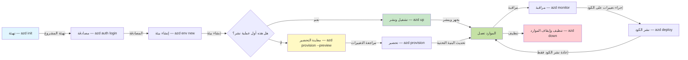
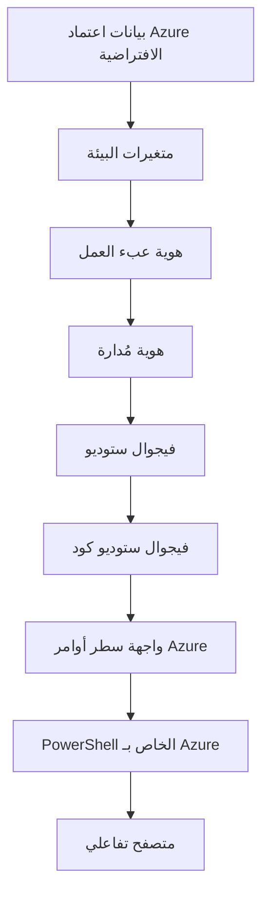

# أساسيات AZD - فهم Azure Developer CLI

# أساسيات AZD - المفاهيم الأساسية والأساسيات

**تنقل الفصل:**
- **📚 الصفحة الرئيسية للدورة**: [AZD للمبتدئين](../../README.md)
- **📖 الفصل الحالي**: الفصل 1 - الأساس والبدء السريع
- **⬅️ السابق**: [نظرة عامة على الدورة](../../README.md#-chapter-1-foundation--quick-start)
- **➡️ التالي**: [التثبيت والإعداد](installation.md)
- **🚀 الفصل التالي**: [الفصل 2: التطوير الموجه بالذكاء الاصطناعي](../chapter-02-ai-development/microsoft-foundry-integration.md)

## المقدمة

تقدم هذه الدرسة مقدمة إلى Azure Developer CLI (azd)، أداة سطر أوامر قوية تُسرّع رحلتك من التطوير المحلي إلى النشر في Azure. ستتعلم المفاهيم الأساسية، الميزات الجوهرية، وتفهم كيف يُبسّط azd نشر التطبيقات السحابية الأصلية.

## أهداف التعلم

بنهاية هذا الدرس، ستتمكن من:
- فهم ما هي Azure Developer CLI وما هو هدفها الرئيسي
- تعلم المفاهيم الأساسية للقوالب والبيئات والخدمات
- استكشاف الميزات الرئيسية بما في ذلك تطوير مدفوع بالقوالب والبنية التحتية ككود
- فهم هيكل مشروع azd وسير العمل
- الاستعداد لتثبيت وتكوين azd لبيئة تطويرك

## نواتج التعلم

بعد إكمال هذا الدرس، ستكون قادرًا على:
- شرح دور azd في سير عمل التطوير السحابي الحديث
- التعرف على مكونات هيكل مشروع azd
- وصف كيفية تفاعل القوالب والبيئات والخدمات معًا
- فهم فوائد البنية التحتية ككود مع azd
- التعرف على أوامر azd المختلفة وأغراضها

## ما هي Azure Developer CLI (azd)؟

Azure Developer CLI (azd) هي أداة سطر أوامر مصممة لتسريع رحلتك من التطوير المحلي إلى النشر على Azure. تُبسّط عملية إنشاء ونشر وإدارة التطبيقات السحابية الأصلية على Azure.

### ما الذي يمكنك نشره باستخدام azd؟

يدعم azd مجموعة واسعة من أحمال العمل — والقائمة مستمرة في التوسع. اليوم، يمكنك استخدام azd لنشر:

| نوع عبء العمل | أمثلة | نفس سير العمل؟ |
|---------------|----------|----------------|
| **التطبيقات التقليدية** | تطبيقات الويب، واجهات REST API، المواقع الثابتة | ✅ `azd up` |
| **الخدمات والميكروسيرفيسز** | Container Apps، Function Apps، بنى خلفية متعددة الخدمات | ✅ `azd up` |
| **التطبيقات المعززة بالذكاء الاصطناعي** | تطبيقات الدردشة مع Microsoft Foundry Models، حلول RAG مع AI Search | ✅ `azd up` |
| **الوكلاء الأذكياء** | وكلاء مستضافون على Foundry، تنسيقات متعددة الوكلاء | ✅ `azd up` |

الفكرة الرئيسية هي أن **دورة حياة azd تبقى نفسها بغض النظر عما تقوم بنشره**. تقوم بتهيئة مشروع، توفير البنية التحتية، نشر الشيفرة، مراقبة تطبيقك، وتنظيف الموارد — سواء كان موقع ويب بسيطًا أو وكيل ذكاء اصطناعي متقدم.

هذا الاستمرارية مقصودة. يعامل azd قدرات الذكاء الاصطناعي كنوع آخر من الخدمات التي يمكن لتطبيقك استخدامها، وليس كشيء مختلف جوهريًا. نقطة نهاية دردشة مدعومة بـ Microsoft Foundry Models هي، من منظور azd، مجرد خدمة أخرى لتكوينها ونشرها.

### 🎯 لماذا استخدام AZD؟ مقارنة من العالم الحقيقي

لِنقارن نشر تطبيق ويب بسيط مع قاعدة بيانات:

#### ❌ بدون AZD: نشر Azure يدوي (أكثر من 30 دقيقة)

```bash
# الخطوة 1: إنشاء مجموعة موارد
az group create --name myapp-rg --location eastus

# الخطوة 2: إنشاء خطة خدمة التطبيقات
az appservice plan create --name myapp-plan \
  --resource-group myapp-rg \
  --sku B1 --is-linux

# الخطوة 3: إنشاء تطبيق ويب
az webapp create --name myapp-web-unique123 \
  --resource-group myapp-rg \
  --plan myapp-plan \
  --runtime "NODE:18-lts"

# الخطوة 4: إنشاء حساب Cosmos DB (10-15 دقيقة)
az cosmosdb create --name myapp-cosmos-unique123 \
  --resource-group myapp-rg \
  --kind MongoDB

# الخطوة 5: إنشاء قاعدة بيانات
az cosmosdb mongodb database create \
  --account-name myapp-cosmos-unique123 \
  --resource-group myapp-rg \
  --name tododb

# الخطوة 6: إنشاء مجموعة
az cosmosdb mongodb collection create \
  --account-name myapp-cosmos-unique123 \
  --resource-group myapp-rg \
  --database-name tododb \
  --name todos

# الخطوة 7: الحصول على سلسلة الاتصال
CONN_STR=$(az cosmosdb keys list \
  --name myapp-cosmos-unique123 \
  --resource-group myapp-rg \
  --type connection-strings \
  --query "connectionStrings[0].connectionString" -o tsv)

# الخطوة 8: تكوين إعدادات التطبيق
az webapp config appsettings set \
  --name myapp-web-unique123 \
  --resource-group myapp-rg \
  --settings MONGODB_URI="$CONN_STR"

# الخطوة 9: تمكين التسجيل
az webapp log config --name myapp-web-unique123 \
  --resource-group myapp-rg \
  --application-logging filesystem \
  --detailed-error-messages true

# الخطوة 10: إعداد Application Insights
az monitor app-insights component create \
  --app myapp-insights \
  --location eastus \
  --resource-group myapp-rg

# الخطوة 11: ربط App Insights بتطبيق الويب
INSTRUMENTATION_KEY=$(az monitor app-insights component show \
  --app myapp-insights \
  --resource-group myapp-rg \
  --query "instrumentationKey" -o tsv)

az webapp config appsettings set \
  --name myapp-web-unique123 \
  --resource-group myapp-rg \
  --settings APPINSIGHTS_INSTRUMENTATIONKEY="$INSTRUMENTATION_KEY"

# الخطوة 12: بناء التطبيق محليًا
npm install
npm run build

# الخطوة 13: إنشاء حزمة النشر
zip -r app.zip . -x "*.git*" "node_modules/*"

# الخطوة 14: نشر التطبيق
az webapp deployment source config-zip \
  --resource-group myapp-rg \
  --name myapp-web-unique123 \
  --src app.zip

# الخطوة 15: انتظر وادعُ أن يعمل 🙏
# (لا يوجد تحقق تلقائي، يلزم اختبار يدوي)
```

**المشكلات:**
- ❌ أكثر من 15 أمرًا للتذكر والتنفيذ بالترتيب
- ❌ 30-45 دقيقة من العمل اليدوي
- ❌ سهل الوقوع في أخطاء (أخطاء مطبعية، معلمات خاطئة)
- ❌ سلاسل الاتصال معرضة في سجل الطرفية
- ❌ لا تراجع آلي إذا فشل شيء ما
- ❌ صعب التكرار لأعضاء الفريق
- ❌ مختلف في كل مرة (غير قابل للتكاثر)

#### ✅ مع AZD: نشر آلي (5 أوامر، 10-15 دقيقة)

```bash
# الخطوة 1: التهيئة من القالب
azd init --template todo-nodejs-mongo

# الخطوة 2: المصادقة
azd auth login

# الخطوة 3: إنشاء البيئة
azd env new dev

# الخطوة 4: معاينة التغييرات (اختياري لكنه موصى به)
azd provision --preview

# الخطوة 5: نشر كل شيء
azd up

# ✨ تم! كل شيء نُشر، وتم تكوينه ومراقبته
```

**الفوائد:**
- ✅ **5 أوامر** مقابل أكثر من 15 خطوة يدوية
- ✅ **10-15 دقيقة** إجمالي الوقت (معظمها انتظار Azure)
- ✅ **أخطاء يدوية أقل** - سير عمل متسق مدفوع بالقوالب
- ✅ **تعامل آمن مع الأسرار** - العديد من القوالب تستخدم تخزين أسرار مدار من Azure
- ✅ **نشر متكرر** - نفس سير العمل في كل مرة
- ✅ **قابلية إعادة إنتاج كاملة** - نفس النتيجة في كل مرة
- ✅ **جاهز للفريق** - أي شخص يمكنه النشر بنفس الأوامر
- ✅ **البنية التحتية ككود** - قوالب Bicep تحت التحكم بالإصدارات
- ✅ **مراقبة مدمجة** - تم تكوين Application Insights تلقائيًا

### 📊 تقليل الوقت والأخطاء

| المقياس | النشر اليدوي | نشر AZD | التحسن |
|:-------|:------------------|:---------------|:------------|
| **الأوامر** | 15+ | 5 | 67% أقل |
| **الوقت** | 30-45 دقيقة | 10-15 دقيقة | 60% أسرع |
| **معدل الخطأ** | ~40% | <5% | انخفاض 88% |
| **الاتساق** | منخفض (يدوي) | 100% (آلي) | مثالي |
| **الانضمام للفريق** | 2-4 ساعات | 30 دقيقة | 75% أسرع |
| **وقت الاسترجاع** | 30+ دقيقة (يدوي) | 2 دقيقة (آلي) | 93% أسرع |

## المفاهيم الأساسية

### القوالب
القوالب هي أساس azd. تحتوي على:
- **شيفرة التطبيق** - شفرتك المصدرية والاعتماديات
- **تعريفات البنية التحتية** - موارد Azure معرفة في Bicep أو Terraform
- **ملفات التكوين** - الإعدادات والمتغيرات البيئية
- **نصوص النشر** - سير عمل النشر الآلي

### البيئات
البيئات تمثل أهداف النشر المختلفة:
- **التطوير** - للاختبار والتطوير
- **التجهيز (Staging)** - بيئة ما قبل الإنتاج
- **الإنتاج** - بيئة الإنتاج الحية

تحافظ كل بيئة على:
- مجموعة موارد Azure خاصة بها
- إعدادات التكوين
- حالة النشر

### الخدمات
الخدمات هي لبنات تطبيقك:
- **الواجهة الأمامية** - تطبيقات الويب، تطبيقات الصفحة الواحدة (SPA)
- **الخلفية** - واجهات برمجة التطبيقات، الميكروسيرفيسز
- **قاعدة البيانات** - حلول تخزين البيانات
- **التخزين** - تخزين الملفات والبلوب

## الميزات الرئيسية

### 1. التطوير المدفوع بالقوالب
```bash
# تصفح القوالب المتاحة
azd template list

# التهيئة من قالب
azd init --template <template-name>
```

### 2. البنية التحتية ككود
- **Bicep** - لغة المجال الخاصة بـ Azure
- **Terraform** - أداة بنية تحتية متعددة السحابات
- **قوالب ARM** - قوالب Azure Resource Manager

### 3. سير عمل مدمج
```bash
# سير العمل الكامل للنشر
azd up            # التجهيز + النشر — لا يتطلب تدخلًا لإعداد المرة الأولى

# 🧪 جديد: معاينة تغييرات البنية التحتية قبل النشر (آمن)
azd provision --preview    # محاكاة نشر البنية التحتية دون إجراء تغييرات

azd provision     # إنشاء موارد Azure إذا قمت بتحديث البنية التحتية فاستخدم هذا
azd deploy        # نشر كود التطبيق أو إعادة نشره بعد التحديث
azd down          # تنظيف الموارد
```

#### 🛡️ تخطيط بنية آمن مع المعاينة
أمر `azd provision --preview` يغير قواعد اللعبة للنشر الآمن:
- **تحليل تشغيل جاف** - يظهر ما سيتم إنشاؤه أو تعديله أو حذفه
- **مخاطر صفرية** - لا يتم إجراء تغييرات فعلية على بيئتك في Azure
- **تعاون الفريق** - شارك نتائج المعاينة قبل النشر
- **تقدير التكلفة** - افهم تكاليف الموارد قبل الالتزام

```bash
# مثال على سير عمل المعاينة
azd provision --preview           # اطلع على ما سيتغير
# راجع المخرجات، ناقش مع الفريق
azd provision                     # طبق التغييرات بثقة
```

### 📊 توضيحي: سير عمل تطوير AZD


```mermaid
graph LR
    A[تهيئة — azd init] -->|تهيئة المشروع| B[مصادقة — azd auth login]
    B -->|المصادقة| C[إنشاء بيئة — azd env new]
    C -->|إنشاء بيئة| D{هل هذه أول عملية نشر؟}
    D -->|نعم| E[تشغيل ونشر — azd up]
    D -->|لا| F[معاينة التحضير — azd provision --preview]
    F -->|مراجعة التغييرات| G[تحضير — azd provision]
    E -->|يجهز وينشر| H[الموارد تعمل]
    G -->|تحديث البنية التحتية| H
    H -->|مراقبة| I[مراقبة — azd monitor]
    I -->|إجراء تغييرات على الكود| J[نشر الكود — azd deploy]
    J -->|إعادة نشر الكود فقط| H
    H -->|تنظيف| K[تنظيف وإيقاف الموارد — azd down]
    
    style A fill:#e1f5fe
    style E fill:#c8e6c9
    style F fill:#fff9c4
    style H fill:#c5e1a5
    style K fill:#ffcdd2
```

**شرح سير العمل:**
1. **Init** - ابدأ بقالب أو مشروع جديد
2. **Auth** - المصادقة مع Azure
3. **Environment** - إنشاء بيئة نشر معزولة
4. **Preview** - 🆕 دائمًا عاين تغييرات البنية أولًا (ممارسة آمنة)
5. **Provision** - إنشاء/تحديث موارد Azure
6. **Deploy** - دفع شيفرة التطبيق الخاصة بك
7. **Monitor** - مراقبة أداء التطبيق
8. **Iterate** - إجراء تغييرات وإعادة نشر الشيفرة
9. **Cleanup** - إزالة الموارد عند الانتهاء

### 4. إدارة البيئات
```bash
# إنشاء وإدارة البيئات
azd env new <environment-name>
azd env select <environment-name>
azd env list
```

### 5. الإضافات وأوامر الذكاء الاصطناعي

يستخدم azd نظام إضافات لإضافة قدرات تتجاوز CLI الأساسي. هذا مفيد بشكل خاص لأحمال عمل الذكاء الاصطناعي:

```bash
# اعرض الإضافات المتاحة
azd extension list

# ثبّت امتداد وكلاء Foundry
azd extension install azure.ai.agents

# هيئ مشروع وكيل ذكاء اصطناعي من ملف المانيفست
azd ai agent init -m agent-manifest.yaml

# اختبر وكيل منشور (يعرض الكمون وزمن الوصول لأول بايت)
azd ai agent invoke

# ابدأ خادم MCP لتطوير بمساعدة الذكاء الاصطناعي (ألفا)
azd mcp start
```

**دورة حياة الوكيل، من البداية إلى النهاية.** بمجرد تثبيت `azure.ai.agents`، يأخذك سير عمل واحد من الفكرة إلى وكيل يعمل ومراقب. لست بحاجة إلى كل هذه الأشياء في اليوم الأول — فقط اعرف أنها موجودة:

| المرحلة | الأمر | ما الذي يقوم به |
|-------|---------|--------------|
| **الهيكلة (Scaffold)** | `azd ai agent init -m <manifest>` | إنشاء مشروع وكيل من وصف مانيفست |
| **الاختبار** | `azd ai agent invoke` | استدعاء الوكيل وعرض توقيت الاستجابة |
| **القياس** | `azd ai agent eval generate` | إنشاء مجموعة بيانات تقييم للوكيل |
| **التحسين** | `azd ai agent optimize` | تحسين تعليمات الوكيل مقابل بياناتك |
| **الفحص** | `azd ai agent endpoint show` | عرض تكوين نقطة النهاية الحية |
| **التنظيف** | `azd ai agent delete` | حذف وكيل مستضاف وكل إصداراته |

> يتم تغطية الإضافات بالتفصيل في [الفصل 2: التطوير الموجه بالذكاء الاصطناعي](../chapter-02-ai-development/agents.md) ومرجع [أوامر AZD AI CLI](../chapter-08-production/production-ai-practices.md#azd-ai-cli-commands-and-extensions).

## 📁 هيكل المشروع

هيكل مشروع azd نموذجي:
```
my-app/
├── .azd/                    # azd configuration
│   └── config.json
├── .azure/                  # Azure deployment artifacts
├── .devcontainer/          # Development container config
├── .github/workflows/      # GitHub Actions
├── .vscode/               # VS Code settings
├── infra/                 # Infrastructure code
│   ├── main.bicep        # Main infrastructure template
│   ├── main.parameters.json
│   └── modules/          # Reusable modules
├── src/                  # Application source code
│   ├── api/             # Backend services
│   └── web/             # Frontend application
├── azure.yaml           # azd project configuration
└── README.md
```

## 🔧 ملفات التكوين

### azure.yaml
ملف تكوين المشروع الرئيسي:
```yaml
name: my-awesome-app
metadata:
  template: my-template@1.0.0

services:
  web:
    project: ./src/web
    language: js
    host: appservice
  api:
    project: ./src/api
    language: js
    host: appservice

hooks:
  preprovision:
    shell: pwsh
    run: echo "Preparing to provision..."
```

### .azure/config.json
تكوين خاص بالبيئة:
```json
{
  "version": 1,
  "defaultEnvironment": "dev",
  "environments": {
    "dev": {
      "subscriptionId": "your-subscription-id",
      "location": "eastus"
    }
  }
}
```

## 🎪 سير عمل شائع مع تمارين عملية

> **💡 نصيحة تعلم:** اتبع هذه التمارين بترتيبها لبناء مهاراتك في AZD تدريجيًا.

### 🎯 تمرين 1: تهيئة مشروعك الأول

**الهدف:** إنشاء مشروع AZD واستكشاف هيكله

**الخطوات:**
```bash
# استخدم قالبًا مجرَّبًا
azd init --template todo-nodejs-mongo

# استعرض الملفات المُولَّدة
ls -la  # اعرض جميع الملفات بما في ذلك الملفات المخفية

# الملفات الأساسية التي تم إنشاؤها:
# - azure.yaml (التكوين الرئيسي)
# - infra/ (كود البنية التحتية)
# - src/ (كود التطبيق)
```

**✅ نجاح:** لديك دلائل azure.yaml و infra/ و src/

---

### 🎯 تمرين 2: النشر إلى Azure

**الهدف:** إكمال نشر من البداية للنهاية

**الخطوات:**
```bash
# 1. المصادقة
az login && azd auth login

# 2. إنشاء البيئة
azd env new dev
azd env set AZURE_LOCATION eastus

# 3. معاينة التغييرات (موصى به)
azd provision --preview

# 4. نشر كل شيء
azd up

# 5. التحقق من النشر
azd show    # عرض عنوان URL الخاص بتطبيقك
```

**الوقت المتوقع:** 10-15 دقيقة  
**✅ نجاح:** عنوان التطبيق يفتح في المتصفح

---

### 🎯 تمرين 3: بيئات متعددة

**الهدف:** النشر إلى dev و staging

**الخطوات:**
```bash
# لديك dev بالفعل، أنشئ staging
azd env new staging
azd env set AZURE_LOCATION westus2
azd up

# التبديل بينهما
azd env list
azd env select dev
```

**✅ نجاح:** مجموعتا موارد منفصلتان في بوابة Azure

---

### 🛡️ إعادة تعيين كاملة: `azd down --force --purge`

عندما تحتاج إلى إعادة تعيين كاملة:

```bash
azd down --force --purge
```

**ما الذي يفعله:**
- `--force`: لا مطالبات تأكيد
- `--purge`: يحذف كل الحالة المحلية وموارد Azure

**متى تستخدمه:**
- فشل النشر في منتصف الطريق
- تبديل المشاريع
- الحاجة إلى بداية جديدة

---

## 🎪 مرجع سير العمل الأصلي

### بدء مشروع جديد
```bash
# الطريقة 1: استخدم القالب الموجود
azd init --template todo-nodejs-mongo

# الطريقة 2: ابدأ من الصفر
azd init

# الطريقة 3: استخدم الدليل الحالي
azd init .
```

### دورة التطوير
```bash
# إعداد بيئة التطوير
azd auth login
azd env new dev
azd env select dev

# نشر كل شيء
azd up

# قم بإجراء تغييرات وأعد النشر
azd deploy

# نظف عند الانتهاء
azd down --force --purge # الأمر في Azure Developer CLI هو **إعادة ضبط كاملة** لبيئتك—مفيدة بشكل خاص عندما تقوم باستكشاف أخطاء عمليات النشر الفاشلة، أو تنظيف الموارد اليتيمة، أو التحضير لإعادة نشر جديدة.
```

## فهم `azd down --force --purge`
أمر `azd down --force --purge` هو وسيلة قوية لتفكيك بيئة azd وجميع الموارد المرتبطة بها تمامًا. إليك تفصيل ما يفعله كل علم:
```
--force
```
- يتخطى مطالبات التأكيد.
- مفيد للأتمتة أو البرمجة النصية حيث لا يكون الإدخال اليدوي ممكنًا.
- يضمن أن تستمر عملية التفكيك دون انقطاع، حتى إذا اكتشفت CLI تناقضات.

```
--purge
```
يحذف **كل البيانات الوصفية المرتبطة**، بما في ذلك:
حالة البيئة
المجلد المحلي `.azure`
معلومات النشر المؤقتة
يمنع azd من "تذكر" عمليات النشر السابقة، والتي يمكن أن تسبب مشاكل مثل عدم تطابق مجموعات الموارد أو مراجع السجل البالية.


### لماذا استخدامهما معًا؟
عندما تصل إلى طريق مسدود مع `azd up` بسبب حالة متبقية أو نشرات جزئية، يضمن هذا المزيج وجود **لوح نظيف**.

إنه مفيد بشكل خاص بعد الحذف اليدوي للموارد في بوابة Azure أو عند تبديل القوالب أو البيئات أو قواعد تسمية مجموعات الموارد.


### إدارة بيئات متعددة
```bash
# إنشاء بيئة تجريبية
azd env new staging
azd env select staging
azd up

# الرجوع إلى بيئة التطوير
azd env select dev

# مقارنة البيئات
azd env list
```

## 🔐 المصادقة والاعتمادات

فهم المصادقة أمر حاسم لنجاح عمليات نشر azd. يستخدم Azure عدة طرق للمصادقة، ويستفيد azd من نفس سلسلة الاعتماد المستخدمة من قبل أدوات Azure الأخرى.

### مصادقة Azure CLI (`az login`)

قبل استخدام azd، تحتاج إلى المصادقة مع Azure. أكثر الطرق شيوعًا هي استخدام Azure CLI:

```bash
# تسجيل الدخول التفاعلي (يفتح المتصفح)
az login

# تسجيل الدخول إلى مستأجر محدد
az login --tenant <tenant-id>

# تسجيل الدخول باستخدام هوية خدمية
az login --service-principal -u <app-id> -p <password> --tenant <tenant-id>

# التحقق من حالة تسجيل الدخول الحالية
az account show

# عرض الاشتراكات المتاحة
az account list --output table

# تعيين الاشتراك الافتراضي
az account set --subscription <subscription-id>
```

### تسلسل المصادقة
1. **تسجيل دخول تفاعلي**: يفتح متصفحك الافتراضي للمصادقة
2. **تدفق رمز الجهاز**: للبيئات بدون وصول إلى المتصفح
3. **المبدأ الخدمي (Service Principal)**: لأتمتة وسيناريوهات CI/CD
4. **Managed Identity**: للتطبيقات المستضافة على Azure

### سلسلة DefaultAzureCredential

`DefaultAzureCredential` هو نوع اعتماد يوفر تجربة مصادقة مبسطة بمحاولة مصادر اعتماد متعددة تلقائيًا بترتيب محدد:

#### ترتيب سلسلة الاعتمادات

```mermaid
graph TD
    A[بيانات اعتماد Azure الافتراضية] --> B[متغيرات البيئة]
    B --> C[هوية عبء العمل]
    C --> D[هوية مُدارة]
    D --> E[فيجوال ستوديو]
    E --> F[فيجوال ستوديو كود]
    F --> G[واجهة سطر أوامر Azure]
    G --> H[PowerShell الخاص بـ Azure]
    H --> I[متصفح تفاعلي]
```

#### 1. المتغيرات البيئية
```bash
# تعيين متغيرات البيئة للمعرّف الخدمي
export AZURE_CLIENT_ID="<app-id>"
export AZURE_CLIENT_SECRET="<password>"
export AZURE_TENANT_ID="<tenant-id>"
```

#### 2. هوية الحمل (Workload Identity) (Kubernetes/GitHub Actions)
يُستخدم تلقائيًا في:
- Azure Kubernetes Service (AKS) مع Workload Identity
- GitHub Actions مع اتحاد OIDC
- سيناريوهات الهوية الموفرة الأخرى

#### 3. Managed Identity
للموارد في Azure مثل:
- الأجهزة الافتراضية
- App Service
- Azure Functions
- Container Instances

```bash
# تحقق مما إذا كان يتم التشغيل على مورد Azure بهوية مُدارة
az account show --query "user.type" --output tsv
# يعيد: "servicePrincipal" عند استخدام هوية مُدارة
```

#### 4. تكامل أدوات المطور
- **Visual Studio**: يستخدم تلقائيًا الحساب المسجل
- **VS Code**: يستخدم بيانات اعتماد امتداد Azure Account
- **Azure CLI**: يستخدم بيانات اعتماد `az login` (الأكثر شيوعًا لتطوير محلي)

### إعداد مصادقة AZD

```bash
# الطريقة 1: استخدام Azure CLI (موصى به أثناء التطوير)
az login
azd auth login  # يستخدم بيانات الاعتماد الحالية لـ Azure CLI

# الطريقة 2: المصادقة المباشرة باستخدام azd
azd auth login --use-device-code  # لبيئات بدون واجهة مستخدم

# الطريقة 3: التحقق من حالة المصادقة
azd auth login --check-status

# الطريقة 4: تسجيل الخروج وإعادة المصادقة
azd auth logout
azd auth login
```

### أفضل ممارسات المصادقة

#### للتطوير المحلي
```bash
# 1. تسجيل الدخول باستخدام Azure CLI
az login

# 2. التحقق من الاشتراك الصحيح
az account show
az account set --subscription "Your Subscription Name"

# 3. استخدام azd مع بيانات الاعتماد الحالية
azd auth login
```

#### لخطوط CI/CD
```yaml
# GitHub Actions example
- name: Azure Login
  uses: azure/login@v1
  with:
    creds: ${{ secrets.AZURE_CREDENTIALS }}

- name: Deploy with azd
  run: |
    azd auth login --client-id ${{ secrets.AZURE_CLIENT_ID }} \
                    --client-secret ${{ secrets.AZURE_CLIENT_SECRET }} \
                    --tenant-id ${{ secrets.AZURE_TENANT_ID }}
    azd up --no-prompt
```

#### لبيئات الإنتاج
- استخدم **Managed Identity** عند التشغيل على موارد Azure
- استخدم **Service Principal** لسيناريوهات الأتمتة
- تجنب تخزين بيانات الاعتماد في الكود أو ملفات التكوين
- استخدم **Azure Key Vault** للتكوينات الحساسة

### المشكلات الشائعة في المصادقة والحلول

#### المشكلة: "No subscription found"
```bash
# الحل: تعيين الاشتراك الافتراضي
az account list --output table
az account set --subscription "<subscription-id>"
azd env set AZURE_SUBSCRIPTION_ID "<subscription-id>"
```

#### المشكلة: "Insufficient permissions"
```bash
# الحل: التحقق من الأدوار المطلوبة وتعيينها
az role assignment list --assignee $(az account show --query user.name --output tsv)

# الأدوار المطلوبة الشائعة:
# - Contributor (لإدارة الموارد)
# - User Access Administrator (لتعيين الأدوار)
```

#### المشكلة: "Token expired"
```bash
# الحل: إعادة المصادقة
az logout
az login
azd auth logout
azd auth login
```

### المصادقة في سيناريوهات مختلفة

#### التطوير المحلي
```bash
# حساب التطوير الشخصي
az login
azd auth login
```

#### تطوير الفريق
```bash
# استخدم مستأجراً معيناً للمنظمة
az login --tenant contoso.onmicrosoft.com
azd auth login
```

#### سيناريوهات متعددة المستأجرين
```bash
# التبديل بين المستأجرين
az login --tenant tenant1.onmicrosoft.com
# النشر إلى المستأجر ١
azd up

az login --tenant tenant2.onmicrosoft.com  
# النشر إلى المستأجر ٢
azd up
```

### اعتبارات أمنية

1. **تخزين بيانات الاعتماد**: لا تقم بتخزين بيانات الاعتماد في كود المصدر مطلقًا
2. **تقييد النطاق**: استخدم مبدأ أقل الامتيازات لـ **service principals**
3. **تدوير الرموز**: قم بتدوير أسرار الـ service principal بانتظام
4. **سجل التدقيق**: راقب أنشطة المصادقة والنشر
5. **أمن الشبكة**: استخدم نقاط النهاية الخاصة عندما يكون ذلك ممكنًا

### استكشاف مشكلات المصادقة وإصلاحها

```bash
# استكشاف وإصلاح مشكلات المصادقة
azd auth login --check-status
az account show
az account get-access-token

# أوامر تشخيصية شائعة
whoami                          # سياق المستخدم الحالي
az ad signed-in-user show      # تفاصيل مستخدم Microsoft Entra ID
az group list                  # اختبار الوصول إلى الموارد
```

## فهم `azd down --force --purge`

### الاكتشاف
```bash
azd template list              # تصفح القوالب
azd template show <template>   # تفاصيل القالب
azd init --help               # خيارات التهيئة
```

### إدارة المشروع
```bash
azd show                     # نظرة عامة على المشروع
azd env list                # البيئات المتاحة والإعداد الافتراضي المحدد
azd config show            # إعدادات التكوين
```

### المراقبة
```bash
azd monitor                  # افتح المراقبة في بوابة Azure
azd monitor --logs           # عرض سجلات التطبيق
azd monitor --live           # عرض المقاييس المباشرة
azd pipeline config          # إعداد التكامل المستمر/التسليم المستمر
```

## أفضل الممارسات

### 1. استخدِم أسماء ذات معنى
```bash
# جيد
azd env new production-east
azd init --template web-app-secure

# تجنب
azd env new env1
azd init --template template1
```

### 2. الاستفادة من القوالب
- ابدأ بالقوالب الموجودة
- خصصها حسب احتياجاتك
- أنشئ قوالب قابلة لإعادة الاستخدام للمؤسسة

### 3. عزل البيئات
- استخدم بيئات منفصلة للتطوير/التجهيز/الإنتاج
- لا تنشر مباشرة إلى الإنتاج من الجهاز المحلي أبدًا
- استخدم خطوط CI/CD لنشر الإنتاج

### 4. إدارة التكوين
- استخدم متغيرات البيئة للبيانات الحساسة
- احتفظ بالتكوين في نظام التحكم في الإصدارات
- وثق الإعدادات الخاصة بكل بيئة

## تقدم التعلم

### المبتدئون (الأسبوع 1-2)
1. ثبّت azd وسجّل الدخول
2. انشر قالبًا بسيطًا
3. افهم هيكل المشروع
4. تعلّم الأوامر الأساسية (up, down, deploy)

### المستوى المتوسط (الأسبوع 3-4)
1. خصّص القوالب
2. إدارة بيئات متعددة
3. فهم كود البنية التحتية
4. إعداد خطوط CI/CD

### المتقدمون (الأسبوع 5+)
1. إنشاء قوالب مخصصة
2. أنماط بنية تحتية متقدمة
3. نشر عبر مناطق متعددة
4. تكوينات بمستوى المؤسسات

## الخطوات التالية

**📖 تابع تعلم الفصل 1:**
- [التثبيت والإعداد](installation.md) - قم بتثبيت azd وتكوينه
- [مشروعك الأول](first-project.md) - أكمل البرنامج التعليمي العملي
- [دليل التكوين](configuration.md) - خيارات التكوين المتقدمة

**🎯 هل أنت مستعد للفصل التالي؟**
- [الفصل 2: تطوير بتركيز على الذكاء الاصطناعي](../chapter-02-ai-development/microsoft-foundry-integration.md) - ابدأ ببناء تطبيقات الذكاء الاصطناعي

## موارد إضافية

- [نظرة عامة على Azure Developer CLI](https://learn.microsoft.com/en-us/azure/developer/azure-developer-cli/)
- [معرض القوالب](https://azure.github.io/awesome-azd/)
- [نماذج المجتمع](https://github.com/Azure-Samples)

---

## 🙋 الأسئلة المتداولة

### أسئلة عامة

**س: ما الفرق بين AZD و Azure CLI؟**

ج: Azure CLI (`az`) لإدارة موارد Azure الفردية. AZD (`azd`) لإدارة التطبيقات بأكملها:

```bash
# واجهة سطر أوامر Azure - إدارة الموارد على مستوى منخفض
az webapp create --name myapp --resource-group rg
az sql server create --name myserver --resource-group rg
# ...هناك حاجة إلى المزيد من الأوامر

# AZD - إدارة على مستوى التطبيق
azd up  # ينشر التطبيق بأكمله مع جميع الموارد
```

**فكّر في الأمر هكذا:**
- `az` = العمل على قطع ليغو فردية
- `azd` = العمل مع مجموعات ليغو كاملة

---

**س: هل أحتاج إلى معرفة Bicep أو Terraform لاستخدام AZD؟**

ج: لا! ابدأ بالقوالب:
```bash
# استخدم القالب الموجود - لا حاجة إلى معرفة البنية التحتية كرمز
azd init --template todo-nodejs-mongo
azd up
```

يمكنك تعلم Bicep لاحقًا لتخصيص البنية التحتية. توفر القوالب أمثلة عملية للتعلم منها.

---

**س: كم تبلغ تكلفة تشغيل قوالب AZD؟**

ج: تختلف التكاليف حسب القالب. تكلف معظم قوالب التطوير 50-150$/شهريًا:

```bash
# معاينة التكاليف قبل النشر
azd provision --preview

# قم دائمًا بالتنظيف عند عدم الاستخدام
azd down --force --purge  # يزيل جميع الموارد
```

**نصيحة احترافية:** استخدم الطبقات المجانية حيثما توفرت:
- App Service: طبقة F1 (مجانية)
- Microsoft Foundry Models: Azure OpenAI 50,000 tokens/شهر مجانية
- Cosmos DB: طبقة مجانية 1000 RU/s

---

**س: هل يمكنني استخدام AZD مع موارد Azure الحالية؟**

ج: نعم، لكن من الأسهل البدء من جديد. يعمل AZD بأفضل شكل عندما يدير دورة الحياة كاملة. بالنسبة للموارد الحالية:
```bash
# الخيار 1: استيراد الموارد الموجودة (متقدم)
azd init
# ثم عدّل infra/ للإشارة إلى الموارد الموجودة

# الخيار 2: ابدأ من جديد (موصى به)
azd init --template matching-your-stack
azd up  # ينشئ بيئة جديدة
```

---

**س: كيف أشارك مشروعي مع زملاء الفريق؟**

ج: قم بعمل commit لمشروع AZD إلى Git (لكن لا تُضمّن مجلد .azure):
```bash
# موجود بالفعل في .gitignore بشكل افتراضي
.azure/        # يحتوي على أسرار وبيانات البيئة
*.env          # متغيرات البيئة

# أعضاء الفريق آنذاك:
git clone <your-repo>
azd auth login
azd env new <their-name>-dev
azd up
```

يحصل الجميع على بنية تحتية متطابقة من نفس القوالب.

---

### أسئلة استكشاف الأخطاء

**س: فشل الأمر "azd up" في منتصف التنفيذ. ماذا أفعل؟**

ج: افحص الخطأ، أصلحه، ثم أعد المحاولة:
```bash
# عرض السجلات التفصيلية
azd show

# إصلاحات شائعة:

# 1. إذا تم تجاوز الحصة:
azd env set AZURE_LOCATION "westus2"  # جرّب منطقة مختلفة

# 2. إذا تعارض اسم المورد:
azd down --force --purge  # ابدأ من جديد
azd up  # أعد المحاولة

# 3. إذا انتهت صلاحية المصادقة:
az login
azd auth login
azd up
```

**أكثر المشكلات شيوعًا:** اختيار اشتراك Azure خاطئ
```bash
az account list --output table
az account set --subscription "<correct-subscription>"
```

---

**س: كيف أنشر تغييرات الكود فقط دون إعادة تهيئة؟**

ج: استخدم `azd deploy` بدلاً من `azd up`:
```bash
azd up          # المرة الأولى: التهيئة + النشر (بطيء)

# قم بإجراء تغييرات على الشيفرة...

azd deploy      # في المرات اللاحقة: النشر فقط (سريع)
```

مقارنة السرعة:
- `azd up`: 10-15 دقيقة (يقوم بتهيئة البنية التحتية)
- `azd deploy`: 2-5 دقائق (الكود فقط)

---

**س: هل يمكنني تخصيص قوالب البنية التحتية؟**

ج: نعم! عدّل ملفات Bicep في `infra/`:
```bash
# بعد تنفيذ azd init
cd infra/
code main.bicep  # تحرير في VS Code

# معاينة التغييرات
azd provision --preview

# تطبيق التغييرات
azd provision
```

**نصيحة:** ابدأ صغيرًا - غيّر SKUs أولًا:
```bicep
// infra/main.bicep
sku: {
  name: 'B1'  // Change to 'P1V2' for production
}
```

---

**س: كيف أحذف كل ما أنشأه AZD؟**

ج: أمر واحد يزيل كل الموارد:
```bash
azd down --force --purge

# هذا يحذف:
# - جميع موارد Azure
# - مجموعة الموارد
# - حالة البيئة المحلية
# - بيانات النشر المخزنة مؤقتًا
```

**شغّل هذا دائمًا عندما:**
- انتهيت من اختبار قالب
- تنتقل إلى مشروع مختلف
- تريد البدء من جديد

**توفير التكاليف:** حذف الموارد غير المستخدمة = تكلفة $0

---

**س: ماذا لو حذفت موارد عن طريق الخطأ في Azure Portal؟**

ج: قد تصبح حالة AZD غير متزامنة. نهج البداية من جديد:
```bash
# 1. إزالة الحالة المحلية
azd down --force --purge

# 2. ابدأ من جديد
azd up

# بديل: دع AZD يكتشف ويصلح
azd provision  # سيُنشئ الموارد المفقودة
```

---

### أسئلة متقدمة

**س: هل يمكنني استخدام AZD في خطوط CI/CD؟**

ج: نعم! مثال GitHub Actions:
```yaml
# .github/workflows/deploy.yml
name: Deploy with AZD

on:
  push:
    branches: [main]

jobs:
  deploy:
    runs-on: ubuntu-latest
    steps:
      - uses: actions/checkout@v2
      
      - name: Install azd
        run: curl -fsSL https://aka.ms/install-azd.sh | bash
      
      - name: Azure Login
        run: |
          azd auth login \
            --client-id ${{ secrets.AZURE_CLIENT_ID }} \
            --client-secret ${{ secrets.AZURE_CLIENT_SECRET }} \
            --tenant-id ${{ secrets.AZURE_TENANT_ID }}
      
      - name: Deploy
        run: azd up --no-prompt
```

---

**س: كيف أتعامل مع الأسرار والبيانات الحساسة؟**

ج: يندمج AZD تلقائيًا مع Azure Key Vault:
```bash
# يتم تخزين الأسرار في Key Vault، وليس في التعليمات البرمجية
azd env set DATABASE_PASSWORD "$(openssl rand -base64 32)"

# يقوم AZD تلقائيًا:
# 1. ينشئ Key Vault
# 2. يخزن السر
# 3. يمنح التطبيق الوصول عبر الهوية المُدارة
# 4. يحقنه أثناء وقت التشغيل
```

**لا تقم بعمل commit لـ:**
- مجلد `.azure/` (يحتوي على بيانات البيئة)
- ملفات `.env` (أسرار محلية)
- سلاسل الاتصال

---

**س: هل يمكنني النشر إلى مناطق متعددة؟**

ج: نعم، أنشئ بيئة لكل منطقة:
```bash
# بيئة شرق الولايات المتحدة
azd env new prod-eastus
azd env set AZURE_LOCATION eastus
azd up

# بيئة أوروبا الغربية
azd env new prod-westeurope
azd env set AZURE_LOCATION westeurope
azd up

# كل بيئة مستقلة
azd env list
```

بالنسبة لتطبيقات متعددة المناطق الحقيقية، خصّص قوالب Bicep للنشر إلى مناطق متعددة في وقت واحد.

---

**س: أين يمكنني الحصول على مساعدة إذا تعثرت؟**

1. **توثيق AZD:** https://learn.microsoft.com/azure/developer/azure-developer-cli/
2. **قضايا GitHub:** https://github.com/Azure/azure-dev/issues
3. **ديسكورد:** [Azure Discord](https://discord.gg/microsoft-azure) - قناة #azure-developer-cli
4. **Stack Overflow:** الوسم `azure-developer-cli`
5. **هذه الدورة:** [دليل استكشاف الأخطاء](../chapter-07-troubleshooting/common-issues.md)

**نصيحة احترافية:** قبل السؤال، شغّل:
```bash
azd show       # يعرض الحالة الحالية
azd version    # يعرض إصدارك
```

ضمّن هذه المعلومات في سؤالك للحصول على مساعدة أسرع.

---

## 🎓 ما التالي؟

أنت الآن تفهم أساسيات AZD. اختر مسارك:

### 🎯 للمبتدئين:
1. **التالي:** [التثبيت والإعداد](installation.md) - ثبّت AZD على جهازك
2. **ثم:** [مشروعك الأول](first-project.md) - انشر تطبيقك الأول
3. **الممارسة:** أكمل جميع التمارين الثلاثة في هذا الدرس

### 🚀 لمطوري الذكاء الاصطناعي:
1. **انتقل إلى:** [الفصل 2: تطوير بتركيز على الذكاء الاصطناعي](../chapter-02-ai-development/microsoft-foundry-integration.md)
2. **نشر:** ابدأ بـ `azd init --template get-started-with-ai-chat`
3. **تعلّم:** ابنِ أثناء النشر

### 🏗️ للمطورين ذوي الخبرة:
1. **مراجعة:** [دليل التكوين](configuration.md) - الإعدادات المتقدمة
2. **استكشاف:** [البنية التحتية كرمز](../chapter-04-infrastructure/provisioning.md) - غوص عميق في Bicep
3. **بناء:** أنشئ قوالب مخصصة لمكدس التقنيات الخاص بك

---

**التنقل بين الفصول:**
- **📚 الصفحة الرئيسية للدورة**: [AZD للمبتدئين](../../README.md)
- **📖 الفصل الحالي**: الفصل 1 - الأساس والبدء السريع  
- **⬅️ السابق**: [نظرة عامة على الدورة](../../README.md#-chapter-1-foundation--quick-start)
- **➡️ التالي**: [التثبيت والإعداد](installation.md)
- **🚀 الفصل التالي**: [الفصل 2: تطوير بتركيز على الذكاء الاصطناعي](../chapter-02-ai-development/microsoft-foundry-integration.md)

---

<!-- CO-OP TRANSLATOR DISCLAIMER START -->
**تنويه**:
تمت ترجمة هذا المستند باستخدام خدمة الترجمة بالذكاء الاصطناعي [Co-op Translator](https://github.com/Azure/co-op-translator). بينما نسعى للدقة، يرجى العلم أن الترجمات الآلية قد تحتوي على أخطاء أو عدم دقة. يجب اعتبار المستند الأصلي بلغته الأصلية المصدر الرسمي والمعتمد. للمعلومات الهامة، يُنصح بالاستعانة بترجمة بشرية محترفة. نحن غير مسؤولين عن أي سوء فهم أو تفسير ناتج عن استخدام هذه الترجمة.
<!-- CO-OP TRANSLATOR DISCLAIMER END -->