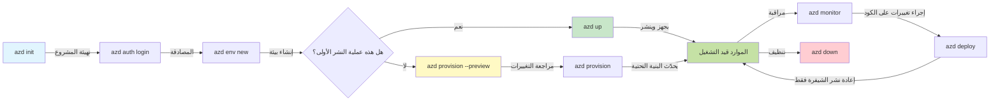
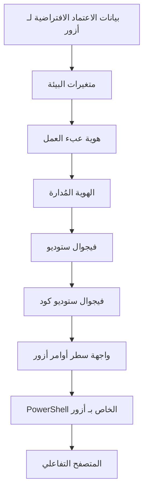

# أساسيات AZD - فهم Azure Developer CLI

# أساسيات AZD - المفاهيم الأساسية والأساسيات

**تنقل الفصل:**
- **📚 الصفحة الرئيسية للدورة**: [AZD للمبتدئين](../../README.md)
- **📖 الفصل الحالي**: الفصل 1 - الأساس والبدء السريع
- **⬅️ السابق**: [نظرة عامة على الدورة](../../README.md#-chapter-1-foundation--quick-start)
- **➡️ التالي**: [التثبيت والإعداد](installation.md)
- **🚀 الفصل التالي**: [الفصل 2: تطوير يركز على الذكاء الاصطناعي](../chapter-02-ai-development/microsoft-foundry-integration.md)

## المقدمة

تُعرّفك هذه الدرس على Azure Developer CLI (azd)، أداة سطر أوامر قوية تسرّع رحلتك من التطوير المحلي إلى النشر على Azure. ستتعلم المفاهيم الأساسية والميزات الجوهرية، وتفهم كيف يبسط azd نشر التطبيقات السحابية الأصلية.

## أهداف التعلم

بنهاية هذا الدرس، ستكون قادرًا على:
- فهم ما هو Azure Developer CLI والغرض الأساسي منه
- تعلم المفاهيم الأساسية للقوالب والبيئات والخدمات
- استكشاف الميزات الرئيسية بما في ذلك التطوير المرتكز على القوالب والبنية التحتية كرمز
- فهم هيكل مشروع azd وسير العمل
- الاستعداد لتثبيت وتكوين azd لبيئة تطويرك

## نتائج التعلم

بعد إكمال هذا الدرس، ستتمكن من:
- شرح دور azd في سير عمل تطوير السحابة الحديثة
- التعرف على مكونات بنية مشروع azd
- وصف كيفية تفاعل القوالب والبيئات والخدمات معًا
- فهم فوائد البنية التحتية كرمز مع azd
- التعرف على أوامر azd المختلفة وأغراضها

## ما هو Azure Developer CLI (azd)؟

Azure Developer CLI (azd) هو أداة سطر أوامر مصممة لتسريع رحلتك من التطوير المحلي إلى النشر على Azure. يبسط عملية بناء ونشر وإدارة التطبيقات السحابية الأصلية على Azure.

### ما الذي يمكنك نشره باستخدام azd؟

يدعم azd مجموعة واسعة من أحمال العمل — والقائمة تتوسع باستمرار. اليوم، يمكنك استخدام azd لنشر:

| نوع عبء العمل | أمثلة | نفس سير العمل؟ |
|---------------|----------|----------------|
| **التطبيقات التقليدية** | تطبيقات الويب، واجهات REST، مواقع ثابتة | ✅ `azd up` |
| **الخدمات والميكروسيرفيسز** | تطبيقات الحاويات، تطبيقات الدوال، بنى خلفية متعددة الخدمات | ✅ `azd up` |
| **تطبيقات مدعومة بالذكاء الاصطناعي** | تطبيقات الدردشة باستخدام نماذج Microsoft Foundry، حلول RAG مع AI Search | ✅ `azd up` |
| **وكلاء ذكيون** | وكلاء مستضافون في Foundry، تنظيمات متعددة الوكلاء | ✅ `azd up` |

الفكرة الأساسية هي أن **دورة حياة azd تبقى نفسها بغض النظر عما تنشره**. تقوم بتهيئة مشروع، وتجهيز البنية التحتية، ونشر الكود الخاص بك، ومراقبة التطبيق، وتنظيف الموارد — سواء كان موقعًا بسيطًا أو وكيلاً ذكياً متقدماً.

هذا الاتساق مقصود. يتعامل azd مع قدرات الذكاء الاصطناعي كنوع آخر من الخدمات التي يمكن لتطبيقك استخدامها، وليس كشيء مختلف جوهريًا. نقطة نهاية دردشة مدعومة بنماذج Microsoft Foundry هي، من منظور azd، مجرد خدمة أخرى يجب تكوينها ونشرها.

### 🎯 لماذا تستخدم AZD؟ مقارنة من العالم الحقيقي

لنقارن نشر تطبيق ويب بسيط مع قاعدة بيانات:

#### ❌ بدون AZD: نشر Azure يدوي (أكثر من 30 دقيقة)

```bash
# الخطوة 1: إنشاء مجموعة موارد
az group create --name myapp-rg --location eastus

# الخطوة 2: إنشاء خطة خدمة التطبيقات
az appservice plan create --name myapp-plan \
  --resource-group myapp-rg \
  --sku B1 --is-linux

# الخطوة 3: إنشاء تطبيق ويب
az webapp create --name myapp-web-unique123 \
  --resource-group myapp-rg \
  --plan myapp-plan \
  --runtime "NODE:18-lts"

# الخطوة 4: إنشاء حساب Cosmos DB (10–15 دقيقة)
az cosmosdb create --name myapp-cosmos-unique123 \
  --resource-group myapp-rg \
  --kind MongoDB

# الخطوة 5: إنشاء قاعدة بيانات
az cosmosdb mongodb database create \
  --account-name myapp-cosmos-unique123 \
  --resource-group myapp-rg \
  --name tododb

# الخطوة 6: إنشاء مجموعة
az cosmosdb mongodb collection create \
  --account-name myapp-cosmos-unique123 \
  --resource-group myapp-rg \
  --database-name tododb \
  --name todos

# الخطوة 7: الحصول على سلسلة الاتصال
CONN_STR=$(az cosmosdb keys list \
  --name myapp-cosmos-unique123 \
  --resource-group myapp-rg \
  --type connection-strings \
  --query "connectionStrings[0].connectionString" -o tsv)

# الخطوة 8: تكوين إعدادات التطبيق
az webapp config appsettings set \
  --name myapp-web-unique123 \
  --resource-group myapp-rg \
  --settings MONGODB_URI="$CONN_STR"

# الخطوة 9: تمكين السجلات
az webapp log config --name myapp-web-unique123 \
  --resource-group myapp-rg \
  --application-logging filesystem \
  --detailed-error-messages true

# الخطوة 10: إعداد Application Insights
az monitor app-insights component create \
  --app myapp-insights \
  --location eastus \
  --resource-group myapp-rg

# الخطوة 11: ربط Application Insights بتطبيق الويب
INSTRUMENTATION_KEY=$(az monitor app-insights component show \
  --app myapp-insights \
  --resource-group myapp-rg \
  --query "instrumentationKey" -o tsv)

az webapp config appsettings set \
  --name myapp-web-unique123 \
  --resource-group myapp-rg \
  --settings APPINSIGHTS_INSTRUMENTATIONKEY="$INSTRUMENTATION_KEY"

# الخطوة 12: بناء التطبيق محليًا
npm install
npm run build

# الخطوة 13: إنشاء حزمة النشر
zip -r app.zip . -x "*.git*" "node_modules/*"

# الخطوة 14: نشر التطبيق
az webapp deployment source config-zip \
  --resource-group myapp-rg \
  --name myapp-web-unique123 \
  --src app.zip

# الخطوة 15: انتظر وادعُ أن تعمل 🙏
# (لا يوجد تحقق آلي، مطلوب اختبار يدوي)
```

**المشكلات:**
- ❌ أكثر من 15 أمرًا يجب تذكرها وتنفيذها بالترتيب
- ❌ 30-45 دقيقة من العمل اليدوي
- ❌ سهل ارتكاب الأخطاء (أخطاء كتابة، معلمات خاطئة)
- ❌ سلاسل الاتصال مكشوفة في سجل الطرفية
- ❌ لا يوجد تراجع تلقائي إذا فشل شيء
- ❌ صعب إعادة إنتاجه لأعضاء الفريق
- ❌ مختلف في كل مرة (غير قابل لإعادة الإنتاج)

#### ✅ مع AZD: نشر مؤتمت (5 أوامر، 10-15 دقيقة)

```bash
# الخطوة 1: التهيئة من القالب
azd init --template todo-nodejs-mongo

# الخطوة 2: المصادقة
azd auth login

# الخطوة 3: إنشاء البيئة
azd env new dev

# الخطوة 4: معاينة التغييرات (اختياري لكن يُنصح به)
azd provision --preview

# الخطوة 5: نشر كل شيء
azd up

# ✨ تم! تم نشر كل شيء وتكوينه ومراقبته
```

**الفوائد:**
- ✅ **5 أوامر** مقابل أكثر من 15 خطوة يدوية
- ✅ **10-15 دقيقة** إجمالي الوقت (معظمها انتظار Azure)
- ✅ **لا أخطاء** - مؤتمت ومختبر
- ✅ **إدارة الأسرار بشكل آمن** عبر Key Vault
- ✅ **تراجع تلقائي** عند الفشل
- ✅ **قابل لإعادة الإنتاج بالكامل** - نفس النتيجة في كل مرة
- ✅ **جاهز للفريق** - أي شخص يمكنه النشر بنفس الأوامر
- ✅ **البنية التحتية كرمز** - قوالب Bicep تحت تحكم النسخ
- ✅ **مراقبة مدمجة** - تم تكوين Application Insights تلقائيًا

### 📊 تقليل الوقت والأخطاء

| المقياس | النشر اليدوي | نشر AZD | التحسن |
|:-------|:------------------|:---------------|:------------|
| **الأوامر** | 15+ | 5 | أقل بنسبة 67% |
| **الوقت** | 30-45 دقيقة | 10-15 دقيقة | أسرع بنسبة 60% |
| **معدل الأخطاء** | ~40% | <5% | انخفاض بنسبة 88% |
| **الاستقرار** | منخفض (يدوي) | 100% (مؤتمت) | مثالي |
| **انضمام الفريق** | 2-4 ساعات | 30 دقيقة | أسرع بنسبة 75% |
| **وقت التراجع** | أكثر من 30 دقيقة (يدوي) | 2 دقيقة (مؤتمت) | أسرع بنسبة 93% |

## المفاهيم الأساسية

### القوالب
القوالب هي أساس azd. تحتوي على:
- **كود التطبيق** - شفرة المصدر والتبعيات
- **تعريفات البنية التحتية** - موارد Azure المعرفة في Bicep أو Terraform
- **ملفات التهيئة** - الإعدادات ومتغيرات البيئة
- **سكربتات النشر** - سير عمل النشر المؤتمت

### البيئات
تمثل البيئات أهداف نشر مختلفة:
- **Development** - للاختبار والتطوير
- **Staging** - بيئة ما قبل الإنتاج
- **Production** - بيئة الإنتاج الحية

تحافظ كل بيئة على:
- Azure resource group
- إعدادات التهيئة
- حالة النشر

### الخدمات
الخدمات هي لبنات بناء تطبيقك:
- **Frontend** - تطبيقات الويب، تطبيقات صفحة واحدة
- **Backend** - واجهات برمجة التطبيقات، الميكروسيرفيسز
- **Database** - حلول تخزين البيانات
- **Storage** - تخزين الملفات والبلوب

## الميزات الرئيسية

### 1. التطوير المعتمد على القوالب
```bash
# تصفح القوالب المتاحة
azd template list

# البدء من قالب
azd init --template <template-name>
```

### 2. البنية التحتية كرمز
- **Bicep** - لغة المجال الخاصة بـ Azure
- **Terraform** - أداة للبنية التحتية متعددة السحابات
- **قوالب ARM** - قوالب Azure Resource Manager

### 3. سير العمل المتكامل
```bash
# سير عمل النشر الكامل
azd up            # التجهيز + النشر — هذه عملية غير تفاعلية لإعداد المرة الأولى

# 🧪 جديد: معاينة تغييرات البنية التحتية قبل النشر (آمن)
azd provision --preview    # محاكاة نشر البنية التحتية دون إجراء تغييرات

azd provision     # قم بإنشاء موارد Azure؛ إذا قمت بتحديث البنية التحتية فاستخدم هذا
azd deploy        # انشر كود التطبيق أو أعد نشر كود التطبيق بعد التحديث
azd down          # تنظيف الموارد
```

#### 🛡️ تخطيط بنية تحتية آمن مع المعاينة
أمر `azd provision --preview` يغير قواعد اللعبة لنشر آمن:
- **تحليل تجريبي (Dry-run)** - يعرض ما سيتم إنشاؤه أو تعديله أو حذفه
- **بدون مخاطر** - لا تُجرى تغييرات فعلية على بيئة Azure الخاصة بك
- **تعاون الفريق** - مشاركة نتائج المعاينة قبل النشر
- **تقدير التكلفة** - فهم تكاليف الموارد قبل الالتزام

```bash
# مثال على سير عمل المعاينة
azd provision --preview           # اطلع على ما سيتغير
# راجع المخرجات وناقشها مع الفريق
azd provision                     # طبق التغييرات بثقة
```

### 📊 تصور: سير تطوير AZD


```mermaid
graph LR
    A[azd init] -->|تهيئة المشروع| B[azd auth login]
    B -->|المصادقة| C[azd env new]
    C -->|إنشاء بيئة| D{هل هذه عملية النشر الأولى؟}
    D -->|نعم| E[azd up]
    D -->|لا| F[azd provision --preview]
    F -->|مراجعة التغييرات| G[azd provision]
    E -->|يجهز وينشر| H[الموارد قيد التشغيل]
    G -->|يحدّث البنية التحتية| H
    H -->|مراقبة| I[azd monitor]
    I -->|إجراء تغييرات على الكود| J[azd deploy]
    J -->|إعادة نشر الشيفرة فقط| H
    H -->|تنظيف| K[azd down]
    
    style A fill:#e1f5fe
    style E fill:#c8e6c9
    style F fill:#fff9c4
    style H fill:#c5e1a5
    style K fill:#ffcdd2
```
**شرح سير العمل:**
1. **Init** - ابدأ بقالب أو مشروع جديد
2. **Auth** - المصادقة مع Azure
3. **Environment** - إنشاء بيئة نشر معزولة
4. **Preview** - 🆕 دائمًا عاين تغييرات البنية التحتية أولاً (ممارسة آمنة)
5. **Provision** - إنشاء/تحديث موارد Azure
6. **Deploy** - ادفع كود تطبيقك
7. **Monitor** - راقب أداء التطبيق
8. **Iterate** - أجرِ تغييرات وأعد نشر الكود
9. **Cleanup** - إزالة الموارد عند الانتهاء

### 4. إدارة البيئات
```bash
# إنشاء وإدارة البيئات
azd env new <environment-name>
azd env select <environment-name>
azd env list
```

### 5. الامتدادات وأوامر الذكاء الاصطناعي

يستخدم azd نظام امتدادات لإضافة قدرات تتجاوز واجهة CLI الأساسية. هذا مفيد بشكل خاص لأحمال عمل الذكاء الاصطناعي:

```bash
# عرض الإضافات المتاحة
azd extension list

# تثبيت امتداد وكلاء Foundry
azd extension install azure.ai.agents

# تهيئة مشروع وكيل ذكاء اصطناعي من ملف المانيفست
azd ai agent init -m agent-manifest.yaml

# بدء خادم MCP للتطوير بمساعدة الذكاء الاصطناعي (ألفا)
azd mcp start
```

> يتم تغطية الامتدادات بالتفصيل في [الفصل 2: تطوير يركز على الذكاء الاصطناعي](../chapter-02-ai-development/agents.md) ومرجع [أوامر واجهة AZD للذكاء الاصطناعي](../chapter-08-production/production-ai-practices.md#azd-ai-cli-commands-and-extensions).

## 📁 بنية المشروع

بنية مشروع azd النموذجية:
```
my-app/
├── .azd/                    # azd configuration
│   └── config.json
├── .azure/                  # Azure deployment artifacts
├── .devcontainer/          # Development container config
├── .github/workflows/      # GitHub Actions
├── .vscode/               # VS Code settings
├── infra/                 # Infrastructure code
│   ├── main.bicep        # Main infrastructure template
│   ├── main.parameters.json
│   └── modules/          # Reusable modules
├── src/                  # Application source code
│   ├── api/             # Backend services
│   └── web/             # Frontend application
├── azure.yaml           # azd project configuration
└── README.md
```

## 🔧 ملفات التكوين

### azure.yaml
ملف تهيئة المشروع الرئيسي:
```yaml
name: my-awesome-app
metadata:
  template: my-template@1.0.0

services:
  web:
    project: ./src/web
    language: js
    host: appservice
  api:
    project: ./src/api
    language: js
    host: appservice

hooks:
  preprovision:
    shell: pwsh
    run: echo "Preparing to provision..."
```

### .azure/config.json
تهيئة خاصة بالبيئة:
```json
{
  "version": 1,
  "defaultEnvironment": "dev",
  "environments": {
    "dev": {
      "subscriptionId": "your-subscription-id",
      "location": "eastus"
    }
  }
}
```

## 🎪 سير العمل الشائع مع تمارين عملية

> **💡 نصيحة تعلم:** اتبع هذه التمارين بالترتيب لبناء مهاراتك في AZD بشكل تدريجي.

### 🎯 التمرين 1: تهيئة مشروعك الأول

**الهدف:** إنشاء مشروع AZD واستكشاف بنيته

**الخطوات:**
```bash
# استخدم قالبًا مجرّبًا
azd init --template todo-nodejs-mongo

# استكشف الملفات المولدة
ls -la  # عرض جميع الملفات بما في ذلك الملفات المخفية

# الملفات الرئيسية التي تم إنشاؤها:
# - azure.yaml (التكوين الرئيسي)
# - infra/ (كود البنية التحتية)
# - src/ (كود التطبيق)
```

**✅ النجاح:** لديك azure.yaml ومجلدات infra/ و src/

---

### 🎯 التمرين 2: النشر إلى Azure

**الهدف:** إكمال النشر من البداية إلى النهاية

**الخطوات:**
```bash
# 1. المصادقة
az login && azd auth login

# 2. إنشاء بيئة
azd env new dev
azd env set AZURE_LOCATION eastus

# 3. معاينة التغييرات (موصى به)
azd provision --preview

# 4. نشر كل شيء
azd up

# 5. التحقق من النشر
azd show    # عرض عنوان URL لتطبيقك
```

**الوقت المتوقع:** 10-15 دقيقة  
**✅ النجاح:** يفتح رابط التطبيق في المتصفح

---

### 🎯 التمرين 3: بيئات متعددة

**الهدف:** النشر إلى dev و staging

**الخطوات:**
```bash
# لدي بالفعل فرع dev، أنشئ فرع staging
azd env new staging
azd env set AZURE_LOCATION westus2
azd up

# التبديل بينهما
azd env list
azd env select dev
```

**✅ النجاح:** وجود مجموعتي موارد منفصلتين في بوابة Azure

---

### 🛡️ إعادة تعيين كامل: `azd down --force --purge`

عندما تحتاج إلى إعادة ضبط كاملة:

```bash
azd down --force --purge
```

**ما الذي يفعله:**
- `--force`: لا يطلب أي مطالبات تأكيد
- `--purge`: يحذف كل الحالة المحلية وموارد Azure

**استخدامه عند:**
- فشل النشر في منتصف الطريق
- تغيير المشاريع
- الحاجة إلى بداية جديدة

---

## 🎪 مرجع سير العمل الأصلي

### بدء مشروع جديد
```bash
# الطريقة 1: استخدم القالب الموجود
azd init --template todo-nodejs-mongo

# الطريقة 2: ابدأ من الصفر
azd init

# الطريقة 3: استخدم الدليل الحالي
azd init .
```

### دورة التطوير
```bash
# إعداد بيئة التطوير
azd auth login
azd env new dev
azd env select dev

# نشر كل شيء
azd up

# أجرِ التغييرات وأعد النشر
azd deploy

# نظف عند الانتهاء
azd down --force --purge # الأمر في Azure Developer CLI هو **إعادة ضبط كاملة** لبيئتك — مفيد بشكل خاص عندما تقوم باستكشاف أخطاء عمليات النشر الفاشلة، أو تنظيف الموارد اليتيمة، أو التحضير لإعادة نشر جديدة.
```

## فهم `azd down --force --purge`
أمر `azd down --force --purge` هو وسيلة قوية لتفكيك بيئة azd الخاصة بك وكل الموارد المرتبطة بها تمامًا. فيما يلي تفصيل لما يفعله كل علم:
```
--force
```
- يتخطى مطالبات التأكيد.
- مفيد للأتمتة أو كتابة السكربتات حيث الإدخال اليدوي غير ممكن.
- يضمن أن يسير الإنهاء دون انقطاع، حتى إذا اكتشف CLI تناقضات.

```
--purge
```
يحذف **كل البيانات الوصفية المرتبطة**، بما في ذلك:
حالة البيئة
مجلد `.azure` المحلي
معلومات النشر المخزنة مؤقتًا
يمنع azd من "تذكر" عمليات النشر السابقة، والتي يمكن أن تسبب مشكلات مثل عدم تطابق مجموعات الموارد أو مراجع السجل القديمة.

### لماذا استخدام كلاهما؟
عندما تواجه مشكلة مع `azd up` بسبب حالة متبقية أو عمليات نشر جزئية، يضمن هذا المزيج وجود **لوحة نظيفة**.

وهو مفيد بشكل خاص بعد حذف موارد يدويًا في بوابة Azure أو عند تبديل القوالب أو البيئات أو قواعد تسمية مجموعات الموارد.

### إدارة بيئات متعددة
```bash
# إنشاء بيئة اختبار مرحلية
azd env new staging
azd env select staging
azd up

# العودة إلى بيئة التطوير
azd env select dev

# مقارنة البيئات
azd env list
```

## 🔐 المصادقة والاعتمادات

فهم المصادقة أمر حاسم لنجاح عمليات نشر azd. تستخدم Azure طرق مصادقة متعددة، ويستفيد azd من نفس سلسلة الاعتماد المستخدمة من قبل أدوات Azure الأخرى.

### مصادقة Azure CLI (`az login`)

قبل استخدام azd، تحتاج إلى المصادقة مع Azure. الطريقة الأكثر شيوعًا هي استخدام Azure CLI:

```bash
# تسجيل دخول تفاعلي (يفتح المتصفح)
az login

# تسجيل الدخول إلى مستأجر محدد
az login --tenant <tenant-id>

# تسجيل الدخول باستخدام الكيان الخدمي
az login --service-principal -u <app-id> -p <password> --tenant <tenant-id>

# التحقق من حالة تسجيل الدخول الحالية
az account show

# عرض الاشتراكات المتاحة
az account list --output table

# تعيين الاشتراك الافتراضي
az account set --subscription <subscription-id>
```

### سير المصادقة
1. **تسجيل دخول تفاعلي (Interactive Login)**: يفتح متصفحك الافتراضي للمصادقة
2. **تدفق رمز الجهاز (Device Code Flow)**: للبيئات بدون وصول إلى المتصفح
3. **المبدأ الخدمي (Service Principal)**: لأتمتة وسيناريوهات CI/CD
4. **الهوية المُدارة (Managed Identity)**: للتطبيقات المستضيفة على Azure

### سلسلة DefaultAzureCredential

`DefaultAzureCredential` هو نوع اعتماد يوفر تجربة مصادقة مبسطة عن طريق محاولة مصادر اعتماد متعددة تلقائيًا بترتيب محدد:

#### ترتيب سلسلة الاعتماد

```mermaid
graph TD
    A[بيانات الاعتماد الافتراضية لـ أزور] --> B[متغيرات البيئة]
    B --> C[هوية عبء العمل]
    C --> D[الهوية المُدارة]
    D --> E[فيجوال ستوديو]
    E --> F[فيجوال ستوديو كود]
    F --> G[واجهة سطر أوامر أزور]
    G --> H[PowerShell الخاص بـ أزور]
    H --> I[المتصفح التفاعلي]
```
#### 1. متغيرات البيئة
```bash
# تعيين متغيرات البيئة لمُعرّف الخدمة
export AZURE_CLIENT_ID="<app-id>"
export AZURE_CLIENT_SECRET="<password>"
export AZURE_TENANT_ID="<tenant-id>"
```

#### 2. هوية عبء العمل (Kubernetes/GitHub Actions)
تُستخدم تلقائيًا في:
- Azure Kubernetes Service (AKS) مع Workload Identity
- GitHub Actions مع اتحاد OIDC
- سيناريوهات هوية موحدة أخرى

#### 3. الهوية المُدارة
لموارد Azure مثل:
- الآلات الافتراضية
- App Service
- Azure Functions
- Container Instances

```bash
# تحقق مما إذا كان يعمل على مورد Azure بهوية مُدارة
az account show --query "user.type" --output tsv
# يعيد: "servicePrincipal" إذا كانت الهوية مُدارة
```

#### 4. تكامل أدوات المطورين
- **Visual Studio**: يستخدم تلقائيًا الحساب المسجل
- **VS Code**: يستخدم بيانات اعتماد امتداد Azure Account
- **Azure CLI**: يستخدم بيانات اعتماد `az login` (الأكثر شيوعًا للتطوير المحلي)

### إعداد مصادقة AZD

```bash
# الطريقة 1: استخدام Azure CLI (موصى به للتطوير)
az login
azd auth login  # يستخدم بيانات اعتماد Azure CLI الحالية

# الطريقة 2: المصادقة المباشرة باستخدام azd
azd auth login --use-device-code  # للبيئات بدون واجهة مستخدم

# الطريقة 3: التحقق من حالة المصادقة
azd auth login --check-status

# الطريقة 4: تسجيل الخروج وإعادة المصادقة
azd auth logout
azd auth login
```

### أفضل ممارسات المصادقة

#### للتطوير المحلي
```bash
# 1. تسجيل الدخول باستخدام واجهة سطر أوامر Azure
az login

# 2. التأكد من صحة الاشتراك
az account show
az account set --subscription "Your Subscription Name"

# 3. استخدم azd مع بيانات الاعتماد الحالية
azd auth login
```

#### لأنابيب CI/CD
```yaml
# GitHub Actions example
- name: Azure Login
  uses: azure/login@v1
  with:
    creds: ${{ secrets.AZURE_CREDENTIALS }}

- name: Deploy with azd
  run: |
    azd auth login --client-id ${{ secrets.AZURE_CLIENT_ID }} \
                    --client-secret ${{ secrets.AZURE_CLIENT_SECRET }} \
                    --tenant-id ${{ secrets.AZURE_TENANT_ID }}
    azd up --no-prompt
```

#### لبيئات الإنتاج
- استخدم **Managed Identity** عند التشغيل على موارد Azure
- استخدم **Service Principal** لسيناريوهات الأتمتة
- تجنب تخزين بيانات الاعتماد في الشفرة أو ملفات التكوين
- استخدم **Azure Key Vault** للإعدادات الحساسة

### مشكلات المصادقة الشائعة والحلول

#### المشكلة: "لم يتم العثور على اشتراك"
```bash
# الحل: تعيين الاشتراك الافتراضي
az account list --output table
az account set --subscription "<subscription-id>"
azd env set AZURE_SUBSCRIPTION_ID "<subscription-id>"
```

#### المشكلة: "أذونات غير كافية"
```bash
# الحل: التحقق وتعيين الأدوار المطلوبة
az role assignment list --assignee $(az account show --query user.name --output tsv)

# الأدوار المطلوبة الشائعة:
# - مساهم (لإدارة الموارد)
# - مسؤول وصول المستخدم (لتعيينات الأدوار)
```

#### المشكلة: "انتهت صلاحية الرمز"
```bash
# الحل: إعادة المصادقة
az logout
az login
azd auth logout
azd auth login
```

### المصادقة في سيناريوهات مختلفة

#### التطوير المحلي
```bash
# حساب التطوير الشخصي
az login
azd auth login
```

#### تطوير الفريق
```bash
# استخدم مستأجرًا محددًا للمنظمة
az login --tenant contoso.onmicrosoft.com
azd auth login
```

#### سيناريوهات متعددة المستأجرين
```bash
# التبديل بين المستأجرين
az login --tenant tenant1.onmicrosoft.com
# نشر إلى المستأجر 1
azd up

az login --tenant tenant2.onmicrosoft.com  
# نشر إلى المستأجر 2
azd up
```

### اعتبارات الأمن
1. **تخزين بيانات الاعتماد**: لا تحتفظ ببيانات الاعتماد في شفرة المصدر
2. **تقييد النطاق**: استخدم مبدأ الأقل امتيازًا لممثلي الخدمة
3. **تدوير الرموز**: قم بتدوير أسرار ممثلي الخدمة بانتظام
4. **سجل التدقيق**: راقب أنشطة المصادقة والنشر
5. **أمان الشبكة**: استخدم نقاط نهاية خاصة عندما يكون ذلك ممكنًا

### استكشاف أخطاء المصادقة وإصلاحها

```bash
# استكشاف وإصلاح مشكلات المصادقة
azd auth login --check-status
az account show
az account get-access-token

# أوامر التشخيص الشائعة
whoami                          # سياق المستخدم الحالي
az ad signed-in-user show      # تفاصيل مستخدم Azure AD
az group list                  # اختبار الوصول إلى الموارد
```

## فهم `azd down --force --purge`

### الاكتشاف
```bash
azd template list              # تصفح القوالب
azd template show <template>   # تفاصيل القالب
azd init --help               # خيارات التهيئة
```

### إدارة المشروع
```bash
azd show                     # نظرة عامة على المشروع
azd env show                 # البيئة الحالية
azd config list             # إعدادات التكوين
```

### المراقبة
```bash
azd monitor                  # فتح المراقبة في بوابة Azure
azd monitor --logs           # عرض سجلات التطبيق
azd monitor --live           # عرض المقاييس الحية
azd pipeline config          # إعداد التكامل المستمر/التسليم المستمر
```

## أفضل الممارسات

### 1. استخدم أسماء ذات معنى
```bash
# جيد
azd env new production-east
azd init --template web-app-secure

# تجنب
azd env new env1
azd init --template template1
```

### 2. الاستفادة من القوالب
- ابدأ بالقوالب الموجودة
- خصّصها حسب احتياجاتك
- أنشئ قوالب قابلة لإعادة الاستخدام لمؤسستك

### 3. عزل البيئات
- استخدم بيئات منفصلة للتطوير/الإعداد/الإنتاج
- لا تنشر مباشرة إلى الإنتاج من الجهاز المحلي
- استخدم خطوط أنابيب CI/CD لنشر الإنتاج

### 4. إدارة التكوين
- استخدم متغيرات البيئة للبيانات الحساسة
- احتفظ بالتكوين في إدارة الإصدار
- وثق الإعدادات الخاصة بكل بيئة

## تقدم التعلم

### المبتدئون (الأسبوع 1-2)
1. تثبيت azd والمصادقة
2. نشر قالب بسيط
3. فهم هيكل المشروع
4. تعلّم الأوامر الأساسية (up, down, deploy)

### المتوسطون (الأسبوع 3-4)
1. تخصيص القوالب
2. إدارة بيئات متعددة
3. فهم كود البنية التحتية
4. إعداد خطوط أنابيب CI/CD

### المتقدمون (الأسبوع 5+)
1. إنشاء قوالب مخصصة
2. أنماط بنية تحتية متقدمة
3. نشر عبر مناطق متعددة
4. تكوينات بمستوى المؤسسات

## الخطوات التالية

**📖 متابعة تعلم الفصل 1:**
- [التثبيت والإعداد](installation.md) - تثبيت azd وتكوينه
- [مشروعك الأول](first-project.md) - أكمل الدرس العملي
- [دليل التكوين](configuration.md) - خيارات تكوين متقدمة

**🎯 جاهز للفصل التالي؟**
- [الفصل 2: تطوير يركز على الذكاء الاصطناعي](../chapter-02-ai-development/microsoft-foundry-integration.md) - ابدأ ببناء تطبيقات الذكاء الاصطناعي

## مصادر إضافية

- [نظرة عامة على Azure Developer CLI](https://learn.microsoft.com/en-us/azure/developer/azure-developer-cli/)
- [معرض القوالب](https://azure.github.io/awesome-azd/)
- [عينات المجتمع](https://github.com/Azure-Samples)

---

## 🙋 الأسئلة الشائعة

### أسئلة عامة

**س: ما الفرق بين AZD و Azure CLI؟**

ج: Azure CLI (`az`) مخصّص لإدارة موارد Azure الفردية. AZD (`azd`) مخصص لإدارة التطبيقات بأكملها:

```bash
# Azure CLI - إدارة الموارد على مستوى منخفض
az webapp create --name myapp --resource-group rg
az sql server create --name myserver --resource-group rg
# ...هناك حاجة إلى المزيد من الأوامر

# AZD - إدارة على مستوى التطبيق
azd up  # ينشر التطبيق بأكمله مع جميع الموارد
```

**فكر بها هكذا:**
- `az` = العمل على قطع ليغو الفردية
- `azd` = العمل مع مجموعات ليغو كاملة

---

**س: هل أحتاج إلى معرفة Bicep أو Terraform لاستخدام AZD؟**

ج: لا! ابدأ بالقوالب:
```bash
# استخدم القالب الموجود - لا حاجة لمعرفة البنية التحتية كرمز (IaC)
azd init --template todo-nodejs-mongo
azd up
```

يمكنك تعلم Bicep لاحقًا لتخصيص البنية التحتية. توفر القوالب أمثلة عملية لتتعلم منها.

---

**س: كم تبلغ تكلفة تشغيل قوالب AZD؟**

ج: تختلف التكلفة حسب القالب. معظم قوالب التطوير تكلف $50-150/month:
```bash
# معاينة التكاليف قبل النشر
azd provision --preview

# قم دائمًا بتنظيف الموارد عند عدم الاستخدام
azd down --force --purge  # يزيل جميع الموارد
```

**نصيحة احترافية:** استخدم الطبقات المجانية حيثما كانت متاحة:
- App Service: مستوى F1 (مجاني)
- Microsoft Foundry Models: Azure OpenAI 50,000 tokens/شهر مجانًا
- Cosmos DB: مستوى مجاني 1000 RU/s

---

**س: هل يمكنني استخدام AZD مع موارد Azure الموجودة بالفعل؟**

ج: نعم، لكن من الأسهل البدء من جديد. تعمل AZD بشكل أفضل عندما تتولى إدارة دورة الحياة كاملة. بالنسبة للموارد الموجودة بالفعل:
```bash
# الخيار 1: استيراد الموارد الموجودة (متقدم)
azd init
# ثم عدّل infra/ للإشارة إلى الموارد الموجودة

# الخيار 2: ابدأ من جديد (مستحسن)
azd init --template matching-your-stack
azd up  # ينشئ بيئة جديدة
```

---

**س: كيف أشارك مشروعي مع زملائي؟**

ج: قم بعمل commit لمشروع AZD إلى Git (ولكن لا تشمل مجلد .azure):
```bash
# موجود بالفعل في .gitignore افتراضيًا
.azure/        # يحتوي على أسرار وبيانات البيئة
*.env          # متغيرات البيئة

# أعضاء الفريق حينها:
git clone <your-repo>
azd auth login
azd env new <their-name>-dev
azd up
```

يحصل الجميع على بنية تحتية متطابقة من نفس القوالب.

---

### أسئلة استكشاف الأخطاء وإصلاحها

**س: فشل "azd up" في منتصف التنفيذ. ماذا أفعل؟**

ج: تحقق من الخطأ، أصلحه، ثم أعد المحاولة:
```bash
# عرض السجلات التفصيلية
azd show

# إصلاحات شائعة:

# 1. إذا تم تجاوز الحصة:
azd env set AZURE_LOCATION "westus2"  # جرّب منطقة مختلفة

# 2. إذا تعارض اسم المورد:
azd down --force --purge  # ابدأ من جديد
azd up  # أعد المحاولة

# 3. إذا انتهت صلاحية المصادقة:
az login
azd auth login
azd up
```

**المشكلة الأكثر شيوعًا:** تم تحديد اشتراك Azure خاطئ
```bash
az account list --output table
az account set --subscription "<correct-subscription>"
```

---

**س: كيف أنشر تغييرات الكود فقط دون إعادة توفير البنية التحتية؟**

ج: استخدم `azd deploy` بدلًا من `azd up`:
```bash
azd up          # أول مرة: التهيئة + النشر (بطيء)

# قم بإجراء تغييرات على الكود...

azd deploy      # المرات التالية: النشر فقط (سريع)
```

مقارنة السرعة:
- `azd up`: 10-15 دقيقة (يوفر البنية التحتية)
- `azd deploy`: 2-5 دقائق (الكود فقط)

---

**س: هل يمكنني تخصيص قوالب البنية التحتية؟**

ج: نعم! حرّر ملفات Bicep داخل `infra/`:
```bash
# بعد تشغيل azd init
cd infra/
code main.bicep  # تحرير في VS Code

# معاينة التغييرات
azd provision --preview

# تطبيق التغييرات
azd provision
```

**نصيحة:** ابدأ بصغير - غيّر SKUs أولاً:
```bicep
// infra/main.bicep
sku: {
  name: 'B1'  // Change to 'P1V2' for production
}
```

---

**س: كيف أحذف كل ما أنشأته AZD؟**

ج: أمر واحد يزيل كل الموارد:
```bash
azd down --force --purge

# سيحذف ما يلي:
# - جميع موارد Azure
# - مجموعة الموارد
# - حالة البيئة المحلية
# - بيانات النشر المخزنة مؤقتًا
```

**شغّل هذا دائمًا عندما:**
- انتهيت من اختبار قالب
- تنتقل إلى مشروع مختلف
- تريد البدء من جديد

**توفير التكاليف:** حذف الموارد غير المستخدمة = 0$ رسوم

---

**س: ماذا لو حذفت الموارد عن طريق الخطأ في Azure Portal؟**

ج: قد يصبح حالة AZD غير متزامنة. نهج البدء من جديد:
```bash
# 1. إزالة الحالة المحلية
azd down --force --purge

# 2. ابدأ من جديد
azd up

# بديل: دع AZD يكتشف ويصلح
azd provision  # سيُنشئ الموارد المفقودة
```

---

### أسئلة متقدمة

**س: هل يمكنني استخدام AZD في خطوط أنابيب CI/CD؟**

ج: نعم! مثال على GitHub Actions:
```yaml
# .github/workflows/deploy.yml
name: Deploy with AZD

on:
  push:
    branches: [main]

jobs:
  deploy:
    runs-on: ubuntu-latest
    steps:
      - uses: actions/checkout@v2
      
      - name: Install azd
        run: curl -fsSL https://aka.ms/install-azd.sh | bash
      
      - name: Azure Login
        run: |
          azd auth login \
            --client-id ${{ secrets.AZURE_CLIENT_ID }} \
            --client-secret ${{ secrets.AZURE_CLIENT_SECRET }} \
            --tenant-id ${{ secrets.AZURE_TENANT_ID }}
      
      - name: Deploy
        run: azd up --no-prompt
```

---

**س: كيف أتعامل مع الأسرار والبيانات الحساسة؟**

ج: تتكامل AZD مع Azure Key Vault تلقائيًا:
```bash
# تُخزن الأسرار في Key Vault، وليس في الشيفرة
azd env set DATABASE_PASSWORD "$(openssl rand -base64 32)"

# يقوم AZD تلقائيًا:
# 1. ينشئ Key Vault
# 2. يخزن السر
# 3. يمنح التطبيق الوصول عبر الهوية المُدارة
# 4. يحقنها في وقت التشغيل
```

**لا تقم بعمل commit أبدًا:**
- `.azure/` folder (يحتوي على بيانات البيئة)
- ملفات `.env` (أسرار محلية)
- سلاسل الاتصال

---

**س: هل يمكنني النشر إلى مناطق متعددة؟**

ج: نعم، أنشئ بيئة لكل منطقة:
```bash
# بيئة شرق الولايات المتحدة
azd env new prod-eastus
azd env set AZURE_LOCATION eastus
azd up

# بيئة غرب أوروبا
azd env new prod-westeurope
azd env set AZURE_LOCATION westeurope
azd up

# كل بيئة مستقلة
azd env list
```

للتطبيقات متعددة المناطق الحقيقية، خصّص قوالب Bicep لنشرها إلى مناطق متعددة في وقت واحد.

---

**س: أين يمكنني الحصول على مساعدة إذا علقت؟**

1. **توثيق AZD:** https://learn.microsoft.com/azure/developer/azure-developer-cli/
2. **مشكلات GitHub:** https://github.com/Azure/azure-dev/issues
3. **Discord:** [ديسكورد Azure](https://discord.gg/microsoft-azure) - قناة #azure-developer-cli
4. **Stack Overflow:** الوسم `azure-developer-cli`
5. **هذا المساق:** [دليل استكشاف الأخطاء](../chapter-07-troubleshooting/common-issues.md)

**نصيحة احترافية:** قبل السؤال، شغل:
```bash
azd show       # يعرض الحالة الحالية
azd version    # يعرض إصدارك
```
قم بتضمين هذه المعلومات في سؤالك للحصول على مساعدة أسرع.

---

## 🎓 ما التالي؟

أنت الآن تفهم أساسيات AZD. اختر مسارك:

### 🎯 للمبتدئين:
1. **التالي:** [التثبيت والإعداد](installation.md) - ثبّت AZD على جهازك
2. **ثم:** [مشروعك الأول](first-project.md) - انشر تطبيقك الأول
3. **الممارسة:** أكمل جميع التمرينات الثلاثة في هذا الدرس

### 🚀 لمطوري الذكاء الاصطناعي:
1. **انتقل إلى:** [الفصل 2: تطوير يركز على الذكاء الاصطناعي](../chapter-02-ai-development/microsoft-foundry-integration.md)
2. **انشر:** ابدأ بـ `azd init --template get-started-with-ai-chat`
3. **تعلّم:** ابنِ أثناء النشر

### 🏗️ للمطورين ذوي الخبرة:
1. **راجع:** [دليل التكوين](configuration.md) - إعدادات متقدمة
2. **استكشف:** [البنية التحتية ككود](../chapter-04-infrastructure/provisioning.md) - التعمق في Bicep
3. **ابنِ:** أنشئ قوالب مخصصة لمجموعة التقنيات الخاصة بك

---

**التنقل بين الفصول:**
- **📚 صفحة المقرر**: [AZD للمبتدئين](../../README.md)
- **📖 الفصل الحالي**: الفصل 1 - الأساس والانطلاق السريع  
- **⬅️ السابق**: [نظرة عامة على المقرر](../../README.md#-chapter-1-foundation--quick-start)
- **➡️ التالي**: [التثبيت والإعداد](installation.md)
- **🚀 الفصل التالي**: [الفصل 2: تطوير يركز على الذكاء الاصطناعي](../chapter-02-ai-development/microsoft-foundry-integration.md)

---

<!-- CO-OP TRANSLATOR DISCLAIMER START -->
إخلاء المسؤولية:
تمت ترجمة هذا المستند باستخدام خدمة الترجمة الآلية [Co-op Translator](https://github.com/Azure/co-op-translator). بينما نسعى إلى الدقة، يرجى العلم أن الترجمات الآلية قد تحتوي على أخطاء أو عدم دقة. يجب اعتبار المستند الأصلي بلغته الأصلية المصدر الموثوق. للمعلومات الحساسة أو الحرجة، يُنصح بالاستعانة بترجمة بشرية احترافية. لا نتحمل أي مسؤولية عن أي سوء فهم أو تفسيرات خاطئة تنشأ عن استخدام هذه الترجمة.
<!-- CO-OP TRANSLATOR DISCLAIMER END -->