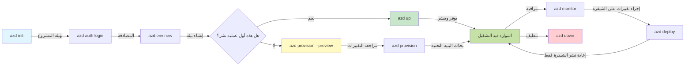
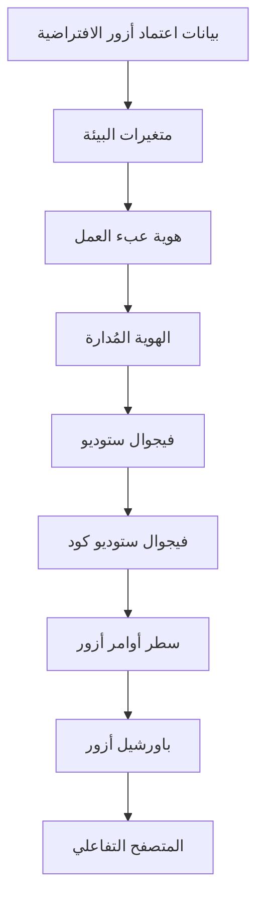

# AZD Basics - فهم Azure Developer CLI

# AZD Basics - المفاهيم الأساسية والأساسيات

**التنقل بين الفصول:**
- **📚 الصفحة الرئيسية للدورة**: [AZD للمبتدئين](../../README.md)
- **📖 الفصل الحالي**: الفصل 1 - الأساس والبداية السريعة
- **⬅️ السابق**: [نظرة عامة على الدورة](../../README.md#-chapter-1-foundation--quick-start)
- **➡️ التالي**: [التثبيت والإعداد](installation.md)
- **🚀 الفصل التالي**: [الفصل 2: تطوير يركز على الذكاء الاصطناعي](../chapter-02-ai-development/microsoft-foundry-integration.md)

## مقدمة

تقدم هذه الدرس مقدمة إلى Azure Developer CLI (azd)، أداة سطر أوامر قوية تسرع رحلتك من التطوير المحلي إلى النشر على Azure. ستتعلم المفاهيم الأساسية والميزات الجوهرية وتفهم كيف يبسط azd نشر التطبيقات السحابية الأصلية.

## أهداف التعلم

بنهاية هذا الدرس، سوف:
- تفهم ما هو Azure Developer CLI وما هو الغرض الأساسي منه
- تتعرف على المفاهيم الأساسية للقوالب والبيئات والخدمات
- تستكشف الميزات الرئيسية بما في ذلك التطوير المعتمد على القوالب والبنية التحتية كرمز
- تفهم بنية مشروع azd وسير العمل الخاص به
- تكون مستعدًا لتثبيت وتكوين azd لبيئة التطوير الخاصة بك

## نواتج التعلم

بعد إتمام هذا الدرس، ستكون قادرًا على:
- شرح دور azd في سير عمل التطوير السحابي الحديث
- تحديد مكونات بنية مشروع azd
- وصف كيفية عمل القوالب والبيئات والخدمات معًا
- فهم فوائد البنية التحتية كرمز باستخدام azd
- التعرف على أوامر azd المختلفة وأغراضها

## ما هو Azure Developer CLI (azd)؟

Azure Developer CLI (azd) هو أداة سطر أوامر مصممة لتسريع رحلتك من التطوير المحلي إلى النشر على Azure. يبسط عملية بناء ونشر وإدارة التطبيقات السحابية الأصلية على Azure.

### ماذا يمكنك نشر باستخدام azd؟

يدعم azd مجموعة واسعة من أحمال العمل—والقائمة تستمر في النمو. اليوم، يمكنك استخدام azd لنشر:

| Workload Type | Examples | Same Workflow? |
|---------------|----------|----------------|
| **التطبيقات التقليدية** | تطبيقات الويب، واجهات REST، مواقع ثابتة | ✅ `azd up` |
| **الخدمات والخدمات المصغرة** | Container Apps، Function Apps، واجهات خلفية متعددة الخدمات | ✅ `azd up` |
| **التطبيقات المعززة بالذكاء الاصطناعي** | تطبيقات الدردشة مع Microsoft Foundry Models، حلول RAG مع AI Search | ✅ `azd up` |
| **الوكلاء الأذكياء** | وكلاء مستضافون في Foundry، تنظيمات متعددة الوكلاء | ✅ `azd up` |

الفكرة الأساسية هي أن **دورة حياة azd تظل نفسها بغض النظر عما تقوم بنشره**. تقوم بتهيئة مشروع، توفير البنية التحتية، نشر التعليمات البرمجية، مراقبة تطبيقك، ثم التنظيف—سواء كان موقعًا بسيطًا أو وكيل ذكاء اصطناعي متطورًا.

هذه الاستمرارية مقصودة. يعامل azd قدرات الذكاء الاصطناعي كنوع آخر من الخدمات التي يمكن لتطبيقك استخدامها، وليس شيئًا مختلفًا جوهريًا. نهاية دردشة مدعومة بنماذج Microsoft Foundry، من منظور azd، هي مجرد خدمة أخرى لتكوينها ونشرها.

### 🎯 لماذا استخدام AZD؟ مقارنة من العالم الواقعي

لنقارن نشر تطبيق ويب بسيط مع قاعدة بيانات:

#### ❌ بدون AZD: النشر اليدوي على Azure (30+ دقيقة)

```bash
# الخطوة 1: إنشاء مجموعة موارد
az group create --name myapp-rg --location eastus

# الخطوة 2: إنشاء خطة خدمة التطبيق
az appservice plan create --name myapp-plan \
  --resource-group myapp-rg \
  --sku B1 --is-linux

# الخطوة 3: إنشاء تطبيق ويب
az webapp create --name myapp-web-unique123 \
  --resource-group myapp-rg \
  --plan myapp-plan \
  --runtime "NODE:18-lts"

# الخطوة 4: إنشاء حساب Cosmos DB (10-15 دقيقة)
az cosmosdb create --name myapp-cosmos-unique123 \
  --resource-group myapp-rg \
  --kind MongoDB

# الخطوة 5: إنشاء قاعدة بيانات
az cosmosdb mongodb database create \
  --account-name myapp-cosmos-unique123 \
  --resource-group myapp-rg \
  --name tododb

# الخطوة 6: إنشاء مجموعة
az cosmosdb mongodb collection create \
  --account-name myapp-cosmos-unique123 \
  --resource-group myapp-rg \
  --database-name tododb \
  --name todos

# الخطوة 7: الحصول على سلسلة الاتصال
CONN_STR=$(az cosmosdb keys list \
  --name myapp-cosmos-unique123 \
  --resource-group myapp-rg \
  --type connection-strings \
  --query "connectionStrings[0].connectionString" -o tsv)

# الخطوة 8: تكوين إعدادات التطبيق
az webapp config appsettings set \
  --name myapp-web-unique123 \
  --resource-group myapp-rg \
  --settings MONGODB_URI="$CONN_STR"

# الخطوة 9: تمكين التسجيل
az webapp log config --name myapp-web-unique123 \
  --resource-group myapp-rg \
  --application-logging filesystem \
  --detailed-error-messages true

# الخطوة 10: إعداد Application Insights
az monitor app-insights component create \
  --app myapp-insights \
  --location eastus \
  --resource-group myapp-rg

# الخطوة 11: ربط Application Insights بتطبيق الويب
INSTRUMENTATION_KEY=$(az monitor app-insights component show \
  --app myapp-insights \
  --resource-group myapp-rg \
  --query "instrumentationKey" -o tsv)

az webapp config appsettings set \
  --name myapp-web-unique123 \
  --resource-group myapp-rg \
  --settings APPINSIGHTS_INSTRUMENTATIONKEY="$INSTRUMENTATION_KEY"

# الخطوة 12: بناء التطبيق محليًا
npm install
npm run build

# الخطوة 13: إنشاء حزمة النشر
zip -r app.zip . -x "*.git*" "node_modules/*"

# الخطوة 14: نشر التطبيق
az webapp deployment source config-zip \
  --resource-group myapp-rg \
  --name myapp-web-unique123 \
  --src app.zip

# الخطوة 15: انتظر وادعُ أن يعمل 🙏
# (لا يوجد تحقق آلي، مطلوب اختبار يدوي)
```

**المشكلات:**
- ❌ 15+ أمرًا لتتذكرها وتنفيذها بالترتيب
- ❌ 30-45 دقيقة من العمل اليدوي
- ❌ سهل الوقوع في أخطاء (أخطاء إملائية، معلمات خاطئة)
- ❌ سلاسل الاتصال مكشوفة في سجل الطرفية
- ❌ لا تراجع تلقائي إذا فشل شيء ما
- ❌ صعب التكرار لأعضاء الفريق
- ❌ مختلف في كل مرة (غير قابل للتكاثر)

#### ✅ مع AZD: نشر آلي (5 أوامر، 10-15 دقيقة)

```bash
# الخطوة 1: التهيئة من القالب
azd init --template todo-nodejs-mongo

# الخطوة 2: المصادقة
azd auth login

# الخطوة 3: إنشاء البيئة
azd env new dev

# الخطوة 4: معاينة التغييرات (اختياري لكن يُنصح به)
azd provision --preview

# الخطوة 5: نشر كل شيء
azd up

# ✨ تم! تم نشر كل شيء وتكوينه ومراقبته
```

**الفوائد:**
- ✅ **5 أوامر** مقابل 15+ خطوة يدوية
- ✅ **10-15 دقيقة** إجمالي الوقت (معظمه انتظار Azure)
- ✅ **أخطاء يدوية أقل** - سير عمل ثابت معتمد على القوالب
- ✅ **معالجة أسرار آمنة** - العديد من القوالب تستخدم تخزين أسرار مدار من Azure
- ✅ **نشر متكرر** - نفس سير العمل في كل مرة
- ✅ **قابل لإعادة الإنتاج بالكامل** - نفس النتيجة في كل مرة
- ✅ **جاهز للفريق** - أي شخص يمكنه النشر بنفس الأوامر
- ✅ **البنية التحتية كرمز** - قوالب Bicep تُتحكم في إصدارها
- ✅ **مراقبة مدمجة** - Application Insights مهيأ تلقائيًا

### 📊 تقليل الوقت والأخطاء

| Metric | Manual Deployment | AZD Deployment | Improvement |
|:-------|:------------------|:---------------|:------------|
| **Commands** | 15+ | 5 | 67% fewer |
| **Time** | 30-45 min | 10-15 min | 60% faster |
| **Error Rate** | ~40% | <5% | 88% reduction |
| **Consistency** | Low (manual) | 100% (automated) | Perfect |
| **Team Onboarding** | 2-4 hours | 30 minutes | 75% faster |
| **Rollback Time** | 30+ min (manual) | 2 min (automated) | 93% faster |

## المفاهيم الأساسية

### القوالب
القوالب هي أساس azd. تحتوي على:
- **كود التطبيق** - شفرتك المصدرية والاعتمادات
- **تعريفات البنية التحتية** - موارد Azure معرفة في Bicep أو Terraform
- **ملفات التكوين** - الإعدادات ومتغيرات البيئة
- **سكريبتات النشر** - سير عمل النشر الآلي

### البيئات
تمثل البيئات أهداف نشر مختلفة:
- **التطوير** - للاختبار والتطوير
- **الاختبار الوسيط (Staging)** - بيئة ما قبل الإنتاج
- **الإنتاج** - بيئة الإنتاج الحية

كل بيئة تحتفظ بـ:
- مجموعة موارد Azure الخاصة بها
- إعدادات التكوين
- حالة النشر

### الخدمات
الخدمات هي لبنات بناء تطبيقك:
- **الواجهة الأمامية** - تطبيقات الويب، تطبيقات صفحة واحدة
- **الواجهة الخلفية** - واجهات برمجة التطبيقات، الخدمات المصغرة
- **قاعدة البيانات** - حلول تخزين البيانات
- **التخزين** - تخزين الملفات والـ blobs

## الميزات الرئيسية

### 1. التطوير المعتمد على القوالب
```bash
# تصفح القوالب المتاحة
azd template list

# البدء من قالب
azd init --template <template-name>
```

### 2. البنية التحتية كرمز
- **Bicep** - لغة خاصة بمجال Azure
- **Terraform** - أداة بنية تحتية متعددة السحابات
- **قوالب ARM** - قوالب Azure Resource Manager

### 3. تدفقات عمل متكاملة
```bash
# سير عمل النشر الكامل
azd up            # التجهيز + النشر — هذا بدون تدخل يدوي لإعداد المرة الأولى

# 🧪 جديد: معاينة تغييرات البنية التحتية قبل النشر (آمن)
azd provision --preview    # محاكاة نشر البنية التحتية دون إجراء تغييرات

azd provision     # إنشاء موارد Azure — إذا قمت بتحديث البنية التحتية فاستعمل هذا
azd deploy        # نشر كود التطبيق أو إعادة نشره بعد التحديث
azd down          # تنظيف الموارد
```

#### 🛡️ تخطيط آمن للبنية التحتية مع المعاينة
أمر `azd provision --preview` يغير قواعد اللعبة للعمليات الآمنة:
- **تحليل التشغيل التجريبي** - يعرض ما سيتم إنشاؤه أو تعديله أو حذفه
- **مخاطرة صفرية** - لا تُجرى تغييرات فعلية على بيئة Azure الخاصة بك
- **التعاون الفريقى** - شارك نتائج المعاينة قبل النشر
- **تقدير التكلفة** - فهم تكاليف الموارد قبل الالتزام

```bash
# مثال على سير عمل المعاينة
azd provision --preview           # اطلع على ما سيتغير
# راجع المخرجات وناقشها مع الفريق
azd provision                     # طبق التغييرات بثقة
```

### 📊 تصور: سير عمل تطوير AZD


```mermaid
graph LR
    A[azd init] -->|تهيئة المشروع| B[azd auth login]
    B -->|المصادقة| C[azd env new]
    C -->|إنشاء بيئة| D{هل هذه أول عملية نشر؟}
    D -->|نعم| E[azd up]
    D -->|لا| F[azd provision --preview]
    F -->|مراجعة التغييرات| G[azd provision]
    E -->|يوفر وينشر| H[الموارد قيد التشغيل]
    G -->|يحدّث البنية التحتية| H
    H -->|مراقبة| I[azd monitor]
    I -->|إجراء تغييرات على الشيفرة| J[azd deploy]
    J -->|إعادة نشر الشيفرة فقط| H
    H -->|تنظيف| K[azd down]
    
    style A fill:#e1f5fe
    style E fill:#c8e6c9
    style F fill:#fff9c4
    style H fill:#c5e1a5
    style K fill:#ffcdd2
```
**شرح سير العمل:**
1. **Init** - ابدأ بقالب أو مشروع جديد
2. **Auth** - المصادقة مع Azure
3. **Environment** - إنشاء بيئة نشر معزولة
4. **Preview** - 🆕 دائمًا عاين تغييرات البنية التحتية أولًا (ممارسة آمنة)
5. **Provision** - إنشاء/تحديث موارد Azure
6. **Deploy** - دفع كود التطبيق الخاص بك
7. **Monitor** - مراقبة أداء التطبيق
8. **Iterate** - إجراء تغييرات وإعادة نشر الكود
9. **Cleanup** - إزالة الموارد عند الانتهاء

### 4. إدارة البيئات
```bash
# إنشاء وإدارة البيئات
azd env new <environment-name>
azd env select <environment-name>
azd env list
```

### 5. الإضافات وأوامر الذكاء الاصطناعي

يستخدم azd نظام إضافات لإضافة قدرات تتجاوز واجهة CLI الأساسية. هذا مفيد بشكل خاص لأحمال عمل الذكاء الاصطناعي:

```bash
# قائمة الإضافات المتاحة
azd extension list

# تثبيت امتداد وكلاء Foundry
azd extension install azure.ai.agents

# تهيئة مشروع وكيل ذكاء اصطناعي من ملف المانيفست
azd ai agent init -m agent-manifest.yaml

# تشغيل خادم MCP لتطوير بمساعدة الذكاء الاصطناعي (ألفا)
azd mcp start
```

> يتم تغطية الإضافات بالتفصيل في [الفصل 2: تطوير يركز على الذكاء الاصطناعي](../chapter-02-ai-development/agents.md) ومرجع [أوامر واجهة سطر أوامر AZD للذكاء الاصطناعي](../chapter-08-production/production-ai-practices.md#azd-ai-cli-commands-and-extensions).

## 📁 بنية المشروع

بنية مشروع azd نموذجية:
```
my-app/
├── .azd/                    # azd configuration
│   └── config.json
├── .azure/                  # Azure deployment artifacts
├── .devcontainer/          # Development container config
├── .github/workflows/      # GitHub Actions
├── .vscode/               # VS Code settings
├── infra/                 # Infrastructure code
│   ├── main.bicep        # Main infrastructure template
│   ├── main.parameters.json
│   └── modules/          # Reusable modules
├── src/                  # Application source code
│   ├── api/             # Backend services
│   └── web/             # Frontend application
├── azure.yaml           # azd project configuration
└── README.md
```

## 🔧 ملفات التكوين

### azure.yaml
ملف التكوين الرئيسي للمشروع:
```yaml
name: my-awesome-app
metadata:
  template: my-template@1.0.0

services:
  web:
    project: ./src/web
    language: js
    host: appservice
  api:
    project: ./src/api
    language: js
    host: appservice

hooks:
  preprovision:
    shell: pwsh
    run: echo "Preparing to provision..."
```

### .azure/config.json
تكوين خاص بكل بيئة:
```json
{
  "version": 1,
  "defaultEnvironment": "dev",
  "environments": {
    "dev": {
      "subscriptionId": "your-subscription-id",
      "location": "eastus"
    }
  }
}
```

## 🎪 تدفقات العمل الشائعة مع تمارين عملية

> **💡 نصيحة تعليمية:** اتبع هذه التمارين بالترتيب لبناء مهاراتك في AZD تدريجيًا.

### 🎯 التمرين 1: تهيئة مشروعك الأول

**الهدف:** إنشاء مشروع AZD واستكشاف بنيته

**الخطوات:**
```bash
# استخدم قالبًا مجرَّبًا
azd init --template todo-nodejs-mongo

# استكشف الملفات المُولَّدة
ls -la  # عرض جميع الملفات بما في ذلك الملفات المخفية

# الملفات الرئيسية المُنشأة:
# - azure.yaml (التكوين الرئيسي)
# - infra/ (كود البنية التحتية)
# - src/ (كود التطبيق)
```

**✅ نجاح:** لديك مجلدات azure.yaml و infra/ و src/

---

### 🎯 التمرين 2: النشر إلى Azure

**الهدف:** إكمال نشر شامل من البداية إلى النهاية

**الخطوات:**
```bash
# 1. المصادقة
az login && azd auth login

# 2. إنشاء البيئة
azd env new dev
azd env set AZURE_LOCATION eastus

# 3. معاينة التغييرات (موصى به)
azd provision --preview

# 4. نشر كل شيء
azd up

# 5. التحقق من النشر
azd show    # عرض عنوان URL لتطبيقك
```

**الوقت المتوقع:** 10-15 دقيقة  
**✅ نجاح:** عنوان التطبيق يفتح في المتصفح

---

### 🎯 التمرين 3: بيئات متعددة

**الهدف:** النشر إلى dev و staging

**الخطوات:**
```bash
# إذا كان لديك dev بالفعل، فأنشئ staging
azd env new staging
azd env set AZURE_LOCATION westus2
azd up

# التبديل بينهما
azd env list
azd env select dev
```

**✅ نجاح:** مجموعتا موارد منفصلتان في بوابة Azure

---

### 🛡️ إعادة ضبط كامل: `azd down --force --purge`

عندما تحتاج إلى إعادة تعيين كامل:

```bash
azd down --force --purge
```

**ما الذي يفعله:**
- `--force`: لا طلبات تأكيد
- `--purge`: يحذف كل الحالة المحلية وموارد Azure

**استخدم عندما:**
- فشل النشر في منتصف العملية
- تبديل المشاريع
- الحاجة إلى بداية جديدة

---

## 🎪 المرجع الأصلي لسير العمل

### بدء مشروع جديد
```bash
# الطريقة 1: استخدام القالب الموجود
azd init --template todo-nodejs-mongo

# الطريقة 2: البدء من الصفر
azd init

# الطريقة 3: استخدام الدليل الحالي
azd init .
```

### دورة التطوير
```bash
# إعداد بيئة التطوير
azd auth login
azd env new dev
azd env select dev

# نشر كل شيء
azd up

# إجراء التغييرات وإعادة النشر
azd deploy

# تنظيف عند الانتهاء
azd down --force --purge # الأمر في Azure Developer CLI هو **إعادة ضبط كاملة** لبيئتك — مفيد بشكل خاص عند استكشاف الأخطاء وإصلاحها في عمليات النشر الفاشلة، أو تنظيف الموارد المهجورة، أو التحضير لإعادة نشر جديدة.
```

## فهم `azd down --force --purge`
أمر `azd down --force --purge` هو طريقة قوية لتفكيك بيئة azd بالكامل وكل الموارد المرتبطة بها. فيما يلي تفصيل لما يفعله كل علم:
```
--force
```
- يتخطى مطالبات التأكيد.
- مفيد للأتمتة أو السكربتات حيث لا يكون الإدخال اليدوي ممكنًا.
- يضمن أن يسير التفكيك دون انقطاع، حتى إذا اكتشفت واجهة CLI عدم اتساق.

```
--purge
```
يحذف **كل البيانات الوصفية المرتبطة**، بما في ذلك:
حالة البيئة
المجلد المحلي `.azure`
معلومات النشر المخزنة مؤقتًا
يمنع azd من "تذكر" عمليات النشر السابقة، والتي يمكن أن تسبب مشكلات مثل مجموعات موارد غير متطابقة أو مراجع سجل قديمة.

### لماذا نستخدم كلاهما؟
عندما تصل إلى طريق مسدود مع `azd up` بسبب حالة متبقية أو عمليات نشر جزئية، يضمن هذا الاقتران **بدءًا من نقطة نظيفة**.

إنه مفيد بشكل خاص بعد حذف الموارد يدويًا في بوابة Azure أو عند تبديل القوالب أو البيئات أو تسميات مجموعات الموارد.

### إدارة بيئات متعددة
```bash
# إنشاء بيئة تجريبية
azd env new staging
azd env select staging
azd up

# العودة إلى بيئة التطوير
azd env select dev

# مقارنة البيئات
azd env list
```

## 🔐 المصادقة والاعتماديات

فهم المصادقة أمر حاسم لنجاح نشرات azd. يستخدم Azure طرق مصادقة متعددة، ويستفيد azd من نفس سلسلة الاعتماديات التي تستخدمها أدوات Azure الأخرى.

### مصادقة Azure CLI (`az login`)

قبل استخدام azd، تحتاج إلى المصادقة مع Azure. الطريقة الأكثر شيوعًا هي استخدام Azure CLI:

```bash
# تسجيل دخول تفاعلي (يفتح المتصفح)
az login

# تسجيل الدخول إلى مستأجر محدد
az login --tenant <tenant-id>

# تسجيل الدخول باستخدام كيان الخدمة
az login --service-principal -u <app-id> -p <password> --tenant <tenant-id>

# التحقق من حالة تسجيل الدخول الحالية
az account show

# عرض الاشتراكات المتاحة
az account list --output table

# تعيين الاشتراك الافتراضي
az account set --subscription <subscription-id>
```

### تدفق المصادقة
1. **تسجيل دخول تفاعلي**: يفتح المتصفح الافتراضي للمصادقة
2. **تدفق رمز الجهاز**: للبيئات التي لا تتوفر بها إمكانية المتصفح
3. **Service Principal**: لأتمتة وسيناريوهات CI/CD
4. **Managed Identity**: للتطبيقات المستضافة على Azure

### سلسلة `DefaultAzureCredential`

`DefaultAzureCredential` هو نوع بيانات اعتماد يوفر تجربة مصادقة مبسطة من خلال محاولة مصادر اعتماد متعددة تلقائيًا وبترتيب معين:

#### ترتيب سلسلة الاعتماديات

```mermaid
graph TD
    A[بيانات اعتماد أزور الافتراضية] --> B[متغيرات البيئة]
    B --> C[هوية عبء العمل]
    C --> D[الهوية المُدارة]
    D --> E[فيجوال ستوديو]
    E --> F[فيجوال ستوديو كود]
    F --> G[سطر أوامر أزور]
    G --> H[باورشيل أزور]
    H --> I[المتصفح التفاعلي]
```
#### 1. متغيرات البيئة
```bash
# تعيين متغيرات البيئة للمُعرّف الخدمي
export AZURE_CLIENT_ID="<app-id>"
export AZURE_CLIENT_SECRET="<password>"
export AZURE_TENANT_ID="<tenant-id>"
```

#### 2. هوية عبء العمل (Kubernetes/GitHub Actions)
يُستخدم تلقائيًا في:
- Azure Kubernetes Service (AKS) مع Workload Identity
- GitHub Actions مع OIDC federation
- سيناريوهات هوية موحدة أخرى

#### 3. Managed Identity
للموارد في Azure مثل:
- الأجهزة الافتراضية
- App Service
- Azure Functions
- Container Instances

```bash
# تحقق مما إذا كان يعمل على مورد Azure باستخدام هوية مُدارة
az account show --query "user.type" --output tsv
# يعيد: "servicePrincipal" إذا كان يستخدم هوية مُدارة
```

#### 4. تكامل أدوات المطور
- **Visual Studio**: يستخدم الحساب المسجل تلقائيًا
- **VS Code**: يستخدم بيانات اعتماد امتداد Azure Account
- **Azure CLI**: يستخدم بيانات اعتماد `az login` (الأكثر شيوعًا للتطوير المحلي)

### إعداد المصادقة لـ AZD

```bash
# الطريقة 1: استخدم Azure CLI (يوصى به للتطوير)
az login
azd auth login  # يستخدم بيانات اعتماد Azure CLI الحالية

# الطريقة 2: المصادقة المباشرة عبر azd
azd auth login --use-device-code  # لبيئات بدون واجهة مستخدم رسومية

# الطريقة 3: التحقق من حالة المصادقة
azd auth login --check-status

# الطريقة 4: تسجيل الخروج وإعادة المصادقة
azd auth logout
azd auth login
```

### أفضل ممارسات المصادقة

#### للتطوير المحلي
```bash
# 1. تسجيل الدخول باستخدام Azure CLI
az login

# 2. التحقق من صحة الاشتراك
az account show
az account set --subscription "Your Subscription Name"

# 3. استخدام azd مع بيانات الاعتماد الحالية
azd auth login
```

#### لخطوط أنابيب CI/CD
```yaml
# GitHub Actions example
- name: Azure Login
  uses: azure/login@v1
  with:
    creds: ${{ secrets.AZURE_CREDENTIALS }}

- name: Deploy with azd
  run: |
    azd auth login --client-id ${{ secrets.AZURE_CLIENT_ID }} \
                    --client-secret ${{ secrets.AZURE_CLIENT_SECRET }} \
                    --tenant-id ${{ secrets.AZURE_TENANT_ID }}
    azd up --no-prompt
```

#### لبيئات الإنتاج
- استخدم **Managed Identity** عند التشغيل على موارد Azure
- استخدم **Service Principal** في سيناريوهات الأتمتة
- تجنب تخزين بيانات الاعتماد في الكود أو ملفات التكوين
- استخدم **Azure Key Vault** للتكوين الحساس

### مشكلات المصادقة الشائعة وحلولها

#### المشكلة: "No subscription found"
```bash
# الحل: تعيين الاشتراك الافتراضي
az account list --output table
az account set --subscription "<subscription-id>"
azd env set AZURE_SUBSCRIPTION_ID "<subscription-id>"
```

#### المشكلة: "Insufficient permissions"
```bash
# الحل: تحقق من الأدوار المطلوبة وقم بتعيينها
az role assignment list --assignee $(az account show --query user.name --output tsv)

# الأدوار المطلوبة الشائعة:
# - المساهم (لإدارة الموارد)
# - مسؤول وصول المستخدمين (لتعيين الأدوار)
```

#### المشكلة: "Token expired"
```bash
# الحل: إعادة المصادقة
az logout
az login
azd auth logout
azd auth login
```

### المصادقة في سيناريوهات مختلفة

#### التطوير المحلي
```bash
# حساب التطوير الشخصي
az login
azd auth login
```

#### تطوير الفريق
```bash
# استخدم مستأجرًا محددًا للمنظمة
az login --tenant contoso.onmicrosoft.com
azd auth login
```

#### سيناريوهات متعددة المستأجرين
```bash
# التبديل بين المستأجرين
az login --tenant tenant1.onmicrosoft.com
# النشر إلى المستأجر ١
azd up

az login --tenant tenant2.onmicrosoft.com  
# النشر إلى المستأجر ٢
azd up
```

### اعتبارات أمنية
1. **تخزين بيانات الاعتماد**: لا تخزن بيانات الاعتماد في شفرة المصدر
2. **تحديد نطاق الصلاحيات**: استخدم مبدأ أقل امتياز مطلوب لممثلي الخدمة
3. **تدوير الرموز**: قم بتدوير أسرار ممثل الخدمة بانتظام
4. **سجل التدقيق**: راقب أنشطة المصادقة والنشر
5. **أمن الشبكة**: استخدم نقاط نهاية خاصة متى أمكن

### استكشاف أخطاء المصادقة وإصلاحها

```bash
# تصحيح مشكلات المصادقة
azd auth login --check-status
az account show
az account get-access-token

# أوامر التشخيص الشائعة
whoami                          # سياق المستخدم الحالي
az ad signed-in-user show      # تفاصيل مستخدم Azure AD
az group list                  # اختبار الوصول إلى المورد
```

## فهم `azd down --force --purge`

### الاكتشاف
```bash
azd template list              # تصفح القوالب
azd template show <template>   # تفاصيل القالب
azd init --help               # خيارات التهيئة
```

### إدارة المشروع
```bash
azd show                     # نظرة عامة على المشروع
azd env list                # البيئات المتاحة والافتراضي المحدد
azd config show            # إعدادات التكوين
```

### المراقبة
```bash
azd monitor                  # افتح مراقبة بوابة Azure
azd monitor --logs           # عرض سجلات التطبيق
azd monitor --live           # عرض المقاييس الحية
azd pipeline config          # إعداد CI/CD
```

## أفضل الممارسات

### 1. استخدم أسماء ذات معنى
```bash
# جيد
azd env new production-east
azd init --template web-app-secure

# تجنب
azd env new env1
azd init --template template1
```

### 2. الاستفادة من القوالب
- ابدأ بالقوالب الموجودة
- خصصها وفقًا لاحتياجاتك
- أنشئ قوالب قابلة لإعادة الاستخدام لمؤسستك

### 3. عزل البيئات
- استخدم بيئات منفصلة للتطوير/الاختبار/الإنتاج
- لا تنشر مباشرة إلى الإنتاج من جهازك المحلي
- استخدم خطوط أنابيب CI/CD لنشر الإنتاج

### 4. إدارة التكوين
- استخدم متغيرات البيئة للبيانات الحساسة
- احتفظ بالتكوين في نظام التحكم بالإصدار
- وثق الإعدادات الخاصة بكل بيئة

## مسار التعلم

### للمبتدئين (الأسبوع 1-2)
1. قم بتثبيت azd وتوثيق الدخول
2. انشر قالبًا بسيطًا
3. افهم هيكل المشروع
4. تعلّم الأوامر الأساسية (up، down، deploy)

### للمتوسطين (الأسبوع 3-4)
1. خصّص القوالب
2. إدارة بيئات متعددة
3. افهم كود البنية التحتية
4. إعداد خطوط أنابيب CI/CD

### المتقدمون (الأسبوع 5+)
1. أنشئ قوالب مخصصة
2. أنماط متقدمة للبنية التحتية
3. نشر متعدد المناطق
4. تكوينات بمستوى المؤسسات

## الخطوات التالية

**📖 مواصلة التعلم في الفصل 1:**
- [التثبيت والإعداد](installation.md) - قم بتثبيت azd وتكوينه
- [مشروعك الأول](first-project.md) - أكمل الدرس العملي
- [دليل التكوين](configuration.md) - خيارات تكوين متقدمة

**🎯 جاهز للفصل التالي؟**
- [الفصل 2: تطوير يركز على الذكاء الاصطناعي](../chapter-02-ai-development/microsoft-foundry-integration.md) - ابدأ ببناء تطبيقات الذكاء الاصطناعي

## موارد إضافية

- [نظرة عامة على Azure Developer CLI](https://learn.microsoft.com/en-us/azure/developer/azure-developer-cli/)
- [معرض القوالب](https://azure.github.io/awesome-azd/)
- [عينات المجتمع](https://github.com/Azure-Samples)

---

## 🙋 الأسئلة الشائعة

### أسئلة عامة

**س: ما الفرق بين AZD و Azure CLI؟**

ج: Azure CLI (`az`) مخصص لإدارة موارد Azure الفردية. AZD (`azd`) مخصص لإدارة التطبيقات كاملة:

```bash
# Azure CLI - إدارة الموارد على مستوى منخفض
az webapp create --name myapp --resource-group rg
az sql server create --name myserver --resource-group rg
# ...هناك حاجة إلى المزيد من الأوامر

# AZD - إدارة على مستوى التطبيق
azd up  # ينشر التطبيق بأكمله مع جميع الموارد
```

**فكّر في الأمر بهذه الطريقة:**
- `az` = العمل على قطع ليغو فردية
- `azd` = العمل مع مجموعات ليغو كاملة

---

**س: هل أحتاج إلى معرفة Bicep أو Terraform لاستخدام AZD؟**

ج: لا! ابدأ بالقوالب:
```bash
# استخدم القالب الموجود - لا حاجة لمعرفة البنية التحتية ككود (IaC)
azd init --template todo-nodejs-mongo
azd up
```

يمكنك تعلم Bicep لاحقًا لتخصيص البنية التحتية. توفر القوالب أمثلة عملية للتعلم منها.

---

**س: كم يكلف تشغيل قوالب AZD؟**

ج: تختلف التكاليف حسب القالب. معظم قوالب التطوير تكلف $50-150/شهريًا:
```bash
# معاينة التكاليف قبل النشر
azd provision --preview

# قم دائمًا بالتنظيف عند عدم الاستخدام
azd down --force --purge  # يزيل جميع الموارد
```

**نصيحة احترافية:** استخدم الطبقات المجانية عندما تكون متاحة:
- App Service: F1 (الطبقة المجانية)
- Microsoft Foundry Models: Azure OpenAI 50,000 tokens/شهر مجانًا
- Cosmos DB: 1000 RU/s مجانًا

---

**س: هل يمكنني استخدام AZD مع موارد Azure الموجودة؟**

ج: نعم، لكن من الأسهل البدء من جديد. يعمل AZD بشكل أفضل عندما يدير دورة الحياة كاملة. بالنسبة للموارد الموجودة:
```bash
# الخيار 1: استيراد الموارد الموجودة (متقدم)
azd init
# ثم عدل infra/ للإشارة إلى الموارد الموجودة

# الخيار 2: ابدأ من جديد (موصى به)
azd init --template matching-your-stack
azd up  # ينشئ بيئة جديدة
```

---

**س: كيف أشارك مشروعي مع زملاء الفريق؟**

ج: قم بإضافة مشروع AZD إلى Git (ولكن ليس المجلد .azure):
```bash
# مدرج بالفعل في .gitignore بشكل افتراضي
.azure/        # يحتوي على أسرار وبيانات البيئة
*.env          # متغيرات البيئة

# أعضاء الفريق آنذاك:
git clone <your-repo>
azd auth login
azd env new <their-name>-dev
azd up
```

يحصل الجميع على بنية تحتية متطابقة من نفس القوالب.

---

### أسئلة استكشاف الأخطاء وإصلاحها

**س: فشل الأمر "azd up" في منتصف التنفيذ. ماذا أفعل؟**

ج: راجع الخطأ، أصلحه، ثم أعد المحاولة:
```bash
# عرض السجلات التفصيلية
azd show

# الإصلاحات الشائعة:

# 1. إذا تم تجاوز الحصة:
azd env set AZURE_LOCATION "westus2"  # جرّب منطقة مختلفة

# 2. إذا كان هناك تعارض في أسماء الموارد:
azd down --force --purge  # ابدأ من جديد
azd up  # أعد المحاولة

# 3. إذا انتهت صلاحية المصادقة:
az login
azd auth login
azd up
```

**أكثر المشاكل شيوعًا:** تم اختيار اشتراك Azure غير صحيح
```bash
az account list --output table
az account set --subscription "<correct-subscription>"
```

---

**س: كيف أنشر تغييرات الشيفرة فقط دون إعادة توفير الموارد؟**

ج: استخدم `azd deploy` بدلاً من `azd up`:
```bash
azd up          # المرة الأولى: الإعداد + النشر (بطيء)

# أجرِ تغييرات على الكود...

azd deploy      # المرات التالية: النشر فقط (سريع)
```

مقارنة السرعة:
- `azd up`: 10-15 دقيقة (يقوم بتوفير البنية التحتية)
- `azd deploy`: 2-5 دقائق (الكود فقط)

---

**س: هل يمكنني تخصيص قوالب البنية التحتية؟**

ج: نعم! حرّر ملفات Bicep في `infra/`:
```bash
# بعد تنفيذ الأمر azd init
cd infra/
code main.bicep  # تحرير في VS Code

# معاينة التغييرات
azd provision --preview

# تطبيق التغييرات
azd provision
```

**نصيحة:** ابدأ بصغر - غيّر SKUs أولاً:
```bicep
// infra/main.bicep
sku: {
  name: 'B1'  // Change to 'P1V2' for production
}
```

---

**س: كيف أحذف كل ما أنشأه AZD؟**

ج: أمر واحد يزيل كل الموارد:
```bash
azd down --force --purge

# يزيل ما يلي:
# - جميع موارد أزور
# - مجموعة الموارد
# - حالة البيئة المحلية
# - بيانات النشر المخزنة مؤقتًا
```

**قم بتشغيل هذا دائمًا عندما:**
- انتهيت من اختبار قالب
- الانتقال إلى مشروع مختلف
- تريد البدء من جديد

**توفير التكاليف:** حذف الموارد غير المستخدمة = رسوم $0

---

**س: ماذا لو حذفت الموارد عن طريق الخطأ في بوابة Azure؟**

ج: قد تصبح حالة AZD غير متزامنة. نهج البدء من جديد:
```bash
# 1. أزل الحالة المحلية
azd down --force --purge

# 2. ابدأ من جديد
azd up

# بديل: دع AZD يكتشف ويصلح
azd provision  # سيقوم بإنشاء الموارد المفقودة
```

---

### أسئلة متقدمة

**س: هل يمكنني استخدام AZD في خطوط أنابيب CI/CD؟**

ج: نعم! مثال GitHub Actions:
```yaml
# .github/workflows/deploy.yml
name: Deploy with AZD

on:
  push:
    branches: [main]

jobs:
  deploy:
    runs-on: ubuntu-latest
    steps:
      - uses: actions/checkout@v2
      
      - name: Install azd
        run: curl -fsSL https://aka.ms/install-azd.sh | bash
      
      - name: Azure Login
        run: |
          azd auth login \
            --client-id ${{ secrets.AZURE_CLIENT_ID }} \
            --client-secret ${{ secrets.AZURE_CLIENT_SECRET }} \
            --tenant-id ${{ secrets.AZURE_TENANT_ID }}
      
      - name: Deploy
        run: azd up --no-prompt
```

---

**س: كيف أتعامل مع الأسرار والبيانات الحساسة؟**

ج: يتكامل AZD مع Azure Key Vault تلقائيًا:
```bash
# تُخزن الأسرار في Key Vault، وليس في الشيفرة
azd env set DATABASE_PASSWORD "$(openssl rand -base64 32)"

# يقوم AZD تلقائيًا:
# 1. ينشئ Key Vault
# 2. يخزن السر
# 3. يمنح التطبيق حق الوصول عبر الهوية المُدارة
# 4. يحقنها أثناء وقت التشغيل
```

**لا تقم بعمل commit أبدًا:**
- المجلد `.azure/` (يحتوي على بيانات البيئة)
- ملفات `.env` (أسرار محلية)
- سلاسل الاتصال

---

**س: هل يمكنني النشر إلى عدة مناطق؟**

ج: نعم، أنشئ بيئة لكل منطقة:
```bash
# بيئة شرق الولايات المتحدة
azd env new prod-eastus
azd env set AZURE_LOCATION eastus
azd up

# بيئة أوروبا الغربية
azd env new prod-westeurope
azd env set AZURE_LOCATION westeurope
azd up

# كل بيئة مستقلة
azd env list
```

بالنسبة للتطبيقات متعددة المناطق الحقيقية، خصص قوالب Bicep لنشرها إلى مناطق متعددة في وقت واحد.

---

**س: أين يمكنني الحصول على المساعدة إذا علقت؟**

1. **توثيق AZD:** https://learn.microsoft.com/azure/developer/azure-developer-cli/
2. **قضايا GitHub:** https://github.com/Azure/azure-dev/issues
3. **Discord:** [ديسكورد Azure](https://discord.gg/microsoft-azure) - قناة #azure-developer-cli
4. **Stack Overflow:** الوسم `azure-developer-cli`
5. **هذه الدورة:** [دليل استكشاف الأخطاء وإصلاحها](../chapter-07-troubleshooting/common-issues.md)

**نصيحة احترافية:** قبل السؤال، شغّل:
```bash
azd show       # يعرض الحالة الحالية
azd version    # يعرض إصدارك
```
قم بتضمين هذه المعلومات في سؤالك للحصول على مساعدة أسرع.

---

## 🎓 ما التالي؟

أنت الآن تفهم أساسيات AZD. اختر مسارك:

### 🎯 للمبتدئين:
1. **التالي:** [التثبيت والإعداد](installation.md) - ثبّت AZD على جهازك
2. **ثم:** [مشروعك الأول](first-project.md) - انشر تطبيقك الأول
3. **الممارسة:** أكمل جميع التمرينات الثلاثة في هذا الدرس

### 🚀 لمطوري الذكاء الاصطناعي:
1. **تخطي إلى:** [الفصل 2: تطوير يركز على الذكاء الاصطناعي](../chapter-02-ai-development/microsoft-foundry-integration.md)
2. **انشر:** ابدأ بـ `azd init --template get-started-with-ai-chat`
3. **تعلّم:** ابنِ بينما تنشر

### 🏗️ للمطورين ذوي الخبرة:
1. **راجع:** [دليل التكوين](configuration.md) - الإعدادات المتقدمة
2. **استكشف:** [البنية التحتية كرمز](../chapter-04-infrastructure/provisioning.md) - الغوص العميق في Bicep
3. **ابنِ:** أنشئ قوالب مخصصة لحزمة تقنياتك

---

**التنقل بين الفصول:**
- **📚 الصفحة الرئيسية للدورة**: [AZD للمبتدئين](../../README.md)
- **📖 الفصل الحالي**: الفصل 1 - الأساس والبدء السريع  
- **⬅️ السابق**: [نظرة عامة على الدورة](../../README.md#-chapter-1-foundation--quick-start)
- **➡️ التالي**: [التثبيت والإعداد](installation.md)
- **🚀 الفصل التالي**: [الفصل 2: تطوير يركز على الذكاء الاصطناعي](../chapter-02-ai-development/microsoft-foundry-integration.md)

---

<!-- CO-OP TRANSLATOR DISCLAIMER START -->
**إخلاء المسؤولية**:
تمت ترجمة هذا المستند باستخدام خدمة الترجمة الآلية [Co-op Translator](https://github.com/Azure/co-op-translator). بينما نسعى لتحقيق الدقة، يرجى العلم أن الترجمات الآلية قد تحتوي على أخطاء أو معلومات غير دقيقة. يجب اعتبار المستند الأصلي بلغته الأصلية المصدر المعتمد. للمعلومات الحرجة، يُنصح بالاستعانة بترجمة بشرية محترفة. لا نتحمل أي مسؤولية عن أي سوء فهم أو تفسير خاطئ ينشأ عن استخدام هذه الترجمة.
<!-- CO-OP TRANSLATOR DISCLAIMER END -->