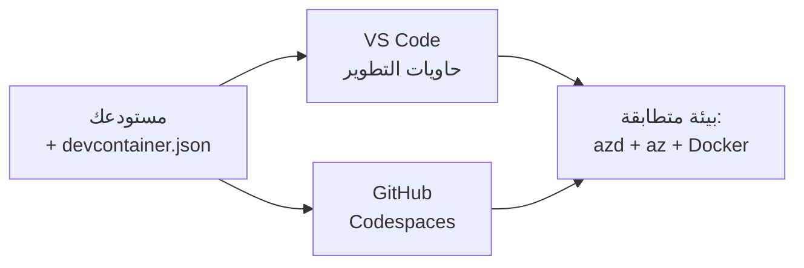

# حاويات التطوير & GitHub Codespaces لـ azd

**التنقل بين الفصول:**
- **📚 الصفحة الرئيسية للدورة**: [AZD For Beginners](../../README.md)
- **📖 الفصل الحالي**: الفصل 1 - الأساسيات والبدء السريع
- **⬅️ السابق**: [Bring Your Own App](bring-your-own-app.md)
- **🚀 الفصل التالي**: [Chapter 2: AI-First Development](../chapter-02-ai-development/README.md)

> تم التحقق باستخدام `azd 1.25.6` في يونيو 2026.

## المقدمة

تثبيت azd، بيئة تشغيل اللغة المناسبة، Docker، و Azure CLI على كل جهاز مرهق—وهو السبب الأول الذي يجعل درسًا يعمل "على جهازي" يفشل بالنسبة لشخص آخر. تحل حاوية التطوير هذه المشكلة بوصف سلسلة الأدوات الكاملة في ملف واحد. أي شخص يفتح المشروع في VS Code أو GitHub Codespaces يحصل على نفس البيئة تمامًا، مع azd مثبتًا مسبقًا. يوضح هذا الدرس كيفية إضافة واحدة.

## أهداف التعلم

في نهاية هذا الدرس، ستتمكن من:
- فهم ما هي حاوية التطوير ولماذا تساعد مع azd
- إضافة ملف `.devcontainer/devcontainer.json` بسيط إلى مشروع
- تضمين azd و Azure CLI و Docker عبر *ميزات* Dev Container
- فتح المشروع في GitHub Codespaces أو VS Code

## نواتج التعلم

بعد إكمال هذا الدرس، ستكون قادرًا على:
- إنشاء `devcontainer.json` لمشروع azd
- إضافة azd وأدوات Azure دون تثبيت يدوي
- تشغيل `azd up` من داخل حاوية أو Codespace

---

## ما هي حاوية التطوير؟

حاوية التطوير هي بيئة تطوير قائمة على Docker معرفة بواسطة ملف `.devcontainer/devcontainer.json` في المستودع الخاص بك. عند فتح المشروع:

- **VS Code** (مع امتداد Dev Containers) يبني الحاوية ويتصل بها.
- **GitHub Codespaces** يبني نفس الحاوية في السحابة ويمنحك محررًا يعمل في المتصفح.

في كلتا الحالتين، يحصل كل متعاون على نفس الأدوات—لا مزيد من استكشاف أخطاء "هل ثبتت azd؟".



---

## الخطوة 1: إنشاء ملف devcontainer

أنشئ `.devcontainer/devcontainer.json` في جذر المشروع الخاص بك:

```json
{
  "name": "azd-project",
  "image": "mcr.microsoft.com/devcontainers/base:bookworm",
  "features": {
    "ghcr.io/devcontainers/features/azure-cli:1": {},
    "ghcr.io/azure/azure-dev/azd:latest": {},
    "ghcr.io/devcontainers/features/docker-in-docker:2": {},
    "ghcr.io/devcontainers/features/node:1": {}
  },
  "customizations": {
    "vscode": {
      "extensions": [
        "ms-azuretools.azure-dev",
        "ms-azuretools.vscode-bicep"
      ]
    }
  },
  "forwardPorts": [3000],
  "postCreateCommand": "azd version"
}
```

ما الذي يفعله كل جزء:

| Key | Purpose |
|-----|---------|
| `image` | نظام التشغيل الأساسي للحاوية |
| `features` | برامج تثبيت مدمجة—هنا: Azure CLI و **azd** و Docker و Node.js |
| `customizations.vscode.extensions` | يثبت تلقائيًا امتدادات azd و Bicep لـ VS Code |
| `forwardPorts` | يكشف منفذ التطبيق الخاص بك لمتصفحك |
| `postCreateCommand` | يُشغّل مرة واحدة بعد بناء الحاوية (هنا، فحص صحة) |

> ميزة `ghcr.io/azure/azure-dev/azd:latest` هي الطريقة الرسمية للحصول على azd داخل حاوية. ثبّت إصدارًا محددًا (على سبيل المثال `azd:1.25.6`) إذا كنت بحاجة إلى قابلية إعادة الإنتاج.

---

## الخطوة 2: طابق الميزة مع لغة تطبيقك

استبدل ميزة `node` بما يستخدمه تطبيقك:

```jsonc
// Python project
"ghcr.io/devcontainers/features/python:1": {},

// .NET project
"ghcr.io/devcontainers/features/dotnet:2": {},

// Java project
"ghcr.io/devcontainers/features/java:1": {},

// Go project
"ghcr.io/devcontainers/features/go:1": {}
```

احتفظ بـ `docker-in-docker` إذا كان `host` لديك هو `containerapp` أو `aks` أو أي شيء يبني صورة حاوية—azd يحتاج Docker لبناء ودفع الصور.

---

## الخطوة 3: افتحه

**في VS Code:**
1. ثبّت امتداد **Dev Containers**.
2. افتح مجلد المشروع.
3. انقر **Reopen in Container** عند المطالبة (أو شغّل *Dev Containers: Reopen in Container*).

**في GitHub Codespaces:**
1. ادفع المستودع إلى GitHub.
2. انقر **Code → Codespaces → Create codespace on main**.
3. انتظر حتى تُبنى الحاوية—azd جاهز في الطرفية.

---

## الخطوة 4: النشر من داخل الحاوية

الحاوية تحتوي على azd مثبتًا مسبقًا، لذا سير العمل العادي يعمل ببساطة:

```bash
azd auth login --use-device-code   # كود الجهاز مفيد داخل Codespaces
azd up
```

> **لماذا `--use-device-code`؟** في حاوية بعيدة أو Codespace لا يوجد متصفح محلي لإعادة التوجيه إليه، لذلك تسجيل الدخول عبر device-code هو المسار الموثوق. ستلصق رمزًا في علامة تبويب المتصفح لإكمال تسجيل الدخول.

---

## المشكلات الشائعة

| المشكلة | الإصلاح |
|---------|-----|
| `azd up` can't build an image | أضف ميزة `docker-in-docker` |
| Browser login hangs in Codespaces | استخدم `azd auth login --use-device-code` |
| Tools differ between teammates | ثبّت إصدارات الميزات (مثال `azd:1.25.6`) |
| App not reachable in browser | أضف المنفذ إلى `forwardPorts` |

---

## الملخص

- تجعل حاوية التطوير سلسلة أدوات azd قابلة لإعادة الإنتاج للجميع.
- أضف azd و Azure CLI و Docker عبر *ميزات* Dev Container.
- طابق ميزة اللغة مع تطبيقك واحتفظ بـ `docker-in-docker` لمضيفي الحاويات.
- استخدم تسجيل الدخول عبر device-code عند التشغيل داخل Codespaces.

---

## 🔗 التنقل

| الاتجاه | المورد |
|-----------|----------|
| **السابق** | [Bring Your Own App](bring-your-own-app.md) |
| **صفحة الفصل** | [Chapter 1: Foundation & Quick Start](README.md) |
| **الفصل التالي** | [Chapter 2: AI-First Development](../chapter-02-ai-development/README.md) |

## 📖 موارد ذات صلة

- [Installation & Setup](installation.md)
- [Command Cheat Sheet](../../resources/cheat-sheet.md)
- [Official Dev Containers specification](https://containers.dev/)
- [azd Dev Container feature](https://github.com/Azure/azure-dev/tree/main/ext/devcontainer)

---

<!-- CO-OP TRANSLATOR DISCLAIMER START -->
**تنويه**:
تمت ترجمة هذا المستند باستخدام خدمة الترجمة بالذكاء الاصطناعي [Co-op Translator](https://github.com/Azure/co-op-translator). بينما نسعى للدقة، يرجى العلم أن الترجمات الآلية قد تحتوي على أخطاء أو عدم دقة. يجب اعتبار المستند الأصلي بلغته الأصلية المصدر الرسمي والمعتمد. للمعلومات الهامة، يُنصح بالاستعانة بترجمة بشرية محترفة. نحن غير مسؤولين عن أي سوء فهم أو تفسير ناتج عن استخدام هذه الترجمة.
<!-- CO-OP TRANSLATOR DISCLAIMER END -->