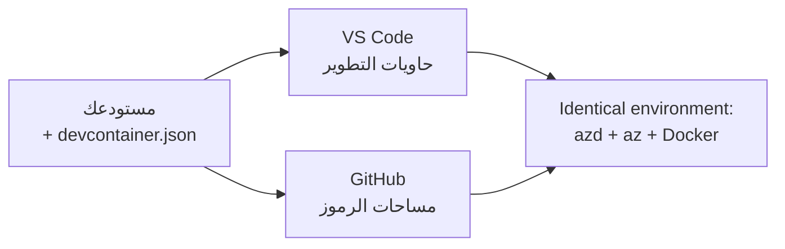

# حاويات التطوير وGitHub Codespaces لأداة azd

**تنقل الفصل:**
- **📚 الصفحة الرئيسية للدورة:** [AZD للمبتدئين](../../README.md)
- **📖 الفصل الحالي:** الفصل 1 - الأساسيات والبداية السريعة
- **⬅️ السابق:** [أحضر تطبيقك الخاص](bring-your-own-app.md)
- **🚀 الفصل التالي:** [الفصل 2: تطوير يركز على الذكاء الاصطناعي](../chapter-02-ai-development/README.md)

> تم التحقق عبر `azd 1.27.1` في يوليو 2026.

## مقدمة

تثبيت azd، وبيئة التشغيل المناسبة للغة، وDocker، وAzure CLI على كل جهاز مهمة متعبة—وهي السبب الأول وراء فشل درس "يعمل على جهازي" مع شخص آخر. حاوية تطوير **dev container** تحل هذه المشكلة بوصف كامل سلسلة الأدوات في ملف واحد. أي شخص يفتح المشروع في VS Code أو GitHub Codespaces يحصل على نفس البيئة تمامًا، مع وجود azd مثبتًا مسبقًا. تعرض لك هذه الدرس كيفية إضافة واحدة.

## أهداف التعلم

بنهاية هذا الدرس، ستتمكن من:
- فهم ماهية حاوية التطوير ولماذا تساعد مع azd
- إضافة ملف `.devcontainer/devcontainer.json` بسيط إلى مشروعك
- تضمين azd، وAzure CLI، وDocker عبر *ميزات* حاوية التطوير
- فتح المشروع في GitHub Codespaces أو VS Code

## مخرجات التعلم

بعد إكمال هذا الدرس، ستتمكن من:
- كتابة ملف `devcontainer.json` لمشروع azd
- إضافة أدوات azd وAzure دون تثبيت يدوي
- تشغيل `azd up` من داخل الحاوية أو Codespace

---

## ما هي حاوية التطوير؟

حاوية التطوير هي بيئة تطوير مبنية على Docker تُعرف بملف `.devcontainer/devcontainer.json` في مستودعك. عندما تفتح المشروع:

- **VS Code** (مع امتداد Dev Containers) يبني الحاوية ويرتبط بها.
- **GitHub Codespaces** يبني نفس الحاوية في السحابة ويمنحك محررًا مستندًا إلى المتصفح.

في كلا الحالتين، يحصل كل مساهم على أدوات متطابقة—لا حاجة لـ "هل ثبتت azd؟" كتحرّي أخطاء.



---

## الخطوة 1: إنشاء ملف devcontainer

أنشئ الملف `.devcontainer/devcontainer.json` في جذر مشروعك:

```json
{
  "name": "azd-project",
  "image": "mcr.microsoft.com/devcontainers/base:bookworm",
  "features": {
    "ghcr.io/devcontainers/features/azure-cli:1": {},
    "ghcr.io/azure/azure-dev/azd:latest": {},
    "ghcr.io/devcontainers/features/docker-in-docker:2": {},
    "ghcr.io/devcontainers/features/node:1": {}
  },
  "customizations": {
    "vscode": {
      "extensions": [
        "ms-azuretools.azure-dev",
        "ms-azuretools.vscode-bicep"
      ]
    }
  },
  "forwardPorts": [3000],
  "postCreateCommand": "azd version"
}
```

ماذا يفعل كل جزء:

| المفتاح | الغرض |
|-----|---------|
| `image` | نظام التشغيل الأساسي للحاوية |
| `features` | مثبتات مدمجة—هنا: Azure CLI، **azd**، Docker، وNode.js |
| `customizations.vscode.extensions` | يثبت تلقائيًا امتدادات VS Code لأدوات azd وBicep |
| `forwardPorts` | يفتح منفذ التطبيق لديك في المتصفح |
| `postCreateCommand` | يُشغل مرة واحدة بعد بناء الحاوية (هنا للتحقق من الصحة) |

> ميزة `ghcr.io/azure/azure-dev/azd:latest` هي الطريقة الرسمية للحصول على azd في الحاوية. يمكن تثبيت إصدار محدد (مثل `azd:1.27.1`) إذا كنت بحاجة للتكرار.

---

## الخطوة 2: طابق الميزة مع لغة تطبيقك

استبدل ميزة `node` بما يستخدمه تطبيقك:

```jsonc
// Python project
"ghcr.io/devcontainers/features/python:1": {},

// .NET project
"ghcr.io/devcontainers/features/dotnet:2": {},

// Java project
"ghcr.io/devcontainers/features/java:1": {},

// Go project
"ghcr.io/devcontainers/features/go:1": {}
```

احتفظ بـ `docker-in-docker` إذا كان `host` هو `containerapp` أو `aks` أو أي شيء يبني صورة حاوية—azd يحتاج إلى Docker لبناء ودفع الصور.

---

## الخطوة 3: افتحه

**في VS Code:**
1. ثبّت امتداد **Dev Containers**.
2. افتح مجلد المشروع.
3. انقر **إعادة الفتح في الحاوية** عند الطلب (أو شغل *Dev Containers: Reopen in Container*).

**في GitHub Codespaces:**
1. ادفع المستودع إلى GitHub.
2. انقر **Code → Codespaces → إنشاء codespace على الفرع الرئيسي**.
3. انتظر بناء الحاوية—azd جاهز في الطرفية.

---

## الخطوة 4: النشر من داخل الحاوية

تحتوي الحاوية على azd مثبت مسبقًا، لذا يعمل سير العمل العادي ببساطة:

```bash
azd auth login --use-device-code   # رمز الجهاز مفيد داخل مساحات الأكواد
azd up
```

> **لماذا `--use-device-code`؟** في حاوية بعيدة أو Codespace لا يوجد متصفح محلي لإعادة التوجيه، لذا تسجيل الدخول برمز الجهاز هو الطريقة الموثوقة. ستلصق رمزًا في علامة تبويب المتصفح لإكمال تسجيل الدخول.

---

## المشاكل الشائعة

| المشكلة | الحل |
|---------|-----|
| لا يستطيع `azd up` بناء صورة | أضف ميزة `docker-in-docker` |
| تسجيل الدخول عبر المتصفح يتوقف في Codespaces | استخدم `azd auth login --use-device-code` |
| اختلاف الأدوات بين الزملاء | ثبت إصدارات الميزات (مثلاً `azd:1.27.1`) |
| التطبيق غير قابل للوصول عبر المتصفح | أضف المنفذ إلى `forwardPorts` |

---

## ملخص

- حاوية التطوير تجعل سلسلة أدوات azd قابلة للتكرار للجميع.
- أضف azd وAzure CLI وDocker عبر *ميزات* حاوية التطوير.
- طابق ميزة اللغة مع تطبيقك واحتفظ بـ `docker-in-docker` لمضيفي الحاويات.
- استخدم تسجيل الدخول برمز الجهاز عند التشغيل داخل Codespaces.

---

## 🔗 التنقل

| الاتجاه | المورد |
|-----------|----------|
| **السابق** | [أحضر تطبيقك الخاص](bring-your-own-app.md) |
| **الصفحة الرئيسية للفصل** | [الفصل 1: الأساسيات والبداية السريعة](README.md) |
| **الفصل التالي** | [الفصل 2: تطوير يركز على الذكاء الاصطناعي](../chapter-02-ai-development/README.md) |

## 📖 موارد ذات صلة

- [التثبيت والإعداد](installation.md)
- [مذكرة اختصارات الأوامر](../../resources/cheat-sheet.md)
- [المواصفة الرسمية لحاويات التطوير](https://containers.dev/)
- [ميزة حاوية تطوير azd](https://github.com/Azure/azure-dev/tree/main/ext/devcontainer)

---

<!-- CO-OP TRANSLATOR DISCLAIMER START -->
**تنويه**:
تمت ترجمة هذا المستند باستخدام خدمة الترجمة بالذكاء الاصطناعي [Co-op Translator](https://github.com/Azure/co-op-translator). بينما نسعى للدقة، يرجى العلم أن الترجمات الآلية قد تحتوي على أخطاء أو عدم دقة. يجب اعتبار المستند الأصلي بلغته الأصلية المصدر الرسمي والمعتمد. للمعلومات الهامة، يُنصح بالاستعانة بترجمة بشرية محترفة. نحن غير مسؤولين عن أي سوء فهم أو تفسير ناتج عن استخدام هذه الترجمة.
<!-- CO-OP TRANSLATOR DISCLAIMER END -->