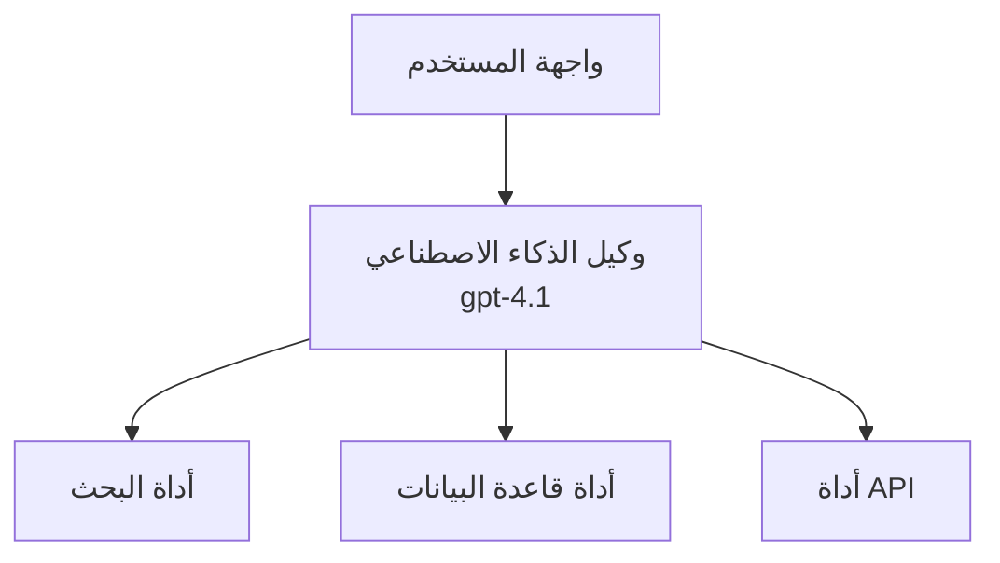
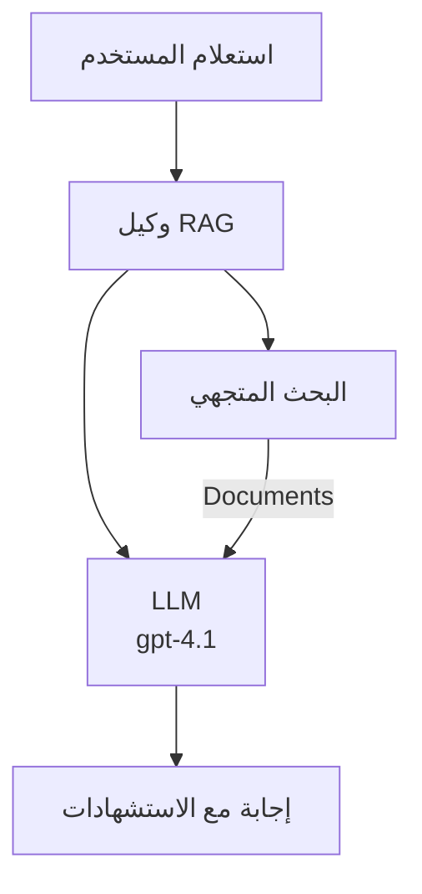
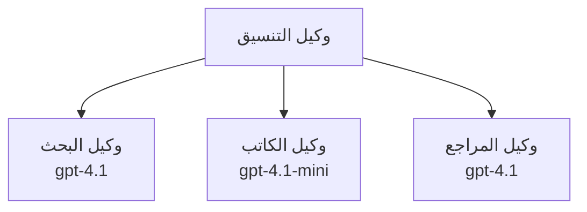

# وكلاء الذكاء الاصطناعي باستخدام Azure Developer CLI

**تنقل الفصل:**
- **📚 الصفحة الرئيسية للدورة**: [AZD للمبتدئين](../../README.md)
- **📖 الفصل الحالي**: الفصل 2 - التطوير الأول للذكاء الاصطناعي
- **⬅️ السابق**: [تكامل Microsoft Foundry](microsoft-foundry-integration.md)
- **➡️ التالي**: [نشر نموذج الذكاء الاصطناعي](ai-model-deployment.md)
- **🚀 متقدم**: [حلول متعددة الوكلاء](../../examples/retail-scenario.md)

---

## مقدمة

وكلاء الذكاء الاصطناعي هم برامج مستقلة يمكنها إدراك بيئتها، واتخاذ القرارات، واتخاذ الإجراءات لتحقيق أهداف محددة. على عكس روبوتات الدردشة البسيطة التي تستجيب للمطالبات، يمكن للوكلاء:

- **استخدام الأدوات** - استدعاء واجهات برمجة التطبيقات، البحث في قواعد البيانات، تنفيذ التعليمات البرمجية
- **التخطيط والتفكير** - تقسيم المهام المعقدة إلى خطوات
- **التعلم من السياق** - الاحتفاظ بالذاكرة وتكييف السلوك
- **التعاون** - العمل مع وكلاء آخرين (أنظمة متعددة الوكلاء)

يوضح هذا الدليل كيفية نشر وكلاء الذكاء الاصطناعي على Azure باستخدام Azure Developer CLI (azd).

> **ملاحظة التحقق (2026-07-13):** تم مراجعة هذا الدليل مع `azd` الإصدار `1.27.1` و `azure.ai.agents` الإصدار `1.0.0-beta.5`. لا تزال تجربة `azd ai` قائمة على المعاينة، لذا تحقق من مساعدة الإضافة إذا كانت الأعلام المثبتة تختلف لديك.

## أهداف التعلم

من خلال إكمال هذا الدليل، ستتمكن من:
- فهم ماهية وكلاء الذكاء الاصطناعي وكيف يختلفون عن روبوتات الدردشة
- نشر قوالب وكلاء الذكاء الاصطناعي الجاهزة باستخدام AZD
- تكوين وكلاء Foundry للوكلاء المخصصين
- تنفيذ أنماط الوكلاء الأساسية (استخدام الأدوات، RAG، وكلاء متعددون)
- مراقبة وتصحيح الوكلاء المنشورين

## مخرجات التعلم

عند الانتهاء، ستكون قادرًا على:
- نشر تطبيقات وكلاء الذكاء الاصطناعي على Azure بأمر واحد
- تكوين أدوات وقدرات الوكيل
- تنفيذ توليد معزز بالاستخراج (RAG) مع الوكلاء
- تصميم بنى وكلاء متعددة للمهام المعقدة
- حل المشكلات الشائعة في نشر الوكلاء

---

## 🤖 ما الذي يميز الوكيل عن روبوت الدردشة؟

| الخاصية | روبوت الدردشة | وكيل الذكاء الاصطناعي |
|---------|---------------|---------------------|
| **السلوك** | يستجيب للمطالبات | يتخذ إجراءات مستقلة |
| **الأدوات** | لا يوجد | يمكنه استدعاء واجهات برمجة التطبيقات، البحث، تنفيذ التعليمات البرمجية |
| **الذاكرة** | تستند إلى الجلسة فقط | ذاكرة مستمرة عبر الجلسات |
| **التخطيط** | رد واحد | تفكير متعدد الخطوات |
| **التعاون** | كيان واحد | يمكنه العمل مع وكلاء آخرين |

### تشبيه بسيط

- **روبوت الدردشة** = شخص مساعد يجيب على الأسئلة في مكتب المعلومات
- **وكيل الذكاء الاصطناعي** = مساعد شخصي يمكنه إجراء المكالمات، حجز المواعيد، وإكمال المهام نيابة عنك

---

## 🚀 بداية سريعة: انشر وكيلك الأول

### الخيار 1: قالب وكلاء Foundry (موصى به)

```bash
# تهيئة قالب وكلاء الذكاء الاصطناعي
azd init --template get-started-with-ai-agents

# النشر إلى أزور
azd up
```

**ما يتم نشره:**
- ✅ وكلاء Foundry
- ✅ نماذج Microsoft Foundry (gpt-4.1)
- ✅ Azure AI Search (لـ RAG)
- ✅ تطبيقات حاوية Azure (واجهة ويب)
- ✅ Application Insights (للمراقبة)

**الوقت:** ~15-20 دقيقة
**التكلفة:** ~$100-150/شهريًا (تطوير)

### الخيار 2: وكيل OpenAI مع Prompty

```bash
# تهيئة قالب الوكيل القائم على Prompty
azd init --template agent-openai-python-prompty

# النشر إلى Azure
azd up
```

**ما يتم نشره:**
- ✅ وظائف Azure (تنفيذ وكيل بدون خادم)
- ✅ نماذج Microsoft Foundry
- ✅ ملفات تكوين Prompty
- ✅ تنفيذ مثال للوكيل

**الوقت:** ~10-15 دقيقة
**التكلفة:** ~$50-100/شهريًا (تطوير)

### الخيار 3: وكيل دردشة RAG

```bash
# تهيئة قالب الدردشة RAG
azd init --template azure-search-openai-demo

# النشر إلى أزور
azd up
```

**ما يتم نشره:**
- ✅ نماذج Microsoft Foundry
- ✅ Azure AI Search مع بيانات نموذجية
- ✅ خط معالجة الوثائق
- ✅ واجهة دردشة مع استشهادات

**الوقت:** ~15-25 دقيقة
**التكلفة:** ~$80-150/شهريًا (تطوير)

### الخيار 4: تهيئة وكيل AZD AI (معاينة على أساس المانيفست أو القالب)

إذا كان لديك ملف تعريفي للوكيل (manifest)، يمكنك استخدام أمر `azd ai` لإنشاء مشروع خدمة وكيل Foundry مباشرة. أصدرت الإصدارات الحديثة أيضًا دعم التهيئة بناءً على القالب، لذا قد يختلف تدفق المطالبات قليلاً حسب إصدار الإضافة الذي ثبتته.

```bash
# تثبيت ملحق وكلاء الذكاء الاصطناعي
azd extension install azure.ai.agents

# اختياري: تحقق من نسخة المعاينة المثبتة
azd extension show azure.ai.agents

# البدء من ملف تعريف الوكيل
azd ai agent init -m agent-manifest.yaml

# النشر إلى Azure
azd up

# اختبار الوكيل المنشور (يعرض التأخير + وقت الوصول لأول بايت)
azd ai agent invoke
```

**متى تستخدم `azd ai agent init` مقابل `azd init --template`:**

| النهج | الأفضل لـ | طريقة العمل |
|--------|----------|---------|
| `azd init --template` | بدءًا من تطبيق نموذجي يعمل | ينسخ مستودع قالب كامل مع الكود والبنية التحتية |
| `azd ai agent init -m` | بناءً على تعريف وكيل خاص بك | يُنشئ هيكل المشروع من تعريف الوكيل الخاص بك |

> **نصيحة:** استخدم `azd init --template` عند التعلم (الخيارات 1-3 أعلاه). استخدم `azd ai agent init` عند بناء وكلاء للإنتاج باستخدام ملفات التعريف الخاصة بك.

بعد الأمر `azd up`، سيقوم نفس الامتداد بمرافقتك خلال بقية دورة حياة الوكيل: `azd ai agent invoke` للاختبار، و `azd ai agent eval generate` و `azd ai agent optimize` لقياس وتحسين الجودة، و `azd ai agent delete` لتنظيف الموارد. راجع [أوامر واجهة سطر أوامر AZD AI](../chapter-08-production/production-ai-practices.md#azd-ai-cli-commands-and-extensions) للمرجع الكامل.

---

## 🏗️ أنماط بنية الوكيل

### النمط 1: وكيل واحد مع أدوات

أبسط نمط للوكيل - وكيل واحد يمكنه استخدام أدوات متعددة.



**أفضل للاستخدام في:**
- روبوتات دعم العملاء
- مساعدين بحث
- وكلاء تحليل بيانات

**قالب AZD:** `azure-search-openai-demo`

### النمط 2: وكيل RAG (توليد معزز بالاستخراج)

وكيل يستخرج الوثائق ذات الصلة قبل توليد الردود.



**أفضل للاستخدام في:**
- قواعد المعرفة للمؤسسات
- أنظمة أسئلة وأجوبة للوثائق
- البحوث القانونية والامتثال

**قالب AZD:** `azure-search-openai-demo`

### النمط 3: نظام وكيل متعدد

عدة وكلاء متخصصين يعملون معًا على مهام معقدة.



**أفضل للاستخدام في:**
- توليد محتوى معقد
- سير عمل متعدد الخطوات
- مهام تتطلب خبرات مختلفة

**تعلم المزيد:** [أنماط تنسيق الوكلاء المتعددين](../chapter-06-pre-deployment/coordination-patterns.md)

---

## ⚙️ تكوين أدوات الوكيل

يصبح الوكلاء أقوى عند قدرتهم على استخدام الأدوات. إليك كيفية تكوين الأدوات الشائعة:

### تكوين الأدوات في وكلاء Foundry

```python
# agent_config.py
from azure.ai.projects import AIProjectClient
from azure.ai.projects.models import FunctionTool, CodeInterpreterTool

# تعريف أدوات مخصصة
search_tool = FunctionTool(
    name="search_knowledge_base",
    description="Search the company knowledge base for relevant documents",
    parameters={
        "type": "object",
        "properties": {
            "query": {
                "type": "string",
                "description": "The search query"
            }
        },
        "required": ["query"]
    }
)

# إنشاء وكيل بالأدوات
agent = project_client.agents.create_agent(
    model="gpt-4.1",
    name="Support Agent",
    instructions="You are a helpful support agent. Use the search tool to find relevant information.",
    tools=[search_tool, CodeInterpreterTool()]
)
```

### تكوين البيئة

```bash
# إعداد متغيرات البيئة الخاصة بالوكيل
azd env set AZURE_OPENAI_MODEL "gpt-4.1"
azd env set AGENT_INSTRUCTIONS "You are a helpful assistant..."
azd env set ENABLE_CODE_INTERPRETER "true"
azd env set ENABLE_FILE_SEARCH "true"

# النشر باستخدام التكوين المُحدَّث
azd deploy
```

---

## 📊 مراقبة الوكلاء

### دمج Application Insights

جميع قوالب وكلاء AZD تشمل Application Insights للمراقبة:

```bash
# فتح لوحة المراقبة
azd monitor --overview

# عرض السجلات الحية
azd monitor --logs

# عرض المقاييس الحية
azd monitor --live
```

### المقاييس الرئيسية للمتابعة

| المقياس | الوصف | الهدف |
|--------|--------|--------|
| زمن الاستجابة | الوقت لتوليد الرد | أقل من 5 ثوان |
| استخدام الرموز | الرموز لكل طلب | المراقبة للتكلفة |
| نسبة نجاح استدعاء الأدوات | % من تنفيذ الأدوات الناجحة | أكثر من 95% |
| معدل الأخطاء | طلبات الوكيل الفاشلة | أقل من 1% |
| رضا المستخدم | درجات التغذية الراجعة | أكثر من 4.0/5.0 |

### تسجيل مخصص للوكلاء

```python
import os
from azure.monitor.opentelemetry import configure_azure_monitor
from opentelemetry import trace

# تكوين Azure Monitor باستخدام OpenTelemetry
configure_azure_monitor(
    connection_string=os.environ["APPLICATIONINSIGHTS_CONNECTION_STRING"]
)

tracer = trace.get_tracer(__name__)

def log_agent_interaction(user_query, agent_response, tools_used, latency_ms):
    with tracer.start_as_current_span("agent_interaction") as span:
        span.set_attributes({
            "user_query": user_query,
            "response_length": len(agent_response),
            "tools_used": tools_used,
            "latency_ms": latency_ms
        })
```

> **ملاحظة:** قم بتثبيت الحزم المطلوبة: `pip install azure-monitor-opentelemetry opentelemetry`

---

## 💰 اعتبارات التكلفة

### التكاليف الشهرية المقدرة حسب النمط

| النمط | بيئة التطوير | الإنتاج |
|---------|--------------|---------|
| وكيل فردي | 50-100 دولار | 200-500 دولار |
| وكيل RAG | 80-150 دولار | 300-800 دولار |
| وكيل متعدد (2-3 وكلاء) | 150-300 دولار | 500-1,500 دولار |
| وكيل متعدد المؤسسات | 300-500 دولار | 1,500-5,000+ دولار |

### نصائح تحسين التكلفة

1. **استخدم gpt-4.1-mini للمهام البسيطة**
   ```bash
   azd env set AZURE_OPENAI_MODEL "gpt-4.1-mini"
   ```

2. **نفذ التخزين المؤقت للاستعلامات المتكررة**
   ```python
   from functools import lru_cache
   
   @lru_cache(maxsize=1000)
   def get_cached_response(query_hash):
       return agent.run(query_hash)
   ```

3. **حدد حدود الرموز لكل عملية تشغيل**
   ```python
   # تعيين الحد الأقصى لرموز الإكمال عند تشغيل الوكيل، وليس أثناء الإنشاء
   run = project_client.agents.create_run(
       thread_id=thread.id,
       agent_id=agent.id,
       max_completion_tokens=1000  # تحديد طول الاستجابة
   )
   ```

4. **قم بالتحجيم إلى الصفر عند عدم الاستخدام**
   ```bash
   # تطبيقات الحاويات تتوسع تلقائياً إلى الصفر
   azd env set MIN_REPLICAS "0"
   ```

---

## 🔧 استكشاف أخطاء الوكلاء وإصلاحها

### المشكلات والحلول الشائعة

<details>
<summary><strong>❌ الوكيل لا يستجيب لاستدعاءات الأدوات</strong></summary>

```bash
# تحقق مما إذا كانت الأدوات مسجلة بشكل صحيح
azd show

# تحقق من نشر OpenAI
az cognitiveservices account deployment list \
  --name $AZURE_OPENAI_NAME \
  --resource-group $RG_NAME

# تحقق من سجلات الوكيل
azd monitor --logs
```

**الأسباب الشائعة:**
- عدم تطابق توقيع وظيفة الأداة
- نقص الأذونات المطلوبة
- نقطة نهاية API غير متاحة
</details>

<details>
<summary><strong>❌ زمن استجابة عالي للوكيل</strong></summary>

```bash
# تحقق من Application Insights لاكتشاف نقاط الاختناق
azd monitor --live

# ضع في اعتبارك استخدام نموذج أسرع
azd env set AZURE_OPENAI_MODEL "gpt-4.1-mini"
azd deploy
```

**نصائح التحسين:**
- استخدام الردود المتدفقة
- تنفيذ التخزين المؤقت للردود
- تقليل حجم نافذة السياق
</details>

<details>
<summary><strong>❌ الوكيل يرجع معلومات غير صحيحة أو وهمية</strong></summary>

```python
# تحسين باستخدام مطالبات نظام أفضل
instructions = """
You are a helpful assistant. IMPORTANT:
- Only answer based on provided context
- If you don't know, say "I don't know"
- Always cite your sources
- Never make up information
"""

# إضافة استرجاع للتأسيس
agent = project_client.agents.create_agent(
    model="gpt-4.1",
    instructions=instructions,
    tools=[FileSearchTool()]  # تأسيس الردود في الوثائق
)
```
</details>

<details>
<summary><strong>❌ أخطاء تجاوز حد الرموز</strong></summary>

```python
# تنفيذ إدارة نافذة السياق
def truncate_context(messages, max_tokens=8000, model="gpt-4.1"):
    """Keep only recent messages within token limit."""
    import tiktoken
    encoding = tiktoken.encoding_for_model(model)
    total_tokens = 0
    truncated = []
    
    for msg in reversed(messages):
        msg_tokens = len(encoding.encode(msg.content))
        if total_tokens + msg_tokens > max_tokens:
            break
        truncated.insert(0, msg)
        total_tokens += msg_tokens
    
    return truncated
```
</details>

---

## 🎓 تمارين عملية

### التمرين 1: نشر وكيل أساسي (20 دقيقة)

**الهدف:** نشر وكيل الذكاء الاصطناعي الأول باستخدام AZD

```bash
# الخطوة 1: تهيئة القالب
azd init --template get-started-with-ai-agents

# الخطوة 2: تسجيل الدخول إلى Azure
azd auth login
# إذا كنت تعمل عبر المستأجرين، أضف --tenant-id <tenant-id>

# الخطوة 3: النشر
azd up

# الخطوة 4: اختبار الوكيل
# الإخراج المتوقع بعد النشر:
#   تم اكتمال النشر!
#   نقطة النهاية: https://<app-name>.<region>.azurecontainerapps.io
# افتح الرابط المعروض في الناتج وحاول طرح سؤال

# الخطوة 5: عرض المراقبة
azd monitor --overview

# الخطوة 6: التنظيف
azd down --force --purge
```

**معايير النجاح:**
- [ ] يستجيب الوكيل للأسئلة
- [ ] يمكن الوصول إلى لوحة المراقبة عبر `azd monitor`
- [ ] تنظيف الموارد بنجاح

### التمرين 2: إضافة أداة مخصصة (30 دقيقة)

**الهدف:** توسيع الوكيل بأداة مخصصة

1. انشر قالب الوكيل:
   ```bash
   azd init --template get-started-with-ai-agents
   azd up
   ```
2. أنشئ وظيفة أداة جديدة في كود الوكيل الخاص بك:
   ```python
   def get_weather(location: str) -> str:
       """Get current weather for a location."""
       # استدعاء واجهة برمجة التطبيقات لخدمة الطقس
       return f"Weather in {location}: Sunny, 72°F"
   ```
3. سجل الأداة مع الوكيل:
   ```python
   from azure.ai.projects.models import FunctionTool

   weather_tool = FunctionTool(
       name="get_weather",
       description="Get current weather for a location",
       parameters={
           "type": "object",
           "properties": {
               "location": {"type": "string", "description": "City name"}
           },
           "required": ["location"]
       }
   )

   agent = project_client.agents.create_agent(
       model="gpt-4.1",
       name="Weather Agent",
       tools=[weather_tool]
   )
   ```
4. أعد النشر والاختبار:
   ```bash
   azd deploy
   # اسأل: "ما هو الطقس في سياتل؟"
   # المتوقع: يقوم الوكيل باستدعاء get_weather("Seattle") ويعيد معلومات الطقس
   ```

**معايير النجاح:**
- [ ] يتعرف الوكيل على استعلامات الطقس
- [ ] تم استدعاء الأداة بشكل صحيح
- [ ] تتضمن الاستجابة معلومات الطقس

### التمرين 3: بناء وكيل RAG (45 دقيقة)

**الهدف:** إنشاء وكيل يجيب على الأسئلة من مستنداتك

```bash
# الخطوة 1: نشر قالب RAG
azd init --template azure-search-openai-demo
azd up

# الخطوة 2: رفع مستنداتك
# ضع ملفات PDF/TXT في مجلد data/، ثم شغل:
python scripts/prepdocs.py

# الخطوة 3: الاختبار بأسئلة خاصة بالمجال
# افتح عنوان URL لتطبيق الويب من ناتج azd up
# اطرح أسئلة حول مستنداتك المرفوعة
# يجب أن تتضمن الردود مراجع اقتباس مثل [doc.pdf]
```

**معايير النجاح:**
- [ ] يجيب الوكيل من الوثائق المرفوعة
- [ ] تتضمن الردود الاستشهادات
- [ ] لا يوجد هلوسة في الأسئلة خارج النطاق

---

## 📚 الخطوات التالية

بعد أن فهمت وكلاء الذكاء الاصطناعي، استكشف هذه المواضيع المتقدمة:

| الموضوع | الوصف | الرابط |
|---------|---------|---------|
| **أنظمة الوكلاء المتعددين** | بناء أنظمة مع وكلاء متعددين متعاونين | [مثال متعدد الوكلاء للبيع بالتجزئة](../../examples/retail-scenario.md) |
| **أنماط التنسيق** | تعلم أنماط التنظيم والتواصل | [أنماط التنسيق](../chapter-06-pre-deployment/coordination-patterns.md) |
| **نشر الإنتاج** | نشر الوكيل الجاهز للمؤسسات | [ممارسات الذكاء الاصطناعي للإنتاج](../chapter-08-production/production-ai-practices.md) |
| **تقييم الوكيل** | اختبار وتقييم أداء الوكيل | [استكشاف أخطاء الذكاء الاصطناعي](../chapter-07-troubleshooting/ai-troubleshooting.md) |
| **مختبر ورشة عمل الذكاء الاصطناعي** | يدوي: اجعل حل الذكاء الاصطناعي الخاص بك جاهزًا لـ AZD | [مختبر ورشة عمل الذكاء الاصطناعي](ai-workshop-lab.md) |

---

## 📖 موارد إضافية

### الوثائق الرسمية
- [خدمة وكيل Microsoft Foundry](https://learn.microsoft.com/azure/ai-services/agents/)
- [بدء سريع لخدمة وكيل Microsoft Foundry](https://learn.microsoft.com/azure/ai-services/agents/quickstart)
- [إطار عمل وكيل Semantic Kernel](https://learn.microsoft.com/semantic-kernel/)

### قوالب AZD للوكلاء
- [ابدأ مع وكلاء الذكاء الاصطناعي](https://github.com/Azure-Samples/get-started-with-ai-agents)
- [وكيل OpenAI Python Prompty](https://github.com/Azure-Samples/agent-openai-python-prompty)
- [عرض Azure Search OpenAI](https://github.com/Azure-Samples/azure-search-openai-demo)

### موارد المجتمع
- [Awesome AZD - قوالب الوكلاء](https://azure.github.io/awesome-azd/?tags=ai-agents)
- [Discord الذكاء الاصطناعي لـ Azure](https://discord.gg/microsoft-azure)
- [Discord Microsoft Foundry](https://discord.gg/nTYy5BXMWG)

### مهارات الوكلاء لمحررك
- [**مهارات وكيل Microsoft Azure**](https://skills.sh/microsoft/github-copilot-for-azure) - تثبيت مهارات وكيل الذكاء الاصطناعي القابلة لإعادة الاستخدام لتطوير Azure في GitHub Copilot أو Cursor أو أي وكيل مدعوم. يشمل مهارات لـ [Azure AI](https://skills.sh/microsoft/github-copilot-for-azure/azure-ai)، [Microsoft Foundry](https://skills.sh/microsoft/github-copilot-for-azure/microsoft-foundry)، [النشر](https://skills.sh/microsoft/github-copilot-for-azure/azure-deploy)، و [التشخيص](https://skills.sh/microsoft/github-copilot-for-azure/azure-diagnostics):
  ```bash
  npx skills add microsoft/github-copilot-for-azure
  ```

---

**التنقل**
- **الدرس السابق**: [تكامل Microsoft Foundry](microsoft-foundry-integration.md)
- **الدرس التالي**: [نشر نموذج الذكاء الاصطناعي](ai-model-deployment.md)

---

<!-- CO-OP TRANSLATOR DISCLAIMER START -->
**تنويه**:
تمت ترجمة هذا المستند باستخدام خدمة الترجمة بالذكاء الاصطناعي [Co-op Translator](https://github.com/Azure/co-op-translator). بينما نسعى للدقة، يرجى العلم أن الترجمات الآلية قد تحتوي على أخطاء أو عدم دقة. يجب اعتبار المستند الأصلي بلغته الأصلية المصدر الرسمي والمعتمد. للمعلومات الهامة، يُنصح بالاستعانة بترجمة بشرية محترفة. نحن غير مسؤولين عن أي سوء فهم أو تفسير ناتج عن استخدام هذه الترجمة.
<!-- CO-OP TRANSLATOR DISCLAIMER END -->