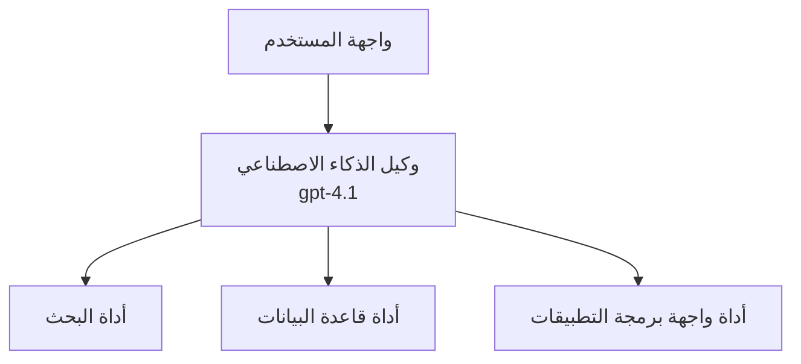
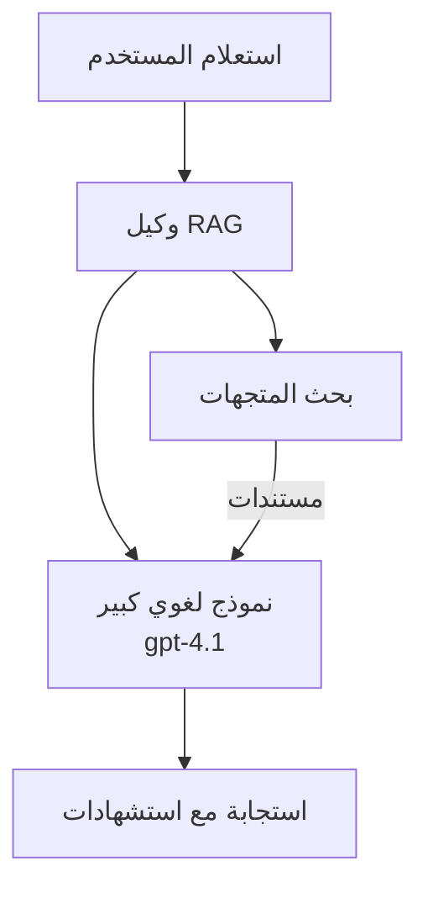

# وكلاء الذكاء الاصطناعي مع Azure Developer CLI

**تنقل الفصل:**
- **📚 الصفحة الرئيسية للدورة**: [AZD للمبتدئين](../../README.md)
- **📖 الفصل الحالي**: الفصل 2 - التطوير المعتمد على الذكاء الاصطناعي
- **⬅️ السابق**: [Microsoft Foundry Integration](microsoft-foundry-integration.md)
- **➡️ التالي**: [AI Model Deployment](ai-model-deployment.md)
- **🚀 متقدم**: [حلول متعددة الوكلاء](../../examples/retail-scenario.md)

---

## مقدمة

وكلاء الذكاء الاصطناعي هم برامج مستقلة قادرة على إدراك بيئتها، واتخاذ قرارات، وتنفيذ إجراءات لتحقيق أهداف محددة. على عكس روبوتات المحادثة البسيطة التي تستجيب للمطالبات، يمكن للوكلاء:

- **استخدام الأدوات** - استدعاء واجهات برمجة التطبيقات، البحث في قواعد البيانات، تنفيذ الشيفرة
- **التخطيط والاستدلال** - تقسيم المهام المعقدة إلى خطوات
- **التعلّم من السياق** - الاحتفاظ بالذاكرة والتكيف في السلوك
- **التعاون** - العمل مع وكلاء آخرين (أنظمة متعددة الوكلاء)

يوضح هذا الدليل كيفية نشر وكلاء الذكاء الاصطناعي إلى Azure باستخدام Azure Developer CLI (azd).

> **ملاحظة التحقق (2026-03-25):** تمت مراجعة هذا الدليل مقابل `azd` `1.23.12` و `azure.ai.agents` `0.1.18-preview`. تجربة `azd ai` لا تزال تعتمد على المعاينة، لذا تحقق من مساعدة الامتداد إذا كانت الأعلام المثبتة لديك مختلفة.

## أهداف التعلم

عند إكمال هذا الدليل، سوف:
- تفهم ما هي وكلاء الذكاء الاصطناعي وكيف تختلف عن روبوتات المحادثة
- تنشر قوالب وكلاء مُعدة مسبقًا باستخدام AZD
- تهيئ وكلاء Foundry للوكلاء المخصصين
- تنفذ أنماط وكلاء أساسية (استخدام الأدوات، RAG، متعدد الوكلاء)
- تراقب وتصحح الوكلاء المنشورين

## النتائج المتوقعة من التعلم

عند الإكمال، ستكون قادرًا على:
- نشر تطبيقات وكلاء الذكاء الاصطناعي إلى Azure بأمر واحد
- تكوين أدوات وقدرات الوكلاء
- تنفيذ التوليد المدعوم بالاستخراج (RAG) مع الوكلاء
- تصميم معمارية متعددة الوكلاء لعمليات عمل معقدة
- استكشاف مشكلات نشر الوكلاء الشائعة وإصلاحها

---

## 🤖 ما الذي يجعل الوكيل مختلفًا عن روبوت المحادثة؟

| الميزة | روبوت محادثة | وكيل ذكاء اصطناعي |
|---------|---------|----------|
| **السلوك** | يرد على المطالبات | يتخذ إجراءات مستقلة |
| **الأدوات** | لا شيء | يمكنه استدعاء واجهات برمجة التطبيقات، البحث، تنفيذ الشيفرة |
| **الذاكرة** | تعتمد على الجلسة فقط | ذاكرة مستمرة عبر الجلسات |
| **التخطيط** | استجابة واحدة | استدلال متعدد الخطوات |
| **التعاون** | كيان واحد | يمكنه العمل مع وكلاء آخرين |

### تشبيه بسيط

- **روبوت المحادثة** = شخص مفيد يجيب على الأسئلة عند مكتب الاستعلامات
- **وكيل الذكاء الاصطناعي** = مساعد شخصي يمكنه إجراء مكالمات، حجز مواعيد، وإكمال المهام نيابةً عنك

---

## 🚀 بدء سريع: انشر وكيلك الأول

### الخيار 1: قالب Foundry Agents (موصى به)

```bash
# تهيئة قالب وكلاء الذكاء الاصطناعي
azd init --template get-started-with-ai-agents

# نشر إلى Azure
azd up
```

**ما يتم نشره:**
- ✅ Foundry Agents
- ✅ Microsoft Foundry Models (gpt-4.1)
- ✅ Azure AI Search (لـ RAG)
- ✅ Azure Container Apps (واجهة ويب)
- ✅ Application Insights (المراقبة)

**الوقت:** ~15-20 دقيقة
**التكلفة:** ~$100-150/شهر (تطوير)

### الخيار 2: وكيل OpenAI مع Prompty

```bash
# تهيئة قالب الوكيل المعتمد على Prompty
azd init --template agent-openai-python-prompty

# نشر إلى Azure
azd up
```

**ما يتم نشره:**
- ✅ Azure Functions (تنفيذ الوكيل بدون خادم)
- ✅ Microsoft Foundry Models
- ✅ ملفات تكوين Prompty
- ✅ تنفيذ عينة للوكيل

**الوقت:** ~10-15 دقيقة
**التكلفة:** ~$50-100/شهر (تطوير)

### الخيار 3: وكيل دردشة RAG

```bash
# تهيئة قالب دردشة RAG
azd init --template azure-search-openai-demo

# نشر إلى Azure
azd up
```

**ما يتم نشره:**
- ✅ Microsoft Foundry Models
- ✅ Azure AI Search مع بيانات نموذجية
- ✅ خط أنابيب معالجة المستندات
- ✅ واجهة دردشة مع استشهادات

**الوقت:** ~15-25 دقيقة
**التكلفة:** ~$80-150/شهر (تطوير)

### الخيار 4: تهيئة وكيل AZD AI (معاينة قائمة على المانيفست أو القالب)

إذا كان لديك ملف مانيفست للوكيل، يمكنك استخدام أمر `azd ai` لتهيئة مشروع خدمة Foundry Agent مباشرة. أصدارات المعاينة الأخيرة أضافت أيضًا دعم التهيئة المستندة إلى القوالب، لذا قد يختلف تدفق المطالبات قليلاً اعتمادًا على إصدار الامتداد المثبت لديك.

```bash
# تثبيت امتداد وكلاء الذكاء الاصطناعي
azd extension install azure.ai.agents

# اختياري: التحقق من إصدار المعاينة المثبت
azd extension show azure.ai.agents

# التهيئة من ملف تعريف الوكيل
azd ai agent init -m agent-manifest.yaml

# النشر إلى أزور
azd up
```

**متى تستخدم `azd ai agent init` مقابل `azd init --template`:**

| النهج | الأنسب لـ | كيف يعمل |
|----------|----------|------|
| `azd init --template` | البدء من تطبيق عيّنة يعمل | يستنسخ مستودع قالب كامل مع الشيفرة + البنية التحتية |
| `azd ai agent init -m` | البناء من مانيفست الوكيل الخاص بك | ينشئ هيكل المشروع من تعريف الوكيل الخاص بك |

> **نصيحة:** استخدم `azd init --template` عند التعلم (الخيارات 1-3 أعلاه). استخدم `azd ai agent init` عند بناء وكلاء الإنتاج بمانيفستاتك الخاصة. انظر [أوامر AZD AI CLI](../chapter-08-production/production-ai-practices.md#azd-ai-cli-commands-and-extensions) للمرجع الكامل.

---

## 🏗️ أنماط معمارية الوكلاء

### النمط 1: وكيل واحد مع أدوات

أبسط نمط للوكيل - وكيل واحد يمكنه استخدام أدوات متعددة.


**مناسب لـ:**
- روبوتات دعم العملاء
- مساعدي البحث
- وكلاء تحليل البيانات

**قالب AZD:** `azure-search-openai-demo`

### النمط 2: وكيل RAG (التوليد المدعوم بالاستخراج)

وكيل يسترجع المستندات ذات الصلة قبل توليد الاستجابات.


**مناسب لـ:**
- قواعد معرفة المؤسسات
- أنظمة سؤال وجواب للمستندات
- أبحاث الامتثال والقانون

**قالب AZD:** `azure-search-openai-demo`

### النمط 3: نظام متعدد الوكلاء

عدة وكلاء متخصصين يعملون معًا على مهام معقدة.


**مناسب لـ:**
- إنشاء محتوى معقد
- سير عمل متعدد الخطوات
- مهام تتطلب خبرات مختلفة

**تعرف أكثر:** [أنماط تنسيق متعدد الوكلاء](../chapter-06-pre-deployment/coordination-patterns.md)

---

## ⚙️ تكوين أدوات الوكيل

تصبح الوكلاء قوية عندما يمكنها استخدام الأدوات. إليك كيفية تكوين الأدوات الشائعة:

### تكوين الأدوات في Foundry Agents

```python
# agent_config.py
from azure.ai.projects import AIProjectClient
from azure.ai.projects.models import FunctionTool, CodeInterpreterTool

# تعريف أدوات مخصصة
search_tool = FunctionTool(
    name="search_knowledge_base",
    description="Search the company knowledge base for relevant documents",
    parameters={
        "type": "object",
        "properties": {
            "query": {
                "type": "string",
                "description": "The search query"
            }
        },
        "required": ["query"]
    }
)

# إنشاء وكيل باستخدام الأدوات
agent = project_client.agents.create_agent(
    model="gpt-4.1",
    name="Support Agent",
    instructions="You are a helpful support agent. Use the search tool to find relevant information.",
    tools=[search_tool, CodeInterpreterTool()]
)
```

### تكوين البيئة

```bash
# إعداد متغيرات البيئة الخاصة بالوكيل
azd env set AZURE_OPENAI_MODEL "gpt-4.1"
azd env set AGENT_INSTRUCTIONS "You are a helpful assistant..."
azd env set ENABLE_CODE_INTERPRETER "true"
azd env set ENABLE_FILE_SEARCH "true"

# نشر باستخدام التكوين المحدث
azd deploy
```

---

## 📊 مراقبة الوكلاء

### تكامل Application Insights

تتضمن جميع قوالب وكلاء AZD Application Insights للمراقبة:

```bash
# افتح لوحة المراقبة
azd monitor --overview

# عرض السجلات المباشرة
azd monitor --logs

# عرض المقاييس المباشرة
azd monitor --live
```

### المقاييس الرئيسية التي يجب تتبعها

| المقياس | الوصف | الهدف |
|--------|-------------|--------|
| زمن الاستجابة | الوقت لتوليد الاستجابة | < 5 ثوانٍ |
| استخدام التوكنات | توكنات لكل طلب | راقب من أجل التكلفة |
| معدل نجاح استدعاء الأدوات | % من تنفيذات الأدوات الناجحة | > 95% |
| معدل الأخطاء | طلبات الوكيل الفاشلة | < 1% |
| رضا المستخدم | درجات التغذية الراجعة | > 4.0/5.0 |

### التسجيل المخصص للوكلاء

```python
import os
from azure.monitor.opentelemetry import configure_azure_monitor
from opentelemetry import trace

# تكوين Azure Monitor باستخدام OpenTelemetry
configure_azure_monitor(
    connection_string=os.environ["APPLICATIONINSIGHTS_CONNECTION_STRING"]
)

tracer = trace.get_tracer(__name__)

def log_agent_interaction(user_query, agent_response, tools_used, latency_ms):
    with tracer.start_as_current_span("agent_interaction") as span:
        span.set_attributes({
            "user_query": user_query,
            "response_length": len(agent_response),
            "tools_used": tools_used,
            "latency_ms": latency_ms
        })
```

> **ملاحظة:** ثبّت الحزم المطلوبة: `pip install azure-monitor-opentelemetry opentelemetry`

---

## 💰 اعتبارات التكلفة

### التكاليف الشهرية المقدرة حسب النمط

| النمط | بيئة التطوير | الإنتاج |
|---------|-----------------|------------|
| وكيل واحد | $50-100 | $200-500 |
| وكيل RAG | $80-150 | $300-800 |
| متعدد الوكلاء (2-3 وكلاء) | $150-300 | $500-1,500 |
| متعدد الوكلاء للمؤسسات | $300-500 | $1,500-5,000+ |

### نصائح تحسين التكلفة

1. **استخدم gpt-4.1-mini للمهام البسيطة**
   ```bash
   azd env set AZURE_OPENAI_MODEL "gpt-4.1-mini"
   ```

2. **نفّذ التخزين المؤقت للاستعلامات المتكررة**
   ```python
   from functools import lru_cache
   
   @lru_cache(maxsize=1000)
   def get_cached_response(query_hash):
       return agent.run(query_hash)
   ```

3. **حدد حدود التوكن لكل تشغيل**
   ```python
   # اضبط max_completion_tokens عند تشغيل الوكيل، وليس أثناء إنشائه
   run = project_client.agents.create_run(
       thread_id=thread.id,
       agent_id=agent.id,
       max_completion_tokens=1000  # حد من طول الاستجابة
   )
   ```

4. **قم بالتصغير إلى الصفر عند عدم الاستخدام**
   ```bash
   # تتقلص تطبيقات الحاويات تلقائيًا إلى الصفر
   azd env set MIN_REPLICAS "0"
   ```

---

## 🔧 استكشاف أخطاء الوكلاء وإصلاحها

### المشاكل والحلول الشائعة

<details>
<summary><strong>❌ الوكيل لا يستجيب لاستدعاءات الأدوات</strong></summary>

```bash
# تحقق مما إذا كانت الأدوات مسجلة بشكل صحيح
azd show

# تحقق من نشر OpenAI
az cognitiveservices account deployment list \
  --name $AZURE_OPENAI_NAME \
  --resource-group $RG_NAME

# تحقق من سجلات الوكيل
azd monitor --logs
```

**الأسباب الشائعة:**
- عدم تطابق توقيع دالة الأداة
- غياب الأذونات المطلوبة
- نقطة نهاية API غير متاحة
</details>

<details>
<summary><strong>❌ زمن استجابة مرتفع في ردود الوكيل</strong></summary>

```bash
# تحقق من Application Insights للعثور على اختناقات
azd monitor --live

# فكّر في استخدام نموذج أسرع
azd env set AZURE_OPENAI_MODEL "gpt-4.1-mini"
azd deploy
```

**نصائح التحسين:**
- استخدم الاستجابات المتدفقة
- نفّذ تخزين الاستجابات المؤقت
- قلل حجم نافذة السياق
</details>

<details>
<summary><strong>❌ الوكيل يعيد معلومات غير صحيحة أو مُتوَهِّمة</strong></summary>

```python
# تحسين عبر مطالبات نظامية أفضل
instructions = """
You are a helpful assistant. IMPORTANT:
- Only answer based on provided context
- If you don't know, say "I don't know"
- Always cite your sources
- Never make up information
"""

# إضافة استرجاع لتأسيس الإجابات
agent = project_client.agents.create_agent(
    model="gpt-4.1",
    instructions=instructions,
    tools=[FileSearchTool()]  # ربط الإجابات بالوثائق
)
```
</details>

<details>
<summary><strong>❌ أخطاء تجاوز حد التوكن</strong></summary>

```python
# تنفيذ إدارة نافذة السياق
def truncate_context(messages, max_tokens=8000, model="gpt-4.1"):
    """Keep only recent messages within token limit."""
    import tiktoken
    encoding = tiktoken.encoding_for_model(model)
    total_tokens = 0
    truncated = []
    
    for msg in reversed(messages):
        msg_tokens = len(encoding.encode(msg.content))
        if total_tokens + msg_tokens > max_tokens:
            break
        truncated.insert(0, msg)
        total_tokens += msg_tokens
    
    return truncated
```
</details>

---

## 🎓 تمارين تطبيقية

### التمرين 1: نشر وكيل أساسي (20 دقيقة)

**الهدف:** نشر وكيل الذكاء الاصطناعي الأول باستخدام AZD

```bash
# الخطوة 1: تهيئة القالب
azd init --template get-started-with-ai-agents

# الخطوة 2: تسجيل الدخول إلى Azure
azd auth login
# إذا كنت تعمل عبر المستأجرين، أضف --tenant-id <tenant-id>

# الخطوة 3: النشر
azd up

# الخطوة 4: اختبار الوكيل
# الإخراج المتوقع بعد النشر:
#   اكتمل النشر!
#   نقطة النهاية: https://<app-name>.<region>.azurecontainerapps.io
# افتح عنوان URL المعروض في الإخراج وحاول طرح سؤال

# الخطوة 5: عرض المراقبة
azd monitor --overview

# الخطوة 6: التنظيف
azd down --force --purge
```

**معايير النجاح:**
- [ ] الوكيل يرد على الأسئلة
- [ ] يمكن الوصول إلى لوحة المراقبة عبر `azd monitor`
- [ ] تنظيف الموارد بنجاح

### التمرين 2: إضافة أداة مخصصة (30 دقيقة)

**الهدف:** توسيع الوكيل بأداة مخصصة

1. انشر قالب الوكيل:
   ```bash
   azd init --template get-started-with-ai-agents
   azd up
   ```
2. أنشئ دالة أداة جديدة في كود الوكيل الخاص بك:
   ```python
   def get_weather(location: str) -> str:
       """Get current weather for a location."""
       # استدعاء واجهة برمجة التطبيقات لخدمة الطقس
       return f"Weather in {location}: Sunny, 72°F"
   ```
3. سجّل الأداة مع الوكيل:
   ```python
   from azure.ai.projects.models import FunctionTool

   weather_tool = FunctionTool(
       name="get_weather",
       description="Get current weather for a location",
       parameters={
           "type": "object",
           "properties": {
               "location": {"type": "string", "description": "City name"}
           },
           "required": ["location"]
       }
   )

   agent = project_client.agents.create_agent(
       model="gpt-4.1",
       name="Weather Agent",
       tools=[weather_tool]
   )
   ```
4. أعد النشر والاختبار:
   ```bash
   azd deploy
   # اسأل: "ما هو الطقس في سياتل؟"
   # المتوقع: يقوم الوكيل باستدعاء get_weather("Seattle") ويُعيد معلومات الطقس
   ```

**معايير النجاح:**
- [ ] الوكيل يتعرف على استفسارات الطقس
- [ ] تم استدعاء الأداة بشكل صحيح
- [ ] تتضمن الاستجابة معلومات الطقس

### التمرين 3: بناء وكيل RAG (45 دقيقة)

**الهدف:** إنشاء وكيل يجيب عن الأسئلة من مستنداتك

```bash
# الخطوة 1: نشر قالب RAG
azd init --template azure-search-openai-demo
azd up

# الخطوة 2: قم بتحميل مستنداتك
# ضع ملفات PDF/TXT في مجلد data/، ثم شغّل:
python scripts/prepdocs.py

# الخطوة 3: اختبر بأسئلة متخصصة في المجال
# افتح عنوان URL لتطبيق الويب من مخرجات azd up
# اطرح أسئلة حول مستنداتك المحملة
# ينبغي أن تتضمن الردود مراجع استشهاد مثل [doc.pdf]
```

**معايير النجاح:**
- [ ] الوكيل يجيب من المستندات المرفوعة
- [ ] تتضمن الردود استشهادات
- [ ] لا توجد معلومات مُتوَهِّمة في الأسئلة خارج النطاق

---

## 📚 الخطوات التالية

الآن بعد أن فهمت وكلاء الذكاء الاصطناعي، استكشف هذه الموضوعات المتقدمة:

| الموضوع | الوصف | الرابط |
|-------|-------------|------|
| **أنظمة متعددة الوكلاء** | بناء أنظمة بها وكلاء متعاونون | [مثال تجارة التجزئة متعدد الوكلاء](../../examples/retail-scenario.md) |
| **أنماط التنسيق** | تعلّم أنماط التنسيق والتواصل | [أنماط التنسيق](../chapter-06-pre-deployment/coordination-patterns.md) |
| **نشر للإنتاج** | نشر وكلاء جاهزين للمؤسسة | [ممارسات نشر الذكاء الاصطناعي للإنتاج](../chapter-08-production/production-ai-practices.md) |
| **تقييم الوكلاء** | اختبار وتقييم أداء الوكلاء | [استكشاف أخطاء الذكاء الاصطناعي وإصلاحها](../chapter-07-troubleshooting/ai-troubleshooting.md) |
| **مختبر ورشة عمل الذكاء الاصطناعي** | عملي: جعل حل الذكاء الاصطناعي جاهزًا لـ AZD | [AI Workshop Lab](ai-workshop-lab.md) |

---

## 📖 موارد إضافية

### الوثائق الرسمية
- [Azure AI Agent Service](https://learn.microsoft.com/azure/ai-services/agents/)
- [Azure AI Foundry Agent Service Quickstart](https://learn.microsoft.com/azure/ai-services/agents/quickstart)
- [Semantic Kernel Agent Framework](https://learn.microsoft.com/semantic-kernel/)

### قوالب AZD للوكلاء
- [Get Started with AI Agents](https://github.com/Azure-Samples/get-started-with-ai-agents)
- [Agent OpenAI Python Prompty](https://github.com/Azure-Samples/agent-openai-python-prompty)
- [Azure Search OpenAI Demo](https://github.com/Azure-Samples/azure-search-openai-demo)

### موارد المجتمع
- [Awesome AZD - Agent Templates](https://azure.github.io/awesome-azd/?tags=ai-agents)
- [Azure AI Discord](https://discord.gg/microsoft-azure)
- [Microsoft Foundry Discord](https://discord.gg/nTYy5BXMWG)

### مهارات الوكلاء لمحررك
- [**Microsoft Azure Agent Skills**](https://skills.sh/microsoft/github-copilot-for-azure) - ثبّت مهارات وكلاء AI قابلة لإعادة الاستخدام لتطوير Azure في GitHub Copilot أو Cursor أو أي وكيل مدعوم. يتضمن مهارات لـ [Azure AI](https://skills.sh/microsoft/github-copilot-for-azure/azure-ai)، [Microsoft Foundry](https://skills.sh/microsoft/github-copilot-for-azure/microsoft-foundry)، [النشر](https://skills.sh/microsoft/github-copilot-for-azure/azure-deploy)، و[التشخيصات](https://skills.sh/microsoft/github-copilot-for-azure/azure-diagnostics):
  ```bash
  npx skills add microsoft/github-copilot-for-azure
  ```

---

**التنقل**
- **الدرس السابق**: [Microsoft Foundry Integration](microsoft-foundry-integration.md)
- **الدرس التالي**: [AI Model Deployment](ai-model-deployment.md)

---

<!-- CO-OP TRANSLATOR DISCLAIMER START -->
**إخلاء المسؤولية**:
تمت ترجمة هذا المستند باستخدام خدمة الترجمة الآلية [Co-op Translator](https://github.com/Azure/co-op-translator). بينما نسعى إلى الدقة، يُرجى ملاحظة أن الترجمات الآلية قد تحتوي على أخطاء أو عدم دقة. يجب اعتبار المستند الأصلي بلغته الأصلية المصدر المعتمد. بالنسبة للمعلومات الحرجة، يُنصح بالاستعانة بترجمة بشرية محترفة. لن نتحمل أي مسؤولية عن أي سوء فهم أو تفسيرات خاطئة ناتجة عن استخدام هذه الترجمة.
<!-- CO-OP TRANSLATOR DISCLAIMER END -->