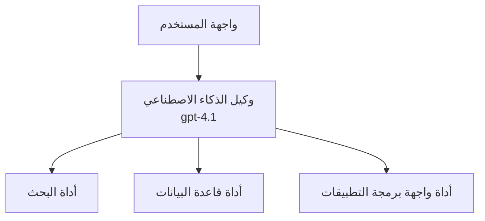
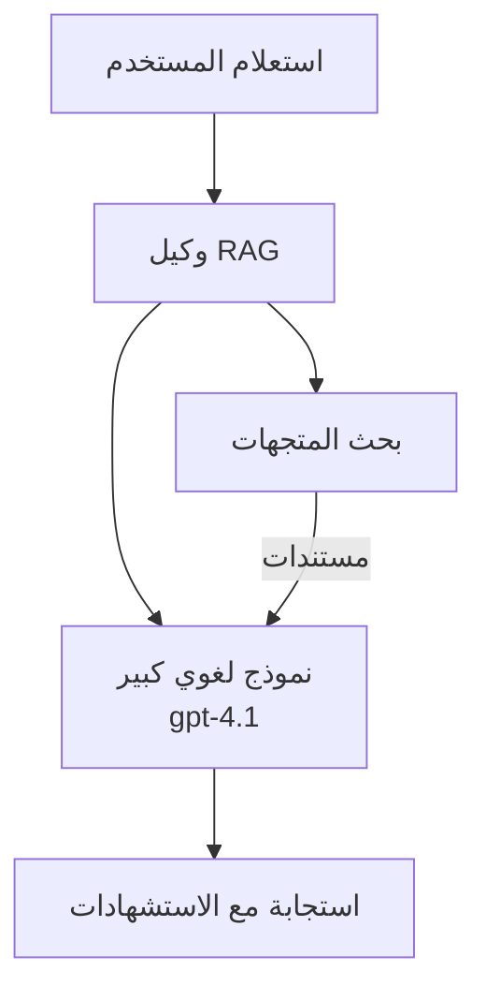
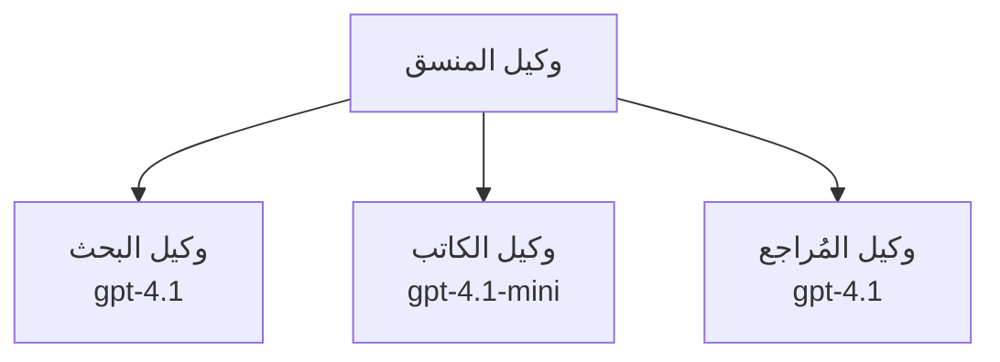

# وكلاء الذكاء الاصطناعي باستخدام Azure Developer CLI

**التنقل في الفصل:**
- **📚 الصفحة الرئيسية للدورة**: [AZD للمبتدئين](../../README.md)
- **📖 الفصل الحالي**: الفصل 2 - التطوير المرتكز على الذكاء الاصطناعي
- **⬅️ السابق**: [تكامل Microsoft Foundry](microsoft-foundry-integration.md)
- **➡️ التالي**: [نشر نموذج الذكاء الاصطناعي](ai-model-deployment.md)
- **🚀 متقدم**: [حلول متعددة الوكلاء](../../examples/retail-scenario.md)

---

## مقدمة

وكلاء الذكاء الاصطناعي هي برامج مستقلة يمكنها إدراك بيئتها، واتخاذ قرارات، واتخاذ إجراءات لتحقيق أهداف محددة. على عكس روبوتات الدردشة البسيطة التي تستجيب للمطالبات، يمكن للوكلاء:

- **استخدام الأدوات** - استدعاء واجهات برمجة التطبيقات، البحث في قواعد البيانات، تنفيذ الشيفرة
- **التخطيط والتفكير** - تقسيم المهام المعقدة إلى خطوات
- **التعلم من السياق** - الحفاظ على الذاكرة وتكييف السلوك
- **التعاون** - العمل مع وكلاء آخرين (أنظمة متعددة الوكلاء)

يوضح هذا الدليل كيفية نشر وكلاء الذكاء الاصطناعي إلى Azure باستخدام Azure Developer CLI (azd).

## أهداف التعلم

بإكمال هذا الدليل، ستتمكن من:
- فهم ماهية وكلاء الذكاء الاصطناعي وكيف يختلفون عن روبوتات الدردشة
- نشر قوالب وكلاء معدة مسبقًا باستخدام AZD
- تكوين وكلاء Foundry للوكلاء المخصصة
- تنفيذ أنماط وكيل أساسية (استخدام الأدوات، RAG، متعدد الوكلاء)
- مراقبة وتصحيح الوكلاء المنشورين

## مخرجات التعلم

عند الانتهاء، ستتمكن من:
- نشر تطبيقات وكلاء الذكاء الاصطناعي إلى Azure بأمر واحد
- تكوين أدوات الوكيل وقدراته
- تنفيذ التوليد المعزز بالاسترجاع (RAG) مع الوكلاء
- تصميم بنى أنظمة متعددة الوكلاء لتدفقات العمل المعقدة
- استكشاف مشكلات نشر الوكلاء الشائعة وإصلاحها

---

## 🤖 ما الذي يجعل الوكيل مختلفًا عن روبوت الدردشة؟

| الميزة | روبوت الدردشة | وكيل الذكاء الاصطناعي |
|---------|---------|----------|
| **السلوك** | يرد على المطالبات | يتخذ إجراءات بشكل مستقل |
| **الأدوات** | لا شيء | يمكنه استدعاء واجهات برمجة التطبيقات، البحث، تنفيذ الشيفرة |
| **الذاكرة** | تعتمد على الجلسة فقط | ذاكرة مستمرة عبر الجلسات |
| **التخطيط** | استجابة واحدة | تفكير متعدد الخطوات |
| **التعاون** | كيان واحد | يمكنه العمل مع وكلاء آخرين |

### تشبيه بسيط

- **روبوت الدردشة** = شخص مساعد يجيب على الأسئلة عند مكتب المعلومات
- **وكيل الذكاء الاصطناعي** = مساعد شخصي يمكنه إجراء المكالمات، حجز المواعيد، وإتمام المهام نيابة عنك

---

## 🚀 بدء سريع: انشر وكيلك الأول

### الخيار 1: قالب وكلاء Foundry (مُوصى به)

```bash
# تهيئة قالب وكلاء الذكاء الاصطناعي
azd init --template get-started-with-ai-agents

# نشر إلى أزور
azd up
```

**ما الذي يتم نشره:**
- ✅ وكلاء Foundry
- ✅ نماذج Microsoft Foundry (gpt-4.1)
- ✅ Azure AI Search (لـ RAG)
- ✅ Azure Container Apps (واجهة الويب)
- ✅ Application Insights (المراقبة)

**الوقت:** ~15-20 دقيقة
**التكلفة:** ~$100-150/شهريًا (للتطوير)

### الخيار 2: وكيل OpenAI باستخدام Prompty

```bash
# تهيئة قالب الوكيل المعتمد على Prompty
azd init --template agent-openai-python-prompty

# نشر إلى Azure
azd up
```

**ما الذي يتم نشره:**
- ✅ Azure Functions (تنفيذ الوكيل بدون خوادم)
- ✅ نماذج Microsoft Foundry
- ✅ ملفات تكوين Prompty
- ✅ تنفيذ وكيل نموذجي

**الوقت:** ~10-15 دقيقة
**التكلفة:** ~$50-100/شهريًا (للتطوير)

### الخيار 3: وكيل دردشة RAG

```bash
# تهيئة قالب دردشة RAG
azd init --template azure-search-openai-demo

# نشر إلى Azure
azd up
```

**ما الذي يتم نشره:**
- ✅ نماذج Microsoft Foundry
- ✅ Azure AI Search مع بيانات عينة
- ✅ خط أنابيب معالجة المستندات
- ✅ واجهة دردشة مع الاستشهادات

**الوقت:** ~15-25 دقيقة
**التكلفة:** ~$80-150/شهريًا (للتطوير)

### الخيار 4: تهيئة وكيل AZD AI (مبني على البيان التعريفي)

إذا كان لديك ملف البيان التعريفي للوكيل، يمكنك استخدام الأمر `azd ai` لتهيئة مشروع خدمة وكيل Foundry مباشرة:

```bash
# تثبيت امتداد وكلاء الذكاء الاصطناعي
azd extension install azure.ai.agents

# التهيئة من ملف مواصفات الوكيل
azd ai agent init -m agent-manifest.yaml

# نشر إلى أزور
azd up
```

**متى تستخدم `azd ai agent init` مقابل `azd init --template`:**

| النهج | الأفضل لـ | كيفية العمل |
|----------|----------|------|
| `azd init --template` | البدء من تطبيق عينة يعمل | يستنسخ مستودع قالب كامل يحتوي على الشيفرة + البنية التحتية |
| `azd ai agent init -m` | البناء من البيان التعريفي الخاص بوكيلك | يقوم بتهيئة بنية المشروع من تعريف الوكيل الخاص بك |

> **نصيحة:** استخدم `azd init --template` عند التعلم (الخيارات 1-3 أعلاه). استخدم `azd ai agent init` عند بناء وكلاء للإنتاج ببياناتك التعريفية الخاصة. راجع [أوامر AZD AI CLI](../chapter-08-production/production-ai-practices.md#azd-ai-cli-commands-and-extensions) للمرجع الكامل.

---

## 🏗️ أنماط بنية الوكيل

### النمط 1: وكيل واحد مع أدوات

أبسط نمط للوكيل - وكيل واحد يمكنه استخدام أدوات متعددة.


**الأفضل لـ:**
- بوتات دعم العملاء
- مساعدين بحثيين
- وكلاء تحليل البيانات

**قالب AZD:** `azure-search-openai-demo`

### النمط 2: وكيل RAG (التوليد المعزز بالاسترجاع)

وكيل يقوم باسترجاع المستندات ذات الصلة قبل توليد الردود.


**الأفضل لـ:**
- قواعد معرفة المؤسسات
- أنظمة الأسئلة والأجوبة للمستندات
- الامتثال والبحث القانوني

**قالب AZD:** `azure-search-openai-demo`

### النمط 3: نظام متعدد الوكلاء

عدة وكلاء متخصصين يعملون معًا على مهام معقدة.


**الأفضل لـ:**
- إنشاء محتوى معقد
- تدفقات عمل متعددة الخطوات
- المهام التي تتطلب خبرات مختلفة

**تعرف أكثر:** [أنماط تنسيق متعدد الوكلاء](../chapter-06-pre-deployment/coordination-patterns.md)

---

## ⚙️ تكوين أدوات الوكيل

تصبح الوكلاء قوية عندما يمكنهم استخدام الأدوات. فيما يلي كيفية تكوين الأدوات الشائعة:

### تكوين الأدوات في وكلاء Foundry

```python
# agent_config.py
from azure.ai.projects import AIProjectClient
from azure.ai.projects.models import FunctionTool, CodeInterpreterTool

# تعريف أدوات مخصصة
search_tool = FunctionTool(
    name="search_knowledge_base",
    description="Search the company knowledge base for relevant documents",
    parameters={
        "type": "object",
        "properties": {
            "query": {
                "type": "string",
                "description": "The search query"
            }
        },
        "required": ["query"]
    }
)

# إنشاء وكيل باستخدام الأدوات
agent = project_client.agents.create_agent(
    model="gpt-4.1",
    name="Support Agent",
    instructions="You are a helpful support agent. Use the search tool to find relevant information.",
    tools=[search_tool, CodeInterpreterTool()]
)
```

### تكوين البيئة

```bash
# إعداد متغيرات البيئة الخاصة بالوكيل
azd env set AZURE_OPENAI_MODEL "gpt-4.1"
azd env set AGENT_INSTRUCTIONS "You are a helpful assistant..."
azd env set ENABLE_CODE_INTERPRETER "true"
azd env set ENABLE_FILE_SEARCH "true"

# نشر باستخدام التكوين المحدث
azd deploy
```

---

## 📊 مراقبة الوكلاء

### تكامل Application Insights

تتضمن جميع قوالب وكلاء AZD Application Insights للمراقبة:

```bash
# فتح لوحة المراقبة
azd monitor --overview

# عرض السجلات الحية
azd monitor --logs

# عرض المقاييس الحية
azd monitor --live
```

### المقاييس الرئيسية التي يجب تتبعها

| المقياس | الوصف | الهدف |
|--------|-------------|--------|
| زمن الاستجابة | الوقت اللازم لتوليد الاستجابة | < 5 ثوانٍ |
| استخدام التوكينات | التوكينات لكل طلب | راقب للتكلفة |
| معدل نجاح استدعاء الأدوات | % من تنفيذات الأدوات الناجحة | > 95% |
| معدل الأخطاء | الطلبات الفاشلة للوكيل | < 1% |
| رضا المستخدم | درجات الملاحظات | > 4.0/5.0 |

### التسجيل المخصص للوكلاء

```python
import os
from azure.monitor.opentelemetry import configure_azure_monitor
from opentelemetry import trace

# تكوين Azure Monitor باستخدام OpenTelemetry
configure_azure_monitor(
    connection_string=os.environ["APPLICATIONINSIGHTS_CONNECTION_STRING"]
)

tracer = trace.get_tracer(__name__)

def log_agent_interaction(user_query, agent_response, tools_used, latency_ms):
    with tracer.start_as_current_span("agent_interaction") as span:
        span.set_attributes({
            "user_query": user_query,
            "response_length": len(agent_response),
            "tools_used": tools_used,
            "latency_ms": latency_ms
        })
```

> **ملاحظة:** ثبّت الحزم المطلوبة: `pip install azure-monitor-opentelemetry opentelemetry`

---

## 💰 اعتبارات التكلفة

### التكاليف الشهرية المقدرة حسب النمط

| النمط | بيئة التطوير | الإنتاج |
|---------|-----------------|------------|
| وكيل واحد | $50-100 | $200-500 |
| وكيل RAG | $80-150 | $300-800 |
| متعدد الوكلاء (2-3 وكلاء) | $150-300 | $500-1,500 |
| متعدد الوكلاء للمؤسسات | $300-500 | $1,500-5,000+ |

### نصائح تحسين التكلفة

1. **استخدم gpt-4.1-mini للمهام البسيطة**
   ```bash
   azd env set AZURE_OPENAI_MODEL "gpt-4.1-mini"
   ```

2. **نفّذ التخزين المؤقت للاستعلامات المتكررة**
   ```python
   from functools import lru_cache
   
   @lru_cache(maxsize=1000)
   def get_cached_response(query_hash):
       return agent.run(query_hash)
   ```

3. **حدد حدود التوكينات لكل تشغيل**
   ```python
   # اضبط max_completion_tokens عند تشغيل الوكيل، ليس أثناء إنشائه
   run = project_client.agents.create_run(
       thread_id=thread.id,
       agent_id=agent.id,
       max_completion_tokens=1000  # حد من طول الاستجابة
   )
   ```

4. **قُم بالتحجيم إلى الصفر عندما لا تكون قيد الاستخدام**
   ```bash
   # تقوم تطبيقات الحاويات بالتحجيم تلقائيًا إلى الصفر
   azd env set MIN_REPLICAS "0"
   ```

---

## 🔧 استكشاف أخطاء الوكلاء وإصلاحها

### المشكلات الشائعة والحلول

<details>
<summary><strong>❌ الوكيل لا يستجيب لاستدعاءات الأدوات</strong></summary>

```bash
# تحقق مما إذا كانت الأدوات مسجلة بشكل صحيح
azd show

# تحقق من نشر OpenAI
az cognitiveservices account deployment list \
  --name $AZURE_OPENAI_NAME \
  --resource-group $RG_NAME

# تحقق من سجلات الوكيل
azd monitor --logs
```

**الأسباب الشائعة:**
- عدم تطابق توقيع دالة الأداة
- نقص الأذونات المطلوبة
- نقطة نهاية API غير متاحة
</details>

<details>
<summary><strong>❌ زمن استجابة مرتفع في ردود الوكيل</strong></summary>

```bash
# تحقق من Application Insights لمعرفة نقاط الاختناق
azd monitor --live

# فكر في استخدام نموذج أسرع
azd env set AZURE_OPENAI_MODEL "gpt-4.1-mini"
azd deploy
```

**نصائح التحسين:**
- استخدم الاستجابات المتدفقة
- نفّذ التخزين المؤقت للاستجابات
- قلل حجم نافذة السياق
</details>

<details>
<summary><strong>❌ الوكيل يعيد معلومات غير صحيحة أو هلوسات</strong></summary>

```python
# التحسين باستخدام مطالبات نظام أفضل
instructions = """
You are a helpful assistant. IMPORTANT:
- Only answer based on provided context
- If you don't know, say "I don't know"
- Always cite your sources
- Never make up information
"""

# أضف استرجاعًا للتأصيل
agent = project_client.agents.create_agent(
    model="gpt-4.1",
    instructions=instructions,
    tools=[FileSearchTool()]  # اربط الردود بالمستندات
)
```
</details>

<details>
<summary><strong>❌ أخطاء تجاوز حد التوكينات</strong></summary>

```python
# تنفيذ إدارة نافذة السياق
def truncate_context(messages, max_tokens=8000, model="gpt-4.1"):
    """Keep only recent messages within token limit."""
    import tiktoken
    encoding = tiktoken.encoding_for_model(model)
    total_tokens = 0
    truncated = []
    
    for msg in reversed(messages):
        msg_tokens = len(encoding.encode(msg.content))
        if total_tokens + msg_tokens > max_tokens:
            break
        truncated.insert(0, msg)
        total_tokens += msg_tokens
    
    return truncated
```
</details>

---

## 🎓 تمارين عملية

### التمرين 1: نشر وكيل أساسي (20 دقيقة)

**الهدف:** نشر وكيل الذكاء الاصطناعي الأول باستخدام AZD

```bash
# الخطوة 1: تهيئة القالب
azd init --template get-started-with-ai-agents

# الخطوة 2: تسجيل الدخول إلى Azure
azd auth login

# الخطوة 3: النشر
azd up

# الخطوة 4: اختبار الوكيل
# الإخراج المتوقع بعد النشر:
#   اكتمل النشر!
#   نقطة النهاية: https://<app-name>.<region>.azurecontainerapps.io
# افتح عنوان URL المعروض في الإخراج وحاول طرح سؤال

# الخطوة 5: عرض المراقبة
azd monitor --overview

# الخطوة 6: تنظيف الموارد
azd down --force --purge
```

**معايير النجاح:**
- [ ] يرد الوكيل على الأسئلة
- [ ] يمكن الوصول إلى لوحة المراقبة عبر `azd monitor`
- [ ] تم تنظيف الموارد بنجاح

### التمرين 2: إضافة أداة مخصصة (30 دقيقة)

**الهدف:** توسيع الوكيل بأداة مخصصة

1. نشر قالب الوكيل:
   ```bash
   azd init --template get-started-with-ai-agents
   azd up
   ```
2. أنشئ دالة أداة جديدة في شيفرة الوكيل الخاص بك:
   ```python
   def get_weather(location: str) -> str:
       """Get current weather for a location."""
       # استدعاء واجهة برمجة التطبيقات لخدمة الطقس
       return f"Weather in {location}: Sunny, 72°F"
   ```
3. سجّل الأداة مع الوكيل:
   ```python
   from azure.ai.projects.models import FunctionTool

   weather_tool = FunctionTool(
       name="get_weather",
       description="Get current weather for a location",
       parameters={
           "type": "object",
           "properties": {
               "location": {"type": "string", "description": "City name"}
           },
           "required": ["location"]
       }
   )

   agent = project_client.agents.create_agent(
       model="gpt-4.1",
       name="Weather Agent",
       tools=[weather_tool]
   )
   ```
4. أعد النشر والاختبار:
   ```bash
   azd deploy
   # اسأل: "ما هو الطقس في سياتل؟"
   # المتوقع: أن يستدعي الوكيل get_weather("Seattle") ويعيد معلومات الطقس
   ```

**معايير النجاح:**
- [ ] يتعرف الوكيل على استفسارات متعلقة بالطقس
- [ ] يتم استدعاء الأداة بشكل صحيح
- [ ] تتضمن الاستجابة معلومات الطقس

### التمرين 3: بناء وكيل RAG (45 دقيقة)

**الهدف:** إنشاء وكيل يجيب عن الأسئلة من مستنداتك

```bash
# الخطوة 1: نشر قالب RAG
azd init --template azure-search-openai-demo
azd up

# الخطوة 2: قم بتحميل مستنداتك
# ضع ملفات PDF/TXT في مجلد data/، ثم شغّل:
python scripts/prepdocs.py

# الخطوة 3: اختبر بأسئلة خاصة بالمجال
# افتح رابط تطبيق الويب من مخرجات azd up
# اطرح أسئلة حول مستنداتك المرفوعة
# يجب أن تتضمن الردود مراجع استشهاد مثل [doc.pdf]
```

**معايير النجاح:**
- [ ] يجيب الوكيل من المستندات المرفوعة
- [ ] تتضمن الردود استشهادات
- [ ] لا حدوث هلوسة في الأسئلة خارج النطاق

---

## 📚 الخطوات التالية

الآن بعد أن فهمت وكلاء الذكاء الاصطناعي، استكشف هذه الموضوعات المتقدمة:

| الموضوع | الوصف | الرابط |
|-------|-------------|------|
| **أنظمة متعددة الوكلاء** | بناء أنظمة تحتوي على وكلاء متعاونين متعددين | [مثال متعدد الوكلاء لتجزئة](../../examples/retail-scenario.md) |
| **أنماط التنسيق** | تعلم أنماط الأوركسترا والتواصل | [أنماط التنسيق](../chapter-06-pre-deployment/coordination-patterns.md) |
| **نشر للإنتاج** | نشر وكلاء جاهزين للمؤسسات | [ممارسات AI للإنتاج](../chapter-08-production/production-ai-practices.md) |
| **تقييم الوكلاء** | اختبار وتقييم أداء الوكلاء | [استكشاف أخطاء AI وإصلاحها](../chapter-07-troubleshooting/ai-troubleshooting.md) |
| **مختبر ورشة عمل AI** | عملي: اجعل حلك الذكي جاهزًا لـ AZD | [مختبر ورشة عمل AI](ai-workshop-lab.md) |

---

## 📖 مصادر إضافية

### التوثيق الرسمي
- [خدمة وكلاء Azure AI](https://learn.microsoft.com/azure/ai-services/agents/)
- [بدء سريع لخدمة وكلاء Microsoft Foundry](https://learn.microsoft.com/azure/ai-services/agents/quickstart)
- [إطار عمل Semantic Kernel Agent](https://learn.microsoft.com/semantic-kernel/)

### قوالب AZD للوكلاء
- [البدء مع وكلاء AI](https://github.com/Azure-Samples/get-started-with-ai-agents)
- [وكيل OpenAI Python Prompty](https://github.com/Azure-Samples/agent-openai-python-prompty)
- [عرض Azure Search OpenAI](https://github.com/Azure-Samples/azure-search-openai-demo)

### مصادر المجتمع
- [Awesome AZD - قوالب الوكلاء](https://azure.github.io/awesome-azd/?tags=ai-agents)
- [Discord Azure AI](https://discord.gg/microsoft-azure)
- [Discord Microsoft Foundry](https://discord.gg/nTYy5BXMWG)

### مهارات الوكلاء لمحررك
- [**مهارات وكيل Microsoft Azure**](https://skills.sh/microsoft/github-copilot-for-azure) - ثبّت مهارات وكيل الذكاء الاصطناعي القابلة لإعادة الاستخدام لتطوير Azure في GitHub Copilot أو Cursor أو أي وكيل مدعوم. تتضمن مهارات لـ [خدمة Azure AI](https://skills.sh/microsoft/github-copilot-for-azure/azure-ai)، [Microsoft Foundry](https://skills.sh/microsoft/github-copilot-for-azure/microsoft-foundry)، [النشر](https://skills.sh/microsoft/github-copilot-for-azure/azure-deploy)، و[التشخيصات](https://skills.sh/microsoft/github-copilot-for-azure/azure-diagnostics):
  ```bash
  npx skills add microsoft/github-copilot-for-azure
  ```

---

**التنقل**
- **الدرس السابق**: [تكامل Microsoft Foundry](microsoft-foundry-integration.md)
- **الدرس التالي**: [نشر نموذج الذكاء الاصطناعي](ai-model-deployment.md)

---

<!-- CO-OP TRANSLATOR DISCLAIMER START -->
إخلاء المسؤولية:
تمت ترجمة هذا المستند باستخدام خدمة الترجمة الآلية [Co-op Translator](https://github.com/Azure/co-op-translator). بينما نسعى إلى تحقيق الدقة، يُرجى ملاحظة أن الترجمات الآلية قد تحتوي على أخطاء أو عدم دقة. يجب اعتبار المستند الأصلي بلغته الأصلية المصدر المعتمد. للمعلومات الحرجة، يُنصح بالاستعانة بترجمة بشرية محترفة. نحن غير مسؤولين عن أي سوء فهم أو تفسير خاطئ ينشأ عن استخدام هذه الترجمة.
<!-- CO-OP TRANSLATOR DISCLAIMER END -->