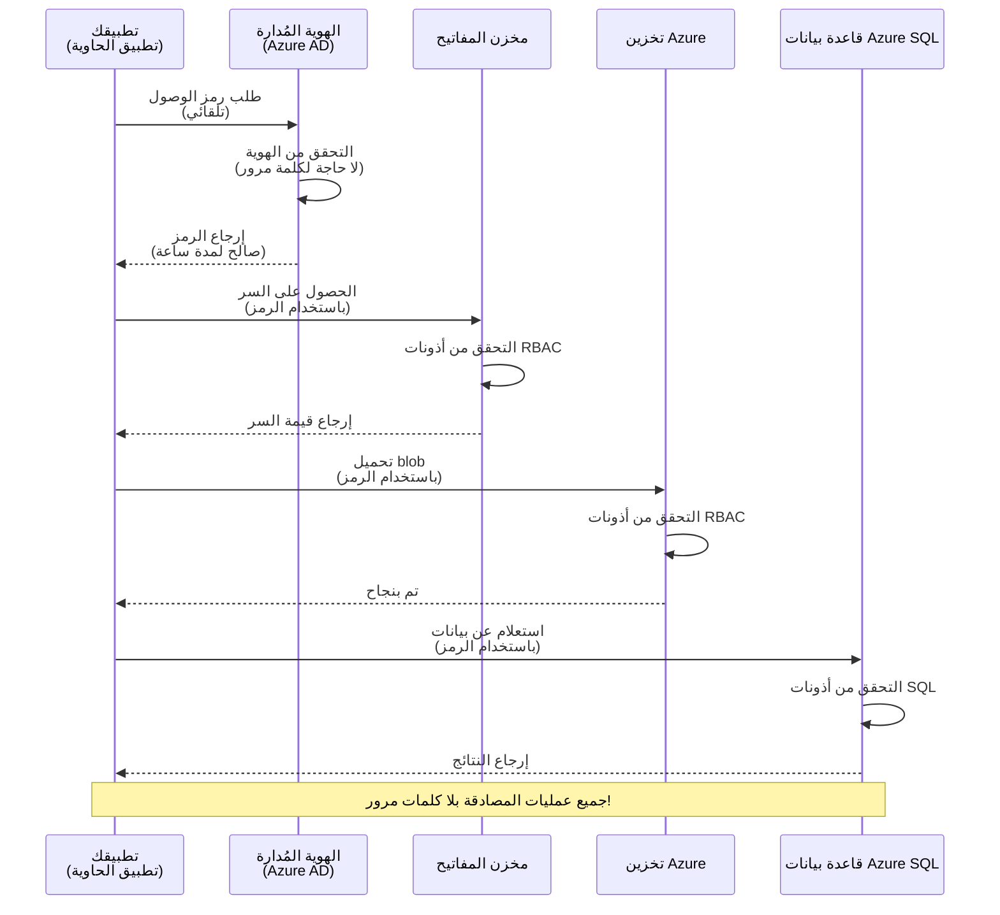
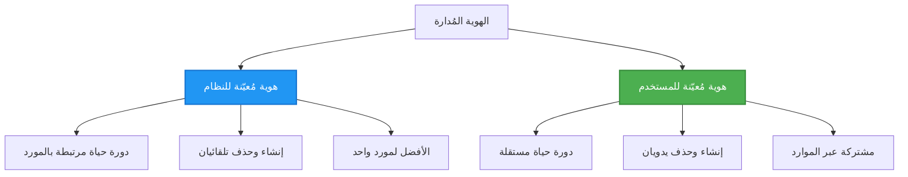

# أنماط المصادقة والهوية المُدارة

⏱️ **الوقت المقدر**: 45-60 دقيقة | 💰 **تأثير التكلفة**: مجاني (بدون رسوم إضافية) | ⭐ **التعقيد**: متوسط

**📚 مسار التعلم:**
- ← السابق: [Configuration Management](configuration.md) - إدارة متغيرات البيئة والأسرار
- 🎯 **أنت هنا**: المصادقة والأمان (الهوية المُدارة, Key Vault, أنماط آمنة)
- → التالي: [First Project](first-project.md) - بناء تطبيق AZD الأول
- 🏠 [الصفحة الرئيسية للدورة](../../README.md)

---

## ما ستتعلمه

من خلال إكمال هذا الدرس، ستتمكن من:
- فهم أنماط المصادقة في Azure (المفاتيح، سلاسل الاتصال، الهوية المُدارة)
- تنفيذ **الهوية المُدارة** للمصادقة بدون كلمات مرور
- تأمين الأسرار عبر تكامل **Azure Key Vault**
- تكوين **التحكم في الوصول المعتمد على الدور (RBAC)** لنشر AZD
- تطبيق أفضل ممارسات الأمان في Container Apps وخدمات Azure
- الانتقال من المصادقة المعتمدة على المفاتيح إلى المصادقة المعتمدة على الهوية

## لماذا تهم الهوية المُدارة

### المشكلة: المصادقة التقليدية

**قبل الهوية المُدارة:**
```javascript
// ❌ خطر أمني: أسرار مضمّنة في الشيفرة
const connectionString = "Server=mydb.database.windows.net;User=admin;Password=P@ssw0rd123";
const storageKey = "xK7mN9pQ2wR5tY8uI0oP3aS6dF1gH4jK...";
const cosmosKey = "C2x7B9n4M1p8Q5w3E6r0T2y5U8i1O4p7...";
```

**المشكلات:**
- 🔴 **الأسرار المكشوفة** في الشيفرة، ملفات التهيئة، متغيرات البيئة
- 🔴 **تدوير بيانات الاعتماد** يتطلب تغييرات في الشيفرة وإعادة النشر
- 🔴 **كابوس التدقيق** - من الذي وصل إلى ماذا ومتى؟
- 🔴 **انتشار** - الأسرار متناثرة عبر أنظمة متعددة
- 🔴 **مخاطر الامتثال** - يفشل في اختبارات الأمان

### الحل: الهوية المُدارة

**بعد الهوية المُدارة:**
```javascript
// ✅ آمن: لا أسرار في الشيفرة
const credential = new DefaultAzureCredential();
const client = new BlobServiceClient(
  "https://mystorageaccount.blob.core.windows.net",
  credential  // تتولى أزور المصادقة تلقائيًا
);
```

**الفوائد:**
- ✅ **لا أسرار** في الشيفرة أو التهيئة
- ✅ **تدوير تلقائي** - Azure يتولى ذلك
- ✅ **سجل تدقيق كامل** في سجلات Azure AD
- ✅ **أمان مركزي** - الإدارة عبر بوابة Azure
- ✅ **جاهز للامتثال** - يفي بمعايير الأمان

**تشبيه**: المصادقة التقليدية تشبه حمل مفاتيح مادية متعددة لأبواب مختلفة. الهوية المُدارة تشبه وجود شارة أمان تمنح الوصول تلقائيًا بناءً على هويتك—لا مفاتيح لتفقدها أو نسخها أو تدويرها.

---

## نظرة عامة على البنية

### تدفق المصادقة بالهوية المُدارة


### أنواع الهويات المُدارة


| الميزة | مُعينة للنظام | مُعينة للمستخدم |
|---------|----------------|---------------|
| **دورة الحياة** | مرتبطة بالمورد | مستقلة |
| **الإنشاء** | تلقائيًا مع المورد | إنشاء يدوي |
| **الحذف** | يُحذف مع المورد | تستمر بعد حذف المورد |
| **المشاركة** | مورد واحد فقط | عدة موارد |
| **حالة الاستخدام** | سيناريوهات بسيطة | سيناريوهات معقدة متعددة الموارد |
| **إعداد افتراضي في AZD** | ✅ موصى به | اختياري |

---

## المتطلبات المسبقة

### الأدوات المطلوبة

يجب أن تكون قد قمت بتثبيت ما يلي من الدروس السابقة:

```bash
# تحقق من Azure Developer CLI
azd version
# ✅ المتوقع: إصدار azd 1.0.0 أو أعلى

# تحقق من Azure CLI
az --version
# ✅ المتوقع: إصدار azure-cli 2.50.0 أو أعلى
```

### متطلبات Azure

- اشتراك Azure نشط
- أذونات لـ:
  - إنشاء هويات مُدارة
  - تعيين أدوار RBAC
  - إنشاء موارد Key Vault
  - نشر Container Apps

### المتطلبات المعرفية

يجب أن تكون قد أكملت:
- [Installation Guide](installation.md) - إعداد AZD
- [AZD Basics](azd-basics.md) - المفاهيم الأساسية
- [Configuration Management](configuration.md) - متغيرات البيئة

---

## الدرس 1: فهم أنماط المصادقة

### النمط 1: سلاسل الاتصال (قديم - تجنب)

**كيف يعمل:**
```bash
# سلسلة الاتصال تحتوي على بيانات الاعتماد
STORAGE_CONNECTION_STRING="DefaultEndpointsProtocol=https;AccountName=myaccount;AccountKey=xK7mN9pQ2wR5..."
COSMOS_CONNECTION_STRING="AccountEndpoint=https://myaccount.documents.azure.com:443/;AccountKey=C2x7..."
SQL_CONNECTION_STRING="Server=myserver.database.windows.net;User=admin;Password=P@ssw0rd..."
```

**المشكلات:**
- ❌ الأسرار مرئية في متغيرات البيئة
- ❌ يتم تسجيلها في أنظمة النشر
- ❌ صعبة التدوير
- ❌ لا يوجد سجل تدقيق للوصول

**متى تُستخدم:** فقط للتطوير المحلي، لا تستخدم في بيئة الإنتاج أبدًا.

---

### النمط 2: مراجع Key Vault (أفضل)

**كيف يعمل:**
```bicep
// Store secret in Key Vault
resource keyVault 'Microsoft.KeyVault/vaults@2023-02-01' = {
  name: 'mykv'
  properties: {
    enableRbacAuthorization: true
  }
}

// Reference in Container App
env: [
  {
    name: 'STORAGE_KEY'
    secretRef: 'storage-key'  // References Key Vault
  }
]
```

**الفوائد:**
- ✅ التخزين الآمن للأسرار في Key Vault
- ✅ إدارة مركزية للأسرار
- ✅ التدوير دون تغييرات في الشيفرة

**القيود:**
- ⚠️ لا يزال يستخدم مفاتيح/كلمات مرور
- ⚠️ الحاجة لإدارة وصول Key Vault

**متى تُستخدم:** خطوة انتقال من سلاسل الاتصال إلى الهوية المُدارة.

---

### النمط 3: الهوية المُدارة (أفضل ممارسة)

**كيف يعمل:**
```bicep
// Enable managed identity
resource containerApp 'Microsoft.App/containerApps@2023-05-01' = {
  name: 'myapp'
  identity: {
    type: 'SystemAssigned'  // Automatically creates identity
  }
}

// Grant permissions
resource roleAssignment 'Microsoft.Authorization/roleAssignments@2022-04-01' = {
  scope: storageAccount
  properties: {
    roleDefinitionId: storageBlobDataContributorRole
    principalId: containerApp.identity.principalId
  }
}
```

**شيفرة التطبيق:**
```javascript
// لا حاجة إلى أسرار!
const { DefaultAzureCredential } = require('@azure/identity');
const { BlobServiceClient } = require('@azure/storage-blob');

const credential = new DefaultAzureCredential();
const blobServiceClient = new BlobServiceClient(
  'https://mystorageaccount.blob.core.windows.net',
  credential
);
```

**الفوائد:**
- ✅ لا أسرار في الشيفرة/التهيئة
- ✅ تدوير بيانات الاعتماد تلقائيًا
- ✅ سجل تدقيق كامل
- ✅ أذونات معتمدة على RBAC
- ✅ جاهز للامتثال

**متى تُستخدم:** دائمًا، لتطبيقات الإنتاج.

---

## الدرس 2: تنفيذ الهوية المُدارة باستخدام AZD

### تنفيذ خطوة بخطوة

لنبنِ تطبيق Container App آمن يستخدم الهوية المُدارة للوصول إلى Azure Storage و Key Vault.

### هيكل المشروع

```
secure-app/
├── azure.yaml                 # AZD configuration
├── infra/
│   ├── main.bicep            # Main infrastructure
│   ├── core/
│   │   ├── identity.bicep    # Managed identity setup
│   │   ├── keyvault.bicep    # Key Vault configuration
│   │   └── storage.bicep     # Storage with RBAC
│   └── app/
│       └── container-app.bicep
└── src/
    ├── app.js                # Application code
    ├── package.json
    └── Dockerfile
```

### 1. تكوين AZD (azure.yaml)

```yaml
name: secure-app
metadata:
  template: secure-app@1.0.0

services:
  api:
    project: ./src
    language: js
    host: containerapp

# Enable managed identity (AZD handles this automatically)
```

### 2. البنية التحتية: تفعيل الهوية المُدارة

**الملف: `infra/main.bicep`**

```bicep
targetScope = 'subscription'

param environmentName string
param location string = 'eastus'

var tags = { 'azd-env-name': environmentName }

// Resource group
resource rg 'Microsoft.Resources/resourceGroups@2021-04-01' = {
  name: 'rg-${environmentName}'
  location: location
  tags: tags
}

// Storage Account
module storage './core/storage.bicep' = {
  name: 'storage'
  scope: rg
  params: {
    name: 'st${uniqueString(rg.id)}'
    location: location
    tags: tags
  }
}

// Key Vault
module keyVault './core/keyvault.bicep' = {
  name: 'keyvault'
  scope: rg
  params: {
    name: 'kv-${uniqueString(rg.id)}'
    location: location
    tags: tags
  }
}

// Container App with Managed Identity
module containerApp './app/container-app.bicep' = {
  name: 'container-app'
  scope: rg
  params: {
    name: 'ca-${environmentName}'
    location: location
    tags: tags
    storageAccountName: storage.outputs.name
    keyVaultName: keyVault.outputs.name
  }
}

// Grant Container App access to Storage
module storageRoleAssignment './core/role-assignment.bicep' = {
  name: 'storage-role'
  scope: rg
  params: {
    principalId: containerApp.outputs.identityPrincipalId
    roleDefinitionId: 'ba92f5b4-2d11-453d-a403-e96b0029c9fe'  // Storage Blob Data Contributor
    targetResourceId: storage.outputs.id
  }
}

// Grant Container App access to Key Vault
module kvRoleAssignment './core/role-assignment.bicep' = {
  name: 'kv-role'
  scope: rg
  params: {
    principalId: containerApp.outputs.identityPrincipalId
    roleDefinitionId: '4633458b-17de-408a-b874-0445c86b69e6'  // Key Vault Secrets User
    targetResourceId: keyVault.outputs.id
  }
}

// Outputs
output AZURE_STORAGE_ACCOUNT_NAME string = storage.outputs.name
output AZURE_KEY_VAULT_NAME string = keyVault.outputs.name
output APP_URL string = containerApp.outputs.url
```

### 3. تطبيق Container App بهوية مُعينة للنظام

**الملف: `infra/app/container-app.bicep`**

```bicep
param name string
param location string
param tags object = {}
param storageAccountName string
param keyVaultName string

resource containerApp 'Microsoft.App/containerApps@2023-05-01' = {
  name: name
  location: location
  tags: tags
  identity: {
    type: 'SystemAssigned'  // 🔑 Enable managed identity
  }
  properties: {
    configuration: {
      ingress: {
        external: true
        targetPort: 3000
      }
    }
    template: {
      containers: [
        {
          name: 'api'
          image: 'myregistry.azurecr.io/api:latest'
          resources: {
            cpu: json('0.5')
            memory: '1Gi'
          }
          env: [
            {
              name: 'AZURE_STORAGE_ACCOUNT_NAME'
              value: storageAccountName
            }
            {
              name: 'AZURE_KEY_VAULT_NAME'
              value: keyVaultName
            }
            // 🔑 No secrets - managed identity handles authentication!
          ]
        }
      ]
    }
  }
}

// Output the identity for RBAC assignments
output identityPrincipalId string = containerApp.identity.principalId
output id string = containerApp.id
output url string = 'https://${containerApp.properties.configuration.ingress.fqdn}'
```

### 4. وحدة تعيين أدوار RBAC

**الملف: `infra/core/role-assignment.bicep`**

```bicep
param principalId string
param roleDefinitionId string  // Azure built-in role ID
param targetResourceId string

resource roleAssignment 'Microsoft.Authorization/roleAssignments@2022-04-01' = {
  name: guid(principalId, roleDefinitionId, targetResourceId)
  scope: resourceId('Microsoft.Resources/resourceGroups', resourceGroup().name)
  properties: {
    roleDefinitionId: subscriptionResourceId('Microsoft.Authorization/roleDefinitions', roleDefinitionId)
    principalId: principalId
    principalType: 'ServicePrincipal'
  }
}

output id string = roleAssignment.id
```

### 5. شيفرة التطبيق بالهوية المُدارة

**الملف: `src/app.js`**

```javascript
const express = require('express');
const { DefaultAzureCredential } = require('@azure/identity');
const { BlobServiceClient } = require('@azure/storage-blob');
const { SecretClient } = require('@azure/keyvault-secrets');

const app = express();
const PORT = process.env.PORT || 3000;

// 🔑 تهيئة بيانات الاعتماد (تعمل تلقائيًا مع الهوية المدارية)
const credential = new DefaultAzureCredential();

// إعداد تخزين Azure
const storageAccountName = process.env.AZURE_STORAGE_ACCOUNT_NAME;
const blobServiceClient = new BlobServiceClient(
  `https://${storageAccountName}.blob.core.windows.net`,
  credential  // لا حاجة إلى مفاتيح!
);

// إعداد مخزن المفاتيح
const keyVaultName = process.env.AZURE_KEY_VAULT_NAME;
const secretClient = new SecretClient(
  `https://${keyVaultName}.vault.azure.net`,
  credential  // لا حاجة إلى مفاتيح!
);

// فحص الصحة
app.get('/health', (req, res) => {
  res.json({ status: 'healthy', authentication: 'managed-identity' });
});

// رفع ملف إلى تخزين Blob
app.post('/upload', async (req, res) => {
  try {
    const containerClient = blobServiceClient.getContainerClient('uploads');
    await containerClient.createIfNotExists();
    
    const blobName = `file-${Date.now()}.txt`;
    const blockBlobClient = containerClient.getBlockBlobClient(blobName);
    
    await blockBlobClient.upload('Hello from managed identity!', 30);
    
    res.json({
      success: true,
      blobName: blobName,
      message: 'File uploaded using managed identity!'
    });
  } catch (error) {
    console.error('Upload error:', error);
    res.status(500).json({ error: error.message });
  }
});

// الحصول على السر من مخزن المفاتيح
app.get('/secret/:name', async (req, res) => {
  try {
    const secretName = req.params.name;
    const secret = await secretClient.getSecret(secretName);
    
    res.json({
      name: secretName,
      value: secret.value,
      message: 'Secret retrieved using managed identity!'
    });
  } catch (error) {
    console.error('Secret error:', error);
    res.status(500).json({ error: error.message });
  }
});

// سرد حاويات Blob (يوضح إمكانية الوصول للقراءة)
app.get('/containers', async (req, res) => {
  try {
    const containers = [];
    for await (const container of blobServiceClient.listContainers()) {
      containers.push(container.name);
    }
    
    res.json({
      containers: containers,
      count: containers.length,
      message: 'Containers listed using managed identity!'
    });
  } catch (error) {
    console.error('List error:', error);
    res.status(500).json({ error: error.message });
  }
});

app.listen(PORT, () => {
  console.log(`Secure API listening on port ${PORT}`);
  console.log('Authentication: Managed Identity (passwordless)');
});
```

**الملف: `src/package.json`**

```json
{
  "name": "secure-app",
  "version": "1.0.0",
  "dependencies": {
    "express": "^4.18.2",
    "@azure/identity": "^4.0.0",
    "@azure/storage-blob": "^12.17.0",
    "@azure/keyvault-secrets": "^4.7.0"
  },
  "scripts": {
    "start": "node app.js"
  }
}
```

### 6. النشر والاختبار

```bash
# تهيئة بيئة AZD
azd init

# نشر البنية التحتية والتطبيق
azd up

# الحصول على عنوان URL للتطبيق
APP_URL=$(azd env get-values | grep APP_URL | cut -d '=' -f2 | tr -d '"')

# اختبار فحص الصحة
curl $APP_URL/health
```

**✅ المخرجات المتوقعة:**
```json
{
  "status": "healthy",
  "authentication": "managed-identity"
}
```

**اختبار رفع blob:**
```bash
curl -X POST $APP_URL/upload
```

**✅ المخرجات المتوقعة:**
```json
{
  "success": true,
  "blobName": "file-1700404800000.txt",
  "message": "File uploaded using managed identity!"
}
```

**اختبار قائمة الحاويات:**
```bash
curl $APP_URL/containers
```

**✅ المخرجات المتوقعة:**
```json
{
  "containers": ["uploads"],
  "count": 1,
  "message": "Containers listed using managed identity!"
}
```

---

## أدوار RBAC الشائعة في Azure

### معرفات الأدوار المضمنة للهوية المُدارة

| الخدمة | اسم الدور | معرّف الدور | الأذونات |
|---------|-----------|---------|-------------|
| **Storage** | Storage Blob Data Reader | `2a2b9908-6b94-4a3d-8e5a-a7d8f8cc8a12` | قراءة blobs والحاويات |
| **Storage** | Storage Blob Data Contributor | `ba92f5b4-2d11-453d-a403-e96b0029c9fe` | قراءة، كتابة، حذف الـ blobs |
| **Storage** | Storage Queue Data Contributor | `974c5e8b-45b9-4653-ba55-5f855dd0fb88` | قراءة، كتابة، حذف رسائل الطابور |
| **Key Vault** | Key Vault Secrets User | `4633458b-17de-408a-b874-0445c86b69e6` | قراءة الأسرار |
| **Key Vault** | Key Vault Secrets Officer | `b86a8fe4-44ce-4948-aee5-eccb2c155cd7` | قراءة، كتابة، حذف الأسرار |
| **Cosmos DB** | Cosmos DB Built-in Data Reader | `00000000-0000-0000-0000-000000000001` | قراءة بيانات Cosmos DB |
| **Cosmos DB** | Cosmos DB Built-in Data Contributor | `00000000-0000-0000-0000-000000000002` | قراءة، كتابة بيانات Cosmos DB |
| **SQL Database** | SQL DB Contributor | `9b7fa17d-e63e-47b0-bb0a-15c516ac86ec` | إدارة قواعد بيانات SQL |
| **Service Bus** | Azure Service Bus Data Owner | `090c5cfd-751d-490a-894a-3ce6f1109419` | إرسال، استقبال، إدارة الرسائل |

### كيفية العثور على معرفات الأدوار

```bash
# جميع الأدوار المضمنة
az role definition list --query "[].{Name:roleName, ID:name}" --output table

# البحث عن دور محدد
az role definition list --query "[?contains(roleName, 'Storage Blob')].{Name:roleName, ID:name}" --output table

# الحصول على تفاصيل الدور
az role definition list --name "Storage Blob Data Contributor"
```

---

## تمارين عملية

### التمرين 1: تفعيل الهوية المُدارة لتطبيق موجود ⭐⭐ (متوسط)

**الهدف**: إضافة هوية مُدارة لنشر تطبيق Container App موجود

**السيناريو**: لديك تطبيق Container App يستخدم سلاسل الاتصال. قم بتحويله إلى الهوية المُدارة.

**نقطة البداية**: تطبيق Container App بهذا التكوين:

```bicep
// ❌ Current: Using connection string
env: [
  {
    name: 'STORAGE_CONNECTION_STRING'
    secretRef: 'storage-connection'
  }
]
```

**الخطوات**:

1. **تفعيل الهوية المُدارة في Bicep:**

```bicep
resource containerApp 'Microsoft.App/containerApps@2023-05-01' = {
  name: 'myapp'
  identity: {
    type: 'SystemAssigned'  // Add this
  }
  // ... rest of configuration
}
```

2. **منح وصول إلى التخزين:**

```bicep
// Get storage account reference
resource storageAccount 'Microsoft.Storage/storageAccounts@2023-01-01' existing = {
  name: storageAccountName
}

// Assign role
resource roleAssignment 'Microsoft.Authorization/roleAssignments@2022-04-01' = {
  name: guid(containerApp.id, 'ba92f5b4-2d11-453d-a403-e96b0029c9fe', storageAccount.id)
  scope: storageAccount
  properties: {
    roleDefinitionId: subscriptionResourceId('Microsoft.Authorization/roleDefinitions', 'ba92f5b4-2d11-453d-a403-e96b0029c9fe')
    principalId: containerApp.identity.principalId
    principalType: 'ServicePrincipal'
  }
}
```

3. **تحديث شيفرة التطبيق:**

**قبل (سلسلة الاتصال):**
```javascript
const { BlobServiceClient } = require('@azure/storage-blob');

const blobServiceClient = BlobServiceClient.fromConnectionString(
  process.env.STORAGE_CONNECTION_STRING
);
```

**بعد (الهوية المُدارة):**
```javascript
const { DefaultAzureCredential } = require('@azure/identity');
const { BlobServiceClient } = require('@azure/storage-blob');

const credential = new DefaultAzureCredential();
const blobServiceClient = new BlobServiceClient(
  `https://${process.env.STORAGE_ACCOUNT_NAME}.blob.core.windows.net`,
  credential
);
```

4. **تحديث متغيرات البيئة:**

```bicep
env: [
  {
    name: 'STORAGE_ACCOUNT_NAME'
    value: storageAccountName  // Just the name, no secrets!
  }
  // Remove STORAGE_CONNECTION_STRING
]
```

5. **نشر واختبار:**

```bash
# أعد النشر
azd up

# اختبر أنه لا يزال يعمل
curl https://myapp.azurecontainerapps.io/upload
```

**✅ معايير النجاح:**
- ✅ يتم نشر التطبيق دون أخطاء
- ✅ عمليات التخزين تعمل (رفع، قائمة، تنزيل)
- ✅ لا توجد سلاسل اتصال في متغيرات البيئة
- ✅ الهوية مرئية في بوابة Azure ضمن "Identity" blade

**التحقق:**

```bash
# تحقق من تمكين الهوية المُدارة
az containerapp show \
  --name myapp \
  --resource-group rg-myapp \
  --query "identity.type"
# ✅ المتوقع: "SystemAssigned"

# تحقق من تعيين الدور
az role assignment list \
  --assignee $(az containerapp show --name myapp --resource-group rg-myapp --query "identity.principalId" -o tsv) \
  --scope /subscriptions/{sub-id}/resourceGroups/rg-myapp/providers/Microsoft.Storage/storageAccounts/mystorageaccount
# ✅ المتوقع: يعرض دور "Storage Blob Data Contributor"
```

**الوقت**: 20-30 دقيقة

---

### التمرين 2: وصول متعدد الخدمات باستخدام هوية مُعينة للمستخدم ⭐⭐⭐ (متقدم)

**الهدف**: إنشاء هوية مُعينة للمستخدم مشتركة عبر عدة Container Apps

**السيناريو**: لديك 3 خدمات مصغرة تحتاج جميعها للوصول إلى نفس حساب التخزين و Key Vault.

**الخطوات**:

1. **إنشاء هوية مُعينة للمستخدم:**

**الملف: `infra/core/identity.bicep`**

```bicep
param name string
param location string
param tags object = {}

resource userAssignedIdentity 'Microsoft.ManagedIdentity/userAssignedIdentities@2023-01-31' = {
  name: name
  location: location
  tags: tags
}

output id string = userAssignedIdentity.id
output principalId string = userAssignedIdentity.properties.principalId
output clientId string = userAssignedIdentity.properties.clientId
```

2. **تعيين الأدوار للهوية المُعينة للمستخدم:**

```bicep
// In main.bicep
module userIdentity './core/identity.bicep' = {
  name: 'user-identity'
  scope: rg
  params: {
    name: 'id-${environmentName}'
    location: location
    tags: tags
  }
}

// Grant Storage access
resource storageRoleAssignment 'Microsoft.Authorization/roleAssignments@2022-04-01' = {
  name: guid(userIdentity.outputs.principalId, 'storage-contributor')
  scope: storageAccount
  properties: {
    roleDefinitionId: subscriptionResourceId('Microsoft.Authorization/roleDefinitions', 'ba92f5b4-2d11-453d-a403-e96b0029c9fe')
    principalId: userIdentity.outputs.principalId
    principalType: 'ServicePrincipal'
  }
}

// Grant Key Vault access
resource kvRoleAssignment 'Microsoft.Authorization/roleAssignments@2022-04-01' = {
  name: guid(userIdentity.outputs.principalId, 'kv-secrets-user')
  scope: keyVault
  properties: {
    roleDefinitionId: subscriptionResourceId('Microsoft.Authorization/roleDefinitions', '4633458b-17de-408a-b874-0445c86b69e6')
    principalId: userIdentity.outputs.principalId
    principalType: 'ServicePrincipal'
  }
}
```

3. **تعيين الهوية لعدة Container Apps:**

```bicep
resource apiGateway 'Microsoft.App/containerApps@2023-05-01' = {
  name: 'api-gateway'
  identity: {
    type: 'UserAssigned'
    userAssignedIdentities: {
      '${userIdentity.outputs.id}': {}
    }
  }
  // ... rest of config
}

resource productService 'Microsoft.App/containerApps@2023-05-01' = {
  name: 'product-service'
  identity: {
    type: 'UserAssigned'
    userAssignedIdentities: {
      '${userIdentity.outputs.id}': {}
    }
  }
  // ... rest of config
}

resource orderService 'Microsoft.App/containerApps@2023-05-01' = {
  name: 'order-service'
  identity: {
    type: 'UserAssigned'
    userAssignedIdentities: {
      '${userIdentity.outputs.id}': {}
    }
  }
  // ... rest of config
}
```

4. **شيفرة التطبيق (جميع الخدمات تستخدم نفس النمط):**

```javascript
const { DefaultAzureCredential, ManagedIdentityCredential } = require('@azure/identity');

// للهوية المعينة من قبل المستخدم، حدد معرف العميل
const credential = new ManagedIdentityCredential(
  process.env.AZURE_CLIENT_ID  // معرف عميل الهوية المعينة من قبل المستخدم
);

// أو استخدم DefaultAzureCredential (يكتشف تلقائيًا)
const credential = new DefaultAzureCredential();

const blobServiceClient = new BlobServiceClient(
  `https://${process.env.STORAGE_ACCOUNT_NAME}.blob.core.windows.net`,
  credential
);
```

5. **نشر والتحقق:**

```bash
azd up

# اختبار إمكانية وصول جميع الخدمات إلى التخزين
curl https://api-gateway.azurecontainerapps.io/upload
curl https://product-service.azurecontainerapps.io/upload
curl https://order-service.azurecontainerapps.io/upload
```

**✅ معايير النجاح:**
- ✅ هوية واحدة مشتركة عبر 3 خدمات
- ✅ جميع الخدمات تستطيع الوصول إلى التخزين و Key Vault
- ✅ تستمر الهوية إذا حذفت خدمة واحدة
- ✅ إدارة أذونات مركزية

**فوائد الهوية المُعينة للمستخدم:**
- هوية واحدة للإدارة
- أذونات متسقة عبر الخدمات
- تبقى بعد حذف الخدمة
- أفضل للهندسات المعقدة

**الوقت**: 30-40 دقيقة

---

### التمرين 3: تنفيذ تدوير أسرار Key Vault ⭐⭐⭐ (متقدم)

**الهدف**: تخزين مفاتيح API لطرف ثالث في Key Vault والوصول إليها باستخدام الهوية المُدارة

**السيناريو**: يحتاج تطبيقك لاستدعاء واجهة برمجة خارجية (OpenAI, Stripe, SendGrid) التي تتطلب مفاتيح API.

**الخطوات**:

1. **إنشاء Key Vault مع RBAC:**

**الملف: `infra/core/keyvault.bicep`**

```bicep
param name string
param location string
param tags object = {}

resource keyVault 'Microsoft.KeyVault/vaults@2023-02-01' = {
  name: name
  location: location
  tags: tags
  properties: {
    enableRbacAuthorization: true  // Use RBAC instead of access policies
    sku: {
      family: 'A'
      name: 'standard'
    }
    tenantId: subscription().tenantId
    enableSoftDelete: true
    softDeleteRetentionInDays: 90
  }
}

// Allow Container App to read secrets
output id string = keyVault.id
output name string = keyVault.name
output uri string = keyVault.properties.vaultUri
```

2. **تخزين الأسرار في Key Vault:**

```bash
# احصل على اسم مخزن المفاتيح
KV_NAME=$(azd env get-values | grep AZURE_KEY_VAULT_NAME | cut -d '=' -f2 | tr -d '"')

# تخزين مفاتيح واجهات برمجة التطبيقات لجهات خارجية
az keyvault secret set \
  --vault-name $KV_NAME \
  --name "OpenAI-ApiKey" \
  --value "sk-proj-xxxxxxxxxxxxx"

az keyvault secret set \
  --vault-name $KV_NAME \
  --name "Stripe-ApiKey" \
  --value "sk_live_xxxxxxxxxxxxx"

az keyvault secret set \
  --vault-name $KV_NAME \
  --name "SendGrid-ApiKey" \
  --value "SG.xxxxxxxxxxxxx"
```

3. **شيفرة التطبيق لاسترداد الأسرار:**

**الملف: `src/config.js`**

```javascript
const { DefaultAzureCredential } = require('@azure/identity');
const { SecretClient } = require('@azure/keyvault-secrets');

class Config {
  constructor() {
    this.credential = new DefaultAzureCredential();
    this.secretClient = new SecretClient(
      `https://${process.env.AZURE_KEY_VAULT_NAME}.vault.azure.net`,
      this.credential
    );
    this.cache = {};
  }

  async getSecret(secretName) {
    // تحقق من ذاكرة التخزين المؤقت أولاً
    if (this.cache[secretName]) {
      return this.cache[secretName];
    }

    try {
      const secret = await this.secretClient.getSecret(secretName);
      this.cache[secretName] = secret.value;
      console.log(`✅ Retrieved secret: ${secretName}`);
      return secret.value;
    } catch (error) {
      console.error(`❌ Failed to get secret ${secretName}:`, error.message);
      throw error;
    }
  }

  async getOpenAIKey() {
    return this.getSecret('OpenAI-ApiKey');
  }

  async getStripeKey() {
    return this.getSecret('Stripe-ApiKey');
  }

  async getSendGridKey() {
    return this.getSecret('SendGrid-ApiKey');
  }
}

module.exports = new Config();
```

4. **استخدام الأسرار في التطبيق:**

**الملف: `src/app.js`**

```javascript
const express = require('express');
const config = require('./config');
const { OpenAI } = require('openai');

const app = express();

// تهيئة OpenAI باستخدام المفتاح من مخزن المفاتيح
let openaiClient;

async function initializeServices() {
  const openaiKey = await config.getOpenAIKey();
  openaiClient = new OpenAI({ apiKey: openaiKey });
  console.log('✅ Services initialized with secrets from Key Vault');
}

// استدعاء عند بدء التشغيل
initializeServices().catch(console.error);

app.post('/chat', async (req, res) => {
  try {
    const completion = await openaiClient.chat.completions.create({
      model: 'gpt-4',
      messages: [{ role: 'user', content: 'Hello!' }]
    });
    
    res.json({
      response: completion.choices[0].message.content,
      authentication: 'Key from Key Vault via Managed Identity'
    });
  } catch (error) {
    res.status(500).json({ error: error.message });
  }
});

app.listen(3000, () => {
  console.log('Secure API with Key Vault integration running');
});
```

5. **نشر واختبار:**

```bash
azd up

# تحقق من أن مفاتيح واجهة برمجة التطبيقات تعمل
curl -X POST https://myapp.azurecontainerapps.io/chat \
  -H "Content-Type: application/json" \
  -d '{"message":"Hello AI"}'
```

**✅ معايير النجاح:**
- ✅ لا مفاتيح API في الشيفرة أو متغيرات البيئة
- ✅ التطبيق يسترجع المفاتيح من Key Vault
- ✅ تعمل واجهات الطرف الثالث بشكل صحيح
- ✅ يمكن تدوير المفاتيح دون تغييرات في الشيفرة

**تدوير سر:**

```bash
# تحديث السر في مخزن المفاتيح
az keyvault secret set \
  --vault-name $KV_NAME \
  --name "OpenAI-ApiKey" \
  --value "sk-proj-NEW_KEY_HERE"

# إعادة تشغيل التطبيق لتحميل المفتاح الجديد
az containerapp revision restart \
  --name myapp \
  --resource-group rg-myapp
```

**الوقت**: 25-35 دقيقة

---

## نقطة فحص المعرفة

### 1. أنماط المصادقة ✓

اختبر فهمك:

- [ ] **س1**: ما هي أنماط المصادقة الرئيسية الثلاثة؟ 
  - **الإجابة**: سلاسل الاتصال (قديم)، مراجع Key Vault (انتقال)، الهوية المُدارة (الأفضل)

- [ ] **س2**: لماذا الهوية المُدارة أفضل من سلاسل الاتصال؟
  - **الإجابة**: لا أسرار في الشيفرة، تدوير تلقائي، سجل تدقيق كامل، أذونات RBAC

- [ ] **س3**: متى تستخدم الهوية المُعينة للمستخدم بدلًا من الهوية المُعينة للنظام؟
  - **الإجابة**: عند مشاركة الهوية عبر موارد متعددة أو عندما تكون دورة حياة الهوية مستقلة عن دورة حياة المورد

**التحقق العملي:**
```bash
# تحقق من نوع الهوية التي يستخدمها تطبيقك
az containerapp show \
  --name myapp \
  --resource-group rg-myapp \
  --query "identity.type"

# سرد جميع تعيينات الدور للهوية
az role assignment list \
  --assignee $(az containerapp show --name myapp --resource-group rg-myapp --query "identity.principalId" -o tsv)
```

---

### 2. RBAC والأذونات ✓

اختبر فهمك:

- [ ] **س1**: ما هو معرّف الدور لـ "Storage Blob Data Contributor"?
  - **الإجابة**: `ba92f5b4-2d11-453d-a403-e96b0029c9fe`

- [ ] **س2**: ما الأذونات التي يوفرها "Key Vault Secrets User"؟
  - **الإجابة**: وصول للقراءة فقط إلى الأسرار (لا يمكن إنشاءها أو تحديثها أو حذفها)

- [ ] **س3**: كيف تمنح تطبيق Container App وصولًا إلى Azure SQL؟
  - **الإجابة**: قم بتعيين دور "SQL DB Contributor" أو تكوين مصادقة Azure AD لقاعدة SQL

**التحقق العملي:**
```bash
# ابحث عن دور محدد
az role definition list --name "Storage Blob Data Contributor"

# تحقق من الأدوار المعينة لهويتك
PRINCIPAL_ID=$(az containerapp show --name myapp --resource-group rg-myapp --query "identity.principalId" -o tsv)
az role assignment list --assignee $PRINCIPAL_ID --output table
```

---

### 3. تكامل Key Vault ✓

اختبر فهمك:
- [ ] **س1**: كيف تقوم بتمكين RBAC لـ Key Vault بدلاً من سياسات الوصول؟
  - **ج**: Set `enableRbacAuthorization: true` in Bicep

- [ ] **س2**: أي مكتبة Azure SDK تتعامل مع مصادقة Managed Identity؟
  - **ج**: `@azure/identity` مع فئة `DefaultAzureCredential`

- [ ] **س3**: كم من الوقت تبقى أسرار Key Vault في ذاكرة التخزين المؤقت؟
  - **ج**: يعتمد على التطبيق؛ قم بتنفيذ استراتيجية التخزين المؤقت الخاصة بك

**التحقق العملي:**
```bash
# اختبار الوصول إلى Key Vault
az keyvault secret show \
  --vault-name $KV_NAME \
  --name "OpenAI-ApiKey" \
  --query "value"

# تحقق من تمكين RBAC
az keyvault show \
  --name $KV_NAME \
  --query "properties.enableRbacAuthorization"
# ✅ المتوقع: صحيح
```

---

## أفضل ممارسات الأمان

### ✅ افعل:

1. **استخدم Managed Identity دائمًا في الإنتاج**
   ```bicep
   identity: {
     type: 'SystemAssigned'
   }
   ```

2. **استخدم أدوار RBAC بأقل امتيازات**
   - استخدم أدوار "Reader" عندما يكون ذلك ممكنًا
   - تجنب "Owner" أو "Contributor" ما لم تكن ضرورية

3. **خزن مفاتيح الطرف الثالث في Key Vault**
   ```javascript
   const apiKey = await secretClient.getSecret('ThirdPartyApiKey');
   ```

4. **مكّن تسجيل التدقيق**
   ```bicep
   diagnosticSettings: {
     logs: [{ category: 'AuditEvent', enabled: true }]
   }
   ```

5. **استخدم هويات مختلفة لبيئات التطوير/التجريب/الإنتاج**
   ```bash
   azd env new dev
   azd env new staging
   azd env new prod
   ```

6. **قم بتدوير الأسرار بانتظام**
   - اضبط تواريخ انتهاء الصلاحية على أسرار Key Vault
   - أتمتة التدوير باستخدام Azure Functions

### ❌ لا تفعل:

1. **لا تقم بترميز الأسرار بشكل ثابت في الكود**
   ```javascript
   // ❌ سيئ
   const apiKey = "sk-proj-xxxxxxxxxxxxx";
   ```

2. **لا تستخدم سلاسل الاتصال في الإنتاج**
   ```javascript
   // سيئ ❌
   BlobServiceClient.fromConnectionString(process.env.STORAGE_CONNECTION_STRING)
   ```

3. **لا تمنح أذونات مفرطة**
   ```bicep
   // ❌ BAD - too much access
   roleDefinitionId: 'Owner'
   
   // ✅ GOOD - least privilege
   roleDefinitionId: 'Storage Blob Data Reader'
   ```

4. **لا تسجل الأسرار**
   ```javascript
   // ❌ سيئ
   console.log('API Key:', apiKey);
   
   // ✅ جيد
   console.log('API Key retrieved successfully');
   ```

5. **لا تشارك هويات الإنتاج عبر البيئات**
   ```bicep
   // ❌ BAD - same identity for dev and prod
   // ✅ GOOD - separate identities per environment
   ```

---

## دليل استكشاف الأخطاء وإصلاحها

### المشكلة: "غير مصرح" عند الوصول إلى Azure Storage

**الأعراض:**
```
Error: Unauthorized (403)
AuthorizationPermissionMismatch: This request is not authorized to perform this operation
```

**التشخيص:**

```bash
# تحقق مما إذا كانت الهوية المُدارة مُمكّنة
az containerapp show \
  --name myapp \
  --resource-group rg-myapp \
  --query "identity.type"
# ✅ المتوقّع: "SystemAssigned" أو "UserAssigned"

# تحقق من تعيينات الأدوار
PRINCIPAL_ID=$(az containerapp show --name myapp --resource-group rg-myapp --query "identity.principalId" -o tsv)
az role assignment list --assignee $PRINCIPAL_ID

# المتوقّع: يجب رؤية "Storage Blob Data Contributor" أو دور مشابه
```

**الحلول:**

1. **امنح دور RBAC الصحيح:**
```bash
STORAGE_ID=$(az storage account show --name mystorageaccount --resource-group rg-myapp --query "id" -o tsv)
az role assignment create \
  --assignee $PRINCIPAL_ID \
  --role "Storage Blob Data Contributor" \
  --scope $STORAGE_ID
```

2. **انتظر لانتشار التغييرات (قد يستغرق 5-10 دقائق):**
```bash
# تحقق من حالة تعيين الدور
az role assignment list --assignee $PRINCIPAL_ID --scope $STORAGE_ID
```

3. **تحقق أن كود التطبيق يستخدم بيانات الاعتماد الصحيحة:**
```javascript
// تأكد من أنك تستخدم DefaultAzureCredential
const credential = new DefaultAzureCredential();
```

---

### المشكلة: تم رفض الوصول إلى Key Vault

**الأعراض:**
```
Error: Forbidden (403)
The user, group or application does not have secrets get permission
```

**التشخيص:**

```bash
# تحقّق من أن التحكم في الوصول القائم على الدور (RBAC) لمخزن المفاتيح مُفعل
az keyvault show \
  --name $KV_NAME \
  --query "properties.enableRbacAuthorization"
# ✅ المتوقع: صحيح

# تحقّق من تعيينات الأدوار
az role assignment list \
  --assignee $PRINCIPAL_ID \
  --scope /subscriptions/{sub-id}/resourceGroups/rg-myapp/providers/Microsoft.KeyVault/vaults/$KV_NAME
```

**الحلول:**

1. **مكّن RBAC على Key Vault:**
```bash
az keyvault update \
  --name $KV_NAME \
  --enable-rbac-authorization true
```

2. **امنح دور Key Vault Secrets User:**
```bash
KV_ID=$(az keyvault show --name $KV_NAME --query "id" -o tsv)
az role assignment create \
  --assignee $PRINCIPAL_ID \
  --role "Key Vault Secrets User" \
  --scope $KV_ID
```

---

### المشكلة: DefaultAzureCredential يفشل محليًا

**الأعراض:**
```
Error: DefaultAzureCredential failed to retrieve a token
CredentialUnavailableError: No credential available
```

**التشخيص:**

```bash
# تحقق مما إذا كنت قد سجلت الدخول
az account show

# تحقق من مصادقة Azure CLI
az ad signed-in-user show
```

**الحلول:**

1. **قم بتسجيل الدخول إلى Azure CLI:**
```bash
az login
```

2. **اضبط اشتراك Azure:**
```bash
az account set --subscription "Your Subscription Name"
```

3. **للتطوير المحلي، استخدم متغيرات البيئة:**
```bash
export AZURE_TENANT_ID="your-tenant-id"
export AZURE_CLIENT_ID="your-client-id"
export AZURE_CLIENT_SECRET="your-client-secret"
```

4. **أو استخدم بيانات اعتماد مختلفة محليًا:**
```javascript
const { DefaultAzureCredential, AzureCliCredential } = require('@azure/identity');

// استخدم AzureCliCredential للتطوير المحلي
const credential = process.env.NODE_ENV === 'production' 
  ? new DefaultAzureCredential()
  : new AzureCliCredential();
```

---

### المشكلة: تستغرق تعيينات الأدوار وقتًا طويلاً للانتشار

**الأعراض:**
- تم تعيين الدور بنجاح
- لا يزال يظهر خطأ 403
- وصول متقطع (يعمل أحيانًا، ولا يعمل أحيانًا)

**الشرح:**
يمكن أن تستغرق تغييرات RBAC في Azure من 5-10 دقائق للانتشار عالميًا.

**الحل:**

```bash
# انتظر وأعد المحاولة
echo "Waiting for RBAC propagation..."
sleep 300  # انتظر ٥ دقائق

# اختبر الوصول
curl https://myapp.azurecontainerapps.io/upload

# إذا استمر الفشل، أعد تشغيل التطبيق
az containerapp revision restart \
  --name myapp \
  --resource-group rg-myapp
```

---

## اعتبارات التكلفة

### تكاليف Managed Identity

| المورد | التكلفة |
|----------|------|
| **Managed Identity** | 🆓 **مجاني** - بدون رسوم |
| **RBAC Role Assignments** | 🆓 **مجاني** - بدون رسوم |
| **Azure AD Token Requests** | 🆓 **مجاني** - مشمول |
| **Key Vault Operations** | $0.03 per 10,000 operations |
| **Key Vault Storage** | $0.024 per secret per month |

**Managed Identity يوفر المال عن طريق:**
- ✅ إلغاء الحاجة لعمليات Key Vault للمصادقة بين الخدمات
- ✅ تقليل حوادث الأمان (لا توجد بيانات اعتماد مسربة)
- ✅ خفض العبء التشغيلي (لا تدوير يدوي)

**مثال على مقارنة التكاليف (شهريًا):**

| السيناريو | سلاسل الاتصال | Managed Identity | المدخرات |
|----------|-------------------|-----------------|---------|
| تطبيق صغير (1M طلب) | ~$50 (Key Vault + ops) | ~$0 | $50/month |
| تطبيق متوسط (10M طلب) | ~$200 | ~$0 | $200/month |
| تطبيق كبير (100M طلب) | ~$1,500 | ~$0 | $1,500/month |

---

## للمزيد

### التوثيق الرسمي
- [Managed Identity في Azure](https://learn.microsoft.com/entra/identity/managed-identities-azure-resources/overview)
- [RBAC في Azure](https://learn.microsoft.com/azure/role-based-access-control/overview)
- [Azure Key Vault](https://learn.microsoft.com/azure/key-vault/general/overview)
- [DefaultAzureCredential](https://learn.microsoft.com/dotnet/api/azure.identity.defaultazurecredential)

### توثيق SDK
- [@azure/identity (Node.js)](https://www.npmjs.com/package/@azure/identity)
- [Azure.Identity (C#)](https://www.nuget.org/packages/Azure.Identity/)
- [azure-identity (Python)](https://pypi.org/project/azure-identity/)

### الخطوات التالية في هذه الدورة
- ← السابق: [إدارة التكوين](configuration.md)
- → التالي: [المشروع الأول](first-project.md)
- 🏠 [الصفحة الرئيسية للدورة](../../README.md)

### أمثلة ذات صلة
- [مثال دردشة Azure OpenAI](../../../../examples/azure-openai-chat) - يستخدم Managed Identity لـ Azure OpenAI
- [مثال الخدمات المصغرة](../../../../examples/microservices) - أنماط المصادقة متعددة الخدمات

---

## الملخص

**ما تعلمته:**
- ✅ ثلاثة أنماط مصادقة (سلاسل الاتصال، Key Vault، Managed Identity)
- ✅ كيفية تمكين وتكوين Managed Identity في AZD
- ✅ تعيينات أدوار RBAC لخدمات Azure
- ✅ تكامل Key Vault لأسرار الطرف الثالث
- ✅ الهويات المعينة من قبل المستخدم مقابل الهويات المعينة من النظام
- ✅ أفضل ممارسات الأمان واستكشاف الأخطاء وإصلاحها

**أهم النقاط:**
1. **استخدم Managed Identity دائمًا في الإنتاج** - عدم وجود أسرار، تدوير تلقائي
2. **استخدم أدوار RBAC بأقل امتيازات** - امنح الأذونات الضرورية فقط
3. **خزن مفاتيح الطرف الثالث في Key Vault** - إدارة أسرار مركزية
4. **افصل الهويات لكل بيئة** - عزل التطوير، التجريب، والإنتاج
5. **مكّن تسجيل التدقيق** - تتبع من وصل إلى ماذا

**الخطوات التالية:**
1. أكمل التمارين العملية أعلاه
2. قم بترحيل تطبيق موجود من سلاسل الاتصال إلى Managed Identity
3. ابني مشروع AZD الأول مع الأمان منذ اليوم الأول: [المشروع الأول](first-project.md)

---

<!-- CO-OP TRANSLATOR DISCLAIMER START -->
إخلاء مسؤولية:
تمت ترجمة هذا المستند باستخدام خدمة الترجمة بالذكاء الاصطناعي Co-op Translator (https://github.com/Azure/co-op-translator). بينما نسعى إلى الدقة، يُرجى العلم بأن الترجمات الآلية قد تحتوي على أخطاء أو عدم دقة. يجب اعتبار الوثيقة الأصلية بلغتها الأصلية المصدر المعتمد. بالنسبة للمعلومات الحرجة، يُنصح بالاستعانة بترجمة بشرية مهنية. نحن لسنا مسؤولين عن أي سوء فهم أو تفسير خاطئ ينشأ عن استخدام هذه الترجمة.
<!-- CO-OP TRANSLATOR DISCLAIMER END -->