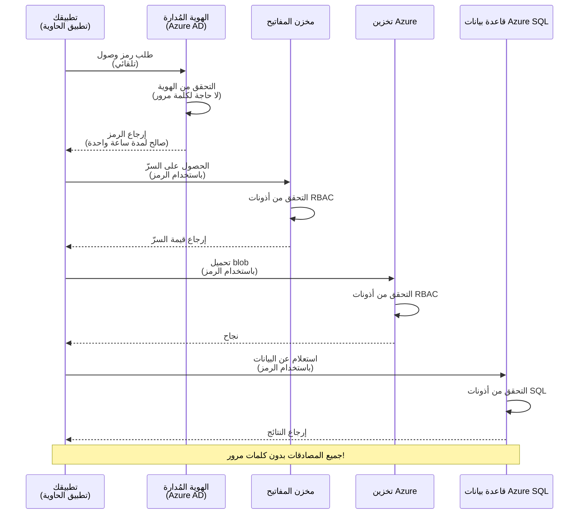
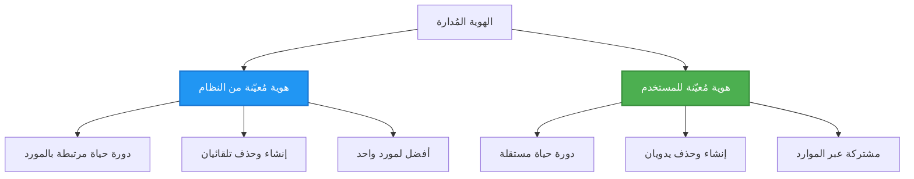

# أنماط المصادقة والهوية المُدارة

⏱️ **الوقت المقدر**: 45-60 دقيقة | 💰 **تأثير التكلفة**: مجاني (لا توجد رسوم إضافية) | ⭐ **التعقيد**: متوسط

**📚 مسار التعلم:**
- ← السابق: [إدارة التكوين](configuration.md) - إدارة متغيرات البيئة والأسرار
- 🎯 **أنت هنا**: المصادقة والأمان (الهوية المُدارة، خزانة مفاتيح Azure، أنماط الأمان)
- → التالي: [المشروع الأول](first-project.md) - ابنِ تطبيق AZD الأول الخاص بك
- 🏠 [الصفحة الرئيسية للدورة](../../README.md)

---

## ما ستتعلم

بإكمال هذا الدرس، ستتمكن من:
- فهم أنماط المصادقة في Azure (المفاتيح، سلاسل الاتصال، الهوية المُدارة)
- تنفيذ **الهوية المُدارة** للمصادقة بدون كلمات مرور
- تأمين الأسرار بتكامل **خزانة مفاتيح Azure**
- تكوين **التحكم في الوصول بناءً على الدور (RBAC)** لنشرات AZD
- تطبيق أفضل ممارسات الأمان في تطبيقات الحاويات وخدمات Azure
- الانتقال من المصادقة المعتمدة على المفاتيح إلى المصادقة المعتمدة على الهوية

## لماذا تهم الهوية المُدارة

### المشكلة: المصادقة التقليدية

**قبل الهوية المُدارة:**
```javascript
// ❌ خطر أمني: أسرار مضمنة مباشرة في الكود
const connectionString = "Server=mydb.database.windows.net;User=admin;Password=P@ssw0rd123";
const storageKey = "xK7mN9pQ2wR5tY8uI0oP3aS6dF1gH4jK...";
const cosmosKey = "C2x7B9n4M1p8Q5w3E6r0T2y5U8i1O4p7...";
```

**المشكلات:**
- 🔴 **تعرّض الأسرار** في الشيفرة، ملفات التكوين، متغيرات البيئة
- 🔴 **تدوير بيانات الاعتماد** يتطلب تغييرات في الشيفرة وإعادة النشر
- 🔴 **كابوس المراجعة** - من وصل إلى ماذا ومتى؟
- 🔴 **تشتت** - الأسرار مبعثرة عبر أنظمة متعددة
- 🔴 **مخاطر الامتثال** - يفشل في تدقيقات الأمان

### الحل: الهوية المُدارة

**بعد الهوية المُدارة:**
```javascript
// ✅ آمن: لا أسرار في الكود
const credential = new DefaultAzureCredential();
const client = new BlobServiceClient(
  "https://mystorageaccount.blob.core.windows.net",
  credential  // تتعامل Azure تلقائيًا مع المصادقة
);
```

**الفوائد:**
- ✅ **لا أسرار** في الشيفرة أو التكوين
- ✅ **تدوير تلقائي** - يتولى Azure إدارته
- ✅ **سجل تدقيق كامل** في سجلات Azure AD
- ✅ **أمان مركزي** - إدارة عبر بوابة Azure
- ✅ **جاهز للامتثال** - يفي بمعايير الأمان

**تشبيه**: المصادقة التقليدية تشبه حمل مفاتيح مادية متعددة لأبواب مختلفة. الهوية المُدارة تشبه وجود بطاقة أمنية تمنح الوصول تلقائيًا بناءً على هويتك—لا مفاتيح لتضيع، أو تُنسخ، أو تُدوَّر.

---

## نظرة عامة على البنية

### تدفق المصادقة باستخدام الهوية المُدارة


```mermaid
sequenceDiagram
    participant App as تطبيقك<br/>(تطبيق الحاوية)
    participant MI as الهوية المُدارة<br/>(Azure AD)
    participant KV as مخزن المفاتيح
    participant Storage as تخزين Azure
    participant DB as قاعدة بيانات Azure SQL
    
    App->>MI: طلب رمز وصول<br/>(تلقائي)
    MI->>MI: التحقق من الهوية<br/>(لا حاجة لكلمة مرور)
    MI-->>App: إرجاع الرمز<br/>(صالح لمدة ساعة واحدة)
    
    App->>KV: الحصول على السرّ<br/>(باستخدام الرمز)
    KV->>KV: التحقق من أذونات RBAC
    KV-->>App: إرجاع قيمة السرّ
    
    App->>Storage: تحميل blob<br/>(باستخدام الرمز)
    Storage->>Storage: التحقق من أذونات RBAC
    Storage-->>App: نجاح
    
    App->>DB: استعلام عن البيانات<br/>(باستخدام الرمز)
    DB->>DB: التحقق من أذونات SQL
    DB-->>App: إرجاع النتائج
    
    Note over App,DB: جميع المصادقات بدون كلمات مرور!
```
### أنواع الهويات المُدارة


```mermaid
graph TB
    MI[الهوية المُدارة]
    SystemAssigned[هوية مُعيّنة من النظام]
    UserAssigned[هوية مُعيّنة للمستخدم]
    
    MI --> SystemAssigned
    MI --> UserAssigned
    
    SystemAssigned --> SA1[دورة حياة مرتبطة بالمورد]
    SystemAssigned --> SA2[إنشاء وحذف تلقائيان]
    SystemAssigned --> SA3[أفضل لمورد واحد]
    
    UserAssigned --> UA1[دورة حياة مستقلة]
    UserAssigned --> UA2[إنشاء وحذف يدويان]
    UserAssigned --> UA3[مشتركة عبر الموارد]
    
    style SystemAssigned fill:#2196F3,stroke:#1976D2,stroke-width:2px,color:#fff
    style UserAssigned fill:#4CAF50,stroke:#388E3C,stroke-width:2px,color:#fff
```
| الميزة | مُعيَّن للنظام | مُعيَّن للمستخدم |
|---------|----------------|---------------|
| **دورة الحياة** | مرتبط بالمورد | مستقل |
| **الإنشاء** | تلقائي مع المورد | إنشاء يدوي |
| **الحذف** | يتم حذفه مع المورد | يستمر بعد حذف المورد |
| **المشاركة** | مورد واحد فقط | موارد متعددة |
| **حالة الاستخدام** | سيناريوهات بسيطة | سيناريوهات متعددة الموارد ومعقدة |
| **الإعداد الافتراضي في AZD** | ✅ موصى به | اختياري |

---

## المتطلبات المسبقة

### الأدوات المطلوبة

يجب أن تكون قد قمت بتثبيت ما يلي بالفعل من الدروس السابقة:

```bash
# تحقق من Azure Developer CLI
azd version
# ✅ المتوقع: إصدار azd 1.0.0 أو أعلى

# تحقق من Azure CLI
az --version
# ✅ المتوقع: azure-cli 2.50.0 أو أعلى
```

### متطلبات Azure

- اشتراك Azure نشط
- أذونات لـ:
  - إنشاء هويات مُدارة
  - تعيين أدوار RBAC
  - إنشاء موارد خزانة المفاتيح
  - نشر تطبيقات الحاويات

### المتطلبات المعرفية

يجب أن تكون قد أكملت:
- [دليل التثبيت](installation.md) - إعداد AZD
- [أساسيات AZD](azd-basics.md) - المفاهيم الأساسية
- [إدارة التكوين](configuration.md) - متغيرات البيئة

---

## الدرس 1: فهم أنماط المصادقة

### النمط 1: سلاسل الاتصال (قديم - تجنب)

**كيف يعمل:**
```bash
# سلسلة الاتصال تحتوي على بيانات الاعتماد
STORAGE_CONNECTION_STRING="DefaultEndpointsProtocol=https;AccountName=myaccount;AccountKey=xK7mN9pQ2wR5..."
COSMOS_CONNECTION_STRING="AccountEndpoint=https://myaccount.documents.azure.com:443/;AccountKey=C2x7..."
SQL_CONNECTION_STRING="Server=myserver.database.windows.net;User=admin;Password=P@ssw0rd..."
```

**المشكلات:**
- ❌ الأسرار مرئية في متغيرات البيئة
- ❌ تسجل في أنظمة النشر
- ❌ صعب التدوير
- ❌ لا يوجد سجل تدقيق للوصول

**متى تستخدم:** فقط للتطوير المحلي، وليس للإنتاج أبدًا.

---

### النمط 2: مراجع خزانة المفاتيح (أفضل)

**كيف يعمل:**
```bicep
// Store secret in Key Vault
resource keyVault 'Microsoft.KeyVault/vaults@2023-02-01' = {
  name: 'mykv'
  properties: {
    enableRbacAuthorization: true
  }
}

// Reference in Container App
env: [
  {
    name: 'STORAGE_KEY'
    secretRef: 'storage-key'  // References Key Vault
  }
]
```

**الفوائد:**
- ✅ تُخزن الأسرار بأمان في خزانة المفاتيح
- ✅ إدارة أسرار مُركزّة
- ✅ تدوير دون تغييرات على الشيفرة

**القيود:**
- ⚠️ لا يزال يستخدم المفاتيح/كلمات المرور
- ⚠️ تحتاج لإدارة الوصول إلى خزانة المفاتيح

**متى تستخدم:** خطوة انتقالية من سلاسل الاتصال إلى الهوية المُدارة.

---

### النمط 3: الهوية المُدارة (أفضل ممارسة)

**كيف يعمل:**
```bicep
// Enable managed identity
resource containerApp 'Microsoft.App/containerApps@2023-05-01' = {
  name: 'myapp'
  identity: {
    type: 'SystemAssigned'  // Automatically creates identity
  }
}

// Grant permissions
resource roleAssignment 'Microsoft.Authorization/roleAssignments@2022-04-01' = {
  scope: storageAccount
  properties: {
    roleDefinitionId: storageBlobDataContributorRole
    principalId: containerApp.identity.principalId
  }
}
```

**شيفرة التطبيق:**
```javascript
// لا حاجة إلى أسرار!
const { DefaultAzureCredential } = require('@azure/identity');
const { BlobServiceClient } = require('@azure/storage-blob');

const credential = new DefaultAzureCredential();
const blobServiceClient = new BlobServiceClient(
  'https://mystorageaccount.blob.core.windows.net',
  credential
);
```

**الفوائد:**
- ✅ لا أسرار في الشيفرة/التكوين
- ✅ تدوير بيانات الاعتماد تلقائيًا
- ✅ سجل تدقيق كامل
- ✅ أذونات مبنية على RBAC
- ✅ جاهز للامتثال

**متى تستخدم:** دائمًا، لتطبيقات الإنتاج.

---

## الدرس 2: تنفيذ الهوية المُدارة مع AZD

### التنفيذ خطوة بخطوة

دعنا نبني تطبيق حاويات آمن يستخدم الهوية المُدارة للوصول إلى تخزين Azure وخزانة المفاتيح.

### هيكل المشروع

```
secure-app/
├── azure.yaml                 # AZD configuration
├── infra/
│   ├── main.bicep            # Main infrastructure
│   ├── core/
│   │   ├── identity.bicep    # Managed identity setup
│   │   ├── keyvault.bicep    # Key Vault configuration
│   │   └── storage.bicep     # Storage with RBAC
│   └── app/
│       └── container-app.bicep
└── src/
    ├── app.js                # Application code
    ├── package.json
    └── Dockerfile
```

### 1. تكوين AZD (azure.yaml)

```yaml
name: secure-app
metadata:
  template: secure-app@1.0.0

services:
  api:
    project: ./src
    language: js
    host: containerapp

# Enable managed identity (AZD handles this automatically)
```

### 2. البنية التحتية: تمكين الهوية المُدارة

**الملف: `infra/main.bicep`**

```bicep
targetScope = 'subscription'

param environmentName string
param location string = 'eastus'

var tags = { 'azd-env-name': environmentName }

// Resource group
resource rg 'Microsoft.Resources/resourceGroups@2021-04-01' = {
  name: 'rg-${environmentName}'
  location: location
  tags: tags
}

// Storage Account
module storage './core/storage.bicep' = {
  name: 'storage'
  scope: rg
  params: {
    name: 'st${uniqueString(rg.id)}'
    location: location
    tags: tags
  }
}

// Key Vault
module keyVault './core/keyvault.bicep' = {
  name: 'keyvault'
  scope: rg
  params: {
    name: 'kv-${uniqueString(rg.id)}'
    location: location
    tags: tags
  }
}

// Container App with Managed Identity
module containerApp './app/container-app.bicep' = {
  name: 'container-app'
  scope: rg
  params: {
    name: 'ca-${environmentName}'
    location: location
    tags: tags
    storageAccountName: storage.outputs.name
    keyVaultName: keyVault.outputs.name
  }
}

// Grant Container App access to Storage
module storageRoleAssignment './core/role-assignment.bicep' = {
  name: 'storage-role'
  scope: rg
  params: {
    principalId: containerApp.outputs.identityPrincipalId
    roleDefinitionId: 'ba92f5b4-2d11-453d-a403-e96b0029c9fe'  // Storage Blob Data Contributor
    targetResourceId: storage.outputs.id
  }
}

// Grant Container App access to Key Vault
module kvRoleAssignment './core/role-assignment.bicep' = {
  name: 'kv-role'
  scope: rg
  params: {
    principalId: containerApp.outputs.identityPrincipalId
    roleDefinitionId: '4633458b-17de-408a-b874-0445c86b69e6'  // Key Vault Secrets User
    targetResourceId: keyVault.outputs.id
  }
}

// Outputs
output AZURE_STORAGE_ACCOUNT_NAME string = storage.outputs.name
output AZURE_KEY_VAULT_NAME string = keyVault.outputs.name
output APP_URL string = containerApp.outputs.url
```

### 3. تطبيق الحاوية بهوية مُعيَّنة للنظام

**الملف: `infra/app/container-app.bicep`**

```bicep
param name string
param location string
param tags object = {}
param storageAccountName string
param keyVaultName string

resource containerApp 'Microsoft.App/containerApps@2023-05-01' = {
  name: name
  location: location
  tags: tags
  identity: {
    type: 'SystemAssigned'  // 🔑 Enable managed identity
  }
  properties: {
    configuration: {
      ingress: {
        external: true
        targetPort: 3000
      }
    }
    template: {
      containers: [
        {
          name: 'api'
          image: 'myregistry.azurecr.io/api:latest'
          resources: {
            cpu: json('0.5')
            memory: '1Gi'
          }
          env: [
            {
              name: 'AZURE_STORAGE_ACCOUNT_NAME'
              value: storageAccountName
            }
            {
              name: 'AZURE_KEY_VAULT_NAME'
              value: keyVaultName
            }
            // 🔑 No secrets - managed identity handles authentication!
          ]
        }
      ]
    }
  }
}

// Output the identity for RBAC assignments
output identityPrincipalId string = containerApp.identity.principalId
output id string = containerApp.id
output url string = 'https://${containerApp.properties.configuration.ingress.fqdn}'
```

### 4. وحدة تعيين أدوار RBAC

**الملف: `infra/core/role-assignment.bicep`**

```bicep
param principalId string
param roleDefinitionId string  // Azure built-in role ID
param targetResourceId string

resource roleAssignment 'Microsoft.Authorization/roleAssignments@2022-04-01' = {
  name: guid(principalId, roleDefinitionId, targetResourceId)
  scope: resourceId('Microsoft.Resources/resourceGroups', resourceGroup().name)
  properties: {
    roleDefinitionId: subscriptionResourceId('Microsoft.Authorization/roleDefinitions', roleDefinitionId)
    principalId: principalId
    principalType: 'ServicePrincipal'
  }
}

output id string = roleAssignment.id
```

### 5. شيفرة التطبيق مع الهوية المُدارة

**الملف: `src/app.js`**

```javascript
const express = require('express');
const { DefaultAzureCredential } = require('@azure/identity');
const { BlobServiceClient } = require('@azure/storage-blob');
const { SecretClient } = require('@azure/keyvault-secrets');

const app = express();
const PORT = process.env.PORT || 3000;

// 🔑 تهيئة بيانات الاعتماد (يعمل تلقائيًا مع الهوية المُدارة)
const credential = new DefaultAzureCredential();

// إعداد تخزين Azure
const storageAccountName = process.env.AZURE_STORAGE_ACCOUNT_NAME;
const blobServiceClient = new BlobServiceClient(
  `https://${storageAccountName}.blob.core.windows.net`,
  credential  // لا حاجة إلى مفاتيح!
);

// إعداد Key Vault
const keyVaultName = process.env.AZURE_KEY_VAULT_NAME;
const secretClient = new SecretClient(
  `https://${keyVaultName}.vault.azure.net`,
  credential  // لا حاجة إلى مفاتيح!
);

// فحص الصحة
app.get('/health', (req, res) => {
  res.json({ status: 'healthy', authentication: 'managed-identity' });
});

// تحميل ملف إلى تخزين Blob
app.post('/upload', async (req, res) => {
  try {
    const containerClient = blobServiceClient.getContainerClient('uploads');
    await containerClient.createIfNotExists();
    
    const blobName = `file-${Date.now()}.txt`;
    const blockBlobClient = containerClient.getBlockBlobClient(blobName);
    
    await blockBlobClient.upload('Hello from managed identity!', 30);
    
    res.json({
      success: true,
      blobName: blobName,
      message: 'File uploaded using managed identity!'
    });
  } catch (error) {
    console.error('Upload error:', error);
    res.status(500).json({ error: error.message });
  }
});

// استرداد سر من Key Vault
app.get('/secret/:name', async (req, res) => {
  try {
    const secretName = req.params.name;
    const secret = await secretClient.getSecret(secretName);
    
    res.json({
      name: secretName,
      value: secret.value,
      message: 'Secret retrieved using managed identity!'
    });
  } catch (error) {
    console.error('Secret error:', error);
    res.status(500).json({ error: error.message });
  }
});

// قائمة حاويات Blob (يوضح إمكانية الوصول للقراءة)
app.get('/containers', async (req, res) => {
  try {
    const containers = [];
    for await (const container of blobServiceClient.listContainers()) {
      containers.push(container.name);
    }
    
    res.json({
      containers: containers,
      count: containers.length,
      message: 'Containers listed using managed identity!'
    });
  } catch (error) {
    console.error('List error:', error);
    res.status(500).json({ error: error.message });
  }
});

app.listen(PORT, () => {
  console.log(`Secure API listening on port ${PORT}`);
  console.log('Authentication: Managed Identity (passwordless)');
});
```

**الملف: `src/package.json`**

```json
{
  "name": "secure-app",
  "version": "1.0.0",
  "dependencies": {
    "express": "^4.18.2",
    "@azure/identity": "^4.0.0",
    "@azure/storage-blob": "^12.17.0",
    "@azure/keyvault-secrets": "^4.7.0"
  },
  "scripts": {
    "start": "node app.js"
  }
}
```

### 6. النشر والاختبار

```bash
# تهيئة بيئة AZD
azd init

# نشر البنية التحتية والتطبيق
azd up

# الحصول على رابط التطبيق
APP_URL=$(azd env get-values | grep APP_URL | cut -d '=' -f2 | tr -d '"')

# اختبار فحص الحالة الصحية
curl $APP_URL/health
```

**✅ الناتج المتوقع:**
```json
{
  "status": "healthy",
  "authentication": "managed-identity"
}
```

**اختبار تحميل Blob:**
```bash
curl -X POST $APP_URL/upload
```

**✅ الناتج المتوقع:**
```json
{
  "success": true,
  "blobName": "file-1700404800000.txt",
  "message": "File uploaded using managed identity!"
}
```

**اختبار سرد الحاويات:**
```bash
curl $APP_URL/containers
```

**✅ الناتج المتوقع:**
```json
{
  "containers": ["uploads"],
  "count": 1,
  "message": "Containers listed using managed identity!"
}
```

---

## أدوار RBAC الشائعة في Azure

### معرّفات الأدوار المضمنة للهوية المُدارة

| الخدمة | اسم الدور | مُعرف الدور | الأذونات |
|---------|-----------|---------|-------------|
| **Storage** | Storage Blob Data Reader | `2a2b9908-6b94-4a3d-8e5a-a7d8f8cc8a12` | قراءة الـ blobs والحاويات |
| **Storage** | Storage Blob Data Contributor | `ba92f5b4-2d11-453d-a403-e96b0029c9fe` | قراءة وكتابة وحذف الـ blobs |
| **Storage** | Storage Queue Data Contributor | `974c5e8b-45b9-4653-ba55-5f855dd0fb88` | قراءة وكتابة وحذف رسائل قائمة الانتظار |
| **Key Vault** | Key Vault Secrets User | `4633458b-17de-408a-b874-0445c86b69e6` | قراءة الأسرار |
| **Key Vault** | Key Vault Secrets Officer | `b86a8fe4-44ce-4948-aee5-eccb2c155cd7` | قراءة وكتابة وحذف الأسرار |
| **Cosmos DB** | Cosmos DB Built-in Data Reader | `00000000-0000-0000-0000-000000000001` | قراءة بيانات Cosmos DB |
| **Cosmos DB** | Cosmos DB Built-in Data Contributor | `00000000-0000-0000-0000-000000000002` | قراءة وكتابة بيانات Cosmos DB |
| **SQL Database** | SQL DB Contributor | `9b7fa17d-e63e-47b0-bb0a-15c516ac86ec` | إدارة قواعد بيانات SQL |
| **Service Bus** | Azure Service Bus Data Owner | `090c5cfd-751d-490a-894a-3ce6f1109419` | إرسال واستقبال وإدارة الرسائل |

### كيفية العثور على معرّفات الأدوار

```bash
# عرض جميع الأدوار المدمجة
az role definition list --query "[].{Name:roleName, ID:name}" --output table

# البحث عن دور معين
az role definition list --query "[?contains(roleName, 'Storage Blob')].{Name:roleName, ID:name}" --output table

# الحصول على تفاصيل الدور
az role definition list --name "Storage Blob Data Contributor"
```

---

## تمارين عملية

### التمرين 1: تمكين الهوية المُدارة لتطبيق موجود ⭐⭐ (متوسط)

**الهدف**: إضافة هوية مُدارة إلى نشر تطبيق حاويات موجود

**السيناريو**: لديك تطبيق حاويات يستخدم سلاسل الاتصال. قم بتحويله إلى الهوية المُدارة.

**نقطة البداية**: تطبيق حاويات بهذا التكوين:

```bicep
// ❌ Current: Using connection string
env: [
  {
    name: 'STORAGE_CONNECTION_STRING'
    secretRef: 'storage-connection'
  }
]
```

**الخطوات**:

1. **تمكين الهوية المُدارة في Bicep:**

```bicep
resource containerApp 'Microsoft.App/containerApps@2023-05-01' = {
  name: 'myapp'
  identity: {
    type: 'SystemAssigned'  // Add this
  }
  // ... rest of configuration
}
```

2. **منح الوصول إلى التخزين:**

```bicep
// Get storage account reference
resource storageAccount 'Microsoft.Storage/storageAccounts@2023-01-01' existing = {
  name: storageAccountName
}

// Assign role
resource roleAssignment 'Microsoft.Authorization/roleAssignments@2022-04-01' = {
  name: guid(containerApp.id, 'ba92f5b4-2d11-453d-a403-e96b0029c9fe', storageAccount.id)
  scope: storageAccount
  properties: {
    roleDefinitionId: subscriptionResourceId('Microsoft.Authorization/roleDefinitions', 'ba92f5b4-2d11-453d-a403-e96b0029c9fe')
    principalId: containerApp.identity.principalId
    principalType: 'ServicePrincipal'
  }
}
```

3. **تحديث شيفرة التطبيق:**

**قبل (سلسلة الاتصال):**
```javascript
const { BlobServiceClient } = require('@azure/storage-blob');

const blobServiceClient = BlobServiceClient.fromConnectionString(
  process.env.STORAGE_CONNECTION_STRING
);
```

**بعد (الهوية المُدارة):**
```javascript
const { DefaultAzureCredential } = require('@azure/identity');
const { BlobServiceClient } = require('@azure/storage-blob');

const credential = new DefaultAzureCredential();
const blobServiceClient = new BlobServiceClient(
  `https://${process.env.STORAGE_ACCOUNT_NAME}.blob.core.windows.net`,
  credential
);
```

4. **تحديث متغيرات البيئة:**

```bicep
env: [
  {
    name: 'STORAGE_ACCOUNT_NAME'
    value: storageAccountName  // Just the name, no secrets!
  }
  // Remove STORAGE_CONNECTION_STRING
]
```

5. **نشر واختبار:**

```bash
# أعد النشر
azd up

# اختبر أنه لا يزال يعمل
curl https://myapp.azurecontainerapps.io/upload
```

**✅ معايير النجاح:**
- ✅ يتم نشر التطبيق دون أخطاء
- ✅ عمليات التخزين تعمل (رفع، سرد، تنزيل)
- ✅ لا توجد سلاسل اتصال في متغيرات البيئة
- ✅ الهوية مرئية في بوابة Azure ضمن لوحة "Identity"

**التحقق:**

```bash
# تحقق من تمكين الهوية المدارة
az containerapp show \
  --name myapp \
  --resource-group rg-myapp \
  --query "identity.type"
# ✅ المتوقع: "SystemAssigned"

# تحقق من تعيين الدور
az role assignment list \
  --assignee $(az containerapp show --name myapp --resource-group rg-myapp --query "identity.principalId" -o tsv) \
  --scope /subscriptions/{sub-id}/resourceGroups/rg-myapp/providers/Microsoft.Storage/storageAccounts/mystorageaccount
# ✅ المتوقع: يعرض الدور "Storage Blob Data Contributor"
```

**الوقت**: 20-30 دقيقة

---

### التمرين 2: وصول متعدد الخدمات باستخدام هوية مُعيَّنة للمستخدم ⭐⭐⭐ (متقدم)

**الهدف**: إنشاء هوية مُعيَّنة للمستخدم يتم مشاركتها عبر عدة تطبيقات حاويات

**السيناريو**: لديك 3 خدمات مصغرة تحتاج جميعها للوصول إلى نفس حساب التخزين وخزانة المفاتيح.

**الخطوات**:

1. **إنشاء هوية مُعيَّنة للمستخدم:**

**الملف: `infra/core/identity.bicep`**

```bicep
param name string
param location string
param tags object = {}

resource userAssignedIdentity 'Microsoft.ManagedIdentity/userAssignedIdentities@2023-01-31' = {
  name: name
  location: location
  tags: tags
}

output id string = userAssignedIdentity.id
output principalId string = userAssignedIdentity.properties.principalId
output clientId string = userAssignedIdentity.properties.clientId
```

2. **تعيين أدوار للهوية المُعيَّنة للمستخدم:**

```bicep
// In main.bicep
module userIdentity './core/identity.bicep' = {
  name: 'user-identity'
  scope: rg
  params: {
    name: 'id-${environmentName}'
    location: location
    tags: tags
  }
}

// Grant Storage access
resource storageRoleAssignment 'Microsoft.Authorization/roleAssignments@2022-04-01' = {
  name: guid(userIdentity.outputs.principalId, 'storage-contributor')
  scope: storageAccount
  properties: {
    roleDefinitionId: subscriptionResourceId('Microsoft.Authorization/roleDefinitions', 'ba92f5b4-2d11-453d-a403-e96b0029c9fe')
    principalId: userIdentity.outputs.principalId
    principalType: 'ServicePrincipal'
  }
}

// Grant Key Vault access
resource kvRoleAssignment 'Microsoft.Authorization/roleAssignments@2022-04-01' = {
  name: guid(userIdentity.outputs.principalId, 'kv-secrets-user')
  scope: keyVault
  properties: {
    roleDefinitionId: subscriptionResourceId('Microsoft.Authorization/roleDefinitions', '4633458b-17de-408a-b874-0445c86b69e6')
    principalId: userIdentity.outputs.principalId
    principalType: 'ServicePrincipal'
  }
}
```

3. **تعيين الهوية لعدة تطبيقات حاويات:**

```bicep
resource apiGateway 'Microsoft.App/containerApps@2023-05-01' = {
  name: 'api-gateway'
  identity: {
    type: 'UserAssigned'
    userAssignedIdentities: {
      '${userIdentity.outputs.id}': {}
    }
  }
  // ... rest of config
}

resource productService 'Microsoft.App/containerApps@2023-05-01' = {
  name: 'product-service'
  identity: {
    type: 'UserAssigned'
    userAssignedIdentities: {
      '${userIdentity.outputs.id}': {}
    }
  }
  // ... rest of config
}

resource orderService 'Microsoft.App/containerApps@2023-05-01' = {
  name: 'order-service'
  identity: {
    type: 'UserAssigned'
    userAssignedIdentities: {
      '${userIdentity.outputs.id}': {}
    }
  }
  // ... rest of config
}
```

4. **شيفرة التطبيق (جميع الخدمات تستخدم نفس النمط):**

```javascript
const { DefaultAzureCredential, ManagedIdentityCredential } = require('@azure/identity');

// لهوية معيّنة من قِبَل المستخدم، حدّد معرف العميل
const credential = new ManagedIdentityCredential(
  process.env.AZURE_CLIENT_ID  // معرف عميل الهوية المعيّنة من المستخدم
);

// أو استخدم DefaultAzureCredential (يكتشف تلقائيًا)
const credential = new DefaultAzureCredential();

const blobServiceClient = new BlobServiceClient(
  `https://${process.env.STORAGE_ACCOUNT_NAME}.blob.core.windows.net`,
  credential
);
```

5. **نشر والتحقق:**

```bash
azd up

# اختبر أن جميع الخدمات يمكنها الوصول إلى التخزين
curl https://api-gateway.azurecontainerapps.io/upload
curl https://product-service.azurecontainerapps.io/upload
curl https://order-service.azurecontainerapps.io/upload
```

**✅ معايير النجاح:**
- ✅ هوية واحدة مشتركة عبر 3 خدمات
- ✅ جميع الخدمات يمكنها الوصول إلى التخزين وخزانة المفاتيح
- ✅ تستمر الهوية إذا قمت بحذف خدمة واحدة
- ✅ إدارة أذونات مُركزّة

**فوائد الهوية المُعيَّنة للمستخدم:**
- هوية واحدة للإدارة
- أذونات متسقة عبر الخدمات
- تستمر بعد حذف الخدمة
- أفضل للهندسات المعقدة

**الوقت**: 30-40 دقيقة

---

### التمرين 3: تنفيذ تدوير أسرار خزانة المفاتيح ⭐⭐⭐ (متقدم)

**الهدف**: تخزين مفاتيح واجهات برمجة تطبيقات الطرف الثالث في خزانة المفاتيح والوصول إليها باستخدام الهوية المُدارة

**السيناريو**: يحتاج تطبيقك لاستدعاء واجهة برمجة تطبيقات خارجية (OpenAI, Stripe, SendGrid) تتطلب مفاتيح API.

**الخطوات**:

1. **إنشاء خزانة مفاتيح مع RBAC:**

**الملف: `infra/core/keyvault.bicep`**

```bicep
param name string
param location string
param tags object = {}

resource keyVault 'Microsoft.KeyVault/vaults@2023-02-01' = {
  name: name
  location: location
  tags: tags
  properties: {
    enableRbacAuthorization: true  // Use RBAC instead of access policies
    sku: {
      family: 'A'
      name: 'standard'
    }
    tenantId: subscription().tenantId
    enableSoftDelete: true
    softDeleteRetentionInDays: 90
  }
}

// Allow Container App to read secrets
output id string = keyVault.id
output name string = keyVault.name
output uri string = keyVault.properties.vaultUri
```

2. **تخزين الأسرار في خزانة المفاتيح:**

```bash
# الحصول على اسم Key Vault
KV_NAME=$(azd env get-values | grep AZURE_KEY_VAULT_NAME | cut -d '=' -f2 | tr -d '"')

# تخزين مفاتيح واجهة برمجة التطبيقات لجهات خارجية
az keyvault secret set \
  --vault-name $KV_NAME \
  --name "OpenAI-ApiKey" \
  --value "sk-proj-xxxxxxxxxxxxx"

az keyvault secret set \
  --vault-name $KV_NAME \
  --name "Stripe-ApiKey" \
  --value "sk_live_xxxxxxxxxxxxx"

az keyvault secret set \
  --vault-name $KV_NAME \
  --name "SendGrid-ApiKey" \
  --value "SG.xxxxxxxxxxxxx"
```

3. **شيفرة التطبيق لاسترجاع الأسرار:**

**الملف: `src/config.js`**

```javascript
const { DefaultAzureCredential } = require('@azure/identity');
const { SecretClient } = require('@azure/keyvault-secrets');

class Config {
  constructor() {
    this.credential = new DefaultAzureCredential();
    this.secretClient = new SecretClient(
      `https://${process.env.AZURE_KEY_VAULT_NAME}.vault.azure.net`,
      this.credential
    );
    this.cache = {};
  }

  async getSecret(secretName) {
    // تحقق من ذاكرة التخزين المؤقت أولاً
    if (this.cache[secretName]) {
      return this.cache[secretName];
    }

    try {
      const secret = await this.secretClient.getSecret(secretName);
      this.cache[secretName] = secret.value;
      console.log(`✅ Retrieved secret: ${secretName}`);
      return secret.value;
    } catch (error) {
      console.error(`❌ Failed to get secret ${secretName}:`, error.message);
      throw error;
    }
  }

  async getOpenAIKey() {
    return this.getSecret('OpenAI-ApiKey');
  }

  async getStripeKey() {
    return this.getSecret('Stripe-ApiKey');
  }

  async getSendGridKey() {
    return this.getSecret('SendGrid-ApiKey');
  }
}

module.exports = new Config();
```

4. **استخدام الأسرار في التطبيق:**

**الملف: `src/app.js`**

```javascript
const express = require('express');
const config = require('./config');
const { OpenAI } = require('openai');

const app = express();

// تهيئة OpenAI باستخدام المفتاح من مخزن المفاتيح
let openaiClient;

async function initializeServices() {
  const openaiKey = await config.getOpenAIKey();
  openaiClient = new OpenAI({ apiKey: openaiKey });
  console.log('✅ Services initialized with secrets from Key Vault');
}

// استدعاء عند بدء التشغيل
initializeServices().catch(console.error);

app.post('/chat', async (req, res) => {
  try {
    const completion = await openaiClient.chat.completions.create({
      model: 'gpt-4.1',
      messages: [{ role: 'user', content: 'Hello!' }]
    });
    
    res.json({
      response: completion.choices[0].message.content,
      authentication: 'Key from Key Vault via Managed Identity'
    });
  } catch (error) {
    res.status(500).json({ error: error.message });
  }
});

app.listen(3000, () => {
  console.log('Secure API with Key Vault integration running');
});
```

5. **نشر واختبار:**

```bash
azd up

# تحقّق من أن مفاتيح واجهة برمجة التطبيقات تعمل
curl -X POST https://myapp.azurecontainerapps.io/chat \
  -H "Content-Type: application/json" \
  -d '{"message":"Hello AI"}'
```

**✅ معايير النجاح:**
- ✅ لا توجد مفاتيح API في الشيفرة أو متغيرات البيئة
- ✅ يسترجع التطبيق المفاتيح من خزانة المفاتيح
- ✅ تعمل واجهات برمجة تطبيقات الطرف الثالث بشكل صحيح
- ✅ إمكانية تدوير المفاتيح دون تغييرات في الشيفرة

**تدوير سر:**

```bash
# تحديث السر في خزنة المفاتيح
az keyvault secret set \
  --vault-name $KV_NAME \
  --name "OpenAI-ApiKey" \
  --value "sk-proj-NEW_KEY_HERE"

# أعد تشغيل التطبيق لتحميل المفتاح الجديد
az containerapp revision restart \
  --name myapp \
  --resource-group rg-myapp
```

**الوقت**: 25-35 دقيقة

---

## نقطة تحقق المعرفة

### 1. أنماط المصادقة ✓

اختبر فهمك:

- [ ] **Q1**: ما هي الأنماط الثلاثة الرئيسية للمصادقة؟ 
  - **A**: سلاسل الاتصال (قديم)، مراجع خزانة المفاتيح (انتقال)، الهوية المُدارة (أفضل)
- [ ] **Q2**: لماذا الهوية المُدارة أفضل من سلاسل الاتصال؟
  - **A**: لا أسرار في الشيفرة، تدوير تلقائي، سجل تدقيق كامل، أذونات RBAC
- [ ] **Q3**: متى تستخدم الهوية المُعيَّنة للمستخدم بدلًا من المُعيَّنة للنظام؟
  - **A**: عند مشاركة الهوية عبر موارد متعددة أو عندما تكون دورة حياة الهوية مستقلة عن دورة حياة المورد

**التحقق العملي:**
```bash
# تحقق من نوع الهوية التي يستخدمها تطبيقك
az containerapp show \
  --name myapp \
  --resource-group rg-myapp \
  --query "identity.type"

# أدرج جميع تعيينات الأدوار للهوية
az role assignment list \
  --assignee $(az containerapp show --name myapp --resource-group rg-myapp --query "identity.principalId" -o tsv)
```

---

### 2. RBAC والأذونات ✓

اختبر فهمك:

- [ ] **Q1**: ما هو مُعرف الدور لـ "Storage Blob Data Contributor"؟
  - **A**: `ba92f5b4-2d11-453d-a403-e96b0029c9fe`

- [ ] **Q2**: ما الأذونات التي يوفرها "Key Vault Secrets User"؟
  - **A**: وصول قراءة فقط للأسرار (لا يمكن الإنشاء أو التحديث أو الحذف)

- [ ] **Q3**: كيف تمنح تطبيق حاوية الوصول إلى Azure SQL؟
  - **A**: تعيين دور "SQL DB Contributor" أو تكوين مصادقة Azure AD لـ SQL

**التحقق العملي:**
```bash
# ابحث عن دور محدد
az role definition list --name "Storage Blob Data Contributor"

# تحقق من الأدوار المعينة لهويتك
PRINCIPAL_ID=$(az containerapp show --name myapp --resource-group rg-myapp --query "identity.principalId" -o tsv)
az role assignment list --assignee $PRINCIPAL_ID --output table
```

---

### 3. تكامل خزانة المفاتيح ✓
- [ ] **Q1**: كيف تقوم بتمكين RBAC لـ Key Vault بدلًا من سياسات الوصول؟
  - **A**: اضبط `enableRbacAuthorization: true` في Bicep

- [ ] **Q2**: أي مكتبة Azure SDK تتعامل مع مصادقة الهوية المُدارة؟
  - **A**: `@azure/identity` مع الفئة `DefaultAzureCredential`

- [ ] **Q3**: كم مدة بقاء أسرار Key Vault في ذاكرة التخزين المؤقت؟
  - **A**: يعتمد على التطبيق؛ نفّذ استراتيجية التخزين المؤقت الخاصة بك

**التحقق العملي:**
```bash
# اختبار الوصول إلى مخزن المفاتيح
az keyvault secret show \
  --vault-name $KV_NAME \
  --name "OpenAI-ApiKey" \
  --query "value"

# تحقق من تمكين التحكم في الوصول القائم على الأدوار (RBAC)
az keyvault show \
  --name $KV_NAME \
  --query "properties.enableRbacAuthorization"
# ✅ المتوقع: صحيح
```

---

## أفضل ممارسات الأمان

### ✅ افعل:

1. **استخدم دائمًا الهوية المُدارة في الإنتاج**
   ```bicep
   identity: {
     type: 'SystemAssigned'
   }
   ```

2. **استخدم أدوار RBAC بأقل امتيازات**
   - استخدم أدوار "Reader" متى أمكن
   - تجنب "Owner" أو "Contributor" إلا إذا لزم الأمر

3. **خزن مفاتيح الطرف الثالث في Key Vault**
   ```javascript
   const apiKey = await secretClient.getSecret('ThirdPartyApiKey');
   ```

4. **فعّل تسجيل التدقيق**
   ```bicep
   diagnosticSettings: {
     logs: [{ category: 'AuditEvent', enabled: true }]
   }
   ```

5. **استخدم هويات مختلفة للبيئات dev/staging/prod**
   ```bash
   azd env new dev
   azd env new staging
   azd env new prod
   ```

6. **قم بتدوير الأسرار بانتظام**
   - اضبط تواريخ الانتهاء على أسرار Key Vault
   - أتمتة التدوير باستخدام Azure Functions

### ❌ لا تفعل:

1. **لا تقم أبدًا بتضمين الأسرار بشكل ثابت (hardcode)**
   ```javascript
   // ❌ سيئ
   const apiKey = "sk-proj-xxxxxxxxxxxxx";
   ```

2. **لا تستخدم سلاسل الاتصال في الإنتاج**
   ```javascript
   // ❌ سيئ
   BlobServiceClient.fromConnectionString(process.env.STORAGE_CONNECTION_STRING)
   ```

3. **لا تمنح أذونات مفرطة**
   ```bicep
   // ❌ BAD - too much access
   roleDefinitionId: 'Owner'
   
   // ✅ GOOD - least privilege
   roleDefinitionId: 'Storage Blob Data Reader'
   ```

4. **لا تسجل الأسرار**
   ```javascript
   // سيئ ❌
   console.log('API Key:', apiKey);
   
   // جيد ✅
   console.log('API Key retrieved successfully');
   ```

5. **لا تشارك هويات الإنتاج عبر البيئات**
   ```bicep
   // ❌ BAD - same identity for dev and prod
   // ✅ GOOD - separate identities per environment
   ```

---

## دليل استكشاف الأخطاء وإصلاحها

### المشكلة: "Unauthorized" عند الوصول إلى Azure Storage

**الأعراض:**
```
Error: Unauthorized (403)
AuthorizationPermissionMismatch: This request is not authorized to perform this operation
```

**التشخيص:**

```bash
# تحقق مما إذا كانت الهوية المُدارة مُفعّلة
az containerapp show \
  --name myapp \
  --resource-group rg-myapp \
  --query "identity.type"
# ✅ متوقع: "SystemAssigned" أو "UserAssigned"

# تحقق من تعيينات الدور
PRINCIPAL_ID=$(az containerapp show --name myapp --resource-group rg-myapp --query "identity.principalId" -o tsv)
az role assignment list --assignee $PRINCIPAL_ID

# متوقع: يجب أن ترى "Storage Blob Data Contributor" أو دور مشابه
```

**الحلول:**

1. **امنح دور RBAC الصحيح:**
```bash
STORAGE_ID=$(az storage account show --name mystorageaccount --resource-group rg-myapp --query "id" -o tsv)
az role assignment create \
  --assignee $PRINCIPAL_ID \
  --role "Storage Blob Data Contributor" \
  --scope $STORAGE_ID
```

2. **انتظر الانتشار (قد يستغرق 5-10 دقائق):**
```bash
# تحقق من حالة تعيين الدور
az role assignment list --assignee $PRINCIPAL_ID --scope $STORAGE_ID
```

3. **تحقق من أن كود التطبيق يستخدم بيانات الاعتماد الصحيحة:**
```javascript
// تأكد من أنك تستخدم DefaultAzureCredential
const credential = new DefaultAzureCredential();
```

---

### المشكلة: رفض الوصول إلى Key Vault

**الأعراض:**
```
Error: Forbidden (403)
The user, group or application does not have secrets get permission
```

**التشخيص:**

```bash
# تحقق من تمكين التحكم في الوصول بناءً على الدور (RBAC) لمخزن المفاتيح
az keyvault show \
  --name $KV_NAME \
  --query "properties.enableRbacAuthorization"
# ✅ المتوقع: صحيح

# تحقق من تعيينات الأدوار
az role assignment list \
  --assignee $PRINCIPAL_ID \
  --scope /subscriptions/{sub-id}/resourceGroups/rg-myapp/providers/Microsoft.KeyVault/vaults/$KV_NAME
```

**الحلول:**

1. **قم بتمكين RBAC على Key Vault:**
```bash
az keyvault update \
  --name $KV_NAME \
  --enable-rbac-authorization true
```

2. **امنح دور Key Vault Secrets User:**
```bash
KV_ID=$(az keyvault show --name $KV_NAME --query "id" -o tsv)
az role assignment create \
  --assignee $PRINCIPAL_ID \
  --role "Key Vault Secrets User" \
  --scope $KV_ID
```

---

### المشكلة: فشل DefaultAzureCredential محليًا

**الأعراض:**
```
Error: DefaultAzureCredential failed to retrieve a token
CredentialUnavailableError: No credential available
```

**التشخيص:**

```bash
# تحقق مما إذا كنت مسجلاً للدخول
az account show

# تحقق من مصادقة Azure CLI
az ad signed-in-user show
```

**الحلول:**

1. **سجّل الدخول إلى Azure CLI:**
```bash
az login
```

2. **اضبط اشتراك Azure:**
```bash
az account set --subscription "Your Subscription Name"
```

3. **للتطوير المحلي، استخدم متغيرات البيئة:**
```bash
export AZURE_TENANT_ID="your-tenant-id"
export AZURE_CLIENT_ID="your-client-id"
export AZURE_CLIENT_SECRET="your-client-secret"
```

4. **أو استخدم بيانات اعتماد مختلفة محليًا:**
```javascript
const { DefaultAzureCredential, AzureCliCredential } = require('@azure/identity');

// استخدم AzureCliCredential للتطوير المحلي
const credential = process.env.NODE_ENV === 'production' 
  ? new DefaultAzureCredential()
  : new AzureCliCredential();
```

---

### المشكلة: يستغرق تعيين الدور وقتًا طويلاً للانتشار

**الأعراض:**
- تم تعيين الدور بنجاح
- لا زلت تتلقى أخطاء 403
- وصول متقطع (يعمل أحيانًا ولا يعمل أحيانًا)

**الشرح:**
قد تستغرق تغييرات Azure RBAC من 5 إلى 10 دقائق للانتشار عالميًا.

**الحل:**

```bash
# انتظر وأعد المحاولة
echo "Waiting for RBAC propagation..."
sleep 300  # انتظر ٥ دقائق

# اختبر الوصول
curl https://myapp.azurecontainerapps.io/upload

# إذا استمر الفشل، أعد تشغيل التطبيق
az containerapp revision restart \
  --name myapp \
  --resource-group rg-myapp
```

---

## اعتبارات التكلفة

### تكاليف الهوية المُدارة

| المورد | التكلفة |
|----------|------|
| **الهوية المُدارة** | 🆓 **مجاني** - لا توجد رسوم |
| **تعيينات أدوار RBAC** | 🆓 **مجاني** - لا توجد رسوم |
| **طلبات رموز Azure AD** | 🆓 **مجاني** - مشمول |
| **عمليات Key Vault** | $0.03 لكل 10,000 عملية |
| **تخزين Key Vault** | $0.024 لكل سر شهريًا |

**توفر الهوية المُدارة المال من خلال:**
- ✅ إلغاء عمليات Key Vault للمصادقة بين الخدمات
- ✅ تقليل حوادث الأمان (لا توجد بيانات اعتماد مسربة)
- ✅ تقليل العبء التشغيلي (لا تدوير يدوي)

**مقارنة تكاليف مثال (شهريًا):**

| السيناريو | سلاسل الاتصال | الهوية المُدارة | التوفير |
|----------|-------------------|-----------------|---------|
| تطبيق صغير (1M طلبات) | ~$50 (Key Vault + عمليات) | ~$0 | $50/شهريًا |
| تطبيق متوسط (10M طلبات) | ~$200 | ~$0 | $200/شهريًا |
| تطبيق كبير (100M طلبات) | ~$1,500 | ~$0 | $1,500/شهريًا |

---

## تعلّم المزيد

### الوثائق الرسمية
- [الهوية المُدارة في Azure](https://learn.microsoft.com/entra/identity/managed-identities-azure-resources/overview)
- [Azure RBAC](https://learn.microsoft.com/azure/role-based-access-control/overview)
- [Azure Key Vault](https://learn.microsoft.com/azure/key-vault/general/overview)
- [DefaultAzureCredential](https://learn.microsoft.com/dotnet/api/azure.identity.defaultazurecredential)

### توثيق SDK
- [@azure/identity (Node.js)](https://www.npmjs.com/package/@azure/identity)
- [Azure.Identity (C#)](https://www.nuget.org/packages/Azure.Identity/)
- [azure-identity (Python)](https://pypi.org/project/azure-identity/)

### الخطوات التالية في هذه الدورة
- ← السابق: [إدارة التكوين](configuration.md)
- → التالي: [المشروع الأول](first-project.md)
- 🏠 [الصفحة الرئيسية للدورة](../../README.md)

### أمثلة ذات صلة
- [مثال دردشة نماذج Microsoft Foundry](../../../../examples/azure-openai-chat) - يستخدم الهوية المُدارة لنماذج Microsoft Foundry
- [مثال الخدمات الصغيرة](../../../../examples/microservices) - أنماط مصادقة متعددة الخدمات

---

## ملخص

**لقد تعلمت:**
- ✅ ثلاث أنماط للمصادقة (سلاسل الاتصال، Key Vault، الهوية المُدارة)
- ✅ كيفية تمكين وتكوين الهوية المُدارة في AZD
- ✅ تعيينات أدوار RBAC لخدمات Azure
- ✅ تكامل Key Vault لأسرار طرف ثالث
- ✅ الهويات المعينة من قبل المستخدم مقابل الهويات المعينة من النظام
- ✅ أفضل ممارسات الأمان واستكشاف الأخطاء وإصلاحها

**أهم النقاط:**
1. **استخدم دائمًا الهوية المُدارة في الإنتاج** - صفر أسرار، تدوير تلقائي
2. **استخدم أدوار RBAC بأقل امتيازات** - امنح فقط الأذونات الضرورية
3. **خزن مفاتيح الطرف الثالث في Key Vault** - إدارة أسرار مركزية
4. **افصل الهويات لكل بيئة** - عزل التطوير، الاختبار، الإنتاج
5. **فعّل تسجيل التدقيق** - تتبع من الذي وصل إلى ماذا

**الخطوات التالية:**
1. أكمل التمارين العملية أعلاه
2. قم بترحيل تطبيق قائم من سلاسل الاتصال إلى الهوية المُدارة
3. أنشئ مشروع AZD الأول مع الأمن منذ اليوم الأول: [المشروع الأول](first-project.md)

---

<!-- CO-OP TRANSLATOR DISCLAIMER START -->
إخلاء المسؤولية:
تمت ترجمة هذا المستند باستخدام خدمة الترجمة الآلية [Co-op Translator](https://github.com/Azure/co-op-translator). بينما نسعى لتحقيق الدقة، يرجى العلم أن الترجمات الآلية قد تتضمن أخطاء أو معلومات غير دقيقة. يجب اعتبار المستند الأصلي بلغته الأصلية المصدر الموثوق. بالنسبة للمعلومات الحرجة، يُنصح بالاستعانة بترجمة بشرية محترفة. لسنا مسؤولين عن أي سوء فهم أو تفسير ناتج عن استخدام هذه الترجمة.
<!-- CO-OP TRANSLATOR DISCLAIMER END -->