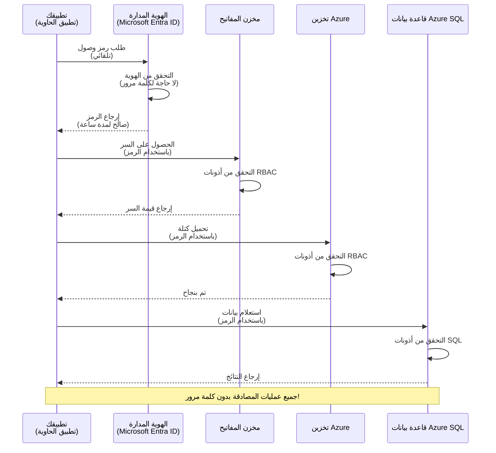
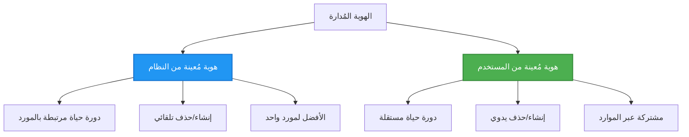

# أنماط المصادقة والهوية المُدارة

⏱️ **الوقت المقدر**: 45-60 دقيقة | 💰 **تأثير التكلفة**: مجاني (لا تكاليف إضافية) | ⭐ **التعقيد**: متوسط

**📚 مسار التعلم:**
- ← السابق: [إدارة التكوين](configuration.md) - إدارة متغيرات البيئة والأسرار
- 🎯 **أنت هنا**: المصادقة والأمان (الهوية المُدارة، Key Vault، أنماط آمنة)
- → التالي: [المشروع الأول](first-project.md) - أنشئ تطبيق AZD الأول الخاص بك
- 🏠 [الصفحة الرئيسية للدورة](../../README.md)

---

## ما ستتعلم

بإكمال هذا الدرس، سوف:
- فهم أنماط المصادقة في Azure (المفاتيح، سلاسل الاتصال، الهوية المُدارة)
- تنفيذ **الهوية المُدارة** للمصادقة بدون كلمات مرور
- تأمين الأسرار باستخدام تكامل **Azure Key Vault**
- تكوين **التحكم في الوصول القائم على الأدوار (RBAC)** لنشر AZD
- تطبيق أفضل ممارسات الأمان في Container Apps وخدمات Azure
- الانتقال من المصادقة المعتمدة على المفاتيح إلى المصادقة المعتمدة على الهوية

## لماذا تُهم الهوية المُدارة

### المشكلة: المصادقة التقليدية

**قبل الهوية المُدارة:**
```javascript
// ❌ خطر أمني: أسرار مضمّنة في الشيفرة
const connectionString = "Server=mydb.database.windows.net;User=admin;Password=P@ssw0rd123";
const storageKey = "xK7mN9pQ2wR5tY8uI0oP3aS6dF1gH4jK...";
const cosmosKey = "C2x7B9n4M1p8Q5w3E6r0T2y5U8i1O4p7...";
```

**المشاكل:**
- 🔴 **الأسرار المكشوفة** في الشفرة، ملفات التكوين، متغيرات البيئة
- 🔴 **تدوير بيانات الاعتماد** يتطلب تغييرات في الشفرة وإعادة النشر
- 🔴 **كابوس التدقيق** - من الذي وصل لأي شيء ومتى؟
- 🔴 **التشتت** - الأسرار مبعثرة عبر أنظمة متعددة
- 🔴 **مخاطر الامتثال** - يفشل في تدقيقات الأمان

### الحل: الهوية المُدارة

**بعد الهوية المُدارة:**
```javascript
// ✅ آمن: لا أسرار في الكود
const credential = new DefaultAzureCredential();
const client = new BlobServiceClient(
  "https://mystorageaccount.blob.core.windows.net",
  credential  // يتولى Azure المصادقة تلقائيًا
);
```

**الفوائد:**
- ✅ **لا أسرار** في الشفرة أو التكوين
- ✅ **تدوير تلقائي** - Azure يتعامل معه
- ✅ **سجل تدقيق كامل** في سجلات Microsoft Entra ID
- ✅ **أمان مركزي** - الإدارة عبر بوابة Azure
- ✅ **جاهز للامتثال** - يفي بمعايير الأمان

**تشبيه**: المصادقة التقليدية تشبه حمل مفاتيح فعلية متعددة لأبواب مختلفة. الهوية المُدارة تشبه شارة أمان تمنح الوصول تلقائيًا بناءً على هويتك—لا مفاتيح لتضيع أو تُنسخ أو تُدوّر.

---

## نظرة عامة على المعمارية

### تدفق المصادقة بالهوية المُدارة


```mermaid
sequenceDiagram
    participant App as تطبيقك<br/>(تطبيق الحاوية)
    participant MI as الهوية المدارة<br/>(Microsoft Entra ID)
    participant KV as مخزن المفاتيح
    participant Storage as تخزين Azure
    participant DB as قاعدة بيانات Azure SQL
    
    App->>MI: طلب رمز وصول<br/>(تلقائي)
    MI->>MI: التحقق من الهوية<br/>(لا حاجة لكلمة مرور)
    MI-->>App: إرجاع الرمز<br/>(صالح لمدة ساعة)
    
    App->>KV: الحصول على السر<br/>(باستخدام الرمز)
    KV->>KV: التحقق من أذونات RBAC
    KV-->>App: إرجاع قيمة السر
    
    App->>Storage: تحميل كتلة<br/>(باستخدام الرمز)
    Storage->>Storage: التحقق من أذونات RBAC
    Storage-->>App: تم بنجاح
    
    App->>DB: استعلام بيانات<br/>(باستخدام الرمز)
    DB->>DB: التحقق من أذونات SQL
    DB-->>App: إرجاع النتائج
    
    Note over App,DB: جميع عمليات المصادقة بدون كلمة مرور!
```

### أنواع الهويات المُدارة


```mermaid
graph TB
    MI[الهوية المُدارة]
    SystemAssigned[هوية مُعينة من النظام]
    UserAssigned[هوية مُعينة من المستخدم]
    
    MI --> SystemAssigned
    MI --> UserAssigned
    
    SystemAssigned --> SA1[دورة حياة مرتبطة بالمورد]
    SystemAssigned --> SA2[إنشاء/حذف تلقائي]
    SystemAssigned --> SA3[الأفضل لمورد واحد]
    
    UserAssigned --> UA1[دورة حياة مستقلة]
    UserAssigned --> UA2[إنشاء/حذف يدوي]
    UserAssigned --> UA3[مشتركة عبر الموارد]
    
    style SystemAssigned fill:#2196F3,stroke:#1976D2,stroke-width:2px,color:#fff
    style UserAssigned fill:#4CAF50,stroke:#388E3C,stroke-width:2px,color:#fff
```

| الخدمة | معينة للنظام | معينة للمستخدم |
|---------|----------------|---------------|
| **دورة الحياة** | مربوطة بالمورد | مستقلة |
| **الإنشاء** | تلقائي مع المورد | إنشاء يدوي |
| **الحذف** | تحذف مع المورد | تستمر بعد حذف المورد |
| **المشاركة** | مورد واحد فقط | موارد متعددة |
| **حالة الاستخدام** | سيناريوهات بسيطة | سيناريوهات معقدة متعددة الموارد |
| **إعداد افتراضي لـ AZD** | ✅ موصى به | اختياري |

---

## المتطلبات المسبقة

### الأدوات المطلوبة

يجب أن تكون قد قمت بتثبيت ما يلي من الدروس السابقة:

```bash
# تحقق من Azure Developer CLI
azd version
# ✅ المتوقع: إصدار azd 1.0.0 أو أعلى

# تحقق من Azure CLI
az --version
# ✅ المتوقع: إصدار azure-cli 2.50.0 أو أعلى
```

### متطلبات Azure

- اشتراك Azure نشط
- الأذونات لـ:
  - إنشاء هويات مُدارة
  - تعيين أدوار RBAC
  - إنشاء موارد Key Vault
  - نشر Container Apps

### المتطلبات المعرفية

يجب أن تكون قد أكملت:
- [دليل التثبيت](installation.md) - إعداد AZD
- [أساسيات AZD](azd-basics.md) - المفاهيم الأساسية
- [إدارة التكوين](configuration.md) - متغيرات البيئة

---

## الدرس 1: فهم أنماط المصادقة

### النمط 1: سلاسل الاتصال (تقليدية - تجنّب)

**كيف يعمل:**
```bash
# سلسلة الاتصال تحتوي على بيانات الاعتماد
STORAGE_CONNECTION_STRING="DefaultEndpointsProtocol=https;AccountName=myaccount;AccountKey=xK7mN9pQ2wR5..."
COSMOS_CONNECTION_STRING="AccountEndpoint=https://myaccount.documents.azure.com:443/;AccountKey=C2x7..."
SQL_CONNECTION_STRING="Server=myserver.database.windows.net;User=admin;Password=P@ssw0rd..."
```

**المشاكل:**
- ❌ الأسرار مرئية في متغيرات البيئة
- ❌ يتم تسجيلها في أنظمة النشر
- ❌ صعبة التدوير
- ❌ لا يوجد سجل تدقيق للوصول

**متى تُستخدم:** فقط للتطوير المحلي، وليس في الإنتاج أبداً.

---

### النمط 2: مراجع Key Vault (أفضل)

**كيف يعمل:**
```bicep
// Store secret in Key Vault
resource keyVault 'Microsoft.KeyVault/vaults@2023-02-01' = {
  name: 'mykv'
  properties: {
    enableRbacAuthorization: true
  }
}

// Reference in Container App
env: [
  {
    name: 'STORAGE_KEY'
    secretRef: 'storage-key'  // References Key Vault
  }
]
```

**الفوائد:**
- ✅ تُخزن الأسرار بأمان في Key Vault
- ✅ إدارة أسرار مركزية
- ✅ تدوير بدون تغييرات في الشفرة

**القيود:**
- ⚠️ لا تزال تستخدم مفاتيح/كلمات مرور
- ⚠️ تحتاج لإدارة وصول Key Vault

**متى تُستخدم:** خطوة انتقالية من سلاسل الاتصال إلى الهوية المُدارة.

---

### النمط 3: الهوية المُدارة (أفضل ممارسة)

**كيف يعمل:**
```bicep
// Enable managed identity
resource containerApp 'Microsoft.App/containerApps@2023-05-01' = {
  name: 'myapp'
  identity: {
    type: 'SystemAssigned'  // Automatically creates identity
  }
}

// Grant permissions
resource roleAssignment 'Microsoft.Authorization/roleAssignments@2022-04-01' = {
  scope: storageAccount
  properties: {
    roleDefinitionId: storageBlobDataContributorRole
    principalId: containerApp.identity.principalId
  }
}
```

**شفرة التطبيق:**
```javascript
// لا حاجة إلى أسرار!
const { DefaultAzureCredential } = require('@azure/identity');
const { BlobServiceClient } = require('@azure/storage-blob');

const credential = new DefaultAzureCredential();
const blobServiceClient = new BlobServiceClient(
  'https://mystorageaccount.blob.core.windows.net',
  credential
);
```

**الفوائد:**
- ✅ لا أسرار في الشفرة/التكوين
- ✅ تدوير بيانات الاعتماد تلقائيًا
- ✅ سجل تدقيق كامل
- ✅ أذونات قائمة على RBAC
- ✅ جاهز للامتثال

**متى تُستخدم:** دائماً، لتطبيقات الإنتاج.

---

### النمط 4: Service Principals (CI/CD & Automation)

الهوية المُدارة هي المعيار الذهبي *للموارد التي تعمل داخل Azure*. ولكن ماذا عن الأشياء التي تعمل **خارج** Azure—مثل خط أنابيب CI/CD على عامل بناء، أو سكربت على حاسوبك المحمول لا يمكنه استخدام تسجيل الدخول التفاعلي؟ هنا يأتي دور **service principal**: هوية غير بشرية تحتوي على بيانات اعتماد خاصة بها يمكن لعملية مؤتمتة تسجيل الدخول بها.

**كيف يعمل:**

أنشئ service principal ضمن مجموعة موارد (أقل امتيازات):

```bash
az ad sp create-for-rbac \
  --name "myapp-cicd" \
  --role contributor \
  --scopes /subscriptions/<sub-id>/resourceGroups/<rg-name>
```

سيطبع هذا معرف العميل (client ID)، وسر العميل (client secret)، ومعرّف المستأجر (tenant ID). يمكن لـ azd تسجيل الدخول بها دون تفاعل:

```bash
azd auth login \
  --client-id "<appId>" \
  --client-secret "<password>" \
  --tenant-id "<tenant>"
```

**فضلًا استخدم بيانات اعتماد موحّدة (OIDC) بدلاً من الأسرار.** بدلاً من سر عميل طويل الأمد، قم بتكوين بيانات اعتماد موحّدة حتى يتبادل خط الأنابيب رمزًا قصير العمر—لا سر يمكن تسريبه أو تدويره:

```bash
azd auth login \
  --client-id "<appId>" \
  --federated-credential-provider "github" \
  --tenant-id "<tenant>"
```

> `azd pipeline config` يكوّن هذا تلقائيًا لك. راجع إرشادات CI/CD في [الفصل 8](../chapter-08-production/production-ai-practices.md).

**الفوائد:**
- ✅ يعمل خارج Azure (عوامل البناء، البنية المحلية، سُحُب أخرى)
- ✅ يمكن تقييده إلى مجموعة موارد واحدة بدور واحد
- ✅ النسخة الموحّدة (OIDC) لا تستخدم أي سر مخزن

**المقايضات:**
- ⚠️ النسخة المعتمدة على الأسرار تتطلب تخزينًا وتدويرًا حذرًا
- ⚠️ سر مسرَّب يمنح ما يمكن للـ SP فعله—اجعل النطاقات ضيقة

**متى تُستخدم:** خطوط أنابيب CI/CD والأتمتة التي لا يمكنها استخدام الهوية المُدارة. فَضِّل دائمًا النسخة **الموحّدة/OIDC** على سر العميل، وفضّل الهوية المُدارة كلما كان عبء العمل يعمل داخل Azure.

**تخزين بيانات الاعتماد بأمان:**
- لا تلتزم الأسرار أبداً—استخدم مخزن الأسرار في خط أنابيبك (GitHub Actions secrets، مجموعات متغيرات Azure DevOps / Key Vault).
- قيّد SP إلى أقل دور ومجموعة موارد يحتاجها.
- حدد انتهاء صلاحية ودوّرها، أو تخلّص من السر تمامًا باستخدام OIDC.

---

## الدرس 2: تنفيذ الهوية المُدارة مع AZD

### التنفيذ خطوة بخطوة

دعنا نبني تطبيق Container App آمنًا يستخدم الهوية المُدارة للوصول إلى Azure Storage وKey Vault.

### هيكل المشروع

```
secure-app/
├── azure.yaml                 # AZD configuration
├── infra/
│   ├── main.bicep            # Main infrastructure
│   ├── core/
│   │   ├── identity.bicep    # Managed identity setup
│   │   ├── keyvault.bicep    # Key Vault configuration
│   │   └── storage.bicep     # Storage with RBAC
│   └── app/
│       └── container-app.bicep
└── src/
    ├── app.js                # Application code
    ├── package.json
    └── Dockerfile
```

### 1. تكوين AZD (azure.yaml)

```yaml
name: secure-app
metadata:
  template: secure-app@1.0.0

services:
  api:
    project: ./src
    language: js
    host: containerapp

# Enable managed identity (AZD handles this automatically)
```

### 2. البنية التحتية: تفعيل الهوية المُدارة

**الملف: `infra/main.bicep`**

```bicep
targetScope = 'subscription'

param environmentName string
param location string = 'eastus'

var tags = { 'azd-env-name': environmentName }

// Resource group
resource rg 'Microsoft.Resources/resourceGroups@2021-04-01' = {
  name: 'rg-${environmentName}'
  location: location
  tags: tags
}

// Storage Account
module storage './core/storage.bicep' = {
  name: 'storage'
  scope: rg
  params: {
    name: 'st${uniqueString(rg.id)}'
    location: location
    tags: tags
  }
}

// Key Vault
module keyVault './core/keyvault.bicep' = {
  name: 'keyvault'
  scope: rg
  params: {
    name: 'kv-${uniqueString(rg.id)}'
    location: location
    tags: tags
  }
}

// Container App with Managed Identity
module containerApp './app/container-app.bicep' = {
  name: 'container-app'
  scope: rg
  params: {
    name: 'ca-${environmentName}'
    location: location
    tags: tags
    storageAccountName: storage.outputs.name
    keyVaultName: keyVault.outputs.name
  }
}

// Grant Container App access to Storage
module storageRoleAssignment './core/role-assignment.bicep' = {
  name: 'storage-role'
  scope: rg
  params: {
    principalId: containerApp.outputs.identityPrincipalId
    roleDefinitionId: 'ba92f5b4-2d11-453d-a403-e96b0029c9fe'  // Storage Blob Data Contributor
    targetResourceId: storage.outputs.id
  }
}

// Grant Container App access to Key Vault
module kvRoleAssignment './core/role-assignment.bicep' = {
  name: 'kv-role'
  scope: rg
  params: {
    principalId: containerApp.outputs.identityPrincipalId
    roleDefinitionId: '4633458b-17de-408a-b874-0445c86b69e6'  // Key Vault Secrets User
    targetResourceId: keyVault.outputs.id
  }
}

// Outputs
output AZURE_STORAGE_ACCOUNT_NAME string = storage.outputs.name
output AZURE_KEY_VAULT_NAME string = keyVault.outputs.name
output APP_URL string = containerApp.outputs.url
```

### 3. تطبيق Container App بهوية مُعيّنة للنظام

**الملف: `infra/app/container-app.bicep`**

```bicep
param name string
param location string
param tags object = {}
param storageAccountName string
param keyVaultName string

resource containerApp 'Microsoft.App/containerApps@2023-05-01' = {
  name: name
  location: location
  tags: tags
  identity: {
    type: 'SystemAssigned'  // 🔑 Enable managed identity
  }
  properties: {
    configuration: {
      ingress: {
        external: true
        targetPort: 3000
      }
    }
    template: {
      containers: [
        {
          name: 'api'
          image: 'myregistry.azurecr.io/api:latest'
          resources: {
            cpu: json('0.5')
            memory: '1Gi'
          }
          env: [
            {
              name: 'AZURE_STORAGE_ACCOUNT_NAME'
              value: storageAccountName
            }
            {
              name: 'AZURE_KEY_VAULT_NAME'
              value: keyVaultName
            }
            // 🔑 No secrets - managed identity handles authentication!
          ]
        }
      ]
    }
  }
}

// Output the identity for RBAC assignments
output identityPrincipalId string = containerApp.identity.principalId
output id string = containerApp.id
output url string = 'https://${containerApp.properties.configuration.ingress.fqdn}'
```

### 4. وحدة تعيين أدوار RBAC

**الملف: `infra/core/role-assignment.bicep`**

```bicep
param principalId string
param roleDefinitionId string  // Azure built-in role ID
param targetResourceId string

resource roleAssignment 'Microsoft.Authorization/roleAssignments@2022-04-01' = {
  name: guid(principalId, roleDefinitionId, targetResourceId)
  scope: resourceId('Microsoft.Resources/resourceGroups', resourceGroup().name)
  properties: {
    roleDefinitionId: subscriptionResourceId('Microsoft.Authorization/roleDefinitions', roleDefinitionId)
    principalId: principalId
    principalType: 'ServicePrincipal'
  }
}

output id string = roleAssignment.id
```

### 5. شفرة التطبيق بالهوية المُدارة

**الملف: `src/app.js`**

```javascript
const express = require('express');
const { DefaultAzureCredential } = require('@azure/identity');
const { BlobServiceClient } = require('@azure/storage-blob');
const { SecretClient } = require('@azure/keyvault-secrets');

const app = express();
const PORT = process.env.PORT || 3000;

// 🔑 تهيئة بيانات الاعتماد (يعمل تلقائيًا مع الهوية المدارة)
const credential = new DefaultAzureCredential();

// إعداد تخزين Azure
const storageAccountName = process.env.AZURE_STORAGE_ACCOUNT_NAME;
const blobServiceClient = new BlobServiceClient(
  `https://${storageAccountName}.blob.core.windows.net`,
  credential  // لا حاجة إلى مفاتيح!
);

// إعداد Key Vault
const keyVaultName = process.env.AZURE_KEY_VAULT_NAME;
const secretClient = new SecretClient(
  `https://${keyVaultName}.vault.azure.net`,
  credential  // لا حاجة إلى مفاتيح!
);

// فحص الصحة
app.get('/health', (req, res) => {
  res.json({ status: 'healthy', authentication: 'managed-identity' });
});

// رفع ملف إلى تخزين Blob
app.post('/upload', async (req, res) => {
  try {
    const containerClient = blobServiceClient.getContainerClient('uploads');
    await containerClient.createIfNotExists();
    
    const blobName = `file-${Date.now()}.txt`;
    const blockBlobClient = containerClient.getBlockBlobClient(blobName);
    
    await blockBlobClient.upload('Hello from managed identity!', 30);
    
    res.json({
      success: true,
      blobName: blobName,
      message: 'File uploaded using managed identity!'
    });
  } catch (error) {
    console.error('Upload error:', error);
    res.status(500).json({ error: error.message });
  }
});

// استرداد سر من Key Vault
app.get('/secret/:name', async (req, res) => {
  try {
    const secretName = req.params.name;
    const secret = await secretClient.getSecret(secretName);
    
    res.json({
      name: secretName,
      value: secret.value,
      message: 'Secret retrieved using managed identity!'
    });
  } catch (error) {
    console.error('Secret error:', error);
    res.status(500).json({ error: error.message });
  }
});

// سرد حاويات Blob (يوضح إمكانية الوصول للقراءة)
app.get('/containers', async (req, res) => {
  try {
    const containers = [];
    for await (const container of blobServiceClient.listContainers()) {
      containers.push(container.name);
    }
    
    res.json({
      containers: containers,
      count: containers.length,
      message: 'Containers listed using managed identity!'
    });
  } catch (error) {
    console.error('List error:', error);
    res.status(500).json({ error: error.message });
  }
});

app.listen(PORT, () => {
  console.log(`Secure API listening on port ${PORT}`);
  console.log('Authentication: Managed Identity (passwordless)');
});
```

**الملف: `src/package.json`**

```json
{
  "name": "secure-app",
  "version": "1.0.0",
  "dependencies": {
    "express": "^4.18.2",
    "@azure/identity": "^4.0.0",
    "@azure/storage-blob": "^12.17.0",
    "@azure/keyvault-secrets": "^4.7.0"
  },
  "scripts": {
    "start": "node app.js"
  }
}
```

### 6. النشر والاختبار

```bash
# تهيئة بيئة AZD
azd init

# نشر البنية التحتية والتطبيق
azd up

# الحصول على عنوان URL للتطبيق
APP_URL=$(azd env get-values | grep APP_URL | cut -d '=' -f2 | tr -d '"')

# اختبار فحص الحالة الصحية
curl $APP_URL/health
```

**✅ الإخراج المتوقع:**
```json
{
  "status": "healthy",
  "authentication": "managed-identity"
}
```

**اختبار تحميل blob:**
```bash
curl -X POST $APP_URL/upload
```

**✅ الإخراج المتوقع:**
```json
{
  "success": true,
  "blobName": "file-1700404800000.txt",
  "message": "File uploaded using managed identity!"
}
```

**اختبار سرد الحاويات:**
```bash
curl $APP_URL/containers
```

**✅ الإخراج المتوقع:**
```json
{
  "containers": ["uploads"],
  "count": 1,
  "message": "Containers listed using managed identity!"
}
```

---

## أدوار RBAC الشائعة في Azure

### معرّفات الأدوار المضمنة للهوية المُدارة

| الخدمة | اسم الدور | معرّف الدور | الأذونات |
|---------|-----------|---------|-------------|
| **التخزين** | Storage Blob Data Reader | `2a2b9908-6b94-4a3d-8e5a-a7d8f8cc8a12` | قراءة blobs والحاويات |
| **التخزين** | Storage Blob Data Contributor | `ba92f5b4-2d11-453d-a403-e96b0029c9fe` | قراءة، كتابة، حذف blobs |
| **التخزين** | Storage Queue Data Contributor | `974c5e8b-45b9-4653-ba55-5f855dd0fb88` | قراءة، كتابة، حذف رسائل الطابور |
| **Key Vault** | Key Vault Secrets User | `4633458b-17de-408a-b874-0445c86b69e6` | قراءة الأسرار |
| **Key Vault** | Key Vault Secrets Officer | `b86a8fe4-44ce-4948-aee5-eccb2c155cd7` | قراءة، كتابة، حذف الأسرار |
| **Cosmos DB** | Cosmos DB Built-in Data Reader | `00000000-0000-0000-0000-000000000001` | قراءة بيانات Cosmos DB |
| **Cosmos DB** | Cosmos DB Built-in Data Contributor | `00000000-0000-0000-0000-000000000002` | قراءة وكتابة بيانات Cosmos DB |
| **قاعدة بيانات SQL** | SQL DB Contributor | `9b7fa17d-e63e-47b0-bb0a-15c516ac86ec` | إدارة قواعد بيانات SQL |
| **Service Bus** | Azure Service Bus Data Owner | `090c5cfd-751d-490a-894a-3ce6f1109419` | إرسال، استقبال، إدارة الرسائل |

### كيفية العثور على معرّفات الأدوار

```bash
# عرض جميع الأدوار المدمجة
az role definition list --query "[].{Name:roleName, ID:name}" --output table

# البحث عن دور محدد
az role definition list --query "[?contains(roleName, 'Storage Blob')].{Name:roleName, ID:name}" --output table

# الحصول على تفاصيل الدور
az role definition list --name "Storage Blob Data Contributor"
```

---

## تمارين عملية

### التمرين 1: تفعيل الهوية المُدارة لتطبيق موجود ⭐⭐ (متوسط)

**الهدف**: إضافة هوية مُدارة إلى نشر Container App موجود

**السيناريو**: لديك Container App يستخدم سلاسل الاتصال. حوّله إلى الهوية المُدارة.

**نقطة البداية**: Container App بهذا التكوين:

```bicep
// ❌ Current: Using connection string
env: [
  {
    name: 'STORAGE_CONNECTION_STRING'
    secretRef: 'storage-connection'
  }
]
```

**الخطوات**:

1. **تفعيل الهوية المُدارة في Bicep:**

```bicep
resource containerApp 'Microsoft.App/containerApps@2023-05-01' = {
  name: 'myapp'
  identity: {
    type: 'SystemAssigned'  // Add this
  }
  // ... rest of configuration
}
```

2. **منح وصول للتخزين:**

```bicep
// Get storage account reference
resource storageAccount 'Microsoft.Storage/storageAccounts@2023-01-01' existing = {
  name: storageAccountName
}

// Assign role
resource roleAssignment 'Microsoft.Authorization/roleAssignments@2022-04-01' = {
  name: guid(containerApp.id, 'ba92f5b4-2d11-453d-a403-e96b0029c9fe', storageAccount.id)
  scope: storageAccount
  properties: {
    roleDefinitionId: subscriptionResourceId('Microsoft.Authorization/roleDefinitions', 'ba92f5b4-2d11-453d-a403-e96b0029c9fe')
    principalId: containerApp.identity.principalId
    principalType: 'ServicePrincipal'
  }
}
```

3. **تحديث شفرة التطبيق:**

**قبل (سلسلة الاتصال):**
```javascript
const { BlobServiceClient } = require('@azure/storage-blob');

const blobServiceClient = BlobServiceClient.fromConnectionString(
  process.env.STORAGE_CONNECTION_STRING
);
```

**بعد (الهوية المُدارة):**
```javascript
const { DefaultAzureCredential } = require('@azure/identity');
const { BlobServiceClient } = require('@azure/storage-blob');

const credential = new DefaultAzureCredential();
const blobServiceClient = new BlobServiceClient(
  `https://${process.env.STORAGE_ACCOUNT_NAME}.blob.core.windows.net`,
  credential
);
```

4. **تحديث متغيرات البيئة:**

```bicep
env: [
  {
    name: 'STORAGE_ACCOUNT_NAME'
    value: storageAccountName  // Just the name, no secrets!
  }
  // Remove STORAGE_CONNECTION_STRING
]
```

5. **النشر والاختبار:**

```bash
# إعادة النشر
azd up

# اختبر أنه لا يزال يعمل
curl https://myapp.azurecontainerapps.io/upload
```

**✅ معايير النجاح:**
- ✅ يتم نشر التطبيق بدون أخطاء
- ✅ عمليات التخزين تعمل (تحميل، سرد، تنزيل)
- ✅ لا توجد سلاسل اتصال في متغيرات البيئة
- ✅ الهوية مرئية في بوابة Azure ضمن لوح "Identity"

**التحقق:**

```bash
# تحقق من تمكين الهوية المُدارة
az containerapp show \
  --name myapp \
  --resource-group rg-myapp \
  --query "identity.type"
# ✅ متوقع: "SystemAssigned"

# تحقق من تعيين الدور
az role assignment list \
  --assignee $(az containerapp show --name myapp --resource-group rg-myapp --query "identity.principalId" -o tsv) \
  --scope /subscriptions/{sub-id}/resourceGroups/rg-myapp/providers/Microsoft.Storage/storageAccounts/mystorageaccount
# ✅ متوقع: يعرض دور "Storage Blob Data Contributor"
```

**الوقت**: 20-30 دقيقة

---

### التمرين 2: وصول متعدد الخدمات بهوية مخصصة للمستخدم ⭐⭐⭐ (متقدم)

**الهدف**: إنشاء هوية مخصصة للمستخدم مشتركة عبر عدة Container Apps

**السيناريو**: لديك 3 خدمات مصغرة تحتاج جميعها الوصول إلى نفس حساب التخزين وKey Vault.

**الخطوات**:

1. **إنشاء هوية مخصصة للمستخدم:**

**الملف: `infra/core/identity.bicep`**

```bicep
param name string
param location string
param tags object = {}

resource userAssignedIdentity 'Microsoft.ManagedIdentity/userAssignedIdentities@2023-01-31' = {
  name: name
  location: location
  tags: tags
}

output id string = userAssignedIdentity.id
output principalId string = userAssignedIdentity.properties.principalId
output clientId string = userAssignedIdentity.properties.clientId
```

2. **تعيين الأدوار إلى الهوية المخصصة:**

```bicep
// In main.bicep
module userIdentity './core/identity.bicep' = {
  name: 'user-identity'
  scope: rg
  params: {
    name: 'id-${environmentName}'
    location: location
    tags: tags
  }
}

// Grant Storage access
resource storageRoleAssignment 'Microsoft.Authorization/roleAssignments@2022-04-01' = {
  name: guid(userIdentity.outputs.principalId, 'storage-contributor')
  scope: storageAccount
  properties: {
    roleDefinitionId: subscriptionResourceId('Microsoft.Authorization/roleDefinitions', 'ba92f5b4-2d11-453d-a403-e96b0029c9fe')
    principalId: userIdentity.outputs.principalId
    principalType: 'ServicePrincipal'
  }
}

// Grant Key Vault access
resource kvRoleAssignment 'Microsoft.Authorization/roleAssignments@2022-04-01' = {
  name: guid(userIdentity.outputs.principalId, 'kv-secrets-user')
  scope: keyVault
  properties: {
    roleDefinitionId: subscriptionResourceId('Microsoft.Authorization/roleDefinitions', '4633458b-17de-408a-b874-0445c86b69e6')
    principalId: userIdentity.outputs.principalId
    principalType: 'ServicePrincipal'
  }
}
```

3. **تعيين الهوية إلى عدة Container Apps:**

```bicep
resource apiGateway 'Microsoft.App/containerApps@2023-05-01' = {
  name: 'api-gateway'
  identity: {
    type: 'UserAssigned'
    userAssignedIdentities: {
      '${userIdentity.outputs.id}': {}
    }
  }
  // ... rest of config
}

resource productService 'Microsoft.App/containerApps@2023-05-01' = {
  name: 'product-service'
  identity: {
    type: 'UserAssigned'
    userAssignedIdentities: {
      '${userIdentity.outputs.id}': {}
    }
  }
  // ... rest of config
}

resource orderService 'Microsoft.App/containerApps@2023-05-01' = {
  name: 'order-service'
  identity: {
    type: 'UserAssigned'
    userAssignedIdentities: {
      '${userIdentity.outputs.id}': {}
    }
  }
  // ... rest of config
}
```

4. **شفرة التطبيق (جميع الخدمات تستخدم نفس النمط):**

```javascript
const { DefaultAzureCredential, ManagedIdentityCredential } = require('@azure/identity');

// لهوية مُعيّنة من قِبَل المستخدم، حدد معرف العميل
const credential = new ManagedIdentityCredential(
  process.env.AZURE_CLIENT_ID  // معرف عميل الهوية المُعيّنة من قِبَل المستخدم
);

// أو استخدم DefaultAzureCredential (يكتشف تلقائيًا)
const credential = new DefaultAzureCredential();

const blobServiceClient = new BlobServiceClient(
  `https://${process.env.STORAGE_ACCOUNT_NAME}.blob.core.windows.net`,
  credential
);
```

5. **النشر والتحقق:**

```bash
azd up

# اختبار أن جميع الخدمات قادرة على الوصول إلى التخزين
curl https://api-gateway.azurecontainerapps.io/upload
curl https://product-service.azurecontainerapps.io/upload
curl https://order-service.azurecontainerapps.io/upload
```

**✅ معايير النجاح:**
- ✅ هوية واحدة مشتركة عبر 3 خدمات
- ✅ جميع الخدمات يمكنها الوصول إلى التخزين وKey Vault
- ✅ تستمر الهوية إذا حذفت خدمة واحدة
- ✅ إدارة أذونات مركزية

**فوائد الهوية المخصصة للمستخدم:**
- هوية واحدة للإدارة
- أذونات متسقة عبر الخدمات
- تستمر بعد حذف الخدمة
- أفضل للهندسات المعقدة

**الوقت**: 30-40 دقيقة

---

### التمرين 3: تنفيذ تدوير أسرار Key Vault ⭐⭐⭐ (متقدم)

**الهدف**: تخزين مفاتيح واجهات برمجة التطبيقات من طرف ثالث في Key Vault والوصول إليها باستخدام الهوية المُدارة

**السيناريو**: يحتاج تطبيقك لاستدعاء API خارجي (OpenAI، Stripe، SendGrid) الذي يتطلب مفاتيح API.

**الخطوات**:

1. **إنشاء Key Vault مع RBAC:**

**الملف: `infra/core/keyvault.bicep`**

```bicep
param name string
param location string
param tags object = {}

resource keyVault 'Microsoft.KeyVault/vaults@2023-02-01' = {
  name: name
  location: location
  tags: tags
  properties: {
    enableRbacAuthorization: true  // Use RBAC instead of access policies
    sku: {
      family: 'A'
      name: 'standard'
    }
    tenantId: subscription().tenantId
    enableSoftDelete: true
    softDeleteRetentionInDays: 90
  }
}

// Allow Container App to read secrets
output id string = keyVault.id
output name string = keyVault.name
output uri string = keyVault.properties.vaultUri
```

2. **تخزين الأسرار في Key Vault:**

```bash
# الحصول على اسم Key Vault
KV_NAME=$(azd env get-values | grep AZURE_KEY_VAULT_NAME | cut -d '=' -f2 | tr -d '"')

# تخزين مفاتيح واجهات برمجة التطبيقات لجهات خارجية
az keyvault secret set \
  --vault-name $KV_NAME \
  --name "OpenAI-ApiKey" \
  --value "sk-proj-xxxxxxxxxxxxx"

az keyvault secret set \
  --vault-name $KV_NAME \
  --name "Stripe-ApiKey" \
  --value "sk_live_xxxxxxxxxxxxx"

az keyvault secret set \
  --vault-name $KV_NAME \
  --name "SendGrid-ApiKey" \
  --value "SG.xxxxxxxxxxxxx"
```

3. **شفرة التطبيق لاسترجاع الأسرار:**

**الملف: `src/config.js`**

```javascript
const { DefaultAzureCredential } = require('@azure/identity');
const { SecretClient } = require('@azure/keyvault-secrets');

class Config {
  constructor() {
    this.credential = new DefaultAzureCredential();
    this.secretClient = new SecretClient(
      `https://${process.env.AZURE_KEY_VAULT_NAME}.vault.azure.net`,
      this.credential
    );
    this.cache = {};
  }

  async getSecret(secretName) {
    // تحقق من ذاكرة التخزين المؤقت أولاً
    if (this.cache[secretName]) {
      return this.cache[secretName];
    }

    try {
      const secret = await this.secretClient.getSecret(secretName);
      this.cache[secretName] = secret.value;
      console.log(`✅ Retrieved secret: ${secretName}`);
      return secret.value;
    } catch (error) {
      console.error(`❌ Failed to get secret ${secretName}:`, error.message);
      throw error;
    }
  }

  async getOpenAIKey() {
    return this.getSecret('OpenAI-ApiKey');
  }

  async getStripeKey() {
    return this.getSecret('Stripe-ApiKey');
  }

  async getSendGridKey() {
    return this.getSecret('SendGrid-ApiKey');
  }
}

module.exports = new Config();
```

4. **استخدام الأسرار في التطبيق:**

**الملف: `src/app.js`**

```javascript
const express = require('express');
const config = require('./config');
const { OpenAI } = require('openai');

const app = express();

// تهيئة OpenAI باستخدام المفتاح من مخزن المفاتيح
let openaiClient;

async function initializeServices() {
  const openaiKey = await config.getOpenAIKey();
  openaiClient = new OpenAI({ apiKey: openaiKey });
  console.log('✅ Services initialized with secrets from Key Vault');
}

// استدعاء عند بدء التشغيل
initializeServices().catch(console.error);

app.post('/chat', async (req, res) => {
  try {
    const completion = await openaiClient.chat.completions.create({
      model: 'gpt-4.1',
      messages: [{ role: 'user', content: 'Hello!' }]
    });
    
    res.json({
      response: completion.choices[0].message.content,
      authentication: 'Key from Key Vault via Managed Identity'
    });
  } catch (error) {
    res.status(500).json({ error: error.message });
  }
});

app.listen(3000, () => {
  console.log('Secure API with Key Vault integration running');
});
```

5. **النشر والاختبار:**

```bash
azd up

# اختبار عمل مفاتيح API
curl -X POST https://myapp.azurecontainerapps.io/chat \
  -H "Content-Type: application/json" \
  -d '{"message":"Hello AI"}'
```

**✅ معايير النجاح:**
- ✅ لا مفاتيح API في الكود أو متغيرات البيئة
- ✅ التطبيق يسترجع المفاتيح من Key Vault
- ✅ واجهات برمجة تطبيقات الطرف الثالث تعمل بشكل صحيح
- ✅ يمكن تدوير المفاتيح دون تغييرات في الكود

**تدوير سِرّ:**

```bash
# تحديث السر في Key Vault
az keyvault secret set \
  --vault-name $KV_NAME \
  --name "OpenAI-ApiKey" \
  --value "sk-proj-NEW_KEY_HERE"

# أعد تشغيل التطبيق لاستخدام المفتاح الجديد
az containerapp revision restart \
  --name myapp \
  --resource-group rg-myapp
```

**الوقت**: 25-35 دقيقة

---

## نقطة التحقق المعرفي

### 1. أنماط المصادقة ✓

اختبر فهمك:

- [ ] **السؤال 1**: ما هي الأنماط الثلاثة الرئيسية للمصادقة؟ 
  - **الإجابة**: سلاسل الاتصال (قديمة)، مراجع Key Vault (انتقال)، الهوية المُدارة (الأفضل)

- [ ] **السؤال 2**: لماذا الهوية المُدارة أفضل من سلاسل الاتصال؟
  - **الإجابة**: لا أسرار في الكود، تدوير تلقائي، سجل تدقيق كامل، أذونات RBAC

- [ ] **السؤال 3**: متى تستخدم هوية مخصصة للمستخدم بدلاً من هوية مُعينة للنظام؟
  - **الإجابة**: عند مشاركة الهوية عبر موارد متعددة أو عندما تكون دورة حياة الهوية مستقلة عن دورة حياة المورد

**التحقق العملي:**
```bash
# تحقق من نوع الهوية التي يستخدمها تطبيقك
az containerapp show \
  --name myapp \
  --resource-group rg-myapp \
  --query "identity.type"

# سرد جميع تعيينات الأدوار للهوية
az role assignment list \
  --assignee $(az containerapp show --name myapp --resource-group rg-myapp --query "identity.principalId" -o tsv)
```

---

### 2. RBAC والأذونات ✓

اختبر فهمك:

- [ ] **السؤال 1**: ما هو معرف الدور لـ "Storage Blob Data Contributor"؟
  - **الإجابة**: `ba92f5b4-2d11-453d-a403-e96b0029c9fe`

- [ ] **السؤال 2**: ما الأذونات التي يقدمها "Key Vault Secrets User"؟
  - **الإجابة**: وصول للقراءة فقط إلى الأسرار (لا يمكن الإنشاء أو التحديث أو الحذف)

- [ ] **السؤال 3**: كيف تمنح تطبيق Container App وصولًا إلى Azure SQL؟
  - **الإجابة**: تعيين دور "SQL DB Contributor" أو تكوين مصادقة Microsoft Entra ID لـ SQL

**التحقق العملي:**
```bash
# العثور على دور محدد
az role definition list --name "Storage Blob Data Contributor"

# تحقق من الأدوار المعينة لهويتك
PRINCIPAL_ID=$(az containerapp show --name myapp --resource-group rg-myapp --query "identity.principalId" -o tsv)
az role assignment list --assignee $PRINCIPAL_ID --output table
```

---

### 3. تكامل Key Vault ✓

اختبر فهمك:

- [ ] **السؤال 1**: كيف تُمكّن RBAC على Key Vault بدلاً من سياسات الوصول؟
  - **الإجابة**: اضبط `enableRbacAuthorization: true` في Bicep

- [ ] **السؤال 2**: أي مكتبة في Azure SDK تتعامل مع مصادقة الهوية المُدارة؟
  - **الإجابة**: `@azure/identity` مع فئة `DefaultAzureCredential`

- [ ] **السؤال 3**: كم من الوقت تبقى أسرار Key Vault في ذاكرة التخزين المؤقت؟
  - **الإجابة**: يعتمد على التطبيق؛ نفّذ استراتيجية التخزين المؤقت الخاصة بك

**التحقق العملي:**
```bash
# اختبار الوصول إلى مخزن المفاتيح
az keyvault secret show \
  --vault-name $KV_NAME \
  --name "OpenAI-ApiKey" \
  --query "value"

# تحقق من تمكين RBAC
az keyvault show \
  --name $KV_NAME \
  --query "properties.enableRbacAuthorization"
# ✅ المتوقع: صحيح
```

---

## أفضل ممارسات الأمان

### ✅ افعل:

1. **استخدم دائمًا الهوية المُدارة في الإنتاج**
   ```bicep
   identity: {
     type: 'SystemAssigned'
   }
   ```

2. **استخدم أدوار RBAC بأقل امتياز ممكن**
   - استخدم "Reader" roles كلما أمكن
   - تجنّب "Owner" أو "Contributor" إلا إذا كانت ضرورية

3. **خزن مفاتيح الطرف الثالث في Key Vault**
   ```javascript
   const apiKey = await secretClient.getSecret('ThirdPartyApiKey');
   ```

4. **فعّل تسجيل التدقيق**
   ```bicep
   diagnosticSettings: {
     logs: [{ category: 'AuditEvent', enabled: true }]
   }
   ```

5. **استخدم هويات مختلفة للبيئات dev/staging/prod**
   ```bash
   azd env new dev
   azd env new staging
   azd env new prod
   ```

6. **دوّر الأسرار بانتظام**
   - ضع تواريخ انتهاء صلاحية على أسرار Key Vault
   - آتم عملية التدوير باستخدام Azure Functions

### ❌ لا تفعل:

1. **لا تُدرج الأسرار مباشرة في الكود**
   ```javascript
   // ❌ سيئ
   const apiKey = "sk-proj-xxxxxxxxxxxxx";
   ```

2. **لا تستخدم سلاسل الاتصال في البيئة الإنتاجية**
   ```javascript
   // سيئ ❌
   BlobServiceClient.fromConnectionString(process.env.STORAGE_CONNECTION_STRING)
   ```

3. **لا تمنح أذونات مفرطة**
   ```bicep
   // ❌ BAD - too much access
   roleDefinitionId: 'Owner'
   
   // ✅ GOOD - least privilege
   roleDefinitionId: 'Storage Blob Data Reader'
   ```

4. **لا تسجل الأسرار في السجلات**
   ```javascript
   // ❌ سيئ
   console.log('API Key:', apiKey);
   
   // ✅ جيد
   console.log('API Key retrieved successfully');
   ```

5. **لا تُشارك هويات الإنتاج عبر البيئات**
   ```bicep
   // ❌ BAD - same identity for dev and prod
   // ✅ GOOD - separate identities per environment
   ```

---

## دليل استكشاف الأخطاء وإصلاحها

### المشكلة: "Unauthorized" عند الوصول إلى Azure Storage

**الأعراض:**
```
Error: Unauthorized (403)
AuthorizationPermissionMismatch: This request is not authorized to perform this operation
```

**التشخيص:**

```bash
# تحقق مما إذا كانت الهوية المُدارة مُمكّنة
az containerapp show \
  --name myapp \
  --resource-group rg-myapp \
  --query "identity.type"
# ✅ المتوقع: "SystemAssigned" أو "UserAssigned"

# تحقق من تعيينات الأدوار
PRINCIPAL_ID=$(az containerapp show --name myapp --resource-group rg-myapp --query "identity.principalId" -o tsv)
az role assignment list --assignee $PRINCIPAL_ID

# المتوقع: يجب أن ترى "Storage Blob Data Contributor" أو دور مشابه
```

**الحلول:**

1. **امنح دور RBAC الصحيح:**
```bash
STORAGE_ID=$(az storage account show --name mystorageaccount --resource-group rg-myapp --query "id" -o tsv)
az role assignment create \
  --assignee $PRINCIPAL_ID \
  --role "Storage Blob Data Contributor" \
  --scope $STORAGE_ID
```

2. **انتظر الانتشار (قد يستغرق 5-10 دقائق):**
```bash
# تحقق من حالة تعيين الدور
az role assignment list --assignee $PRINCIPAL_ID --scope $STORAGE_ID
```

3. **تحقق من أن كود التطبيق يستخدم بيانات الاعتماد الصحيحة:**
```javascript
// تأكد من أنك تستخدم DefaultAzureCredential
const credential = new DefaultAzureCredential();
```

---

### المشكلة: رفض الوصول إلى Key Vault

**الأعراض:**
```
Error: Forbidden (403)
The user, group or application does not have secrets get permission
```

**التشخيص:**

```bash
# تحقق من تمكين التحكم في الوصول القائم على الدور (RBAC) لمخزن المفاتيح
az keyvault show \
  --name $KV_NAME \
  --query "properties.enableRbacAuthorization"
# ✅ المتوقع: صحيح

# تحقق من تعيينات الأدوار
az role assignment list \
  --assignee $PRINCIPAL_ID \
  --scope /subscriptions/{sub-id}/resourceGroups/rg-myapp/providers/Microsoft.KeyVault/vaults/$KV_NAME
```

**الحلول:**

1. **مكّن RBAC على Key Vault:**
```bash
az keyvault update \
  --name $KV_NAME \
  --enable-rbac-authorization true
```

2. **امنح دور Key Vault Secrets User:**
```bash
KV_ID=$(az keyvault show --name $KV_NAME --query "id" -o tsv)
az role assignment create \
  --assignee $PRINCIPAL_ID \
  --role "Key Vault Secrets User" \
  --scope $KV_ID
```

---

### المشكلة: فشل DefaultAzureCredential محليًا

**الأعراض:**
```
Error: DefaultAzureCredential failed to retrieve a token
CredentialUnavailableError: No credential available
```

**التشخيص:**

```bash
# تحقق مما إذا كنت قد سجلت الدخول
az account show

# تحقق من مصادقة Azure CLI
az ad signed-in-user show
```

**الحلول:**

1. **سجّل الدخول إلى Azure CLI:**
```bash
az login
```

2. **اضبط اشتراك Azure:**
```bash
az account set --subscription "Your Subscription Name"
```

3. **للتطوير المحلي، استخدم متغيرات البيئة:**
```bash
export AZURE_TENANT_ID="your-tenant-id"
export AZURE_CLIENT_ID="your-client-id"
export AZURE_CLIENT_SECRET="your-client-secret"
```

4. **أو استخدم بيانات اعتماد مختلفة محليًا:**
```javascript
const { DefaultAzureCredential, AzureCliCredential } = require('@azure/identity');

// استخدم AzureCliCredential للتطوير المحلي
const credential = process.env.NODE_ENV === 'production' 
  ? new DefaultAzureCredential()
  : new AzureCliCredential();
```

---

### المشكلة: يستغرق تعيين الدور وقتًا طويلاً للانتشار

**الأعراض:**
- تم تعيين الدور بنجاح
- ما زلت تحصل على أخطاء 403
- وصول متقطع (يعمل أحيانًا ولا يعمل أحيانًا)

**الشرح:**
تغييرات Azure RBAC قد تستغرق من 5 إلى 10 دقائق للانتشار عالميًا.

**الحل:**

```bash
# انتظر وحاول مرة أخرى
echo "Waiting for RBAC propagation..."
sleep 300  # انتظر 5 دقائق

# اختبر الوصول
curl https://myapp.azurecontainerapps.io/upload

# إذا استمر الفشل، أعد تشغيل التطبيق
az containerapp revision restart \
  --name myapp \
  --resource-group rg-myapp
```

---

## اعتبارات التكلفة

### تكاليف الهوية المُدارة

| المورد | التكلفة |
|----------|------|
| **الهوية المُدارة** | 🆓 **مجانًا** - بدون رسوم |
| **تعيينات أدوار RBAC** | 🆓 **مجانًا** - بدون رسوم |
| **طلبات رمز Microsoft Entra ID** | 🆓 **مجانًا** - مشمولة |
| **عمليات Key Vault** | $0.03 لكل 10,000 عملية |
| **تخزين Key Vault** | $0.024 لكل سر في الشهر |

الهوية المُدارة توفر المال عن طريق:
- ✅ التخلص من عمليات Key Vault لمصادقة الخدمة إلى الخدمة
- ✅ تقليل حوادث الأمان (لا تسرب بيانات اعتماد)
- ✅ تقليل العبء التشغيلي (لا تدوير يدوي)

مثال مقارنة التكاليف (شهريًا):

| السيناريو | سلاسل الاتصال | الهوية المُدارة | التوفير |
|----------|-------------------|-----------------|---------|
| تطبيق صغير (1M requests) | ~$50 (Key Vault + عمليات) | ~$0 | $50/شهر |
| تطبيق متوسط (10M requests) | ~$200 | ~$0 | $200/شهر |
| تطبيق كبير (100M requests) | ~$1,500 | ~$0 | $1,500/شهر |

---

## تعرّف أكثر

### الوثائق الرسمية
- [الهوية المُدارة في Azure](https://learn.microsoft.com/entra/identity/managed-identities-azure-resources/overview)
- [RBAC في Azure](https://learn.microsoft.com/azure/role-based-access-control/overview)
- [Key Vault في Azure](https://learn.microsoft.com/azure/key-vault/general/overview)
- [DefaultAzureCredential](https://learn.microsoft.com/dotnet/api/azure.identity.defaultazurecredential)

### وثائق SDK
- [@azure/identity (Node.js)](https://www.npmjs.com/package/@azure/identity)
- [Azure.Identity (C#)](https://www.nuget.org/packages/Azure.Identity/)
- [azure-identity (Python)](https://pypi.org/project/azure-identity/)

### الخطوات التالية في هذه الدورة
- ← السابق: [إدارة التكوين](configuration.md)
- → التالي: [المشروع الأول](first-project.md)
- 🏠 [الصفحة الرئيسية للدورة](../../README.md)

### أمثلة ذات صلة
- [مثال محادثة نماذج Microsoft Foundry](../../../../examples/azure-openai-chat) - يستخدم الهوية المُدارة لنماذج Microsoft Foundry
- [مثال الميكروسيرفيس](../../../../examples/microservices) - أنماط المصادقة متعددة الخدمات

---

## الملخص

**لقد تعلمت:**
- ✅ ثلاثة أنماط للمصادقة (سلاسل الاتصال، Key Vault، الهوية المُدارة)
- ✅ كيفية تمكين وتكوين الهوية المُدارة في AZD
- ✅ تعيينات أدوار RBAC لخدمات Azure
- ✅ تكامل Key Vault للأسرار من طرف ثالث
- ✅ الهويات المخصصة للمستخدم مقابل الهويات المعينة للنظام
- ✅ أفضل ممارسات الأمان واستكشاف الأخطاء وإصلاحها

**النقاط الرئيسية:**
1. **استخدم دائمًا الهوية المُدارة في الإنتاج** - لا أسرار، تدوير تلقائي
2. **استخدم أدوار RBAC بأقل امتياز ممكن** - امنح الأذونات الضرورية فقط
3. **خزن مفاتيح الطرف الثالث في Key Vault** - إدارة أسرار مركزية
4. **فصل الهويات حسب البيئة** - Dev, staging, prod عزلة
5. **فعّل تسجيل التدقيق** - تتبع من الذي وصل إلى ماذا

**الخطوات التالية:**
1. أكمل التمارين العملية أعلاه
2. قم بترحيل تطبيق قائم من سلاسل الاتصال إلى الهوية المُدارة
3. أنشئ مشروع AZD الأول مع الأمان من اليوم الأول: [المشروع الأول](first-project.md)

---

<!-- CO-OP TRANSLATOR DISCLAIMER START -->
**تنويه**:
تمت ترجمة هذا المستند باستخدام خدمة الترجمة بالذكاء الاصطناعي [Co-op Translator](https://github.com/Azure/co-op-translator). بينما نسعى للدقة، يرجى العلم أن الترجمات الآلية قد تحتوي على أخطاء أو عدم دقة. يجب اعتبار المستند الأصلي بلغته الأصلية المصدر الرسمي والمعتمد. للمعلومات الهامة، يُنصح بالاستعانة بترجمة بشرية محترفة. نحن غير مسؤولين عن أي سوء فهم أو تفسير ناتج عن استخدام هذه الترجمة.
<!-- CO-OP TRANSLATOR DISCLAIMER END -->