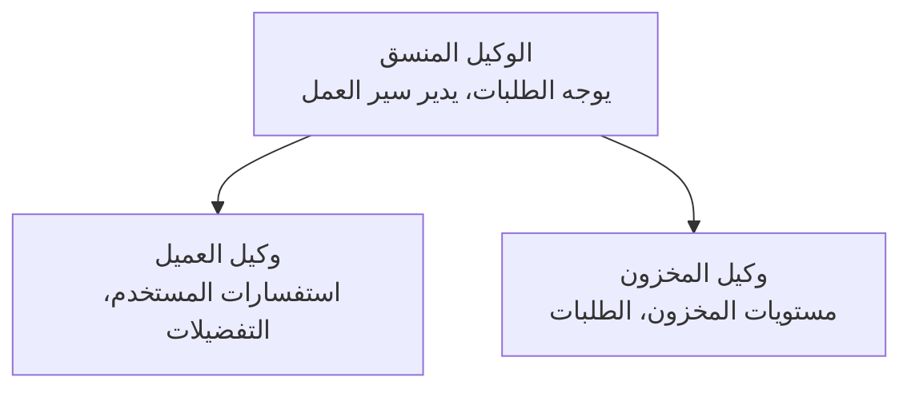

# الفصل 5: حلول الذكاء الاصطناعي متعددة الوكلاء

**📚 Course**: [AZD للمبتدئين](../../README.md) | **⏱️ المدة**: 2-3 ساعات | **⭐ التعقيد**: متقدمة

---

## نظرة عامة

يغطي هذا الفصل أنماط بنية متعددة الوكلاء المتقدمة، وإدارة تنسيق الوكلاء، ونشر حلول الذكاء الاصطناعي الجاهزة للإنتاج للسيناريوهات المعقدة.

## أهداف التعلم

بإكمال هذا الفصل، ستتمكن من:
- فهم أنماط بنية متعددة الوكلاء
- نشر أنظمة وكلاء ذكاء اصطناعي منسقة
- تنفيذ التواصل بين الوكلاء
- بناء حلول متعددة الوكلاء جاهزة للإنتاج

---

## 📚 الدروس

| # | الدرس | الوصف | الوقت |
|---|--------|-------------|------|
| 1 | [حل التجزئة متعدد الوكلاء](../../examples/retail-scenario.md) | شرح التنفيذ الكامل | 90 دقيقة |
| 2 | [أنماط التنسيق](../chapter-06-pre-deployment/coordination-patterns.md) | استراتيجيات تنسيق الوكلاء | 30 دقيقة |
| 3 | [نشر قالب ARM](../../examples/retail-multiagent-arm-template/README.md) | نشر بنقرة واحدة | 30 دقيقة |

---

## 🚀 بدء سريع

```bash
# الخيار 1: النشر من قالب
azd init --template agent-openai-python-prompty
azd up

# الخيار 2: النشر من مانيفست الوكيل (يتطلب امتداد azure.ai.agents)
azd extension install azure.ai.agents
azd ai agent init -m agent-manifest.yaml
azd up
```

> **أي نهج؟** استخدم `azd init --template` للبدء من مثال عملي. استخدم `azd ai agent init` عندما يكون لديك مستند تعريف الوكيل الخاص بك. راجع [مرجع AZD AI CLI](../chapter-08-production/production-ai-practices.md#azd-ai-cli-commands-and-extensions) للحصول على التفاصيل الكاملة.

---

## 🤖 بنية متعددة الوكلاء


---

## 🎯 الحل المميز: حل التجزئة متعدد الوكلاء

يعرض [حل التجزئة متعدد الوكلاء](../../examples/retail-scenario.md):

- **وكيل العميل**: يتعامل مع تفاعلات المستخدم وتفضيلاته
- **وكيل المخزون**: يدير المخزون ومعالجة الطلبات
- **منسق**: ينسق بين الوكلاء
- **ذاكرة مشتركة**: إدارة السياق عبر الوكلاء

### الخدمات المستخدمة

| الخدمة | الغرض |
|---------|---------|
| Microsoft Foundry Models | فهم اللغة |
| Azure AI Search | كتالوج المنتجات |
| Cosmos DB | حالة الوكيل والذاكرة |
| Container Apps | استضافة الوكلاء |
| Application Insights | المراقبة |

---

## 🔗 التنقل

| الاتجاه | الفصل |
|-----------|---------|
| **السابق** | [الفصل 4: البنية التحتية](../chapter-04-infrastructure/README.md) |
| **التالي** | [الفصل 6: ما قبل النشر](../chapter-06-pre-deployment/README.md) |

---

## 📖 موارد ذات صلة

- [دليل وكلاء الذكاء الاصطناعي](../chapter-02-ai-development/agents.md)
- [ممارسات الذكاء الاصطناعي للإنتاج](../chapter-08-production/production-ai-practices.md)
- [استكشاف أخطاء الذكاء الاصطناعي](../chapter-07-troubleshooting/ai-troubleshooting.md)

---

<!-- CO-OP TRANSLATOR DISCLAIMER START -->
إخلاء المسؤولية:
تمت ترجمة هذا المستند باستخدام خدمة الترجمة الآلية Co-op Translator (https://github.com/Azure/co-op-translator). بينما نسعى لتحقيق الدقة، يُرجى ملاحظة أن الترجمات الآلية قد تحتوي على أخطاء أو معلومات غير دقيقة. يجب اعتبار المستند الأصلي بلغته الأصلية المصدر المعتمد. للمعلومات الهامة أو الحساسة، يُنصح بالاستعانة بترجمة بشرية محترفة. لا نتحمل أي مسؤولية عن أي سوء فهم أو تفسير ينشأ عن استخدام هذه الترجمة.
<!-- CO-OP TRANSLATOR DISCLAIMER END -->