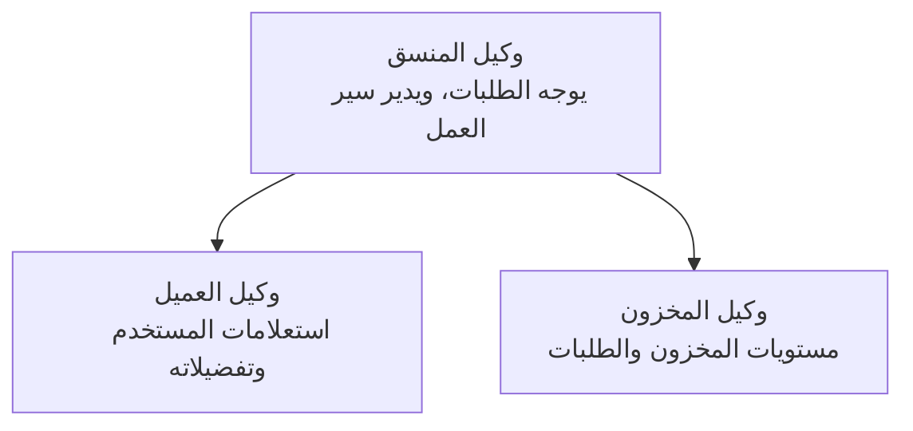

‏# الفصل 5: حلول الذكاء الاصطناعي متعددة الوكلاء

**📚 الدورة**: [AZD للمبتدئين](../../README.md) | **⏱️ المدة**: 2-3 hours | **⭐ التعقيد**: متقدم

---

## نظرة عامة

يغطي هذا الفصل أنماط بنية متقدمة متعددة الوكلاء، تنظيم الوكلاء، ونشر ذكاء اصطناعي جاهز للإنتاج لسيناريوهات معقدة.

> تم التحقق من الصحة مقابل `azd 1.23.12` في مارس 2026.

## أهداف التعلم

من خلال إكمال هذا الفصل، سوف:
- فهم أنماط بنية متعددة الوكلاء
- نشر أنظمة وكلاء ذكاء اصطناعي منسقة
- تنفيذ تواصل بين الوكلاء
- بناء حلول متعددة الوكلاء جاهزة للإنتاج

---

## 📚 الدروس

| # | الدرس | الوصف | الوقت |
|---|--------|-------------|------|
| 1 | [حل متعدد الوكلاء للبيع بالتجزئة](../../examples/retail-scenario.md) | استعراض التنفيذ الكامل | 90 دقيقة |
| 2 | [أنماط التنسيق](../chapter-06-pre-deployment/coordination-patterns.md) | استراتيجيات تنسيق الوكلاء | 30 دقيقة |
| 3 | [نشر قالب ARM](../../examples/retail-multiagent-arm-template/README.md) | نشر بنقرة واحدة | 30 دقيقة |

---

## 🚀 بداية سريعة

```bash
# الخيار 1: النشر من قالب
azd init --template agent-openai-python-prompty
azd up

# الخيار 2: النشر من ملف مواصفات الوكيل (يتطلب امتداد azure.ai.agents)
azd extension install azure.ai.agents
azd ai agent init -m agent-manifest.yaml
azd up
```

> **أي نهج؟** استخدم `azd init --template` للبدء من عينة تعمل. استخدم `azd ai agent init` عندما يكون لديك ملف تعريف وكيل خاص بك. راجع [مرجع AZD AI CLI](../chapter-08-production/production-ai-practices.md#azd-ai-cli-commands-and-extensions) للحصول على التفاصيل الكاملة.

---

## 🤖 بنية متعددة الوكلاء


---

## 🎯 الحل المميز: حل متعدد الوكلاء للبيع بالتجزئة

يعرض [حل متعدد الوكلاء للبيع بالتجزئة](../../examples/retail-scenario.md):

- **وكيل العميل**: يتعامل مع تفاعلات المستخدم وتفضيلاته
- **وكيل المخزون**: يدير المخزون ومعالجة الطلبات
- **المنسق**: ينسق بين الوكلاء
- **ذاكرة مشتركة**: إدارة سياق عبر الوكلاء

### الخدمات المستخدمة

| الخدمة | الغرض |
|---------|---------|
| Microsoft Foundry Models | فهم اللغة |
| Azure AI Search | كتالوج المنتجات |
| Cosmos DB | حالة الوكيل والذاكرة |
| Container Apps | استضافة الوكلاء |
| Application Insights | المراقبة |

---

## 🔗 التنقل

| الاتجاه | الفصل |
|-----------|---------|
| **السابق** | [الفصل 4: البنية التحتية](../chapter-04-infrastructure/README.md) |
| **التالي** | [الفصل 6: ما قبل النشر](../chapter-06-pre-deployment/README.md) |

---

## 📖 موارد ذات صلة

- [دليل وكلاء الذكاء الاصطناعي](../chapter-02-ai-development/agents.md)
- [ممارسات الذكاء الاصطناعي للإنتاج](../chapter-08-production/production-ai-practices.md)
- [استكشاف أخطاء الذكاء الاصطناعي وإصلاحها](../chapter-07-troubleshooting/ai-troubleshooting.md)

---

<!-- CO-OP TRANSLATOR DISCLAIMER START -->
**Disclaimer**:
تمت ترجمة هذا المستند باستخدام خدمة الترجمة الآلية [Co-op Translator](https://github.com/Azure/co-op-translator). بينما نسعى إلى الدقة، يرجى العلم أن الترجمات الآلية قد تحتوي على أخطاء أو عدم دقة. يجب اعتبار المستند الأصلي بلغته الأصلية كمصدر معتمد. بالنسبة للمعلومات الحرجة، يُنصح بالاستعانة بترجمة احترافية بشرية. نحن غير مسؤولين عن أي سوء فهم أو تفسيرات خاطئة ناتجة عن استخدام هذه الترجمة.
<!-- CO-OP TRANSLATOR DISCLAIMER END -->