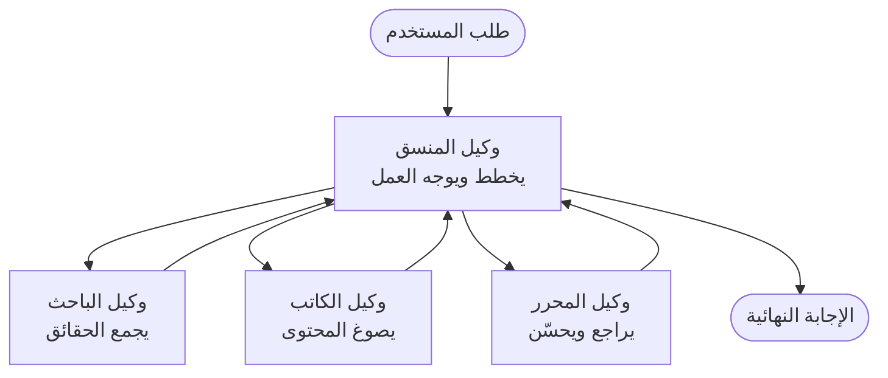

# أساسيات الوكلاء المتعدّدين - نشر نظام ذكاء اصطناعي منسق أول

**التنقل بين الفصول:**
- **📚 صفحة المقرر**: [AZD للمبتدئين](../../README.md)
- **📖 الفصل الحالي**: الفصل 5 - حلول الذكاء الاصطناعي متعددة الوكلاء
- **⬅️ السابق**: [الفصل 4: البنية التحتية](../chapter-04-infrastructure/README.md)
- **➡️ التالي**: [أنماط التنسيق](../chapter-06-pre-deployment/coordination-patterns.md)

> تم التحقق مقابل `azd 1.25.6` في يونيو 2026.

## مقدمة

في الفصول السابقة نشرت تطبيقًا واحدًا—وفي الفصل 2 نشرت وكيلًا ذكاءً اصطناعيًا واحدًا. تأخذك هذه الدرسة الخطوة التالية: نشر **نظام متعدد الوكلاء**، حيث يعمل عدة وكلاء متخصصين معًا لحل مشكلة لا يستطيع وكيل واحد التعامل معها بشكل جيد بمفرده.

الخبر السار للمبتدئين: **لا تحتاج إلى أوامر جديدة.** تظل الحلول متعددة الوكلاء مشروع azd. ستقوم بـ `azd init` و `azd up` والاختبار و `azd down`—تمامًا سير العمل الذي تعرفه بالفعل. ما يتغير هو *شكل* التطبيق داخليًا.

## أهداف التعلم

بنهاية هذا الدرس، ستتمكن من:
- فهم ماذا يعني "متعدد الوكلاء" ومتى تستحق التعقيدات الإضافية
- التعرف على الأدوار الشائعة في نظام متعدد الوكلاء (المنسق + المتخصصون)
- نشر قالب متعدد الوكلاء عملي يعمل باستخدام `azd up`
- فهم موارد Azure التي تدعم تطبيق متعدد الوكلاء
- معرفة كيفية التحقق من الحل وتخصيصه وإزالته بأمان

## مخرجات التعلم

بعد إكمال هذا الدرس، ستكون قادرًا على:
- شرح الفرق بين وكيل واحد ونظام متعدد الوكلاء
- الاختيار بين وكيل واحد مع أدوات وتصميم متعدد الوكلاء الحقيقي
- نشر واختبار قالب متعدد الوكلاء من البداية إلى النهاية باستخدام azd
- تحديد أين يعمل كل وكيل وكيف يتواصلون
- تنظيف كل الموارد لتجنب التكاليف المستمرة

---

## ما هو نظام متعدد الوكلاء؟

الوكيل الذكي الواحد هو نموذج واحد مع مجموعة تعليمات و(اختياريًا) بعض الأدوات. هذا يعمل جيدًا للمهام المركزة. ولكن مع نمو المهمة—البحث، ثم الكتابة، ثم التحرير، ثم التحقق من الحقائق—حشو كل شيء في موجه واحد يجعل الوكيل أبطأ وأقل موثوقية، وأكثر صعوبة في تصحيح الأخطاء.

يكسر **نظام متعدد الوكلاء** العمل إلى متخصصين كلٌ يقوم بعمل واحد بشكل جيد، يُنسّقهم منسق:



### الدوران اللذان سترى دائمًا

| الدور | المهمة | المثال |
|------|-----|---------|
| **المنسق** | يقرر *ما الذي سيحدث بعد ذلك* ويوجّه العمل بين الوكلاء | "أولًا البحث، ثم الكتابة، ثم التحرير" |
| **المتخصص** | يقوم بمهمة مركزة واحدة ويعيد نتيجة | "باحث" يجمع الحقائق فقط |

### هل تحتاج فعلاً إلى عدة وكلاء؟

ابدأ ببساطة. استخدم متعدد الوكلاء **فقط** عندما يكون أحد هذه الأمور صحيحًا:

- ✅ تحتوي المهمة على **مراحل مميزة** تستفيد من تعليمات مختلفة (البحث مقابل الكتابة مقابل المراجعة)
- ✅ تريد أن يعمل المتخصصون **بالتوازي** لتوفير الوقت
- ✅ تحتاج خطوات مختلفة إلى **أدوات أو مصادر بيانات مختلفة**
- ✅ تحتاج كل خطوة أن تكون **قابلة للاختبار والتصحيح بشكل مستقل**

إذا كانت مهمتك سؤالًا وإجابة واحدة أو استدعاء أداة بسيطة، فإن **وكيلًا واحدًا مع أدوات** (الفصل 2) أبسط، وأرخص، وأسهل في التشغيل.

> **نصيحة للمبتدئين:** "المزيد من الوكلاء" ليس بالضرورة "أفضل." كل وكيل يضيف زمن وصول وتكلفة وشيء جديد للمراقبة. أضف وكلاء فقط عندما تنقسم المشكلة بوضوح إلى أجزاء.

---

## طريقتان لبناء متعدد الوكلاء على Azure

| النهج | ما هو | الأفضل لـ |
|----------|-----------|----------|
| **وكيل واحد + أدوات** | وكيل Foundry واحد يستدعي وظائف/أدوات | سير عمل بسيط، للبدء |
| **عدة وكلاء منسقون** | عدة وكلاء مع منسق | مراحل مميزة، عمل متوازي، تخصص |

يركز هذا الدرس على النهج الثاني باستخدام **قالب جاهز**، حتى تتمكن من رؤية نظام متعدد الوكلاء حقيقي يعمل قبل أن تبني واحدًا بنفسك.

---

## عملي: نشر تطبيق متعدد الوكلاء يعمل

سننشر **Contoso Creative Writer**، عينة رسمية من Azure تستخدم عدة وكلاء (باحث، كاتب، محرر) منسقين لإنتاج مقال. إنه تطبيق متعدد الوكلاء ممتاز للمبتدئين لأن الأدوار سهلة الفهم.

### الخطوة 1: تهيئة القالب

```bash
# إنشاء مجلد عمل
mkdir creative-writer && cd creative-writer

# التهيئة من القالب الرسمي متعدد الوكلاء
azd init --template contoso-creative-writer
```

> تصفح المزيد من قوالب متعدد الوكلاء في أي وقت في معرض [معرض Awesome AZD AI](https://azure.github.io/awesome-azd/?tags=ai). تتضمن الخيارات المناسبة للمبتدئين أيضًا `get-started-with-ai-agents` و `azure-ai-travel-agents`.

### الخطوة 2: المصادقة

```bash
# مطلوب لتدفقات العمل في azd
azd auth login
```

### الخطوة 3: إنشاء بيئة

```bash
azd env new dev
```

### الخطوة 4: معاينة، ثم النشر

```bash
# اطلع على ما سيتم إنشاؤه قبل إنفاق أي شيء (موصى به)
azd provision --preview

# وفر البنية التحتية وانشر جميع الوكلاء في خطوة واحدة
azd up
```

`azd up` سيطلب الاشتراك والمنطقة، ثم سيقوم بتوفير موارد Azure ونشر التطبيق. قد تستغرق عمليات نشر الذكاء الاصطناعي وقتًا أطول من تطبيق ويب بسيط—إذا كنت تنشر نماذج أكبر، يمكنك تمديد مهلة النشر:

```bash
azd deploy --timeout 1800
```

> **تنبيه حول التكلفة والسعة:** تطبيقات متعدد الوكلاء تنشر نماذج ذكاء اصطناعي تستهلك الحصص وتترتب عليها تكلفة. إذا فشل `azd up` بسبب حصة النموذج، انظر إلى [استكشاف أخطاء الذكاء الاصطناعي](../chapter-07-troubleshooting/ai-troubleshooting.md) لإصلاحات المنطقة والحصص، وراجع الفصل 6 [تخطيط السعة](../chapter-06-pre-deployment/capacity-planning.md).

---

## فهم ما قمت بنشره

يعمد تطبيق متعدد الوكلاء نموذجي مثل هذا إلى توفير مجموعة من موارد Azure التي تتطابق مباشرة مع المسؤوليات في المخطط أعلاه:

| المورد | لماذا هو موجود |
|----------|----------------|
| **Microsoft Foundry / النماذج** | *يستضيف* نماذج اللغة التي يستخدمها كل وكيل |
| **Azure AI Search** | يزود وكيل الباحث ببيانات مؤسسية للبحث |
| **Container Apps** (أو App Service) | يستضيف المنسق وكود الوكلاء |
| **Cosmos DB** (في بعض العينات) | يخزن الحالة/الذاكرة المشتركة الممررة بين الوكلاء |
| **Application Insights** | يتتبع الطلبات *عبر* الوكلاء حتى تتمكن من تصحيح سير التنفيذ |

### كيف يتحدث الوكلاء مع بعضهم البعض

في معظم عينات azd متعددة الوكلاء، **المنسق يعمل في كود التطبيق الخاص بك** (على سبيل المثال، باستخدام إطار عمل مثل Semantic Kernel أو Microsoft Agent Framework). يقوم المنسق باستدعاء كل وكيل متخصص بدوره، يمرر النتائج، ويجمع الإجابة النهائية. يتشارك الوكلاء السياق عبر:

- **استدعاءات الوظائف/الأدوات** — يقوم المنسق باستدعاء وكيل متخصص ويحصل على نتيجة
- **الذاكرة المشتركة** — قاعدة بيانات (غالبًا Cosmos DB) تحتفظ بحالة يمكن لكلا الوكلاء قراءتها
- **الرسائل/الفعاليات** — لاقتران أرخض، يتواصل الوكلاء عبر قائمة انتظار أو Service Bus

> **لماذا هذا مهم للتصحيح:** لأن كل خطوة منفصلة، يُظهر Application Insights *أي* وكيل كان بطيئًا أو فشل. هذا سبب رئيسي لتقسيم العمل عبر الوكلاء في المقام الأول.

---

## التحقق من النشر

تأكد من أن النظام يعمل فعليًا قبل المتابعة:

```bash
# عرض نقاط النهاية المنشورة
azd show

# افتح لوحة مراقبة التطبيق
azd monitor

# تتبع السجلات إذا بدا أن هناك خطأ
azd monitor --logs
```

ثم افتح عنوان التطبيق من `azd show` وحاول إرسال طلب يُشغّل كل الوكلاء (بالنسبة لـ Creative Writer، اطلب منه كتابة مقالة قصيرة حول موضوع). في **بحث المعاملات** في Application Insights، يجب أن ترى الطلب يتفرع عبر خطوات الباحث والكاتب والمحرر.

**معايير النجاح:**
- ✅ `azd show` يسرد نقطة نهاية قابلة للوصول
- ✅ ينتج طلب نتيجة مرت عبر مراحل متعددة بوضوح
- ✅ يعرض Application Insights تعقبات لأكثر من خطوة وكيل واحدة

---

## التخصيص: إضافة وكيل أو تعديل وكيل

نظرًا لأن كل وكيل هو مجرد تعليمات بالإضافة إلى أدوات، فالتخصيص ممكن:

1. **ابحث عن تعريفات الوكلاء** في القالب (غالبًا مجموعة ملفات مثل `prompts/`، `agents/`، أو `*.prompty`).
2. **اضبط تعليمات الوكيل** — على سبيل المثال، أخبر وكيل المحرر بفرض نبرة محددة أو عدد كلمات محدد.
3. **أعد نشر الكود فقط** (البنية التحتية تبقى دون تغيير):

   ```bash
   azd deploy
   ```

للمضي قدمًا وبناء وكلاء من ملف التعريف *الخاص بك*، استخدم امتداد الوكيل ودورة حياته الكاملة:

```bash
azd extension install azure.ai.agents
azd ai agent init -m agent-manifest.yaml
azd up
azd ai agent invoke      # اختبار، مع توقيت الاستجابة
```

راجع [الفصل 2: الوكلاء](../chapter-02-ai-development/agents.md) و [مرجع AZD AI CLI](../chapter-08-production/production-ai-practices.md#azd-ai-cli-commands-and-extensions) لدورة حياة الوكيل الكاملة (`invoke`, `eval generate`, `optimize`, `delete`).

---

## التنظيف

تشغّل تطبيقات متعدد الوكلاء عدة خدمات تُحتسب مقابلها رسوم. قم بإزالة كل شيء عندما تنتهي:

```bash
azd down --force --purge
```

يقوم الخيار `--purge` أيضًا بإزالة موارد الذكاء الاصطناعي المحذوفة برفق (مثل حسابات Foundry/Azure AI Services) حتى لا تمنع إعادة نشر مستقبلية أو تستمر في توليد تكلفة.

---

## ملاحظة حول أنظمة الوكلاء المتعدّدة في بيئة الإنتاج

يعد [حل التجزئة متعدد الوكلاء](../../examples/retail-scenario.md) في هذا المستودع **مخططًا معماريًا**، وليس قالب أمر واحد—يوثّق كيفية بناء نظام تجزئة إنتاجي *من المفترض أن* يُبنى (ويبيّن بصراحة أن بناءً كاملًا هو جهد كبير). استخدمه كمرجع تصميم *بعد* أن تكون نشرت عينة تعمل هنا. للمخاوف الإنتاجية (المرونة، التكلفة، المراقبة، الحوكمة)، تابع [الفصل 8: ممارسات الذكاء الاصطناعي للإنتاج](../chapter-08-production/production-ai-practices.md).

---

## ملخص

- يقسم نظام متعدد الوكلاء العمل عبر متخصصين يُنسّقهم منسق.
- استخدمه فقط عندما تحتوي المهمة على مراحل مميزة، أو توازي، أو أدوات مختلفة لكل خطوة—وإلا فالأفضل وكيل واحد.
- سير عمل azd لم يتغير: `azd init` → `azd up` → اختبار → `azd down`.
- قالب حقيقي مثل `contoso-creative-writer` يتيح لك رؤية وتخصيص تطبيق متعدد الوكلاء يعمل اليوم.
- تتبّع Application Insights عبر الوكلاء هو أحد أكبر الفوائد العملية لتصميم متعدد الوكلاء.

---

## 🔗 التنقل

| الاتجاه | الدرس |
|-----------|--------|
| **السابق** | [الفصل 4: البنية التحتية](../chapter-04-infrastructure/README.md) |
| **التالي** | [أنماط التنسيق](../chapter-06-pre-deployment/coordination-patterns.md) |

## 📖 موارد ذات صلة

- [دليل وكلاء الذكاء الاصطناعي](../chapter-02-ai-development/agents.md)
- [أنماط التنسيق](../chapter-06-pre-deployment/coordination-patterns.md)
- [ممارسات الذكاء الاصطناعي للإنتاج](../chapter-08-production/production-ai-practices.md)
- [استكشاف أخطاء الذكاء الاصطناعي](../chapter-07-troubleshooting/ai-troubleshooting.md)

---

<!-- CO-OP TRANSLATOR DISCLAIMER START -->
**تنويه**:
تمت ترجمة هذا المستند باستخدام خدمة الترجمة بالذكاء الاصطناعي [Co-op Translator](https://github.com/Azure/co-op-translator). بينما نسعى للدقة، يرجى العلم أن الترجمات الآلية قد تحتوي على أخطاء أو عدم دقة. يجب اعتبار المستند الأصلي بلغته الأصلية المصدر الرسمي والمعتمد. للمعلومات الهامة، يُنصح بالاستعانة بترجمة بشرية محترفة. نحن غير مسؤولين عن أي سوء فهم أو تفسير ناتج عن استخدام هذه الترجمة.
<!-- CO-OP TRANSLATOR DISCLAIMER END -->