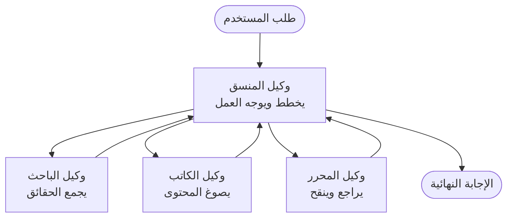

# أساسيات الوكلاء المتعددين - نشر نظام AI منسق لأول مرة

**التنقل في الفصل:**
- **📚 الصفحة الرئيسية للدورة**: [AZD للمبتدئين](../../README.md)
- **📖 الفصل الحالي**: الفصل 5 - حلول الذكاء الاصطناعي متعددة الوكلاء
- **⬅️ السابق**: [الفصل 4: البنية التحتية](../chapter-04-infrastructure/README.md)
- **➡️ التالي**: [أنماط التنسيق](../chapter-06-pre-deployment/coordination-patterns.md)

> تم التحقق من الصحة مع `azd 1.27.1` في يوليو 2026.

## مقدمة

في الفصول السابقة قمت بنشر تطبيق واحد — وفي الفصل 2 نشرت وكيل ذكاء اصطناعي واحد. هذه الدرس يأخذ الخطوة التالية: نشر **نظام وكلاء متعددين** حيث يعمل عدة وكلاء متخصصين معًا لحل مشكلة لا يستطيع وكيل واحد التعامل معها جيدًا بمفرده.

الخبر السار للمبتدئين: **لا تحتاج إلى أوامر جديدة.** حل الوكلاء المتعددين لا يزال مشروع azd. ستقوم بـ `azd init`، `azd up`، اختبار، و `azd down` — تمامًا نفس سير العمل الذي تعرفه بالفعل. ما يتغير هو *شكل* التطبيق من الداخل.

## أهداف التعلم

بنهاية هذا الدرس، ستتمكن من:
- فهم ما يعنيه "الوكلاء المتعددون" ومتى يستحق التعقيد الإضافي
- التعرف على الأدوار الشائعة في نظام الوكلاء المتعددين (المنسق + المتخصصون)
- نشر قالب وكلاء متعددين حقيقي وعامل باستخدام `azd up`
- فهم موارد Azure التي تدعم تطبيق الوكلاء المتعددين
- معرفة كيفية التحقق من الحل وتخصيصه وتفكيكه بأمان

## نتائج التعلم

بعد إكمال هذا الدرس، ستكون قادرًا على:
- شرح الفرق بين وكيل واحد ونظام وكلاء متعددين
- الاختيار بين وكيل واحد مع أدوات وتصميم وكلاء متعددين حقيقي
- نشر واختبار قالب وكلاء متعددين من البداية إلى النهاية باستخدام azd
- تحديد مكان تشغيل كل وكيل وكيف يتواصلون
- تنظيف جميع الموارد لتجنب التكاليف المستمرة

---

## ما هو نظام الوكلاء المتعددين؟

وكيل ذكاء اصطناعي واحد هو نموذج واحد مع مجموعة من التعليمات و(اختياريًا) بعض الأدوات. هذا يعمل جيدًا للمهام المركزة. لكن مع نمو المهمة — البحث، ثم الكتابة، ثم التحرير، ثم التحقق من الحقائق — حشر كل شيء في موجه واحد يجعل الوكيل أبطأ، أقل موثوقية، وأكثر صعوبة في تصحيح الأخطاء.

**نظام الوكلاء المتعددين** يقسم العمل إلى متخصصين يقوم كل منهم بوظيفة واحدة بشكل جيد، منسق بواسطة منسق:



### الدوران اللذان سترونهما دائمًا

| الدور | الوظيفة | مثال |
|------|-----|---------|
| **المنسق** | يقرر *ما يحدث بعد ذلك* ويوجه العمل بين الوكلاء | "أولاً البحث، ثم الكتابة، ثم التحرير" |
| **المتخصص** | يقوم بوظيفة مركزة واحدة ويعيد نتيجة | "باحث" يجمع الحقائق فقط |

### هل تحتاج فعلاً إلى وكلاء متعددين؟

ابدأ ببساطة. استعن بالوكلاء المتعددين **فقط** عندما يكون أحد هذه الأمور صحيحًا:

- ✅ المهمة لها **مراحل مميزة** تستفيد من تعليمات مختلفة (بحث مقابل كتابة مقابل مراجعة)
- ✅ تريد للمتخصصين أن يعملوا **بالتوازي** لتوفير الوقت
- ✅ خطوات مختلفة تتطلب **أدوات أو مصادر بيانات مختلفة**
- ✅ تحتاج أن تكون كل خطوة **قابلة للاختبار والتصحيح بشكل مستقل**

إذا كانت مهمتك سؤال وإجابة واحد أو استدعاء أداة بسيطة، فإن **وكيل واحد مع أدوات** (الفصل 2) أبسط، وأرخص، وأسهل في التشغيل.

> **نصيحة للمبتدئين:** "المزيد من الوكلاء" ليس "أفضل". كل وكيل يضيف تأخيرًا وتكلفة وشيء جديد لمراقبته. أضف وكلاء فقط عندما تنقسم المشكلة بوضوح إلى أجزاء.

---

## طريقتان لبناء وكلاء متعددين على Azure

| النهج | ما هو | الأفضل لـ |
|----------|-----------|----------|
| **وكيل واحد + أدوات** | وكيل Foundry واحد يستدعي دوال / أدوات | سير عمل بسيط، للبدء |
| **وكلاء منسقون متعددون** | عدة وكلاء مع منسق | مراحل مميزة، عمل متوازي، تخصيص |

هذا الدرس يركز على النهج الثاني باستخدام **قالب جاهز**، حتى يمكنك رؤية نظام وكلاء متعددين فعلي يعمل قبل أن تبني خاصتك.

---

## التطبيق العملي: نشر تطبيق وكلاء متعددين عامل

سننشر **Contoso Creative Writer**، نموذج رسمي من Azure يستخدم عدة وكلاء (باحث، كاتب، محرر) منسقين لإنتاج مقال. إنه تطبيق وكلاء متعددين ممتاز للمرة الأولى لأن الأدوار سهلة الفهم.

### الخطوة 1: تهيئة القالب

```bash
# إنشاء مجلد عمل
mkdir creative-writer && cd creative-writer

# البدء بالقالب الرسمي للوكيل المتعدد
azd init --template contoso-creative-writer
```

> تصفح المزيد من قوالب الوكلاء المتعددين في أي وقت في [معرض Awesome AZD AI](https://azure.github.io/awesome-azd/?tags=ai). خيارات أخرى مناسبة للمبتدئين تشمل `get-started-with-ai-agents` و `azure-ai-travel-agents`.

### الخطوة 2: المصادقة

```bash
# مطلوب لأتمتة azd
azd auth login
```

### الخطوة 3: إنشاء بيئة

```bash
azd env new dev
```

### الخطوة 4: معاينة ثم نشر

```bash
# شاهد ما سيتم إنشاؤه قبل إنفاق أي شيء (مُوصى به)
azd provision --preview

# تجهيز البنية التحتية ونشر كافة الوكلاء في خطوة واحدة
azd up
```

سيطلب `azd up` الاشتراك والمنطقة، ثم يقوم بإعداد موارد Azure ونشر التطبيق. نشرات AI يمكن أن تستغرق وقتًا أطول من تطبيق ويب بسيط — إذا كنت تنشر نماذج أكبر، يمكنك تمديد مهلة النشر:

```bash
azd deploy --timeout 1800
```

> **تنبيه حول التكلفة والسعة:** تطبق تطبيقات الوكلاء المتعددين نماذج AI تستهلك الحصة وتتسبب في تكاليف. إذا فشل `azd up` بسبب حصة النموذج، انظر [استكشاف أخطاء AI](../chapter-07-troubleshooting/ai-troubleshooting.md) لإصلاحات المنطقة والحصة، والفصل 6 [تخطيط السعة](../chapter-06-pre-deployment/capacity-planning.md).

---

## فهم ما نشرته

تطبيق وكلاء متعددين نموذجي مثل هذا يوفر مجموعة من موارد Azure التي تتطابق مباشرة مع المسؤوليات في الرسم البياني أعلاه:

| المورد | لماذا هو موجود |
|----------|----------------|
| **Microsoft Foundry / النماذج** | تستضيف نماذج اللغة التي يستخدمها كل وكيل |
| **Azure AI Search** | يعطي وكيل الباحث بيانات مؤسسية للبحث |
| **تطبيقات الحاويات** (أو خدمة التطبيقات) | تستضيف رمز المنسق والوكيل |
| **Cosmos DB** (في بعض النماذج) | يخزن الحالة المشتركة / الذاكرة التي تمر بين الوكلاء |
| **Application Insights** | تتبع الطلبات *عبر* الوكلاء حتى تتمكن من تصحيح سير العمل |

### كيف يتحدث الوكلاء مع بعضهم البعض

في معظم نماذج azd للوكلاء المتعددين، **المنسق يعمل في كود التطبيق الخاص بك** (على سبيل المثال، باستخدام إطار عمل مثل Semantic Kernel أو Microsoft Agent Framework). يستدعي المنسق كل وكيل متخصص بالتتابع، يمرر النتائج، ويجمع الإجابة النهائية. يتشارك الوكلاء السياق عبر:

- **استدعاءات الدوال / الأدوات** — المنسق يستدعي متخصص ويحصل على نتيجة
- **الذاكرة المشتركة** — قاعدة بيانات (غالبًا Cosmos DB) تحتوي على حالة يمكن لكلا الوكيلين قراءتها
- **الرسائل / الأحداث** — للترابط الأضعف، يتواصل الوكلاء عبر قائمة انتظار أو Service Bus

> **لماذا هذا مهم في التصحيح:** لأن كل خطوة منفصلة، يظهر Application Insights *أي* وكيل كان بطيئًا أو فشل. هذه هي إحدى الأسباب الرئيسية لتقسيم العمل بين الوكلاء.

---

## تحقق من النشر

تأكد من أن النظام يعمل فعليًا قبل المتابعة:

```bash
# عرض نقاط النهاية المنتشرة
azd show

# فتح لوحة مراقبة التطبيق
azd monitor

# تتبع السجلات إذا ظهر شيء غير طبيعي
azd monitor --logs
```

ثم افتح عنوان URL للتطبيق من `azd show` وجرب طلبًا يشمل جميع الوكلاء (لـ Creative Writer، اطلب منه كتابة مقال قصير عن موضوع). في **بحث المعاملات** في Application Insights، يجب أن ترى الطلب ينتشر عبر الباحث، الكاتب، وخطوات المحرر.

**معايير النجاح:**
- ✅ `azd show` يعرض نقطة نهاية قابلة للوصول
- ✅ الطلب ينتج نتيجة مرت بوضوح عدة مراحل
- ✅ Application Insights يظهر تتبعًا لأكثر من خطوة وكيل واحدة

---

## التخصيص: إضافة وكيل أو تعديل وكيل

لأن كل وكيل هو مجرد تعليمات plus أدوات، فالتخصيص سهل:

1. **ابحث عن تعريفات الوكلاء** في القالب (غالبًا في ملفات `prompts/`, `agents/`، أو `*.prompty`).
2. **ضبط تعليمات الوكيل** — على سبيل المثال، أخبر وكيل المحرر بفرض نغمة معينة أو عدد كلمات محدد.
3. **أعد نشر الكود فقط** (البنية التحتية لم تتغير):

   ```bash
   azd deploy
   ```

للذهاب أبعد وبناء وكلاء من *تعريفك الخاص*، استخدم امتداد الوكيل ودورة حياته الكاملة:

```bash
azd extension install azure.ai.agents
azd ai agent init -m agent-manifest.yaml
azd up
azd ai agent invoke      # اختبار، مع توقيت الاستجابة
```

انظر [الفصل 2: الوكلاء](../chapter-02-ai-development/agents.md) و [مرجع AZD AI CLI](../chapter-08-production/production-ai-practices.md#azd-ai-cli-commands-and-extensions) لدورة حياة الوكيل الكاملة (`invoke`, `eval generate`, `optimize`, `delete`).

---

## التنظيف

تطبيقات الوكلاء المتعددين تشغل عدة خدمات تُحسب تكاليفها. قم بتفكيك كل شيء عند الانتهاء:

```bash
azd down --force --purge
```

علمًا أن علم `--purge` يزيل أيضًا موارد AI المحذوفة بشكل ناعم (مثل حسابات Foundry/Azure AI Services) حتى لا تعيق إعادة النشر المستقبلية أو تستمر في التسبب في تكاليف.

---

## ملاحظة حول أنظمة الوكلاء المتعددين في الإنتاج

[حل وكلاء التجزئة](../../examples/retail-scenario.md) في هذا المستودع هو **مخطط معماري**، وليس قالبًا ذا أمر واحد — يوثق كيف *يمكن* بناء نظام تجزئة في الإنتاج (ويصرح أن البناء الكامل مجهود كبير). استخدمه كمرجع تصميم *بعد* أن تنشر عينة عاملية هنا. لمخاوف الإنتاج (المرونة، التكلفة، المراقبة، الحوكمة)، تابع إلى [الفصل 8: ممارسات AI في الإنتاج](../chapter-08-production/production-ai-practices.md).

---

## ملخص

- نظام وكلاء متعددين يقسم العمل بين متخصصين منسقين بواسطة منسق.
- استخدمه فقط عندما تكون المهمة لها مراحل مميزة، أو تعقيد متوازي، أو أدوات مختلفة لكل خطوة — وإلا ففضل وكيلًا واحدًا.
- سير عمل azd لم يتغير: `azd init` → `azd up` → اختبار → `azd down`.
- قالب حقيقي مثل `contoso-creative-writer` يتيح لك رؤية وتخصيص تطبيق وكلاء متعددين يعمل اليوم.
- تتبع Application Insights عبر الوكلاء هو أحد أكبر الفوائد العملية لتصميم الوكلاء المتعددين.

---

## 🔗 التنقل

| الاتجاه | الدرس |
|-----------|--------|
| **السابق** | [الفصل 4: البنية التحتية](../chapter-04-infrastructure/README.md) |
| **التالي** | [أنماط التنسيق](../chapter-06-pre-deployment/coordination-patterns.md) |

## 📖 الموارد ذات الصلة

- [دليل وكلاء AI](../chapter-02-ai-development/agents.md)
- [أنماط التنسيق](../chapter-06-pre-deployment/coordination-patterns.md)
- [ممارسات AI في الإنتاج](../chapter-08-production/production-ai-practices.md)
- [استكشاف أخطاء AI](../chapter-07-troubleshooting/ai-troubleshooting.md)

---

<!-- CO-OP TRANSLATOR DISCLAIMER START -->
**تنويه**:
تمت ترجمة هذا المستند باستخدام خدمة الترجمة بالذكاء الاصطناعي [Co-op Translator](https://github.com/Azure/co-op-translator). بينما نسعى للدقة، يرجى العلم أن الترجمات الآلية قد تحتوي على أخطاء أو عدم دقة. يجب اعتبار المستند الأصلي بلغته الأصلية المصدر الرسمي والمعتمد. للمعلومات الهامة، يُنصح بالاستعانة بترجمة بشرية محترفة. نحن غير مسؤولين عن أي سوء فهم أو تفسير ناتج عن استخدام هذه الترجمة.
<!-- CO-OP TRANSLATOR DISCLAIMER END -->