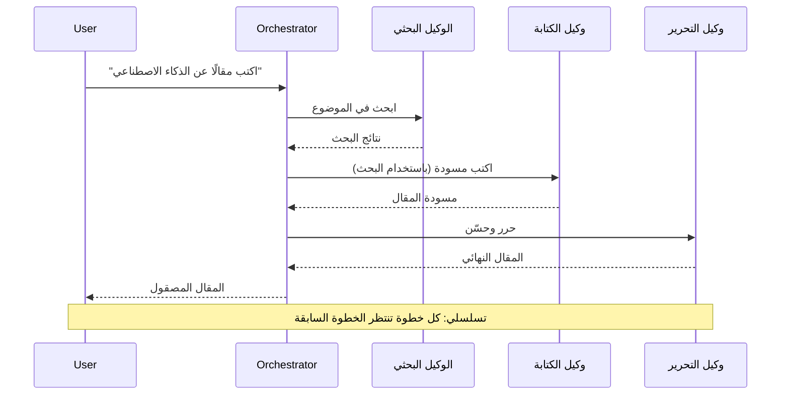
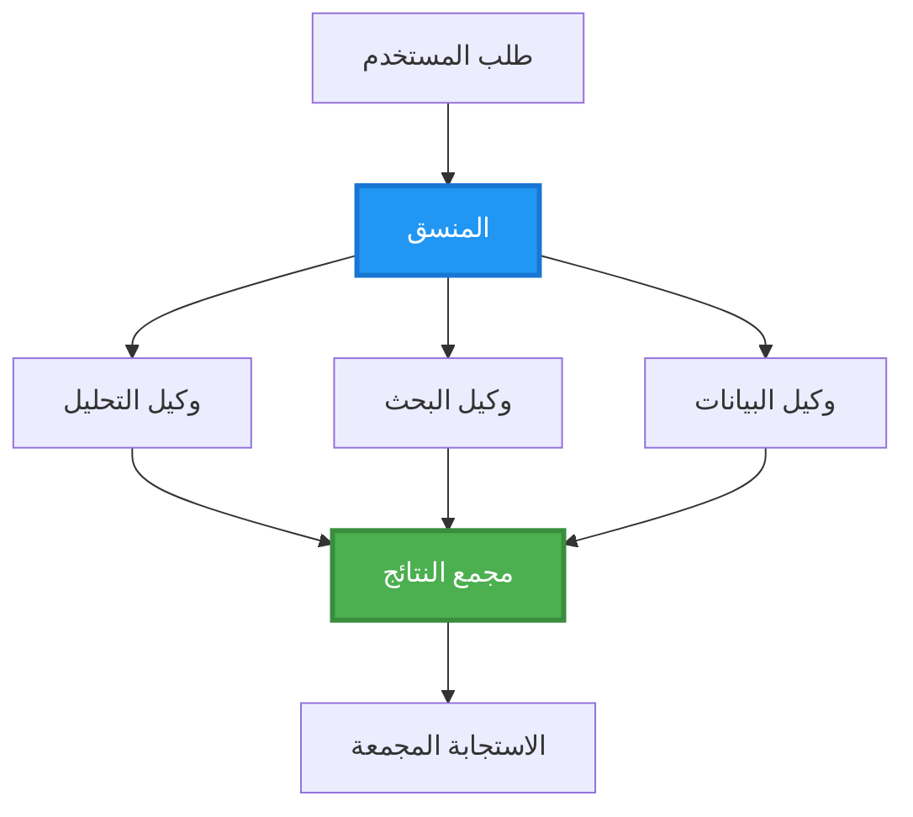
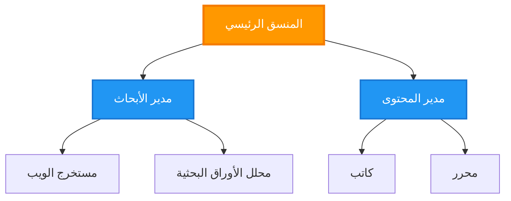
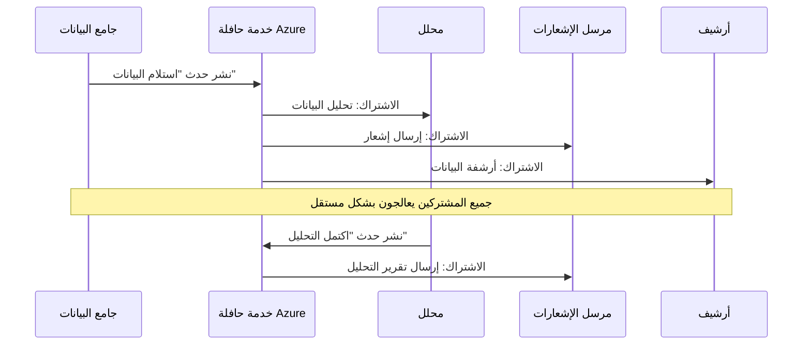
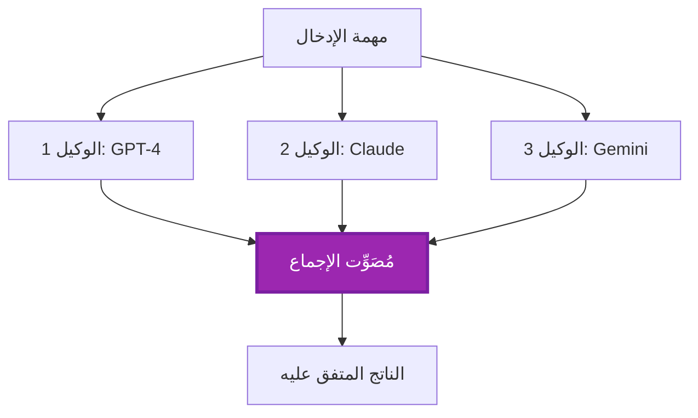

# أنماط تنسيق الوكلاء المتعددين

⏱️ **الوقت المقدر**: 60-75 دقيقة | 💰 **التكلفة المقدرة**: ~$100-300/شهر | ⭐ **التعقيد**: متقدم

**📚 مسار التعلم:**
- ← السابق: [تخطيط السعة](capacity-planning.md) - تحديد حجم الموارد واستراتيجيات التدرج
- 🎯 **أنت هنا**: أنماط تنسيق الوكلاء المتعددين (التنسيق، التواصل، إدارة الحالة)
- → التالي: [اختيار SKU](sku-selection.md) - اختيار خدمات Azure المناسبة
- 🏠 [الصفحة الرئيسية للدورة](../../README.md)

---

## ما الذي ستتعلمه

عند إكمال هذا الدرس، سوف:
- فهم أنماط **هندسة الوكلاء المتعددين** ومتى تُستخدم
- تنفيذ **أنماط التنسيق** (مركزية، لامركزية، هرمية)
- تصميم استراتيجيات **تواصل الوكلاء** (متزامن، غير متزامن، مدفوع بالأحداث)
- إدارة **الحالة المشتركة** عبر الوكلاء الموزعين
- نشر **أنظمة الوكلاء المتعددين** على Azure باستخدام AZD
- تطبيق **أنماط التنسيق** في سيناريوهات الذكاء الاصطناعي الحقيقية
- مراقبة وتصحيح أخطاء أنظمة الوكلاء الموزعة

## لماذا يهم تنسيق الوكلاء المتعددين

### التطور: من وكيل واحد إلى وكلاء متعددين

**وكيل واحد (بسيط):**
```
User → Agent → Response
```
- ✅ سهل الفهم والتنفيذ
- ✅ سريع للمهام البسيطة
- ❌ مقيد بقدرات النموذج الواحد
- ❌ لا يمكنه تنفيذ المهام المعقدة بالتوازي
- ❌ لا اختصاص

**نظام الوكلاء المتعددين (متقدم):**
```
           ┌─────────────┐
           │ Orchestrator│
           └──────┬──────┘
        ┌─────────┼─────────┐
        │         │         │
    ┌───▼──┐  ┌──▼───┐  ┌──▼────┐
    │Agent1│  │Agent2│  │Agent3 │
    │(Plan)│  │(Code)│  │(Review)│
    └──────┘  └──────┘  └───────┘
```
- ✅ وكلاء متخصصون لمهام محددة
- ✅ تنفيذ متوازي للسرعة
- ✅ قابلية للصيانة والوحدات المكونة
- ✅ أفضل في سير العمل المعقد
- ⚠️ يتطلب منطق تنسيق

**تشبيه**: الوكيل الفردي مثل شخص واحد يقوم بجميع المهام. الوكلاء المتعددون مثل فريق حيث يمتلك كل عضو مهارات متخصصة (باحث، مبرمج، مراجع، كاتب) يعملون معًا.

---

## أنماط التنسيق الأساسية

### النمط 1: التنسيق التسلسلي (سلسلة المسؤولية)

**متى تُستخدم**: يجب إتمام المهام بترتيب محدد، مما يبني كل وكيل على ناتج السابق.


**الفوائد:**
- ✅ تدفق بيانات واضح
- ✅ سهل تصحيح الأخطاء
- ✅ ترتيب تنفيذ متوقع

**القيود:**
- ❌ أبطأ (لا توازي)
- ❌ فشل واحد يعطل السلسلة بأكملها
- ❌ لا يستطيع التعامل مع المهام المترابطة

**أمثلة لاستخدامه:**
- خط أنابيب إنشاء المحتوى (بحث → كتابة → تعديل → نشر)
- توليد الشفرة (تخطيط → تنفيذ → اختبار → نشر)
- توليد التقارير (جمع البيانات → تحليل → تصور → ملخص)

---

### النمط 2: التنسيق المتوازي (Fan-Out/Fan-In)

**متى تُستخدم**: يمكن تشغيل المهام المستقلة في وقت واحد، وتُجمَع النتائج في النهاية.


**الفوائد:**
- ✅ سريع (تنفيذ متوازي)
- ✅ متسامح مع الأخطاء (النتائج الجزئية مقبولة)
- ✅ قابل للتوسع أفقيًا

**القيود:**
- ⚠️ قد تصل النتائج بترتيب غير متوقع
- ⚠️ الحاجة إلى منطق تجميع
- ⚠️ إدارة الحالة معقدة

**أمثلة لاستخدامه:**
- جمع بيانات من مصادر متعددة (APIs + قواعد بيانات + استخراج الويب)
- تحليل تنافسي (نماذج متعددة تُنتج حلولًا، يُختار الأفضل)
- خدمات الترجمة (الترجمة إلى عدة لغات في وقت واحد)

---

### النمط 3: التنسيق الهرمي (المدير-العامل)

**متى تُستخدم**: سير عمل معقد يحتوي على مهام فرعية، مطلوب التفويض.


**الفوائد:**
- ✅ يتعامل مع سير العمل المعقد
- ✅ قابلية للصيانة والوحدات المكونة
- ✅ حدود مسؤولية واضحة

**القيود:**
- ⚠️ بنية أكثر تعقيدًا
- ⚠️ زمن استجابة أعلى (طبقات تنسيق متعددة)
- ⚠️ يتطلب تنسيقًا متقدمًا

**أمثلة لاستخدامه:**
- معالجة مستندات المؤسسة (تصنيف → توجيه → معالجة → أرشفة)
- خطوط أنابيب بيانات متعددة المراحل (استيعاب → تنظيف → تحويل → تحليل → تقرير)
- سير عمل أتمتة معقد (التخطيط → تخصيص الموارد → التنفيذ → المراقبة)

---

### النمط 4: التنسيق المدفوع بالأحداث (نشر-اشتراك)

**متى تُستخدم**: يحتاج الوكلاء إلى التفاعل مع الأحداث، ويُرغب في ارتباط مرن.


**الفوائد:**
- ✅ ارتباط مرن بين الوكلاء
- ✅ سهل إضافة وكلاء جدد (فقط اشترك)
- ✅ معالجة غير متزامنة
- ✅ مرن (استمرارية الرسائل)

**القيود:**
- ⚠️ اتساق نهائي
- ⚠️ تصحيح أخطاء معقد
- ⚠️ تحديات ترتيب الرسائل

**أمثلة لاستخدامه:**
- أنظمة المراقبة اللحظية (تنبيهات، لوحات تحكم، سجلات)
- إشعارات متعددة القنوات (بريد إلكتروني، SMS، إشعارات، Slack)
- خطوط أنابيب معالجة البيانات (مستهلكون متعددون لنفس البيانات)

---

### النمط 5: التنسيق القائم على الإجماع (التصويت/نصاب)

**متى تُستخدم**: الحاجة إلى اتفاق من عدة وكلاء قبل المتابعة.


**الفوائد:**
- ✅ دقة أعلى (آراء متعددة)
- ✅ متسامح مع الأخطاء (فشل الأقلية مقبول)
- ✅ ضمان جودة مدمج

**القيود:**
- ❌ مكلف (استدعاءات نماذج متعددة)
- ❌ أبطأ (الانتظار لجميع الوكلاء)
- ⚠️ الحاجة إلى آلية حل النزاعات

**أمثلة لاستخدامه:**
- مراجعة المحتوى (نماذج متعددة تراجع المحتوى)
- مراجعة الشفرة (مفحّصات/محللات متعددة)
- التشخيص الطبي (نماذج ذكاء اصطناعي متعددة، والتحقق الخبير)

---

## نظرة عامة على الهندسة المعمارية

### نظام الوكلاء المتعددين الكامل على Azure

```mermaid
graph TB
    User[المستخدم / عميل واجهة برمجة التطبيقات]
    APIM[إدارة واجهات برمجة تطبيقات Azure]
    Orchestrator[خدمة المنسق<br/>تطبيق حاوية]
    ServiceBus[خدمة الرسائل من Azure<br/>مجمّع الأحداث (Event Hub)]
    
    Agent1[وكيل البحث<br/>تطبيق حاوية]
    Agent2[وكيل الكاتب<br/>تطبيق حاوية]
    Agent3[وكيل المحلل<br/>تطبيق حاوية]
    Agent4[وكيل المراجع<br/>تطبيق حاوية]
    
    CosmosDB[(Cosmos DB<br/>الحالة المشتركة)]
    Storage[تخزين Azure<br/>المخرجات]
    AppInsights[رؤى التطبيق<br/>المراقبة]
    
    User --> APIM
    APIM --> Orchestrator
    
    Orchestrator --> ServiceBus
    ServiceBus --> Agent1
    ServiceBus --> Agent2
    ServiceBus --> Agent3
    ServiceBus --> Agent4
    
    Agent1 --> CosmosDB
    Agent2 --> CosmosDB
    Agent3 --> CosmosDB
    Agent4 --> CosmosDB
    
    Agent1 --> Storage
    Agent2 --> Storage
    Agent3 --> Storage
    Agent4 --> Storage
    
    Orchestrator -.-> AppInsights
    Agent1 -.-> AppInsights
    Agent2 -.-> AppInsights
    Agent3 -.-> AppInsights
    Agent4 -.-> AppInsights
    
    style Orchestrator fill:#FF9800,stroke:#F57C00,stroke-width:3px,color:#fff
    style ServiceBus fill:#9C27B0,stroke:#7B1FA2,stroke-width:3px,color:#fff
    style CosmosDB fill:#4CAF50,stroke:#388E3C,stroke-width:3px,color:#fff
```
**المكونات الرئيسية:**

| المكون | الغرض | خدمة Azure |
|-----------|---------|---------------|
| **بوابة API** | نقطة الدخول، تحديد المعدل، المصادقة | API Management |
| **المنسق** | ينسق تدفقات عمل الوكلاء | Container Apps |
| **طابور الرسائل** | اتصال غير متزامن | Service Bus / Event Hubs |
| **الوكلاء** | عمال ذكاء اصطناعي متخصصون | Container Apps / Functions |
| **مخزن الحالة** | الحالة المشتركة، تتبع المهام | Cosmos DB |
| **تخزين العناصر** | مستندات، نتائج، سجلات | Blob Storage |
| **المراقبة** | التتبع الموزع، السجلات | Application Insights |

---

## المتطلبات المسبقة

### الأدوات المطلوبة

```bash
# تحقق من Azure Developer CLI
azd version
# ✅ المتوقع: إصدار azd 1.0.0 أو أعلى

# تحقق من Azure CLI
az --version
# ✅ المتوقع: إصدار azure-cli 2.50.0 أو أعلى

# تحقق من Docker (لاختبار محلي)
docker --version
# ✅ المتوقع: إصدار Docker 20.10 أو أعلى
```

### متطلبات Azure

- اشتراك Azure نشط
- أذونات لإنشاء:
  - Container Apps
  - Service Bus namespaces
  - Cosmos DB accounts
  - Storage accounts
  - Application Insights

### المتطلبات المعرفية

يجب أن تكون قد أكملت:
- [إدارة التكوين](../chapter-03-configuration/configuration.md)
- [المصادقة والأمن](../chapter-03-configuration/authsecurity.md)
- [مثال الخدمات المصغرة](../../../../examples/microservices)

---

## دليل التنفيذ

### هيكل المشروع

```
multi-agent-system/
├── azure.yaml                    # AZD configuration
├── infra/
│   ├── main.bicep               # Main infrastructure
│   ├── core/
│   │   ├── servicebus.bicep     # Message queue
│   │   ├── cosmos.bicep         # State store
│   │   ├── storage.bicep        # Artifact storage
│   │   └── monitoring.bicep     # Application Insights
│   └── app/
│       ├── orchestrator.bicep   # Orchestrator service
│       └── agent.bicep          # Agent template
└── src/
    ├── orchestrator/            # Orchestration logic
    │   ├── app.py
    │   ├── workflows.py
    │   └── Dockerfile
    ├── agents/
    │   ├── research/            # Research agent
    │   ├── writer/              # Writer agent
    │   ├── analyst/             # Analyst agent
    │   └── reviewer/            # Reviewer agent
    └── shared/
        ├── state_manager.py     # Shared state logic
        └── message_handler.py   # Message handling
```

---

## الدرس 1: نمط التنسيق التسلسلي

### التنفيذ: خط أنابيب إنشاء المحتوى

سنبني خط أنابيب تسلسلي: بحث → كتابة → تعديل → نشر

### 1. تهيئة AZD

**الملف: `azure.yaml`**

```yaml
name: content-pipeline
metadata:
  template: multi-agent-sequential@1.0.0

services:
  orchestrator:
    project: ./src/orchestrator
    language: python
    host: containerapp
  
  research-agent:
    project: ./src/agents/research
    language: python
    host: containerapp
  
  writer-agent:
    project: ./src/agents/writer
    language: python
    host: containerapp
  
  editor-agent:
    project: ./src/agents/editor
    language: python
    host: containerapp
```

### 2. البنية التحتية: Service Bus للتنسيق

**الملف: `infra/core/servicebus.bicep`**

```bicep
param name string
param location string
param tags object = {}

resource serviceBusNamespace 'Microsoft.ServiceBus/namespaces@2022-10-01-preview' = {
  name: name
  location: location
  tags: tags
  sku: {
    name: 'Standard'
    tier: 'Standard'
  }
  properties: {
    minimumTlsVersion: '1.2'
  }
}

// Queue for orchestrator → research agent
resource researchQueue 'Microsoft.ServiceBus/namespaces/queues@2022-10-01-preview' = {
  parent: serviceBusNamespace
  name: 'research-tasks'
  properties: {
    maxDeliveryCount: 3
    lockDuration: 'PT5M'
    deadLetteringOnMessageExpiration: true
  }
}

// Queue for research agent → writer agent
resource writerQueue 'Microsoft.ServiceBus/namespaces/queues@2022-10-01-preview' = {
  parent: serviceBusNamespace
  name: 'writer-tasks'
  properties: {
    maxDeliveryCount: 3
    lockDuration: 'PT5M'
  }
}

// Queue for writer agent → editor agent
resource editorQueue 'Microsoft.ServiceBus/namespaces/queues@2022-10-01-preview' = {
  parent: serviceBusNamespace
  name: 'editor-tasks'
  properties: {
    maxDeliveryCount: 3
    lockDuration: 'PT5M'
  }
}

output namespace string = serviceBusNamespace.name
output connectionString string = listKeys('${serviceBusNamespace.id}/AuthorizationRules/RootManageSharedAccessKey', serviceBusNamespace.apiVersion).primaryConnectionString
```

### 3. مدير الحالة المشتركة

**الملف: `src/shared/state_manager.py`**

```python
from azure.cosmos import CosmosClient, PartitionKey
from datetime import datetime
import os

class StateManager:
    """Manages shared state across agents using Cosmos DB"""
    
    def __init__(self):
        endpoint = os.environ['COSMOS_ENDPOINT']
        key = os.environ['COSMOS_KEY']
        
        self.client = CosmosClient(endpoint, key)
        self.database = self.client.get_database_client('agent-state')
        self.container = self.database.get_container_client('tasks')
    
    def create_task(self, task_id: str, task_type: str, input_data: dict):
        """Create a new task"""
        task = {
            'id': task_id,
            'type': task_type,
            'status': 'pending',
            'input': input_data,
            'created_at': datetime.utcnow().isoformat(),
            'steps': []
        }
        self.container.create_item(task)
        return task
    
    def update_task_step(self, task_id: str, step_name: str, result: dict):
        """Update task with completed step"""
        task = self.container.read_item(task_id, partition_key=task_id)
        
        task['steps'].append({
            'name': step_name,
            'completed_at': datetime.utcnow().isoformat(),
            'result': result
        })
        
        self.container.replace_item(task_id, task)
        return task
    
    def complete_task(self, task_id: str, final_result: dict):
        """Mark task as complete"""
        task = self.container.read_item(task_id, partition_key=task_id)
        task['status'] = 'completed'
        task['result'] = final_result
        task['completed_at'] = datetime.utcnow().isoformat()
        self.container.replace_item(task_id, task)
        return task
    
    def get_task(self, task_id: str):
        """Retrieve task state"""
        return self.container.read_item(task_id, partition_key=task_id)
```

### 4. خدمة المنسق

**الملف: `src/orchestrator/app.py`**

```python
from flask import Flask, request, jsonify
from azure.servicebus import ServiceBusClient, ServiceBusMessage
import json
import uuid
import os
from shared.state_manager import StateManager

app = Flask(__name__)
state_manager = StateManager()

# اتصال Service Bus
servicebus_connection_str = os.environ['SERVICEBUS_CONNECTION_STRING']
servicebus_client = ServiceBusClient.from_connection_string(servicebus_connection_str)

@app.route('/health', methods=['GET'])
def health():
    return jsonify({'status': 'healthy', 'service': 'orchestrator'})

@app.route('/create-content', methods=['POST'])
def create_content():
    """
    Sequential workflow: Research → Write → Edit → Publish
    """
    data = request.json
    topic = data.get('topic')
    
    if not topic:
        return jsonify({'error': 'Topic required'}), 400
    
    # إنشاء مهمة في مخزن الحالة
    task_id = str(uuid.uuid4())
    task = state_manager.create_task(
        task_id=task_id,
        task_type='content_creation',
        input_data={'topic': topic}
    )
    
    # إرسال رسالة إلى وكيل البحث (الخطوة الأولى)
    sender = servicebus_client.get_queue_sender('research-tasks')
    message = ServiceBusMessage(
        body=json.dumps({
            'task_id': task_id,
            'topic': topic,
            'next_queue': 'writer-tasks'  # أين تُرسل النتائج
        }),
        content_type='application/json'
    )
    
    with sender:
        sender.send_messages(message)
    
    return jsonify({
        'task_id': task_id,
        'status': 'started',
        'workflow': 'sequential',
        'steps': ['research', 'write', 'edit', 'publish'],
        'message': 'Content creation pipeline initiated'
    }), 202

@app.route('/task/<task_id>', methods=['GET'])
def get_task_status(task_id):
    """Check task status"""
    try:
        task = state_manager.get_task(task_id)
        return jsonify(task)
    except Exception as e:
        return jsonify({'error': str(e)}), 404

if __name__ == '__main__':
    app.run(host='0.0.0.0', port=8080)
```

### 5. وكيل البحث

**الملف: `src/agents/research/app.py`**

```python
from azure.servicebus import ServiceBusClient, ServiceBusMessage
from openai import AzureOpenAI
import json
import os
import time
from shared.state_manager import StateManager

# تهيئة العملاء
state_manager = StateManager()
servicebus_client = ServiceBusClient.from_connection_string(
    os.environ['SERVICEBUS_CONNECTION_STRING']
)

openai_client = AzureOpenAI(
    api_key=os.environ['AZURE_OPENAI_API_KEY'],
    api_version="2024-02-01",
    azure_endpoint=os.environ['AZURE_OPENAI_ENDPOINT']
)

def process_research_task(message_data):
    """Process research request and pass to writer"""
    task_id = message_data['task_id']
    topic = message_data['topic']
    next_queue = message_data['next_queue']
    
    print(f"🔬 Researching: {topic}")
    
    # استدعاء Azure OpenAI للأبحاث
    response = openai_client.chat.completions.create(
        model="gpt-4",
        messages=[
            {"role": "system", "content": "You are a research assistant. Provide comprehensive research on the given topic."},
            {"role": "user", "content": f"Research this topic thoroughly: {topic}"}
        ],
        max_tokens=1500
    )
    
    research_results = response.choices[0].message.content
    
    # تحديث الحالة
    state_manager.update_task_step(
        task_id=task_id,
        step_name='research',
        result={'research': research_results}
    )
    
    # إرسال إلى الوكيل التالي (الكاتب)
    sender = servicebus_client.get_queue_sender(next_queue)
    message = ServiceBusMessage(
        body=json.dumps({
            'task_id': task_id,
            'topic': topic,
            'research': research_results,
            'next_queue': 'editor-tasks'
        }),
        content_type='application/json'
    )
    
    with sender:
        sender.send_messages(message)
    
    print(f"✅ Research complete for task {task_id}")

def main():
    """Listen to research queue"""
    receiver = servicebus_client.get_queue_receiver('research-tasks')
    
    print("🔬 Research Agent started, listening for tasks...")
    
    with receiver:
        while True:
            messages = receiver.receive_messages(max_wait_time=5)
            for message in messages:
                try:
                    message_data = json.loads(str(message))
                    process_research_task(message_data)
                    receiver.complete_message(message)
                except Exception as e:
                    print(f"❌ Error processing message: {e}")
                    receiver.abandon_message(message)

if __name__ == '__main__':
    main()
```

### 6. وكيل الكاتب

**الملف: `src/agents/writer/app.py`**

```python
from azure.servicebus import ServiceBusClient, ServiceBusMessage
from openai import AzureOpenAI
import json
import os
from shared.state_manager import StateManager

state_manager = StateManager()
servicebus_client = ServiceBusClient.from_connection_string(
    os.environ['SERVICEBUS_CONNECTION_STRING']
)

openai_client = AzureOpenAI(
    api_key=os.environ['AZURE_OPENAI_API_KEY'],
    api_version="2024-02-01",
    azure_endpoint=os.environ['AZURE_OPENAI_ENDPOINT']
)

def process_writing_task(message_data):
    """Write article based on research"""
    task_id = message_data['task_id']
    topic = message_data['topic']
    research = message_data['research']
    next_queue = message_data['next_queue']
    
    print(f"✍️ Writing article: {topic}")
    
    # اتصل بـ Azure OpenAI لكتابة مقال
    response = openai_client.chat.completions.create(
        model="gpt-4",
        messages=[
            {"role": "system", "content": "You are a professional writer. Write engaging, well-structured articles."},
            {"role": "user", "content": f"Based on this research:\n\n{research}\n\nWrite a comprehensive article about: {topic}"}
        ],
        max_tokens=2000
    )
    
    article_draft = response.choices[0].message.content
    
    # تحديث الحالة
    state_manager.update_task_step(
        task_id=task_id,
        step_name='writing',
        result={'draft': article_draft}
    )
    
    # أرسل إلى المحرر
    sender = servicebus_client.get_queue_sender(next_queue)
    message = ServiceBusMessage(
        body=json.dumps({
            'task_id': task_id,
            'topic': topic,
            'draft': article_draft
        }),
        content_type='application/json'
    )
    
    with sender:
        sender.send_messages(message)
    
    print(f"✅ Article draft complete for task {task_id}")

def main():
    """Listen to writer queue"""
    receiver = servicebus_client.get_queue_receiver('writer-tasks')
    
    print("✍️ Writer Agent started, listening for tasks...")
    
    with receiver:
        while True:
            messages = receiver.receive_messages(max_wait_time=5)
            for message in messages:
                try:
                    message_data = json.loads(str(message))
                    process_writing_task(message_data)
                    receiver.complete_message(message)
                except Exception as e:
                    print(f"❌ Error: {e}")
                    receiver.abandon_message(message)

if __name__ == '__main__':
    main()
```

### 7. وكيل المحرر

**الملف: `src/agents/editor/app.py`**

```python
from azure.servicebus import ServiceBusClient
from openai import AzureOpenAI
import json
import os
from shared.state_manager import StateManager

state_manager = StateManager()
servicebus_client = ServiceBusClient.from_connection_string(
    os.environ['SERVICEBUS_CONNECTION_STRING']
)

openai_client = AzureOpenAI(
    api_key=os.environ['AZURE_OPENAI_API_KEY'],
    api_version="2024-02-01",
    azure_endpoint=os.environ['AZURE_OPENAI_ENDPOINT']
)

def process_editing_task(message_data):
    """Edit and finalize article"""
    task_id = message_data['task_id']
    topic = message_data['topic']
    draft = message_data['draft']
    
    print(f"📝 Editing article: {topic}")
    
    # استدعاء Azure OpenAI للتحرير
    response = openai_client.chat.completions.create(
        model="gpt-4",
        messages=[
            {"role": "system", "content": "You are an expert editor. Improve grammar, clarity, and structure."},
            {"role": "user", "content": f"Edit and improve this article:\n\n{draft}"}
        ],
        max_tokens=2000
    )
    
    final_article = response.choices[0].message.content
    
    # وضع علامة على المهمة كمكتملة
    state_manager.complete_task(
        task_id=task_id,
        final_result={
            'topic': topic,
            'final_article': final_article,
            'word_count': len(final_article.split())
        }
    )
    
    print(f"✅ Article finalized for task {task_id}")

def main():
    """Listen to editor queue"""
    receiver = servicebus_client.get_queue_receiver('editor-tasks')
    
    print("📝 Editor Agent started, listening for tasks...")
    
    with receiver:
        while True:
            messages = receiver.receive_messages(max_wait_time=5)
            for message in messages:
                try:
                    message_data = json.loads(str(message))
                    process_editing_task(message_data)
                    receiver.complete_message(message)
                except Exception as e:
                    print(f"❌ Error: {e}")
                    receiver.abandon_message(message)

if __name__ == '__main__':
    main()
```

### 8. النشر والاختبار

```bash
# تهيئة ونشر
azd init
azd up

# الحصول على عنوان URL للمنسق
ORCHESTRATOR_URL=$(azd env get-values | grep ORCHESTRATOR_URL | cut -d '=' -f2 | tr -d '"')

# إنشاء محتوى
curl -X POST $ORCHESTRATOR_URL/create-content \
  -H "Content-Type: application/json" \
  -d '{"topic": "The Future of AI in Healthcare"}'
```

**✅ المخرجات المتوقعة:**
```json
{
  "task_id": "a1b2c3d4-e5f6-7890-abcd-ef1234567890",
  "status": "started",
  "workflow": "sequential",
  "steps": ["research", "write", "edit", "publish"],
  "message": "Content creation pipeline initiated"
}
```

**تحقق من تقدم المهمة:**
```bash
TASK_ID="a1b2c3d4-e5f6-7890-abcd-ef1234567890"
curl $ORCHESTRATOR_URL/task/$TASK_ID
```

**✅ المخرجات المتوقعة (مكتملة):**
```json
{
  "id": "a1b2c3d4-e5f6-7890-abcd-ef1234567890",
  "type": "content_creation",
  "status": "completed",
  "steps": [
    {
      "name": "research",
      "completed_at": "2025-11-19T10:30:00Z",
      "result": {"research": "..."}
    },
    {
      "name": "writing",
      "completed_at": "2025-11-19T10:32:00Z",
      "result": {"draft": "..."}
    }
  ],
  "result": {
    "topic": "The Future of AI in Healthcare",
    "final_article": "...",
    "word_count": 1500
  }
}
```

---

## الدرس 2: نمط التنسيق المتوازي

### التنفيذ: مجمّع البحث متعدد المصادر

سنبني نظامًا متوازيًا يجمع المعلومات من مصادر متعددة في وقت واحد.

### المنسق المتوازي

**الملف: `src/orchestrator/parallel_workflow.py`**

```python
from flask import Flask, request, jsonify
from azure.servicebus import ServiceBusClient, ServiceBusMessage
import json
import uuid
import os
from shared.state_manager import StateManager

app = Flask(__name__)
state_manager = StateManager()

servicebus_client = ServiceBusClient.from_connection_string(
    os.environ['SERVICEBUS_CONNECTION_STRING']
)

@app.route('/research-parallel', methods=['POST'])
def research_parallel():
    """
    Parallel workflow: Multiple agents work simultaneously
    """
    data = request.json
    query = data.get('query')
    
    task_id = str(uuid.uuid4())
    task = state_manager.create_task(
        task_id=task_id,
        task_type='parallel_research',
        input_data={
            'query': query,
            'agents': ['web', 'academic', 'news', 'social']
        }
    )
    
    # توزيع متزامن: الإرسال إلى جميع الوكلاء في وقت واحد
    agents = [
        ('web-research-queue', 'web'),
        ('academic-research-queue', 'academic'),
        ('news-research-queue', 'news'),
        ('social-research-queue', 'social')
    ]
    
    for queue_name, agent_type in agents:
        sender = servicebus_client.get_queue_sender(queue_name)
        message = ServiceBusMessage(
            body=json.dumps({
                'task_id': task_id,
                'query': query,
                'agent_type': agent_type,
                'result_queue': 'aggregation-queue'
            }),
            content_type='application/json'
        )
        
        with sender:
            sender.send_messages(message)
    
    return jsonify({
        'task_id': task_id,
        'status': 'started',
        'workflow': 'parallel',
        'agents_dispatched': 4,
        'message': 'Parallel research initiated'
    }), 202

if __name__ == '__main__':
    app.run(host='0.0.0.0', port=8080)
```

### منطق التجميع

**الملف: `src/agents/aggregator/app.py`**

```python
from azure.servicebus import ServiceBusClient
import json
import os
from collections import defaultdict
from shared.state_manager import StateManager

state_manager = StateManager()
servicebus_client = ServiceBusClient.from_connection_string(
    os.environ['SERVICEBUS_CONNECTION_STRING']
)

# تتبع النتائج لكل مهمة
task_results = defaultdict(list)
expected_agents = 4  # الويب، أكاديمي، أخبار، اجتماعي

def process_result(message_data):
    """Aggregate results from parallel agents"""
    task_id = message_data['task_id']
    agent_type = message_data['agent_type']
    result = message_data['result']
    
    # تخزين النتيجة
    task_results[task_id].append({
        'agent': agent_type,
        'data': result
    })
    
    print(f"📊 Received result from {agent_type} agent ({len(task_results[task_id])}/{expected_agents})")
    
    # التحقق مما إذا كان جميع الوكلاء قد أتموا (اندماج الوارد)
    if len(task_results[task_id]) == expected_agents:
        print(f"✅ All agents completed for task {task_id}. Aggregating...")
        
        # دمج النتائج
        aggregated = {
            'query': message_data['query'],
            'sources': task_results[task_id],
            'summary': generate_summary(task_results[task_id])
        }
        
        # وضع علامة كمكتمل
        state_manager.complete_task(task_id, aggregated)
        
        # تنظيف
        del task_results[task_id]
        
        print(f"✅ Aggregation complete for task {task_id}")

def generate_summary(results):
    """Generate summary from all sources"""
    summaries = [r['data'].get('summary', '') for r in results]
    return '\n\n'.join(summaries)

def main():
    """Listen to aggregation queue"""
    receiver = servicebus_client.get_queue_receiver('aggregation-queue')
    
    print("📊 Aggregator started, listening for results...")
    
    with receiver:
        while True:
            messages = receiver.receive_messages(max_wait_time=5)
            for message in messages:
                try:
                    message_data = json.loads(str(message))
                    process_result(message_data)
                    receiver.complete_message(message)
                except Exception as e:
                    print(f"❌ Error: {e}")
                    receiver.abandon_message(message)

if __name__ == '__main__':
    main()
```

**فوائد النمط المتوازٍ:**
- ⚡ **أسرع 4 مرات** (تشغيل الوكلاء في وقت واحد)
- 🔄 **متسامح مع الأخطاء** (النتائج الجزئية مقبولة)
- 📈 **قابل للتوسع** (إضافة وكلاء بسهولة)

---

## التمارين العملية

### التمرين 1: إضافة معالجة انتهاء المهلة ⭐⭐ (متوسط)

**الهدف**: تنفيذ منطق انتهاء المهلة حتى لا ينتظر المجمّع للأبد الوكلاء البطيئين.

**الخطوات**:

1. **أضف تتبع انتهاء المهلة إلى المجمّع:**

```python
from datetime import datetime, timedelta

task_timeouts = {}  # معرّف المهمة -> وقت الانتهاء

def process_result(message_data):
    task_id = message_data['task_id']
    
    # تعيين مهلة لأول نتيجة
    if task_id not in task_timeouts:
        task_timeouts[task_id] = datetime.utcnow() + timedelta(seconds=30)
    
    task_results[task_id].append({
        'agent': message_data['agent_type'],
        'data': message_data['result']
    })
    
    # تحقق مما إذا اكتملت أو انتهت مهلتها
    if len(task_results[task_id]) == expected_agents or \
       datetime.utcnow() > task_timeouts[task_id]:
        
        print(f"📊 Aggregating with {len(task_results[task_id])}/{expected_agents} results")
        
        aggregated = {
            'query': message_data['query'],
            'sources': task_results[task_id],
            'completed_agents': len(task_results[task_id]),
            'timed_out': len(task_results[task_id]) < expected_agents
        }
        
        state_manager.complete_task(task_id, aggregated)
        
        # تنظيف
        del task_results[task_id]
        del task_timeouts[task_id]
```

2. **اختبر باستخدام تأخيرات مصطنعة:**

```python
# في وكيل واحد، أضف تأخيرًا لمحاكاة معالجة بطيئة
import time
time.sleep(35)  # يتجاوز مهلة 30 ثانية
```

3. **انشر وتحقق:**

```bash
azd deploy aggregator

# إرسال المهمة
curl -X POST $ORCHESTRATOR_URL/research-parallel \
  -H "Content-Type: application/json" \
  -d '{"query": "AI safety research"}'

# تحقق من النتائج بعد 30 ثانية
curl $ORCHESTRATOR_URL/task/$TASK_ID
```

**✅ معايير النجاح:**
- ✅ تكتمل المهمة بعد 30 ثانية حتى لو لم تُكمل جميع الوكلاء
- ✅ الاستجابة تشير إلى نتائج جزئية (`"timed_out": true`)
- ✅ تُعاد النتائج المتاحة (3 من أصل 4 وكلاء)

**الوقت**: 20-25 دقيقة

---

### التمرين 2: تنفيذ منطق إعادة المحاولة ⭐⭐⭐ (متقدم)

**الهدف**: إعادة محاولة المهام الفاشلة تلقائيًا قبل الاستسلام.

**الخطوات**:

1. **أضف تتبع إعادة المحاولة إلى المنسق:**

```python
from dataclasses import dataclass
from typing import Dict

@dataclass
class RetryConfig:
    max_retries: int = 3
    backoff_seconds: int = 5

retry_counts: Dict[str, int] = {}  # معرّف الرسالة -> عدد المحاولات

def send_with_retry(queue_name: str, message_data: dict, retry_config: RetryConfig):
    """Send message with retry metadata"""
    message_id = message_data.get('message_id', str(uuid.uuid4()))
    message_data['message_id'] = message_id
    message_data['retry_count'] = retry_counts.get(message_id, 0)
    message_data['max_retries'] = retry_config.max_retries
    
    sender = servicebus_client.get_queue_sender(queue_name)
    message = ServiceBusMessage(
        body=json.dumps(message_data),
        content_type='application/json',
        message_id=message_id
    )
    
    with sender:
        sender.send_messages(message)
```

2. **أضف معالج إعادة المحاولة إلى الوكلاء:**

```python
def process_with_retry(message, receiver, process_func):
    """Process message with automatic retry on failure"""
    try:
        message_data = json.loads(str(message))
        
        # معالجة الرسالة
        process_func(message_data)
        
        # نجاح - مكتمل
        receiver.complete_message(message)
        
    except Exception as e:
        message_id = message.message_id
        retry_count = message_data.get('retry_count', 0)
        max_retries = message_data.get('max_retries', 3)
        
        if retry_count < max_retries:
            # إعادة المحاولة: التخلي عنه وإعادته إلى قائمة الانتظار مع زيادة العداد
            print(f"⚠️ Retry {retry_count + 1}/{max_retries} for message {message_id}")
            
            message_data['retry_count'] = retry_count + 1
            
            # إرساله إلى نفس قائمة الانتظار بعد تأخير
            time.sleep(5 * (retry_count + 1))  # تأخير أُسّي
            send_with_retry(queue_name, message_data, RetryConfig())
            
            receiver.complete_message(message)  # إزالة الأصل
        else:
            # تجاوز الحد الأقصى من المحاولات - نقله إلى قائمة الرسائل الميتة
            print(f"❌ Max retries exceeded for message {message_id}")
            receiver.dead_letter_message(
                message,
                reason="MaxRetriesExceeded",
                error_description=str(e)
            )
```

3. **راقب طابور الرسائل الميتة:**

```python
def monitor_dead_letters():
    """Check dead letter queue for failed messages"""
    receiver = servicebus_client.get_queue_receiver(
        'research-queue',
        sub_queue='deadletter'
    )
    
    with receiver:
        messages = receiver.receive_messages(max_wait_time=5)
        for message in messages:
            print(f"☠️ Dead letter: {message.message_id}")
            print(f"Reason: {message.dead_letter_reason}")
            print(f"Description: {message.dead_letter_error_description}")
```

**✅ معايير النجاح:**
- ✅ يتم إعادة محاولة المهام الفاشلة تلقائيًا (ما يصل إلى 3 مرات)
- ✅ تأخير تراجع أسي بين المحاولات (5s, 10s, 15s)
- ✅ بعد الوصول للحد الأقصى للمحاولات، تذهب الرسائل إلى طابور الرسائل الميتة
- ✅ يمكن مراقبة طابور الرسائل الميتة وإعادة تشغيله

**الوقت**: 30-40 دقيقة

---

### التمرين 3: تنفيذ قاطع الدائرة ⭐⭐⭐ (متقدم)

**الهدف**: منع فشل متسلسل عن طريق إيقاف الطلبات إلى الوكلاء الفاشلين.

**الخطوات**:

1. **أنشئ فئة قاطع الدائرة:**

```python
from enum import Enum
from datetime import datetime, timedelta

class CircuitState(Enum):
    CLOSED = "closed"      # التشغيل الطبيعي
    OPEN = "open"          # يفشل، يرفض الطلبات
    HALF_OPEN = "half_open"  # اختبار ما إذا تم التعافي

class CircuitBreaker:
    def __init__(self, failure_threshold=5, timeout_seconds=60):
        self.failure_threshold = failure_threshold
        self.timeout_seconds = timeout_seconds
        self.failure_count = 0
        self.last_failure_time = None
        self.state = CircuitState.CLOSED
    
    def call(self, func):
        """Execute function with circuit breaker protection"""
        if self.state == CircuitState.OPEN:
            # التحقق مما إذا انتهت المهلة
            if datetime.utcnow() - self.last_failure_time > timedelta(seconds=self.timeout_seconds):
                self.state = CircuitState.HALF_OPEN
                print("🔄 Circuit breaker: HALF_OPEN (testing)")
            else:
                raise Exception(f"Circuit breaker OPEN for agent. Try again in {self.timeout_seconds}s")
        
        try:
            result = func()
            
            # نجاح
            if self.state == CircuitState.HALF_OPEN:
                self.state = CircuitState.CLOSED
                self.failure_count = 0
                print("✅ Circuit breaker: CLOSED (recovered)")
            
            return result
            
        except Exception as e:
            self.failure_count += 1
            self.last_failure_time = datetime.utcnow()
            
            if self.failure_count >= self.failure_threshold:
                self.state = CircuitState.OPEN
                print(f"🔴 Circuit breaker: OPEN (too many failures)")
            
            raise e
```

2. **طبّقها على مكالمات الوكلاء:**

```python
# في المنسق
agent_circuits = {
    'web': CircuitBreaker(failure_threshold=5, timeout_seconds=60),
    'academic': CircuitBreaker(failure_threshold=5, timeout_seconds=60),
    'news': CircuitBreaker(failure_threshold=5, timeout_seconds=60),
    'social': CircuitBreaker(failure_threshold=5, timeout_seconds=60)
}

def send_to_agent(agent_type, message_data):
    """Send with circuit breaker protection"""
    circuit = agent_circuits[agent_type]
    
    try:
        circuit.call(lambda: send_message(agent_type, message_data))
    except Exception as e:
        print(f"⚠️ Skipping {agent_type} agent: {e}")
        # استمر مع الوكلاء الآخرين
```

3. **اختبر قاطع الدائرة:**

```bash
# محاكاة إخفاقات متكررة (إيقاف وكيل واحد)
az containerapp stop --name web-research-agent --resource-group rg-agents

# إرسال طلبات متعددة
for i in {1..10}; do
  curl -X POST $ORCHESTRATOR_URL/research-parallel \
    -H "Content-Type: application/json" \
    -d '{"query": "test query '$i'"}'
  sleep 2
done

# تحقق من السجلات - يجب أن ترى انفتاح الدائرة بعد 5 إخفاقات
# استخدم Azure CLI لسجلات تطبيق الحاوية:
az containerapp logs show --name orchestrator --resource-group $RG_NAME --tail 50
```

**✅ معايير النجاح:**
- ✅ بعد 5 حالات فشل، ينفتح القاطع (يرفض الطلبات)
- ✅ بعد 60 ثانية، يصبح القاطع نصف مفتوح (يختبر الاسترداد)
- ✅ تواصل الوكلاء الآخرون العمل بشكل طبيعي
- ✅ يغلق القاطع تلقائيًا عند تعافي الوكيل

**الوقت**: 40-50 دقيقة

---

## المراقبة وتصحيح الأخطاء

### التتبع الموزع باستخدام Application Insights

**الملف: `src/shared/tracing.py`**

```python
from opencensus.ext.azure.log_exporter import AzureLogHandler
from opencensus.ext.azure.trace_exporter import AzureExporter
from opencensus.trace import config_integration
from opencensus.trace.tracer import Tracer
from opencensus.trace.samplers import AlwaysOnSampler
import logging
import os

# تكوين التتبع
config_integration.trace_integrations(['requests', 'logging'])

connection_string = os.environ.get('APPLICATIONINSIGHTS_CONNECTION_STRING')

# إنشاء متتبع
tracer = Tracer(
    exporter=AzureExporter(connection_string=connection_string),
    sampler=AlwaysOnSampler()
)

# تكوين التسجيل
logger = logging.getLogger(__name__)
logger.addHandler(AzureLogHandler(connection_string=connection_string))
logger.setLevel(logging.INFO)

def trace_agent_call(agent_name, task_id, operation):
    """Trace agent operations"""
    with tracer.span(name=f'{agent_name}.{operation}') as span:
        span.add_attribute('agent', agent_name)
        span.add_attribute('task_id', task_id)
        span.add_attribute('operation', operation)
        
        try:
            result = operation()
            span.add_attribute('status', 'success')
            return result
        except Exception as e:
            span.add_attribute('status', 'error')
            span.add_attribute('error', str(e))
            raise
```

### استعلامات Application Insights

**تتبع تدفقات عمل الوكلاء المتعددين:**

```kusto
// Trace complete workflow for a task
traces
| where customDimensions.task_id == "a1b2c3d4-..."
| project timestamp, message, customDimensions.agent, customDimensions.operation
| order by timestamp asc
```

**مقارنة أداء الوكلاء:**

```kusto
// Compare agent execution times
dependencies
| where name contains "agent"
| summarize 
    avg_duration = avg(duration),
    p95_duration = percentile(duration, 95),
    count = count()
  by agent = tostring(customDimensions.agent)
| order by avg_duration desc
```

**تحليل الفشل:**

```kusto
// Find which agents fail most
exceptions
| where customDimensions.agent != ""
| summarize 
    failure_count = count(),
    unique_errors = dcount(outerMessage)
  by agent = tostring(customDimensions.agent)
| order by failure_count desc
```

---

## تحليل التكلفة

### تكاليف نظام الوكلاء المتعددين (تقديرات شهرية)

| المكون | التكوين | التكلفة |
|-----------|--------------|------|
| **المنسق** | 1 Container App (1 vCPU, 2GB) | $30-50 |
| **4 وكلاء** | 4 Container Apps (0.5 vCPU, 1GB each) | $60-120 |
| **Service Bus** | Standard tier, 10M messages | $10-20 |
| **Cosmos DB** | Serverless, 5GB storage, 1M RUs | $25-50 |
| **Blob Storage** | 10GB storage, 100K operations | $5-10 |
| **Application Insights** | 5GB ingestion | $10-15 |
| **Azure OpenAI** | GPT-4, 10M tokens | $100-300 |
| **الإجمالي** | | **$240-565/شهر** |

### استراتيجيات تحسين التكلفة

1. **استخدم الخدمات بدون خوادم حيثما أمكن:**
   ```bicep
   // Cosmos DB serverless (no minimum cost)
   properties: {
     databaseAccountOfferType: 'Standard'
     capabilities: [{ name: 'EnableServerless' }]
   }
   ```

2. **قم بمضاعفة حجم الوكلاء إلى الصفر عند الخمول:**
   ```bicep
   scale: {
     minReplicas: 0  // Scale to zero when no messages
     maxReplicas: 10
   }
   ```

3. **استخدم التجميع لـ Service Bus:**
   ```python
   # أرسل الرسائل على دفعات (أرخص)
   sender.send_messages([message1, message2, message3])
   ```

4. **قم بتخزين النتائج المستخدمة بشكل متكرر في ذاكرة مؤقتة:**
   ```python
   # استخدم Azure Cache for Redis
   if cache.exists(query_hash):
       return cache.get(query_hash)
   ```

---

## أفضل الممارسات

### ✅ افعل:

1. **استخدم عمليات idempotent**
   ```python
   # يمكن للوكيل معالجة نفس الرسالة بأمان عدة مرات
   def process_task(task_id):
       if state_manager.task_exists(task_id):
           print(f"Task {task_id} already processed, skipping")
           return
       # جاري معالجة المهمة...
   ```

2. **نفّذ تسجيلًا شاملاً**
   ```python
   logger.info(f"Agent: {agent_name}, Task: {task_id}, Action: {action}")
   ```

3. **استخدم معرّفات الارتباط**
   ```python
   # مرّر task_id عبر كامل سير العمل
   message_data = {
       'task_id': task_id,  # معرّف الارتباط
       'timestamp': datetime.utcnow().isoformat()
   }
   ```

4. **اضبط TTL للرسائل (time-to-live)**
   ```bicep
   properties: {
     defaultMessageTimeToLive: 'PT1H'  // 1 hour max
   }
   ```

5. **راقب طوابير الرسائل الميتة**
   ```python
   # المراقبة الدورية للرسائل الفاشلة
   monitor_dead_letters()
   ```

### ❌ لا تفعل:

1. **لا تنشئ تبعيات دائرية**
   ```python
   # ❌ سيئ: الوكيل A → الوكيل B → الوكيل A (حلقة لا نهائية)
   # ✅ جيد: حدد رسمًا بيانيًا موجهًا لا دوريًا واضحًا (DAG)
   ```

2. **لا تحجب خيوط التنفيذ للوكلاء**
   ```python
   # ❌ سيء: انتظار متزامن
   while not task_complete:
       time.sleep(1)
   
   # ✅ جيد: استخدم ردود نداء قائمة انتظار الرسائل
   ```

3. **لا تتجاهل الفشلات الجزئية**
   ```python
   # ❌ سيئ: فشل سير العمل بأكمله إذا فشل وكيل واحد
   # ✅ جيد: إرجاع نتائج جزئية مع مؤشرات للأخطاء
   ```

4. **لا تستخدم محاولات لا نهائية**
   ```python
   # ❌ سيء: إعادة المحاولة إلى الأبد
   # ✅ جيد: max_retries = 3، ثم إلى قائمة الرسائل الميتة
   ```

---
## دليل استكشاف الأخطاء وإصلاحها

### المشكلة: الرسائل عالقة في قائمة الانتظار

**الأعراض:**
- تتراكم الرسائل في قائمة الانتظار
- الوكلاء لا يقومون بالمعالجة
- حالة المهمة عالقة عند "pending"

**التشخيص:**
```bash
# تحقق من عمق قائمة الانتظار
az servicebus queue show \
  --namespace-name mybus \
  --name research-tasks \
  --query "countDetails"

# تحقق من سجلات الوكيل باستخدام Azure CLI
az containerapp logs show --name research-agent --resource-group $RG_NAME --tail 50
```

**الحلول:**

1. **زيادة عدد نسخ الوكلاء:**
   ```bash
   az containerapp update \
     --name research-agent \
     --min-replicas 3 \
     --max-replicas 10
   ```

2. **تحقق من قائمة رسائل الخطأ (dead letter queue):**
   ```bash
   az servicebus queue show \
     --namespace-name mybus \
     --name research-tasks \
     --query "countDetails.deadLetterMessageCount"
   ```

---

### المشكلة: انتهاء مهلة المهمة / عدم اكتمالها أبداً

**الأعراض:**
- تبقى حالة المهمة على "in_progress"
- بعض الوكلاء يكملون، والبعض الآخر لا
- لا توجد رسائل خطأ

**التشخيص:**
```bash
# تحقق من حالة المهمة
curl $ORCHESTRATOR_URL/task/$TASK_ID

# تحقق من Application Insights
# قم بتشغيل الاستعلام: traces | where customDimensions.task_id == "..."
```

**الحلول:**

1. **تنفيذ مهلة في المجمع (التمرين 1)**

2. **تحقق من فشل الوكلاء باستخدام Azure Monitor:**
   ```bash
   # عرض السجلات عبر azd monitor
   azd monitor --logs
   
   # أو استخدم Azure CLI للتحقق من سجلات تطبيق الحاوية المحددة
   az containerapp logs show --name <agent-name> --resource-group $RG_NAME --follow | grep "ERROR\|FAIL"
   ```

3. **تحقق من أن جميع الوكلاء قيد التشغيل:**
   ```bash
   az containerapp list \
     --resource-group rg-agents \
     --query "[].{name:name, status:properties.runningStatus}"
   ```

---

## لمعرفة المزيد

### الوثائق الرسمية
- [Azure Service Bus](https://learn.microsoft.com/azure/service-bus-messaging/service-bus-messaging-overview)
- [Cosmos DB](https://learn.microsoft.com/azure/cosmos-db/introduction)
- [Container Apps DAPR](https://learn.microsoft.com/azure/container-apps/dapr-overview)
- [Multi-Agent Design Patterns](https://learn.microsoft.com/azure/architecture/guide/ai/multi-agent-systems)

### الخطوات التالية في هذه الدورة
- ← السابق: [تخطيط السعة](capacity-planning.md)
- → التالي: [اختيار SKU](sku-selection.md)
- 🏠 [الصفحة الرئيسية للدورة](../../README.md)

### أمثلة ذات صلة
- [مثال الخدمات المصغرة](../../../../examples/microservices) - أنماط اتصال الخدمات
- [مثال Azure OpenAI](../../../../examples/azure-openai-chat) - تكامل الذكاء الاصطناعي

---

## الملخص

**لقد تعلمت:**
- ✅ خمسة أنماط للتنسيق (التسلسلي، المتوازي، الهرمي، المعتمد على الأحداث، الإجماع)
- ✅ معمارية متعددة الوكلاء على Azure (Service Bus، Cosmos DB، Container Apps)
- ✅ إدارة الحالة عبر الوكلاء الموزعين
- ✅ التعامل مع انتهاء المهلات، وإعادة المحاولة، وقواطع الدائرة
- ✅ مراقبة وتصحيح أخطاء الأنظمة الموزعة
- ✅ استراتيجيات تحسين التكلفة

**أهم النقاط:**
1. **اختر النمط المناسب** - التسلسلي لسير العمل المترتب، المتوازي للسرعة، المدفوع بالأحداث للمرونة
2. **قم بإدارة الحالة بعناية** - استخدم Cosmos DB أو ما شابه للحالة المشتركة
3. **تعامل مع الإخفاقات بمرونة** - مهلات، إعادة المحاولة، قواطع الدائرة، قوائم رسائل الخطأ
4. **راقب كل شيء** - التتبع الموزع أساسي لتصحيح الأخطاء
5. **حسّن التكاليف** - قم بالتدرج حتى الصفر، استخدم الحلول الخالية من الخوادم (serverless)، ونفّذ التخزين المؤقت

**الخطوات التالية:**
1. أكمل التمارين العملية
2. ابنِ نظامًا متعدد الوكلاء لحالة الاستخدام الخاصة بك
3. ادرس [اختيار SKU](sku-selection.md) لتحسين الأداء والتكلفة

---

<!-- CO-OP TRANSLATOR DISCLAIMER START -->
إخلاء المسؤولية:
تمت ترجمة هذا المستند باستخدام خدمة الترجمة الآلية Co-op Translator (https://github.com/Azure/co-op-translator). بينما نسعى إلى الدقة، يرجى العلم أن الترجمات الآلية قد تحتوي على أخطاء أو معلومات غير دقيقة. يجب اعتبار المستند الأصلي بلغته الأصلية المصدر المعتمد. بالنسبة للمعلومات الحرجة، يُنصح بالاستعانة بترجمة بشرية محترفة. لا نتحمل أي مسؤولية عن أي سوء فهم أو تفسير خاطئ ينشأ عن استخدام هذه الترجمة.
<!-- CO-OP TRANSLATOR DISCLAIMER END -->