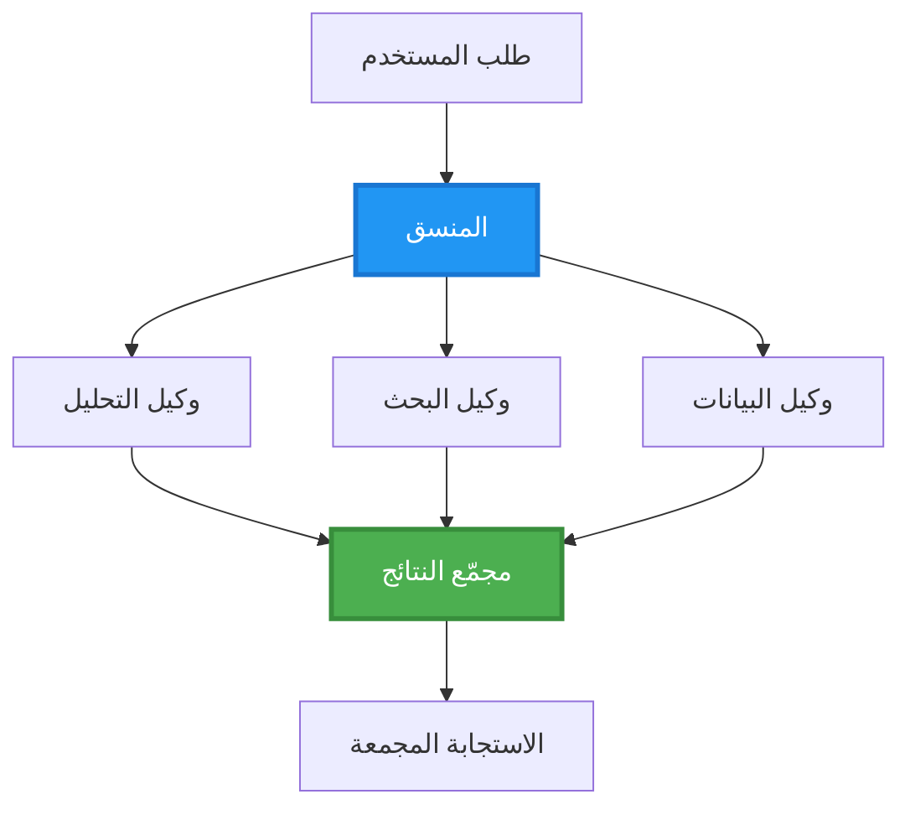
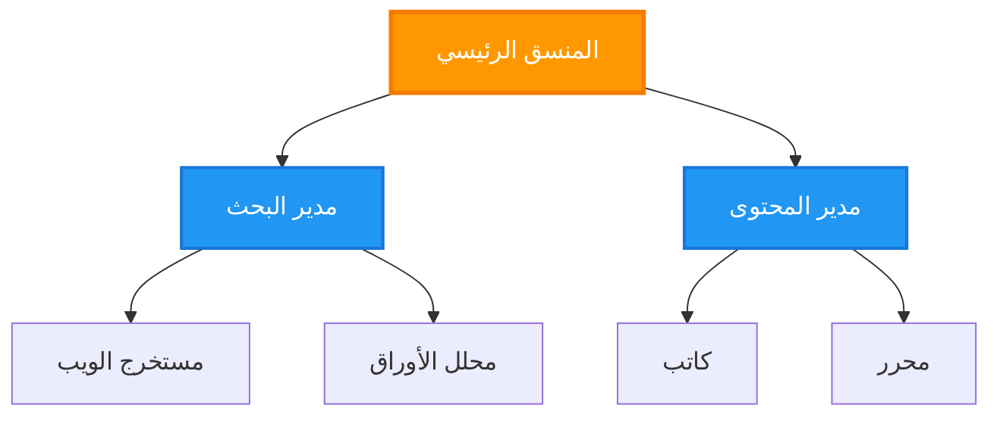
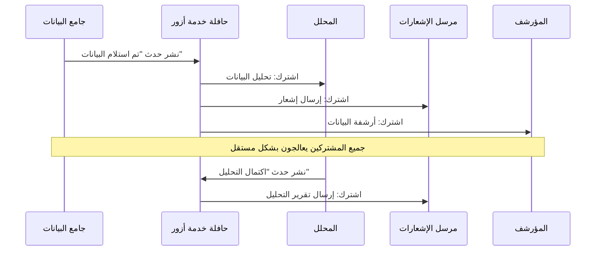
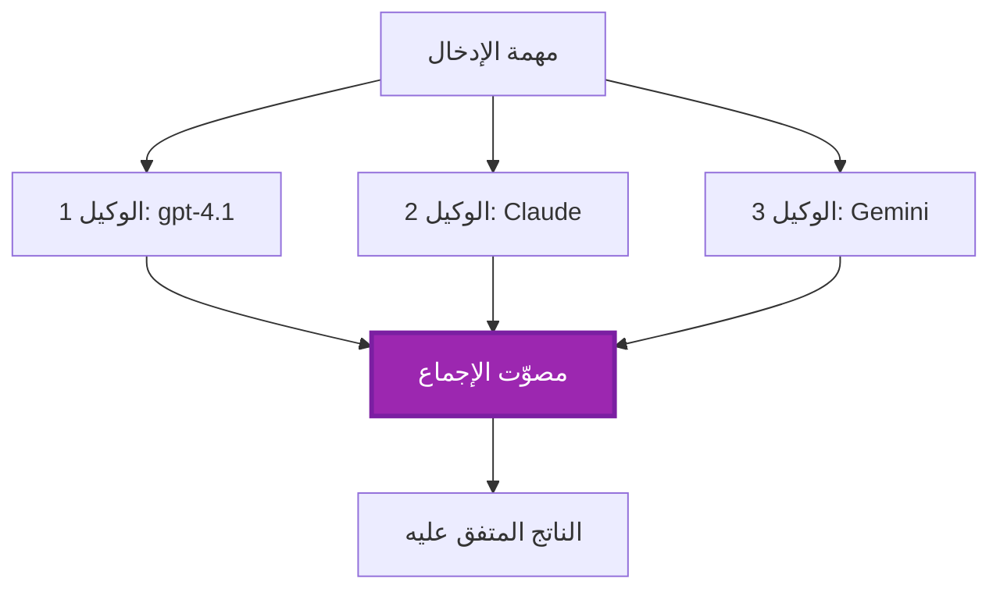
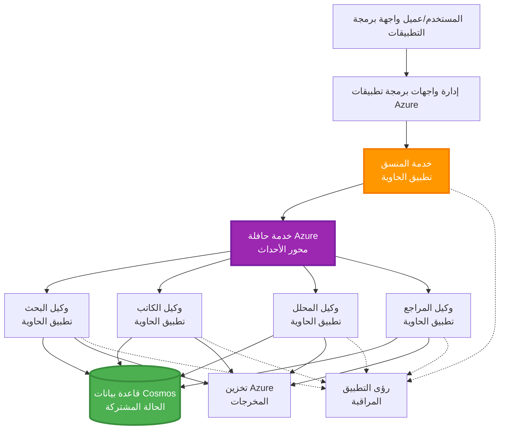

# أنماط تنسيق الوكلاء المتعددين

⏱️ **الوقت المقدر**: 60-75 دقيقة | 💰 **التكلفة المقدرة**: ~$100-300/شهريًا | ⭐ **التعقيد**: متقدم

**📚 مسار التعلم:**
- ← السابق: [تخطيط السعة](capacity-planning.md) - تحديد حجم الموارد واستراتيجيات التوسيع
- 🎯 **أنت هنا**: أنماط تنسيق الوكلاء المتعددين (التنسيق، الاتصال، إدارة الحالة)
- → التالي: [اختيار SKU](sku-selection.md) - اختيار خدمات Azure المناسبة
- 🏠 [الصفحة الرئيسية للدورة](../../README.md)

---

## ما ستتعلمه

بإكمال هذا الدرس، سوف:
- فهم أنماط **بنية الوكلاء المتعددين** ومتى تستخدمها
- تنفيذ **أنماط التنسيق** (مركزي، لامركزي، هرمي)
- تصميم استراتيجيات **اتصال الوكلاء** (متزامن، غير متزامن، مدفوع بالأحداث)
- إدارة **الحالة المشتركة** عبر الوكلاء الموزعين
- نشر **أنظمة الوكلاء المتعددين** على Azure باستخدام AZD
- تطبيق **أنماط التنسيق** في سيناريوهات الذكاء الاصطناعي الواقعية
- مراقبة وتصحيح أخطاء أنظمة الوكلاء الموزعة

## لماذا يهم تنسيق الوكلاء المتعددين

### التطور: من وكيل واحد إلى وكلاء متعددين

**وكيل واحد (بسيط):**
```
User → Agent → Response
```
- ✅ سهل الفهم والتنفيذ
- ✅ سريع للمهام البسيطة
- ❌ محدود بقدرات النموذج الواحد
- ❌ لا يمكنه تنفيذ المهام المعقدة بشكل متوازي
- ❌ لا تخصص

**نظام الوكلاء المتعددين (متقدم):**
```mermaid
graph TD
    Orchestrator[المنسق] --> Agent1[الوكيل 1<br/>خطة]
    Orchestrator --> Agent2[الوكيل 2<br/>برمجة]
    Orchestrator --> Agent3[الوكيل 3<br/>مراجعة]
```- ✅ وكلاء متخصصون لمهام محددة
- ✅ تنفيذ متوازي للسرعة
- ✅ معياري وقابل للصيانة
- ✅ أفضل في سير العمل المعقد
- ⚠️ يتطلب منطق تنسيق

**تشبيه**: الوكيل الواحد يشبه شخصًا واحدًا يقوم بجميع المهام. النظام متعدد الوكلاء يشبه فريقًا حيث يمتلك كل عضو مهارات متخصصة (باحث، مبرمج، مراجع، كاتب) يعملون معًا.

---

## أنماط التنسيق الأساسية

### النمط 1: التنسيق المتسلسل (سلسلة المسؤولية)

**متى تستخدم**: يجب إكمال المهام بترتيب محدد، حيث يبني كل وكيل على مخرجات السابق.

```mermaid
sequenceDiagram
    participant User as مستخدم
    participant Orchestrator as المنسق
    participant Agent1 as وكيل البحث
    participant Agent2 as وكيل الكاتب
    participant Agent3 as وكيل التحرير
    
    User->>Orchestrator: "اكتب مقالًا عن الذكاء الاصطناعي"
    Orchestrator->>Agent1: ابحث عن الموضوع
    Agent1-->>Orchestrator: نتائج البحث
    Orchestrator->>Agent2: اكتب مسودة (باستخدام البحث)
    Agent2-->>Orchestrator: مسودة المقال
    Orchestrator->>Agent3: حرّر وحسّن
    Agent3-->>Orchestrator: المقال النهائي
    Orchestrator-->>User: المقال المنقّح
    
    Note over User,Agent3: تسلسلي: كل خطوة تنتظر الخطوة السابقة
```
**الفوائد:**
- ✅ تدفق بيانات واضح
- ✅ سهل التصحيح
- ✅ ترتيب تنفيذ متوقع

**القيود:**
- ❌ أبطأ (لا يوجد توازي)
- ❌ فشل واحد يعرقل السلسلة بأكملها
- ❌ لا يمكنه التعامل مع المهام المترابطة

**أمثلة على حالات الاستخدام:**
- سير إنشاء المحتوى (بحث → كتابة → تحرير → نشر)
- توليد الشيفرة (تخطيط → تنفيذ → اختبار → نشر)
- توليد التقارير (جمع البيانات → التحليل → التصوير → الملخص)

---

### النمط 2: التنسيق المتوازي (Fan-Out/Fan-In)

**متى تستخدم**: يمكن تشغيل المهام المستقلة في وقت واحد، وتُجمَع النتائج في النهاية.


```mermaid
graph TB
    User[طلب المستخدم]
    Orchestrator[المنسق]
    Agent1[وكيل التحليل]
    Agent2[وكيل البحث]
    Agent3[وكيل البيانات]
    Aggregator[مجمّع النتائج]
    Response[الاستجابة المجمعة]
    
    User --> Orchestrator
    Orchestrator --> Agent1
    Orchestrator --> Agent2
    Orchestrator --> Agent3
    Agent1 --> Aggregator
    Agent2 --> Aggregator
    Agent3 --> Aggregator
    Aggregator --> Response
    
    style Orchestrator fill:#2196F3,stroke:#1976D2,stroke-width:3px,color:#fff
    style Aggregator fill:#4CAF50,stroke:#388E3C,stroke-width:3px,color:#fff
```
**الفوائد:**
- ✅ سريع (تنفيذ متوازي)
- ✅ متحمل للأخطاء (النتائج الجزئية مقبولة)
- ✅ قابل للتوسع أفقيًا

**القيود:**
- ⚠️ قد تصل النتائج بترتيب مختلف
- ⚠️ تحتاج منطق تجميع
- ⚠️ إدارة الحالة معقدة

**أمثلة على حالات الاستخدام:**
- جمع بيانات من مصادر متعددة (APIs + قواعد بيانات + web scraping)
- تحليل تنافسي (نماذج متعددة تولد حلولًا، يتم اختيار الأفضل)
- خدمات الترجمة (الترجمة إلى لغات متعددة في وقت واحد)

---

### النمط 3: التنسيق الهرمي (مدير-عامل)

**متى تستخدم**: سير عمل معقد يتضمن مهام فرعية ويتطلب تفويضًا.


```mermaid
graph TB
    Master[المنسق الرئيسي]
    Manager1[مدير البحث]
    Manager2[مدير المحتوى]
    W1[مستخرج الويب]
    W2[محلل الأوراق]
    W3[كاتب]
    W4[محرر]
    
    Master --> Manager1
    Master --> Manager2
    Manager1 --> W1
    Manager1 --> W2
    Manager2 --> W3
    Manager2 --> W4
    
    style Master fill:#FF9800,stroke:#F57C00,stroke-width:3px,color:#fff
    style Manager1 fill:#2196F3,stroke:#1976D2,stroke-width:2px,color:#fff
    style Manager2 fill:#2196F3,stroke:#1976D2,stroke-width:2px,color:#fff
```
**الفوائد:**
- ✅ يتعامل مع سير العمل المعقد
- ✅ معياري وقابل للصيانة
- ✅ حدود مسؤولية واضحة

**القيود:**
- ⚠️ بنية أكثر تعقيدًا
- ⚠️ زمن استجابة أعلى (عدة طبقات من التنسيق)
- ⚠️ يتطلب تنسيقًا متطورًا

**أمثلة على حالات الاستخدام:**
- معالجة مستندات المؤسسات (تصنيف → توجيه → معالجة → أرشفة)
- أنابيب بيانات متعددة المراحل (استيعاب → تنظيف → تحويل → تحليل → تقرير)
- سير عمل أتمتة معقدة (تخطيط → تخصيص موارد → تنفيذ → مراقبة)

---

### النمط 4: التنسيق المدفوع بالأحداث (نشر-اشتراك)

**متى تستخدم**: يحتاج الوكلاء إلى التفاعل مع الأحداث، ويرغب في تقليل الترابط.


```mermaid
sequenceDiagram
    participant Agent1 as جامع البيانات
    participant EventBus as حافلة خدمة أزور
    participant Agent2 as المحلل
    participant Agent3 as مرسل الإشعارات
    participant Agent4 as المؤرشف
    
    Agent1->>EventBus: نشر حدث "تم استلام البيانات"
    EventBus->>Agent2: اشترك: تحليل البيانات
    EventBus->>Agent3: اشترك: إرسال إشعار
    EventBus->>Agent4: اشترك: أرشفة البيانات
    
    Note over Agent1,Agent4: جميع المشتركين يعالجون بشكل مستقل
    
    Agent2->>EventBus: نشر حدث "اكتمال التحليل"
    EventBus->>Agent3: اشترك: إرسال تقرير التحليل
```
**الفوائد:**
- ✅ قِلّة الترابط بين الوكلاء
- ✅ سهل إضافة وكلاء جدد (مجرد اشتراك)
- ✅ معالجة غير متزامنة
- ✅ مرن (ديمومة الرسائل)

**القيود:**
- ⚠️ اتساق نهائي
- ⚠️ تصحيح أخطاء معقد
- ⚠️ تحديات ترتيب الرسائل

**أمثلة على حالات الاستخدام:**
- أنظمة المراقبة في الوقت الحقيقي (تنبيهات، لوحات بيانات، سجلات)
- إشعارات متعددة القنوات (البريد الإلكتروني، SMS، إشعارات فورية، Slack)
- أنابيب معالجة البيانات (مستهلكون متعددون لنفس البيانات)

---

### النمط 5: التنسيق القائم على الإجماع (تصويت/نصاب)

**متى تستخدم**: تحتاج إلى اتفاق من عدة وكلاء قبل المتابعة.


```mermaid
graph TB
    Input[مهمة الإدخال]
    Agent1[الوكيل 1: gpt-4.1]
    Agent2[الوكيل 2: Claude]
    Agent3[الوكيل 3: Gemini]
    Voter[مصوّت الإجماع]
    Output[الناتج المتفق عليه]
    
    Input --> Agent1
    Input --> Agent2
    Input --> Agent3
    Agent1 --> Voter
    Agent2 --> Voter
    Agent3 --> Voter
    Voter --> Output
    
    style Voter fill:#9C27B0,stroke:#7B1FA2,stroke-width:3px,color:#fff
```
**الفوائد:**
- ✅ دقة أعلى (آراء متعددة)
- ✅ متحمل للأخطاء (فشل الأقليات مقبول)
- ✅ ضمان جودة مدمج

**القيود:**
- ❌ مكلف (عدة استدعاءات للنماذج)
- ❌ أبطأ (الانتظار لجميع الوكلاء)
- ⚠️ الحاجة إلى حل النزاعات

**أمثلة على حالات الاستخدام:**
- مراقبة المحتوى (مراجعة المحتوى بواسطة نماذج متعددة)
- مراجعة الشيفرة (عدة linters/محللات)
- التشخيص الطبي (عدة نماذج ذكاء اصطناعي، تحقق خبير)

---

## نظرة عامة على البنية المعمارية

### نظام الوكلاء المتعددين الكامل على Azure


```mermaid
graph TB
    User[المستخدم/عميل واجهة برمجة التطبيقات]
    APIM[إدارة واجهات برمجة تطبيقات Azure]
    Orchestrator[خدمة المنسق<br/>تطبيق الحاوية]
    ServiceBus[خدمة حافلة Azure<br/>محور الأحداث]
    
    Agent1[وكيل البحث<br/>تطبيق الحاوية]
    Agent2[وكيل الكاتب<br/>تطبيق الحاوية]
    Agent3[وكيل المحلل<br/>تطبيق الحاوية]
    Agent4[وكيل المراجع<br/>تطبيق الحاوية]
    
    CosmosDB[(قاعدة بيانات Cosmos<br/>الحالة المشتركة)]
    Storage[تخزين Azure<br/>المخرجات]
    AppInsights[رؤى التطبيق<br/>المراقبة]
    
    User --> APIM
    APIM --> Orchestrator
    
    Orchestrator --> ServiceBus
    ServiceBus --> Agent1
    ServiceBus --> Agent2
    ServiceBus --> Agent3
    ServiceBus --> Agent4
    
    Agent1 --> CosmosDB
    Agent2 --> CosmosDB
    Agent3 --> CosmosDB
    Agent4 --> CosmosDB
    
    Agent1 --> Storage
    Agent2 --> Storage
    Agent3 --> Storage
    Agent4 --> Storage
    
    Orchestrator -.-> AppInsights
    Agent1 -.-> AppInsights
    Agent2 -.-> AppInsights
    Agent3 -.-> AppInsights
    Agent4 -.-> AppInsights
    
    style Orchestrator fill:#FF9800,stroke:#F57C00,stroke-width:3px,color:#fff
    style ServiceBus fill:#9C27B0,stroke:#7B1FA2,stroke-width:3px,color:#fff
    style CosmosDB fill:#4CAF50,stroke:#388E3C,stroke-width:3px,color:#fff
```
**المكونات الأساسية:**

| المكون | الغرض | خدمة Azure |
|-----------|---------|---------------|
| **API Gateway** | نقطة الدخول، تحديد المعدل، المصادقة | API Management |
| **Orchestrator** | ينسق سير عمل الوكلاء | Container Apps |
| **Message Queue** | اتصال غير متزامن | Service Bus / Event Hubs |
| **Agents** | عمال ذكاء اصطناعي متخصصون | Container Apps / Functions |
| **State Store** | الحالة المشتركة، تتبع المهام | Cosmos DB |
| **Artifact Storage** | مستندات، نتائج، سجلات | Blob Storage |
| **Monitoring** | تتبع موزع، سجلات | Application Insights |

---

## المتطلبات المسبقة

### الأدوات المطلوبة

```bash
# تحقق من Azure Developer CLI
azd version
# ✅ متوقع: إصدار azd 1.0.0 أو أعلى

# تحقق من Azure CLI
az --version
# ✅ متوقع: إصدار azure-cli 2.50.0 أو أعلى

# تحقق من Docker (للاختبار المحلي)
docker --version
# ✅ متوقع: إصدار Docker 20.10 أو أعلى
```

### متطلبات Azure

- اشتراك Azure نشط
- أذونات لإنشاء:
  - Container Apps
  - Service Bus namespaces
  - Cosmos DB accounts
  - Storage accounts
  - Application Insights

### المعارف المطلوبة

يجب أن تكون قد أكملت:
- [إدارة التكوين](../chapter-03-configuration/configuration.md)
- [المصادقة والأمان](../chapter-03-configuration/authsecurity.md)
- [مثال الخدمات المصغرة](../../../../examples/microservices)

---

## دليل التنفيذ

### هيكل المشروع

```
multi-agent-system/
├── azure.yaml                    # AZD configuration
├── infra/
│   ├── main.bicep               # Main infrastructure
│   ├── core/
│   │   ├── servicebus.bicep     # Message queue
│   │   ├── cosmos.bicep         # State store
│   │   ├── storage.bicep        # Artifact storage
│   │   └── monitoring.bicep     # Application Insights
│   └── app/
│       ├── orchestrator.bicep   # Orchestrator service
│       └── agent.bicep          # Agent template
└── src/
    ├── orchestrator/            # Orchestration logic
    │   ├── app.py
    │   ├── workflows.py
    │   └── Dockerfile
    ├── agents/
    │   ├── research/            # Research agent
    │   ├── writer/              # Writer agent
    │   ├── analyst/             # Analyst agent
    │   └── reviewer/            # Reviewer agent
    └── shared/
        ├── state_manager.py     # Shared state logic
        └── message_handler.py   # Message handling
```

---

## الدرس 1: نمط التنسيق المتسلسل

### التنفيذ: سير إنشاء المحتوى

لننشئ سيرًا متسلسلًا: بحث → كتابة → تحرير → نشر

### 1. تكوين AZD

**الملف: `azure.yaml`**

```yaml
name: content-pipeline
metadata:
  template: multi-agent-sequential@1.0.0

services:
  orchestrator:
    project: ./src/orchestrator
    language: python
    host: containerapp
  
  research-agent:
    project: ./src/agents/research
    language: python
    host: containerapp
  
  writer-agent:
    project: ./src/agents/writer
    language: python
    host: containerapp
  
  editor-agent:
    project: ./src/agents/editor
    language: python
    host: containerapp
```

### 2. البنية التحتية: Service Bus للتنسيق

**الملف: `infra/core/servicebus.bicep`**

```bicep
param name string
param location string
param tags object = {}

resource serviceBusNamespace 'Microsoft.ServiceBus/namespaces@2022-10-01-preview' = {
  name: name
  location: location
  tags: tags
  sku: {
    name: 'Standard'
    tier: 'Standard'
  }
  properties: {
    minimumTlsVersion: '1.2'
  }
}

// Queue for orchestrator → research agent
resource researchQueue 'Microsoft.ServiceBus/namespaces/queues@2022-10-01-preview' = {
  parent: serviceBusNamespace
  name: 'research-tasks'
  properties: {
    maxDeliveryCount: 3
    lockDuration: 'PT5M'
    deadLetteringOnMessageExpiration: true
  }
}

// Queue for research agent → writer agent
resource writerQueue 'Microsoft.ServiceBus/namespaces/queues@2022-10-01-preview' = {
  parent: serviceBusNamespace
  name: 'writer-tasks'
  properties: {
    maxDeliveryCount: 3
    lockDuration: 'PT5M'
  }
}

// Queue for writer agent → editor agent
resource editorQueue 'Microsoft.ServiceBus/namespaces/queues@2022-10-01-preview' = {
  parent: serviceBusNamespace
  name: 'editor-tasks'
  properties: {
    maxDeliveryCount: 3
    lockDuration: 'PT5M'
  }
}

output namespace string = serviceBusNamespace.name
output connectionString string = listKeys('${serviceBusNamespace.id}/AuthorizationRules/RootManageSharedAccessKey', serviceBusNamespace.apiVersion).primaryConnectionString
```

### 3. مدير الحالة المشتركة

**الملف: `src/shared/state_manager.py`**

```python
from azure.cosmos import CosmosClient, PartitionKey
from datetime import datetime
import os

class StateManager:
    """Manages shared state across agents using Cosmos DB"""
    
    def __init__(self):
        endpoint = os.environ['COSMOS_ENDPOINT']
        key = os.environ['COSMOS_KEY']
        
        self.client = CosmosClient(endpoint, key)
        self.database = self.client.get_database_client('agent-state')
        self.container = self.database.get_container_client('tasks')
    
    def create_task(self, task_id: str, task_type: str, input_data: dict):
        """Create a new task"""
        task = {
            'id': task_id,
            'type': task_type,
            'status': 'pending',
            'input': input_data,
            'created_at': datetime.utcnow().isoformat(),
            'steps': []
        }
        self.container.create_item(task)
        return task
    
    def update_task_step(self, task_id: str, step_name: str, result: dict):
        """Update task with completed step"""
        task = self.container.read_item(task_id, partition_key=task_id)
        
        task['steps'].append({
            'name': step_name,
            'completed_at': datetime.utcnow().isoformat(),
            'result': result
        })
        
        self.container.replace_item(task_id, task)
        return task
    
    def complete_task(self, task_id: str, final_result: dict):
        """Mark task as complete"""
        task = self.container.read_item(task_id, partition_key=task_id)
        task['status'] = 'completed'
        task['result'] = final_result
        task['completed_at'] = datetime.utcnow().isoformat()
        self.container.replace_item(task_id, task)
        return task
    
    def get_task(self, task_id: str):
        """Retrieve task state"""
        return self.container.read_item(task_id, partition_key=task_id)
```

### 4. خدمة المنسق

**الملف: `src/orchestrator/app.py`**

```python
from flask import Flask, request, jsonify
from azure.servicebus import ServiceBusClient, ServiceBusMessage
import json
import uuid
import os
from shared.state_manager import StateManager

app = Flask(__name__)
state_manager = StateManager()

# اتصال Service Bus
servicebus_connection_str = os.environ['SERVICEBUS_CONNECTION_STRING']
servicebus_client = ServiceBusClient.from_connection_string(servicebus_connection_str)

@app.route('/health', methods=['GET'])
def health():
    return jsonify({'status': 'healthy', 'service': 'orchestrator'})

@app.route('/create-content', methods=['POST'])
def create_content():
    """
    Sequential workflow: Research → Write → Edit → Publish
    """
    data = request.json
    topic = data.get('topic')
    
    if not topic:
        return jsonify({'error': 'Topic required'}), 400
    
    # إنشاء مهمة في مخزن الحالة
    task_id = str(uuid.uuid4())
    task = state_manager.create_task(
        task_id=task_id,
        task_type='content_creation',
        input_data={'topic': topic}
    )
    
    # إرسال رسالة إلى وكيل الأبحاث (الخطوة الأولى)
    sender = servicebus_client.get_queue_sender('research-tasks')
    message = ServiceBusMessage(
        body=json.dumps({
            'task_id': task_id,
            'topic': topic,
            'next_queue': 'writer-tasks'  # إلى أين نرسل النتائج
        }),
        content_type='application/json'
    )
    
    with sender:
        sender.send_messages(message)
    
    return jsonify({
        'task_id': task_id,
        'status': 'started',
        'workflow': 'sequential',
        'steps': ['research', 'write', 'edit', 'publish'],
        'message': 'Content creation pipeline initiated'
    }), 202

@app.route('/task/<task_id>', methods=['GET'])
def get_task_status(task_id):
    """Check task status"""
    try:
        task = state_manager.get_task(task_id)
        return jsonify(task)
    except Exception as e:
        return jsonify({'error': str(e)}), 404

if __name__ == '__main__':
    app.run(host='0.0.0.0', port=8080)
```

### 5. وكيل البحث

**الملف: `src/agents/research/app.py`**

```python
from azure.servicebus import ServiceBusClient, ServiceBusMessage
from openai import AzureOpenAI
import json
import os
import time
from shared.state_manager import StateManager

# تهيئة العملاء
state_manager = StateManager()
servicebus_client = ServiceBusClient.from_connection_string(
    os.environ['SERVICEBUS_CONNECTION_STRING']
)

openai_client = AzureOpenAI(
    api_key=os.environ['AZURE_OPENAI_API_KEY'],
    api_version="2024-02-01",
    azure_endpoint=os.environ['AZURE_OPENAI_ENDPOINT']
)

def process_research_task(message_data):
    """Process research request and pass to writer"""
    task_id = message_data['task_id']
    topic = message_data['topic']
    next_queue = message_data['next_queue']
    
    print(f"🔬 Researching: {topic}")
    
    # استدعاء نماذج Microsoft Foundry للبحث
    response = openai_client.chat.completions.create(
        model="gpt-4.1",
        messages=[
            {"role": "system", "content": "You are a research assistant. Provide comprehensive research on the given topic."},
            {"role": "user", "content": f"Research this topic thoroughly: {topic}"}
        ],
        max_tokens=1500
    )
    
    research_results = response.choices[0].message.content
    
    # تحديث الحالة
    state_manager.update_task_step(
        task_id=task_id,
        step_name='research',
        result={'research': research_results}
    )
    
    # إرسال إلى الوكيل التالي (الكاتب)
    sender = servicebus_client.get_queue_sender(next_queue)
    message = ServiceBusMessage(
        body=json.dumps({
            'task_id': task_id,
            'topic': topic,
            'research': research_results,
            'next_queue': 'editor-tasks'
        }),
        content_type='application/json'
    )
    
    with sender:
        sender.send_messages(message)
    
    print(f"✅ Research complete for task {task_id}")

def main():
    """Listen to research queue"""
    receiver = servicebus_client.get_queue_receiver('research-tasks')
    
    print("🔬 Research Agent started, listening for tasks...")
    
    with receiver:
        while True:
            messages = receiver.receive_messages(max_wait_time=5)
            for message in messages:
                try:
                    message_data = json.loads(str(message))
                    process_research_task(message_data)
                    receiver.complete_message(message)
                except Exception as e:
                    print(f"❌ Error processing message: {e}")
                    receiver.abandon_message(message)

if __name__ == '__main__':
    main()
```

### 6. وكيل الكاتب

**الملف: `src/agents/writer/app.py`**

```python
from azure.servicebus import ServiceBusClient, ServiceBusMessage
from openai import AzureOpenAI
import json
import os
from shared.state_manager import StateManager

state_manager = StateManager()
servicebus_client = ServiceBusClient.from_connection_string(
    os.environ['SERVICEBUS_CONNECTION_STRING']
)

openai_client = AzureOpenAI(
    api_key=os.environ['AZURE_OPENAI_API_KEY'],
    api_version="2024-02-01",
    azure_endpoint=os.environ['AZURE_OPENAI_ENDPOINT']
)

def process_writing_task(message_data):
    """Write article based on research"""
    task_id = message_data['task_id']
    topic = message_data['topic']
    research = message_data['research']
    next_queue = message_data['next_queue']
    
    print(f"✍️ Writing article: {topic}")
    
    # استدعاء نماذج Microsoft Foundry لكتابة مقال
    response = openai_client.chat.completions.create(
        model="gpt-4.1",
        messages=[
            {"role": "system", "content": "You are a professional writer. Write engaging, well-structured articles."},
            {"role": "user", "content": f"Based on this research:\n\n{research}\n\nWrite a comprehensive article about: {topic}"}
        ],
        max_tokens=2000
    )
    
    article_draft = response.choices[0].message.content
    
    # تحديث الحالة
    state_manager.update_task_step(
        task_id=task_id,
        step_name='writing',
        result={'draft': article_draft}
    )
    
    # إرسال إلى المحرر
    sender = servicebus_client.get_queue_sender(next_queue)
    message = ServiceBusMessage(
        body=json.dumps({
            'task_id': task_id,
            'topic': topic,
            'draft': article_draft
        }),
        content_type='application/json'
    )
    
    with sender:
        sender.send_messages(message)
    
    print(f"✅ Article draft complete for task {task_id}")

def main():
    """Listen to writer queue"""
    receiver = servicebus_client.get_queue_receiver('writer-tasks')
    
    print("✍️ Writer Agent started, listening for tasks...")
    
    with receiver:
        while True:
            messages = receiver.receive_messages(max_wait_time=5)
            for message in messages:
                try:
                    message_data = json.loads(str(message))
                    process_writing_task(message_data)
                    receiver.complete_message(message)
                except Exception as e:
                    print(f"❌ Error: {e}")
                    receiver.abandon_message(message)

if __name__ == '__main__':
    main()
```

### 7. وكيل المحرر

**الملف: `src/agents/editor/app.py`**

```python
from azure.servicebus import ServiceBusClient
from openai import AzureOpenAI
import json
import os
from shared.state_manager import StateManager

state_manager = StateManager()
servicebus_client = ServiceBusClient.from_connection_string(
    os.environ['SERVICEBUS_CONNECTION_STRING']
)

openai_client = AzureOpenAI(
    api_key=os.environ['AZURE_OPENAI_API_KEY'],
    api_version="2024-02-01",
    azure_endpoint=os.environ['AZURE_OPENAI_ENDPOINT']
)

def process_editing_task(message_data):
    """Edit and finalize article"""
    task_id = message_data['task_id']
    topic = message_data['topic']
    draft = message_data['draft']
    
    print(f"📝 Editing article: {topic}")
    
    # استدعاء نماذج Microsoft Foundry للتحرير
    response = openai_client.chat.completions.create(
        model="gpt-4.1",
        messages=[
            {"role": "system", "content": "You are an expert editor. Improve grammar, clarity, and structure."},
            {"role": "user", "content": f"Edit and improve this article:\n\n{draft}"}
        ],
        max_tokens=2000
    )
    
    final_article = response.choices[0].message.content
    
    # وضع علامة على المهمة كمكتملة
    state_manager.complete_task(
        task_id=task_id,
        final_result={
            'topic': topic,
            'final_article': final_article,
            'word_count': len(final_article.split())
        }
    )
    
    print(f"✅ Article finalized for task {task_id}")

def main():
    """Listen to editor queue"""
    receiver = servicebus_client.get_queue_receiver('editor-tasks')
    
    print("📝 Editor Agent started, listening for tasks...")
    
    with receiver:
        while True:
            messages = receiver.receive_messages(max_wait_time=5)
            for message in messages:
                try:
                    message_data = json.loads(str(message))
                    process_editing_task(message_data)
                    receiver.complete_message(message)
                except Exception as e:
                    print(f"❌ Error: {e}")
                    receiver.abandon_message(message)

if __name__ == '__main__':
    main()
```

### 8. النشر والاختبار

```bash
# الخيار أ: النشر القائم على القوالب
azd init
azd up

# الخيار ب: نشر ملف المانيفست للوكيل (يتطلب امتدادًا)
azd extension install azure.ai.agents
azd ai agent init -m agent-manifest.yaml
azd up
```

> انظر [أوامر AZD AI CLI](../chapter-08-production/production-ai-practices.md#azd-ai-cli-commands-and-extensions) لجميع العلامات والخيارات الخاصة بـ `azd ai`.

```bash
# الحصول على عنوان URL للمنسق
ORCHESTRATOR_URL=$(azd env get-values | grep ORCHESTRATOR_URL | cut -d '=' -f2 | tr -d '"')

# إنشاء محتوى
curl -X POST $ORCHESTRATOR_URL/create-content \
  -H "Content-Type: application/json" \
  -d '{"topic": "The Future of AI in Healthcare"}'
```

**✅ المخرجات المتوقعة:**
```json
{
  "task_id": "a1b2c3d4-e5f6-7890-abcd-ef1234567890",
  "status": "started",
  "workflow": "sequential",
  "steps": ["research", "write", "edit", "publish"],
  "message": "Content creation pipeline initiated"
}
```

**تحقق من تقدم المهمة:**
```bash
TASK_ID="a1b2c3d4-e5f6-7890-abcd-ef1234567890"
curl $ORCHESTRATOR_URL/task/$TASK_ID
```

**✅ المخرجات المتوقعة (مكتمل):**
```json
{
  "id": "a1b2c3d4-e5f6-7890-abcd-ef1234567890",
  "type": "content_creation",
  "status": "completed",
  "steps": [
    {
      "name": "research",
      "completed_at": "2025-11-19T10:30:00Z",
      "result": {"research": "..."}
    },
    {
      "name": "writing",
      "completed_at": "2025-11-19T10:32:00Z",
      "result": {"draft": "..."}
    }
  ],
  "result": {
    "topic": "The Future of AI in Healthcare",
    "final_article": "...",
    "word_count": 1500
  }
}
```

---

## الدرس 2: نمط التنسيق المتوازي

### التنفيذ: جامع أبحاث متعدد المصادر

لننشئ نظامًا متوازيًا يجمع المعلومات من مصادر متعددة في وقتٍ واحد.

### المنسق المتوازي

**الملف: `src/orchestrator/parallel_workflow.py`**

```python
from flask import Flask, request, jsonify
from azure.servicebus import ServiceBusClient, ServiceBusMessage
import json
import uuid
import os
from shared.state_manager import StateManager

app = Flask(__name__)
state_manager = StateManager()

servicebus_client = ServiceBusClient.from_connection_string(
    os.environ['SERVICEBUS_CONNECTION_STRING']
)

@app.route('/research-parallel', methods=['POST'])
def research_parallel():
    """
    Parallel workflow: Multiple agents work simultaneously
    """
    data = request.json
    query = data.get('query')
    
    task_id = str(uuid.uuid4())
    task = state_manager.create_task(
        task_id=task_id,
        task_type='parallel_research',
        input_data={
            'query': query,
            'agents': ['web', 'academic', 'news', 'social']
        }
    )
    
    # التوزيع: الإرسال إلى جميع الوكلاء في نفس الوقت
    agents = [
        ('web-research-queue', 'web'),
        ('academic-research-queue', 'academic'),
        ('news-research-queue', 'news'),
        ('social-research-queue', 'social')
    ]
    
    for queue_name, agent_type in agents:
        sender = servicebus_client.get_queue_sender(queue_name)
        message = ServiceBusMessage(
            body=json.dumps({
                'task_id': task_id,
                'query': query,
                'agent_type': agent_type,
                'result_queue': 'aggregation-queue'
            }),
            content_type='application/json'
        )
        
        with sender:
            sender.send_messages(message)
    
    return jsonify({
        'task_id': task_id,
        'status': 'started',
        'workflow': 'parallel',
        'agents_dispatched': 4,
        'message': 'Parallel research initiated'
    }), 202

if __name__ == '__main__':
    app.run(host='0.0.0.0', port=8080)
```

### منطق التجميع

**الملف: `src/agents/aggregator/app.py`**

```python
from azure.servicebus import ServiceBusClient
import json
import os
from collections import defaultdict
from shared.state_manager import StateManager

state_manager = StateManager()
servicebus_client = ServiceBusClient.from_connection_string(
    os.environ['SERVICEBUS_CONNECTION_STRING']
)

# تتبع النتائج لكل مهمة
task_results = defaultdict(list)
expected_agents = 4  # الويب، أكاديمي، أخبار، اجتماعي

def process_result(message_data):
    """Aggregate results from parallel agents"""
    task_id = message_data['task_id']
    agent_type = message_data['agent_type']
    result = message_data['result']
    
    # تخزين النتيجة
    task_results[task_id].append({
        'agent': agent_type,
        'data': result
    })
    
    print(f"📊 Received result from {agent_type} agent ({len(task_results[task_id])}/{expected_agents})")
    
    # التحقق مما إذا كان جميع الوكلاء قد أكملوا (fan-in)
    if len(task_results[task_id]) == expected_agents:
        print(f"✅ All agents completed for task {task_id}. Aggregating...")
        
        # دمج النتائج
        aggregated = {
            'query': message_data['query'],
            'sources': task_results[task_id],
            'summary': generate_summary(task_results[task_id])
        }
        
        # وضع علامة كمكتمل
        state_manager.complete_task(task_id, aggregated)
        
        # تنظيف
        del task_results[task_id]
        
        print(f"✅ Aggregation complete for task {task_id}")

def generate_summary(results):
    """Generate summary from all sources"""
    summaries = [r['data'].get('summary', '') for r in results]
    return '\n\n'.join(summaries)

def main():
    """Listen to aggregation queue"""
    receiver = servicebus_client.get_queue_receiver('aggregation-queue')
    
    print("📊 Aggregator started, listening for results...")
    
    with receiver:
        while True:
            messages = receiver.receive_messages(max_wait_time=5)
            for message in messages:
                try:
                    message_data = json.loads(str(message))
                    process_result(message_data)
                    receiver.complete_message(message)
                except Exception as e:
                    print(f"❌ Error: {e}")
                    receiver.abandon_message(message)

if __name__ == '__main__':
    main()
```

**فوائد النمط المتوازي:**
- ⚡ **أسرع بمقدار 4x** (تشغيل الوكلاء في وقت واحد)
- 🔄 **متحمل للأخطاء** (النتائج الجزئية مقبولة)
- 📈 **قابل للتوسع** (إضافة وكلاء بسهولة)

---

## تمارين عملية

### التمرين 1: إضافة معالجة المهلة ⭐⭐ (متوسط)

**الهدف**: تنفيذ منطق المهلة حتى لا ينتظر المجمع الوكلاء البطيئين إلى الأبد.

**الخطوات**:

1. **أضف تتبع المهلة إلى المجمع:**

```python
from datetime import datetime, timedelta

task_timeouts = {}  # معرّف المهمة -> وقت الانتهاء

def process_result(message_data):
    task_id = message_data['task_id']
    
    # تعيين مهلة على النتيجة الأولى
    if task_id not in task_timeouts:
        task_timeouts[task_id] = datetime.utcnow() + timedelta(seconds=30)
    
    task_results[task_id].append({
        'agent': message_data['agent_type'],
        'data': message_data['result']
    })
    
    # تحقّق مما إذا كانت مكتملة أو انتهت مهلة تنفيذها
    if len(task_results[task_id]) == expected_agents or \
       datetime.utcnow() > task_timeouts[task_id]:
        
        print(f"📊 Aggregating with {len(task_results[task_id])}/{expected_agents} results")
        
        aggregated = {
            'query': message_data['query'],
            'sources': task_results[task_id],
            'completed_agents': len(task_results[task_id]),
            'timed_out': len(task_results[task_id]) < expected_agents
        }
        
        state_manager.complete_task(task_id, aggregated)
        
        # تنظيف
        del task_results[task_id]
        del task_timeouts[task_id]
```

2. **اختبر بتأخيرات صناعية:**

```python
# في وكيل واحد، أضف تأخيرًا لمحاكاة المعالجة البطيئة
import time
time.sleep(35)  # يتجاوز مهلة 30 ثانية
```

3. **نشر والتحقق:**

```bash
azd deploy aggregator

# إرسال المهمة
curl -X POST $ORCHESTRATOR_URL/research-parallel \
  -H "Content-Type: application/json" \
  -d '{"query": "AI safety research"}'

# تحقق من النتائج بعد 30 ثانية
curl $ORCHESTRATOR_URL/task/$TASK_ID
```

**✅ معايير النجاح:**
- ✅ تكتمل المهمة بعد 30 ثانية حتى لو كانت الوكلاء غير مكتملة
- ✅ تشير الاستجابة إلى نتائج جزئية (`"timed_out": true`)
- ✅ تُعاد النتائج المتاحة (3 من أصل 4 وكلاء)

**الوقت**: 20-25 دقيقة

---

### التمرين 2: تنفيذ منطق المحاولة مجددًا ⭐⭐⭐ (متقدم)

**الهدف**: إعادة المحاولة تلقائيًا للمهام الفاشلة قبل الاستسلام.

**الخطوات**:

1. **أضف تتبع المحاولات إلى المنسق:**

```python
from dataclasses import dataclass
from typing import Dict

@dataclass
class RetryConfig:
    max_retries: int = 3
    backoff_seconds: int = 5

retry_counts: Dict[str, int] = {}  # معرّف الرسالة -> عدد مرات إعادة المحاولة

def send_with_retry(queue_name: str, message_data: dict, retry_config: RetryConfig):
    """Send message with retry metadata"""
    message_id = message_data.get('message_id', str(uuid.uuid4()))
    message_data['message_id'] = message_id
    message_data['retry_count'] = retry_counts.get(message_id, 0)
    message_data['max_retries'] = retry_config.max_retries
    
    sender = servicebus_client.get_queue_sender(queue_name)
    message = ServiceBusMessage(
        body=json.dumps(message_data),
        content_type='application/json',
        message_id=message_id
    )
    
    with sender:
        sender.send_messages(message)
```

2. **أضف معالج إعادة المحاولة إلى الوكلاء:**

```python
def process_with_retry(message, receiver, process_func):
    """Process message with automatic retry on failure"""
    try:
        message_data = json.loads(str(message))
        
        # معالجة الرسالة
        process_func(message_data)
        
        # نجاح - مكتمل
        receiver.complete_message(message)
        
    except Exception as e:
        message_id = message.message_id
        retry_count = message_data.get('retry_count', 0)
        max_retries = message_data.get('max_retries', 3)
        
        if retry_count < max_retries:
            # إعادة المحاولة: التخلي وإعادة إدخالها في الطابور مع زيادة العداد
            print(f"⚠️ Retry {retry_count + 1}/{max_retries} for message {message_id}")
            
            message_data['retry_count'] = retry_count + 1
            
            # إرسال مرة أخرى إلى نفس قائمة الانتظار مع تأخير
            time.sleep(5 * (retry_count + 1))  # تأخير أسي متزايد
            send_with_retry(queue_name, message_data, RetryConfig())
            
            receiver.complete_message(message)  # إزالة الأصل
        else:
            # تجاوز الحد الأقصى لعدد المحاولات - نقل إلى قائمة الرسائل الميتة
            print(f"❌ Max retries exceeded for message {message_id}")
            receiver.dead_letter_message(
                message,
                reason="MaxRetriesExceeded",
                error_description=str(e)
            )
```

3. **مراقبة قائمة الرسائل الميتة (dead letter queue):**

```python
def monitor_dead_letters():
    """Check dead letter queue for failed messages"""
    receiver = servicebus_client.get_queue_receiver(
        'research-queue',
        sub_queue='deadletter'
    )
    
    with receiver:
        messages = receiver.receive_messages(max_wait_time=5)
        for message in messages:
            print(f"☠️ Dead letter: {message.message_id}")
            print(f"Reason: {message.dead_letter_reason}")
            print(f"Description: {message.dead_letter_error_description}")
```

**✅ معايير النجاح:**
- ✅ يتم إعادة محاولة المهام الفاشلة تلقائيًا (حتى 3 مرات)
- ✅ تراجع أسي بين المحاولات (5s, 10s, 15s)
- ✅ بعد الحد الأقصى للمحاولات، تذهب الرسائل إلى قائمة الرسائل الميتة
- ✅ يمكن مراقبة قائمة الرسائل الميتة وإعادة تشغيلها

**الوقت**: 30-40 دقيقة

---

### التمرين 3: تنفيذ قاطع الدائرة (Circuit Breaker) ⭐⭐⭐ (متقدم)

**الهدف**: منع الفشل المتسلسل عن طريق إيقاف الطلبات إلى الوكلاء الفاشلين.

**الخطوات**:

1. **إنشاء فصل قاطع الدائرة:**

```python
from enum import Enum
from datetime import datetime, timedelta

class CircuitState(Enum):
    CLOSED = "closed"      # تشغيل طبيعي
    OPEN = "open"          # يفشل، يرفض الطلبات
    HALF_OPEN = "half_open"  # اختبار ما إذا تعافى

class CircuitBreaker:
    def __init__(self, failure_threshold=5, timeout_seconds=60):
        self.failure_threshold = failure_threshold
        self.timeout_seconds = timeout_seconds
        self.failure_count = 0
        self.last_failure_time = None
        self.state = CircuitState.CLOSED
    
    def call(self, func):
        """Execute function with circuit breaker protection"""
        if self.state == CircuitState.OPEN:
            # التحقق مما إذا انتهت المهلة
            if datetime.utcnow() - self.last_failure_time > timedelta(seconds=self.timeout_seconds):
                self.state = CircuitState.HALF_OPEN
                print("🔄 Circuit breaker: HALF_OPEN (testing)")
            else:
                raise Exception(f"Circuit breaker OPEN for agent. Try again in {self.timeout_seconds}s")
        
        try:
            result = func()
            
            # نجاح
            if self.state == CircuitState.HALF_OPEN:
                self.state = CircuitState.CLOSED
                self.failure_count = 0
                print("✅ Circuit breaker: CLOSED (recovered)")
            
            return result
            
        except Exception as e:
            self.failure_count += 1
            self.last_failure_time = datetime.utcnow()
            
            if self.failure_count >= self.failure_threshold:
                self.state = CircuitState.OPEN
                print(f"🔴 Circuit breaker: OPEN (too many failures)")
            
            raise e
```

2. **تطبيقه على استدعاءات الوكلاء:**

```python
# في المنسق
agent_circuits = {
    'web': CircuitBreaker(failure_threshold=5, timeout_seconds=60),
    'academic': CircuitBreaker(failure_threshold=5, timeout_seconds=60),
    'news': CircuitBreaker(failure_threshold=5, timeout_seconds=60),
    'social': CircuitBreaker(failure_threshold=5, timeout_seconds=60)
}

def send_to_agent(agent_type, message_data):
    """Send with circuit breaker protection"""
    circuit = agent_circuits[agent_type]
    
    try:
        circuit.call(lambda: send_message(agent_type, message_data))
    except Exception as e:
        print(f"⚠️ Skipping {agent_type} agent: {e}")
        # استمر مع الوكلاء الآخرين
```

3. **اختبار قاطع الدائرة:**

```bash
# محاكاة فشل متكرر (إيقاف وكيل واحد)
az containerapp stop --name web-research-agent --resource-group rg-agents

# إرسال طلبات متعددة
for i in {1..10}; do
  curl -X POST $ORCHESTRATOR_URL/research-parallel \
    -H "Content-Type: application/json" \
    -d '{"query": "test query '$i'"}'
  sleep 2
done

# تحقق من السجلات - يجب أن ترى أن الدائرة مفتوحة بعد 5 حالات فشل
# استخدم Azure CLI لسجلات تطبيق الحاوية:
az containerapp logs show --name orchestrator --resource-group $RG_NAME --tail 50
```

**✅ معايير النجاح:**
- ✅ بعد 5 حالات فشل، تنفتح الدائرة (ترفض الطلبات)
- ✅ بعد 60 ثانية، تنتقل الدائرة إلى حالة نصف مفتوحة (تختبر التعافي)
- ✅ تستمر الوكلاء الآخرون في العمل بشكل طبيعي
- ✅ تُغلق الدائرة تلقائيًا عندما يتعافى الوكيل

**الوقت**: 40-50 دقيقة

---

## المراقبة وتصحيح الأخطاء

### التتبع الموزع باستخدام Application Insights

**الملف: `src/shared/tracing.py`**

```python
from opencensus.ext.azure.log_exporter import AzureLogHandler
from opencensus.ext.azure.trace_exporter import AzureExporter
from opencensus.trace import config_integration
from opencensus.trace.tracer import Tracer
from opencensus.trace.samplers import AlwaysOnSampler
import logging
import os

# تكوين التتبع
config_integration.trace_integrations(['requests', 'logging'])

connection_string = os.environ.get('APPLICATIONINSIGHTS_CONNECTION_STRING')

# إنشاء متتبع
tracer = Tracer(
    exporter=AzureExporter(connection_string=connection_string),
    sampler=AlwaysOnSampler()
)

# تكوين السجلات
logger = logging.getLogger(__name__)
logger.addHandler(AzureLogHandler(connection_string=connection_string))
logger.setLevel(logging.INFO)

def trace_agent_call(agent_name, task_id, operation):
    """Trace agent operations"""
    with tracer.span(name=f'{agent_name}.{operation}') as span:
        span.add_attribute('agent', agent_name)
        span.add_attribute('task_id', task_id)
        span.add_attribute('operation', operation)
        
        try:
            result = operation()
            span.add_attribute('status', 'success')
            return result
        except Exception as e:
            span.add_attribute('status', 'error')
            span.add_attribute('error', str(e))
            raise
```

### استعلامات Application Insights

تعقب سير عمل الوكلاء المتعددين:

```kusto
// Trace complete workflow for a task
traces
| where customDimensions.task_id == "a1b2c3d4-..."
| project timestamp, message, customDimensions.agent, customDimensions.operation
| order by timestamp asc
```

**مقارنة أداء الوكلاء:**

```kusto
// Compare agent execution times
dependencies
| where name contains "agent"
| summarize 
    avg_duration = avg(duration),
    p95_duration = percentile(duration, 95),
    count = count()
  by agent = tostring(customDimensions.agent)
| order by avg_duration desc
```

**تحليل الفشل:**

```kusto
// Find which agents fail most
exceptions
| where customDimensions.agent != ""
| summarize 
    failure_count = count(),
    unique_errors = dcount(outerMessage)
  by agent = tostring(customDimensions.agent)
| order by failure_count desc
```

---

## تحليل التكلفة

### تكاليف نظام الوكلاء المتعددين (تقديرات شهرية)

| المكون | التكوين | التكلفة |
|-----------|--------------|------|
| **Orchestrator** | 1 Container App (1 vCPU, 2GB) | $30-50 |
| **4 Agents** | 4 Container Apps (0.5 vCPU, 1GB each) | $60-120 |
| **Service Bus** | Standard tier, 10M messages | $10-20 |
| **Cosmos DB** | Serverless, 5GB storage, 1M RUs | $25-50 |
| **Blob Storage** | 10GB storage, 100K operations | $5-10 |
| **Application Insights** | 5GB ingestion | $10-15 |
| **Microsoft Foundry Models** | gpt-4.1, 10M tokens | $100-300 |
| **الإجمالي** | | **$240-565/month** |

### استراتيجيات تحسين التكلفة

1. **استخدم الخوادم بدون خادم حيثما أمكن:**
   ```bicep
   // Cosmos DB serverless (no minimum cost)
   properties: {
     databaseAccountOfferType: 'Standard'
     capabilities: [{ name: 'EnableServerless' }]
   }
   ```

2. **قم بموازنة الوكلاء إلى صفر عندما يكونون خامدين:**
   ```bicep
   scale: {
     minReplicas: 0  // Scale to zero when no messages
     maxReplicas: 10
   }
   ```

3. **استخدم التجميع (batching) لـ Service Bus:**
   ```python
   # أرسل الرسائل على دفعات (أرخص)
   sender.send_messages([message1, message2, message3])
   ```

4. **قم بتخزين النتائج المستخدمة بشكل متكرر في ذاكرة تخزين مؤقت:**
   ```python
   # استخدم Azure Cache for Redis
   if cache.exists(query_hash):
       return cache.get(query_hash)
   ```

---

## أفضل الممارسات

### ✅ افعل:

1. **استخدم عمليات متكافئة (idempotent)**
   ```python
   # يمكن للوكيل معالجة نفس الرسالة بأمان عدة مرات
   def process_task(task_id):
       if state_manager.task_exists(task_id):
           print(f"Task {task_id} already processed, skipping")
           return
       # جاري معالجة المهمة...
   ```

2. **نفّذ تسجيلًا شاملاً**
   ```python
   logger.info(f"Agent: {agent_name}, Task: {task_id}, Action: {action}")
   ```

3. **استخدم معرفات الترابط (correlation IDs)**
   ```python
   # مرّر task_id عبر كامل سير العمل
   message_data = {
       'task_id': task_id,  # معرّف الارتباط
       'timestamp': datetime.utcnow().isoformat()
   }
   ```

4. **حدد TTL للرسائل (time-to-live)**
   ```bicep
   properties: {
     defaultMessageTimeToLive: 'PT1H'  // 1 hour max
   }
   ```

5. **راقب قوائم الرسائل الميتة**
   ```python
   # المراقبة المنتظمة للرسائل الفاشلة
   monitor_dead_letters()
   ```

### ❌ لا تفعل:

1. **لا تنشئ تبعيات دائرية**
   ```python
   # ❌ سيئ: الوكيل A → الوكيل B → الوكيل A (حلقة لا نهائية)
   # ✅ جيد: حدد رسمًا بيانيًا موجهًا واضحًا وخاليًا من الدورات (DAG)
   ```

2. **لا تحظر خيوط الوكلاء**
   ```python
   # ❌ سيئ: انتظار متزامن
   while not task_complete:
       time.sleep(1)
   
   # ✅ جيد: استخدم ردود الاستدعاء في طابور الرسائل
   ```

3. **لا تتجاهل الإخفاقات الجزئية**
   ```python
   # ❌ سيئ: فشل سير العمل بأكمله إذا فشل وكيل واحد
   # ✅ جيد: إرجاع نتائج جزئية مع مؤشرات على الأخطاء
   ```

4. **لا تستخدم محاولات إعادة غير محدودة**
   ```python
   # ❌ سيئ: إعادة المحاولة إلى الأبد
   # ✅ جيد: max_retries = 3، ثم إلى قائمة الرسائل الميتة
   ```

---

## دليل استكشاف الأخطاء وإصلاحها

### المشكلة: الرسائل عالقة في قائمة الانتظار

**الأعراض:**
- تراكم الرسائل في قائمة الانتظار
- الوكلاء لا يعالجون
- حالة المهمة عالقة عند "pending"

**التشخيص:**
```bash
# تحقق من عمق الطابور
az servicebus queue show \
  --namespace-name mybus \
  --name research-tasks \
  --query "countDetails"

# تحقق من سجلات الوكيل باستخدام Azure CLI
az containerapp logs show --name research-agent --resource-group $RG_NAME --tail 50
```

**الحلول:**

1. **زيادة نسخ الوكلاء:**
   ```bash
   az containerapp update \
     --name research-agent \
     --min-replicas 3 \
     --max-replicas 10
   ```

2. **تحقق من قائمة الرسائل الميتة (Dead Letter Queue):**
   ```bash
   az servicebus queue show \
     --namespace-name mybus \
     --name research-tasks \
     --query "countDetails.deadLetterMessageCount"
   ```

---

### المشكلة: انتهاء مهلة المهمة/لا تكتمل أبدًا

**الأعراض:**
- تبقى حالة المهمة "in_progress"
- بعض الوكلاء يكملون، والبعض الآخر لا
- لا توجد رسائل خطأ

**التشخيص:**
```bash
# تحقق من حالة المهمة
curl $ORCHESTRATOR_URL/task/$TASK_ID

# تحقق من Application Insights
# تشغيل الاستعلام: traces | where customDimensions.task_id == "..."
```

**الحلول:**

1. **تنفيذ مهلة في المجمع (التمرين 1)**

2. **التحقق من فشل الوكلاء باستخدام Azure Monitor:**
   ```bash
   # عرض السجلات عبر azd monitor
   azd monitor --logs
   
   # أو استخدم Azure CLI للاطّلاع على سجلات تطبيق الحاوية المحدد
   az containerapp logs show --name <agent-name> --resource-group $RG_NAME --follow | grep "ERROR\|FAIL"
   ```

3. **التحقق من تشغيل جميع الوكلاء:**
   ```bash
   az containerapp list \
     --resource-group rg-agents \
     --query "[].{name:name, status:properties.runningStatus}"
   ```

---

## تعلّم المزيد

### الوثائق الرسمية
- [Azure Service Bus](https://learn.microsoft.com/azure/service-bus-messaging/service-bus-messaging-overview)
- [Cosmos DB](https://learn.microsoft.com/azure/cosmos-db/introduction)
- [Container Apps DAPR](https://learn.microsoft.com/azure/container-apps/dapr-overview)
- [Multi-Agent Design Patterns](https://learn.microsoft.com/azure/architecture/guide/ai/multi-agent-systems)

### الخطوات التالية في هذه الدورة
- ← السابق: [Capacity Planning](capacity-planning.md)
- → التالي: [SKU Selection](sku-selection.md)
- 🏠 [الصفحة الرئيسية للدورة](../../README.md)

### أمثلة ذات صلة
- [مثال الخدمات المصغرة](../../../../examples/microservices) - أنماط اتصال الخدمات
- [مثال نماذج Microsoft Foundry](../../../../examples/azure-openai-chat) - تكامل الذكاء الاصطناعي

---

## الملخص

**ما تعلمته:**
- ✅ خمسة أنماط للتنسيق (التسلسلي، المتوازي، الهرمي، المدفوع بالأحداث، الإجماع)
- ✅ بنية متعددة الوكلاء على Azure (Service Bus، Cosmos DB، Container Apps)
- ✅ إدارة الحالة عبر وكلاء موزعين
- ✅ التعامل مع المهلات، إعادة المحاولات، وقواطع الدائرة
- ✅ مراقبة وتصحيح أخطاء الأنظمة الموزعة
- ✅ استراتيجيات تحسين التكلفة

**النقاط الرئيسية:**
1. **اختر النمط المناسب** - التسلسلي لعمليات سير العمل المرتبة، المتوازي للسرعة، المدفوع بالأحداث للمرونة
2. **ادِر الحالة بحذر** - استخدم Cosmos DB أو ما يشابهها للحالة المشتركة
3. **تعامل مع الأخطاء بسلاسة** - المهلات، إعادة المحاولات، قواطع الدائرة، قوائم الرسائل الميتة
4. **راقب كل شيء** - التتبع الموزع أساسي لتصحيح الأخطاء
5. **حسّن التكاليف** - التوسع حتى الصفر، استخدم الخوادم بدون خادم (serverless)، نفّذ التخزين المؤقت

**الخطوات التالية:**
1. أكمل التمارين العملية
2. ابنِ نظامًا متعدد الوكلاء لحالة استخدامك
3. ادرس [SKU Selection](sku-selection.md) لتحسين الأداء والتكلفة

---

<!-- CO-OP TRANSLATOR DISCLAIMER START -->
إخلاء المسؤولية:
تمت ترجمة هذا المستند باستخدام خدمة الترجمة الآلية Co-op Translator (https://github.com/Azure/co-op-translator). بينما نسعى لتحقيق الدقة، يُرجى ملاحظة أن الترجمات الآلية قد تحتوي على أخطاء أو عدم دقة. ينبغي اعتبار المستند الأصلي بلغته الأصلية المصدر المعتمد. للمعلومات الحرجة، يُنصح بالاعتماد على ترجمة بشرية متخصصة. لا نتحمل أي مسؤولية عن أي سوء فهم أو تفسير خاطئ ينشأ عن استخدام هذه الترجمة.
<!-- CO-OP TRANSLATOR DISCLAIMER END -->