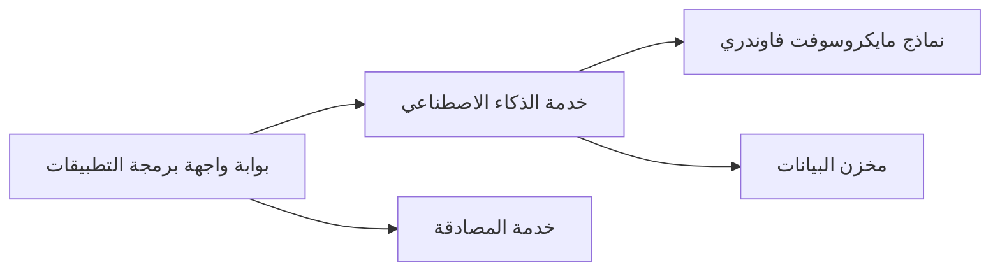

# الفصل 8: أنماط الإنتاج والمؤسسات

**📚 الدورة**: [AZD للمبتدئين](../../README.md) | **⏱️ المدة**: 2-3 ساعات | **⭐ التعقيد**: متقدم

---

## نظرة عامة

يغطي هذا الفصل أنماط النشر الجاهزة للمؤسسات، تشديد الأمان، المراقبة، وتحسين التكاليف لأحمال عمل الذكاء الاصطناعي في بيئات الإنتاج.

## أهداف التعلم

بإكمال هذا الفصل، سوف:
- نشر تطبيقات متعددة المناطق ذات تحمل عالي
- تنفيذ أنماط أمان مؤسسية
- تكوين مراقبة شاملة
- تحسين التكاليف على نطاق واسع
- إعداد خطوط CI/CD باستخدام AZD

---

## 📚 الدروس

| # | الدرس | الوصف | المدة |
|---|--------|-------------|------|
| 1 | [ممارسات الذكاء الاصطناعي للإنتاج](production-ai-practices.md) | أنماط نشر للمؤسسات | 90 دقيقة |

---

## 🚀 قائمة التحقق للإنتاج

- [ ] نشر متعدد المناطق للمتانة
- [ ] هوية مُدارة للمصادقة (بدون مفاتيح)
- [ ] Application Insights للمراقبة
- [ ] تكوين ميزانيات التكلفة والتنبيهات
- [ ] تمكين فحص الأمان
- [ ] دمج خطوط CI/CD
- [ ] خطة استعادة من الكوارث

---

## 🏗️ أنماط المعمارية

### النمط 1: الذكاء الاصطناعي بالخدمات المصغرة


### النمط 2: الذكاء الاصطناعي المدفوع بالأحداث


---

## 🔐 أفضل ممارسات الأمان

```bicep
// Use managed identity
identity: {
  type: 'SystemAssigned'
}

// Private endpoints for AI services
properties: {
  publicNetworkAccess: 'Disabled'
  networkAcls: {
    defaultAction: 'Deny'
  }
}
```

---

## 💰 تحسين التكاليف

| الاستراتيجية | التوفير |
|----------|---------|
| التدرج إلى الصفر (Container Apps) | 60-80% |
| استخدم مستويات الاستهلاك للتطوير | 50-70% |
| التحجيم المجدول | 30-50% |
| السعة المحجوزة | 20-40% |

```bash
# ضبط تنبيهات الميزانية
az consumption budget create \
  --budget-name "AI-Budget" \
  --amount 500 \
  --category Cost \
  --time-grain Monthly
```

---

## 📊 إعداد المراقبة

```bash
# بث السجلات
azd monitor --logs

# تحقق من Application Insights
azd monitor

# عرض المقاييس
az monitor metrics list --resource <resource-id>
```

---

## 🔗 التنقل

| الاتجاه | الفصل |
|-----------|---------|
| **السابق** | [الفصل 7: استكشاف الأخطاء وإصلاحها](../chapter-07-troubleshooting/README.md) |
| **اكتمال الدورة** | [الصفحة الرئيسية للدورة](../../README.md) |

---

## 📖 موارد ذات صلة

- [دليل وكلاء الذكاء الاصطناعي](../chapter-02-ai-development/agents.md)
- [Application Insights](../chapter-06-pre-deployment/application-insights.md)
- [حلول متعددة الوكلاء](../chapter-05-multi-agent/README.md)
- [مثال الخدمات المصغرة](../../examples/microservices/README.md)

---

<!-- CO-OP TRANSLATOR DISCLAIMER START -->
إخلاء المسؤولية:
تمت ترجمة هذه الوثيقة باستخدام خدمة الترجمة الآلية [Co-op Translator](https://github.com/Azure/co-op-translator). على الرغم من سعينا لتحقيق الدقة، يرجى الانتباه إلى أن الترجمات الآلية قد تحتوي على أخطاء أو معلومات غير دقيقة. يجب اعتبار الوثيقة الأصلية بلغتها الأصلية المصدر المرجعي والموثوق. للمعلومات الحساسة أو الحرجة، يوصى بالاستعانة بترجمة بشرية محترفة. لا نتحمل أي مسؤولية عن أي سوء فهم أو تفسير ناتج عن استخدام هذه الترجمة.
<!-- CO-OP TRANSLATOR DISCLAIMER END -->