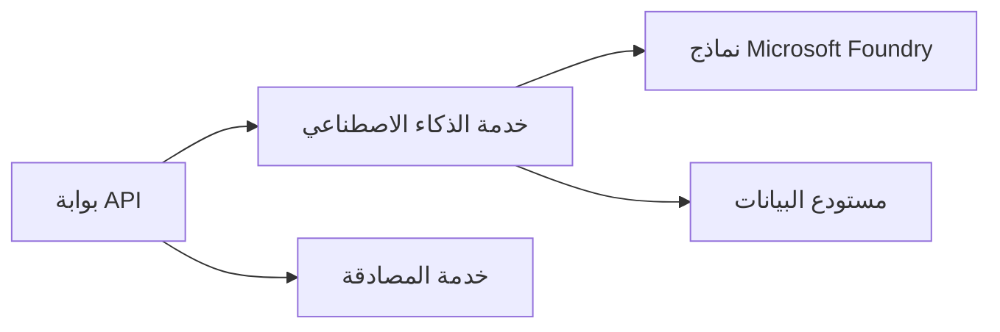

# الفصل 8: أنماط الإنتاج والمؤسسات

**📚 الدورة**: [AZD للمبتدئين](../../README.md) | **⏱️ المدة**: 2-3 ساعات | **⭐ التعقيد**: متقدم

---

## نظرة عامة

يغطي هذا الفصل أنماط النشر الجاهزة للمؤسسات، تعزيز الأمان، المراقبة، وتحسين التكاليف لأعباء العمل الإنتاجية في مجال الذكاء الاصطناعي.

> تم التحقق بناءً على `azd 1.27.1` في يوليو 2026.

## أهداف التعلم

بإنهاء هذا الفصل، ستكون قادرًا على:
- نشر تطبيقات مقاومة متعددة المناطق
- تنفيذ أنماط أمان المؤسسات
- تكوين مراقبة شاملة
- تحسين التكاليف على نطاق واسع
- إعداد خطوط CI/CD باستخدام AZD

---

## 📚 الدروس

| # | الدرس | الوصف | الوقت |
|---|--------|-------------|------|
| 1 | [ممارسات الذكاء الاصطناعي في الإنتاج](production-ai-practices.md) | أنماط النشر للمؤسسات | 90 دقيقة |

---

## 🚀 قائمة التحقق للإنتاج

- [ ] نشر متعدد المناطق للمرونة
- [ ] هوية مُدارة للتحقق (بدون مفاتيح)
- [ ] Application Insights للمراقبة
- [ ] تكوين ميزانيات وتنبيهات التكاليف
- [ ] تمكين فحص الأمان
- [ ] دمج خط أنابيب CI/CD
- [ ] خطة التعافي من الكوارث

---

## 🏗️ أنماط العمارة

### النمط 1: الذكاء الاصطناعي المعتمد على الخدمات المصغرة



### النمط 2: الذكاء الاصطناعي الحدثي


---

## 🔐 أفضل ممارسات الأمان

```bicep
// Use managed identity
identity: {
  type: 'SystemAssigned'
}

// Private endpoints for AI services
properties: {
  publicNetworkAccess: 'Disabled'
  networkAcls: {
    defaultAction: 'Deny'
  }
}
```

---

## 💰 تحسين التكاليف

| الاستراتيجية | التوفير |
|----------|---------|
| التوسع إلى الصفر (تطبيقات الحاويات) | 60-80% |
| استخدام مستويات الاستهلاك للتطوير | 50-70% |
| التوسع المجدول | 30-50% |
| السعة المحجوزة | 20-40% |

```bash
# تعيين تنبيهات الميزانية
az consumption budget create \
  --budget-name "AI-Budget" \
  --amount 500 \
  --category Cost \
  --time-grain Monthly
```

---

## 📊 إعداد المراقبة

```bash
# تدفق السجلات
azd monitor --logs

# تحقق من Application Insights
azd monitor --overview

# عرض المقاييس
az monitor metrics list --resource <resource-id>
```

---

## 🔗 التنقل

| الاتجاه | الفصل |
|-----------|---------|
| **السابق** | [الفصل 7: استكشاف الأخطاء وإصلاحها](../chapter-07-troubleshooting/README.md) |
| **انتهاء الدورة** | [الصفحة الرئيسية للدورة](../../README.md) |

---

## 📖 الموارد ذات الصلة

- [دليل الوكلاء الذكاء الاصطناعي](../chapter-02-ai-development/agents.md)
- [Application Insights](../chapter-06-pre-deployment/application-insights.md)
- [حلول الوكلاء المتعددين](../chapter-05-multi-agent/README.md)
- [مثال على الخدمات المصغرة](../../examples/microservices/README.md)

---

<!-- CO-OP TRANSLATOR DISCLAIMER START -->
**تنويه**:
تمت ترجمة هذا المستند باستخدام خدمة الترجمة بالذكاء الاصطناعي [Co-op Translator](https://github.com/Azure/co-op-translator). بينما نسعى للدقة، يرجى العلم أن الترجمات الآلية قد تحتوي على أخطاء أو عدم دقة. يجب اعتبار المستند الأصلي بلغته الأصلية المصدر الرسمي والمعتمد. للمعلومات الهامة، يُنصح بالاستعانة بترجمة بشرية محترفة. نحن غير مسؤولين عن أي سوء فهم أو تفسير ناتج عن استخدام هذه الترجمة.
<!-- CO-OP TRANSLATOR DISCLAIMER END -->