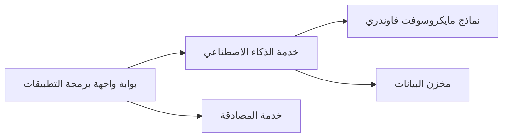

# الفصل 8: أنماط الإنتاج والمؤسسات

**📚 الدورة**: [AZD للمبتدئين](../../README.md) | **⏱️ المدة**: 2-3 ساعات | **⭐ التعقيد**: متقدم

---

## نظرة عامة

يغطي هذا الفصل أنماط النشر الجاهزة للمؤسسات، وتقوية الأمان، والمراقبة، وتحسين التكاليف لأحمال عمل الذكاء الاصطناعي في بيئة الإنتاج.

> تم التحقق مقابل `azd 1.23.12` في مارس 2026.

## أهداف التعلم

من خلال إكمال هذا الفصل، ستتمكن من:
- نشر تطبيقات مرنة عبر مناطق متعددة
- تنفيذ أنماط أمان مؤسسية
- تهيئة مراقبة شاملة
- تحسين التكاليف على نطاق واسع
- إعداد خطوط CI/CD باستخدام AZD

---

## 📚 الدروس

| # | الدرس | الوصف | الوقت |
|---|--------|-------------|------|
| 1 | [ممارسات الذكاء الاصطناعي للإنتاج](production-ai-practices.md) | أنماط نشر مؤسسية | 90 دقيقة |

---

## 🚀 قائمة التحقق للإنتاج

- [ ] نشر متعدد المناطق للمرونة
- [ ] هوية مُدارة للمصادقة (بدون مفاتيح)
- [ ] Application Insights للمراقبة
- [ ] تكوين ميزانيات التكلفة والتنبيهات
- [ ] تمكين فحص الأمان
- [ ] تكامل خط أنابيب CI/CD
- [ ] خطة استعادة من الكوارث

---

## 🏗️ أنماط البنية المعمارية

### النمط 1: الذكاء الاصطناعي بالخدمات المصغرة


### النمط 2: الذكاء الاصطناعي المدفوع بالأحداث


---

## 🔐 أفضل ممارسات الأمان

```bicep
// Use managed identity
identity: {
  type: 'SystemAssigned'
}

// Private endpoints for AI services
properties: {
  publicNetworkAccess: 'Disabled'
  networkAcls: {
    defaultAction: 'Deny'
  }
}
```

---

## 💰 تحسين التكاليف

| الاستراتيجية | التوفير |
|----------|---------|
| التحجيم إلى الصفر (Container Apps) | 60-80% |
| استخدام طبقات الاستهلاك للتطوير | 50-70% |
| التحجيم المجدول | 30-50% |
| السعة المحجوزة | 20-40% |

```bash
# تعيين تنبيهات الميزانية
az consumption budget create \
  --budget-name "AI-Budget" \
  --amount 500 \
  --category Cost \
  --time-grain Monthly
```

---

## 📊 إعداد المراقبة

```bash
# بث السجلات
azd monitor --logs

# تحقق من Application Insights
azd monitor --overview

# عرض المقاييس
az monitor metrics list --resource <resource-id>
```

---

## 🔗 التنقل

| الاتجاه | الفصل |
|-----------|---------|
| **السابق** | [الفصل 7: استكشاف الأخطاء وإصلاحها](../chapter-07-troubleshooting/README.md) |
| **المقرر مكتمل** | [الصفحة الرئيسية للمقرر](../../README.md) |

---

## 📖 الموارد ذات الصلة

- [دليل وكلاء الذكاء الاصطناعي](../chapter-02-ai-development/agents.md)
- [Application Insights](../chapter-06-pre-deployment/application-insights.md)
- [حلول متعددة الوكلاء](../chapter-05-multi-agent/README.md)
- [مثال الخدمات المصغرة](../../examples/microservices/README.md)

---

<!-- CO-OP TRANSLATOR DISCLAIMER START -->
**Disclaimer**:
تمت ترجمة هذا المستند باستخدام خدمة الترجمة الآلية [Co-op Translator](https://github.com/Azure/co-op-translator). وعلى الرغم من سعينا للدقة، يُرجى العلم أن الترجمات الآلية قد تحتوي على أخطاء أو معلومات غير دقيقة. يجب اعتبار المستند الأصلي بلغته الأصلية المصدر المرجعي والموثوق. للمعلومات الحساسة أو الحرجة، يُنصح بالاستعانة بترجمة بشرية محترفة. نحن غير مسؤولين عن أي سوء فهم أو تفسيرات خاطئة ناتجة عن استخدام هذه الترجمة.
<!-- CO-OP TRANSLATOR DISCLAIMER END -->