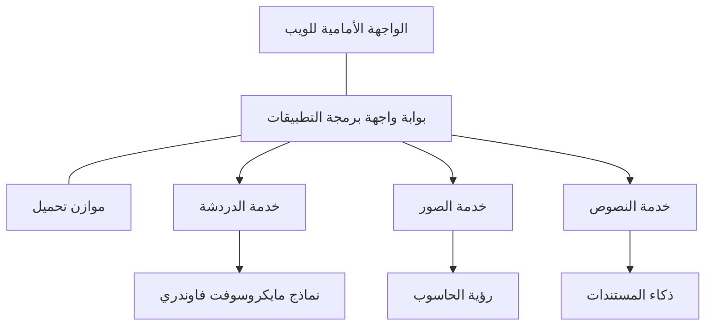

# أفضل ممارسات عبء عمل الذكاء الاصطناعي في الإنتاج باستخدام AZD

**تنقّل الفصل:**
- **📚 الصفحة الرئيسية للدورة**: [AZD للمبتدئين](../../README.md)
- **📖 الفصل الحالي**: الفصل 8 - أنماط الإنتاج والمؤسسات
- **⬅️ الفصل السابق**: [الفصل 7: استكشاف الأخطاء وإصلاحها](../chapter-07-troubleshooting/debugging.md)
- **⬅️ ذا صلة أيضاً**: [مختبر ورشة عمل الذكاء الاصطناعي](ai-workshop-lab.md)
- **🎯 اكتمال الدورة**: [AZD للمبتدئين](../../README.md)

## نظرة عامة

يوفر هذا الدليل ممارسات شاملة لنشر أحمال عمل الذكاء الاصطناعي الجاهزة للإنتاج باستخدام Azure Developer CLI (AZD). استنادًا إلى ملاحظات مجتمع Microsoft Foundry على Discord ونشرات العملاء في العالم الحقيقي، تتناول هذه الممارسات أكثر التحديات شيوعًا في أنظمة الذكاء الاصطناعي الإنتاجية.

## التحديات الرئيسية التي تم التعامل معها

استنادًا إلى نتائج استطلاع المجتمع لدينا، هذه هي أبرز التحديات التي يواجهها المطورون:

- **45%** يعانون من نشرات الذكاء الاصطناعي متعددة الخدمات
- **38%** لديهم مشاكل في إدارة بيانات الاعتماد والأسرار  
- **35%** يجدون صعوبة في الجاهزية للإنتاج والتوسيع
- **32%** يحتاجون استراتيجيات أفضل لتحسين التكلفة
- **29%** يتطلبون تحسين المراقبة واستكشاف الأخطاء وإصلاحها

## أنماط المعمارية للذكاء الاصطناعي في الإنتاج

### النمط 1: معمارية الذكاء الاصطناعي القائمة على الخدمات المصغرة

**متى تستخدمها**: تطبيقات ذكاء اصطناعي معقدة ذات قدرات متعددة


**تنفيذ AZD**:

```yaml
# azure.yaml
name: enterprise-ai-platform
services:
  web:
    project: ./web
    host: staticwebapp
  api-gateway:
    project: ./api-gateway
    host: containerapp
  chat-service:
    project: ./services/chat
    host: containerapp
  vision-service:
    project: ./services/vision
    host: containerapp
  text-service:
    project: ./services/text
    host: containerapp
```

### النمط 2: معالجة الذكاء الاصطناعي المدفوعة بالأحداث

**متى تستخدمها**: المعالجة الدفعية، تحليل المستندات، تدفقات العمل غير المتزامنة

```bicep
// Event Hub for AI processing pipeline
resource eventHub 'Microsoft.EventHub/namespaces@2023-01-01-preview' = {
  name: eventHubNamespaceName
  location: location
  sku: {
    name: 'Standard'
    tier: 'Standard'
    capacity: 1
  }
}

// Service Bus for reliable message processing
resource serviceBus 'Microsoft.ServiceBus/namespaces@2022-10-01-preview' = {
  name: serviceBusNamespaceName
  location: location
  sku: {
    name: 'Premium'
    tier: 'Premium'
    capacity: 1
  }
}

// Function App for processing
resource functionApp 'Microsoft.Web/sites@2023-01-01' = {
  name: functionAppName
  location: location
  kind: 'functionapp,linux'
  properties: {
    siteConfig: {
      appSettings: [
        {
          name: 'FUNCTIONS_EXTENSION_VERSION'
          value: '~4'
        }
        {
          name: 'AZURE_OPENAI_ENDPOINT'
          value: '@Microsoft.KeyVault(VaultName=${keyVault.name};SecretName=openai-endpoint)'
        }
      ]
    }
  }
}
```

## التفكير في صحة الوكلاء في الذكاء الاصطناعي

عندما يتعطل تطبيق ويب تقليدي، تكون الأعراض مألوفة: صفحة لا تُحمّل، واجهة برمجة تطبيقات تُرجع خطأ، أو فشل في النشر. يمكن أن تتعطل التطبيقات المدعومة بالذكاء الاصطناعي بنفس الطرق — لكنها قد تتصرف أيضًا بطرق أكثر دقة لا تُنتج رسائل خطأ واضحة.

يساعدك هذا القسم على بناء نموذج ذهني لمراقبة أحمال عمل الذكاء الاصطناعي حتى تعرف أين تبحث عندما لا تبدو الأمور على ما يرام.

### كيف تختلف صحة الوكيل عن صحة التطبيق التقليدي

التطبيق التقليدي إما يعمل أو لا يعمل. يمكن أن يبدو وكيل الذكاء الاصطناعي وكأنه يعمل لكنه ينتج نتائج ضعيفة. فكر في صحة الوكيل على طبقتين:

| Layer | What to Watch | Where to Look |
|-------|--------------|---------------|
| **Infrastructure health** | هل الخدمة تعمل؟ هل تم توفير الموارد؟ هل نقاط النهاية قابلة للوصول؟ | `azd monitor`, Azure Portal resource health, container/app logs |
| **Behavior health** | هل يستجيب الوكيل بدقة؟ هل الردود في الوقت المناسب؟ هل يتم استدعاء النموذج بشكل صحيح؟ | Application Insights traces, model call latency metrics, response quality logs |

صحة البنية التحتية مألوفة — إنها نفسها لأي تطبيق azd. صحة السلوك هي الطبقة الجديدة التي تدخلها أحمال عمل الذكاء الاصطناعي.

### أين تبحث عندما لا تتصرف تطبيقات الذكاء الاصطناعي كما هو متوقع

إذا لم ينتج تطبيق الذكاء الاصطناعي النتائج التي تتوقعها، فإليك قائمة فحص مفاهيمية:

1. **ابدأ بالأساسيات.** هل التطبيق يعمل؟ هل يمكنه الوصول إلى تبعياته؟ تحقق من `azd monitor` وحالة الموارد كما تفعل لأي تطبيق.
2. **تحقق من اتصال النموذج.** هل يستدعي تطبيقك النموذج بنجاح؟ تعد مكالمات النموذج الفاشلة أو المنتهية مهلة هي السبب الأكثر شيوعًا لمشاكل تطبيقات الذكاء الاصطناعي وستظهر في سجلات التطبيق.
3. **انظر إلى ما تلقاه النموذج.** تعتمد استجابات الذكاء الاصطناعي على المدخلات (المطالبة وأي سياق مسترجع). إذا كان الإخراج خاطئًا، فغالبًا ما تكون المدخلات خاطئة. تحقق مما إذا كان تطبيقك يرسل البيانات الصحيحة إلى النموذج.
4. **راجع زمن استجابة الردود.** مكالمات نماذج الذكاء الاصطناعي أبطأ من مكالمات API النموذجية. إذا بدا تطبيقك بطيئًا، تحقق مما إذا كانت أوقات استجابة النموذج قد زادت — قد يشير ذلك إلى التقييد، حدود السعة، أو ازدحام على مستوى المنطقة.
5. **راقب إشارات التكلفة.** الارتفاعات غير المتوقعة في استخدام الرموز أو مكالمات API يمكن أن تشير إلى حلقة، مطالبة غير مُعدة بشكل صحيح، أو محاولات إعادة مفرطة.

لا تحتاج إلى إتقان أدوات الرصد فورًا. الخلاصة هي أن تطبيقات الذكاء الاصطناعي لديها طبقة سلوكية إضافية للمراقبة، ويمنحك المراقبة المدمجة في azd (`azd monitor`) نقطة بداية للتحقيق في كلتا الطبقتين.

---

## ممارسات الأمان الأفضل

### 1. نموذج الأمان ذي الثقة الصفرية

**استراتيجية التنفيذ**:
- لا يوجد اتصال خدمة إلى خدمة بدون مصادقة
- جميع مكالمات API تستخدم الهويات المدارية
- عزل الشبكة بنقاط نهاية خاصة
- ضوابط الوصول بأدنى امتياز

```bicep
// Managed Identity for each service
resource chatServiceIdentity 'Microsoft.ManagedIdentity/userAssignedIdentities@2023-01-31' = {
  name: 'chat-service-identity'
  location: location
}

// Role assignments with minimal permissions
resource openAIUserRole 'Microsoft.Authorization/roleAssignments@2022-04-01' = {
  scope: openAIAccount
  name: guid(openAIAccount.id, chatServiceIdentity.id, openAIUserRoleDefinitionId)
  properties: {
    roleDefinitionId: subscriptionResourceId('Microsoft.Authorization/roleDefinitions', '5e0bd9bd-7b93-4f28-af87-19fc36ad61bd')
    principalId: chatServiceIdentity.properties.principalId
    principalType: 'ServicePrincipal'
  }
}
```

### 2. إدارة الأسرار الآمنة

**نمط تكامل Key Vault**:

```bicep
// Key Vault with proper access policies
resource keyVault 'Microsoft.KeyVault/vaults@2023-02-01' = {
  name: keyVaultName
  location: location
  properties: {
    tenantId: tenant().tenantId
    sku: {
      family: 'A'
      name: 'premium'  // Use premium for production
    }
    enableRbacAuthorization: true  // Use RBAC instead of access policies
    enablePurgeProtection: true    // Prevent accidental deletion
    enableSoftDelete: true
    softDeleteRetentionInDays: 90
  }
}

// Store all AI service credentials
resource openAIKeySecret 'Microsoft.KeyVault/vaults/secrets@2023-02-01' = {
  parent: keyVault
  name: 'openai-api-key'
  properties: {
    value: openAIAccount.listKeys().key1
    attributes: {
      enabled: true
    }
  }
}
```

### 3. أمان الشبكة

**تكوين نقاط النهاية الخاصة**:

```bicep
// Virtual Network for AI services
resource virtualNetwork 'Microsoft.Network/virtualNetworks@2023-04-01' = {
  name: vnetName
  location: location
  properties: {
    addressSpace: {
      addressPrefixes: ['10.0.0.0/16']
    }
    subnets: [
      {
        name: 'ai-services-subnet'
        properties: {
          addressPrefix: '10.0.1.0/24'
          privateEndpointNetworkPolicies: 'Disabled'
        }
      }
      {
        name: 'app-services-subnet'
        properties: {
          addressPrefix: '10.0.2.0/24'
          delegations: [
            {
              name: 'Microsoft.Web/serverFarms'
              properties: {
                serviceName: 'Microsoft.Web/serverFarms'
              }
            }
          ]
        }
      }
    ]
  }
}

// Private endpoints for all AI services
resource openAIPrivateEndpoint 'Microsoft.Network/privateEndpoints@2023-04-01' = {
  name: '${openAIAccountName}-pe'
  location: location
  properties: {
    subnet: {
      id: virtualNetwork.properties.subnets[0].id
    }
    privateLinkServiceConnections: [
      {
        name: 'openai-connection'
        properties: {
          privateLinkServiceId: openAIAccount.id
          groupIds: ['account']
        }
      }
    ]
  }
}
```

## الأداء والتوسع

### 1. استراتيجيات التحجيم التلقائي

**التحجيم التلقائي لتطبيقات الحاويات**:

```bicep
resource containerApp 'Microsoft.App/containerApps@2023-05-01' = {
  name: containerAppName
  location: location
  properties: {
    configuration: {
      ingress: {
        external: true
        targetPort: 8000
        transport: 'http'
      }
    }
    template: {
      scale: {
        minReplicas: 2  // Always have 2 instances minimum
        maxReplicas: 50 // Scale up to 50 for high load
        rules: [
          {
            name: 'http-scaling'
            http: {
              metadata: {
                concurrentRequests: '20'  // Scale when >20 concurrent requests
              }
            }
          }
          {
            name: 'cpu-scaling'
            custom: {
              type: 'cpu'
              metadata: {
                type: 'Utilization'
                value: '70'  // Scale when CPU >70%
              }
            }
          }
        ]
      }
    }
  }
}
```

### 2. استراتيجيات التخزين المؤقت

**Redis Cache لاستجابات الذكاء الاصطناعي**:

```bicep
// Redis Premium for production workloads
resource redisCache 'Microsoft.Cache/redis@2023-04-01' = {
  name: redisCacheName
  location: location
  properties: {
    sku: {
      name: 'Premium'
      family: 'P'
      capacity: 1
    }
    enableNonSslPort: false
    minimumTlsVersion: '1.2'
    redisConfiguration: {
      'maxmemory-policy': 'allkeys-lru'
    }
    // Enable clustering for high availability
    redisVersion: '6.0'
    shardCount: 2
  }
}

// Cache configuration in application
var cacheConnectionString = '${redisCache.properties.hostName}:6380,password=${redisCache.listKeys().primaryKey},ssl=True,abortConnect=False'
```

### 3. موازنة التحميل وإدارة حركة المرور

**Application Gateway مع WAF**:

```bicep
// Application Gateway with Web Application Firewall
resource applicationGateway 'Microsoft.Network/applicationGateways@2023-04-01' = {
  name: appGatewayName
  location: location
  properties: {
    sku: {
      name: 'WAF_v2'
      tier: 'WAF_v2'
      capacity: 2
    }
    webApplicationFirewallConfiguration: {
      enabled: true
      firewallMode: 'Prevention'
      ruleSetType: 'OWASP'
      ruleSetVersion: '3.2'
    }
    // Backend pools for AI services
    backendAddressPools: [
      {
        name: 'ai-services-pool'
        properties: {
          backendAddresses: [
            {
              fqdn: '${containerApp.properties.configuration.ingress.fqdn}'
            }
          ]
        }
      }
    ]
  }
}
```

## 💰 تحسين التكلفة

### 1. تحديد الحجم المناسب للموارد

**تكوينات مخصصة لكل بيئة**:

```bash
# بيئة التطوير
azd env new development
azd env set AZURE_OPENAI_SKU "S0"
azd env set AZURE_OPENAI_CAPACITY 10
azd env set AZURE_SEARCH_SKU "basic"
azd env set CONTAINER_CPU 0.5
azd env set CONTAINER_MEMORY 1.0

# بيئة الإنتاج
azd env new production
azd env set AZURE_OPENAI_SKU "S0"
azd env set AZURE_OPENAI_CAPACITY 100
azd env set AZURE_SEARCH_SKU "standard"
azd env set CONTAINER_CPU 2.0
azd env set CONTAINER_MEMORY 4.0
```

### 2. مراقبة التكلفة والميزانيات

```bicep
// Cost management and budgets
resource budget 'Microsoft.Consumption/budgets@2023-05-01' = {
  name: 'ai-workload-budget'
  properties: {
    timePeriod: {
      startDate: '2024-01-01'
      endDate: '2024-12-31'
    }
    timeGrain: 'Monthly'
    amount: 2000  // $2000 monthly budget
    category: 'Cost'
    notifications: {
      warning: {
        enabled: true
        operator: 'GreaterThan'
        threshold: 80
        contactEmails: [
          'finance@company.com'
          'engineering@company.com'
        ]
        contactRoles: [
          'Owner'
          'Contributor'
        ]
      }
      critical: {
        enabled: true
        operator: 'GreaterThan'
        threshold: 95
        contactEmails: [
          'cto@company.com'
        ]
      }
    }
  }
}
```

### 3. تحسين استخدام الرموز

**إدارة تكاليف OpenAI**:

```typescript
// تحسين التوكنات على مستوى التطبيق
class TokenOptimizer {
  private readonly maxTokens = 4000;
  private readonly reserveTokens = 500;
  
  optimizePrompt(userInput: string, context: string): string {
    const availableTokens = this.maxTokens - this.reserveTokens;
    const estimatedTokens = this.estimateTokens(userInput + context);
    
    if (estimatedTokens > availableTokens) {
      // اقتطع السياق، لا مدخلات المستخدم
      context = this.truncateContext(context, availableTokens - this.estimateTokens(userInput));
    }
    
    return `${context}\n\nUser: ${userInput}`;
  }
  
  private estimateTokens(text: string): number {
    // تقدير تقريبي: توكن واحد ≈ 4 أحرف
    return Math.ceil(text.length / 4);
  }
}
```

## المراقبة والقابلية للرصد

### 1. Application Insights الشاملة

```bicep
// Application Insights with advanced features
resource applicationInsights 'Microsoft.Insights/components@2020-02-02' = {
  name: applicationInsightsName
  location: location
  kind: 'web'
  properties: {
    Application_Type: 'web'
    WorkspaceResourceId: logAnalyticsWorkspace.id
    SamplingPercentage: 100  // Full sampling for AI apps
    DisableIpMasking: false  // Enable for security
  }
}

// Custom metrics for AI operations
resource aiMetricAlerts 'Microsoft.Insights/metricAlerts@2018-03-01' = {
  name: 'ai-high-error-rate'
  location: 'global'
  properties: {
    description: 'Alert when AI service error rate is high'
    severity: 2
    enabled: true
    scopes: [
      applicationInsights.id
    ]
    evaluationFrequency: 'PT1M'
    windowSize: 'PT5M'
    criteria: {
      'odata.type': 'Microsoft.Azure.Monitor.SingleResourceMultipleMetricCriteria'
      allOf: [
        {
          name: 'high-error-rate'
          metricName: 'requests/failed'
          operator: 'GreaterThan'
          threshold: 10
          timeAggregation: 'Count'
        }
      ]
    }
  }
}
```

### 2. المراقبة الخاصة بالذكاء الاصطناعي

**لوحات تحكم مخصصة لمقاييس الذكاء الاصطناعي**:

```json
// Dashboard configuration for AI workloads
{
  "dashboard": {
    "name": "AI Application Monitoring",
    "tiles": [
      {
        "name": "OpenAI Request Volume",
        "query": "requests | where name contains 'openai' | summarize count() by bin(timestamp, 5m)"
      },
      {
        "name": "AI Response Latency",
        "query": "requests | where name contains 'openai' | summarize avg(duration) by bin(timestamp, 5m)"
      },
      {
        "name": "Token Usage",
        "query": "customMetrics | where name == 'openai_tokens_used' | summarize sum(value) by bin(timestamp, 1h)"
      },
      {
        "name": "Cost per Hour",
        "query": "customMetrics | where name == 'openai_cost' | summarize sum(value) by bin(timestamp, 1h)"
      }
    ]
  }
}
```

### 3. فحوصات الصحة ومراقبة وقت التشغيل

```bicep
// Application Insights availability tests
resource availabilityTest 'Microsoft.Insights/webtests@2022-06-15' = {
  name: 'ai-app-availability-test'
  location: location
  tags: {
    'hidden-link:${applicationInsights.id}': 'Resource'
  }
  properties: {
    SyntheticMonitorId: 'ai-app-availability-test'
    Name: 'AI Application Availability Test'
    Description: 'Tests AI application endpoints'
    Enabled: true
    Frequency: 300  // 5 minutes
    Timeout: 120    // 2 minutes
    Kind: 'ping'
    Locations: [
      {
        Id: 'us-east-2-azr'
      }
      {
        Id: 'us-west-2-azr'
      }
    ]
    Configuration: {
      WebTest: '''
        <WebTest Name="AI Health Check" 
                 Id="8d2de8d2-a2b0-4c2e-9a0d-8f9c9a0b8c8d" 
                 Enabled="True" 
                 CssProjectStructure="" 
                 CssIteration="" 
                 Timeout="120" 
                 WorkItemIds="" 
                 xmlns="http://microsoft.com/schemas/VisualStudio/TeamTest/2010" 
                 Description="" 
                 CredentialUserName="" 
                 CredentialPassword="" 
                 PreAuthenticate="True" 
                 Proxy="default" 
                 StopOnError="False" 
                 RecordedResultFile="" 
                 ResultsLocale="">
          <Items>
            <Request Method="GET" 
                     Guid="a5f10126-e4cd-570d-961c-cea43999a200" 
                     Version="1.1" 
                     Url="${webApp.properties.defaultHostName}/health" 
                     ThinkTime="0" 
                     Timeout="120" 
                     ParseDependentRequests="True" 
                     FollowRedirects="True" 
                     RecordResult="True" 
                     Cache="False" 
                     ResponseTimeGoal="0" 
                     Encoding="utf-8" 
                     ExpectedHttpStatusCode="200" 
                     ExpectedResponseUrl="" 
                     ReportingName="" 
                     IgnoreHttpStatusCode="False" />
          </Items>
        </WebTest>
      '''
    }
  }
}
```

## التعافي من الكوارث والتوفر العالي

### 1. النشر متعدد المناطق

```yaml
# azure.yaml - Multi-region configuration
name: ai-app-multiregion
services:
  api-primary:
    project: ./api
    host: containerapp
    env:
      - AZURE_REGION=eastus
  api-secondary:
    project: ./api
    host: containerapp
    env:
      - AZURE_REGION=westus2
```

```bicep
// Traffic Manager for global load balancing
resource trafficManager 'Microsoft.Network/trafficManagerProfiles@2022-04-01' = {
  name: trafficManagerProfileName
  location: 'global'
  properties: {
    profileStatus: 'Enabled'
    trafficRoutingMethod: 'Priority'
    dnsConfig: {
      relativeName: trafficManagerProfileName
      ttl: 30
    }
    monitorConfig: {
      protocol: 'HTTPS'
      port: 443
      path: '/health'
      intervalInSeconds: 30
      toleratedNumberOfFailures: 3
      timeoutInSeconds: 10
    }
    endpoints: [
      {
        name: 'primary-endpoint'
        type: 'Microsoft.Network/trafficManagerProfiles/azureEndpoints'
        properties: {
          targetResourceId: primaryAppService.id
          endpointStatus: 'Enabled'
          priority: 1
        }
      }
      {
        name: 'secondary-endpoint'
        type: 'Microsoft.Network/trafficManagerProfiles/azureEndpoints'
        properties: {
          targetResourceId: secondaryAppService.id
          endpointStatus: 'Enabled'
          priority: 2
        }
      }
    ]
  }
}
```

### 2. نسخ البيانات احتياطيًا واستعادتها

```bicep
// Backup configuration for critical data
resource backupVault 'Microsoft.DataProtection/backupVaults@2023-05-01' = {
  name: backupVaultName
  location: location
  identity: {
    type: 'SystemAssigned'
  }
  properties: {
    storageSettings: [
      {
        datastoreType: 'VaultStore'
        type: 'LocallyRedundant'
      }
    ]
  }
}

// Backup policy for AI models and data
resource backupPolicy 'Microsoft.DataProtection/backupVaults/backupPolicies@2023-05-01' = {
  parent: backupVault
  name: 'ai-data-backup-policy'
  properties: {
    policyRules: [
      {
        backupParameters: {
          backupType: 'Full'
          objectType: 'AzureBackupParams'
        }
        trigger: {
          schedule: {
            repeatingTimeIntervals: [
              'R/2024-01-01T02:00:00+00:00/P1D'  // Daily at 2 AM
            ]
          }
          objectType: 'ScheduleBasedTriggerContext'
        }
        dataStore: {
          datastoreType: 'VaultStore'
          objectType: 'DataStoreInfoBase'
        }
        name: 'BackupDaily'
        objectType: 'AzureBackupRule'
      }
    ]
  }
}
```

## دمج DevOps وCI/CD

### 1. سير عمل GitHub Actions

```yaml
# .github/workflows/deploy-ai-app.yml
name: Deploy AI Application

on:
  push:
    branches: [main]
  pull_request:
    branches: [main]

jobs:
  test:
    runs-on: ubuntu-latest
    steps:
      - uses: actions/checkout@v4
      
      - name: Setup Python
        uses: actions/setup-python@v4
        with:
          python-version: '3.11'
          
      - name: Install dependencies
        run: |
          pip install -r requirements.txt
          pip install pytest
          
      - name: Run tests
        run: pytest tests/
        
      - name: AI Safety Tests
        run: |
          python scripts/test_ai_safety.py
          python scripts/validate_prompts.py

  deploy-staging:
    needs: test
    if: github.event_name == 'pull_request'
    runs-on: ubuntu-latest
    steps:
      - uses: actions/checkout@v4
      
      - name: Setup AZD
        uses: Azure/setup-azd@v2
        
      - name: Login to Azure
        uses: azure/login@v1
        with:
          creds: ${{ secrets.AZURE_CREDENTIALS }}
          
      - name: Deploy to Staging
        run: |
          azd env select staging
          azd deploy

  deploy-production:
    needs: test
    if: github.ref == 'refs/heads/main'
    runs-on: ubuntu-latest
    steps:
      - uses: actions/checkout@v4
      
      - name: Setup AZD
        uses: Azure/setup-azd@v2
        
      - name: Login to Azure
        uses: azure/login@v1
        with:
          creds: ${{ secrets.AZURE_CREDENTIALS }}
          
      - name: Deploy to Production
        run: |
          azd env select production
          azd deploy
          
      - name: Run Production Health Checks
        run: |
          python scripts/health_check.py --env production
```

### 2. التحقق من البنية التحتية

```bash
# scripts/validate_infrastructure.sh
#!/bin/bash

echo "Validating AI infrastructure deployment..."

# تحقق مما إذا كانت جميع الخدمات المطلوبة قيد التشغيل
services=("openai" "search" "storage" "keyvault")
for service in "${services[@]}"; do
    echo "Checking $service..."
    if ! az resource list --resource-type "Microsoft.CognitiveServices/accounts" --query "[?contains(name, '$service')]" -o tsv; then
        echo "ERROR: $service not found"
        exit 1
    fi
done

# التحقق من نشر نماذج OpenAI
echo "Validating OpenAI model deployments..."
models=$(az cognitiveservices account deployment list --name $AZURE_OPENAI_NAME --resource-group $AZURE_RESOURCE_GROUP --query "[].name" -o tsv)
if [[ ! $models == *"gpt-4.1-mini"* ]]; then
  echo "ERROR: Required model gpt-4.1-mini not deployed"
    exit 1
fi

# اختبار اتصال خدمة الذكاء الاصطناعي
echo "Testing AI service connectivity..."
python scripts/test_connectivity.py

echo "Infrastructure validation completed successfully!"
```

## قائمة التحقق للجاهزية للإنتاج

### الأمان ✅
- [ ] جميع الخدمات تستخدم الهويات المدارية
- [ ] الأسرار مخزنة في Key Vault
- [ ] تم تكوين نقاط نهاية خاصة
- [ ] تم تنفيذ مجموعات أمان الشبكة
- [ ] RBAC بأدنى امتياز
- [ ] تم تمكين WAF على نقاط النهاية العامة

### الأداء ✅
- [ ] تم تكوين التحجيم التلقائي
- [ ] تم تنفيذ التخزين المؤقت
- [ ] تم إعداد موازنة التحميل
- [ ] CDN للمحتوى الثابت
- [ ] تجميع اتصالات قاعدة البيانات
- [ ] تحسين استخدام الرموز

### المراقبة ✅
- [ ] تم تكوين Application Insights
- [ ] تم تعريف مقاييس مخصصة
- [ ] تم إعداد قواعد التنبيه
- [ ] تم إنشاء لوحة معلومات
- [ ] تم تنفيذ فحوصات الصحة
- [ ] سياسات الاحتفاظ بالسجلات

### الموثوقية ✅
- [ ] نشر متعدد المناطق
- [ ] خطة النسخ الاحتياطي والاستعادة
- [ ] تنفيذ قواطع الدائرة
- [ ] تكوين سياسات إعادة المحاولة
- [ ] التدهور اللطيف
- [ ] نقاط نهاية لفحوصات الصحة

### إدارة التكلفة ✅
- [ ] تم تكوين تنبيهات الميزانية
- [ ] تحديد الحجم المناسب للموارد
- [ ] تطبيق خصومات التطوير/الاختبار
- [ ] شراء الحالات المحجوزة
- [ ] لوحة مراقبة التكاليف
- [ ] مراجعات دورية للتكاليف

### الامتثال ✅
- [ ] تلبية متطلبات مكان وجود البيانات
- [ ] تم تمكين تسجيل التدقيق
- [ ] تطبيق سياسات الامتثال
- [ ] تنفيذ قواعد أساسية للأمان
- [ ] تقييمات أمان منتظمة
- [ ] خطة استجابة للحوادث

## معايير الأداء

### مقاييس الإنتاج النموذجية

| Metric | Target | Monitoring |
|--------|--------|------------|
| **Response Time** | < 2 seconds | Application Insights |
| **Availability** | 99.9% | Uptime monitoring |
| **Error Rate** | < 0.1% | Application logs |
| **Token Usage** | < $500/month | Cost management |
| **Concurrent Users** | 1000+ | Load testing |
| **Recovery Time** | < 1 hour | Disaster recovery tests |

### اختبار التحميل

```bash
# برنامج نصي لاختبار التحميل لتطبيقات الذكاء الاصطناعي
python scripts/load_test.py \
  --endpoint https://your-ai-app.azurewebsites.net \
  --concurrent-users 100 \
  --duration 300 \
  --ramp-up 60
```

## 🤝 ممارسات المجتمع الأفضل

استنادًا إلى ملاحظات مجتمع Microsoft Foundry على Discord:

### أفضل التوصيات من المجتمع:

1. **ابدأ صغيرًا، وقم بالتوسع تدريجيًا**: ابدأ بأصناف SKU الأساسية وقم بالترقية بناءً على الاستخدام الفعلي
2. **راقب كل شيء**: قم بإعداد مراقبة شاملة منذ اليوم الأول
3. **أتمتة الأمان**: استخدم البنية التحتية كرمز لأمان متسق
4. **اختبر بدقة**: قم بتضمين اختبارات خاصة بالذكاء الاصطناعي في خط التجميع الخاص بك
5. **خطط للتكاليف**: راقب استخدام الرموز واضبط تنبيهات الميزانية مبكرًا

### الأخطاء الشائعة التي يجب تجنبها:

- ❌ تضمين مفاتيح API صلبًا داخل الكود
- ❌ عدم إعداد مراقبة مناسبة
- ❌ تجاهل تحسين التكلفة
- ❌ عدم اختبار سيناريوهات الفشل
- ❌ النشر بدون فحوصات الصحة

## أوامر امتداد AZD AI وإضافاته

يحتوي AZD على مجموعة متنامية من الأوامر والإضافات الخاصة بالذكاء الاصطناعي التي تبسط أحمال عمل الذكاء الاصطناعي في الإنتاج. تربط هذه الأدوات الفجوة بين التطوير المحلي ونشر الإنتاج لأحمال عمل الذكاء الاصطناعي.

### امتدادات AZD للذكاء الاصطناعي

يستخدم AZD نظامًا للإضافات لإضافة قدرات خاصة بالذكاء الاصطناعي. قم بتثبيت وإدارة الإضافات باستخدام:

```bash
# عرض جميع الإضافات المتاحة (بما في ذلك الذكاء الاصطناعي)
azd extension list

# فحص تفاصيل الإضافة المثبتة
azd extension show azure.ai.agents

# تثبيت إضافة وكلاء Foundry
azd extension install azure.ai.agents

# تثبيت إضافة الضبط الدقيق
azd extension install azure.ai.finetune

# تثبيت إضافة النماذج المخصصة
azd extension install azure.ai.models

# ترقية جميع الإضافات المثبتة
azd extension upgrade --all
```

**الإضافات المتاحة للذكاء الاصطناعي:**

| Extension | Purpose | Status |
|-----------|---------|--------|
| `azure.ai.agents` | إدارة Foundry Agent Service | معاينة |
| `azure.ai.finetune` | ضبط نماذج Foundry | معاينة |
| `azure.ai.models` | نماذج مخصصة في Foundry | معاينة |
| `azure.coding-agent` | تكوين وكيل الترميز | متاح |

### تهيئة مشاريع الوكلاء باستخدام `azd ai agent init`

يقوم الأمر `azd ai agent init` بتهيئة مشروع وكيل ذكاء اصطناعي جاهز للإنتاج متكامل مع Microsoft Foundry Agent Service:

```bash
# تهيئة مشروع وكيل جديد من ملف توصيف الوكيل
azd ai agent init -m <manifest-path-or-uri>

# تهيئة واستهداف مشروع Foundry محدد
azd ai agent init -m agent-manifest.yaml --project-id <foundry-project-id>

# تهيئة باستخدام دليل مصدر مخصص
azd ai agent init -m agent-manifest.yaml --src ./agents/my-agent

# استهداف تطبيقات الحاويات كمضيف
azd ai agent init -m agent-manifest.yaml --host containerapp
```

**العلامات الأساسية:**

| Flag | Description |
|------|-------------|
| `-m, --manifest` | مسار أو URI إلى بيان الوكيل لإضافته إلى مشروعك |
| `-p, --project-id` | معرف مشروع Microsoft Foundry القائم لبيئة azd الخاصة بك |
| `-s, --src` | الدليل لتنزيل تعريف الوكيل (افتراضيًا إلى `src/<agent-id>`) |
| `--host` | تجاوز المضيف الافتراضي (على سبيل المثال، `containerapp`) |
| `-e, --environment` | بيئة azd التي سيتم استخدامها |

**نصيحة للإنتاج**: استخدم `--project-id` للاتصال مباشرةً بمشروع Foundry القائم، مما يحافظ على ربط كود الوكيل وموارد السحابة من البداية.

### بروتوكول سياق النموذج (MCP) مع `azd mcp`

يتضمن AZD دعم خادم MCP مدمج (ألفا)، مما يتيح لوكلاء وأدوات الذكاء الاصطناعي التفاعل مع موارد Azure الخاصة بمشروعك من خلال بروتوكول موحد:

```bash
# ابدأ خادم MCP لمشروعك
azd mcp start

# راجع قواعد الموافقة الحالية لـ Copilot لتنفيذ الأدوات
azd copilot consent list
```

يكشف خادم MCP سياق مشروع azd الخاص بك — البيئات، الخدمات، وموارد Azure — لأدوات التطوير المدعومة بالذكاء الاصطناعي. وهذا يمكن من:

- **نشر بمساعدة الذكاء الاصطناعي**: دع وكلاء الترميز يستعلمون عن حالة مشروعك ويطلقون عمليات النشر
- **اكتشاف الموارد**: يمكن للأدوات الذكية اكتشاف موارد Azure التي يستخدمها مشروعك
- **إدارة البيئة**: يمكن للوكلاء التبديل بين بيئات التطوير/التجريب/الإنتاج

### توليد البنية التحتية باستخدام `azd infra generate`

بالنسبة لأحمال عمل الذكاء الاصطناعي في الإنتاج، يمكنك توليد وتخصيص البنية التحتية كرمز بدلاً من الاعتماد على التوفير التلقائي:

```bash
# إنشاء ملفات Bicep/Terraform من تعريف مشروعك
azd infra generate
```

يكتب هذا IaC إلى القرص بحيث يمكنك:
- مراجعة ومراجعة البنية التحتية قبل النشر
- إضافة سياسات أمان مخصصة (قواعد الشبكة، نقاط النهاية الخاصة)
- التكامل مع عمليات مراجعة IaC القائمة
- التحكم في إصدارات تغييرات البنية التحتية بشكل منفصل عن كود التطبيق

### صنابير دورة حياة الإنتاج (Production Lifecycle Hooks)

تتيح لك صنابير AZD إدراج منطق مخصص في كل مرحلة من مراحل دورة نشر الإنتاج — وهو أمر حاسم لأحمال عمل الذكاء الاصطناعي في الإنتاج:

```yaml
# azure.yaml - Production hooks example
name: ai-production-app
hooks:
  preprovision:
    shell: sh
    run: scripts/validate-quotas.sh    # Check AI model quota before provisioning
  postprovision:
    shell: sh
    run: scripts/configure-networking.sh  # Set up private endpoints
  predeploy:
    shell: sh
    run: scripts/run-ai-safety-tests.sh  # Run prompt safety checks
  postdeploy:
    shell: sh
    run: scripts/smoke-test.sh           # Verify agent responses post-deploy
services:
  agent-api:
    project: ./src/agent
    host: containerapp
    hooks:
      predeploy:
        shell: sh
        run: scripts/validate-model-access.sh  # Per-service hook
```

```bash
# تشغيل هوك محدد يدويًا أثناء التطوير
azd hooks run predeploy
```

**الصنابير الموصى بها للإنتاج لأحمال عمل الذكاء الاصطناعي:**

| Hook | Use Case |
|------|----------|
| `preprovision` | التحقق من حصص الاشتراك لسعة نماذج الذكاء الاصطناعي |
| `postprovision` | تكوين نقاط النهاية الخاصة، نشر أوزان النماذج |
| `predeploy` | تشغيل اختبارات سلامة الذكاء الاصطناعي، التحقق من قوالب المطالبات |
| `postdeploy` | اختبار دُخاني لاستجابات الوكيل، التحقق من اتصال النموذج |

### تكوين خط أنابيب CI/CD

استخدم `azd pipeline config` لربط مشروعك بـ GitHub Actions أو Azure Pipelines مع مصادقة Azure آمنة:

```bash
# تكوين خط أنابيب CI/CD (تفاعلي)
azd pipeline config

# تكوين مع مزود محدد
azd pipeline config --provider github
```

يقوم هذا الأمر بـ:
- إنشاء كيان خدمة بحد أدنى من الامتيازات
- تكوين بيانات اعتماد موّحدة (بدون أسرار مخزنة)
- إنشاء أو تحديث ملف تعريف خط الأنابيب الخاص بك
- إعداد متغيرات البيئة المطلوبة في نظام CI/CD الخاص بك

**سير العمل الإنتاجي مع تكوين الخط:**

```bash
# 1. إعداد بيئة الإنتاج
azd env new production
azd env set AZURE_OPENAI_CAPACITY 100

# 2. تكوين خط الأنابيب
azd pipeline config --provider github

# 3. يقوم خط الأنابيب بتشغيل azd deploy عند كل دفع إلى الفرع الرئيسي
```

### إضافة المكونات باستخدام `azd add`

أضف خدمات Azure تدريجيًا إلى مشروع قائم:

```bash
# أضف مكوّن خدمةٍ جديدًا تفاعليًا
azd add
```

هذا مفيد بشكل خاص لتوسيع تطبيقات الذكاء الاصطناعي الإنتاجية — على سبيل المثال، إضافة خدمة بحث ناقلات، نقطة نهاية وكيل جديدة، أو مكون مراقبة إلى نشر قائم.

## موارد إضافية
- **إطار Azure المصمم جيدًا (Well-Architected Framework)**: [إرشادات أحمال العمل للذكاء الاصطناعي](https://learn.microsoft.com/azure/well-architected/ai/)
- **توثيق Microsoft Foundry**: [الوثائق الرسمية](https://learn.microsoft.com/azure/ai-studio/)
- **قوالب المجتمع**: [أمثلة Azure](https://github.com/Azure-Samples)
- **مجتمع Discord**: [#قناة Azure](https://discord.gg/microsoft-azure)
- **مهارات الوكلاء لـ Azure**: [microsoft/github-copilot-for-azure على skills.sh](https://skills.sh/microsoft/github-copilot-for-azure) - 37 مهارة وكيل مفتوحة لـ Azure AI وFoundry والنشر وتحسين التكلفة والتشخيص. قم بتثبيتها في محررك:
  ```bash
  npx skills add microsoft/github-copilot-for-azure
  ```

---

**تنقّل الفصل:**
- **📚 الصفحة الرئيسية للدورة**: [AZD For Beginners](../../README.md)
- **📖 الفصل الحالي**: الفصل 8 - أنماط الإنتاج والمؤسسات
- **⬅️ الفصل السابق**: [الفصل 7: استكشاف الأخطاء وإصلاحها](../chapter-07-troubleshooting/debugging.md)
- **⬅️ مرتبط أيضًا**: [مختبر ورشة عمل الذكاء الاصطناعي](ai-workshop-lab.md)
- **� إتمام الدورة**: [AZD For Beginners](../../README.md)

**تذكّر**: تتطلب أحمال عمل الذكاء الاصطناعي في الإنتاج تخطيطًا دقيقًا ومراقبة وتحسينًا مستمرًا. ابدأ بهذه الأنماط وعدّلها وفقًا لمتطلباتك المحددة.

---

<!-- CO-OP TRANSLATOR DISCLAIMER START -->
**Disclaimer**:
تمت ترجمة هذا المستند باستخدام خدمة الترجمة بالذكاء الاصطناعي [Co-op Translator](https://github.com/Azure/co-op-translator). بينما نسعى إلى الدقة، يرجى العلم أن الترجمات الآلية قد تحتوي على أخطاء أو معلومات غير دقيقة. يجب اعتبار المستند الأصلي بلغته الأصلية المصدر المعتمد. بالنسبة للمعلومات الحرجة، يُنصح بالاستعانة بترجمة بشرية محترفة. لا نتحمل أي مسؤولية عن أي سوء فهم أو تفسير ينشأ عن استخدام هذه الترجمة.
<!-- CO-OP TRANSLATOR DISCLAIMER END -->