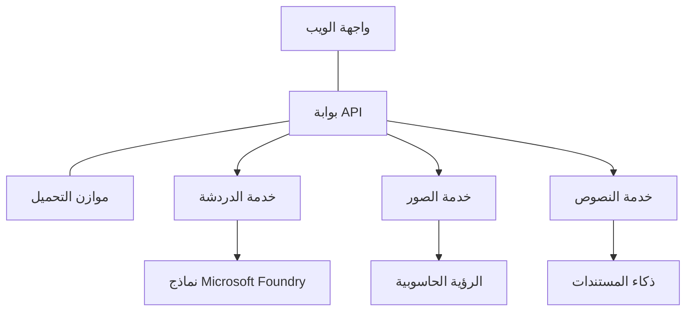

# أفضل الممارسات لأحمال عمل الذكاء الاصطناعي الإنتاجية مع AZD

**التنقّل بين الفصول:**
- **📚 الصفحة الرئيسية للدورة**: [AZD For Beginners](../../README.md)
- **📖 الفصل الحالي**: الفصل 8 - أنماط الإنتاج والمؤسسات
- **⬅️ الفصل السابق**: [الفصل 7: استكشاف الأخطاء وإصلاحها](../chapter-07-troubleshooting/debugging.md)
- **⬅️ ذو صلة أيضاً**: [AI Workshop Lab](ai-workshop-lab.md)
- **🎯 إتمام الدورة**: [AZD For Beginners](../../README.md)

## نظرة عامة

يوفر هذا الدليل أفضل الممارسات الشاملة لنشر أحمال عمل الذكاء الاصطناعي الجاهزة للإنتاج باستخدام Azure Developer CLI (AZD). استنادًا إلى ملاحظات مجتمع Microsoft Foundry على Discord ونشرات العملاء في العالم الحقيقي، تتناول هذه الممارسات أكثر التحديات شيوعًا في أنظمة الذكاء الاصطناعي للإنتاج.

## التحديات الرئيسية المعالجة

استنادًا إلى نتائج الاستطلاع المجتمعي لدينا، هذه هي التحديات الرئيسية التي يواجهها المطورون:

- **45%** يواجهون صعوبة في نشرات الذكاء الاصطناعي متعددة الخدمات
- **38%** لديهم مشكلات في إدارة بيانات الاعتماد والأسرار  
- **35%** يجدون صعوبة في الجهوزية للإنتاج وقابلية التوسع
- **32%** يحتاجون إلى استراتيجيات أفضل لتحسين التكلفة
- **29%** يتطلّبون تحسين المراقبة واستكشاف الأخطاء وإصلاحها

## أنماط البنية لأجل ذكاء اصطناعي إنتاجي

### النمط 1: بنية الذكاء الاصطناعي بنمط الخدمات المصغرة

**متى تستخدم**: تطبيقات ذكاء اصطناعي معقدة ذات قدرات متعددة



**تنفيذ AZD**:

```yaml
# azure.yaml
name: enterprise-ai-platform
services:
  web:
    project: ./web
    host: staticwebapp
  api-gateway:
    project: ./api-gateway
    host: containerapp
  chat-service:
    project: ./services/chat
    host: containerapp
  vision-service:
    project: ./services/vision
    host: containerapp
  text-service:
    project: ./services/text
    host: containerapp
```

### النمط 2: معالجة الذكاء الاصطناعي المدفوعة بالأحداث

**متى تستخدم**: معالجة دفعات، تحليل المستندات، تدفقات العمل غير المتزامنة

```bicep
// Event Hub for AI processing pipeline
resource eventHub 'Microsoft.EventHub/namespaces@2023-01-01-preview' = {
  name: eventHubNamespaceName
  location: location
  sku: {
    name: 'Standard'
    tier: 'Standard'
    capacity: 1
  }
}

// Service Bus for reliable message processing
resource serviceBus 'Microsoft.ServiceBus/namespaces@2022-10-01-preview' = {
  name: serviceBusNamespaceName
  location: location
  sku: {
    name: 'Premium'
    tier: 'Premium'
    capacity: 1
  }
}

// Function App for processing
resource functionApp 'Microsoft.Web/sites@2023-01-01' = {
  name: functionAppName
  location: location
  kind: 'functionapp,linux'
  properties: {
    siteConfig: {
      appSettings: [
        {
          name: 'FUNCTIONS_EXTENSION_VERSION'
          value: '~4'
        }
        {
          name: 'AZURE_OPENAI_ENDPOINT'
          value: '@Microsoft.KeyVault(VaultName=${keyVault.name};SecretName=openai-endpoint)'
        }
      ]
    }
  }
}
```

## التفكير في صحة وكيل الذكاء الاصطناعي

عندما يتعطل تطبيق ويب تقليدي، تكون الأعراض مألوفة: لا يتم تحميل صفحة، أو تعيد واجهة برمجة تطبيقات خطأً، أو يفشل نشر. يمكن أن تتعطل التطبيقات المدعومة بالذكاء الاصطناعي بكل تلك الطرق نفسها — لكنها قد تتصرف أيضًا بطرق أكثر دقة لا تنتج رسائل خطأ واضحة.

تساعدك هذه القسم على بناء نموذج ذهني لمراقبة أحمال عمل الذكاء الاصطناعي حتى تعرف أين تبحث عندما لا تبدو الأمور على ما يرام.

### كيف تختلف صحة الوكيل عن صحة التطبيق التقليدي

التطبيق التقليدي إما يعمل أو لا يعمل. قد يبدو وكيل الذكاء الاصطناعي أنه يعمل لكنه ينتج نتائج ضعيفة. فكّر في صحة الوكيل على مستويين:

| المستوى | ما الذي تراقبه | أين تبحث |
|-------|--------------|---------------|
| **صحة البُنية التحتية** | هل الخدمة تعمل؟ هل تم توفير الموارد؟ هل نقاط النهاية قابلة للوصول؟ | `azd monitor`, صحة الموارد في بوابة Azure, سجلات الحاوية/التطبيق |
| **صحة السلوك** | هل يرد الوكيل بدقة؟ هل الاستجابات في الوقت المناسب؟ هل يتم استدعاء النموذج بشكل صحيح؟ | آثار Application Insights، مقاييس زمن استجابة استدعاء النموذج، سجلات جودة الاستجابة |

صحة البُنية التحتية مألوفة—إنها نفسها لأي تطبيق azd. صحة السلوك هي الطبقة الجديدة التي تُدخلها أحمال عمل الذكاء الاصطناعي.

### أين تنظر عندما لا تتصرف تطبيقات الذكاء الاصطناعي كما هو متوقع

إذا لم ينتج تطبيق الذكاء الاصطناعي النتائج التي تتوقعها، فإليك قائمة فحص مفهومية:

1. **ابدأ بالأساسيات.** هل التطبيق يعمل؟ هل يمكنه الوصول إلى تبعياته؟ تحقق من `azd monitor` وصحة الموارد كما تفعل لأي تطبيق.
2. **تحقق من اتصال النموذج.** هل يستدعي تطبيقك النموذج بنجاح؟ الاستدعاءات الفاشلة أو التي انتهت مهلةها هي السبب الأكثر شيوعًا لمشكلات تطبيقات الذكاء الاصطناعي وستظهر في سجلات التطبيق.
3. **انظر إلى ما استلمه النموذج.** استجابات الذكاء الاصطناعي تعتمد على المدخلات (المطالبة وأي سياق تم استرجاعه). إذا كان الناتج خاطئًا، فعادةً ما تكون المدخلات خاطئة. تحقق مما إذا كان تطبيقك يرسل البيانات الصحيحة إلى النموذج.
4. **راجع زمن استجابة الاستجابة.** استدعاءات نموذج الذكاء الاصطناعي أبطأ من استدعاءات API النموذجية. إذا بدا تطبيقك بطيئًا، فتحقق مما إذا كانت أزمنة استجابة النموذج قد زادت — يمكن أن يشير ذلك إلى تقييد، حدود سعة، أو ازدحام على مستوى المنطقة.
5. **راقب إشارات التكلفة.** الارتفاعات غير المتوقعة في استخدام التوكنات أو استدعاءات API يمكن أن تشير إلى حلقة، مطالبة مُهيَّأة بشكل خاطئ، أو إعادة محاولات مفرطة.

لا تحتاج لإتقان أدوات القابلية للمراقبة فورًا. الخلاصة هي أن تطبيقات الذكاء الاصطناعي لديها طبقة سلوك إضافية للمراقبة، وميزة المراقبة المدمجة في azd (`azd monitor`) تعطيك نقطة بداية للتحقيق في كلا المستويين.

---

## أفضل ممارسات الأمان

### 1. نموذج أمني صفر ثقة

**استراتيجية التنفيذ**:
- لا يوجد اتصال خدمة إلى خدمة دون مصادقة
- جميع استدعاءات API تستخدم الهويات المُدارة
- عزل الشبكة بنقاط نهاية خاصة
- ضوابط وصول بأقل الامتيازات

```bicep
// Managed Identity for each service
resource chatServiceIdentity 'Microsoft.ManagedIdentity/userAssignedIdentities@2023-01-31' = {
  name: 'chat-service-identity'
  location: location
}

// Role assignments with minimal permissions
resource openAIUserRole 'Microsoft.Authorization/roleAssignments@2022-04-01' = {
  scope: openAIAccount
  name: guid(openAIAccount.id, chatServiceIdentity.id, openAIUserRoleDefinitionId)
  properties: {
    roleDefinitionId: subscriptionResourceId('Microsoft.Authorization/roleDefinitions', '5e0bd9bd-7b93-4f28-af87-19fc36ad61bd')
    principalId: chatServiceIdentity.properties.principalId
    principalType: 'ServicePrincipal'
  }
}
```

### 2. إدارة الأسرار بشكل آمن

**نمط تكامل Key Vault**:

```bicep
// Key Vault with proper access policies
resource keyVault 'Microsoft.KeyVault/vaults@2023-02-01' = {
  name: keyVaultName
  location: location
  properties: {
    tenantId: tenant().tenantId
    sku: {
      family: 'A'
      name: 'premium'  // Use premium for production
    }
    enableRbacAuthorization: true  // Use RBAC instead of access policies
    enablePurgeProtection: true    // Prevent accidental deletion
    enableSoftDelete: true
    softDeleteRetentionInDays: 90
  }
}

// Store all AI service credentials
resource openAIKeySecret 'Microsoft.KeyVault/vaults/secrets@2023-02-01' = {
  parent: keyVault
  name: 'openai-api-key'
  properties: {
    value: openAIAccount.listKeys().key1
    attributes: {
      enabled: true
    }
  }
}
```

### 3. أمن الشبكة

**تكوين نقطة نهاية خاصة**:

```bicep
// Virtual Network for AI services
resource virtualNetwork 'Microsoft.Network/virtualNetworks@2023-04-01' = {
  name: vnetName
  location: location
  properties: {
    addressSpace: {
      addressPrefixes: ['10.0.0.0/16']
    }
    subnets: [
      {
        name: 'ai-services-subnet'
        properties: {
          addressPrefix: '10.0.1.0/24'
          privateEndpointNetworkPolicies: 'Disabled'
        }
      }
      {
        name: 'app-services-subnet'
        properties: {
          addressPrefix: '10.0.2.0/24'
          delegations: [
            {
              name: 'Microsoft.Web/serverFarms'
              properties: {
                serviceName: 'Microsoft.Web/serverFarms'
              }
            }
          ]
        }
      }
    ]
  }
}

// Private endpoints for all AI services
resource openAIPrivateEndpoint 'Microsoft.Network/privateEndpoints@2023-04-01' = {
  name: '${openAIAccountName}-pe'
  location: location
  properties: {
    subnet: {
      id: virtualNetwork.properties.subnets[0].id
    }
    privateLinkServiceConnections: [
      {
        name: 'openai-connection'
        properties: {
          privateLinkServiceId: openAIAccount.id
          groupIds: ['account']
        }
      }
    ]
  }
}
```

## الأداء وقابلية التوسع

### 1. استراتيجيات التوسّع التلقائي

**التحجيم التلقائي لتطبيقات الحاويات**:

```bicep
resource containerApp 'Microsoft.App/containerApps@2023-05-01' = {
  name: containerAppName
  location: location
  properties: {
    configuration: {
      ingress: {
        external: true
        targetPort: 8000
        transport: 'http'
      }
    }
    template: {
      scale: {
        minReplicas: 2  // Always have 2 instances minimum
        maxReplicas: 50 // Scale up to 50 for high load
        rules: [
          {
            name: 'http-scaling'
            http: {
              metadata: {
                concurrentRequests: '20'  // Scale when >20 concurrent requests
              }
            }
          }
          {
            name: 'cpu-scaling'
            custom: {
              type: 'cpu'
              metadata: {
                type: 'Utilization'
                value: '70'  // Scale when CPU >70%
              }
            }
          }
        ]
      }
    }
  }
}
```

### 2. استراتيجيات التخزين المؤقت

**ذاكرة التخزين المؤقت Redis لاستجابات الذكاء الاصطناعي**:

```bicep
// Redis Premium for production workloads
resource redisCache 'Microsoft.Cache/redis@2023-04-01' = {
  name: redisCacheName
  location: location
  properties: {
    sku: {
      name: 'Premium'
      family: 'P'
      capacity: 1
    }
    enableNonSslPort: false
    minimumTlsVersion: '1.2'
    redisConfiguration: {
      'maxmemory-policy': 'allkeys-lru'
    }
    // Enable clustering for high availability
    redisVersion: '6.0'
    shardCount: 2
  }
}

// Cache configuration in application
var cacheConnectionString = '${redisCache.properties.hostName}:6380,password=${redisCache.listKeys().primaryKey},ssl=True,abortConnect=False'
```

### 3. موازنة التحميل وإدارة المرور

**Application Gateway مع WAF**:

```bicep
// Application Gateway with Web Application Firewall
resource applicationGateway 'Microsoft.Network/applicationGateways@2023-04-01' = {
  name: appGatewayName
  location: location
  properties: {
    sku: {
      name: 'WAF_v2'
      tier: 'WAF_v2'
      capacity: 2
    }
    webApplicationFirewallConfiguration: {
      enabled: true
      firewallMode: 'Prevention'
      ruleSetType: 'OWASP'
      ruleSetVersion: '3.2'
    }
    // Backend pools for AI services
    backendAddressPools: [
      {
        name: 'ai-services-pool'
        properties: {
          backendAddresses: [
            {
              fqdn: '${containerApp.properties.configuration.ingress.fqdn}'
            }
          ]
        }
      }
    ]
  }
}
```

## 💰 تحسين التكلفة

### 1. تحديد الحجم المناسب للموارد

**تكوينات خاصة بالبيئة**:

```bash
# بيئة التطوير
azd env new development
azd env set AZURE_OPENAI_SKU "S0"
azd env set AZURE_OPENAI_CAPACITY 10
azd env set AZURE_SEARCH_SKU "basic"
azd env set CONTAINER_CPU 0.5
azd env set CONTAINER_MEMORY 1.0

# بيئة الإنتاج
azd env new production
azd env set AZURE_OPENAI_SKU "S0"
azd env set AZURE_OPENAI_CAPACITY 100
azd env set AZURE_SEARCH_SKU "standard"
azd env set CONTAINER_CPU 2.0
azd env set CONTAINER_MEMORY 4.0
```

### 2. مراقبة التكلفة والميزانيات

```bicep
// Cost management and budgets
resource budget 'Microsoft.Consumption/budgets@2023-05-01' = {
  name: 'ai-workload-budget'
  properties: {
    timePeriod: {
      startDate: '2024-01-01'
      endDate: '2024-12-31'
    }
    timeGrain: 'Monthly'
    amount: 2000  // $2000 monthly budget
    category: 'Cost'
    notifications: {
      warning: {
        enabled: true
        operator: 'GreaterThan'
        threshold: 80
        contactEmails: [
          'finance@company.com'
          'engineering@company.com'
        ]
        contactRoles: [
          'Owner'
          'Contributor'
        ]
      }
      critical: {
        enabled: true
        operator: 'GreaterThan'
        threshold: 95
        contactEmails: [
          'cto@company.com'
        ]
      }
    }
  }
}
```

### 3. تحسين استخدام التوكنات

**إدارة تكاليف OpenAI**:

```typescript
// تحسين التوكنات على مستوى التطبيق
class TokenOptimizer {
  private readonly maxTokens = 4000;
  private readonly reserveTokens = 500;
  
  optimizePrompt(userInput: string, context: string): string {
    const availableTokens = this.maxTokens - this.reserveTokens;
    const estimatedTokens = this.estimateTokens(userInput + context);
    
    if (estimatedTokens > availableTokens) {
      // اختصر السياق، لا مدخلات المستخدم
      context = this.truncateContext(context, availableTokens - this.estimateTokens(userInput));
    }
    
    return `${context}\n\nUser: ${userInput}`;
  }
  
  private estimateTokens(text: string): number {
    // تقدير تقريبي: توكن واحد ≈ ٤ أحرف
    return Math.ceil(text.length / 4);
  }
}
```

## المراقبة والقابلية للرصد

### 1. Application Insights الشاملة

```bicep
// Application Insights with advanced features
resource applicationInsights 'Microsoft.Insights/components@2020-02-02' = {
  name: applicationInsightsName
  location: location
  kind: 'web'
  properties: {
    Application_Type: 'web'
    WorkspaceResourceId: logAnalyticsWorkspace.id
    SamplingPercentage: 100  // Full sampling for AI apps
    DisableIpMasking: false  // Enable for security
  }
}

// Custom metrics for AI operations
resource aiMetricAlerts 'Microsoft.Insights/metricAlerts@2018-03-01' = {
  name: 'ai-high-error-rate'
  location: 'global'
  properties: {
    description: 'Alert when AI service error rate is high'
    severity: 2
    enabled: true
    scopes: [
      applicationInsights.id
    ]
    evaluationFrequency: 'PT1M'
    windowSize: 'PT5M'
    criteria: {
      'odata.type': 'Microsoft.Azure.Monitor.SingleResourceMultipleMetricCriteria'
      allOf: [
        {
          name: 'high-error-rate'
          metricName: 'requests/failed'
          operator: 'GreaterThan'
          threshold: 10
          timeAggregation: 'Count'
        }
      ]
    }
  }
}
```

### 2. المراقبة الخاصة بالذكاء الاصطناعي

**لوحات معلومات مخصصة لمقاييس الذكاء الاصطناعي**:

```json
// Dashboard configuration for AI workloads
{
  "dashboard": {
    "name": "AI Application Monitoring",
    "tiles": [
      {
        "name": "OpenAI Request Volume",
        "query": "requests | where name contains 'openai' | summarize count() by bin(timestamp, 5m)"
      },
      {
        "name": "AI Response Latency",
        "query": "requests | where name contains 'openai' | summarize avg(duration) by bin(timestamp, 5m)"
      },
      {
        "name": "Token Usage",
        "query": "customMetrics | where name == 'openai_tokens_used' | summarize sum(value) by bin(timestamp, 1h)"
      },
      {
        "name": "Cost per Hour",
        "query": "customMetrics | where name == 'openai_cost' | summarize sum(value) by bin(timestamp, 1h)"
      }
    ]
  }
}
```

### 3. فحوصات الصحة ومراقبة وقت التشغيل

```bicep
// Application Insights availability tests
resource availabilityTest 'Microsoft.Insights/webtests@2022-06-15' = {
  name: 'ai-app-availability-test'
  location: location
  tags: {
    'hidden-link:${applicationInsights.id}': 'Resource'
  }
  properties: {
    SyntheticMonitorId: 'ai-app-availability-test'
    Name: 'AI Application Availability Test'
    Description: 'Tests AI application endpoints'
    Enabled: true
    Frequency: 300  // 5 minutes
    Timeout: 120    // 2 minutes
    Kind: 'ping'
    Locations: [
      {
        Id: 'us-east-2-azr'
      }
      {
        Id: 'us-west-2-azr'
      }
    ]
    Configuration: {
      WebTest: '''
        <WebTest Name="AI Health Check" 
                 Id="8d2de8d2-a2b0-4c2e-9a0d-8f9c9a0b8c8d" 
                 Enabled="True" 
                 CssProjectStructure="" 
                 CssIteration="" 
                 Timeout="120" 
                 WorkItemIds="" 
                 xmlns="http://microsoft.com/schemas/VisualStudio/TeamTest/2010" 
                 Description="" 
                 CredentialUserName="" 
                 CredentialPassword="" 
                 PreAuthenticate="True" 
                 Proxy="default" 
                 StopOnError="False" 
                 RecordedResultFile="" 
                 ResultsLocale="">
          <Items>
            <Request Method="GET" 
                     Guid="a5f10126-e4cd-570d-961c-cea43999a200" 
                     Version="1.1" 
                     Url="${webApp.properties.defaultHostName}/health" 
                     ThinkTime="0" 
                     Timeout="120" 
                     ParseDependentRequests="True" 
                     FollowRedirects="True" 
                     RecordResult="True" 
                     Cache="False" 
                     ResponseTimeGoal="0" 
                     Encoding="utf-8" 
                     ExpectedHttpStatusCode="200" 
                     ExpectedResponseUrl="" 
                     ReportingName="" 
                     IgnoreHttpStatusCode="False" />
          </Items>
        </WebTest>
      '''
    }
  }
}
```

## استعادة الكوارث والتوافر العالي

### 1. النشر متعدد المناطق

```yaml
# azure.yaml - Multi-region configuration
name: ai-app-multiregion
services:
  api-primary:
    project: ./api
    host: containerapp
    env:
      - AZURE_REGION=eastus
  api-secondary:
    project: ./api
    host: containerapp
    env:
      - AZURE_REGION=westus2
```

```bicep
// Traffic Manager for global load balancing
resource trafficManager 'Microsoft.Network/trafficManagerProfiles@2022-04-01' = {
  name: trafficManagerProfileName
  location: 'global'
  properties: {
    profileStatus: 'Enabled'
    trafficRoutingMethod: 'Priority'
    dnsConfig: {
      relativeName: trafficManagerProfileName
      ttl: 30
    }
    monitorConfig: {
      protocol: 'HTTPS'
      port: 443
      path: '/health'
      intervalInSeconds: 30
      toleratedNumberOfFailures: 3
      timeoutInSeconds: 10
    }
    endpoints: [
      {
        name: 'primary-endpoint'
        type: 'Microsoft.Network/trafficManagerProfiles/azureEndpoints'
        properties: {
          targetResourceId: primaryAppService.id
          endpointStatus: 'Enabled'
          priority: 1
        }
      }
      {
        name: 'secondary-endpoint'
        type: 'Microsoft.Network/trafficManagerProfiles/azureEndpoints'
        properties: {
          targetResourceId: secondaryAppService.id
          endpointStatus: 'Enabled'
          priority: 2
        }
      }
    ]
  }
}
```

### 2. نسخ البيانات الاحتياطية واستعادتها

```bicep
// Backup configuration for critical data
resource backupVault 'Microsoft.DataProtection/backupVaults@2023-05-01' = {
  name: backupVaultName
  location: location
  identity: {
    type: 'SystemAssigned'
  }
  properties: {
    storageSettings: [
      {
        datastoreType: 'VaultStore'
        type: 'LocallyRedundant'
      }
    ]
  }
}

// Backup policy for AI models and data
resource backupPolicy 'Microsoft.DataProtection/backupVaults/backupPolicies@2023-05-01' = {
  parent: backupVault
  name: 'ai-data-backup-policy'
  properties: {
    policyRules: [
      {
        backupParameters: {
          backupType: 'Full'
          objectType: 'AzureBackupParams'
        }
        trigger: {
          schedule: {
            repeatingTimeIntervals: [
              'R/2024-01-01T02:00:00+00:00/P1D'  // Daily at 2 AM
            ]
          }
          objectType: 'ScheduleBasedTriggerContext'
        }
        dataStore: {
          datastoreType: 'VaultStore'
          objectType: 'DataStoreInfoBase'
        }
        name: 'BackupDaily'
        objectType: 'AzureBackupRule'
      }
    ]
  }
}
```

## دمج DevOps و CI/CD

### 1. سير عمل GitHub Actions

```yaml
# .github/workflows/deploy-ai-app.yml
name: Deploy AI Application

on:
  push:
    branches: [main]
  pull_request:
    branches: [main]

jobs:
  test:
    runs-on: ubuntu-latest
    steps:
      - uses: actions/checkout@v4
      
      - name: Setup Python
        uses: actions/setup-python@v4
        with:
          python-version: '3.11'
          
      - name: Install dependencies
        run: |
          pip install -r requirements.txt
          pip install pytest
          
      - name: Run tests
        run: pytest tests/
        
      - name: AI Safety Tests
        run: |
          python scripts/test_ai_safety.py
          python scripts/validate_prompts.py

  deploy-staging:
    needs: test
    if: github.event_name == 'pull_request'
    runs-on: ubuntu-latest
    steps:
      - uses: actions/checkout@v4
      
      - name: Setup AZD
        uses: Azure/setup-azd@v2
        
      - name: Login to Azure
        uses: azure/login@v1
        with:
          creds: ${{ secrets.AZURE_CREDENTIALS }}
          
      - name: Deploy to Staging
        run: |
          azd env select staging
          azd deploy

  deploy-production:
    needs: test
    if: github.ref == 'refs/heads/main'
    runs-on: ubuntu-latest
    steps:
      - uses: actions/checkout@v4
      
      - name: Setup AZD
        uses: Azure/setup-azd@v2
        
      - name: Login to Azure
        uses: azure/login@v1
        with:
          creds: ${{ secrets.AZURE_CREDENTIALS }}
          
      - name: Deploy to Production
        run: |
          azd env select production
          azd deploy
          
      - name: Run Production Health Checks
        run: |
          python scripts/health_check.py --env production
```

### 2. التحقق من البنية التحتية

```bash
# scripts/validate_infrastructure.sh
#!/bin/bash

echo "Validating AI infrastructure deployment..."

# تحقق من أن جميع الخدمات المطلوبة تعمل
services=("openai" "search" "storage" "keyvault")
for service in "${services[@]}"; do
    echo "Checking $service..."
    if ! az resource list --resource-type "Microsoft.CognitiveServices/accounts" --query "[?contains(name, '$service')]" -o tsv; then
        echo "ERROR: $service not found"
        exit 1
    fi
done

# تحقق من نشر نماذج OpenAI
echo "Validating OpenAI model deployments..."
models=$(az cognitiveservices account deployment list --name $AZURE_OPENAI_NAME --resource-group $AZURE_RESOURCE_GROUP --query "[].name" -o tsv)
if [[ ! $models == *"gpt-4.1-mini"* ]]; then
  echo "ERROR: Required model gpt-4.1-mini not deployed"
    exit 1
fi

# اختبر اتصال خدمة الذكاء الاصطناعي
echo "Testing AI service connectivity..."
python scripts/test_connectivity.py

echo "Infrastructure validation completed successfully!"
```

## قائمة تدقيق الجهوزية للإنتاج

### الأمان ✅
- [ ] تستخدم جميع الخدمات الهويات المُدارة
- [ ] الأسرار مخزنة في Key Vault
- [ ] نقاط النهاية الخاصة مُكوَّنة
- [ ] تم تنفيذ مجموعات أمان الشبكة
- [ ] RBAC بأقل الامتيازات
- [ ] تم تمكين WAF على نقاط النهاية العامة

### الأداء ✅
- [ ] تم تكوين التوسّع التلقائي
- [ ] تم تنفيذ التخزين المؤقت
- [ ] تم إعداد موازنة التحميل
- [ ] CDN للمحتوى الثابت
- [ ] تجميع اتصالات قاعدة البيانات
- [ ] تحسين استخدام التوكنات

### المراقبة ✅
- [ ] تم تكوين Application Insights
- [ ] تم تعريف مقاييس مخصصة
- [ ] تم إعداد قواعد التنبيه
- [ ] تم إنشاء لوحة معلومات
- [ ] تم تنفيذ فحوصات الصحة
- [ ] سياسات الاحتفاظ بالسجلات

### الموثوقية ✅
- [ ] نشر متعدد المناطق
- [ ] خطة النسخ الاحتياطية والاسترداد
- [ ] تم تنفيذ قواطع الدائرة
- [ ] تم تكوين سياسات إعادة المحاولة
- [ ] تدهور متدرج
- [ ] نقاط نهاية فحوصات الصحة

### إدارة التكلفة ✅
- [ ] تم تكوين تنبيهات الميزانية
- [ ] تحديد الحجم المناسب للموارد
- [ ] تطبيق خصومات التطوير/الاختبار
- [ ] شراء مثيلات محجوزة
- [ ] لوحة مراقبة التكلفة
- [ ] مراجعات دورية للتكلفة

### الامتثال ✅
- [ ] تم الوفاء بمتطلبات إقامت البيانات
- [ ] تم تمكين تسجيل التدقيق
- [ ] تم تطبيق سياسات الامتثال
- [ ] تم تنفيذ معايير الأمان الأساسية
- [ ] تقييمات أمان دورية
- [ ] خطة الاستجابة للحوادث

## مقاييس الأداء المرجعية

### المقاييس النموذجية للإنتاج

| المقياس | الهدف | المراقبة |
|--------|--------|------------|
| **زمن الاستجابة** | < 2 seconds | Application Insights |
| **التوفر** | 99.9% | مراقبة وقت التشغيل |
| **معدل الأخطاء** | < 0.1% | سجلات التطبيق |
| **استخدام التوكنات** | < $500/month | إدارة التكاليف |
| **المستخدمون المتزامنون** | 1000+ | اختبار التحميل |
| **زمن الاسترداد** | < 1 hour | اختبارات استعادة الكوارث |

### اختبار التحميل

```bash
# نص برمجي لاختبار التحميل لتطبيقات الذكاء الاصطناعي
python scripts/load_test.py \
  --endpoint https://your-ai-app.azurewebsites.net \
  --concurrent-users 100 \
  --duration 300 \
  --ramp-up 60
```

## 🤝 أفضل ممارسات المجتمع

بناءً على ملاحظات مجتمع Microsoft Foundry على Discord:

### أفضل التوصيات من المجتمع:

1. **ابدأ صغيراً، قم بالتدرج في التوسيع**: ابدأ بالـ SKUs الأساسية وقم بالترقية بناءً على الاستخدام الفعلي
2. **راقب كل شيء**: قم بإعداد مراقبة شاملة من اليوم الأول
3. **أتمت الأمان**: استخدم البنية التحتية ككود لأمان متسق
4. **اختبر بدقة**: أدرج اختبارات خاصة بالذكاء الاصطناعي في خط الأنابيب
5. **خطط للتكاليف**: راقب استخدام التوكنات واضبط تنبيهات الميزانية مبكرًا

### الأخطاء الشائعة التي يجب تجنبها:

- ❌ تضمين مفاتيح API في الكود مباشرةً
- ❌ عدم إعداد مراقبة مناسبة
- ❌ تجاهل تحسين التكلفة
- ❌ عدم اختبار سيناريوهات الفشل
- ❌ النشر بدون فحوصات الصحة

## أوامر AZD AI وملحقاته

يتضمن AZD مجموعة متنامية من الأوامر والملحقات الخاصة بالذكاء الاصطناعي التي تُبسّط أحمال عمل الذكاء الاصطناعي الإنتاجية. تجسر هذه الأدوات الفجوة بين التطوير المحلي والنشر الإنتاجي لأحمال عمل الذكاء الاصطناعي.

### ملحقات AZD للذكاء الاصطناعي

يستخدم AZD نظام ملحقات لإضافة قدرات خاصة بالذكاء الاصطناعي. قم بتثبيت وإدارة الملحقات باستخدام:

```bash
# عرض جميع الإضافات المتاحة (بما في ذلك الذكاء الاصطناعي)
azd extension list

# عرض تفاصيل الإضافات المثبتة
azd extension show azure.ai.agents

# تثبيت إضافة وكلاء Foundry
azd extension install azure.ai.agents

# تثبيت إضافة الضبط الدقيق
azd extension install azure.ai.finetune

# تثبيت إضافة النماذج المخصصة
azd extension install azure.ai.models

# ترقية جميع الإضافات المثبتة
azd extension upgrade --all
```

**الملحقات المتاحة للذكاء الاصطناعي:**

| الملحق | الغرض | الحالة |
|-----------|---------|--------|
| `azure.ai.agents` | إدارة خدمة Foundry Agent | معاينة |
| `azure.ai.skills` | مهارات وكيل قابلة لإعادة الاستخدام | معاينة |
| `azure.ai.connections` | اتصالات Foundry (مصادر البيانات، الأدوات) | معاينة |
| `azure.ai.finetune` | التدريب الدقيق لنماذج Foundry | معاينة |
| `azure.ai.models` | نماذج مخصصة في Foundry | معاينة |
| `azure.coding-agent` | تكوين وكيل البرمجة | متاح |

> إن ملحق `azure.ai.agents` يتطور بسرعة. تم التحقق من هذه الدورة مقابل `0.1.40-preview`. شغّل `azd extension upgrade --all` لالتقاط أحدث مجموعة أوامر، و`azd extension show azure.ai.agents` لتأكيد الإصدار المثبت لديك.

**ما هي الملحقات الأحدث `skills` و `connections`؟**

ظهرت امتدادتان معاينتان جنبًا إلى جنب مع أدوات الوكيل ومن المفيد فهمهما حتى كمبتدئ:

- **`azure.ai.skills`** — الـ**مهارة** هي قدرة قابلة لإعادة الاستخدام (أداة معبأة أو سلوك) يمكنك إرفاقها بوكيل واحد أو أكثر بدلاً من إعادة تنفيذها في كل مرة. فكّر فيها ككتلة بناء مشتركة: عرّف مهارة "البحث في الوثائق" أو "الاستعلام عن طلب" مرة واحدة، ثم أعد استخدامها عبر الوكلاء. هذا يحافظ على اتساق أنظمة الوكلاء المتعددين (الفصل 5) ويتجنّب النسخ واللصق.
- **`azure.ai.connections`** — الـ**اتصال** هو رابط مدار من مشروع Foundry الخاص بك إلى مورد خارجي يحتاجه وكلاؤك — مصدر بيانات (مثل Azure AI Search)، نقطة نهاية أداة، أو خدمة أخرى. تركز الاتصالات مكان وكيفية وصول الوكلاء إلى البيانات، لذا تعيش بيانات الاعتماد ونقاط النهاية في مكان محكوم واحد بدلًا من التبعثر في الكود.

لا تحتاج هذه الملحقات لنشر وكلائك الأوائل — التزم بـ `azure.ai.agents` أثناء التعلم. التمسك بـ `skills` عندما تجد نفسك تكرر نفس الأداة عبر الوكلاء، و`connections` عندما يتشارك عدة وكلاء نفس مصدر البيانات.

### تهيئة مشاريع الوكلاء باستخدام `azd ai agent init`

يقوم أمر `azd ai agent init` بتهيئة مشروع وكيل ذكاء اصطناعي جاهز للإنتاج ومتكامل مع Microsoft Foundry Agent Service:

```bash
# تهيئة مشروع وكيل جديد من ملف مواصفات الوكيل
azd ai agent init -m <manifest-path-or-uri>

# تهيئة واستهداف مشروع Foundry محدد
azd ai agent init -m agent-manifest.yaml --project-id <foundry-project-id>

# تهيئة باستخدام دليل مصدر مخصص
azd ai agent init -m agent-manifest.yaml --src ./agents/my-agent

# استهداف تطبيقات الحاويات كمضيف
azd ai agent init -m agent-manifest.yaml --host containerapp
```

**الخيارات الأساسية:**

| العلامة | الوصف |
|------|-------------|
| `-m, --manifest` | مسار أو URI إلى ملف تعريف وكيل لإضافته إلى مشروعك |
| `-p, --project-id` | معرف مشروع Microsoft Foundry الموجود لبيئة azd الخاصة بك |
| `-s, --src` | الدليل لتحميل تعريف الوكيل (الافتراضي إلى `src/<agent-id>`) |
| `--host` | تجاوز المضيف الافتراضي (مثال: `containerapp`) |
| `-e, --environment` | بيئة azd لاستخدامها |

**نصيحة للإنتاج**: استخدم `--project-id` للاتصال مباشرةً بمشروع Foundry موجود، مما يبقي كود الوكيل وموارد السحابة مرتبطة من البداية.

### إدارة دورة حياة الوكيل

بخلاف `init`، يوفر ملحق `azure.ai.agents` أوامر لدورة حياة مستضافة كاملة للوكيل — الاختبار، التقييم، التحسين، وإحالته للتقاعد:

```bash
# استدعاء وكيل منشور وعرض توقيت استجابة الخادم
# (الكمون الكلي والوقت حتى أول بايت)
azd ai agent invoke

# عرض تكوين نقطة النهاية الحية قبل تغييره
azd ai agent endpoint show

# توليد مجموعة بيانات تقييم للوكيل
azd ai agent eval generate --dataset ./eval/dataset.jsonl

# تحسين تعليمات الوكيل بناءً على بيانات التقييم الخاصة بك
# (يتطلب وجود optimization_model في مشروع الوكيل)
azd ai agent optimize

# تنزيل المصدر المنشور لوكيل مستضاف يعتمد على الكود
# (مع التحقق عبر SHA-256)
azd ai agent code download

# حذف وكيل مستضاف وجميع إصداراته
# (--force ينهي الجلسات النشطة)
azd ai agent delete --force
```

**دورة الحياة بإيجاز:**

| المرحلة | الأمر | الاستخدام في الإنتاج |
|-------|---------|----------------|
| اختبار | `azd ai agent invoke` | التحقق من الاستجابات وقياس الكمون قبل الإصدار |
| فحص | `azd ai agent endpoint show` | مراجعة مصادقة/تكوين نقطة النهاية؛ رصد التغييرات الكاسرة مبكرًا |
| قياس | `azd ai agent eval generate` | بناء مجموعة تقييم قابلة للتكرار من الآثار الحقيقية |
| تحسين | `azd ai agent optimize` | ضبط التعليمات مقابل الجودة المقاسة |
| استرداد | `azd ai agent code download` | استرداد الشيفرة المنتشرة بالضبط للمراجعة/التراجع |
| تقاعد | `azd ai agent delete --force` | إنهاء وكيل وإصداراته بشكل نظيف |

> هذه أوامر معاينة وقد تتغير بين إصدارات الملحق. شغّل `azd ai agent --help` لرؤية الأوامر الفرعية الدقيقة المتاحة في الإصدار المثبت لديك.

### Model Context Protocol (MCP) مع `azd mcp`
AZD تتضمن دعم خادم MCP مدمج (Alpha)، مما يمكّن وكلاء وأدوات الذكاء الاصطناعي من التفاعل مع موارد Azure الخاصة بك عبر بروتوكول موحّد:

```bash
# ابدأ خادم MCP لمشروعك
azd mcp start

# راجع قواعد الموافقة الحالية الخاصة بـ Copilot لتنفيذ الأدوات
azd copilot consent list
```

يعرض خادم MCP سياق مشروع azd الخاص بك — البيئات، الخدمات، وموارد Azure — لأدوات التطوير المدعومة بالذكاء الاصطناعي. يتيح ذلك:

- **نشر بمساعدة الذكاء الاصطناعي**: السماح لوكلاء البرمجة باستعلام حالة مشروعك وتشغيل عمليات النشر
- **اكتشاف الموارد**: يمكن لأدوات الذكاء الاصطناعي اكتشاف موارد Azure التي يستخدمها مشروعك
- **إدارة البيئة**: يمكن للوكلاء التبديل بين بيئات التطوير/التجريب/الإنتاج

### إنشاء البنية التحتية باستخدام `azd infra generate`

لأعباء عمل الذكاء الاصطناعي في الإنتاج، يمكنك إنشاء وتخصيص البنية التحتية ككود بدلاً من الاعتماد على التوفير التلقائي:

```bash
# توليد ملفات Bicep/Terraform من تعريف مشروعك
azd infra generate
```

هذا يكتب IaC إلى القرص حتى تتمكن من:
- مراجعة ومراجعة البنية التحتية قبل النشر
- إضافة سياسات أمان مخصصة (قواعد الشبكة، النقاط النهائية الخاصة)
- التكامل مع عمليات مراجعة IaC الموجودة
- تتبع تغييرات البنية التحتية في نظام التحكم بالإصدار بشكل منفصل عن كود التطبيق

### خطافات دورة حياة الإنتاج

تتيح لك خطافات AZD حقن منطق مخصص في كل مرحلة من مراحل دورة حياة النشر — وهو أمر حاسم لأعباء عمل الذكاء الاصطناعي في الإنتاج:

```yaml
# azure.yaml - Production hooks example
name: ai-production-app
hooks:
  preprovision:
    shell: sh
    run: scripts/validate-quotas.sh    # Check AI model quota before provisioning
  postprovision:
    shell: sh
    run: scripts/configure-networking.sh  # Set up private endpoints
  predeploy:
    shell: sh
    run: scripts/run-ai-safety-tests.sh  # Run prompt safety checks
  postdeploy:
    shell: sh
    run: scripts/smoke-test.sh           # Verify agent responses post-deploy
services:
  agent-api:
    project: ./src/agent
    host: containerapp
    hooks:
      predeploy:
        shell: sh
        run: scripts/validate-model-access.sh  # Per-service hook
```

```bash
# تشغيل هوك محدد يدويًا أثناء التطوير
azd hooks run predeploy
```

**خطافات الإنتاج الموصى بها لأعباء عمل الذكاء الاصطناعي:**

| Hook | Use Case |
|------|----------|
| `preprovision` | التحقق من حدود الاشتراك لسعة نماذج الذكاء الاصطناعي |
| `postprovision` | تكوين النقاط النهائية الخاصة، نشر أوزان النماذج |
| `predeploy` | تشغيل اختبارات أمان الذكاء الاصطناعي، التحقق من قوالب المطالبات |
| `postdeploy` | اختبار استجابة الوكلاء السريع، التحقق من اتصال النموذج |

### تكوين خط أنابيب CI/CD

استخدم `azd pipeline config` لربط مشروعك بـ GitHub Actions أو Azure Pipelines مع مصادقة Azure آمنة:

```bash
# تكوين خط أنابيب CI/CD (تفاعلي)
azd pipeline config

# التكوين باستخدام مزود محدد
azd pipeline config --provider github
```

تقوم هذه الأوامر بـ:
- إنشاء خدمة رئيسية (service principal) بأدنى صلاحيات ممكنة
- تكوين بيانات اعتماد فيدرالية (بدون أسرار مخزنة)
- إنشاء أو تحديث ملف تعريف خط الأنابيب الخاص بك
- تعيين متغيرات البيئة المطلوبة في نظام CI/CD الخاص بك

#### خطوة بخطوة: خط أنابيب GitHub Actions الأول لديك

إليك الدليل الكامل من مشروع azd العامل إلى عمليات النشر المؤتمتة على كل دفعة.

**1. تأكد من أن مشروعك على GitHub**

```bash
git init
git add .
git commit -m "Initial azd project"
gh repo create my-ai-app --private --source=. --push
```

**2. شغّل pipeline config**

```bash
azd pipeline config --provider github
```

سيقوم azd، تفاعلياً:
- بالسؤال عن اشتراك Azure والبيئة المراد استهدافها
- بإنشاء تسجيل تطبيق Entra **app registration + service principal** لخط الأنابيب
- بإعداد **بيانات اعتماد فيدرالية (OIDC)** — حتى تقوم GitHub بالمصادقة إلى Azure باستخدام رموز قصيرة العمر و**لا تُخزن أي أسرار**
- بدفع **المتغيرات** المطلوبة إلى مستودع GitHub الخاص بك (`AZURE_CLIENT_ID`, `AZURE_TENANT_ID`, `AZURE_SUBSCRIPTION_ID`, `AZURE_ENV_NAME`, `AZURE_LOCATION`)

**3. فهم سير العمل المُنشأ**

يضيف azd `.github/workflows/azure-dev.yml`. الأجزاء الأساسية تبدو هكذا:

```yaml
# .github/workflows/azure-dev.yml
on:
  push:
    branches: [ main ]
  workflow_dispatch:        # lets you run it manually too

permissions:
  id-token: write           # required for OIDC federated login
  contents: read

jobs:
  build:
    runs-on: ubuntu-latest
    env:
      AZURE_CLIENT_ID: ${{ vars.AZURE_CLIENT_ID }}
      AZURE_TENANT_ID: ${{ vars.AZURE_TENANT_ID }}
      AZURE_SUBSCRIPTION_ID: ${{ vars.AZURE_SUBSCRIPTION_ID }}
      AZURE_ENV_NAME: ${{ vars.AZURE_ENV_NAME }}
      AZURE_LOCATION: ${{ vars.AZURE_LOCATION }}
    steps:
      - uses: actions/checkout@v4
      - name: Install azd
        uses: Azure/setup-azd@v2
      - name: Log in with OIDC
        run: azd auth login --client-id "$AZURE_CLIENT_ID" --federated-credential-provider "github" --tenant-id "$AZURE_TENANT_ID"
      - name: Provision infrastructure
        run: azd provision --no-prompt
      - name: Deploy application
        run: azd deploy --no-prompt
```

**4. التحقق من أنه يعمل**

```bash
# ادفع تغييرًا لتشغيل خط الأنابيب
git commit -am "Trigger pipeline" --allow-empty
git push
```

افتح تبويب **Actions** في مستودع GitHub الخاص بك وشاهد سير العمل وهو يشغّل `azd provision` و`azd deploy` تلقائياً.

> **لماذا تهم البيانات الاعتمادية الفيدرالية:** كانت الأنابيب القديمة تخزن سر العميل في GitHub. تزيل بيانات الاعتماد الفيدرالية OIDC هذا السر تماماً — تطلب GitHub رمزاً قصير العمر أثناء التشغيل، وهو أكثر أماناً ولا يحتاج للدوران أو الخطر بالتسرب. هذا هو الإعداد الافتراضي الذي يقوم به `azd pipeline config`.

> **الأسرار مقابل المتغيرات:** المعرفات غير الحساسة (`AZURE_CLIENT_ID`، إلخ) توضع في **متغيرات** المستودع. إذا كان تطبيقك بحاجة فعلاً إلى سر أثناء البناء، أضفه كـ **secret** في GitHub وقم بالإشارة إليه بـ `${{ secrets.NAME }}` — ولكن فضّل Key Vault + managed identity أثناء وقت التشغيل (انظر [Chapter 3](../chapter-03-configuration/authsecurity.md)).

**سير عمل الإنتاج مع pipeline config:**

```bash
# 1. إعداد بيئة الإنتاج
azd env new production
azd env set AZURE_OPENAI_CAPACITY 100

# 2. تكوين خط الأنابيب
azd pipeline config --provider github

# 3. يشغّل خط الأنابيب الأمر azd deploy عند كل دفع إلى الفرع main
```

#### خطوة بخطوة: Azure DevOps Pipelines

تفضّل Azure DevOps على GitHub Actions؟ يدعم azd ذلك محلياً مع موفر `azdo`. التدفق متطابق تقريباً — يقوم azd بإنشاء ملف الخط الأنابيب، وخلق اتصال خدمة، وتوصيل المصادقة.

**1. تأكد من أن لديك مشروع Azure DevOps**

تحتاج منظمة ومشروع على `https://dev.azure.com/<your-org>`. أنشئ رمز وصول شخصي (PAT) بصلاحيات **Build (Read & execute)**، **Code (Read & write)**، و**Service Connections (Read, query & manage)** — سيطالبك azd بذلك.

**2. قم بتكوين خط الأنابيب**

```bash
azd pipeline config --provider azdo
```

سيقوم azd بـ:
- السؤال عن منظمتك ومشروع Azure DevOps
- إنشاء (أو إعادة استخدام) **اتصال خدمة** إلى Azure باستخدام service principal
- تكوين **مصادقة هوية الحمولة (OIDC)** بحيث لا يتم تخزين سر العميل
- الالتزام بتعريف خط أنابيب `azure-dev.yml` في مستودعك

**3. راجع `azure-dev.yml` المُنشأ**

يكتب azd خط أنابيب يقوم بالتوفير والنشر على كل دفعة إلى `main`:

```yaml
# azure-dev.yml
trigger:
  - main

pool:
  vmImage: ubuntu-latest

steps:
  - task: setup-azd@1
    displayName: Install azd

  - script: azd provision --no-prompt
    displayName: Provision Infrastructure
    env:
      AZURE_SUBSCRIPTION_ID: $(AZURE_SUBSCRIPTION_ID)
      AZURE_ENV_NAME: $(AZURE_ENV_NAME)
      AZURE_LOCATION: $(AZURE_LOCATION)

  - script: azd deploy --no-prompt
    displayName: Deploy Application
    env:
      AZURE_SUBSCRIPTION_ID: $(AZURE_SUBSCRIPTION_ID)
      AZURE_ENV_NAME: $(AZURE_ENV_NAME)
      AZURE_LOCATION: $(AZURE_LOCATION)
```

**4. من أين تأتي المتغيرات**

يقوم azd بتخزين قيم البيئة (`AZURE_ENV_NAME`, `AZURE_LOCATION`, `AZURE_SUBSCRIPTION_ID`) كمجموعة متغيرات **variable group** في Azure DevOps حتى يتمكن خط الأنابيب من قراءتها. يمكنك عرضها وتحريرها تحت **Pipelines → Library**.

> **نفس فائدة OIDC كما في GitHub:** يقوم موفر `azdo` أيضاً بتكوين مصادقة هوية الحمولة بشكل افتراضي، لذا لا يتم تخزين سر العميل في اتصال الخدمة — يقوم Azure DevOps بتبادل رمز قصير العمر أثناء التشغيل. مرّر `--auth-type client-credentials` فقط إذا كانت منظمتك لا تستطيع استخدام OIDC بعد.

**5. شغّله**

```bash
git commit -am "Add Azure DevOps pipeline" --allow-empty
git push
```

افتح **Pipelines** في Azure DevOps لمشاهدة `azd provision` و`azd deploy` وهما يعملان.

### إضافة مكونات باستخدام `azd add`

أضف خدمات Azure بشكل تدريجي إلى مشروع قائم:

```bash
# أضف مكوّن خدمة جديد تفاعليًا
azd add
```

هذا مفيد بشكل خاص لتوسيع تطبيقات الذكاء الاصطناعي في الإنتاج — على سبيل المثال، إضافة خدمة بحث متجهية، نقطة نهاية وكيل جديدة، أو مكوّن مراقبة إلى نشر قائم.

## موارد إضافية

- **إطار عمل Azure Well-Architected**: [AI workload guidance](https://learn.microsoft.com/azure/well-architected/ai/)
- **توثيق Microsoft Foundry**: [Official docs](https://learn.microsoft.com/azure/ai-studio/)
- **قوالب المجتمع**: [Azure Samples](https://github.com/Azure-Samples)
- **مجتمع Discord**: [#Azure channel](https://discord.gg/microsoft-azure)
- **مهارات الوكلاء لـ Azure**: [microsoft/github-copilot-for-azure on skills.sh](https://skills.sh/microsoft/github-copilot-for-azure) - 37 مهارة وكيل مفتوحة لـ Azure AI، Foundry، النشر، تحسين التكلفة، والتشخيصات. ثبّتها في محررك:
  ```bash
  npx skills add microsoft/github-copilot-for-azure
  ```

---

**تنقل الفصل:**
- **📚 الصفحة الرئيسية للدورة**: [AZD For Beginners](../../README.md)
- **📖 الفصل الحالي**: الفصل 8 - أنماط الإنتاج والمؤسسات
- **⬅️ الفصل السابق**: [Chapter 7: Troubleshooting](../chapter-07-troubleshooting/debugging.md)
- **⬅️ ذات صلة أيضاً**: [AI Workshop Lab](ai-workshop-lab.md)
- **� Course Complete**: [AZD For Beginners](../../README.md)

**تذكّر**: أعباء عمل الذكاء الاصطناعي في الإنتاج تتطلب تخطيطاً دقيقاً، ومراقبة، وتحسين مستمر. ابدأ بهذه الأنماط وكيّفها وفق متطلباتك الخاصة.

---

<!-- CO-OP TRANSLATOR DISCLAIMER START -->
**تنويه**:
تمت ترجمة هذا المستند باستخدام خدمة الترجمة بالذكاء الاصطناعي [Co-op Translator](https://github.com/Azure/co-op-translator). بينما نسعى للدقة، يرجى العلم أن الترجمات الآلية قد تحتوي على أخطاء أو عدم دقة. يجب اعتبار المستند الأصلي بلغته الأصلية المصدر الرسمي والمعتمد. للمعلومات الهامة، يُنصح بالاستعانة بترجمة بشرية محترفة. نحن غير مسؤولين عن أي سوء فهم أو تفسير ناتج عن استخدام هذه الترجمة.
<!-- CO-OP TRANSLATOR DISCLAIMER END -->