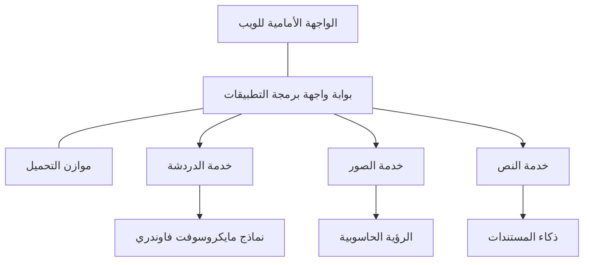

# أفضل ممارسات أحمال العمل الذكية للإنتاج مع AZD

**تنقّل الفصل:**
- **📚 الصفحة الرئيسية للدورة**: [AZD For Beginners](../../README.md)
- **📖 الفصل الحالي**: الفصل 8 - أنماط الإنتاج والمؤسسات
- **⬅️ الفصل السابق**: [Chapter 7: Troubleshooting](../chapter-07-troubleshooting/debugging.md)
- **⬅️ ذو صلة أيضاً**: [AI Workshop Lab](ai-workshop-lab.md)
- **🎯 إتمام الدورة**: [AZD For Beginners](../../README.md)

## نظرة عامة

يوفر هذا الدليل أفضل الممارسات الشاملة لنشر أحمال عمل الذكاء الاصطناعي الجاهزة للإنتاج باستخدام Azure Developer CLI (AZD). بناءً على ملاحظات مجتمع Microsoft Foundry Discord ونشرات العملاء في العالم الحقيقي، تتناول هذه الممارسات أكثر التحديات شيوعًا في أنظمة الذكاء الاصطناعي الإنتاجية.

## التحديات الرئيسية التي يتم معالجتها

استنادًا إلى نتائج استطلاع المجتمع لدينا، هذه هي أبرز التحديات التي يواجهها المطورون:

- **45%** يواجهون صعوبات مع عمليات نشر الذكاء الاصطناعي متعددة الخدمات
- **38%** لديهم مشاكل مع إدارة الاعتمادات والأسرار  
- **35%** يجدون جاهزية الإنتاج والتوسعة صعبة
- **32%** يحتاجون إلى استراتيجيات أفضل لتحسين التكاليف
- **29%** يتطلبون تحسين المراقبة واستكشاف الأخطاء وإصلاحها

## أنماط البنية لتطبيقات الذكاء الاصطناعي الإنتاجية

### النمط 1: بنية ذكاء اصطناعي قائمة على الخدمات المصغرة

**متى يُستخدم**: تطبيقات ذكاء اصطناعي معقدة ذات قدرات متعددة


**تنفيذ AZD**:

```yaml
# azure.yaml
name: enterprise-ai-platform
services:
  web:
    project: ./web
    host: staticwebapp
  api-gateway:
    project: ./api-gateway
    host: containerapp
  chat-service:
    project: ./services/chat
    host: containerapp
  vision-service:
    project: ./services/vision
    host: containerapp
  text-service:
    project: ./services/text
    host: containerapp
```

### النمط 2: المعالجة المدفوعة بالأحداث للذكاء الاصطناعي

**متى يُستخدم**: معالجة دفعات، تحليل مستندات، سير عمل غير متزامن

```bicep
// Event Hub for AI processing pipeline
resource eventHub 'Microsoft.EventHub/namespaces@2023-01-01-preview' = {
  name: eventHubNamespaceName
  location: location
  sku: {
    name: 'Standard'
    tier: 'Standard'
    capacity: 1
  }
}

// Service Bus for reliable message processing
resource serviceBus 'Microsoft.ServiceBus/namespaces@2022-10-01-preview' = {
  name: serviceBusNamespaceName
  location: location
  sku: {
    name: 'Premium'
    tier: 'Premium'
    capacity: 1
  }
}

// Function App for processing
resource functionApp 'Microsoft.Web/sites@2023-01-01' = {
  name: functionAppName
  location: location
  kind: 'functionapp,linux'
  properties: {
    siteConfig: {
      appSettings: [
        {
          name: 'FUNCTIONS_EXTENSION_VERSION'
          value: '~4'
        }
        {
          name: 'AZURE_OPENAI_ENDPOINT'
          value: '@Microsoft.KeyVault(VaultName=${keyVault.name};SecretName=openai-endpoint)'
        }
      ]
    }
  }
}
```

## التفكير في صحة وكيل الذكاء الاصطناعي

عندما يتعطل تطبيق ويب تقليدي، تكون الأعراض مألوفة: صفحة لا تُفتح، واجهة برمجة تطبيقات تعيد خطأ، أو فشل نشر. يمكن لتطبيقات الذكاء الاصطناعي أن تتعطل بنفس الطرق — لكنها أيضًا قد تتصرف بشكل غير صحيح بطرق أكثر دقة لا تُنتج رسائل خطأ واضحة.

يساعدك هذا القسم على بناء نموذج ذهني لمراقبة أحمال عمل الذكاء الاصطناعي حتى تعرف أين تبحث عندما لا تبدو الأمور على ما يرام.

### كيف تختلف صحة الوكيل عن صحة التطبيق التقليدي

التطبيق التقليدي إما يعمل أو لا يعمل. يمكن أن يبدو وكيل الذكاء الاصطناعي وكأنه يعمل لكنه ينتج نتائج ضعيفة. فكر في صحة الوكيل على طبقتين:

| الطبقة | ما الذي تراقبه | أين تبحث |
|-------|--------------|---------------|
| **صحة البنية التحتية** | هل الخدمة تعمل؟ هل الموارد مُوفَّرة؟ هل نقاط النهاية قابلة للوصول؟ | `azd monitor`, Azure Portal resource health, container/app logs |
| **صحة السلوك** | هل يستجيب الوكيل بدقة؟ هل الاستجابات في الوقت المناسب؟ هل يتم استدعاء النموذج بشكل صحيح؟ | Application Insights traces, model call latency metrics, response quality logs |

صحة البنية التحتية مألوفة—إنها نفسها لأي تطبيق azd. صحة السلوك هي الطبقة الجديدة التي تقدمها أحمال عمل الذكاء الاصطناعي.

### أين تبحث عندما لا تتصرف تطبيقات الذكاء الاصطناعي كما هو متوقع

إذا لم ينتج تطبيق الذكاء الاصطناعي النتائج التي تتوقعها، فإليك قائمة تحقق مفهومية:

1. **ابدأ بالأساسيات.** هل التطبيق يعمل؟ هل يمكنه الوصول إلى تبعياته؟ تحقق من `azd monitor` وصحة الموارد كما تفعل مع أي تطبيق.
2. **تحقق من اتصال النموذج.** هل يستدعي تطبيقك النموذج بنجاح؟ حالات فشل أو انتهاء مهلة استدعاءات النموذج هي السبب الأكثر شيوعًا لمشكلات تطبيقات الذكاء الاصطناعي وستظهر في سجلات التطبيق.
3. **انظر إلى ما استلمه النموذج.** تعتمد استجابات الذكاء الاصطناعي على المدخلات (المطالب وأي سياق مسترجَع). إذا كان المخرج خاطئًا، فعادةً ما تكون المدخلات خاطئة. تحقق مما إذا كان تطبيقك يرسل البيانات الصحيحة إلى النموذج.
4. **راجع زمن استجابة الاستجابة.** استدعاءات نماذج الذكاء الاصطناعي أبطأ من استدعاءات واجهات برمجة التطبيقات العادية. إذا كان التطبيق يبدو بطيئًا، فتحقق مما إذا كانت أوقات استجابة النموذج قد زادت — فقد يشير ذلك إلى التقييد، حدود السعة، أو ازدحام على مستوى المنطقة.
5. **راقب إشارات التكلفة.** الارتفاعات غير المتوقعة في استخدام الرموز أو استدعاءات واجهة برمجة التطبيقات يمكن أن تشير إلى حلقة، مُطالبة مُكوّنة بشكل خاطئ، أو إعادة محاولات مفرطة.

لا تحتاج إلى إتقان أدوات المراقبة على الفور. الفكرة الرئيسية هي أن تطبيقات الذكاء الاصطناعي لها طبقة سلوك إضافية للمراقبة، ويمنحك المراقبة المدمجة في azd (`azd monitor`) نقطة بداية للتحقيق في كلا الطبقتين.

---

## أفضل ممارسات الأمان

### 1. نموذج الأمان صفر ثقة

**استراتيجية التنفيذ**:
- لا توجد اتصال خدمة إلى خدمة بدون مصادقة
- جميع استدعاءات واجهات برمجة التطبيقات تستخدم الهويات المُدارة
- عزل الشبكة مع نقاط نهاية خاصة
- ضوابط الوصول بأقل الامتيازات

```bicep
// Managed Identity for each service
resource chatServiceIdentity 'Microsoft.ManagedIdentity/userAssignedIdentities@2023-01-31' = {
  name: 'chat-service-identity'
  location: location
}

// Role assignments with minimal permissions
resource openAIUserRole 'Microsoft.Authorization/roleAssignments@2022-04-01' = {
  scope: openAIAccount
  name: guid(openAIAccount.id, chatServiceIdentity.id, openAIUserRoleDefinitionId)
  properties: {
    roleDefinitionId: subscriptionResourceId('Microsoft.Authorization/roleDefinitions', '5e0bd9bd-7b93-4f28-af87-19fc36ad61bd')
    principalId: chatServiceIdentity.properties.principalId
    principalType: 'ServicePrincipal'
  }
}
```

### 2. إدارة الأسرار الآمنة

**نمط تكامل Key Vault**:

```bicep
// Key Vault with proper access policies
resource keyVault 'Microsoft.KeyVault/vaults@2023-02-01' = {
  name: keyVaultName
  location: location
  properties: {
    tenantId: tenant().tenantId
    sku: {
      family: 'A'
      name: 'premium'  // Use premium for production
    }
    enableRbacAuthorization: true  // Use RBAC instead of access policies
    enablePurgeProtection: true    // Prevent accidental deletion
    enableSoftDelete: true
    softDeleteRetentionInDays: 90
  }
}

// Store all AI service credentials
resource openAIKeySecret 'Microsoft.KeyVault/vaults/secrets@2023-02-01' = {
  parent: keyVault
  name: 'openai-api-key'
  properties: {
    value: openAIAccount.listKeys().key1
    attributes: {
      enabled: true
    }
  }
}
```

### 3. أمان الشبكة

**تهيئة نقاط النهاية الخاصة**:

```bicep
// Virtual Network for AI services
resource virtualNetwork 'Microsoft.Network/virtualNetworks@2023-04-01' = {
  name: vnetName
  location: location
  properties: {
    addressSpace: {
      addressPrefixes: ['10.0.0.0/16']
    }
    subnets: [
      {
        name: 'ai-services-subnet'
        properties: {
          addressPrefix: '10.0.1.0/24'
          privateEndpointNetworkPolicies: 'Disabled'
        }
      }
      {
        name: 'app-services-subnet'
        properties: {
          addressPrefix: '10.0.2.0/24'
          delegations: [
            {
              name: 'Microsoft.Web/serverFarms'
              properties: {
                serviceName: 'Microsoft.Web/serverFarms'
              }
            }
          ]
        }
      }
    ]
  }
}

// Private endpoints for all AI services
resource openAIPrivateEndpoint 'Microsoft.Network/privateEndpoints@2023-04-01' = {
  name: '${openAIAccountName}-pe'
  location: location
  properties: {
    subnet: {
      id: virtualNetwork.properties.subnets[0].id
    }
    privateLinkServiceConnections: [
      {
        name: 'openai-connection'
        properties: {
          privateLinkServiceId: openAIAccount.id
          groupIds: ['account']
        }
      }
    ]
  }
}
```

## الأداء والتوسع

### 1. استراتيجيات التوسع التلقائي

**التحجيم التلقائي لتطبيقات الحاويات**:

```bicep
resource containerApp 'Microsoft.App/containerApps@2023-05-01' = {
  name: containerAppName
  location: location
  properties: {
    configuration: {
      ingress: {
        external: true
        targetPort: 8000
        transport: 'http'
      }
    }
    template: {
      scale: {
        minReplicas: 2  // Always have 2 instances minimum
        maxReplicas: 50 // Scale up to 50 for high load
        rules: [
          {
            name: 'http-scaling'
            http: {
              metadata: {
                concurrentRequests: '20'  // Scale when >20 concurrent requests
              }
            }
          }
          {
            name: 'cpu-scaling'
            custom: {
              type: 'cpu'
              metadata: {
                type: 'Utilization'
                value: '70'  // Scale when CPU >70%
              }
            }
          }
        ]
      }
    }
  }
}
```

### 2. استراتيجيات التخزين المؤقت

**Redis Cache لاستجابات الذكاء الاصطناعي**:

```bicep
// Redis Premium for production workloads
resource redisCache 'Microsoft.Cache/redis@2023-04-01' = {
  name: redisCacheName
  location: location
  properties: {
    sku: {
      name: 'Premium'
      family: 'P'
      capacity: 1
    }
    enableNonSslPort: false
    minimumTlsVersion: '1.2'
    redisConfiguration: {
      'maxmemory-policy': 'allkeys-lru'
    }
    // Enable clustering for high availability
    redisVersion: '6.0'
    shardCount: 2
  }
}

// Cache configuration in application
var cacheConnectionString = '${redisCache.properties.hostName}:6380,password=${redisCache.listKeys().primaryKey},ssl=True,abortConnect=False'
```

### 3. موازنة التحميل وإدارة المرور

**Application Gateway مع WAF**:

```bicep
// Application Gateway with Web Application Firewall
resource applicationGateway 'Microsoft.Network/applicationGateways@2023-04-01' = {
  name: appGatewayName
  location: location
  properties: {
    sku: {
      name: 'WAF_v2'
      tier: 'WAF_v2'
      capacity: 2
    }
    webApplicationFirewallConfiguration: {
      enabled: true
      firewallMode: 'Prevention'
      ruleSetType: 'OWASP'
      ruleSetVersion: '3.2'
    }
    // Backend pools for AI services
    backendAddressPools: [
      {
        name: 'ai-services-pool'
        properties: {
          backendAddresses: [
            {
              fqdn: '${containerApp.properties.configuration.ingress.fqdn}'
            }
          ]
        }
      }
    ]
  }
}
```

## 💰 تحسين التكاليف

### 1. ملاءمة الموارد للحجم الصحيح

**تكوينات خاصة بالبيئة**:

```bash
# بيئة التطوير
azd env new development
azd env set AZURE_OPENAI_SKU "S0"
azd env set AZURE_OPENAI_CAPACITY 10
azd env set AZURE_SEARCH_SKU "basic"
azd env set CONTAINER_CPU 0.5
azd env set CONTAINER_MEMORY 1.0

# بيئة الإنتاج
azd env new production
azd env set AZURE_OPENAI_SKU "S0"
azd env set AZURE_OPENAI_CAPACITY 100
azd env set AZURE_SEARCH_SKU "standard"
azd env set CONTAINER_CPU 2.0
azd env set CONTAINER_MEMORY 4.0
```

### 2. مراقبة التكاليف والميزانيات

```bicep
// Cost management and budgets
resource budget 'Microsoft.Consumption/budgets@2023-05-01' = {
  name: 'ai-workload-budget'
  properties: {
    timePeriod: {
      startDate: '2024-01-01'
      endDate: '2024-12-31'
    }
    timeGrain: 'Monthly'
    amount: 2000  // $2000 monthly budget
    category: 'Cost'
    notifications: {
      warning: {
        enabled: true
        operator: 'GreaterThan'
        threshold: 80
        contactEmails: [
          'finance@company.com'
          'engineering@company.com'
        ]
        contactRoles: [
          'Owner'
          'Contributor'
        ]
      }
      critical: {
        enabled: true
        operator: 'GreaterThan'
        threshold: 95
        contactEmails: [
          'cto@company.com'
        ]
      }
    }
  }
}
```

### 3. تحسين استخدام الرموز (Tokens)

**إدارة تكلفة OpenAI**:

```typescript
// تحسين التوكنات على مستوى التطبيق
class TokenOptimizer {
  private readonly maxTokens = 4000;
  private readonly reserveTokens = 500;
  
  optimizePrompt(userInput: string, context: string): string {
    const availableTokens = this.maxTokens - this.reserveTokens;
    const estimatedTokens = this.estimateTokens(userInput + context);
    
    if (estimatedTokens > availableTokens) {
      // اقطع السياق، وليس مدخلات المستخدم
      context = this.truncateContext(context, availableTokens - this.estimateTokens(userInput));
    }
    
    return `${context}\n\nUser: ${userInput}`;
  }
  
  private estimateTokens(text: string): number {
    // تقدير تقريبي: توكن واحد ≈ 4 أحرف
    return Math.ceil(text.length / 4);
  }
}
```

## المراقبة والقابلية للرصد

### 1. Application Insights الشامل

```bicep
// Application Insights with advanced features
resource applicationInsights 'Microsoft.Insights/components@2020-02-02' = {
  name: applicationInsightsName
  location: location
  kind: 'web'
  properties: {
    Application_Type: 'web'
    WorkspaceResourceId: logAnalyticsWorkspace.id
    SamplingPercentage: 100  // Full sampling for AI apps
    DisableIpMasking: false  // Enable for security
  }
}

// Custom metrics for AI operations
resource aiMetricAlerts 'Microsoft.Insights/metricAlerts@2018-03-01' = {
  name: 'ai-high-error-rate'
  location: 'global'
  properties: {
    description: 'Alert when AI service error rate is high'
    severity: 2
    enabled: true
    scopes: [
      applicationInsights.id
    ]
    evaluationFrequency: 'PT1M'
    windowSize: 'PT5M'
    criteria: {
      'odata.type': 'Microsoft.Azure.Monitor.SingleResourceMultipleMetricCriteria'
      allOf: [
        {
          name: 'high-error-rate'
          metricName: 'requests/failed'
          operator: 'GreaterThan'
          threshold: 10
          timeAggregation: 'Count'
        }
      ]
    }
  }
}
```

### 2. مراقبة مخصصة للذكاء الاصطناعي

**لوحات معلومات مخصصة لمقاييس الذكاء الاصطناعي**:

```json
// Dashboard configuration for AI workloads
{
  "dashboard": {
    "name": "AI Application Monitoring",
    "tiles": [
      {
        "name": "OpenAI Request Volume",
        "query": "requests | where name contains 'openai' | summarize count() by bin(timestamp, 5m)"
      },
      {
        "name": "AI Response Latency",
        "query": "requests | where name contains 'openai' | summarize avg(duration) by bin(timestamp, 5m)"
      },
      {
        "name": "Token Usage",
        "query": "customMetrics | where name == 'openai_tokens_used' | summarize sum(value) by bin(timestamp, 1h)"
      },
      {
        "name": "Cost per Hour",
        "query": "customMetrics | where name == 'openai_cost' | summarize sum(value) by bin(timestamp, 1h)"
      }
    ]
  }
}
```

### 3. فحوصات الصحة ومراقبة الجهوزية

```bicep
// Application Insights availability tests
resource availabilityTest 'Microsoft.Insights/webtests@2022-06-15' = {
  name: 'ai-app-availability-test'
  location: location
  tags: {
    'hidden-link:${applicationInsights.id}': 'Resource'
  }
  properties: {
    SyntheticMonitorId: 'ai-app-availability-test'
    Name: 'AI Application Availability Test'
    Description: 'Tests AI application endpoints'
    Enabled: true
    Frequency: 300  // 5 minutes
    Timeout: 120    // 2 minutes
    Kind: 'ping'
    Locations: [
      {
        Id: 'us-east-2-azr'
      }
      {
        Id: 'us-west-2-azr'
      }
    ]
    Configuration: {
      WebTest: '''
        <WebTest Name="AI Health Check" 
                 Id="8d2de8d2-a2b0-4c2e-9a0d-8f9c9a0b8c8d" 
                 Enabled="True" 
                 CssProjectStructure="" 
                 CssIteration="" 
                 Timeout="120" 
                 WorkItemIds="" 
                 xmlns="http://microsoft.com/schemas/VisualStudio/TeamTest/2010" 
                 Description="" 
                 CredentialUserName="" 
                 CredentialPassword="" 
                 PreAuthenticate="True" 
                 Proxy="default" 
                 StopOnError="False" 
                 RecordedResultFile="" 
                 ResultsLocale="">
          <Items>
            <Request Method="GET" 
                     Guid="a5f10126-e4cd-570d-961c-cea43999a200" 
                     Version="1.1" 
                     Url="${webApp.properties.defaultHostName}/health" 
                     ThinkTime="0" 
                     Timeout="120" 
                     ParseDependentRequests="True" 
                     FollowRedirects="True" 
                     RecordResult="True" 
                     Cache="False" 
                     ResponseTimeGoal="0" 
                     Encoding="utf-8" 
                     ExpectedHttpStatusCode="200" 
                     ExpectedResponseUrl="" 
                     ReportingName="" 
                     IgnoreHttpStatusCode="False" />
          </Items>
        </WebTest>
      '''
    }
  }
}
```

## استعادة الكوارث والتوافر العالي

### 1. النشر متعدد المناطق

```yaml
# azure.yaml - Multi-region configuration
name: ai-app-multiregion
services:
  api-primary:
    project: ./api
    host: containerapp
    env:
      - AZURE_REGION=eastus
  api-secondary:
    project: ./api
    host: containerapp
    env:
      - AZURE_REGION=westus2
```

```bicep
// Traffic Manager for global load balancing
resource trafficManager 'Microsoft.Network/trafficManagerProfiles@2022-04-01' = {
  name: trafficManagerProfileName
  location: 'global'
  properties: {
    profileStatus: 'Enabled'
    trafficRoutingMethod: 'Priority'
    dnsConfig: {
      relativeName: trafficManagerProfileName
      ttl: 30
    }
    monitorConfig: {
      protocol: 'HTTPS'
      port: 443
      path: '/health'
      intervalInSeconds: 30
      toleratedNumberOfFailures: 3
      timeoutInSeconds: 10
    }
    endpoints: [
      {
        name: 'primary-endpoint'
        type: 'Microsoft.Network/trafficManagerProfiles/azureEndpoints'
        properties: {
          targetResourceId: primaryAppService.id
          endpointStatus: 'Enabled'
          priority: 1
        }
      }
      {
        name: 'secondary-endpoint'
        type: 'Microsoft.Network/trafficManagerProfiles/azureEndpoints'
        properties: {
          targetResourceId: secondaryAppService.id
          endpointStatus: 'Enabled'
          priority: 2
        }
      }
    ]
  }
}
```

### 2. النسخ الاحتياطي للبيانات واستعادتها

```bicep
// Backup configuration for critical data
resource backupVault 'Microsoft.DataProtection/backupVaults@2023-05-01' = {
  name: backupVaultName
  location: location
  identity: {
    type: 'SystemAssigned'
  }
  properties: {
    storageSettings: [
      {
        datastoreType: 'VaultStore'
        type: 'LocallyRedundant'
      }
    ]
  }
}

// Backup policy for AI models and data
resource backupPolicy 'Microsoft.DataProtection/backupVaults/backupPolicies@2023-05-01' = {
  parent: backupVault
  name: 'ai-data-backup-policy'
  properties: {
    policyRules: [
      {
        backupParameters: {
          backupType: 'Full'
          objectType: 'AzureBackupParams'
        }
        trigger: {
          schedule: {
            repeatingTimeIntervals: [
              'R/2024-01-01T02:00:00+00:00/P1D'  // Daily at 2 AM
            ]
          }
          objectType: 'ScheduleBasedTriggerContext'
        }
        dataStore: {
          datastoreType: 'VaultStore'
          objectType: 'DataStoreInfoBase'
        }
        name: 'BackupDaily'
        objectType: 'AzureBackupRule'
      }
    ]
  }
}
```

## التكامل مع DevOps و CI/CD

### 1. سير عمل GitHub Actions

```yaml
# .github/workflows/deploy-ai-app.yml
name: Deploy AI Application

on:
  push:
    branches: [main]
  pull_request:
    branches: [main]

jobs:
  test:
    runs-on: ubuntu-latest
    steps:
      - uses: actions/checkout@v4
      
      - name: Setup Python
        uses: actions/setup-python@v4
        with:
          python-version: '3.11'
          
      - name: Install dependencies
        run: |
          pip install -r requirements.txt
          pip install pytest
          
      - name: Run tests
        run: pytest tests/
        
      - name: AI Safety Tests
        run: |
          python scripts/test_ai_safety.py
          python scripts/validate_prompts.py

  deploy-staging:
    needs: test
    if: github.event_name == 'pull_request'
    runs-on: ubuntu-latest
    steps:
      - uses: actions/checkout@v4
      
      - name: Setup AZD
        uses: Azure/setup-azd@v1.0.0
        
      - name: Login to Azure
        uses: azure/login@v1
        with:
          creds: ${{ secrets.AZURE_CREDENTIALS }}
          
      - name: Deploy to Staging
        run: |
          azd env select staging
          azd deploy

  deploy-production:
    needs: test
    if: github.ref == 'refs/heads/main'
    runs-on: ubuntu-latest
    steps:
      - uses: actions/checkout@v4
      
      - name: Setup AZD
        uses: Azure/setup-azd@v1.0.0
        
      - name: Login to Azure
        uses: azure/login@v1
        with:
          creds: ${{ secrets.AZURE_CREDENTIALS }}
          
      - name: Deploy to Production
        run: |
          azd env select production
          azd deploy
          
      - name: Run Production Health Checks
        run: |
          python scripts/health_check.py --env production
```

### 2. التحقق من البنية التحتية

```bash
# scripts/validate_infrastructure.sh
#!/bin/bash

echo "Validating AI infrastructure deployment..."

# تحقق مما إذا كانت جميع الخدمات المطلوبة قيد التشغيل
services=("openai" "search" "storage" "keyvault")
for service in "${services[@]}"; do
    echo "Checking $service..."
    if ! az resource list --resource-type "Microsoft.CognitiveServices/accounts" --query "[?contains(name, '$service')]" -o tsv; then
        echo "ERROR: $service not found"
        exit 1
    fi
done

# التحقق من نشر نماذج OpenAI
echo "Validating OpenAI model deployments..."
models=$(az cognitiveservices account deployment list --name $AZURE_OPENAI_NAME --resource-group $AZURE_RESOURCE_GROUP --query "[].name" -o tsv)
if [[ ! $models == *"gpt-35-turbo"* ]]; then
    echo "ERROR: Required model gpt-35-turbo not deployed"
    exit 1
fi

# اختبار اتصال خدمة الذكاء الاصطناعي
echo "Testing AI service connectivity..."
python scripts/test_connectivity.py

echo "Infrastructure validation completed successfully!"
```

## قائمة التحقق لجاهزية الإنتاج

### الأمان ✅
- [ ] جميع الخدمات تستخدم هويات مُدارة
- [ ] الأسرار مخزنة في Key Vault
- [ ] تكوين نقاط نهاية خاصة
- [ ] تنفيذ مجموعات أمان الشبكة
- [ ] RBAC بأقل الامتيازات
- [ ] تمكين WAF على نقاط النهاية العامة

### الأداء ✅
- [ ] تم تكوين التحجيم التلقائي
- [ ] تم تنفيذ التخزين المؤقت
- [ ] إعداد موازنة التحميل
- [ ] CDN للمحتوى الثابت
- [ ] تجميع اتصالات قاعدة البيانات
- [ ] تحسين استخدام الرموز

### المراقبة ✅
- [ ] تم تكوين Application Insights
- [ ] تعريف المقاييس المخصصة
- [ ] إعداد قواعد التنبيه
- [ ] إنشاء لوحة معلومات
- [ ] تنفيذ فحوصات الصحة
- [ ] سياسات الاحتفاظ بالسجلات

### الاعتمادية ✅
- [ ] نشر متعدد المناطق
- [ ] خطة النسخ الاحتياطي والاستعادة
- [ ] تنفيذ قواطع الدائرة
- [ ] تكوين سياسات إعادة المحاولة
- [ ] التدهور الرشيق
- [ ] نقاط نهاية فحوصات الصحة

### إدارة التكلفة ✅
- [ ] إعداد تنبيهات الميزانية
- [ ] ملاءمة الموارد للحجم الصحيح
- [ ] تطبيق خصومات التطوير/الاختبار
- [ ] شراء حالات محجوزة
- [ ] لوحة مراقبة التكاليف
- [ ] مراجعات منتظمة للتكاليف

### الامتثال ✅
- [ ] تلبية متطلبات محل إقامة البيانات
- [ ] تمكين تسجيل التدقيق
- [ ] تطبيق سياسات الامتثال
- [ ] تنفيذ خطوط أساس أمان
- [ ] تقييمات أمان منتظمة
- [ ] خطة استجابة للحوادث

## معايير الأداء

### المقاييس النموذجية للإنتاج

| المقياس | الهدف | المراقبة |
|--------|--------|------------|
| **زمن الاستجابة** | < 2 ثانية | Application Insights |
| **التوافر** | 99.9% | مراقبة الجهوزية |
| **معدل الأخطاء** | < 0.1% | سجلات التطبيق |
| **استخدام الرموز** | < $500/month | إدارة التكاليف |
| **المستخدمون المتزامنون** | 1000+ | اختبار التحميل |
| **زمن الاسترداد** | < 1 ساعة | اختبارات استعادة الكوارث |

### اختبار التحميل

```bash
# سكريبت اختبار التحميل لتطبيقات الذكاء الاصطناعي
python scripts/load_test.py \
  --endpoint https://your-ai-app.azurewebsites.net \
  --concurrent-users 100 \
  --duration 300 \
  --ramp-up 60
```

## 🤝 أفضل ممارسات المجتمع

استنادًا إلى ملاحظات مجتمع Microsoft Foundry Discord:

### أبرز التوصيات من المجتمع:

1. **ابدأ صغيرًا، وتوسع تدريجيًا**: ابدأ بمواصفات SKUs الأساسية وتوسع بناءً على الاستخدام الفعلي
2. **راقب كل شيء**: أعد إعداد مراقبة شاملة من اليوم الأول
3. **أتمتة الأمان**: استخدم البنية التحتية ككود لضمان أمان متسق
4. **اختبر بدقة**: ضمّن اختبارات خاصة بالذكاء الاصطناعي في خط التجميع الخاص بك
5. **خطط للتكاليف**: راقب استخدام الرموز واضبط تنبيهات الميزانية مبكرًا

### الأخطاء الشائعة التي يجب تجنبها:

- ❌ تضمين مفاتيح واجهة برمجة التطبيقات في الكود
- ❌ عدم إعداد المراقبة المناسبة
- ❌ تجاهل تحسين التكلفة
- ❌ عدم اختبار سيناريوهات الفشل
- ❌ النشر بدون فحوصات صحة

## أوامر AZD AI والملحقات

يتضمن AZD مجموعة متنامية من الأوامر والملحقات المخصصة للذكاء الاصطناعي التي تُبسّط أحمال عمل الذكاء الاصطناعي الإنتاجية. هذه الأدوات تجسر الفجوة بين التطوير المحلي ونشر الإنتاج لأحمال عمل الذكاء الاصطناعي.

### ملحقات AZD للذكاء الاصطناعي

يستخدم AZD نظام ملحقات لإضافة قدرات مخصصة للذكاء الاصطناعي. قم بتثبيت وإدارة الملحقات باستخدام:

```bash
# سرد جميع الامتدادات المتاحة (بما في ذلك الذكاء الاصطناعي)
azd extension list

# تثبيت امتداد وكلاء Foundry
azd extension install azure.ai.agents

# تثبيت امتداد الضبط الدقيق
azd extension install azure.ai.finetune

# تثبيت امتداد النماذج المخصصة
azd extension install azure.ai.models

# ترقية جميع الامتدادات المثبتة
azd extension upgrade --all
```

**الملحقات المتاحة للذكاء الاصطناعي:**

| الملحق | الغرض | الحالة |
|-----------|---------|--------|
| `azure.ai.agents` | إدارة Foundry Agent Service | Preview |
| `azure.ai.finetune` | ضبط نماذج Foundry | Preview |
| `azure.ai.models` | نماذج مخصصة في Foundry | Preview |
| `azure.coding-agent` | تكوين وكيل التكويد | Available |

### تهيئة مشاريع الوكلاء باستخدام `azd ai agent init`

الأمر `azd ai agent init` يُهيكل مشروع وكيل ذكاء اصطناعي جاهز للإنتاج ومتكامل مع Microsoft Foundry Agent Service:

```bash
# تهيئة مشروع وكيل جديد من ملف تعريف الوكيل
azd ai agent init -m <manifest-path-or-uri>

# تهيئة واستهداف مشروع Foundry محدد
azd ai agent init -m agent-manifest.yaml --project-id <foundry-project-id>

# تهيئة باستخدام دليل مصدر مخصص
azd ai agent init -m agent-manifest.yaml --src ./agents/my-agent

# استهداف تطبيقات الحاويات كمضيف
azd ai agent init -m agent-manifest.yaml --host containerapp
```

**العلامات الرئيسية:**

| العلامة | الوصف |
|------|-------------|
| `-m, --manifest` | Path or URI to an agent manifest to add to your project |
| `-p, --project-id` | Existing Microsoft Foundry Project ID for your azd environment |
| `-s, --src` | Directory to download the agent definition (defaults to `src/<agent-id>`) |
| `--host` | Override the default host (e.g., `containerapp`) |
| `-e, --environment` | The azd environment to use |

**نصيحة للإنتاج**: استخدم `--project-id` للاتصال مباشرة بمشروع Foundry موجود، مما يبقي كود الوكيل وموارد السحابة مرتبطة من البداية.

### بروتوكول سياق النموذج (MCP) مع `azd mcp`

يتضمن AZD دعم خادم MCP مدمجًا (ألفا)، مما يمكّن وكلاء وأدوات الذكاء الاصطناعي من التفاعل مع موارد Azure الخاصة بمشروعك من خلال بروتوكول موحد:

```bash
# ابدأ خادم MCP لمشروعك
azd mcp start

# إدارة موافقات الأدوات لعمليات MCP
azd mcp consent
```

يعرّض خادم MCP سياق مشروع azd الخاص بك—البيئات، الخدمات، وموارد Azure—لأدوات التطوير المدعومة بالذكاء الاصطناعي. وهذا يمكّن من:

- **نشر بمساعدة الذكاء الاصطناعي**: دع وكلاء التكويد يستعلمون حالة مشروعك ويشغّلون النشرات
- **اكتشاف الموارد**: يمكن لأدوات الذكاء الاصطناعي اكتشاف موارد Azure التي يستخدمها مشروعك
- **إدارة البيئات**: يمكن للوكلاء التبديل بين بيئات التطوير/الاختبار/الإنتاج

### توليد البنية التحتية باستخدام `azd infra generate`

لأحمال عمل الذكاء الاصطناعي الإنتاجية، يمكنك توليد وتخصيص البنية التحتية ككود بدلاً من الاعتماد على التوفير التلقائي:

```bash
# توليد ملفات Bicep/Terraform من تعريف المشروع الخاص بك
azd infra generate
```

This writes IaC to disk so you can:
- Review and audit infrastructure before deploying
- Add custom security policies (network rules, private endpoints)
- Integrate with existing IaC review processes
- Version control infrastructure changes separately from application code

### هوكات دورة حياة الإنتاج

تتيح لك هوكات AZD إدراج منطق مخصص في كل مرحلة من مراحل دورة حياة النشر—وهي مهمة لأحمال عمل الذكاء الاصطناعي الإنتاجية:

```yaml
# azure.yaml - Production hooks example
name: ai-production-app
hooks:
  preprovision:
    shell: sh
    run: scripts/validate-quotas.sh    # Check AI model quota before provisioning
  postprovision:
    shell: sh
    run: scripts/configure-networking.sh  # Set up private endpoints
  predeploy:
    shell: sh
    run: scripts/run-ai-safety-tests.sh  # Run prompt safety checks
  postdeploy:
    shell: sh
    run: scripts/smoke-test.sh           # Verify agent responses post-deploy
services:
  agent-api:
    project: ./src/agent
    host: containerapp
    hooks:
      predeploy:
        shell: sh
        run: scripts/validate-model-access.sh  # Per-service hook
```

```bash
# تشغيل هوك محدد يدويًا أثناء التطوير
azd hooks run predeploy
```

**هوكات الإنتاج الموصى بها لأحمال عمل الذكاء الاصطناعي:**

| الهوك | حالة الاستخدام |
|------|----------|
| `preprovision` | التحقق من حصص الاشتراك لسعة نموذج الذكاء الاصطناعي |
| `postprovision` | تكوين نقاط النهاية الخاصة، نشر أوزان النماذج |
| `predeploy` | تشغيل اختبارات سلامة الذكاء الاصطناعي، التحقق من قوالب المطالب |
| `postdeploy` | اختبار دخان لاستجابات الوكيل، التحقق من اتصال النموذج |

### تكوين خط أنابيب CI/CD

استخدم `azd pipeline config` لربط مشروعك بـ GitHub Actions أو Azure Pipelines مع مصادقة Azure الآمنة:

```bash
# تكوين خط أنابيب CI/CD (تفاعلي)
azd pipeline config

# التكوين مع مزود محدد
azd pipeline config --provider github
```

هذا الأمر:
- ينشئ خدمة رئيسية (service principal) بأقل صلاحيات
- يكوّن بيانات اعتماد موحدة (بدون أسرار مخزنة)
- ينشئ أو يحدث ملف تعريف خط الأنابيب الخاص بك
- يضبط متغيرات البيئة المطلوبة في نظام CI/CD الخاص بك

**سير العمل الإنتاجي مع تكوين خط الأنابيب**:

```bash
# 1. إعداد بيئة الإنتاج
azd env new production
azd env set AZURE_OPENAI_CAPACITY 100

# 2. تكوين خط الأنابيب
azd pipeline config --provider github

# 3. يقوم خط الأنابيب بتشغيل azd deploy عند كل دفع إلى main
```

### إضافة مكونات باستخدام `azd add`

أضف خدمات Azure تدريجيًا إلى مشروع موجود:

```bash
# أضف مكوّن خدمة جديد تفاعليًا
azd add
```

هذا مفيد بشكل خاص لتوسيع تطبيقات الذكاء الاصطناعي الإنتاجية—على سبيل المثال، إضافة خدمة بحث شعاعي، نقطة نهاية وكيل جديدة، أو مكوّن مراقبة إلى نشر قائم.

## موارد إضافية
- **إطار Azure المصمم جيدًا**: [إرشادات أحمال عمل الذكاء الاصطناعي](https://learn.microsoft.com/azure/well-architected/ai/)
- **توثيق Microsoft Foundry**: [الوثائق الرسمية](https://learn.microsoft.com/azure/ai-studio/)
- **قوالب المجتمع**: [Azure Samples](https://github.com/Azure-Samples)
- **مجتمع Discord**: [قناة #Azure](https://discord.gg/microsoft-azure)
- **مهارات الوكلاء لـ Azure**: [microsoft/github-copilot-for-azure on skills.sh](https://skills.sh/microsoft/github-copilot-for-azure) - 37 مهارات وكلاء مفتوحة لـ Azure AI, Foundry, النشر, تحسين التكلفة، والتشخيص. قم بتثبيتها في محرّر الشيفرة لديك:
  ```bash
  npx skills add microsoft/github-copilot-for-azure
  ```

---

**التنقّل بين الفصول:**
- **📚 الصفحة الرئيسية للدورة**: [AZD For Beginners](../../README.md)
- **📖 الفصل الحالي**: الفصل 8 - أنماط الإنتاج والمؤسسات
- **⬅️ الفصل السابق**: [Chapter 7: Troubleshooting](../chapter-07-troubleshooting/debugging.md)
- **⬅️ مرتبط أيضًا**: [AI Workshop Lab](ai-workshop-lab.md)
- **� المقرر اكتمل**: [AZD For Beginners](../../README.md)

**تذكّر**: تتطلب أحمال عمل الذكاء الاصطناعي في بيئات الإنتاج تخطيطًا دقيقًا ومراقبةً وتحسينًا مستمرًا. ابدأ بهذه الأنماط وكيّفها وفق متطلباتك الخاصة.

---

<!-- CO-OP TRANSLATOR DISCLAIMER START -->
إخلاء المسؤولية:
تمت ترجمة هذا المستند باستخدام خدمة الترجمة الآلية Co-op Translator (https://github.com/Azure/co-op-translator). بينما نسعى إلى الدقة، يرجى العلم أن الترجمات الآلية قد تحتوي على أخطاء أو عدم دقة. يجب اعتبار المستند الأصلي بلغته الأصلية المصدر المعتمد. للحصول على معلومات حرجة، يُنصح بالاستعانة بترجمة بشرية محترفة. لسنا مسؤولين عن أي سوء فهم أو تفسير ناتج عن استخدام هذه الترجمة.
<!-- CO-OP TRANSLATOR DISCLAIMER END -->