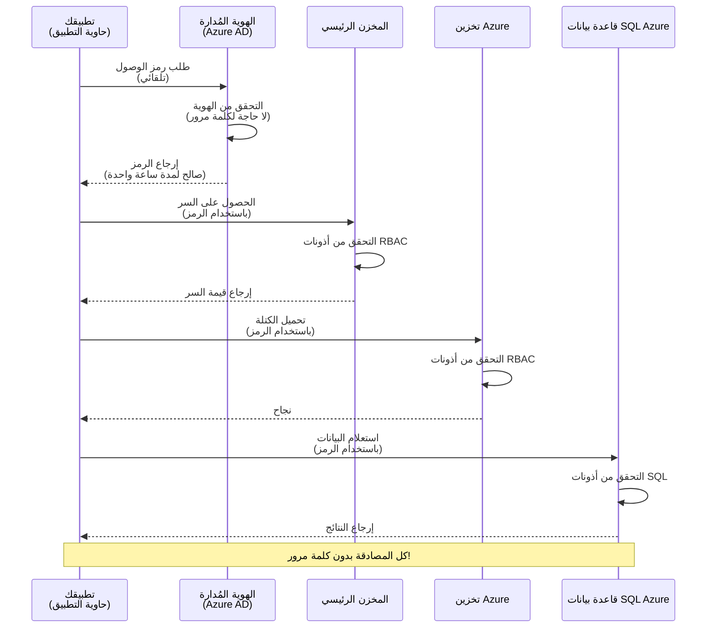
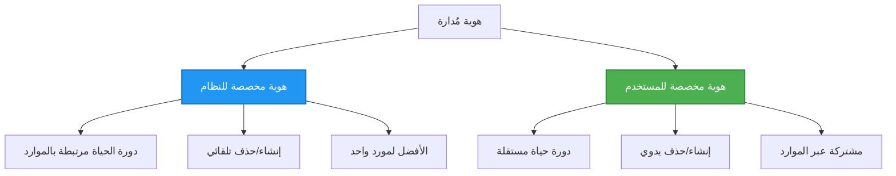

<!--
CO_OP_TRANSLATOR_METADATA:
{
  "original_hash": "e13ff6e1197e0a7462ed0aede7df9f23",
  "translation_date": "2025-11-20T11:12:19+00:00",
  "source_file": "docs/getting-started/authsecurity.md",
  "language_code": "ar"
}
-->
# أنماط المصادقة والهوية المُدارة

⏱️ **الوقت المقدر**: 45-60 دقيقة | 💰 **التكلفة**: مجاني (بدون رسوم إضافية) | ⭐ **التعقيد**: متوسط

**📚 مسار التعلم:**
- ← السابق: [إدارة التكوين](configuration.md) - إدارة متغيرات البيئة والأسرار
- 🎯 **أنت هنا**: المصادقة والأمان (الهوية المُدارة، Key Vault، الأنماط الآمنة)
- → التالي: [المشروع الأول](first-project.md) - بناء أول تطبيق AZD
- 🏠 [الصفحة الرئيسية للدورة](../../README.md)

---

## ما ستتعلمه

عند إكمال هذا الدرس، ستتمكن من:
- فهم أنماط المصادقة في Azure (المفاتيح، سلاسل الاتصال، الهوية المُدارة)
- تنفيذ **الهوية المُدارة** للمصادقة بدون كلمات مرور
- تأمين الأسرار باستخدام تكامل **Azure Key Vault**
- تكوين **التحكم في الوصول القائم على الأدوار (RBAC)** لنشرات AZD
- تطبيق أفضل ممارسات الأمان في تطبيقات الحاويات وخدمات Azure
- الانتقال من المصادقة القائمة على المفاتيح إلى المصادقة القائمة على الهوية

## لماذا الهوية المُدارة مهمة

### المشكلة: المصادقة التقليدية

**قبل الهوية المُدارة:**
```javascript
// ❌ خطر أمني: أسرار مكتوبة بشكل ثابت في الكود
const connectionString = "Server=mydb.database.windows.net;User=admin;Password=P@ssw0rd123";
const storageKey = "xK7mN9pQ2wR5tY8uI0oP3aS6dF1gH4jK...";
const cosmosKey = "C2x7B9n4M1p8Q5w3E6r0T2y5U8i1O4p7...";
```

**المشاكل:**
- 🔴 **أسرار مكشوفة** في الكود، ملفات التكوين، متغيرات البيئة
- 🔴 **تدوير بيانات الاعتماد** يتطلب تغييرات في الكود وإعادة النشر
- 🔴 **كابوس التدقيق** - من قام بالوصول إلى ماذا ومتى؟
- 🔴 **التشتت** - الأسرار موزعة عبر أنظمة متعددة
- 🔴 **مخاطر الامتثال** - تفشل في اجتياز تدقيق الأمان

### الحل: الهوية المُدارة

**بعد الهوية المُدارة:**
```javascript
// ✅ آمن: لا توجد أسرار في الكود
const credential = new DefaultAzureCredential();
const client = new BlobServiceClient(
  "https://mystorageaccount.blob.core.windows.net",
  credential  // تقوم Azure بمعالجة المصادقة تلقائيًا
);
```

**الفوائد:**
- ✅ **بدون أسرار** في الكود أو التكوين
- ✅ **تدوير تلقائي** - Azure يتولى الأمر
- ✅ **سجل تدقيق كامل** في سجلات Azure AD
- ✅ **أمان مركزي** - يتم إدارته في بوابة Azure
- ✅ **جاهز للامتثال** - يفي بمعايير الأمان

**تشبيه**: المصادقة التقليدية تشبه حمل مفاتيح مادية متعددة لأبواب مختلفة. الهوية المُدارة تشبه الحصول على بطاقة أمان تمنحك الوصول تلقائيًا بناءً على هويتك - بدون مفاتيح لتفقدها أو نسخها أو تدويرها.

---

## نظرة عامة على البنية

### تدفق المصادقة باستخدام الهوية المُدارة


### أنواع الهويات المُدارة


| الميزة | مُعينة للنظام | مُعينة للمستخدم |
|---------|----------------|---------------|
| **دورة الحياة** | مرتبطة بالموارد | مستقلة |
| **الإنشاء** | تلقائي مع المورد | إنشاء يدوي |
| **الحذف** | يتم حذفه مع المورد | يستمر بعد حذف المورد |
| **المشاركة** | مورد واحد فقط | موارد متعددة |
| **حالة الاستخدام** | سيناريوهات بسيطة | سيناريوهات معقدة متعددة الموارد |
| **الإعداد الافتراضي لـ AZD** | ✅ موصى به | اختياري |

---

## المتطلبات الأساسية

### الأدوات المطلوبة

يجب أن تكون قد قمت بتثبيتها من الدروس السابقة:

```bash
# تحقق من Azure Developer CLI
azd version
# ✅ المتوقع: azd الإصدار 1.0.0 أو أعلى

# تحقق من Azure CLI
az --version
# ✅ المتوقع: azure-cli الإصدار 2.50.0 أو أعلى
```

### متطلبات Azure

- اشتراك Azure نشط
- أذونات لـ:
  - إنشاء هويات مُدارة
  - تعيين أدوار RBAC
  - إنشاء موارد Key Vault
  - نشر تطبيقات الحاويات

### المعرفة المطلوبة

يجب أن تكون قد أكملت:
- [دليل التثبيت](installation.md) - إعداد AZD
- [أساسيات AZD](azd-basics.md) - المفاهيم الأساسية
- [إدارة التكوين](configuration.md) - متغيرات البيئة

---

## الدرس 1: فهم أنماط المصادقة

### النمط 1: سلاسل الاتصال (قديم - تجنب)

**كيف يعمل:**
```bash
# سلسلة الاتصال تحتوي على بيانات اعتماد
STORAGE_CONNECTION_STRING="DefaultEndpointsProtocol=https;AccountName=myaccount;AccountKey=xK7mN9pQ2wR5..."
COSMOS_CONNECTION_STRING="AccountEndpoint=https://myaccount.documents.azure.com:443/;AccountKey=C2x7..."
SQL_CONNECTION_STRING="Server=myserver.database.windows.net;User=admin;Password=P@ssw0rd..."
```

**المشاكل:**
- ❌ الأسرار مرئية في متغيرات البيئة
- ❌ يتم تسجيلها في أنظمة النشر
- ❌ صعوبة في التدوير
- ❌ لا يوجد سجل تدقيق للوصول

**متى يُستخدم:** فقط للتطوير المحلي، أبدًا للإنتاج.

---

### النمط 2: مراجع Key Vault (أفضل)

**كيف يعمل:**
```bicep
// Store secret in Key Vault
resource keyVault 'Microsoft.KeyVault/vaults@2023-02-01' = {
  name: 'mykv'
  properties: {
    enableRbacAuthorization: true
  }
}

// Reference in Container App
env: [
  {
    name: 'STORAGE_KEY'
    secretRef: 'storage-key'  // References Key Vault
  }
]
```

**الفوائد:**
- ✅ يتم تخزين الأسرار بأمان في Key Vault
- ✅ إدارة مركزية للأسرار
- ✅ التدوير بدون تغييرات في الكود

**القيود:**
- ⚠️ لا يزال يستخدم المفاتيح/كلمات المرور
- ⚠️ الحاجة إلى إدارة الوصول إلى Key Vault

**متى يُستخدم:** خطوة انتقالية من سلاسل الاتصال إلى الهوية المُدارة.

---

### النمط 3: الهوية المُدارة (أفضل ممارسة)

**كيف يعمل:**
```bicep
// Enable managed identity
resource containerApp 'Microsoft.App/containerApps@2023-05-01' = {
  name: 'myapp'
  identity: {
    type: 'SystemAssigned'  // Automatically creates identity
  }
}

// Grant permissions
resource roleAssignment 'Microsoft.Authorization/roleAssignments@2022-04-01' = {
  scope: storageAccount
  properties: {
    roleDefinitionId: storageBlobDataContributorRole
    principalId: containerApp.identity.principalId
  }
}
```

**كود التطبيق:**
```javascript
// لا حاجة للأسرار!
const { DefaultAzureCredential } = require('@azure/identity');
const { BlobServiceClient } = require('@azure/storage-blob');

const credential = new DefaultAzureCredential();
const blobServiceClient = new BlobServiceClient(
  'https://mystorageaccount.blob.core.windows.net',
  credential
);
```

**الفوائد:**
- ✅ بدون أسرار في الكود/التكوين
- ✅ تدوير بيانات الاعتماد تلقائيًا
- ✅ سجل تدقيق كامل
- ✅ أذونات قائمة على RBAC
- ✅ جاهز للامتثال

**متى يُستخدم:** دائمًا، للتطبيقات الإنتاجية.

---

## الدرس 2: تنفيذ الهوية المُدارة باستخدام AZD

### التنفيذ خطوة بخطوة

لنقم ببناء تطبيق حاوية آمن يستخدم الهوية المُدارة للوصول إلى Azure Storage وKey Vault.

### هيكل المشروع

```
secure-app/
├── azure.yaml                 # AZD configuration
├── infra/
│   ├── main.bicep            # Main infrastructure
│   ├── core/
│   │   ├── identity.bicep    # Managed identity setup
│   │   ├── keyvault.bicep    # Key Vault configuration
│   │   └── storage.bicep     # Storage with RBAC
│   └── app/
│       └── container-app.bicep
└── src/
    ├── app.js                # Application code
    ├── package.json
    └── Dockerfile
```

### 1. تكوين AZD (azure.yaml)

```yaml
name: secure-app
metadata:
  template: secure-app@1.0.0

services:
  api:
    project: ./src
    language: js
    host: containerapp

# Enable managed identity (AZD handles this automatically)
```

### 2. البنية التحتية: تمكين الهوية المُدارة

**الملف: `infra/main.bicep`**

```bicep
targetScope = 'subscription'

param environmentName string
param location string = 'eastus'

var tags = { 'azd-env-name': environmentName }

// Resource group
resource rg 'Microsoft.Resources/resourceGroups@2021-04-01' = {
  name: 'rg-${environmentName}'
  location: location
  tags: tags
}

// Storage Account
module storage './core/storage.bicep' = {
  name: 'storage'
  scope: rg
  params: {
    name: 'st${uniqueString(rg.id)}'
    location: location
    tags: tags
  }
}

// Key Vault
module keyVault './core/keyvault.bicep' = {
  name: 'keyvault'
  scope: rg
  params: {
    name: 'kv-${uniqueString(rg.id)}'
    location: location
    tags: tags
  }
}

// Container App with Managed Identity
module containerApp './app/container-app.bicep' = {
  name: 'container-app'
  scope: rg
  params: {
    name: 'ca-${environmentName}'
    location: location
    tags: tags
    storageAccountName: storage.outputs.name
    keyVaultName: keyVault.outputs.name
  }
}

// Grant Container App access to Storage
module storageRoleAssignment './core/role-assignment.bicep' = {
  name: 'storage-role'
  scope: rg
  params: {
    principalId: containerApp.outputs.identityPrincipalId
    roleDefinitionId: 'ba92f5b4-2d11-453d-a403-e96b0029c9fe'  // Storage Blob Data Contributor
    targetResourceId: storage.outputs.id
  }
}

// Grant Container App access to Key Vault
module kvRoleAssignment './core/role-assignment.bicep' = {
  name: 'kv-role'
  scope: rg
  params: {
    principalId: containerApp.outputs.identityPrincipalId
    roleDefinitionId: '4633458b-17de-408a-b874-0445c86b69e6'  // Key Vault Secrets User
    targetResourceId: keyVault.outputs.id
  }
}

// Outputs
output AZURE_STORAGE_ACCOUNT_NAME string = storage.outputs.name
output AZURE_KEY_VAULT_NAME string = keyVault.outputs.name
output APP_URL string = containerApp.outputs.url
```

### 3. تطبيق الحاوية بهوية مُعينة للنظام

**الملف: `infra/app/container-app.bicep`**

```bicep
param name string
param location string
param tags object = {}
param storageAccountName string
param keyVaultName string

resource containerApp 'Microsoft.App/containerApps@2023-05-01' = {
  name: name
  location: location
  tags: tags
  identity: {
    type: 'SystemAssigned'  // 🔑 Enable managed identity
  }
  properties: {
    configuration: {
      ingress: {
        external: true
        targetPort: 3000
      }
    }
    template: {
      containers: [
        {
          name: 'api'
          image: 'myregistry.azurecr.io/api:latest'
          resources: {
            cpu: json('0.5')
            memory: '1Gi'
          }
          env: [
            {
              name: 'AZURE_STORAGE_ACCOUNT_NAME'
              value: storageAccountName
            }
            {
              name: 'AZURE_KEY_VAULT_NAME'
              value: keyVaultName
            }
            // 🔑 No secrets - managed identity handles authentication!
          ]
        }
      ]
    }
  }
}

// Output the identity for RBAC assignments
output identityPrincipalId string = containerApp.identity.principalId
output id string = containerApp.id
output url string = 'https://${containerApp.properties.configuration.ingress.fqdn}'
```

### 4. وحدة تعيين أدوار RBAC

**الملف: `infra/core/role-assignment.bicep`**

```bicep
param principalId string
param roleDefinitionId string  // Azure built-in role ID
param targetResourceId string

resource roleAssignment 'Microsoft.Authorization/roleAssignments@2022-04-01' = {
  name: guid(principalId, roleDefinitionId, targetResourceId)
  scope: resourceId('Microsoft.Resources/resourceGroups', resourceGroup().name)
  properties: {
    roleDefinitionId: subscriptionResourceId('Microsoft.Authorization/roleDefinitions', roleDefinitionId)
    principalId: principalId
    principalType: 'ServicePrincipal'
  }
}

output id string = roleAssignment.id
```

### 5. كود التطبيق باستخدام الهوية المُدارة

**الملف: `src/app.js`**

```javascript
const express = require('express');
const { DefaultAzureCredential } = require('@azure/identity');
const { BlobServiceClient } = require('@azure/storage-blob');
const { SecretClient } = require('@azure/keyvault-secrets');

const app = express();
const PORT = process.env.PORT || 3000;

// 🔑 تهيئة بيانات الاعتماد (تعمل تلقائيًا مع الهوية المُدارة)
const credential = new DefaultAzureCredential();

// إعداد تخزين Azure
const storageAccountName = process.env.AZURE_STORAGE_ACCOUNT_NAME;
const blobServiceClient = new BlobServiceClient(
  `https://${storageAccountName}.blob.core.windows.net`,
  credential  // لا حاجة للمفاتيح!
);

// إعداد Key Vault
const keyVaultName = process.env.AZURE_KEY_VAULT_NAME;
const secretClient = new SecretClient(
  `https://${keyVaultName}.vault.azure.net`,
  credential  // لا حاجة للمفاتيح!
);

// فحص الصحة
app.get('/health', (req, res) => {
  res.json({ status: 'healthy', authentication: 'managed-identity' });
});

// تحميل ملف إلى تخزين blob
app.post('/upload', async (req, res) => {
  try {
    const containerClient = blobServiceClient.getContainerClient('uploads');
    await containerClient.createIfNotExists();
    
    const blobName = `file-${Date.now()}.txt`;
    const blockBlobClient = containerClient.getBlockBlobClient(blobName);
    
    await blockBlobClient.upload('Hello from managed identity!', 30);
    
    res.json({
      success: true,
      blobName: blobName,
      message: 'File uploaded using managed identity!'
    });
  } catch (error) {
    console.error('Upload error:', error);
    res.status(500).json({ error: error.message });
  }
});

// الحصول على السر من Key Vault
app.get('/secret/:name', async (req, res) => {
  try {
    const secretName = req.params.name;
    const secret = await secretClient.getSecret(secretName);
    
    res.json({
      name: secretName,
      value: secret.value,
      message: 'Secret retrieved using managed identity!'
    });
  } catch (error) {
    console.error('Secret error:', error);
    res.status(500).json({ error: error.message });
  }
});

// عرض قائمة حاويات blob (يُظهر الوصول للقراءة)
app.get('/containers', async (req, res) => {
  try {
    const containers = [];
    for await (const container of blobServiceClient.listContainers()) {
      containers.push(container.name);
    }
    
    res.json({
      containers: containers,
      count: containers.length,
      message: 'Containers listed using managed identity!'
    });
  } catch (error) {
    console.error('List error:', error);
    res.status(500).json({ error: error.message });
  }
});

app.listen(PORT, () => {
  console.log(`Secure API listening on port ${PORT}`);
  console.log('Authentication: Managed Identity (passwordless)');
});
```

**الملف: `src/package.json`**

```json
{
  "name": "secure-app",
  "version": "1.0.0",
  "dependencies": {
    "express": "^4.18.2",
    "@azure/identity": "^4.0.0",
    "@azure/storage-blob": "^12.17.0",
    "@azure/keyvault-secrets": "^4.7.0"
  },
  "scripts": {
    "start": "node app.js"
  }
}
```

### 6. النشر والاختبار

```bash
# تهيئة بيئة AZD
azd init

# نشر البنية التحتية والتطبيق
azd up

# الحصول على عنوان URL للتطبيق
APP_URL=$(azd env get-values | grep APP_URL | cut -d '=' -f2 | tr -d '"')

# اختبار فحص الصحة
curl $APP_URL/health
```

**✅ النتيجة المتوقعة:**
```json
{
  "status": "healthy",
  "authentication": "managed-identity"
}
```

**اختبار تحميل blob:**
```bash
curl -X POST $APP_URL/upload
```

**✅ النتيجة المتوقعة:**
```json
{
  "success": true,
  "blobName": "file-1700404800000.txt",
  "message": "File uploaded using managed identity!"
}
```

**اختبار قائمة الحاويات:**
```bash
curl $APP_URL/containers
```

**✅ النتيجة المتوقعة:**
```json
{
  "containers": ["uploads"],
  "count": 1,
  "message": "Containers listed using managed identity!"
}
```

---

## أدوار RBAC الشائعة في Azure

### معرفات الأدوار المدمجة للهوية المُدارة

| الخدمة | اسم الدور | معرف الدور | الأذونات |
|---------|-----------|---------|-------------|
| **التخزين** | قارئ بيانات Blob للتخزين | `2a2b9908-6b94-4a3d-8e5a-a7d8f8cc8a12` | قراءة blobs والحاويات |
| **التخزين** | مساهم بيانات Blob للتخزين | `ba92f5b4-2d11-453d-a403-e96b0029c9fe` | قراءة، كتابة، حذف blobs |
| **التخزين** | مساهم بيانات قائمة الانتظار للتخزين | `974c5e8b-45b9-4653-ba55-5f855dd0fb88` | قراءة، كتابة، حذف رسائل قائمة الانتظار |
| **Key Vault** | مستخدم أسرار Key Vault | `4633458b-17de-408a-b874-0445c86b69e6` | قراءة الأسرار |
| **Key Vault** | مسؤول أسرار Key Vault | `b86a8fe4-44ce-4948-aee5-eccb2c155cd7` | قراءة، كتابة، حذف الأسرار |
| **Cosmos DB** | قارئ بيانات Cosmos DB المدمج | `00000000-0000-0000-0000-000000000001` | قراءة بيانات Cosmos DB |
| **Cosmos DB** | مساهم بيانات Cosmos DB المدمج | `00000000-0000-0000-0000-000000000002` | قراءة، كتابة بيانات Cosmos DB |
| **قاعدة بيانات SQL** | مساهم قاعدة بيانات SQL | `9b7fa17d-e63e-47b0-bb0a-15c516ac86ec` | إدارة قواعد بيانات SQL |
| **Service Bus** | مالك بيانات Azure Service Bus | `090c5cfd-751d-490a-894a-3ce6f1109419` | إرسال، استقبال، إدارة الرسائل |

### كيفية العثور على معرفات الأدوار

```bash
# سرد جميع الأدوار المدمجة
az role definition list --query "[].{Name:roleName, ID:name}" --output table

# البحث عن دور محدد
az role definition list --query "[?contains(roleName, 'Storage Blob')].{Name:roleName, ID:name}" --output table

# الحصول على تفاصيل الدور
az role definition list --name "Storage Blob Data Contributor"
```

---

## التمارين العملية

### التمرين 1: تمكين الهوية المُدارة لتطبيق موجود ⭐⭐ (متوسط)

**الهدف**: إضافة الهوية المُدارة إلى نشر تطبيق حاوية موجود

**السيناريو**: لديك تطبيق حاوية يستخدم سلاسل الاتصال. قم بتحويله إلى الهوية المُدارة.

**نقطة البداية**: تطبيق حاوية بالتكوين التالي:

```bicep
// ❌ Current: Using connection string
env: [
  {
    name: 'STORAGE_CONNECTION_STRING'
    secretRef: 'storage-connection'
  }
]
```

**الخطوات**:

1. **تمكين الهوية المُدارة في Bicep:**

```bicep
resource containerApp 'Microsoft.App/containerApps@2023-05-01' = {
  name: 'myapp'
  identity: {
    type: 'SystemAssigned'  // Add this
  }
  // ... rest of configuration
}
```

2. **منح الوصول إلى التخزين:**

```bicep
// Get storage account reference
resource storageAccount 'Microsoft.Storage/storageAccounts@2023-01-01' existing = {
  name: storageAccountName
}

// Assign role
resource roleAssignment 'Microsoft.Authorization/roleAssignments@2022-04-01' = {
  name: guid(containerApp.id, 'ba92f5b4-2d11-453d-a403-e96b0029c9fe', storageAccount.id)
  scope: storageAccount
  properties: {
    roleDefinitionId: subscriptionResourceId('Microsoft.Authorization/roleDefinitions', 'ba92f5b4-2d11-453d-a403-e96b0029c9fe')
    principalId: containerApp.identity.principalId
    principalType: 'ServicePrincipal'
  }
}
```

3. **تحديث كود التطبيق:**

**قبل (سلسلة الاتصال):**
```javascript
const { BlobServiceClient } = require('@azure/storage-blob');

const blobServiceClient = BlobServiceClient.fromConnectionString(
  process.env.STORAGE_CONNECTION_STRING
);
```

**بعد (الهوية المُدارة):**
```javascript
const { DefaultAzureCredential } = require('@azure/identity');
const { BlobServiceClient } = require('@azure/storage-blob');

const credential = new DefaultAzureCredential();
const blobServiceClient = new BlobServiceClient(
  `https://${process.env.STORAGE_ACCOUNT_NAME}.blob.core.windows.net`,
  credential
);
```

4. **تحديث متغيرات البيئة:**

```bicep
env: [
  {
    name: 'STORAGE_ACCOUNT_NAME'
    value: storageAccountName  // Just the name, no secrets!
  }
  // Remove STORAGE_CONNECTION_STRING
]
```

5. **النشر والاختبار:**

```bash
# إعادة النشر
azd up

# اختبر أنه لا يزال يعمل
curl https://myapp.azurecontainerapps.io/upload
```

**✅ معايير النجاح:**
- ✅ يتم نشر التطبيق بدون أخطاء
- ✅ تعمل عمليات التخزين (تحميل، قائمة، تنزيل)
- ✅ لا توجد سلاسل اتصال في متغيرات البيئة
- ✅ الهوية مرئية في بوابة Azure ضمن علامة التبويب "الهوية"

**التحقق:**

```bash
# تحقق من تمكين الهوية المُدارة
az containerapp show \
  --name myapp \
  --resource-group rg-myapp \
  --query "identity.type"
# ✅ المتوقع: "SystemAssigned"

# تحقق من تعيين الدور
az role assignment list \
  --assignee $(az containerapp show --name myapp --resource-group rg-myapp --query "identity.principalId" -o tsv) \
  --scope /subscriptions/{sub-id}/resourceGroups/rg-myapp/providers/Microsoft.Storage/storageAccounts/mystorageaccount
# ✅ المتوقع: يظهر دور "Storage Blob Data Contributor"
```

**الوقت**: 20-30 دقيقة

---

### التمرين 2: الوصول إلى خدمات متعددة باستخدام هوية مُعينة للمستخدم ⭐⭐⭐ (متقدم)

**الهدف**: إنشاء هوية مُعينة للمستخدم مشتركة بين تطبيقات حاويات متعددة

**السيناريو**: لديك 3 خدمات صغيرة تحتاج جميعها إلى الوصول إلى نفس حساب التخزين وKey Vault.

**الخطوات**:

1. **إنشاء هوية مُعينة للمستخدم:**

**الملف: `infra/core/identity.bicep`**

```bicep
param name string
param location string
param tags object = {}

resource userAssignedIdentity 'Microsoft.ManagedIdentity/userAssignedIdentities@2023-01-31' = {
  name: name
  location: location
  tags: tags
}

output id string = userAssignedIdentity.id
output principalId string = userAssignedIdentity.properties.principalId
output clientId string = userAssignedIdentity.properties.clientId
```

2. **تعيين الأدوار للهوية المُعينة للمستخدم:**

```bicep
// In main.bicep
module userIdentity './core/identity.bicep' = {
  name: 'user-identity'
  scope: rg
  params: {
    name: 'id-${environmentName}'
    location: location
    tags: tags
  }
}

// Grant Storage access
resource storageRoleAssignment 'Microsoft.Authorization/roleAssignments@2022-04-01' = {
  name: guid(userIdentity.outputs.principalId, 'storage-contributor')
  scope: storageAccount
  properties: {
    roleDefinitionId: subscriptionResourceId('Microsoft.Authorization/roleDefinitions', 'ba92f5b4-2d11-453d-a403-e96b0029c9fe')
    principalId: userIdentity.outputs.principalId
    principalType: 'ServicePrincipal'
  }
}

// Grant Key Vault access
resource kvRoleAssignment 'Microsoft.Authorization/roleAssignments@2022-04-01' = {
  name: guid(userIdentity.outputs.principalId, 'kv-secrets-user')
  scope: keyVault
  properties: {
    roleDefinitionId: subscriptionResourceId('Microsoft.Authorization/roleDefinitions', '4633458b-17de-408a-b874-0445c86b69e6')
    principalId: userIdentity.outputs.principalId
    principalType: 'ServicePrincipal'
  }
}
```

3. **تعيين الهوية لتطبيقات حاويات متعددة:**

```bicep
resource apiGateway 'Microsoft.App/containerApps@2023-05-01' = {
  name: 'api-gateway'
  identity: {
    type: 'UserAssigned'
    userAssignedIdentities: {
      '${userIdentity.outputs.id}': {}
    }
  }
  // ... rest of config
}

resource productService 'Microsoft.App/containerApps@2023-05-01' = {
  name: 'product-service'
  identity: {
    type: 'UserAssigned'
    userAssignedIdentities: {
      '${userIdentity.outputs.id}': {}
    }
  }
  // ... rest of config
}

resource orderService 'Microsoft.App/containerApps@2023-05-01' = {
  name: 'order-service'
  identity: {
    type: 'UserAssigned'
    userAssignedIdentities: {
      '${userIdentity.outputs.id}': {}
    }
  }
  // ... rest of config
}
```

4. **كود التطبيق (تستخدم جميع الخدمات نفس النمط):**

```javascript
const { DefaultAzureCredential, ManagedIdentityCredential } = require('@azure/identity');

// لتعيين هوية المستخدم، حدد معرف العميل
const credential = new ManagedIdentityCredential(
  process.env.AZURE_CLIENT_ID  // معرف العميل لهوية المستخدم المعينة
);

// أو استخدم DefaultAzureCredential (يكتشف تلقائيًا)
const credential = new DefaultAzureCredential();

const blobServiceClient = new BlobServiceClient(
  `https://${process.env.STORAGE_ACCOUNT_NAME}.blob.core.windows.net`,
  credential
);
```

5. **النشر والتحقق:**

```bash
azd up

# اختبار جميع الخدمات يمكنها الوصول إلى التخزين
curl https://api-gateway.azurecontainerapps.io/upload
curl https://product-service.azurecontainerapps.io/upload
curl https://order-service.azurecontainerapps.io/upload
```

**✅ معايير النجاح:**
- ✅ هوية واحدة مشتركة بين 3 خدمات
- ✅ يمكن لجميع الخدمات الوصول إلى التخزين وKey Vault
- ✅ تستمر الهوية إذا قمت بحذف إحدى الخدمات
- ✅ إدارة أذونات مركزية

**فوائد الهوية المُعينة للمستخدم:**
- هوية واحدة للإدارة
- أذونات متسقة عبر الخدمات
- تستمر بعد حذف الخدمة
- أفضل للهياكل المعقدة

**الوقت**: 30-40 دقيقة

---

### التمرين 3: تنفيذ تدوير أسرار Key Vault ⭐⭐⭐ (متقدم)

**الهدف**: تخزين مفاتيح API الخاصة بأطراف ثالثة في Key Vault والوصول إليها باستخدام الهوية المُدارة

**السيناريو**: يحتاج تطبيقك إلى استدعاء API خارجي (مثل OpenAI، Stripe، SendGrid) يتطلب مفاتيح API.

**الخطوات**:

1. **إنشاء Key Vault باستخدام RBAC:**

**الملف: `infra/core/keyvault.bicep`**

```bicep
param name string
param location string
param tags object = {}

resource keyVault 'Microsoft.KeyVault/vaults@2023-02-01' = {
  name: name
  location: location
  tags: tags
  properties: {
    enableRbacAuthorization: true  // Use RBAC instead of access policies
    sku: {
      family: 'A'
      name: 'standard'
    }
    tenantId: subscription().tenantId
    enableSoftDelete: true
    softDeleteRetentionInDays: 90
  }
}

// Allow Container App to read secrets
output id string = keyVault.id
output name string = keyVault.name
output uri string = keyVault.properties.vaultUri
```

2. **تخزين الأسرار في Key Vault:**

```bash
# الحصول على اسم Key Vault
KV_NAME=$(azd env get-values | grep AZURE_KEY_VAULT_NAME | cut -d '=' -f2 | tr -d '"')

# تخزين مفاتيح API الخاصة بالطرف الثالث
az keyvault secret set \
  --vault-name $KV_NAME \
  --name "OpenAI-ApiKey" \
  --value "sk-proj-xxxxxxxxxxxxx"

az keyvault secret set \
  --vault-name $KV_NAME \
  --name "Stripe-ApiKey" \
  --value "sk_live_xxxxxxxxxxxxx"

az keyvault secret set \
  --vault-name $KV_NAME \
  --name "SendGrid-ApiKey" \
  --value "SG.xxxxxxxxxxxxx"
```

3. **كود التطبيق لاسترجاع الأسرار:**

**الملف: `src/config.js`**

```javascript
const { DefaultAzureCredential } = require('@azure/identity');
const { SecretClient } = require('@azure/keyvault-secrets');

class Config {
  constructor() {
    this.credential = new DefaultAzureCredential();
    this.secretClient = new SecretClient(
      `https://${process.env.AZURE_KEY_VAULT_NAME}.vault.azure.net`,
      this.credential
    );
    this.cache = {};
  }

  async getSecret(secretName) {
    // تحقق من ذاكرة التخزين المؤقت أولاً
    if (this.cache[secretName]) {
      return this.cache[secretName];
    }

    try {
      const secret = await this.secretClient.getSecret(secretName);
      this.cache[secretName] = secret.value;
      console.log(`✅ Retrieved secret: ${secretName}`);
      return secret.value;
    } catch (error) {
      console.error(`❌ Failed to get secret ${secretName}:`, error.message);
      throw error;
    }
  }

  async getOpenAIKey() {
    return this.getSecret('OpenAI-ApiKey');
  }

  async getStripeKey() {
    return this.getSecret('Stripe-ApiKey');
  }

  async getSendGridKey() {
    return this.getSecret('SendGrid-ApiKey');
  }
}

module.exports = new Config();
```

4. **استخدام الأسرار في التطبيق:**

**الملف: `src/app.js`**

```javascript
const express = require('express');
const config = require('./config');
const { OpenAI } = require('openai');

const app = express();

// تهيئة OpenAI باستخدام المفتاح من Key Vault
let openaiClient;

async function initializeServices() {
  const openaiKey = await config.getOpenAIKey();
  openaiClient = new OpenAI({ apiKey: openaiKey });
  console.log('✅ Services initialized with secrets from Key Vault');
}

// استدعاء عند بدء التشغيل
initializeServices().catch(console.error);

app.post('/chat', async (req, res) => {
  try {
    const completion = await openaiClient.chat.completions.create({
      model: 'gpt-4',
      messages: [{ role: 'user', content: 'Hello!' }]
    });
    
    res.json({
      response: completion.choices[0].message.content,
      authentication: 'Key from Key Vault via Managed Identity'
    });
  } catch (error) {
    res.status(500).json({ error: error.message });
  }
});

app.listen(3000, () => {
  console.log('Secure API with Key Vault integration running');
});
```

5. **النشر والاختبار:**

```bash
azd up

# اختبار أن مفاتيح API تعمل
curl -X POST https://myapp.azurecontainerapps.io/chat \
  -H "Content-Type: application/json" \
  -d '{"message":"Hello AI"}'
```

**✅ معايير النجاح:**
- ✅ لا توجد مفاتيح API في الكود أو متغيرات البيئة
- ✅ يسترجع التطبيق المفاتيح من Key Vault
- ✅ تعمل واجهات برمجة التطبيقات الخارجية بشكل صحيح
- ✅ يمكن تدوير المفاتيح بدون تغييرات في الكود

**تدوير سر:**

```bash
# تحديث السر في Key Vault
az keyvault secret set \
  --vault-name $KV_NAME \
  --name "OpenAI-ApiKey" \
  --value "sk-proj-NEW_KEY_HERE"

# إعادة تشغيل التطبيق لالتقاط المفتاح الجديد
az containerapp revision restart \
  --name myapp \
  --resource-group rg-myapp
```

**الوقت**: 25-35 دقيقة

---

## نقطة التحقق من المعرفة

### 1. أنماط المصادقة ✓

اختبر فهمك:

- [ ] **س1**: ما هي الأنماط الثلاثة الرئيسية للمصادقة؟ 
  - **ج**: سلاسل الاتصال (قديم)، مراجع Key Vault (انتقالية)، الهوية المُدارة (أفضل)

- [ ] **س2**: لماذا الهوية المُدارة أفضل من سلاسل الاتصال؟
  - **ج**: لا توجد أسرار في الكود، تدوير تلقائي، سجل تدقيق كامل، أذونات RBAC

- [ ] **س3**: متى تستخدم الهوية المُعينة للمستخدم بدلاً من الهوية المُعينة للنظام؟
  - **ج**: عند مشاركة الهوية عبر موارد متعددة أو عندما تكون دورة حياة الهوية مستقلة عن دورة حياة المورد

**التحقق العملي:**
```bash
# تحقق من نوع الهوية التي يستخدمها تطبيقك
az containerapp show \
  --name myapp \
  --resource-group rg-myapp \
  --query "identity.type"

# قم بسرد جميع تعيينات الأدوار للهوية
az role assignment list \
  --assignee $(az containerapp show --name myapp --resource-group rg-myapp --query "identity.principalId" -o tsv)
```

---

### 2. RBAC والأذونات ✓

اختبر فهمك:

- [ ] **س1**: ما هو معرف الدور لـ "مساهم بيانات Blob للتخزين"؟
  - **ج**: `ba92f5b4-2d11-453d-a403-e96b0029c9fe`

- [ ] **س2**: ما هي الأذونات التي يوفرها "مستخدم أسرار Key Vault"؟
  - **ج**: الوصول للقراءة فقط للأسرار (لا يمكن الإنشاء أو التحديث أو الحذف)

- [ ] **س3**: كيف تمنح تطبيق حاوية الوصول إلى Azure SQL؟
  - **ج**: تعيين دور "مساهم قاعدة بيانات SQL" أو تكوين مصادقة Azure AD لـ SQL

**التحقق العملي:**
```bash
# ابحث عن دور محدد
az role definition list --name "Storage Blob Data Contributor"

# تحقق من الأدوار المخصصة لهويتك
PRINCIPAL_ID=$(az containerapp show --name myapp --resource-group rg-myapp --query "identity.principalId" -o tsv)
az role assignment list --assignee $PRINCIPAL_ID --output table
```

---

### 3. تكامل Key Vault ✓

اختبر فهمك:
- [ ] **س1**: كيف تقوم بتمكين RBAC لخدمة Key Vault بدلاً من سياسات الوصول؟
  - **ج**: قم بتعيين `enableRbacAuthorization: true` في Bicep

- [ ] **س2**: أي مكتبة من Azure SDK تتعامل مع مصادقة الهوية المُدارة؟
  - **ج**: `@azure/identity` مع الفئة `DefaultAzureCredential`

- [ ] **س3**: كم من الوقت تبقى أسرار Key Vault في ذاكرة التخزين المؤقت؟
  - **ج**: يعتمد على التطبيق؛ قم بتنفيذ استراتيجية التخزين المؤقت الخاصة بك

**التحقق العملي:**
```bash
# اختبار الوصول إلى Key Vault
az keyvault secret show \
  --vault-name $KV_NAME \
  --name "OpenAI-ApiKey" \
  --query "value"

# تحقق من تمكين RBAC
az keyvault show \
  --name $KV_NAME \
  --query "properties.enableRbacAuthorization"
# ✅ المتوقع: صحيح
```

---

## أفضل ممارسات الأمان

### ✅ افعل:

1. **استخدم الهوية المُدارة دائمًا في بيئة الإنتاج**
   ```bicep
   identity: {
     type: 'SystemAssigned'
   }
   ```

2. **استخدم أدوار RBAC ذات أقل امتياز ممكن**
   - استخدم أدوار "Reader" عندما يكون ذلك ممكنًا
   - تجنب أدوار "Owner" أو "Contributor" إلا عند الضرورة

3. **قم بتخزين مفاتيح الأطراف الثالثة في Key Vault**
   ```javascript
   const apiKey = await secretClient.getSecret('ThirdPartyApiKey');
   ```

4. **قم بتمكين تسجيل التدقيق**
   ```bicep
   diagnosticSettings: {
     logs: [{ category: 'AuditEvent', enabled: true }]
   }
   ```

5. **استخدم هويات مختلفة لبيئات التطوير/الاختبار/الإنتاج**
   ```bash
   azd env new dev
   azd env new staging
   azd env new prod
   ```

6. **قم بتدوير الأسرار بانتظام**
   - قم بتعيين تواريخ انتهاء صلاحية لأسرار Key Vault
   - أتمت التدوير باستخدام Azure Functions

### ❌ لا تفعل:

1. **لا تقم أبدًا بتضمين الأسرار في الكود**
   ```javascript
   // ❌ سيء
   const apiKey = "sk-proj-xxxxxxxxxxxxx";
   ```

2. **لا تستخدم سلاسل الاتصال في بيئة الإنتاج**
   ```javascript
   // ❌ سيء
   BlobServiceClient.fromConnectionString(process.env.STORAGE_CONNECTION_STRING)
   ```

3. **لا تمنح أذونات مفرطة**
   ```bicep
   // ❌ BAD - too much access
   roleDefinitionId: 'Owner'
   
   // ✅ GOOD - least privilege
   roleDefinitionId: 'Storage Blob Data Reader'
   ```

4. **لا تقم بتسجيل الأسرار**
   ```javascript
   // ❌ سيء
   console.log('API Key:', apiKey);
   
   // ✅ جيد
   console.log('API Key retrieved successfully');
   ```

5. **لا تشارك هويات الإنتاج عبر البيئات**
   ```bicep
   // ❌ BAD - same identity for dev and prod
   // ✅ GOOD - separate identities per environment
   ```

---

## دليل استكشاف الأخطاء وإصلاحها

### المشكلة: "غير مصرح" عند الوصول إلى Azure Storage

**الأعراض:**
```
Error: Unauthorized (403)
AuthorizationPermissionMismatch: This request is not authorized to perform this operation
```

**التشخيص:**

```bash
# تحقق مما إذا كانت الهوية المُدارة مفعلة
az containerapp show \
  --name myapp \
  --resource-group rg-myapp \
  --query "identity.type"
# ✅ المتوقع: "SystemAssigned" أو "UserAssigned"

# تحقق من تعيينات الأدوار
PRINCIPAL_ID=$(az containerapp show --name myapp --resource-group rg-myapp --query "identity.principalId" -o tsv)
az role assignment list --assignee $PRINCIPAL_ID

# المتوقع: يجب رؤية "Storage Blob Data Contributor" أو دور مشابه
```

**الحلول:**

1. **قم بمنح دور RBAC الصحيح:**
```bash
STORAGE_ID=$(az storage account show --name mystorageaccount --resource-group rg-myapp --query "id" -o tsv)
az role assignment create \
  --assignee $PRINCIPAL_ID \
  --role "Storage Blob Data Contributor" \
  --scope $STORAGE_ID
```

2. **انتظر الانتشار (قد يستغرق 5-10 دقائق):**
```bash
# تحقق من حالة تعيين الدور
az role assignment list --assignee $PRINCIPAL_ID --scope $STORAGE_ID
```

3. **تحقق من أن كود التطبيق يستخدم بيانات الاعتماد الصحيحة:**
```javascript
// تأكد من أنك تستخدم DefaultAzureCredential
const credential = new DefaultAzureCredential();
```

---

### المشكلة: تم رفض الوصول إلى Key Vault

**الأعراض:**
```
Error: Forbidden (403)
The user, group or application does not have secrets get permission
```

**التشخيص:**

```bash
# تحقق من تمكين RBAC في Key Vault
az keyvault show \
  --name $KV_NAME \
  --query "properties.enableRbacAuthorization"
# ✅ المتوقع: صحيح

# تحقق من تعيينات الأدوار
az role assignment list \
  --assignee $PRINCIPAL_ID \
  --scope /subscriptions/{sub-id}/resourceGroups/rg-myapp/providers/Microsoft.KeyVault/vaults/$KV_NAME
```

**الحلول:**

1. **قم بتمكين RBAC على Key Vault:**
```bash
az keyvault update \
  --name $KV_NAME \
  --enable-rbac-authorization true
```

2. **قم بمنح دور Key Vault Secrets User:**
```bash
KV_ID=$(az keyvault show --name $KV_NAME --query "id" -o tsv)
az role assignment create \
  --assignee $PRINCIPAL_ID \
  --role "Key Vault Secrets User" \
  --scope $KV_ID
```

---

### المشكلة: فشل DefaultAzureCredential محليًا

**الأعراض:**
```
Error: DefaultAzureCredential failed to retrieve a token
CredentialUnavailableError: No credential available
```

**التشخيص:**

```bash
# تحقق مما إذا كنت قد سجلت الدخول
az account show

# تحقق من مصادقة Azure CLI
az ad signed-in-user show
```

**الحلول:**

1. **تسجيل الدخول إلى Azure CLI:**
```bash
az login
```

2. **تعيين اشتراك Azure:**
```bash
az account set --subscription "Your Subscription Name"
```

3. **للتطوير المحلي، استخدم متغيرات البيئة:**
```bash
export AZURE_TENANT_ID="your-tenant-id"
export AZURE_CLIENT_ID="your-client-id"
export AZURE_CLIENT_SECRET="your-client-secret"
```

4. **أو استخدم بيانات اعتماد مختلفة محليًا:**
```javascript
const { DefaultAzureCredential, AzureCliCredential } = require('@azure/identity');

// استخدم AzureCliCredential للتطوير المحلي
const credential = process.env.NODE_ENV === 'production' 
  ? new DefaultAzureCredential()
  : new AzureCliCredential();
```

---

### المشكلة: يستغرق تعيين الدور وقتًا طويلاً للانتشار

**الأعراض:**
- تم تعيين الدور بنجاح
- لا تزال تظهر أخطاء 403
- الوصول متقطع (يعمل أحيانًا وأحيانًا لا)

**التفسير:**
قد تستغرق تغييرات RBAC في Azure من 5 إلى 10 دقائق للانتشار عالميًا.

**الحل:**

```bash
# انتظر وأعد المحاولة
echo "Waiting for RBAC propagation..."
sleep 300  # انتظر 5 دقائق

# اختبار الوصول
curl https://myapp.azurecontainerapps.io/upload

# إذا استمرت المشكلة، أعد تشغيل التطبيق
az containerapp revision restart \
  --name myapp \
  --resource-group rg-myapp
```

---

## اعتبارات التكلفة

### تكاليف الهوية المُدارة

| المورد | التكلفة |
|--------|---------|
| **الهوية المُدارة** | 🆓 **مجاني** - بدون تكلفة |
| **تعيينات أدوار RBAC** | 🆓 **مجاني** - بدون تكلفة |
| **طلبات رموز Azure AD** | 🆓 **مجاني** - مشمول |
| **عمليات Key Vault** | $0.03 لكل 10,000 عملية |
| **تخزين Key Vault** | $0.024 لكل سر شهريًا |

**توفير الهوية المُدارة للمال من خلال:**
- ✅ التخلص من عمليات Key Vault للمصادقة بين الخدمات
- ✅ تقليل الحوادث الأمنية (عدم وجود بيانات اعتماد مسربة)
- ✅ تقليل العبء التشغيلي (عدم الحاجة إلى التدوير اليدوي)

**مقارنة التكلفة (شهريًا):**

| السيناريو | سلاسل الاتصال | الهوية المُدارة | التوفير |
|-----------|---------------|-----------------|---------|
| تطبيق صغير (1M طلب) | ~$50 (Key Vault + العمليات) | ~$0 | $50/شهر |
| تطبيق متوسط (10M طلب) | ~$200 | ~$0 | $200/شهر |
| تطبيق كبير (100M طلب) | ~$1,500 | ~$0 | $1,500/شهر |

---

## لمعرفة المزيد

### الوثائق الرسمية
- [الهوية المُدارة في Azure](https://learn.microsoft.com/entra/identity/managed-identities-azure-resources/overview)
- [RBAC في Azure](https://learn.microsoft.com/azure/role-based-access-control/overview)
- [Key Vault في Azure](https://learn.microsoft.com/azure/key-vault/general/overview)
- [DefaultAzureCredential](https://learn.microsoft.com/dotnet/api/azure.identity.defaultazurecredential)

### وثائق SDK
- [@azure/identity (Node.js)](https://www.npmjs.com/package/@azure/identity)
- [Azure.Identity (C#)](https://www.nuget.org/packages/Azure.Identity/)
- [azure-identity (Python)](https://pypi.org/project/azure-identity/)

### الخطوات التالية في هذه الدورة
- ← السابق: [إدارة التكوين](configuration.md)
- → التالي: [المشروع الأول](first-project.md)
- 🏠 [الصفحة الرئيسية للدورة](../../README.md)

### أمثلة ذات صلة
- [مثال Azure OpenAI Chat](../../../../examples/azure-openai-chat) - يستخدم الهوية المُدارة لـ Azure OpenAI
- [مثال الخدمات المصغرة](../../../../examples/microservices) - أنماط المصادقة متعددة الخدمات

---

## الملخص

**لقد تعلمت:**
- ✅ ثلاثة أنماط للمصادقة (سلاسل الاتصال، Key Vault، الهوية المُدارة)
- ✅ كيفية تمكين وتكوين الهوية المُدارة في AZD
- ✅ تعيين أدوار RBAC لخدمات Azure
- ✅ تكامل Key Vault مع أسرار الأطراف الثالثة
- ✅ الهويات المخصصة مقابل الهويات النظامية
- ✅ أفضل ممارسات الأمان واستكشاف الأخطاء وإصلاحها

**النقاط الرئيسية:**
1. **استخدم الهوية المُدارة دائمًا في الإنتاج** - بدون أسرار، تدوير تلقائي
2. **استخدم أدوار RBAC ذات أقل امتياز ممكن** - امنح الأذونات الضرورية فقط
3. **قم بتخزين مفاتيح الأطراف الثالثة في Key Vault** - إدارة مركزية للأسرار
4. **افصل الهويات لكل بيئة** - عزل التطوير، الاختبار، الإنتاج
5. **قم بتمكين تسجيل التدقيق** - تتبع من قام بالوصول إلى ماذا

**الخطوات التالية:**
1. أكمل التمارين العملية أعلاه
2. قم بترحيل تطبيق موجود من سلاسل الاتصال إلى الهوية المُدارة
3. قم ببناء مشروع AZD الأول الخاص بك مع الأمان من اليوم الأول: [المشروع الأول](first-project.md)

---

<!-- CO-OP TRANSLATOR DISCLAIMER START -->
**إخلاء المسؤولية**:  
تم ترجمة هذا المستند باستخدام خدمة الترجمة بالذكاء الاصطناعي [Co-op Translator](https://github.com/Azure/co-op-translator). بينما نسعى لتحقيق الدقة، يرجى العلم أن الترجمات الآلية قد تحتوي على أخطاء أو عدم دقة. يجب اعتبار المستند الأصلي بلغته الأصلية المصدر الرسمي. للحصول على معلومات حاسمة، يُوصى بالترجمة البشرية الاحترافية. نحن غير مسؤولين عن أي سوء فهم أو تفسيرات خاطئة تنشأ عن استخدام هذه الترجمة.
<!-- CO-OP TRANSLATOR DISCLAIMER END -->