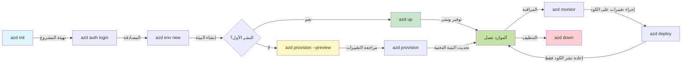
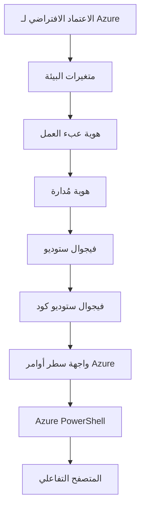

<!--
CO_OP_TRANSLATOR_METADATA:
{
  "original_hash": "e855e899d2705754fe85b04190edd0f0",
  "translation_date": "2025-11-20T07:14:24+00:00",
  "source_file": "docs/getting-started/azd-basics.md",
  "language_code": "ar"
}
-->
# أساسيات AZD - فهم Azure Developer CLI

# أساسيات AZD - المفاهيم الأساسية والمبادئ

**تنقل الفصول:**
- **📚 الصفحة الرئيسية للدورة**: [AZD للمبتدئين](../../README.md)
- **📖 الفصل الحالي**: الفصل الأول - الأساسيات والبداية السريعة
- **⬅️ السابق**: [نظرة عامة على الدورة](../../README.md#-chapter-1-foundation--quick-start)
- **➡️ التالي**: [التثبيت والإعداد](installation.md)
- **🚀 الفصل التالي**: [الفصل الثاني: تطوير يعتمد على الذكاء الاصطناعي](../microsoft-foundry/microsoft-foundry-integration.md)

## المقدمة

تقدم هذه الدرس أداة Azure Developer CLI (azd)، وهي أداة سطر أوامر قوية تسرّع رحلتك من التطوير المحلي إلى النشر على Azure. ستتعلم المفاهيم الأساسية، الميزات الرئيسية، وكيفية تبسيط azd لنشر التطبيقات السحابية الأصلية.

## أهداف التعلم

بنهاية هذا الدرس، ستتمكن من:
- فهم ما هو Azure Developer CLI والغرض الأساسي منه
- تعلم المفاهيم الأساسية مثل القوالب، البيئات، والخدمات
- استكشاف الميزات الرئيسية بما في ذلك التطوير القائم على القوالب والبنية التحتية ككود
- فهم هيكل مشروع azd وسير العمل
- الاستعداد لتثبيت وتكوين azd لبيئة التطوير الخاصة بك

## نتائج التعلم

بعد إكمال هذا الدرس، ستتمكن من:
- شرح دور azd في سير عمل التطوير السحابي الحديث
- تحديد مكونات هيكل مشروع azd
- وصف كيفية عمل القوالب، البيئات، والخدمات معًا
- فهم فوائد البنية التحتية ككود باستخدام azd
- التعرف على أوامر azd المختلفة وأغراضها

## ما هو Azure Developer CLI (azd)؟

Azure Developer CLI (azd) هي أداة سطر أوامر مصممة لتسريع رحلتك من التطوير المحلي إلى النشر على Azure. تبسط عملية بناء، نشر، وإدارة التطبيقات السحابية الأصلية على Azure.

### 🎯 لماذا استخدام AZD؟ مقارنة واقعية

لنقارن بين نشر تطبيق ويب بسيط مع قاعدة بيانات:

#### ❌ بدون AZD: النشر اليدوي على Azure (30+ دقيقة)

```bash
# الخطوة 1: إنشاء مجموعة الموارد
az group create --name myapp-rg --location eastus

# الخطوة 2: إنشاء خطة خدمة التطبيقات
az appservice plan create --name myapp-plan \
  --resource-group myapp-rg \
  --sku B1 --is-linux

# الخطوة 3: إنشاء تطبيق ويب
az webapp create --name myapp-web-unique123 \
  --resource-group myapp-rg \
  --plan myapp-plan \
  --runtime "NODE:18-lts"

# الخطوة 4: إنشاء حساب Cosmos DB (10-15 دقيقة)
az cosmosdb create --name myapp-cosmos-unique123 \
  --resource-group myapp-rg \
  --kind MongoDB

# الخطوة 5: إنشاء قاعدة بيانات
az cosmosdb mongodb database create \
  --account-name myapp-cosmos-unique123 \
  --resource-group myapp-rg \
  --name tododb

# الخطوة 6: إنشاء مجموعة
az cosmosdb mongodb collection create \
  --account-name myapp-cosmos-unique123 \
  --resource-group myapp-rg \
  --database-name tododb \
  --name todos

# الخطوة 7: الحصول على سلسلة الاتصال
CONN_STR=$(az cosmosdb keys list \
  --name myapp-cosmos-unique123 \
  --resource-group myapp-rg \
  --type connection-strings \
  --query "connectionStrings[0].connectionString" -o tsv)

# الخطوة 8: تكوين إعدادات التطبيق
az webapp config appsettings set \
  --name myapp-web-unique123 \
  --resource-group myapp-rg \
  --settings MONGODB_URI="$CONN_STR"

# الخطوة 9: تمكين تسجيل الدخول
az webapp log config --name myapp-web-unique123 \
  --resource-group myapp-rg \
  --application-logging filesystem \
  --detailed-error-messages true

# الخطوة 10: إعداد Application Insights
az monitor app-insights component create \
  --app myapp-insights \
  --location eastus \
  --resource-group myapp-rg

# الخطوة 11: ربط App Insights بتطبيق الويب
INSTRUMENTATION_KEY=$(az monitor app-insights component show \
  --app myapp-insights \
  --resource-group myapp-rg \
  --query "instrumentationKey" -o tsv)

az webapp config appsettings set \
  --name myapp-web-unique123 \
  --resource-group myapp-rg \
  --settings APPINSIGHTS_INSTRUMENTATIONKEY="$INSTRUMENTATION_KEY"

# الخطوة 12: بناء التطبيق محليًا
npm install
npm run build

# الخطوة 13: إنشاء حزمة النشر
zip -r app.zip . -x "*.git*" "node_modules/*"

# الخطوة 14: نشر التطبيق
az webapp deployment source config-zip \
  --resource-group myapp-rg \
  --name myapp-web-unique123 \
  --src app.zip

# الخطوة 15: الانتظار والصلاة أن يعمل 🙏
# (لا يوجد تحقق تلقائي، مطلوب اختبار يدوي)
```

**المشاكل:**
- ❌ أكثر من 15 أمرًا يجب تذكرها وتنفيذها بالترتيب
- ❌ 30-45 دقيقة من العمل اليدوي
- ❌ سهولة ارتكاب الأخطاء (أخطاء إملائية، معلمات خاطئة)
- ❌ سلاسل الاتصال مكشوفة في سجل الطرفية
- ❌ لا يوجد تراجع تلقائي إذا حدث خطأ
- ❌ صعوبة في التكرار لأعضاء الفريق
- ❌ مختلف في كل مرة (غير قابل للتكرار)

#### ✅ مع AZD: النشر التلقائي (5 أوامر، 10-15 دقيقة)

```bash
# الخطوة 1: التهيئة من القالب
azd init --template todo-nodejs-mongo

# الخطوة 2: المصادقة
azd auth login

# الخطوة 3: إنشاء البيئة
azd env new dev

# الخطوة 4: معاينة التغييرات (اختياري ولكن موصى به)
azd provision --preview

# الخطوة 5: نشر كل شيء
azd up

# ✨ تم! تم نشر كل شيء، تكوينه، ومراقبته
```

**الفوائد:**
- ✅ **5 أوامر** مقابل أكثر من 15 خطوة يدوية
- ✅ **10-15 دقيقة** إجمالي الوقت (معظمها انتظار Azure)
- ✅ **صفر أخطاء** - تلقائي ومختبر
- ✅ **إدارة الأسرار بأمان** عبر Key Vault
- ✅ **تراجع تلقائي** عند الفشل
- ✅ **قابل للتكرار بالكامل** - نفس النتيجة في كل مرة
- ✅ **جاهز للفريق** - يمكن لأي شخص النشر بنفس الأوامر
- ✅ **البنية التحتية ككود** - قوالب Bicep تحت التحكم في الإصدار
- ✅ **مراقبة مدمجة** - يتم تكوين Application Insights تلقائيًا

### 📊 تقليل الوقت والأخطاء

| المقياس | النشر اليدوي | النشر باستخدام AZD | التحسين |
|:-------|:------------------|:---------------|:------------|
| **الأوامر** | 15+ | 5 | تقليل بنسبة 67% |
| **الوقت** | 30-45 دقيقة | 10-15 دقيقة | أسرع بنسبة 60% |
| **معدل الأخطاء** | ~40% | <5% | تقليل بنسبة 88% |
| **الاتساق** | منخفض (يدوي) | 100% (تلقائي) | مثالي |
| **تأهيل الفريق** | 2-4 ساعات | 30 دقيقة | أسرع بنسبة 75% |
| **وقت التراجع** | 30+ دقيقة (يدوي) | 2 دقيقة (تلقائي) | أسرع بنسبة 93% |

## المفاهيم الأساسية

### القوالب
القوالب هي أساس azd. تحتوي على:
- **كود التطبيق** - كود المصدر والاعتماديات
- **تعريفات البنية التحتية** - موارد Azure المعرفة بـ Bicep أو Terraform
- **ملفات التكوين** - الإعدادات والمتغيرات البيئية
- **برامج النشر** - سير عمل النشر التلقائي

### البيئات
تمثل البيئات أهداف النشر المختلفة:
- **التطوير** - للاختبار والتطوير
- **التجريب** - بيئة ما قبل الإنتاج
- **الإنتاج** - بيئة الإنتاج الحية

كل بيئة تحتفظ بـ:
- مجموعة موارد Azure الخاصة بها
- إعدادات التكوين
- حالة النشر

### الخدمات
الخدمات هي اللبنات الأساسية لتطبيقك:
- **الواجهة الأمامية** - تطبيقات الويب، SPAs
- **الخلفية** - APIs، الخدمات المصغرة
- **قاعدة البيانات** - حلول تخزين البيانات
- **التخزين** - تخزين الملفات والبلوب

## الميزات الرئيسية

### 1. التطوير القائم على القوالب
```bash
# تصفح القوالب المتاحة
azd template list

# قم بالتهيئة من قالب
azd init --template <template-name>
```

### 2. البنية التحتية ككود
- **Bicep** - لغة خاصة بـ Azure
- **Terraform** - أداة بنية تحتية متعددة السحابات
- **ARM Templates** - قوالب Azure Resource Manager

### 3. سير العمل المتكامل
```bash
# إكمال سير عمل النشر
azd up            # التوفير + النشر هذا تلقائي للإعداد الأول

# 🧪 جديد: معاينة تغييرات البنية التحتية قبل النشر (آمن)
azd provision --preview    # محاكاة نشر البنية التحتية دون إجراء تغييرات

azd provision     # إنشاء موارد Azure إذا قمت بتحديث البنية التحتية استخدم هذا
azd deploy        # نشر كود التطبيق أو إعادة نشر كود التطبيق بمجرد التحديث
azd down          # تنظيف الموارد
```

#### 🛡️ تخطيط البنية التحتية الآمن باستخدام المعاينة
أمر `azd provision --preview` هو تغيير كبير للنشر الآمن:
- **تحليل تجريبي** - يعرض ما سيتم إنشاؤه، تعديله، أو حذفه
- **صفر مخاطر** - لا يتم إجراء تغييرات فعلية على بيئة Azure الخاصة بك
- **تعاون الفريق** - مشاركة نتائج المعاينة قبل النشر
- **تقدير التكلفة** - فهم تكاليف الموارد قبل الالتزام

```bash
# مثال سير العمل للمعاينة
azd provision --preview           # انظر ما الذي سيتغير
# راجع المخرجات، ناقش مع الفريق
azd provision                     # قم بتطبيق التغييرات بثقة
```

### 📊 تصور: سير عمل تطوير AZD


**شرح سير العمل:**
1. **Init** - البدء بقالب أو مشروع جديد
2. **Auth** - المصادقة مع Azure
3. **Environment** - إنشاء بيئة نشر معزولة
4. **Preview** - 🆕 معاينة تغييرات البنية التحتية دائمًا أولاً (ممارسة آمنة)
5. **Provision** - إنشاء/تحديث موارد Azure
6. **Deploy** - دفع كود التطبيق الخاص بك
7. **Monitor** - مراقبة أداء التطبيق
8. **Iterate** - إجراء تغييرات وإعادة نشر الكود
9. **Cleanup** - إزالة الموارد عند الانتهاء

### 4. إدارة البيئات
```bash
# إنشاء وإدارة البيئات
azd env new <environment-name>
azd env select <environment-name>
azd env list
```

## 📁 هيكل المشروع

هيكل مشروع azd النموذجي:
```
my-app/
├── .azd/                    # azd configuration
│   └── config.json
├── .azure/                  # Azure deployment artifacts
├── .devcontainer/          # Development container config
├── .github/workflows/      # GitHub Actions
├── .vscode/               # VS Code settings
├── infra/                 # Infrastructure code
│   ├── main.bicep        # Main infrastructure template
│   ├── main.parameters.json
│   └── modules/          # Reusable modules
├── src/                  # Application source code
│   ├── api/             # Backend services
│   └── web/             # Frontend application
├── azure.yaml           # azd project configuration
└── README.md
```

## 🔧 ملفات التكوين

### azure.yaml
ملف التكوين الرئيسي للمشروع:
```yaml
name: my-awesome-app
metadata:
  template: my-template@1.0.0

services:
  web:
    project: ./src/web
    language: js
    host: appservice
  api:
    project: ./src/api
    language: js
    host: appservice

hooks:
  preprovision:
    shell: pwsh
    run: echo "Preparing to provision..."
```

### .azure/config.json
تكوين خاص بالبيئة:
```json
{
  "version": 1,
  "defaultEnvironment": "dev",
  "environments": {
    "dev": {
      "subscriptionId": "your-subscription-id",
      "location": "eastus"
    }
  }
}
```

## 🎪 سير العمل الشائع مع تمارين عملية

> **💡 نصيحة تعليمية:** اتبع هذه التمارين بالترتيب لبناء مهاراتك في AZD تدريجيًا.

### 🎯 التمرين 1: تهيئة مشروعك الأول

**الهدف:** إنشاء مشروع AZD واستكشاف هيكله

**الخطوات:**
```bash
# استخدم قالبًا مثبتًا
azd init --template todo-nodejs-mongo

# استكشف الملفات المُنشأة
ls -la  # عرض جميع الملفات بما في ذلك المخفية

# الملفات الرئيسية التي تم إنشاؤها:
# - azure.yaml (التكوين الرئيسي)
# - infra/ (كود البنية التحتية)
# - src/ (كود التطبيق)
```

**✅ النجاح:** لديك azure.yaml، infra/، وsrc/ مجلدات

---

### 🎯 التمرين 2: النشر على Azure

**الهدف:** إكمال النشر من البداية إلى النهاية

**الخطوات:**
```bash
# ١. المصادقة
az login && azd auth login

# ٢. إنشاء البيئة
azd env new dev
azd env set AZURE_LOCATION eastus

# ٣. معاينة التغييرات (موصى به)
azd provision --preview

# ٤. نشر كل شيء
azd up

# ٥. التحقق من النشر
azd show    # عرض رابط التطبيق الخاص بك
```

**الوقت المتوقع:** 10-15 دقيقة  
**✅ النجاح:** يتم فتح عنوان URL للتطبيق في المتصفح

---

### 🎯 التمرين 3: بيئات متعددة

**الهدف:** النشر إلى التطوير والتجريب

**الخطوات:**
```bash
# لديك بيئة التطوير بالفعل، قم بإنشاء بيئة التجربة
azd env new staging
azd env set AZURE_LOCATION westus2
azd up

# التبديل بينهما
azd env list
azd env select dev
```

**✅ النجاح:** مجموعتا موارد منفصلتان في Azure Portal

---

### 🛡️ إعادة تعيين كاملة: `azd down --force --purge`

عندما تحتاج إلى إعادة تعيين كاملة:

```bash
azd down --force --purge
```

**ما الذي يفعله:**
- `--force`: لا توجد مطالبات تأكيد
- `--purge`: يحذف كل الحالة المحلية وموارد Azure

**استخدامه عندما:**
- فشل النشر في منتصف الطريق
- تبديل المشاريع
- الحاجة إلى بداية جديدة

---

## 🎪 مرجع سير العمل الأصلي

### بدء مشروع جديد
```bash
# الطريقة 1: استخدام القالب الموجود
azd init --template todo-nodejs-mongo

# الطريقة 2: البدء من الصفر
azd init

# الطريقة 3: استخدام الدليل الحالي
azd init .
```

### دورة التطوير
```bash
# إعداد بيئة التطوير
azd auth login
azd env new dev
azd env select dev

# نشر كل شيء
azd up

# إجراء تغييرات وإعادة النشر
azd deploy

# تنظيف عند الانتهاء
azd down --force --purge # الأمر في Azure Developer CLI هو **إعادة ضبط قوية** لبيئتك—مفيد بشكل خاص عند استكشاف أخطاء النشر الفاشلة، تنظيف الموارد اليتيمة، أو التحضير لإعادة نشر جديدة.
```

## فهم `azd down --force --purge`
أمر `azd down --force --purge` هو طريقة قوية لتفكيك بيئة azd بالكامل وجميع الموارد المرتبطة بها. إليك تفصيل لما يفعله كل علم:
```
--force
```
- يتخطى مطالبات التأكيد.
- مفيد للأتمتة أو البرمجة النصية حيث لا يكون الإدخال اليدوي ممكنًا.
- يضمن استمرار التفكيك دون انقطاع، حتى إذا اكتشف CLI تناقضات.

```
--purge
```
يحذف **كل البيانات الوصفية المرتبطة**، بما في ذلك:
حالة البيئة
المجلد المحلي `.azure`
معلومات النشر المؤقتة
يمنع azd من "تذكر" عمليات النشر السابقة، مما قد يسبب مشاكل مثل مجموعات الموارد غير المتطابقة أو مراجع السجل القديمة.

### لماذا استخدام كلاهما؟
عندما تواجه مشكلة مع `azd up` بسبب حالة متبقية أو عمليات نشر جزئية، يضمن هذا المزيج **بداية نظيفة**.

إنه مفيد بشكل خاص بعد عمليات حذف الموارد اليدوية في بوابة Azure أو عند تبديل القوالب، البيئات، أو اتفاقيات تسمية مجموعات الموارد.

### إدارة البيئات المتعددة
```bash
# إنشاء بيئة مرحلية
azd env new staging
azd env select staging
azd up

# العودة إلى التطوير
azd env select dev

# مقارنة البيئات
azd env list
```

## 🔐 المصادقة والبيانات الاعتمادية

فهم المصادقة أمر بالغ الأهمية لعمليات نشر azd الناجحة. تستخدم Azure طرق مصادقة متعددة، ويستفيد azd من نفس سلسلة البيانات الاعتمادية المستخدمة بواسطة أدوات Azure الأخرى.

### مصادقة Azure CLI (`az login`)

قبل استخدام azd، تحتاج إلى المصادقة مع Azure. الطريقة الأكثر شيوعًا هي استخدام Azure CLI:

```bash
# تسجيل الدخول التفاعلي (يفتح المتصفح)
az login

# تسجيل الدخول باستخدام مستأجر محدد
az login --tenant <tenant-id>

# تسجيل الدخول باستخدام المسؤول عن الخدمة
az login --service-principal -u <app-id> -p <password> --tenant <tenant-id>

# التحقق من حالة تسجيل الدخول الحالية
az account show

# عرض الاشتراكات المتاحة
az account list --output table

# تعيين الاشتراك الافتراضي
az account set --subscription <subscription-id>
```

### تدفق المصادقة
1. **تسجيل الدخول التفاعلي**: يفتح متصفحك الافتراضي للمصادقة
2. **تدفق رمز الجهاز**: للبيئات التي لا يمكن الوصول فيها إلى المتصفح
3. **الهوية المدارة**: للتطبيقات المستضافة على Azure
4. **الهوية المدارة**: للتطبيقات المستضافة على Azure

### سلسلة DefaultAzureCredential

`DefaultAzureCredential` هو نوع بيانات اعتماد يوفر تجربة مصادقة مبسطة من خلال محاولة مصادر بيانات اعتماد متعددة تلقائيًا بترتيب معين:

#### ترتيب سلسلة البيانات الاعتمادية

#### 1. المتغيرات البيئية
```bash
# تعيين متغيرات البيئة للمبدأ الخدمي
export AZURE_CLIENT_ID="<app-id>"
export AZURE_CLIENT_SECRET="<password>"
export AZURE_TENANT_ID="<tenant-id>"
```

#### 2. هوية العمل (Kubernetes/GitHub Actions)
تُستخدم تلقائيًا في:
- خدمة Kubernetes Azure (AKS) مع هوية العمل
- GitHub Actions مع اتحاد OIDC
- سيناريوهات الهوية الاتحادية الأخرى

#### 3. الهوية المدارة
للموارد Azure مثل:
- الأجهزة الافتراضية
- خدمة التطبيقات
- وظائف Azure
- مثيلات الحاويات

```bash
# تحقق مما إذا كان يتم التشغيل على مورد Azure بهوية مُدارة
az account show --query "user.type" --output tsv
# يُرجع: "servicePrincipal" إذا كان يستخدم هوية مُدارة
```

#### 4. تكامل أدوات المطورين
- **Visual Studio**: يستخدم الحساب المسجل تلقائيًا
- **VS Code**: يستخدم بيانات اعتماد ملحق حساب Azure
- **Azure CLI**: يستخدم بيانات اعتماد `az login` (الأكثر شيوعًا للتطوير المحلي)

### إعداد مصادقة AZD

```bash
# الطريقة 1: استخدام Azure CLI (موصى به للتطوير)
az login
azd auth login  # يستخدم بيانات اعتماد Azure CLI الحالية

# الطريقة 2: المصادقة المباشرة باستخدام azd
azd auth login --use-device-code  # للبيئات غير التفاعلية

# الطريقة 3: التحقق من حالة المصادقة
azd auth login --check-status

# الطريقة 4: تسجيل الخروج وإعادة المصادقة
azd auth logout
azd auth login
```

### أفضل ممارسات المصادقة

#### للتطوير المحلي
```bash
# 1. تسجيل الدخول باستخدام Azure CLI
az login

# 2. التحقق من الاشتراك الصحيح
az account show
az account set --subscription "Your Subscription Name"

# 3. استخدام azd مع بيانات الاعتماد الحالية
azd auth login
```

#### لخطوط أنابيب CI/CD
```yaml
# GitHub Actions example
- name: Azure Login
  uses: azure/login@v1
  with:
    creds: ${{ secrets.AZURE_CREDENTIALS }}

- name: Deploy with azd
  run: |
    azd auth login --client-id ${{ secrets.AZURE_CLIENT_ID }} \
                    --client-secret ${{ secrets.AZURE_CLIENT_SECRET }} \
                    --tenant-id ${{ secrets.AZURE_TENANT_ID }}
    azd up --no-prompt
```

#### لبيئات الإنتاج
- استخدم **الهوية المدارة** عند التشغيل على موارد Azure
- استخدم **الهوية المدارة** لسيناريوهات الأتمتة
- تجنب تخزين البيانات الاعتمادية في الكود أو ملفات التكوين
- استخدم **Azure Key Vault** للإعدادات الحساسة

### مشاكل المصادقة الشائعة وحلولها

#### المشكلة: "لم يتم العثور على اشتراك"
```bash
# الحل: تعيين الاشتراك الافتراضي
az account list --output table
az account set --subscription "<subscription-id>"
azd env set AZURE_SUBSCRIPTION_ID "<subscription-id>"
```

#### المشكلة: "أذونات غير كافية"
```bash
# الحل: تحقق وقم بتعيين الأدوار المطلوبة
az role assignment list --assignee $(az account show --query user.name --output tsv)

# الأدوار المطلوبة الشائعة:
# - المساهم (لإدارة الموارد)
# - مسؤول وصول المستخدم (لتعيينات الأدوار)
```

#### المشكلة: "انتهت صلاحية الرمز"
```bash
# الحل: إعادة المصادقة
az logout
az login
azd auth logout
azd auth login
```

### المصادقة في سيناريوهات مختلفة

#### التطوير المحلي
```bash
# حساب التنمية الشخصية
az login
azd auth login
```

#### تطوير الفريق
```bash
# استخدم مستأجر محدد للمؤسسة
az login --tenant contoso.onmicrosoft.com
azd auth login
```

#### سيناريوهات متعددة المستأجرين
```bash
# التبديل بين المستأجرين
az login --tenant tenant1.onmicrosoft.com
# النشر إلى المستأجر 1
azd up

az login --tenant tenant2.onmicrosoft.com  
# النشر إلى المستأجر 2
azd up
```

### اعتبارات الأمان

1. **تخزين البيانات الاعتمادية**: لا تخزن البيانات الاعتمادية في الكود المصدر
2. **تحديد النطاق**: استخدم مبدأ الأقل امتيازًا للهوية المدارة
3. **تدوير الرموز**: قم بتدوير أسرار الهوية المدارة بانتظام
4. **سجل التدقيق**: راقب أنشطة المصادقة والنشر
5. **أمان الشبكة**: استخدم نقاط النهاية الخاصة عندما يكون ذلك ممكنًا

### استكشاف مشاكل المصادقة

```bash
# تصحيح مشاكل المصادقة
azd auth login --check-status
az account show
az account get-access-token

# أوامر التشخيص الشائعة
whoami                          # سياق المستخدم الحالي
az ad signed-in-user show      # تفاصيل مستخدم Azure AD
az group list                  # اختبار الوصول إلى الموارد
```

## فهم `azd down --force --purge`

### الاكتشاف
```bash
azd template list              # تصفح القوالب
azd template show <template>   # تفاصيل القالب
azd init --help               # خيارات التهيئة
```

### إدارة المشاريع
```bash
azd show                     # نظرة عامة على المشروع
azd env show                 # البيئة الحالية
azd config list             # إعدادات التكوين
```

### المراقبة
```bash
azd monitor                  # افتح بوابة Azure
azd pipeline config          # إعداد CI/CD
azd logs                     # عرض سجلات التطبيق
```

## أفضل الممارسات

### 1. استخدم أسماء ذات معنى
```bash
# جيد
azd env new production-east
azd init --template web-app-secure

# تجنب
azd env new env1
azd init --template template1
```

### 2. استفد من القوالب
- ابدأ بالقوالب الموجودة
- خصصها لاحتياجاتك
- أنشئ قوالب قابلة لإعادة الاستخدام لمؤسستك

### 3. عزل البيئات
- استخدم بيئات منفصلة للتطوير/التجريب/الإنتاج
- لا تنشر مباشرة إلى الإنتاج من الجهاز المحلي
- استخدم خطوط أنابيب CI/CD للنشر في الإنتاج

### 4. إدارة التكوين
- استخدم المتغيرات البيئية للبيانات الحساسة
- احتفظ بالتكوين تحت التحكم في الإصدار
- وثق الإعدادات الخاصة بالبيئة

## تقدم التعلم

### مبتدئ (الأسبوع 1-2)
1. تثبيت azd والمصادقة
2. نشر قالب بسيط
3. فهم هيكل المشروع
4. تعلم الأوامر الأساسية (up، down، deploy)

### متوسط (الأسبوع 3-4)
1. تخصيص القوالب
2. إدارة البيئات المتعددة
3. فهم كود البنية التحتية
4. إعداد خطوط أنابيب CI/CD

### متقدم (الأسبوع 5+)
1. إنشاء قوالب مخصصة
2. أنماط البنية التحتية المتقدمة
3. عمليات النشر متعددة المناطق
4. تكوينات على مستوى المؤسسة

## الخطوات التالية

**📖 استمر في تعلم الفصل الأول:**
- [التثبيت والإعداد](installation.md) - تثبيت وتكوين azd  
- [مشروعك الأول](first-project.md) - دليل عملي شامل  
- [دليل التكوين](configuration.md) - خيارات التكوين المتقدمة  

**🎯 جاهز للفصل التالي؟**  
- [الفصل 2: تطوير يعتمد على الذكاء الاصطناعي](../microsoft-foundry/microsoft-foundry-integration.md) - ابدأ ببناء تطبيقات الذكاء الاصطناعي  

## موارد إضافية  

- [نظرة عامة على Azure Developer CLI](https://learn.microsoft.com/en-us/azure/developer/azure-developer-cli/)  
- [معرض القوالب](https://azure.github.io/awesome-azd/)  
- [نماذج المجتمع](https://github.com/Azure-Samples)  

---

## 🙋 الأسئلة الشائعة  

### الأسئلة العامة  

**س: ما الفرق بين AZD و Azure CLI؟**  

ج: Azure CLI (`az`) يُستخدم لإدارة موارد Azure الفردية. AZD (`azd`) يُستخدم لإدارة التطبيقات بالكامل:  

```bash
# إدارة الموارد منخفضة المستوى - Azure CLI
az webapp create --name myapp --resource-group rg
az sql server create --name myserver --resource-group rg
# ...هناك حاجة إلى العديد من الأوامر الأخرى

# إدارة على مستوى التطبيق - AZD
azd up  # ينشر التطبيق بالكامل مع جميع الموارد
```
  
**فكر في الأمر بهذه الطريقة:**  
- `az` = العمل على قطع ليجو فردية  
- `azd` = العمل مع مجموعات ليجو كاملة  

---

**س: هل أحتاج إلى معرفة Bicep أو Terraform لاستخدام AZD؟**  

ج: لا! ابدأ بالقوالب:  
```bash
# استخدم القالب الموجود - لا حاجة لمعرفة IaC
azd init --template todo-nodejs-mongo
azd up
```
  
يمكنك تعلم Bicep لاحقًا لتخصيص البنية التحتية. القوالب توفر أمثلة عملية للتعلم منها.  

---

**س: كم تكلفة تشغيل قوالب AZD؟**  

ج: التكاليف تختلف حسب القالب. معظم قوالب التطوير تكلف بين 50-150 دولار شهريًا:  

```bash
# معاينة التكاليف قبل النشر
azd provision --preview

# قم بالتنظيف دائمًا عند عدم الاستخدام
azd down --force --purge  # يزيل جميع الموارد
```
  
**نصيحة احترافية:** استخدم الطبقات المجانية حيثما أمكن:  
- خدمة التطبيقات: طبقة F1 (مجانية)  
- Azure OpenAI: 50,000 رمز شهريًا مجانًا  
- Cosmos DB: طبقة مجانية 1000 RU/s  

---

**س: هل يمكنني استخدام AZD مع موارد Azure الحالية؟**  

ج: نعم، ولكن من الأسهل البدء من جديد. يعمل AZD بشكل أفضل عندما يدير دورة الحياة بالكامل. بالنسبة للموارد الحالية:  

```bash
# الخيار 1: استيراد الموارد الموجودة (متقدم)
azd init
# ثم تعديل infra/ للإشارة إلى الموارد الموجودة

# الخيار 2: البدء من جديد (موصى به)
azd init --template matching-your-stack
azd up  # إنشاء بيئة جديدة
```
  
---

**س: كيف أشارك مشروعي مع زملائي؟**  

ج: قم بحفظ مشروع AZD في Git (لكن ليس المجلد .azure):  

```bash
# موجود بالفعل في .gitignore افتراضيًا
.azure/        # يحتوي على أسرار وبيانات البيئة
*.env          # متغيرات البيئة

# أعضاء الفريق حينها:
git clone <your-repo>
azd auth login
azd env new <their-name>-dev
azd up
```
  
الجميع يحصل على بنية تحتية متطابقة من نفس القوالب.  

---

### أسئلة استكشاف الأخطاء وإصلاحها  

**س: فشل "azd up" في منتصف العملية. ماذا أفعل؟**  

ج: تحقق من الخطأ، أصلحه، ثم أعد المحاولة:  

```bash
# عرض السجلات التفصيلية
azd show

# الإصلاحات الشائعة:

# 1. إذا تم تجاوز الحصة:
azd env set AZURE_LOCATION "westus2"  # جرب منطقة مختلفة

# 2. إذا كان هناك تعارض في اسم المورد:
azd down --force --purge  # ابدأ من جديد
azd up  # حاول مرة أخرى

# 3. إذا انتهت صلاحية المصادقة:
az login
azd auth login
azd up
```
  
**المشكلة الأكثر شيوعًا:** اختيار اشتراك Azure خاطئ  
```bash
az account list --output table
az account set --subscription "<correct-subscription>"
```
  
---

**س: كيف أنشر تغييرات الكود فقط دون إعادة التهيئة؟**  

ج: استخدم `azd deploy` بدلاً من `azd up`:  

```bash
azd up          # المرة الأولى: توفير + نشر (بطيء)

# قم بإجراء تغييرات على الكود...

azd deploy      # المرات اللاحقة: نشر فقط (سريع)
```
  
مقارنة السرعة:  
- `azd up`: 10-15 دقيقة (تهيئة البنية التحتية)  
- `azd deploy`: 2-5 دقائق (الكود فقط)  

---

**س: هل يمكنني تخصيص قوالب البنية التحتية؟**  

ج: نعم! قم بتعديل ملفات Bicep في `infra/`:  

```bash
# بعد azd init
cd infra/
code main.bicep  # تحرير في VS Code

# معاينة التغييرات
azd provision --preview

# تطبيق التغييرات
azd provision
```
  
**نصيحة:** ابدأ صغيرًا - قم بتغيير SKUs أولاً:  
```bicep
// infra/main.bicep
sku: {
  name: 'B1'  // Change to 'P1V2' for production
}
```
  
---

**س: كيف أحذف كل شيء أنشأه AZD؟**  

ج: أمر واحد يزيل جميع الموارد:  

```bash
azd down --force --purge

# هذا يحذف:
# - جميع موارد Azure
# - مجموعة الموارد
# - حالة البيئة المحلية
# - بيانات النشر المخزنة مؤقتًا
```
  
**قم دائمًا بتشغيل هذا عندما:**  
- تنتهي من اختبار قالب  
- تنتقل إلى مشروع مختلف  
- تريد البدء من جديد  

**توفير التكاليف:** حذف الموارد غير المستخدمة = لا توجد رسوم  

---

**س: ماذا لو حذفت الموارد عن طريق الخطأ في Azure Portal؟**  

ج: يمكن أن تصبح حالة AZD غير متزامنة. نهج البدء من جديد:  

```bash
# ١. إزالة الحالة المحلية
azd down --force --purge

# ٢. البدء من جديد
azd up

# بديل: دع AZD يكتشف ويصلح
azd provision  # سيقوم بإنشاء الموارد المفقودة
```
  
---

### الأسئلة المتقدمة  

**س: هل يمكنني استخدام AZD في خطوط CI/CD؟**  

ج: نعم! مثال GitHub Actions:  

```yaml
# .github/workflows/deploy.yml
name: Deploy with AZD

on:
  push:
    branches: [main]

jobs:
  deploy:
    runs-on: ubuntu-latest
    steps:
      - uses: actions/checkout@v2
      
      - name: Install azd
        run: curl -fsSL https://aka.ms/install-azd.sh | bash
      
      - name: Azure Login
        run: |
          azd auth login \
            --client-id ${{ secrets.AZURE_CLIENT_ID }} \
            --client-secret ${{ secrets.AZURE_CLIENT_SECRET }} \
            --tenant-id ${{ secrets.AZURE_TENANT_ID }}
      
      - name: Deploy
        run: azd up --no-prompt
```
  
---

**س: كيف أتعامل مع الأسرار والبيانات الحساسة؟**  

ج: AZD يتكامل تلقائيًا مع Azure Key Vault:  

```bash
# يتم تخزين الأسرار في Key Vault، وليس في الكود
azd env set DATABASE_PASSWORD "$(openssl rand -base64 32)"

# يقوم AZD تلقائيًا:
# 1. بإنشاء Key Vault
# 2. بتخزين السر
# 3. بمنح التطبيق الوصول عبر الهوية المُدارة
# 4. بالحقن أثناء وقت التشغيل
```
  
**لا تقم أبدًا بحفظ:**  
- مجلد `.azure/` (يحتوي على بيانات البيئة)  
- ملفات `.env` (الأسرار المحلية)  
- سلاسل الاتصال  

---

**س: هل يمكنني النشر إلى مناطق متعددة؟**  

ج: نعم، قم بإنشاء بيئة لكل منطقة:  

```bash
# بيئة شرق الولايات المتحدة
azd env new prod-eastus
azd env set AZURE_LOCATION eastus
azd up

# بيئة غرب أوروبا
azd env new prod-westeurope
azd env set AZURE_LOCATION westeurope
azd up

# كل بيئة مستقلة
azd env list
```
  
بالنسبة للتطبيقات متعددة المناطق الحقيقية، قم بتخصيص قوالب Bicep للنشر إلى مناطق متعددة في نفس الوقت.  

---

**س: أين يمكنني الحصول على المساعدة إذا واجهت مشكلة؟**  

1. **وثائق AZD:** https://learn.microsoft.com/azure/developer/azure-developer-cli/  
2. **مشكلات GitHub:** https://github.com/Azure/azure-dev/issues  
3. **Discord:** [Azure Discord](https://discord.gg/microsoft-azure) - قناة #azure-developer-cli  
4. **Stack Overflow:** الوسم `azure-developer-cli`  
5. **هذا الدورة:** [دليل استكشاف الأخطاء وإصلاحها](../troubleshooting/common-issues.md)  

**نصيحة احترافية:** قبل السؤال، قم بتشغيل:  
```bash
azd show       # يعرض الحالة الحالية
azd version    # يعرض الإصدار الخاص بك
```
  
قم بتضمين هذه المعلومات في سؤالك للحصول على مساعدة أسرع.  

---

## 🎓 ماذا بعد؟  

الآن تفهم أساسيات AZD. اختر مسارك:  

### 🎯 للمبتدئين:  
1. **التالي:** [التثبيت والإعداد](installation.md) - قم بتثبيت AZD على جهازك  
2. **ثم:** [مشروعك الأول](first-project.md) - قم بنشر تطبيقك الأول  
3. **الممارسة:** أكمل جميع التمارين الثلاثة في هذا الدرس  

### 🚀 لمطوري الذكاء الاصطناعي:  
1. **تجاوز إلى:** [الفصل 2: تطوير يعتمد على الذكاء الاصطناعي](../microsoft-foundry/microsoft-foundry-integration.md)  
2. **النشر:** ابدأ بـ `azd init --template get-started-with-ai-chat`  
3. **التعلم:** قم بالبناء أثناء النشر  

### 🏗️ للمطورين ذوي الخبرة:  
1. **المراجعة:** [دليل التكوين](configuration.md) - إعدادات متقدمة  
2. **الاستكشاف:** [البنية التحتية ككود](../deployment/provisioning.md) - تعمق في Bicep  
3. **البناء:** قم بإنشاء قوالب مخصصة لمكدسك  

---

**تنقل بين الفصول:**  
- **📚 الصفحة الرئيسية للدورة**: [AZD للمبتدئين](../../README.md)  
- **📖 الفصل الحالي**: الفصل 1 - الأساسيات والبداية السريعة  
- **⬅️ السابق**: [نظرة عامة على الدورة](../../README.md#-chapter-1-foundation--quick-start)  
- **➡️ التالي**: [التثبيت والإعداد](installation.md)  
- **🚀 الفصل التالي**: [الفصل 2: تطوير يعتمد على الذكاء الاصطناعي](../microsoft-foundry/microsoft-foundry-integration.md)  

---

<!-- CO-OP TRANSLATOR DISCLAIMER START -->
**إخلاء المسؤولية**:  
تم ترجمة هذا المستند باستخدام خدمة الترجمة بالذكاء الاصطناعي [Co-op Translator](https://github.com/Azure/co-op-translator). بينما نسعى لتحقيق الدقة، يرجى العلم أن الترجمات الآلية قد تحتوي على أخطاء أو عدم دقة. يجب اعتبار المستند الأصلي بلغته الأصلية المصدر الموثوق. للحصول على معلومات حاسمة، يُوصى بالترجمة البشرية الاحترافية. نحن غير مسؤولين عن أي سوء فهم أو تفسيرات خاطئة ناتجة عن استخدام هذه الترجمة.
<!-- CO-OP TRANSLATOR DISCLAIMER END -->