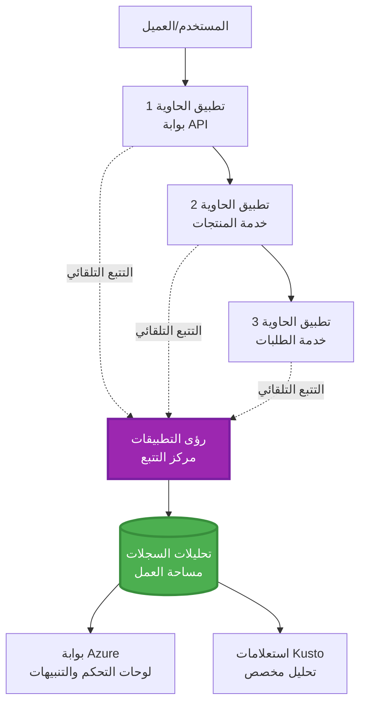
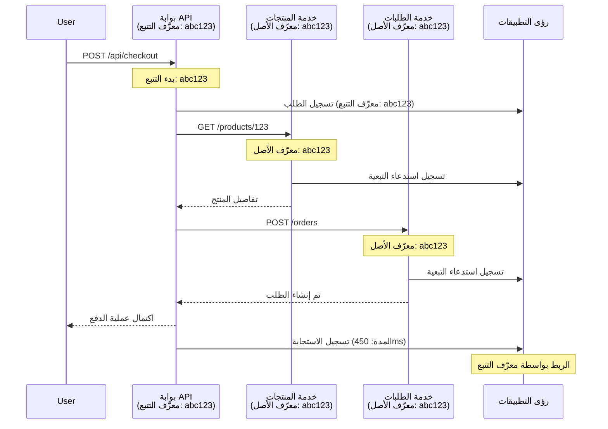

# دمج Application Insights مع AZD

⏱️ **الوقت المقدر**: 40-50 دقيقة | 💰 **تأثير التكلفة**: ~5-15 دولار/شهريًا | ⭐ **التعقيد**: متوسط

**📚 مسار التعلم:**
- ← السابق: [فحوصات ما قبل التنفيذ](preflight-checks.md) - التحقق قبل النشر
- 🎯 **أنت هنا**: دمج Application Insights (المراقبة، القياس، التصحيح)
- → التالي: [دليل النشر](../deployment/deployment-guide.md) - النشر إلى Azure
- 🏠 [الصفحة الرئيسية للدورة](../../README.md)

---

## ما ستتعلمه

عند إكمال هذا الدرس، ستتمكن من:
- دمج **Application Insights** تلقائيًا في مشاريع AZD
- إعداد **التتبع الموزع** للخدمات المصغرة
- تنفيذ **القياس المخصص** (المقاييس، الأحداث، التبعيات)
- إعداد **المقاييس الحية** للمراقبة الفورية
- إنشاء **تنبيهات ولوحات تحكم** من عمليات نشر AZD
- تصحيح مشاكل الإنتاج باستخدام **استعلامات القياس**
- تحسين **التكاليف واستراتيجيات أخذ العينات**
- مراقبة **تطبيقات الذكاء الاصطناعي/LLM** (الرموز، التأخير، التكاليف)

## لماذا يعتبر دمج Application Insights مع AZD مهمًا؟

### التحدي: مراقبة الإنتاج

**بدون Application Insights:**
```
❌ No visibility into production behavior
❌ Manual log aggregation across services
❌ Reactive debugging (wait for customer complaints)
❌ No performance metrics
❌ Cannot trace requests across services
❌ Unknown failure rates and bottlenecks
```

**مع Application Insights + AZD:**
```
✅ Automatic telemetry collection
✅ Centralized logs from all services
✅ Proactive issue detection
✅ End-to-end request tracing
✅ Performance metrics and insights
✅ Real-time dashboards
✅ AZD provisions everything automatically
```

**التشبيه**: يشبه Application Insights وجود "صندوق أسود" لتسجيل الأحداث + لوحة قيادة للطائرة لتطبيقك. يمكنك رؤية كل ما يحدث في الوقت الفعلي وإعادة تشغيل أي حادثة.

---

## نظرة عامة على الهيكلية

### Application Insights في هيكلية AZD


### ما يتم مراقبته تلقائيًا

| نوع القياس | ما يتم التقاطه | حالة الاستخدام |
|------------|----------------|----------------|
| **الطلبات** | طلبات HTTP، رموز الحالة، المدة | مراقبة أداء API |
| **التبعيات** | المكالمات الخارجية (قاعدة البيانات، APIs، التخزين) | تحديد نقاط الاختناق |
| **الاستثناءات** | الأخطاء غير المعالجة مع تتبع المكدس | تصحيح الأعطال |
| **الأحداث المخصصة** | أحداث الأعمال (التسجيل، الشراء) | التحليلات والمسارات |
| **المقاييس** | عدادات الأداء، المقاييس المخصصة | تخطيط السعة |
| **التتبع** | رسائل السجل مع الخطورة | التصحيح والتدقيق |
| **التوافر** | اختبارات وقت التشغيل ووقت الاستجابة | مراقبة اتفاقيات مستوى الخدمة |

---

## المتطلبات الأساسية

### الأدوات المطلوبة

```bash
# تحقق من Azure Developer CLI
azd version
# ✅ المتوقع: إصدار azd 1.0.0 أو أعلى

# تحقق من Azure CLI
az --version
# ✅ المتوقع: إصدار azure-cli 2.50.0 أو أعلى
```

### متطلبات Azure

- اشتراك Azure نشط
- أذونات لإنشاء:
  - موارد Application Insights
  - مساحات عمل Log Analytics
  - تطبيقات الحاويات
  - مجموعات الموارد

### المعرفة المطلوبة

يجب أن تكون قد أكملت:
- [أساسيات AZD](../getting-started/azd-basics.md) - مفاهيم AZD الأساسية
- [الإعداد](../getting-started/configuration.md) - إعداد البيئة
- [المشروع الأول](../getting-started/first-project.md) - النشر الأساسي

---

## الدرس 1: Application Insights التلقائي مع AZD

### كيف يقوم AZD بتوفير Application Insights

يقوم AZD تلقائيًا بإنشاء وتكوين Application Insights عند النشر. لنرى كيف يعمل.

### هيكلية المشروع

```
monitored-app/
├── azure.yaml                     # AZD configuration
├── infra/
│   ├── main.bicep                # Main infrastructure
│   ├── core/
│   │   └── monitoring.bicep      # Application Insights + Log Analytics
│   └── app/
│       └── api.bicep             # Container App with monitoring
└── src/
    ├── app.py                    # Application with telemetry
    ├── requirements.txt
    └── Dockerfile
```

---

### الخطوة 1: تكوين AZD (azure.yaml)

**الملف: `azure.yaml`**

```yaml
name: monitored-app
metadata:
  template: monitored-app@1.0.0

services:
  api:
    project: ./src
    language: python
    host: containerapp

# AZD automatically provisions monitoring!
```

**هذا كل شيء!** سيقوم AZD بإنشاء Application Insights افتراضيًا. لا حاجة لتكوين إضافي للمراقبة الأساسية.

---

### الخطوة 2: بنية المراقبة (Bicep)

**الملف: `infra/core/monitoring.bicep`**

```bicep
param logAnalyticsName string
param applicationInsightsName string
param location string = resourceGroup().location
param tags object = {}

// Log Analytics Workspace (required for Application Insights)
resource logAnalytics 'Microsoft.OperationalInsights/workspaces@2022-10-01' = {
  name: logAnalyticsName
  location: location
  tags: tags
  properties: {
    sku: {
      name: 'PerGB2018'  // Pay-as-you-go pricing
    }
    retentionInDays: 30  // Keep logs for 30 days
    features: {
      enableLogAccessUsingOnlyResourcePermissions: true
    }
  }
}

// Application Insights
resource applicationInsights 'Microsoft.Insights/components@2020-02-02' = {
  name: applicationInsightsName
  location: location
  tags: tags
  kind: 'web'
  properties: {
    Application_Type: 'web'
    WorkspaceResourceId: logAnalytics.id
    IngestionMode: 'LogAnalytics'
    publicNetworkAccessForIngestion: 'Enabled'
    publicNetworkAccessForQuery: 'Enabled'
  }
}

// Outputs for Container Apps
output logAnalyticsWorkspaceId string = logAnalytics.id
output logAnalyticsWorkspaceName string = logAnalytics.name
output applicationInsightsConnectionString string = applicationInsights.properties.ConnectionString
output applicationInsightsInstrumentationKey string = applicationInsights.properties.InstrumentationKey
output applicationInsightsName string = applicationInsights.name
```

---

### الخطوة 3: ربط تطبيق الحاوية بـ Application Insights

**الملف: `infra/app/api.bicep`**

```bicep
param name string
param location string
param tags object = {}
param containerAppsEnvironmentName string
param applicationInsightsConnectionString string

resource containerApp 'Microsoft.App/containerApps@2023-05-01' = {
  name: name
  location: location
  tags: tags
  properties: {
    configuration: {
      ingress: {
        external: true
        targetPort: 8000
      }
      secrets: [
        {
          name: 'appinsights-connection-string'
          value: applicationInsightsConnectionString
        }
      ]
    }
    template: {
      containers: [
        {
          name: 'api'
          image: 'myregistry.azurecr.io/api:latest'
          resources: {
            cpu: json('0.5')
            memory: '1Gi'
          }
          env: [
            {
              name: 'APPLICATIONINSIGHTS_CONNECTION_STRING'
              secretRef: 'appinsights-connection-string'
            }
            {
              name: 'APPLICATIONINSIGHTS_ENABLED'
              value: 'true'
            }
          ]
        }
      ]
    }
  }
}

output uri string = 'https://${containerApp.properties.configuration.ingress.fqdn}'
```

---

### الخطوة 4: كود التطبيق مع القياس

**الملف: `src/app.py`**

```python
from flask import Flask, request, jsonify
from opencensus.ext.azure.log_exporter import AzureLogHandler
from opencensus.ext.azure.trace_exporter import AzureExporter
from opencensus.ext.flask.flask_middleware import FlaskMiddleware
from opencensus.trace.samplers import ProbabilitySampler
import logging
import os

app = Flask(__name__)

# احصل على سلسلة اتصال Application Insights
connection_string = os.environ.get('APPLICATIONINSIGHTS_CONNECTION_STRING')

if connection_string:
    # قم بتكوين التتبع الموزع
    middleware = FlaskMiddleware(
        app,
        exporter=AzureExporter(connection_string=connection_string),
        sampler=ProbabilitySampler(rate=1.0)  # أخذ عينات بنسبة 100% للتطوير
    )
    
    # قم بتكوين التسجيل
    logger = logging.getLogger(__name__)
    logger.addHandler(AzureLogHandler(connection_string=connection_string))
    logger.setLevel(logging.INFO)
    
    print("✅ Application Insights enabled")
else:
    logger = logging.getLogger(__name__)
    logger.setLevel(logging.INFO)
    print("⚠️ Application Insights not configured")

@app.route('/health')
def health():
    logger.info('Health check endpoint called')
    return jsonify({'status': 'healthy', 'monitoring': 'enabled'})

@app.route('/api/products')
def get_products():
    logger.info('Fetching products')
    
    # محاكاة استدعاء قاعدة البيانات (يتم تتبعه تلقائيًا كاعتماد)
    products = [
        {'id': 1, 'name': 'Laptop', 'price': 999.99},
        {'id': 2, 'name': 'Mouse', 'price': 29.99},
        {'id': 3, 'name': 'Keyboard', 'price': 79.99}
    ]
    
    logger.info(f'Returned {len(products)} products')
    return jsonify(products)

@app.route('/api/error-test')
def error_test():
    """Test error tracking"""
    logger.error('Testing error tracking')
    try:
        raise ValueError('This is a test exception')
    except Exception as e:
        logger.exception('Exception occurred in error-test endpoint')
        return jsonify({'error': str(e)}), 500

@app.route('/api/slow')
def slow_endpoint():
    """Test performance tracking"""
    import time
    logger.info('Slow endpoint called')
    time.sleep(3)  # محاكاة عملية بطيئة
    logger.warning('Endpoint took 3 seconds to respond')
    return jsonify({'message': 'Slow operation completed'})

if __name__ == '__main__':
    app.run(host='0.0.0.0', port=8000)
```

**الملف: `src/requirements.txt`**

```txt
Flask==3.0.0
opencensus-ext-azure==1.1.13
opencensus-ext-flask==0.8.1
gunicorn==21.2.0
```

---

### الخطوة 5: النشر والتحقق

```bash
# تهيئة AZD
azd init

# نشر (يوفر Application Insights تلقائيًا)
azd up

# الحصول على عنوان URL للتطبيق
APP_URL=$(azd env get-values | grep API_URL | cut -d '=' -f2 | tr -d '"')

# إنشاء التتبع
curl $APP_URL/health
curl $APP_URL/api/products
curl $APP_URL/api/error-test
curl $APP_URL/api/slow
```

**✅ النتيجة المتوقعة:**
```json
{
  "status": "healthy",
  "monitoring": "enabled"
}
```

---

### الخطوة 6: عرض القياس في بوابة Azure

```bash
# احصل على تفاصيل رؤى التطبيق
azd env get-values | grep APPLICATIONINSIGHTS

# افتح في بوابة Azure
az monitor app-insights component show \
  --app $(azd env get-values | grep APPLICATIONINSIGHTS_NAME | cut -d '=' -f2 | tr -d '"') \
  --resource-group $(azd env get-values | grep AZURE_RESOURCE_GROUP | cut -d '=' -f2 | tr -d '"') \
  --query "appId" -o tsv
```

**انتقل إلى بوابة Azure → Application Insights → بحث المعاملات**

يجب أن ترى:
- ✅ طلبات HTTP مع رموز الحالة
- ✅ مدة الطلب (3+ ثوانٍ لـ `/api/slow`)
- ✅ تفاصيل الاستثناءات من `/api/error-test`
- ✅ رسائل السجل المخصصة

---

## الدرس 2: القياس والأحداث المخصصة

### تتبع أحداث الأعمال

لنقم بإضافة قياس مخصص للأحداث الحرجة للأعمال.

**الملف: `src/telemetry.py`**

```python
from opencensus.ext.azure import metrics_exporter
from opencensus.stats import aggregation as aggregation_module
from opencensus.stats import measure as measure_module
from opencensus.stats import stats as stats_module
from opencensus.stats import view as view_module
from opencensus.tags import tag_map as tag_map_module
from opencensus.ext.azure.log_exporter import AzureLogHandler
from opencensus.ext.azure.trace_exporter import AzureExporter
from opencensus.trace import tracer as tracer_module
import logging
import os

class TelemetryClient:
    """Custom telemetry client for Application Insights"""
    
    def __init__(self, connection_string=None):
        self.connection_string = connection_string or os.environ.get('APPLICATIONINSIGHTS_CONNECTION_STRING')
        
        if not self.connection_string:
            print("⚠️ Application Insights connection string not found")
            return
        
        # إعداد المُسجل
        self.logger = logging.getLogger(__name__)
        self.logger.addHandler(AzureLogHandler(connection_string=self.connection_string))
        self.logger.setLevel(logging.INFO)
        
        # إعداد مُصدر القياسات
        self.stats = stats_module.stats
        self.view_manager = self.stats.view_manager
        self.stats_recorder = self.stats.stats_recorder
        
        exporter = metrics_exporter.new_metrics_exporter(
            connection_string=self.connection_string
        )
        self.view_manager.register_exporter(exporter)
        
        # إعداد المُتتبع
        self.tracer = tracer_module.Tracer(
            exporter=AzureExporter(connection_string=self.connection_string)
        )
        
        print("✅ Custom telemetry client initialized")
    
    def track_event(self, event_name: str, properties: dict = None):
        """Track custom business event"""
        properties = properties or {}
        self.logger.info(
            f"CustomEvent: {event_name}",
            extra={
                'custom_dimensions': {
                    'event_name': event_name,
                    **properties
                }
            }
        )
    
    def track_metric(self, metric_name: str, value: float, properties: dict = None):
        """Track custom metric"""
        properties = properties or {}
        self.logger.info(
            f"CustomMetric: {metric_name} = {value}",
            extra={
                'custom_dimensions': {
                    'metric_name': metric_name,
                    'value': value,
                    **properties
                }
            }
        )
    
    def track_dependency(self, name: str, dependency_type: str, duration: float, success: bool):
        """Track external dependency call"""
        with self.tracer.span(name=name) as span:
            span.add_attribute('dependency.type', dependency_type)
            span.add_attribute('duration', duration)
            span.add_attribute('success', success)

# عميل القياس عن بعد العالمي
telemetry = TelemetryClient()
```

### تحديث التطبيق مع الأحداث المخصصة

**الملف: `src/app.py` (محسن)**

```python
from flask import Flask, request, jsonify
from telemetry import telemetry
import time
import random

app = Flask(__name__)

@app.route('/api/purchase', methods=['POST'])
def purchase():
    """Track purchase event with custom telemetry"""
    data = request.json
    product_id = data.get('product_id')
    quantity = data.get('quantity', 1)
    price = data.get('price', 0)
    
    # تتبع حدث الأعمال
    telemetry.track_event('Purchase', {
        'product_id': product_id,
        'quantity': quantity,
        'total_amount': price * quantity,
        'user_id': request.headers.get('X-User-Id', 'anonymous')
    })
    
    # تتبع مقياس الإيرادات
    telemetry.track_metric('Revenue', price * quantity, {
        'product_id': product_id,
        'currency': 'USD'
    })
    
    return jsonify({
        'order_id': f'ORD-{random.randint(1000, 9999)}',
        'status': 'confirmed',
        'total': price * quantity
    })

@app.route('/api/search')
def search():
    """Track search queries"""
    query = request.args.get('q', '')
    
    start_time = time.time()
    
    # محاكاة البحث (سيكون استعلام قاعدة بيانات حقيقي)
    results = [{'id': 1, 'name': f'Result for {query}'}]
    
    duration = (time.time() - start_time) * 1000  # تحويل إلى ميلي ثانية
    
    # تتبع حدث البحث
    telemetry.track_event('Search', {
        'query': query,
        'results_count': len(results),
        'duration_ms': duration
    })
    
    # تتبع مقياس أداء البحث
    telemetry.track_metric('SearchDuration', duration, {
        'query_length': len(query)
    })
    
    return jsonify({'results': results, 'count': len(results)})

@app.route('/api/external-call')
def external_call():
    """Track external API dependency"""
    import requests
    
    start_time = time.time()
    success = True
    
    try:
        # محاكاة استدعاء واجهة برمجة التطبيقات الخارجية
        response = requests.get('https://api.example.com/data', timeout=5)
        result = response.json()
    except Exception as e:
        success = False
        result = {'error': str(e)}
    
    duration = (time.time() - start_time) * 1000
    
    # تتبع التبعية
    telemetry.track_dependency(
        name='ExternalAPI',
        dependency_type='HTTP',
        duration=duration,
        success=success
    )
    
    return jsonify(result)

if __name__ == '__main__':
    app.run(host='0.0.0.0', port=8000)
```

### اختبار القياس المخصص

```bash
# تتبع حدث الشراء
curl -X POST $APP_URL/api/purchase \
  -H "Content-Type: application/json" \
  -H "X-User-Id: user123" \
  -d '{"product_id": 1, "quantity": 2, "price": 29.99}'

# تتبع حدث البحث
curl "$APP_URL/api/search?q=laptop"

# تتبع الاعتماد الخارجي
curl $APP_URL/api/external-call
```

**عرض في بوابة Azure:**

انتقل إلى Application Insights → السجلات، ثم قم بتشغيل:

```kusto
// View purchase events
traces
| where customDimensions.event_name == "Purchase"
| project 
    timestamp,
    product_id = tostring(customDimensions.product_id),
    total_amount = todouble(customDimensions.total_amount),
    user_id = tostring(customDimensions.user_id)
| order by timestamp desc

// View revenue metrics
traces
| where customDimensions.metric_name == "Revenue"
| summarize TotalRevenue = sum(todouble(customDimensions.value)) by bin(timestamp, 1h)
| render timechart

// View search performance
traces
| where customDimensions.event_name == "Search"
| summarize 
    AvgDuration = avg(todouble(customDimensions.duration_ms)),
    SearchCount = count()
  by bin(timestamp, 5m)
| render timechart
```

---

## الدرس 3: التتبع الموزع للخدمات المصغرة

### تمكين التتبع عبر الخدمات

بالنسبة للخدمات المصغرة، يقوم Application Insights تلقائيًا بربط الطلبات عبر الخدمات.

**الملف: `infra/main.bicep`**

```bicep
targetScope = 'subscription'

param environmentName string
param location string = 'eastus'

var tags = { 'azd-env-name': environmentName }

resource rg 'Microsoft.Resources/resourceGroups@2021-04-01' = {
  name: 'rg-${environmentName}'
  location: location
  tags: tags
}

// Monitoring (shared by all services)
module monitoring './core/monitoring.bicep' = {
  name: 'monitoring'
  scope: rg
  params: {
    logAnalyticsName: 'log-${environmentName}'
    applicationInsightsName: 'appi-${environmentName}'
    location: location
    tags: tags
  }
}

// API Gateway
module apiGateway './app/api-gateway.bicep' = {
  name: 'api-gateway'
  scope: rg
  params: {
    name: 'ca-gateway-${environmentName}'
    location: location
    tags: union(tags, { 'azd-service-name': 'gateway' })
    applicationInsightsConnectionString: monitoring.outputs.applicationInsightsConnectionString
  }
}

// Product Service
module productService './app/product-service.bicep' = {
  name: 'product-service'
  scope: rg
  params: {
    name: 'ca-products-${environmentName}'
    location: location
    tags: union(tags, { 'azd-service-name': 'products' })
    applicationInsightsConnectionString: monitoring.outputs.applicationInsightsConnectionString
  }
}

// Order Service
module orderService './app/order-service.bicep' = {
  name: 'order-service'
  scope: rg
  params: {
    name: 'ca-orders-${environmentName}'
    location: location
    tags: union(tags, { 'azd-service-name': 'orders' })
    applicationInsightsConnectionString: monitoring.outputs.applicationInsightsConnectionString
  }
}

output APPLICATIONINSIGHTS_CONNECTION_STRING string = monitoring.outputs.applicationInsightsConnectionString
output GATEWAY_URL string = apiGateway.outputs.uri
```

### عرض المعاملة من البداية إلى النهاية


**استعلام التتبع من البداية إلى النهاية:**

```kusto
// Find complete request flow
let traceId = "abc123...";  // Get from response header
dependencies
| union requests
| where operation_Id == traceId
| project 
    timestamp,
    type = itemType,
    name,
    duration,
    success,
    cloud_RoleName
| order by timestamp asc
```

---

## الدرس 4: المقاييس الحية والمراقبة الفورية

### تمكين بث المقاييس الحية

توفر المقاييس الحية قياسًا فوريًا بزمن تأخير أقل من ثانية واحدة.

**الوصول إلى المقاييس الحية:**

```bash
# احصل على مورد رؤى التطبيق
APPI_NAME=$(azd env get-values | grep APPLICATIONINSIGHTS_NAME | cut -d '=' -f2 | tr -d '"')

# احصل على مجموعة الموارد
RG_NAME=$(azd env get-values | grep AZURE_RESOURCE_GROUP | cut -d '=' -f2 | tr -d '"')

echo "Navigate to: Azure Portal → Resource Groups → $RG_NAME → $APPI_NAME → Live Metrics"
```

**ما تراه في الوقت الفعلي:**
- ✅ معدل الطلبات الواردة (طلبات/ثانية)
- ✅ المكالمات الخارجية للتبعيات
- ✅ عدد الاستثناءات
- ✅ استخدام وحدة المعالجة المركزية والذاكرة
- ✅ عدد الخوادم النشطة
- ✅ قياس العينة

### إنشاء حمل للاختبار

```bash
# إنشاء حمل لرؤية المقاييس الحية
for i in {1..100}; do
  curl $APP_URL/api/products &
  curl $APP_URL/api/search?q=test$i &
done

# مشاهدة المقاييس الحية في بوابة Azure
# يجب أن ترى ارتفاع معدل الطلب
```

---

## التمارين العملية

### التمرين 1: إعداد التنبيهات ⭐⭐ (متوسط)

**الهدف**: إنشاء تنبيهات لمعدلات الأخطاء العالية والاستجابات البطيئة.

**الخطوات:**

1. **إنشاء تنبيه لمعدل الأخطاء:**

```bash
# احصل على معرف مورد تطبيق Insights
APPI_ID=$(az monitor app-insights component show \
  --app $APPI_NAME \
  --resource-group $RG_NAME \
  --query "id" -o tsv)

# قم بإنشاء تنبيه قياسي للطلبات الفاشلة
az monitor metrics alert create \
  --name "High-Error-Rate" \
  --resource-group $RG_NAME \
  --scopes $APPI_ID \
  --condition "count requests/failed > 10" \
  --window-size 5m \
  --evaluation-frequency 1m \
  --description "Alert when error rate exceeds 10 per 5 minutes"
```

2. **إنشاء تنبيه للاستجابات البطيئة:**

```bash
az monitor metrics alert create \
  --name "Slow-Responses" \
  --resource-group $RG_NAME \
  --scopes $APPI_ID \
  --condition "avg requests/duration > 3000" \
  --window-size 5m \
  --evaluation-frequency 1m \
  --description "Alert when average response time exceeds 3 seconds"
```

3. **إنشاء تنبيه عبر Bicep (مفضل لـ AZD):**

**الملف: `infra/core/alerts.bicep`**

```bicep
param applicationInsightsId string
param actionGroupId string = ''
param location string = resourceGroup().location

// High error rate alert
resource errorRateAlert 'Microsoft.Insights/metricAlerts@2018-03-01' = {
  name: 'high-error-rate'
  location: 'global'
  properties: {
    description: 'Alert when error rate exceeds threshold'
    severity: 2
    enabled: true
    scopes: [
      applicationInsightsId
    ]
    evaluationFrequency: 'PT1M'
    windowSize: 'PT5M'
    criteria: {
      'odata.type': 'Microsoft.Azure.Monitor.SingleResourceMultipleMetricCriteria'
      allOf: [
        {
          name: 'Error rate'
          metricName: 'requests/failed'
          operator: 'GreaterThan'
          threshold: 10
          timeAggregation: 'Count'
        }
      ]
    }
    actions: actionGroupId != '' ? [
      {
        actionGroupId: actionGroupId
      }
    ] : []
  }
}

// Slow response alert
resource slowResponseAlert 'Microsoft.Insights/metricAlerts@2018-03-01' = {
  name: 'slow-responses'
  location: 'global'
  properties: {
    description: 'Alert when response time is too high'
    severity: 3
    enabled: true
    scopes: [
      applicationInsightsId
    ]
    evaluationFrequency: 'PT1M'
    windowSize: 'PT5M'
    criteria: {
      'odata.type': 'Microsoft.Azure.Monitor.SingleResourceMultipleMetricCriteria'
      allOf: [
        {
          name: 'Response duration'
          metricName: 'requests/duration'
          operator: 'GreaterThan'
          threshold: 3000
          timeAggregation: 'Average'
        }
      ]
    }
  }
}

output errorAlertId string = errorRateAlert.id
output slowResponseAlertId string = slowResponseAlert.id
```

4. **اختبار التنبيهات:**

```bash
# توليد الأخطاء
for i in {1..20}; do
  curl $APP_URL/api/error-test
done

# توليد استجابات بطيئة
for i in {1..10}; do
  curl $APP_URL/api/slow
done

# تحقق من حالة التنبيه (انتظر 5-10 دقائق)
az monitor metrics alert list \
  --resource-group $RG_NAME \
  --query "[].{Name:name, Enabled:enabled, State:properties.enabled}" \
  --output table
```

**✅ معايير النجاح:**
- ✅ تم إنشاء التنبيهات بنجاح
- ✅ التنبيهات تعمل عند تجاوز الحدود
- ✅ يمكن عرض سجل التنبيهات في بوابة Azure
- ✅ متكامل مع نشر AZD

**الوقت**: 20-25 دقيقة

---

### التمرين 2: إنشاء لوحة تحكم مخصصة ⭐⭐ (متوسط)

**الهدف**: إنشاء لوحة تحكم تعرض مقاييس التطبيق الرئيسية.

**الخطوات:**

1. **إنشاء لوحة تحكم عبر بوابة Azure:**

انتقل إلى: بوابة Azure → لوحات التحكم → لوحة تحكم جديدة

2. **إضافة مربعات للمقاييس الرئيسية:**

- عدد الطلبات (آخر 24 ساعة)
- متوسط وقت الاستجابة
- معدل الأخطاء
- العمليات الأكثر بطئًا (أعلى 5)
- التوزيع الجغرافي للمستخدمين

3. **إنشاء لوحة تحكم عبر Bicep:**

**الملف: `infra/core/dashboard.bicep`**

```bicep
param dashboardName string
param applicationInsightsId string
param location string = resourceGroup().location

resource dashboard 'Microsoft.Portal/dashboards@2020-09-01-preview' = {
  name: dashboardName
  location: location
  properties: {
    lenses: [
      {
        order: 0
        parts: [
          // Request count
          {
            position: { x: 0, y: 0, rowSpan: 4, colSpan: 6 }
            metadata: {
              type: 'Extension/Microsoft_OperationsManagementSuite_Workspace/PartType/LogsDashboardPart'
              inputs: [
                {
                  name: 'resourceId'
                  value: applicationInsightsId
                }
                {
                  name: 'query'
                  value: '''
                    requests
                    | summarize RequestCount = count() by bin(timestamp, 1h)
                    | render timechart
                  '''
                }
              ]
            }
          }
          // Error rate
          {
            position: { x: 6, y: 0, rowSpan: 4, colSpan: 6 }
            metadata: {
              type: 'Extension/Microsoft_OperationsManagementSuite_Workspace/PartType/LogsDashboardPart'
              inputs: [
                {
                  name: 'resourceId'
                  value: applicationInsightsId
                }
                {
                  name: 'query'
                  value: '''
                    requests
                    | summarize 
                        Total = count(),
                        Failed = countif(success == false)
                    | extend ErrorRate = (Failed * 100.0) / Total
                    | project ErrorRate
                  '''
                }
              ]
            }
          }
        ]
      }
    ]
  }
}

output dashboardId string = dashboard.id
```

4. **نشر لوحة التحكم:**

```bash
# أضف إلى main.bicep
module dashboard './core/dashboard.bicep' = {
  name: 'dashboard'
  scope: rg
  params: {
    dashboardName: 'dashboard-${environmentName}'
    applicationInsightsId: monitoring.outputs.applicationInsightsId
    location: location
  }
}

# نشر
azd up
```

**✅ معايير النجاح:**
- ✅ تعرض لوحة التحكم المقاييس الرئيسية
- ✅ يمكن تثبيتها على الصفحة الرئيسية لبوابة Azure
- ✅ يتم تحديثها في الوقت الفعلي
- ✅ قابلة للنشر عبر AZD

**الوقت**: 25-30 دقيقة

---

### التمرين 3: مراقبة تطبيقات الذكاء الاصطناعي/LLM ⭐⭐⭐ (متقدم)

**الهدف**: تتبع استخدام Azure OpenAI (الرموز، التكاليف، التأخير).

**الخطوات:**

1. **إنشاء غلاف مراقبة الذكاء الاصطناعي:**

**الملف: `src/ai_telemetry.py`**

```python
from telemetry import telemetry
from openai import AzureOpenAI
import time

class MonitoredAzureOpenAI:
    """Azure OpenAI client with automatic telemetry"""
    
    def __init__(self, api_key, endpoint, api_version="2024-02-01"):
        self.client = AzureOpenAI(
            api_key=api_key,
            api_version=api_version,
            azure_endpoint=endpoint
        )
    
    def chat_completion(self, model: str, messages: list, **kwargs):
        """Track chat completion with telemetry"""
        start_time = time.time()
        
        try:
            # استدعاء Azure OpenAI
            response = self.client.chat.completions.create(
                model=model,
                messages=messages,
                **kwargs
            )
            
            duration = (time.time() - start_time) * 1000  # مللي ثانية
            
            # استخراج الاستخدام
            usage = response.usage
            prompt_tokens = usage.prompt_tokens
            completion_tokens = usage.completion_tokens
            total_tokens = usage.total_tokens
            
            # حساب التكلفة (تسعير GPT-4)
            prompt_cost = (prompt_tokens / 1000) * 0.03  # $0.03 لكل 1K رموز
            completion_cost = (completion_tokens / 1000) * 0.06  # $0.06 لكل 1K رموز
            total_cost = prompt_cost + completion_cost
            
            # تتبع حدث مخصص
            telemetry.track_event('OpenAI_Request', {
                'model': model,
                'prompt_tokens': prompt_tokens,
                'completion_tokens': completion_tokens,
                'total_tokens': total_tokens,
                'duration_ms': duration,
                'cost_usd': total_cost,
                'success': True
            })
            
            # تتبع المقاييس
            telemetry.track_metric('OpenAI_Tokens', total_tokens, {
                'model': model,
                'type': 'total'
            })
            
            telemetry.track_metric('OpenAI_Cost', total_cost, {
                'model': model,
                'currency': 'USD'
            })
            
            telemetry.track_metric('OpenAI_Duration', duration, {
                'model': model
            })
            
            return response
            
        except Exception as e:
            duration = (time.time() - start_time) * 1000
            
            telemetry.track_event('OpenAI_Request', {
                'model': model,
                'duration_ms': duration,
                'success': False,
                'error': str(e)
            })
            
            raise
```

2. **استخدام العميل المراقب:**

```python
from flask import Flask, request, jsonify
from ai_telemetry import MonitoredAzureOpenAI
import os

app = Flask(__name__)

# تهيئة عميل OpenAI المراقب
openai_client = MonitoredAzureOpenAI(
    api_key=os.environ['AZURE_OPENAI_API_KEY'],
    endpoint=os.environ['AZURE_OPENAI_ENDPOINT']
)

@app.route('/api/chat', methods=['POST'])
def chat():
    data = request.json
    user_message = data.get('message')
    
    # الاتصال مع المراقبة التلقائية
    response = openai_client.chat_completion(
        model='gpt-4',
        messages=[
            {'role': 'user', 'content': user_message}
        ]
    )
    
    return jsonify({
        'response': response.choices[0].message.content,
        'tokens': response.usage.total_tokens
    })
```

3. **استعلام مقاييس الذكاء الاصطناعي:**

```kusto
// Total AI spend over time
traces
| where customDimensions.event_name == "OpenAI_Request"
| where customDimensions.success == "True"
| summarize TotalCost = sum(todouble(customDimensions.cost_usd)) by bin(timestamp, 1h)
| render timechart

// Token usage by model
traces
| where customDimensions.event_name == "OpenAI_Request"
| summarize 
    TotalTokens = sum(toint(customDimensions.total_tokens)),
    RequestCount = count()
  by Model = tostring(customDimensions.model)

// Average latency
traces
| where customDimensions.event_name == "OpenAI_Request"
| summarize AvgDuration = avg(todouble(customDimensions.duration_ms))
| project AvgDurationSeconds = AvgDuration / 1000

// Cost per request
traces
| where customDimensions.event_name == "OpenAI_Request"
| extend Cost = todouble(customDimensions.cost_usd)
| summarize 
    TotalCost = sum(Cost),
    RequestCount = count(),
    AvgCostPerRequest = avg(Cost)
```

**✅ معايير النجاح:**
- ✅ يتم تتبع كل مكالمة OpenAI تلقائيًا
- ✅ عرض استخدام الرموز والتكاليف
- ✅ مراقبة التأخير
- ✅ يمكن إعداد تنبيهات الميزانية

**الوقت**: 35-45 دقيقة

---

## تحسين التكلفة

### استراتيجيات أخذ العينات

تحكم في التكاليف عن طريق أخذ عينات القياس:

```python
from opencensus.trace.samplers import ProbabilitySampler

# التطوير: أخذ عينات بنسبة 100٪
sampler = ProbabilitySampler(rate=1.0)

# الإنتاج: أخذ عينات بنسبة 10٪ (تقليل التكاليف بنسبة 90٪)
sampler = ProbabilitySampler(rate=0.1)

# أخذ عينات تكيفي (يتكيف تلقائيًا)
from opencensus.trace.samplers import AdaptiveSampler
sampler = AdaptiveSampler()
```

**في Bicep:**

```bicep
resource applicationInsights 'Microsoft.Insights/components@2020-02-02' = {
  name: applicationInsightsName
  properties: {
    SamplingPercentage: 10  // 10% sampling
  }
}
```

### الاحتفاظ بالبيانات

```bicep
resource logAnalytics 'Microsoft.OperationalInsights/workspaces@2022-10-01' = {
  name: logAnalyticsName
  properties: {
    retentionInDays: 30  // Minimum (cheapest)
    // Options: 30, 31, 60, 90, 120, 180, 270, 365, 550, 730
  }
}
```

### تقديرات التكلفة الشهرية

| حجم البيانات | فترة الاحتفاظ | التكلفة الشهرية |
|--------------|---------------|-----------------|
| 1 جيجابايت/شهر | 30 يومًا | ~2-5 دولار |
| 5 جيجابايت/شهر | 30 يومًا | ~10-15 دولار |
| 10 جيجابايت/شهر | 90 يومًا | ~25-40 دولار |
| 50 جيجابايت/شهر | 90 يومًا | ~100-150 دولار |

**المستوى المجاني**: 5 جيجابايت/شهر مشمولة

---

## نقطة التحقق المعرفية

### 1. التكامل الأساسي ✓

اختبر فهمك:

- [ ] **س1**: كيف يقوم AZD بتوفير Application Insights؟
  - **ج**: تلقائيًا عبر قوالب Bicep في `infra/core/monitoring.bicep`

- [ ] **س2**: ما هو متغير البيئة الذي يُمكّن Application Insights؟
  - **ج**: `APPLICATIONINSIGHTS_CONNECTION_STRING`

- [ ] **س3**: ما هي الأنواع الثلاثة الرئيسية للقياس؟
  - **ج**: الطلبات (مكالمات HTTP)، التبعيات (المكالمات الخارجية)، الاستثناءات (الأخطاء)

**التحقق العملي:**
```bash
# تحقق مما إذا تم تكوين Application Insights
azd env get-values | grep APPLICATIONINSIGHTS

# تحقق من تدفق القياسات عن بُعد
az monitor app-insights metrics show \
  --app $APPI_NAME \
  --resource-group $RG_NAME \
  --metric "requests/count"
```

---

### 2. القياس المخصص ✓

اختبر فهمك:

- [ ] **س1**: كيف تتبع أحداث الأعمال المخصصة؟
  - **ج**: استخدم logger مع `custom_dimensions` أو `TelemetryClient.track_event()`

- [ ] **س2**: ما الفرق بين الأحداث والمقاييس؟
  - **ج**: الأحداث هي حالات منفصلة، المقاييس هي قياسات رقمية

- [ ] **س3**: كيف تربط القياس عبر الخدمات؟
  - **ج**: يستخدم Application Insights تلقائيًا `operation_Id` للربط

**التحقق العملي:**
```kusto
// Verify custom events
traces
| where customDimensions.event_name != ""
| summarize count() by tostring(customDimensions.event_name)
```

---

### 3. مراقبة الإنتاج ✓

اختبر فهمك:

- [ ] **س1**: ما هو أخذ العينات ولماذا يتم استخدامه؟
  - **ج**: أخذ العينات يقلل من حجم البيانات (والتكلفة) عن طريق التقاط نسبة مئوية فقط من القياس

- [ ] **س2**: كيف تقوم بإعداد التنبيهات؟
  - **ج**: استخدم تنبيهات المقاييس في Bicep أو بوابة Azure بناءً على مقاييس Application Insights

- [ ] **س3**: ما الفرق بين Log Analytics وApplication Insights؟
  - **ج**: يخزن Application Insights البيانات في مساحة عمل Log Analytics؛ يوفر App Insights طرق عرض خاصة بالتطبيق

**التحقق العملي:**
```bash
# تحقق من تكوين أخذ العينات
az monitor app-insights component show \
  --app $APPI_NAME \
  --resource-group $RG_NAME \
  --query "properties.SamplingPercentage"
```

---

## أفضل الممارسات

### ✅ افعل:

1. **استخدم معرفات الربط**
   ```python
   logger.info('Processing order', extra={
       'custom_dimensions': {
           'order_id': order_id,
           'user_id': user_id
       }
   })
   ```

2. **قم بإعداد التنبيهات للمقاييس الحرجة**
   ```bicep
   // Error rate, slow responses, availability
   ```

3. **استخدم السجلات المنظمة**
   ```python
   # ✅ جيد: منظم
   logger.info('User signup', extra={'custom_dimensions': {'user_id': 123}})
   
   # ❌ سيء: غير منظم
   logger.info(f'User 123 signed up')
   ```

4. **راقب التبعيات**
   ```python
   # تتبع تلقائيًا مكالمات قاعدة البيانات، طلبات HTTP، إلخ.
   ```

5. **استخدم المقاييس الحية أثناء النشر**

### ❌ لا تفعل:

1. **لا تسجل البيانات الحساسة**
   ```python
   # ❌ سيء
   logger.info(f'Login: {username}:{password}')
   
   # ✅ جيد
   logger.info('Login attempt', extra={'custom_dimensions': {'username': username}})
   ```

2. **لا تستخدم أخذ عينات بنسبة 100% في الإنتاج**
   ```python
   # ❌ مكلف
   sampler = ProbabilitySampler(rate=1.0)
   
   # ✅ فعال من حيث التكلفة
   sampler = ProbabilitySampler(rate=0.1)
   ```

3. **لا تتجاهل قوائم الرسائل الميتة**

4. **لا تنسَ إعداد حدود الاحتفاظ بالبيانات**

---

## استكشاف الأخطاء وإصلاحها

### المشكلة: عدم ظهور القياس

**التشخيص:**
```bash
# تحقق من تعيين سلسلة الاتصال
azd env get-values | grep APPLICATIONINSIGHTS

# تحقق من سجلات التطبيق
azd logs api --tail 50
```

**الحل:**
```bash
# تحقق من سلسلة الاتصال في تطبيق الحاوية
az containerapp show \
  --name $APP_NAME \
  --resource-group $RG_NAME \
  --query "properties.template.containers[0].env" \
  | grep -i applicationinsights
```

---

### المشكلة: التكاليف العالية

**التشخيص:**
```bash
# تحقق من استيعاب البيانات
az monitor app-insights metrics show \
  --app $APPI_NAME \
  --resource-group $RG_NAME \
  --metric "availabilityResults/count"
```

**الحل:**
- تقليل معدل أخذ العينات
- تقليل فترة الاحتفاظ
- إزالة السجلات التفصيلية

---

## تعلم المزيد

### الوثائق الرسمية
- [نظرة عامة على Application Insights](https://learn.microsoft.com/azure/azure-monitor/app/app-insights-overview)
- [Application Insights لـ Python](https://learn.microsoft.com/azure/azure-monitor/app/opencensus-python)
- [لغة استعلام Kusto](https://learn.microsoft.com/azure/data-explorer/kusto/query/)
- [مراقبة AZD](https://learn.microsoft.com/azure/developer/azure-developer-cli/monitor-your-app)

### الخطوات التالية في هذه الدورة
- ← السابق: [فحوصات ما قبل التنفيذ](preflight-checks.md)
- → التالي: [دليل النشر](../deployment/deployment-guide.md)
- 🏠 [الصفحة الرئيسية للدورة](../../README.md)

### أمثلة ذات صلة
- [مثال Azure OpenAI](../../../../examples/azure-openai-chat) - قياس الذكاء الاصطناعي
- [مثال الخدمات المصغرة](../../../../examples/microservices) - التتبع الموزع

---

## الملخص

**لقد تعلمت:**
- ✅ توفير Application Insights تلقائيًا مع AZD
- ✅ القياس المخصص (الأحداث، المقاييس، التبعيات)
- ✅ التتبع الموزع عبر الخدمات المصغرة
- ✅ المقاييس الحية والمراقبة الفورية
- ✅ التنبيهات ولوحات التحكم
- ✅ مراقبة تطبيقات الذكاء الاصطناعي/النماذج اللغوية الكبيرة
- ✅ استراتيجيات تحسين التكلفة

**النقاط الرئيسية:**
1. **AZD يوفر المراقبة تلقائيًا** - لا حاجة للإعداد اليدوي
2. **استخدام تسجيل منظم** - يسهل عملية الاستعلام
3. **تتبع الأحداث التجارية** - ليس فقط المقاييس التقنية
4. **مراقبة تكاليف الذكاء الاصطناعي** - تتبع الرموز والنفقات
5. **إعداد التنبيهات** - كن استباقيًا وليس رد فعل
6. **تحسين التكاليف** - استخدم أخذ العينات وحدود الاحتفاظ

**الخطوات التالية:**
1. إكمال التمارين العملية
2. إضافة Application Insights إلى مشاريع AZD الخاصة بك
3. إنشاء لوحات معلومات مخصصة لفريقك
4. تعلم [دليل النشر](../deployment/deployment-guide.md)

---

<!-- CO-OP TRANSLATOR DISCLAIMER START -->
**إخلاء المسؤولية**:  
تم ترجمة هذا المستند باستخدام خدمة الترجمة بالذكاء الاصطناعي [Co-op Translator](https://github.com/Azure/co-op-translator). بينما نسعى لتحقيق الدقة، يرجى العلم أن الترجمات الآلية قد تحتوي على أخطاء أو عدم دقة. يجب اعتبار المستند الأصلي بلغته الأصلية المصدر الموثوق. للحصول على معلومات حاسمة، يُوصى بالترجمة البشرية الاحترافية. نحن غير مسؤولين عن أي سوء فهم أو تفسيرات خاطئة ناتجة عن استخدام هذه الترجمة.
<!-- CO-OP TRANSLATOR DISCLAIMER END -->