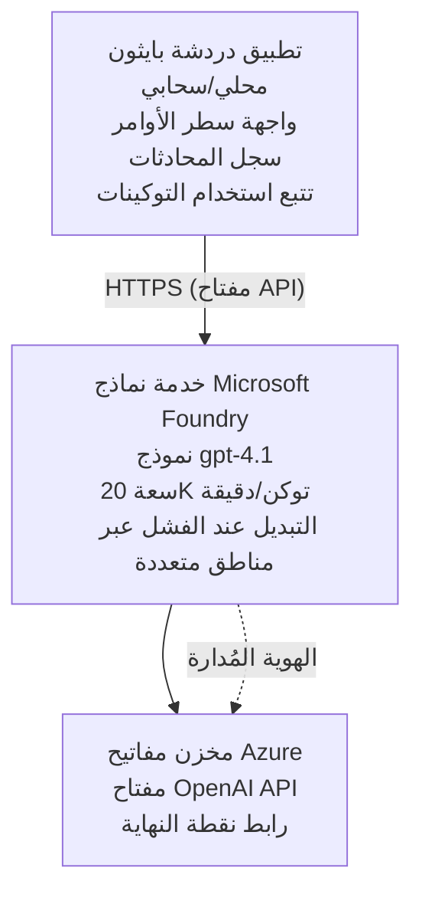

# تطبيق الدردشة لخدمات Microsoft Foundry Models

**مسار التعلم:** متوسط ⭐⭐ | **المدة:** 35-45 دقيقة | **التكلفة:** $50-200/شهريًا

تطبيق دردشة كامل لـ Microsoft Foundry Models منصّب باستخدام Azure Developer CLI (azd). يوضّح هذا المثال نشر gpt-4.1، والوصول الآمن إلى API، وواجهة دردشة بسيطة.

## 🎯 ما ستتعلم

- نشر خدمة Microsoft Foundry Models باستخدام نموذج gpt-4.1
- تأمين مفاتيح OpenAI API باستخدام Key Vault
- بناء واجهة دردشة بسيطة باستخدام Python
- مراقبة استخدام التوكن والتكاليف
- تنفيذ حد للسرعة والتعامل مع الأخطاء

## 📦 ما هو متضمن

✅ **خدمة Microsoft Foundry Models** - نشر نموذج gpt-4.1  
✅ **تطبيق دردشة Python** - واجهة دردشة بسيطة من سطر الأوامر  
✅ **تكامل Key Vault** - تخزين آمن لمفاتيح API  
✅ **قوالب ARM** - بنية تحتية كاملة ككود  
✅ **مراقبة التكلفة** - تتبع استخدام التوكن  
✅ **حد للسرعة** - منع استنزاف الحصة  

## Architecture



## المتطلبات المسبقة

### مطلوب

- **Azure Developer CLI (azd)** - [دليل التثبيت](https://learn.microsoft.com/azure/developer/azure-developer-cli/install-azd)
- **اشتراك Azure** مع وصول إلى OpenAI - [طلب الوصول](https://aka.ms/oai/access)
- **Python 3.9+** - [تثبيت Python](https://www.python.org/downloads/)

### تحقق من المتطلبات

```bash
# تحقّق من إصدار azd (مطلوب 1.5.0 أو أحدث)
azd version

# تحقّق من تسجيل الدخول إلى Azure
azd auth login

# تحقّق من إصدار Python
python --version  # أو python3 --version

# تحقّق من إمكانية الوصول إلى OpenAI (افحص ذلك في بوابة Azure)
az cognitiveservices account list-skus \
  --kind OpenAI \
  --location eastus
```

> **⚠️ هام:** يتطلب Microsoft Foundry Models موافقة على الطلب. إذا لم تقدم طلبًا بعد، قم بزيارة [aka.ms/oai/access](https://aka.ms/oai/access). عادةً ما تستغرق الموافقة 1-2 أيام عمل.

## ⏱️ الجدول الزمني للنشر

| المرحلة | المدة | ما يحدث |
|-------|----------|--------------|
| التحقق من المتطلبات | 2-3 دقائق | التحقق من توفر حصة OpenAI |
| نشر البنية التحتية | 8-12 دقيقة | إنشاء OpenAI وKey Vault ونشر النموذج |
| تهيئة التطبيق | 2-3 دقائق | إعداد البيئة والتبعيات |
| **الإجمالي** | **12-18 دقيقة** | جاهز للدردشة مع gpt-4.1 |

**ملاحظة:** قد يستغرق نشر OpenAI لأول مرة وقتًا أطول بسبب تجهيز النموذج.

## بدء سريع

```bash
# انتقل إلى المثال
cd examples/azure-openai-chat

# تهيئة البيئة
azd env new myopenai

# نشر كل شيء (البنية التحتية + التكوين)
azd up
# سيُطلب منك:
# 1. اختر اشتراك Azure
# 2. اختر موقعًا تتوفر فيه خدمة OpenAI (مثل: eastus، eastus2، westus)
# 3. انتظر من 12 إلى 18 دقيقة لإتمام النشر

# قم بتثبيت تبعيات Python
pip install -r requirements.txt

# ابدأ الدردشة!
python chat.py
```

**المخرجات المتوقعة:**
```
🤖 Microsoft Foundry Models Chat Application
Connected to: gpt-4.1 (eastus)
Type your message (or 'quit' to exit)

You: Hello! Tell me about Microsoft Foundry Models.
Assistant: Microsoft Foundry Models Service provides REST API access to OpenAI's powerful language models including gpt-4.1, GPT-3.5-Turbo, and Embeddings...

[Tokens used: 145 | Estimated cost: $0.0044]
```

## ✅ التحقق من النشر

### الخطوة 1: تحقق من موارد Azure

```bash
# عرض الموارد المنشورة
azd show

# المخرجات المتوقعة:
# - خدمة OpenAI: (اسم المورد)
# - مخزن المفاتيح: (اسم المورد)
# - النشر: gpt-4.1
# - الموقع: eastus (أو المنطقة التي اخترتها)
```

### الخطوة 2: اختبار OpenAI API

```bash
# الحصول على نقطة نهاية OpenAI والمفتاح
OPENAI_ENDPOINT=$(azd env get-value AZURE_OPENAI_ENDPOINT)
OPENAI_KEY=$(azd env get-value AZURE_OPENAI_API_KEY)

# اختبار استدعاء واجهة برمجة التطبيقات
curl "$OPENAI_ENDPOINT/openai/deployments/gpt-4.1/chat/completions?api-version=2024-08-01-preview" \
  -H "Content-Type: application/json" \
  -H "api-key: $OPENAI_KEY" \
  -d '{
    "messages": [{"role": "user", "content": "Say hello!"}],
    "max_tokens": 50
  }'
```

**الاستجابة المتوقعة:**
```json
{
  "choices": [
    {
      "message": {
        "role": "assistant",
        "content": "Hello! How can I assist you today?"
      }
    }
  ],
  "usage": {
    "prompt_tokens": 8,
    "completion_tokens": 9,
    "total_tokens": 17
  }
}
```

### الخطوة 3: التحقق من وصول Key Vault

```bash
# عرض الأسرار في مخزن المفاتيح
KV_NAME=$(azd env get-value AZURE_KEY_VAULT_NAME)

az keyvault secret list \
  --vault-name $KV_NAME \
  --query "[].name" \
  --output table
```

**الأسرار المتوقعة:**
- `openai-api-key`
- `openai-endpoint`

**معايير النجاح:**
- ✅ تم نشر خدمة OpenAI مع gpt-4.1
- ✅ استدعاء API يعيد إكمالًا صالحًا
- ✅ تم تخزين الأسرار في Key Vault
- ✅ تتبع استخدام التوكن يعمل

## هيكل المشروع

```
azure-openai-chat/
├── README.md                   ✅ This guide
├── azure.yaml                  ✅ AZD configuration
├── infra/                      ✅ Infrastructure as Code
│   ├── main.bicep             ✅ Main Bicep template
│   ├── main.parameters.json   ✅ Parameters
│   └── openai.bicep           ✅ OpenAI resource definition
├── src/                        ✅ Application code
│   ├── chat.py                ✅ Chat interface
│   ├── config.py              ✅ Configuration loader
│   └── requirements.txt       ✅ Python dependencies
└── .gitignore                  ✅ Git ignore rules
```

## ميزات التطبيق

### واجهة الدردشة (`chat.py`)

يتضمن تطبيق الدردشة:

- **سجل المحادثة** - يحافظ على السياق عبر الرسائل
- **عدّ التوكن** - يتتبع الاستخدام ويقدّر التكاليف
- **التعامل مع الأخطاء** - معالجة لطيفة لحدود السرعة وأخطاء API
- **تقدير التكلفة** - حساب التكلفة في الوقت الفعلي لكل رسالة
- **دعم التدفق** - استجابات بتدفّق اختياري

### الأوامر

أثناء الدردشة، يمكنك استخدام:
- `quit` or `exit` - إنهاء الجلسة
- `clear` - مسح سجل المحادثة
- `tokens` - عرض إجمالي استخدام التوكن
- `cost` - عرض التقدير الإجمالي للتكلفة

### الإعداد (`config.py`)

يحمّل الإعدادات من متغيرات البيئة:
```python
AZURE_OPENAI_ENDPOINT  # من مخزن المفاتيح
AZURE_OPENAI_API_KEY   # من مخزن المفاتيح
AZURE_OPENAI_MODEL     # الافتراضي: gpt-4.1
AZURE_OPENAI_MAX_TOKENS # الافتراضي: 800
```

## أمثلة الاستخدام

### دردشة أساسية

```bash
python chat.py
```

### دردشة مع نموذج مخصص

```bash
export AZURE_OPENAI_MODEL=gpt-35-turbo
python chat.py
```

### دردشة بتدفّق (Streaming)

```bash
python chat.py --stream
```

### مثال محادثة

```
You: Explain Microsoft Foundry Models Service in 3 sentences.
Assistant: Microsoft Foundry Models Service is Microsoft Azure's cloud platform offering 
that provides access to OpenAI's powerful language models. It enables developers 
to integrate capabilities like gpt-4.1 into their applications with enterprise-grade 
security and compliance. The service includes features for content filtering, 
abuse monitoring, and responsible AI practices.

[Tokens used: 89 | Estimated cost: $0.0027]

You: What models are available?
Assistant: Microsoft Foundry Models Service offers several model families including gpt-4.1 
(most capable), GPT-3.5-Turbo (faster and cost-effective), and Embeddings models 
for vector search. Each model has different capabilities, pricing, and token limits.

[Tokens used: 67 | Estimated cost: $0.0020]

Total session: 156 tokens | $0.0047
```

## إدارة التكلفة

### تسعير التوكن (gpt-4.1)

| النموذج | المدخلات (لكل 1K توكن) | المخرجات (لكل 1K توكن) |
|-------|----------------------|------------------------|
| gpt-4.1 | $0.03 | $0.06 |
| GPT-3.5-Turbo | $0.0015 | $0.002 |

### التكاليف الشهرية المقدرة

بناءً على أنماط الاستخدام:

| مستوى الاستخدام | رسائل/اليوم | توكنات/اليوم | التكلفة الشهرية |
|-------------|--------------|------------|--------------|
| **خفيف** | 20 رسائل | 3,000 توكن | $3-5 |
| **متوسط** | 100 رسائل | 15,000 توكن | $15-25 |
| **عالي** | 500 رسائل | 75,000 توكن | $75-125 |

**تكلفة البنية الأساسية الأساسية:** $1-2/شهريًا (Key Vault + قدرة حوسبة بسيطة)

### نصائح تحسين التكلفة

```bash
# 1. استخدم GPT-3.5-Turbo للمهام الأبسط (أرخص 20 مرة)
export AZURE_OPENAI_MODEL=gpt-35-turbo

# 2. قلل الحد الأقصى للتوكنات للحصول على ردود أقصر
export AZURE_OPENAI_MAX_TOKENS=400

# 3. راقب استخدام التوكنات
python chat.py --show-tokens

# 4. اضبط تنبيهات الميزانية
az consumption budget create \
  --budget-name "openai-budget" \
  --amount 50 \
  --time-grain Monthly
```

## المراقبة

### عرض استخدام التوكن

```bash
# في بوابة Azure:
# مورد OpenAI → المقاييس → اختر "Token Transaction"

# أو عبر Azure CLI:
az monitor metrics list \
  --resource $(azd env get-value AZURE_OPENAI_RESOURCE_ID) \
  --metric "TokenTransaction" \
  --start-time $(date -u -d '1 hour ago' '+%Y-%m-%dT%H:%M:%S') \
  --interval PT1M
```

### عرض سجلات API

```bash
# بث سجلات التشخيص
az monitor diagnostic-settings create \
  --resource $(azd env get-value AZURE_OPENAI_RESOURCE_ID) \
  --name openai-logs \
  --logs '[{"category": "Audit", "enabled": true}]' \
  --workspace $(azd env get-value LOG_ANALYTICS_WORKSPACE_ID)

# سجلات الاستعلام
az monitor log-analytics query \
  --workspace $(azd env get-value LOG_ANALYTICS_WORKSPACE_ID) \
  --analytics-query "AzureDiagnostics | where Category == 'Audit' | top 10 by TimeGenerated"
```

## استكشاف الأخطاء وإصلاحها

### المشكلة: "Access Denied" Error

**الأعراض:** 403 Forbidden عند استدعاء API

**الحلول:**
```bash
# 1. التحقق من الموافقة على الوصول إلى OpenAI
az cognitiveservices account show \
  --name $(azd env get-value AZURE_OPENAI_NAME) \
  --resource-group $(azd env get-value AZURE_RESOURCE_GROUP)

# 2. التحقق من أن مفتاح واجهة برمجة التطبيقات صحيح
azd env get-value AZURE_OPENAI_API_KEY

# 3. التحقق من صيغة عنوان URL لنقطة النهاية
azd env get-value AZURE_OPENAI_ENDPOINT
# يجب أن يكون: https://[name].openai.azure.com/
```

### المشكلة: "Rate Limit Exceeded"

**الأعراض:** 429 Too Many Requests

**الحلول:**
```bash
# 1. تحقق من الحصة الحالية
az cognitiveservices account deployment show \
  --name $(azd env get-value AZURE_OPENAI_NAME) \
  --resource-group $(azd env get-value AZURE_RESOURCE_GROUP) \
  --deployment-name gpt-4.1

# 2. اطلب زيادة الحصة (إذا لزم الأمر)
# انتقل إلى بوابة Azure → مورد OpenAI → الحصص → طلب زيادة

# 3. نفّذ منطق إعادة المحاولة (موجود بالفعل في chat.py)
# يقوم التطبيق بإعادة المحاولة تلقائيًا باستخدام تراجع أُسّي
```

### المشكلة: "Model Not Found"

**الأعراض:** خطأ 404 للنشر

**الحلول:**
```bash
# 1. سرد عمليات النشر المتاحة
az cognitiveservices account deployment list \
  --name $(azd env get-value AZURE_OPENAI_NAME) \
  --resource-group $(azd env get-value AZURE_RESOURCE_GROUP)

# 2. التحقق من اسم النموذج في البيئة
echo $AZURE_OPENAI_MODEL

# 3. حدّث اسم النشر إلى الاسم الصحيح
export AZURE_OPENAI_MODEL=gpt-4.1  # أو gpt-35-turbo
```

### المشكلة: High Latency

**الأعراض:** أوقات استجابة بطيئة (>5 ثوانٍ)

**الحلول:**
```bash
# ١. تحقق من زمن الاستجابة الإقليمي
# انشر في المنطقة الأقرب إلى المستخدمين

# ٢. قلل الحد الأقصى لـ max_tokens للحصول على استجابات أسرع
export AZURE_OPENAI_MAX_TOKENS=400

# ٣. استخدم البث لتحسين تجربة المستخدم
python chat.py --stream
```

## أفضل ممارسات الأمان

### 1. حماية مفاتيح API

```bash
# لا تقم بتضمين المفاتيح في نظام التحكم بالمصدر أبداً
# استخدم Key Vault (مُعدّ بالفعل)

# قم بتدوير المفاتيح بانتظام
az cognitiveservices account keys regenerate \
  --name $(azd env get-value AZURE_OPENAI_NAME) \
  --resource-group $(azd env get-value AZURE_RESOURCE_GROUP) \
  --key-name key1
```

### 2. تنفيذ تصفية المحتوى

```python
# تتضمن نماذج Microsoft Foundry تصفية محتوى مدمجة
# التكوين في بوابة Azure:
# مورد OpenAI → مرشحات المحتوى → إنشاء مرشح مخصص

# الفئات: الكراهية، المحتوى الجنسي، العنف، إيذاء النفس
# المستويات: منخفضة، متوسطة، عالية
```

### 3. استخدام Managed Identity (للإنتاج)

```bash
# لنشر في بيئة الإنتاج، استخدم الهوية المُدارة
# بدلاً من مفاتيح API (يتطلب استضافة التطبيق على Azure)

# قم بتحديث infra/openai.bicep ليشمل:
# identity: { type: 'SystemAssigned' }
```

## التطوير

### التشغيل محليًا

```bash
# تثبيت التبعيات
pip install -r src/requirements.txt

# تعيين متغيرات البيئة
export AZURE_OPENAI_ENDPOINT="https://[name].openai.azure.com/"
export AZURE_OPENAI_API_KEY="your-api-key"
export AZURE_OPENAI_MODEL="gpt-4.1"

# تشغيل التطبيق
python src/chat.py
```

### تشغيل الاختبارات

```bash
# تثبيت تبعيات الاختبار
pip install pytest pytest-cov

# تشغيل الاختبارات
pytest tests/ -v

# مع تغطية الكود
pytest tests/ --cov=src --cov-report=html
```

### تحديث نشر النموذج

```bash
# نشر إصدار مختلف من النموذج
az cognitiveservices account deployment create \
  --name $(azd env get-value AZURE_OPENAI_NAME) \
  --resource-group $(azd env get-value AZURE_RESOURCE_GROUP) \
  --deployment-name gpt-35-turbo \
  --model-name gpt-35-turbo \
  --model-version "0613" \
  --model-format OpenAI \
  --sku-capacity 20 \
  --sku-name "Standard"
```

## التنظيف

```bash
# حذف كل موارد Azure
azd down --force --purge

# هذا يزيل:
# - خدمة OpenAI
# - مخزن المفاتيح (مع حذف ناعم لمدة 90 يومًا)
# - مجموعة الموارد
# - جميع عمليات النشر والتكوينات
```

## الخطوات التالية

### توسيع هذا المثال

1. **إضافة واجهة ويب** - بناء واجهة أمامية بـ React/Vue
   ```bash
   # أضف خدمة الواجهة الأمامية إلى azure.yaml
   # انشر إلى Azure Static Web Apps
   ```

2. **تنفيذ RAG** - إضافة بحث في الوثائق باستخدام Azure AI Search
   ```python
   # دمج Azure AI Search
   # تحميل المستندات وإنشاء فهرس المتجهات
   ```

3. **إضافة استدعاء الدوال (Function Calling)** - تمكين استخدام الأدوات
   ```python
   # عرّف الدوال في chat.py
   # اسمح لـ gpt-4.1 باستدعاء واجهات برمجة التطبيقات الخارجية
   ```

4. **دعم متعدد النماذج** - نشر نماذج متعددة
   ```bash
   # أضف gpt-35-turbo ونماذج التضمين
   # نفّذ منطق توجيه النماذج
   ```

### أمثلة ذات صلة

- **[Retail Multi-Agent](../retail-scenario.md)** - هندسة متعددة الوكلاء متقدمة
- **[Database App](../../../../examples/database-app)** - إضافة تخزين دائم
- **[Container Apps](../../../../examples/container-app)** - النشر كخدمة محوّية بالحاويات

### موارد التعلم

- 📚 [AZD For Beginners Course](../../README.md) - الصفحة الرئيسية للدورة
- 📚 [Microsoft Foundry Models Documentation](https://learn.microsoft.com/azure/ai-services/openai/) - الوثائق الرسمية
- 📚 [OpenAI API Reference](https://platform.openai.com/docs/api-reference) - تفاصيل API
- 📚 [Responsible AI](https://www.microsoft.com/ai/responsible-ai) - أفضل الممارسات

## موارد إضافية

### الوثائق
- **[Microsoft Foundry Models Service](https://learn.microsoft.com/azure/ai-services/openai/)** - الدليل الكامل
- **[gpt-4.1 Models](https://learn.microsoft.com/azure/ai-services/openai/concepts/models)** - قدرات النموذج
- **[Content Filtering](https://learn.microsoft.com/azure/ai-services/openai/concepts/content-filter)** - ميزات الأمان
- **[Azure Developer CLI](https://learn.microsoft.com/azure/developer/azure-developer-cli/)** - مرجع azd

### البرامج التعليمية
- **[OpenAI Quickstart](https://learn.microsoft.com/azure/ai-services/openai/quickstart)** - أول نشر
- **[Chat Completions](https://learn.microsoft.com/azure/ai-services/openai/how-to/chatgpt)** - بناء تطبيقات الدردشة
- **[Function Calling](https://learn.microsoft.com/azure/ai-services/openai/how-to/function-calling)** - ميزات متقدمة

### الأدوات
- **[Microsoft Foundry Models Studio](https://oai.azure.com/)** - واجهة تجريبية على الويب
- **[Prompt Engineering Guide](https://platform.openai.com/docs/guides/prompt-engineering)** - كتابة مطالبات أفضل
- **[Token Calculator](https://platform.openai.com/tokenizer)** - تقدير استخدام التوكن

### المجتمع
- **[Azure AI Discord](https://discord.gg/azure)** - احصل على مساعدة من المجتمع
- **[GitHub Discussions](https://github.com/Azure-Samples/openai/discussions)** - منتدى الأسئلة والأجوبة
- **[Azure Blog](https://azure.microsoft.com/blog/tag/azure-openai-service/)** - أحدث التحديثات

---

**🎉 نجحت!** لقد نشرت Microsoft Foundry Models وبنيت تطبيق دردشة يعمل. ابدأ باستكشاف قدرات gpt-4.1 وجرّب مطالبات وحالات استخدام مختلفة.

**أسئلة؟** [افتح تذكرة](https://github.com/microsoft/AZD-for-beginners/issues) أو راجع [الأسئلة الشائعة](../../resources/faq.md)

**تنبيه التكلفة:** تذكّر تشغيل `azd down` عند الانتهاء من الاختبار لتجنب تكاليف مستمرة (~$50-100/شهريًا للاستخدام النشط).

---

<!-- CO-OP TRANSLATOR DISCLAIMER START -->
**تنويه**:
تمت ترجمة هذا المستند باستخدام خدمة الترجمة بالذكاء الاصطناعي [Co-op Translator](https://github.com/Azure/co-op-translator). بينما نسعى للدقة، يرجى العلم أن الترجمات الآلية قد تحتوي على أخطاء أو عدم دقة. يجب اعتبار المستند الأصلي بلغته الأصلية المصدر الرسمي والمعتمد. للمعلومات الهامة، يُنصح بالاستعانة بترجمة بشرية محترفة. نحن غير مسؤولين عن أي سوء فهم أو تفسير ناتج عن استخدام هذه الترجمة.
<!-- CO-OP TRANSLATOR DISCLAIMER END -->