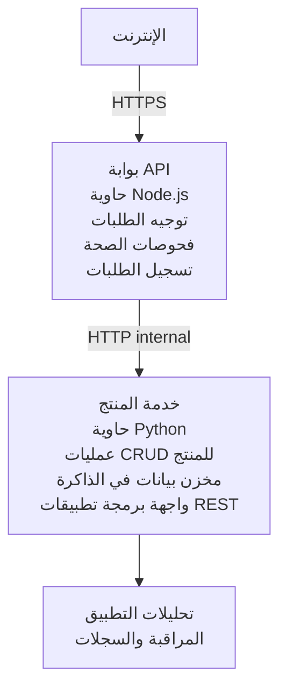

# هندسة الخدمات المصغرة - مثال لتطبيق الحاويات

⏱️ **الوقت المُقدر**: 25-35 دقيقة | 💰 **التكلفة المُقدرة**: ~$50-100/شهر | ⭐ **التعقيد**: متقدم

هندسة خدمات مصغرة مبسطة لكنها عملية منشورة إلى Azure Container Apps باستخدام AZD CLI. يوضح هذا المثال الاتصال من خدمة إلى خدمة، تنظيم الحاويات، والمراقبة بإعداد عملي مكوّن من خدمتين.

> **📚 منهج التعلم**: يبدأ هذا المثال بهيكل بسيط مكوّن من خدمتين فقط (بوابة API + خدمة خلفية) يمكنك نشره فعليًا والتعلم منه. بعد إتقان هذا الأساس، نوفر إرشادات لتوسيع النظام إلى منظومة كاملة من الخدمات المصغرة.

## ماذا ستتعلم

من خلال إكمال هذا المثال، سوف:
- نشر حاويات متعددة إلى Azure Container Apps
- تنفيذ اتصال خدمة إلى خدمة عبر الشبكات الداخلية
- تكوين التحجيم بناءً على البيئة وفحوصات الصحة
- مراقبة التطبيقات الموزعة باستخدام Application Insights
- فهم أنماط نشر الخدمات المصغرة وأفضل الممارسات
- تعلم التوسع التقدمي من هندسة بسيطة إلى معقدة

## الهندسة المعمارية

### المرحلة 1: ما الذي نبنيه (مضمن في هذا المثال)


**لماذا نبدأ ببساطة؟**
- ✅ النشر والفهم بسرعة (25-35 دقيقة)
- ✅ تعلم الأنماط الأساسية للخدمات المصغرة بدون تعقيد
- ✅ كود عملي يمكنك تعديله والتجربة عليه
- ✅ تكلفة أقل للتعلم (~$50-100/شهر مقابل $300-1400/شهر)
- ✅ بناء ثقة قبل إضافة قواعد بيانات وقوائم رسائل

**التشبيه**: فكر في هذا كتعلم القيادة. تبدأ بساحة انتظار فارغة (خدمتان)، تتقن الأساسيات، ثم تنتقل إلى ازدحام المدينة (5+ خدمات مع قواعد بيانات).

### المرحلة 2: التوسع المستقبلي (المرجع المعماري)

بمجرد أن تتقن هندسة الخدمتين، يمكنك التوسع إلى:

```
Full Architecture (Not Included - For Reference)
├── API Gateway (✅ Included)
├── Product Service (✅ Included)
├── Order Service (🔜 Add next)
├── User Service (🔜 Add next)
├── Notification Service (🔜 Add last)
├── Azure Service Bus (🔜 For async communication)
├── Cosmos DB (🔜 For product persistence)
├── Azure SQL (🔜 For order management)
└── Azure Storage (🔜 For file storage)
```

انظر قسم "دليل التوسع" في النهاية للحصول على إرشادات خطوة بخطوة.

## الميزات المضمنة

✅ **اكتشاف الخدمات**: اكتشاف تلقائي قائم على DNS بين الحاويات  
✅ **توازن التحميل**: توازن تحميل مدمج عبر النسخ  
✅ **التحجيم التلقائي**: تحجيم مستقل لكل خدمة بناءً على طلبات HTTP  
✅ **مراقبة الصحة**: فحوصات liveness وreadiness لكلتا الخدمتين  
✅ **تجميع السجلات**: تسجيل مركزي باستخدام Application Insights  
✅ **الشبكات الداخلية**: اتصال آمن خدمة إلى خدمة  
✅ **تنسيق الحاويات**: نشر وتحجيم تلقائي  
✅ **تحديثات بلا توقف**: تحديثات تدريجية مع إدارة الإصدارات  

## المتطلبات المسبقة

### الأدوات المطلوبة

قبل البدء، تحقّق من تثبيت الأدوات التالية:

1. **[Azure Developer CLI (azd)](https://learn.microsoft.com/azure/developer/azure-developer-cli/install-azd)** (الإصدار 1.0.0 أو أعلى)
   ```bash
   azd version
   # المخرجات المتوقعة: إصدار azd 1.0.0 أو أحدث
   ```

2. **[Azure CLI](https://learn.microsoft.com/cli/azure/install-azure-cli)** (الإصدار 2.50.0 أو أعلى)
   ```bash
   az --version
   # المخرجات المتوقعة: azure-cli 2.50.0 أو أعلى
   ```

3. **[Docker](https://www.docker.com/get-started)** (للتطوير/الاختبار المحلي - اختياري)
   ```bash
   docker --version
   # المخرجات المتوقعة: إصدار Docker 20.10 أو أعلى
   ```

### متطلبات Azure

- اشتراك Azure نشط ([create a free account](https://azure.microsoft.com/free/))
- صلاحيات لإنشاء الموارد في اشتراكك
- دور **Contributor** على الاشتراك أو مجموعة الموارد

### المتطلبات المعرفية

هذا مثال بمستوى متقدم. ينبغي أن تكون قد:
- أكملت مثال [Simple Flask API example](../../../../../examples/container-app/simple-flask-api) 
- فهمًا أساسيًا لهندسة الخدمات المصغرة
- إلمامًا بـ REST APIs وHTTP
- فهمًا لمفاهيم الحاويات

**جديد على Container Apps؟** ابدأ بمثال [Simple Flask API example](../../../../../examples/container-app/simple-flask-api) أولاً لتعلّم الأساسيات.

## بداية سريعة (خطوة بخطوة)

### الخطوة 1: استنساخ والتنقل

```bash
git clone https://github.com/microsoft/AZD-for-beginners.git
cd AZD-for-beginners/examples/container-app/microservices
```

**✓ فحص النجاح**: تحقق من رؤية `azure.yaml`:
```bash
ls
# المتوقع: README.md, azure.yaml, infra/, src/
```

### الخطوة 2: المصادقة مع Azure

```bash
azd auth login
```

يفتح هذا متصفحك لمصادقة Azure. سجّل الدخول باستخدام بيانات اعتماد Azure الخاصة بك.

**✓ فحص النجاح**: يجب أن ترى:
```
Logged in to Azure.
```

### الخطوة 3: تهيئة البيئة

```bash
azd init
```

**المطالبات التي سترى**:
- **اسم البيئة**: أدخل اسمًا قصيرًا (مثال: `microservices-dev`)
- **اشتراك Azure**: اختر اشتراكك
- **موقع Azure**: اختر منطقة (مثال: `eastus`, `westeurope`)

**✓ فحص النجاح**: يجب أن ترى:
```
SUCCESS: New project initialized!
```

### الخطوة 4: نشر البنية التحتية والخدمات

```bash
azd up
```

**ما الذي يحدث** (يستغرق 8-12 دقيقة):
1. ينشئ بيئة Container Apps
2. ينشئ Application Insights للمراقبة
3. يبني حاوية بوابة API (Node.js)
4. يبني حاوية خدمة المنتجات (Python)
5. ينشر الحاويتين إلى Azure
6. يهيئ الشبكات وفحوصات الصحة
7. يضبط المراقبة والتسجيل

**✓ فحص النجاح**: يجب أن ترى:
```
SUCCESS: Your application was deployed to Azure in X minutes Y seconds.
Endpoint: https://api-gateway-<unique-id>.azurecontainerapps.io
```

**⏱️ الوقت**: 8-12 دقيقة

### الخطوة 5: اختبار النشر

```bash
# الحصول على نقطة النهاية للبوابة
GATEWAY_URL=$(azd env get-values | grep API_GATEWAY_URL | cut -d '=' -f2 | tr -d '"')

# اختبار صحة بوابة API
curl $GATEWAY_URL/health

# الإخراج المتوقع:
# {"الحالة":"سليم","الخدمة":"بوابة API","الطابع الزمني":"2025-11-19T10:30:00Z"}
```

**اختبر خدمة المنتجات عبر البوابة**:
```bash
# قائمة المنتجات
curl $GATEWAY_URL/api/products

# المخرجات المتوقعة:
# [
#   {"id":1,"name":"حاسوب محمول","price":999.99,"stock":50},
#   {"id":2,"name":"فأرة","price":29.99,"stock":200},
#   {"id":3,"name":"لوحة مفاتيح","price":79.99,"stock":150}
# ]
```

**✓ فحص النجاح**: كلا الطرفين يعيدان بيانات JSON بدون أخطاء.

---

**🎉 تهانينا!** لقد نشرت هندسة خدمات مصغرة على Azure!

## هيكل المشروع

جميع ملفات التنفيذ مشمولة—هذا مثال كامل وعملي:

```
microservices/
│
├── README.md                         # This file
├── azure.yaml                        # AZD configuration
├── .gitignore                        # Git ignore patterns
│
├── infra/                           # Infrastructure as Code (Bicep)
│   ├── main.bicep                   # Main orchestration
│   ├── abbreviations.json           # Naming conventions
│   ├── core/                        # Shared infrastructure
│   │   ├── container-apps-environment.bicep  # Container environment + registry
│   │   └── monitor.bicep            # Application Insights + Log Analytics
│   └── app/                         # Service definitions
│       ├── api-gateway.bicep        # API Gateway container app
│       └── product-service.bicep    # Product Service container app
│
└── src/                             # Application source code
    ├── api-gateway/                 # Node.js API Gateway
    │   ├── app.js                   # Express server with routing
    │   ├── package.json             # Node dependencies
    │   └── Dockerfile               # Container definition
    └── product-service/             # Python Product Service
        ├── main.py                  # Flask API with product data
        ├── requirements.txt         # Python dependencies
        └── Dockerfile               # Container definition
```

**ما الذي يقوم به كل مكوّن:**

**Infrastructure (infra/)**:
- `main.bicep`: ينسق جميع موارد Azure واعتمادياتها
- `core/container-apps-environment.bicep`: ينشئ بيئة Container Apps وAzure Container Registry
- `core/monitor.bicep`: يهيئ Application Insights لتجميع السجلات الموزعة
- `app/*.bicep`: تعريفات تطبيقات الحاوية الفردية مع التحجيم وفحوصات الصحة

**API Gateway (src/api-gateway/)**:
- خدمة مواجهة للجمهور تقوم بتوجيه الطلبات إلى الخدمات الخلفية
- تنفذ التسجيل، معالجة الأخطاء، وإعادة توجيه الطلبات
- توضح اتصال HTTP من خدمة إلى خدمة

**Product Service (src/product-service/)**:
- خدمة داخلية مع كاتالوج منتجات (في الذاكرة للبساطة)
- REST API مع فحوصات صحة
- مثال على نمط خدمة خلفية في الخدمات المصغرة

## نظرة عامة على الخدمات

### API Gateway (Node.js/Express)

**المنفذ**: 8080  
**الوصول**: عام (ingress خارجي)  
**الغرض**: يوجّه الطلبات الواردة إلى الخدمات الخلفية المناسبة  

**نقاط النهاية**:
- `GET /` - معلومات الخدمة
- `GET /health` - نقطة فحص الصحة
- `GET /api/products` - يعيد توجيه إلى خدمة المنتجات (قائمة كاملة)
- `GET /api/products/:id` - يعيد توجيه إلى خدمة المنتجات (الحصول حسب المعرف)

**الميزات الرئيسية**:
- توجيه الطلبات باستخدام axios
- تسجيل مركزي
- معالجة الأخطاء وإدارة المهلات
- اكتشاف الخدمات عبر متغيرات البيئة
- تكامل مع Application Insights

**تسليط الضوء على الكود** (`src/api-gateway/app.js`):
```javascript
// الاتصال الداخلي بين الخدمات
app.get('/api/products', async (req, res) => {
  const response = await axios.get(`${PRODUCT_SERVICE_URL}/products`);
  res.json(response.data);
});
```

### Product Service (Python/Flask)

**المنفذ**: 8000  
**الوصول**: داخلي فقط (بدون دخول خارجي)  
**الغرض**: إدارة كاتالوج المنتجات ببيانات في الذاكرة  

**نقاط النهاية**:
- `GET /` - معلومات الخدمة
- `GET /health` - نقطة فحص الصحة
- `GET /products` - عرض جميع المنتجات
- `GET /products/<id>` - الحصول على منتج حسب المعرف

**الميزات الرئيسية**:
- RESTful API باستخدام Flask
- متجر منتجات في الذاكرة (بسيط، لا حاجة لقاعدة بيانات)
- مراقبة الصحة عبر الفحوصات
- تسجيل منظم
- تكامل مع Application Insights

**نموذج البيانات**:
```python
{
  "id": 1,
  "name": "Laptop",
  "description": "High-performance laptop",
  "price": 999.99,
  "stock": 50
}
```

**لماذا داخلي فقط؟**
خدمة المنتجات ليست معرضة للعامة. يجب أن تمر جميع الطلبات عبر بوابة API، التي توفر:
- الأمان: نقطة وصول مُتحكم بها
- المرونة: إمكانية تغيير الخلفية دون التأثير على العملاء
- المراقبة: تسجيل مركزي للطلبات

## فهم اتصال الخدمات

### كيف تتحدث الخدمات مع بعضها

في هذا المثال، تتواصل بوابة API مع خدمة المنتجات باستخدام **نداءات HTTP داخلية**:

```javascript
// بوابة واجهة برمجة التطبيقات (src/api-gateway/app.js)
const PRODUCT_SERVICE_URL = process.env.PRODUCT_SERVICE_URL;

// إجراء طلب HTTP داخلي
const response = await axios.get(`${PRODUCT_SERVICE_URL}/products`);
```

**النقاط الرئيسية**:

1. **الاكتشاف القائم على DNS**: توفر Container Apps تلقائيًا DNS للخدمات الداخلية
   - Product Service FQDN: `product-service.internal.<environment>.azurecontainerapps.io`
   - مُبسط كـ: `http://product-service` (تقوم Container Apps بحلها)

2. **لا تعرض للعامة**: خدمة المنتجات لديها `external: false` في Bicep
   - قابلة للوصول فقط داخل بيئة Container Apps
   - لا يمكن الوصول إليها من الإنترنت

3. **متغيرات البيئة**: يتم حقن عناوين الخدمات عند وقت النشر
   - يمرر Bicep FQDN الداخلي إلى البوابة
   - لا توجد عناوين URL مشفرة في كود التطبيق

**التشبيه**: فكر في هذا مثل غرف المكاتب. بوابة API هي مكتب الاستقبال (مواجهة للعامة)، وخدمة المنتجات هي غرفة مكتب (داخلية فقط). يجب على الزوار المرور عبر الاستقبال للوصول إلى أي مكتب.

## خيارات النشر

### النشر الكامل (موصى به)

```bash
# نشر البنية التحتية والخدمتين
azd up
```

يقوم هذا بالنشر:
1. بيئة Container Apps
2. Application Insights
3. Container Registry
4. حاوية بوابة API
5. حاوية خدمة المنتجات

**الوقت**: 8-12 دقيقة

### نشر خدمة فردية

```bash
# انشر خدمة واحدة فقط (بعد الأمر azd up الأولي)
azd deploy api-gateway

# أو انشر خدمة المنتج
azd deploy product-service
```

**حالة الاستخدام**: عندما تقوم بتحديث الكود في خدمة واحدة وتريد إعادة نشر تلك الخدمة فقط.

### تحديث التكوين

```bash
# غيّر معلمات التحجيم
azd env set GATEWAY_MAX_REPLICAS 30

# أعد النشر بالتكوين الجديد
azd up
```

## التكوين

### تكوين التحجيم

كلا الخدمتين مضبوطتان على التحجيم التلقائي القائم على HTTP في ملفات Bicep الخاصة بهما:

**API Gateway**:
- الحد الأدنى للنسخ: 2 (دائمًا على الأقل 2 للتوافر)
- الحد الأقصى للنسخ: 20
- مُشغّل التحجيم: 50 طلب متزامن لكل نسخة

**Product Service**:
- الحد الأدنى للنسخ: 1 (يمكن أن يتدرج إلى الصفر إذا لزم الأمر)
- الحد الأقصى للنسخ: 10
- مُشغّل التحجيم: 100 طلب متزامن لكل نسخة

**تخصيص التحجيم** (في `infra/app/*.bicep`):
```bicep
scale: {
  minReplicas: 1
  maxReplicas: 10
  rules: [
    {
      name: 'http-scale-rule'
      http: {
        metadata: {
          concurrentRequests: '100'  // Adjust this
        }
      }
    }
  ]
}
```

### تخصيص الموارد

**API Gateway**:
- CPU: 1.0 vCPU
- الذاكرة: 2 GiB
- السبب: تعالج كل الحركة الخارجية

**Product Service**:
- CPU: 0.5 vCPU
- الذاكرة: 1 GiB
- السبب: عمليات خفيفة في الذاكرة

### فحوصات الصحة

كلا الخدمتين تتضمن فحوصات liveness وreadiness:

```bicep
probes: [
  {
    type: 'Liveness'
    httpGet: {
      path: '/health'
      port: 8080
    }
    initialDelaySeconds: 10
    periodSeconds: 30
  }
  {
    type: 'Readiness'
    httpGet: {
      path: '/health'
      port: 8080
    }
    initialDelaySeconds: 5
    periodSeconds: 10
  }
]
```

**ما يعنيه هذا**:
- **Liveness**: إذا فشل فحص الصحة، تقوم Container Apps بإعادة تشغيل الحاوية
- **Readiness**: إذا لم تكن جاهزة، تتوقف Container Apps عن توجيه الحركة إلى تلك النسخة


## المراقبة وقابلية الملاحظة

### عرض سجلات الخدمة

```bash
# عرض السجلات باستخدام azd monitor
azd monitor --logs

# أو استخدم Azure CLI لتطبيقات الحاويات المحددة:
# بث السجلات من بوابة API
az containerapp logs show --name api-gateway --resource-group $RG_NAME --follow

# عرض سجلات خدمة المنتج الأخيرة
az containerapp logs show --name product-service --resource-group $RG_NAME --tail 100
```

**المخرجات المتوقعة**:
```
[api-gateway] API Gateway listening on port 8080
[api-gateway] Product Service URL: http://product-service
[api-gateway] GET /api/products 200 - 45ms
[product-service] Retrieved 5 products
```

### استعلامات Application Insights

ادخل إلى Application Insights في بوابة Azure، ثم نفّذ هذه الاستعلامات:

**إيجاد الطلبات البطيئة**:
```kusto
requests
| where timestamp > ago(1h)
| where duration > 1000  // Requests taking >1 second
| summarize count() by name, cloud_RoleName
| order by count_ desc
```

**تتبع مكالمات خدمة إلى خدمة**:
```kusto
dependencies
| where timestamp > ago(1h)
| where type == "Http"
| project timestamp, name, target, duration, success
| order by timestamp desc
```

**معدل الأخطاء حسب الخدمة**:
```kusto
exceptions
| where timestamp > ago(24h)
| summarize errorCount = count() by cloud_RoleName, type
| order by errorCount desc
```

**حجم الطلبات عبر الزمن**:
```kusto
requests
| where timestamp > ago(1h)
| summarize requestCount = count() by bin(timestamp, 5m), cloud_RoleName
| render timechart
```

### الوصول إلى لوحة مراقبة المراقبة

```bash
# الحصول على تفاصيل Application Insights
azd env get-values | grep APPLICATIONINSIGHTS

# افتح المراقبة في بوابة Azure
az monitor app-insights component show \
  --app $(azd env get-values | grep APPLICATIONINSIGHTS_CONNECTION_STRING | cut -d '=' -f2) \
  --resource-group $(azd env get-values | grep AZURE_RESOURCE_GROUP | cut -d '=' -f2) \
  --query "appId" -o tsv
```

### المقاييس الحية

1. انتقل إلى Application Insights في بوابة Azure
2. انقر على "Live Metrics"
3. اطلع على الطلبات، الفشل، والأداء في الوقت الحقيقي
4. اختبار بالتشغيل: `curl $(azd env get-values | grep API_GATEWAY_URL | cut -d '=' -f2 | tr -d '"')/api/products`

## التمارين العملية

[ملاحظة: انظر التمارين الكاملة أعلاه في قسم "التمارين العملية" للحصول على تمارين تفصيلية خطوة بخطوة تتضمن التحقق من النشر، تعديل البيانات، اختبارات التحجيم التلقائي، معالجة الأخطاء، وإضافة خدمة ثالثة.]

## تحليل التكلفة

### التكاليف الشهرية المُقدرة (لهذا المثال المكون من خدمتين)

| المورد | التكوين | التكلفة المقدرة |
|----------|--------------|----------------|
| بوابة API | 2-20 نسخ، 1 vCPU، 2GB RAM | $30-150 |
| خدمة المنتجات | 1-10 نسخ، 0.5 vCPU، 1GB RAM | $15-75 |
| سجل الحاويات | الطبقة الأساسية | $5 |
| Application Insights | 1-2 GB/شهر | $5-10 |
| Log Analytics | 1 GB/شهر | $3 |
| **الإجمالي** | | **$58-243/month** |

**تفصيل التكلفة حسب الاستخدام**:
- **حركة خفيفة** (اختبار/تعلم): ~$60/شهر
- **حركة متوسطة** (إنتاج صغير): ~$120/شهر
- **حركة عالية** (فترات مزدحمة): ~$240/شهر

### نصائح تحسين التكلفة

1. **التحجيم إلى الصفر للتطوير**:
   ```bicep
   scale: {
     minReplicas: 0  // Save $30-40/month when not in use
     maxReplicas: 10
   }
   ```

2. **استخدم خطة الاستهلاك لـ Cosmos DB** (عند إضافتها):
   - ادفع فقط مقابل ما تستخدمه
   - لا توجد رسوم دنيا

3. **اضبط أخذ عينات Application Insights**:
   ```javascript
   appInsights.defaultClient.config.samplingPercentage = 50; // خذ عينة من ٥٠٪ من الطلبات
   ```

4. **نظف الموارد عند عدم الحاجة**:
   ```bash
   azd down
   ```

### خيارات المستوى المجاني

للتعلّم/الاختبار، ضع في اعتبارك:
- استخدم أرصدة Azure المجانية (أول 30 يومًا)
- احتفظ بأدنى عدد من النسخ
- احذف بعد الاختبار (لا توجد رسوم مستمرة)

---

## تنظيف

لتجنب الرسوم المستمرة، احذف كل الموارد:

```bash
azd down --force --purge
```

**موجه التأكيد**:
```
? Total resources to delete: 6, are you sure you want to continue? (y/N)
```

اكتب `y` للتأكيد.

**ما الذي سيتم حذفه**:
- بيئة Container Apps
- كلا تطبيقي Container Apps (البوابة وخدمة المنتج)
- Container Registry
- Application Insights
- Log Analytics Workspace
- Resource Group

**✓ تحقق من التنظيف**:
```bash
az group list --query "[?starts_with(name,'rg-microservices')]" --output table
```

يجب أن تُرجع فارغًا.

---

## دليل التوسع: من خدمتين إلى 5+ خدمات

بمجرد أن تتقن هذه البنية المكونة من خدمتين، إليك كيفية التوسع:

### المرحلة 1: إضافة تخزين قاعدة بيانات دائم (الخطوة التالية)

**أضف Cosmos DB لخدمة المنتج**:

1. أنشئ `infra/core/cosmos.bicep`:
   ```bicep
   resource cosmosAccount 'Microsoft.DocumentDB/databaseAccounts@2023-04-15' = {
     name: name
     location: location
     kind: 'GlobalDocumentDB'
     properties: {
       databaseAccountOfferType: 'Standard'
       locations: [{ locationName: location, failoverPriority: 0 }]
     }
   }
   ```

2. حدّث خدمة المنتج لاستخدام Cosmos DB بدلًا من البيانات المحفوظة في الذاكرة

3. التكلفة الإضافية المقدرة: ~$25/شهريًا (serverless)

### المرحلة 2: إضافة خدمة ثالثة (إدارة الطلبات)

**أنشئ خدمة الطلبات**:

1. مجلد جديد: `src/order-service/` (Python/Node.js/C#)
2. Bicep جديد: `infra/app/order-service.bicep`
3. حدّث API Gateway لتوجيه `/api/orders`
4. أضف Azure SQL Database لتخزين الطلبات

**تصبح البنية المعمارية**:
```
API Gateway → Product Service (Cosmos DB)
           → Order Service (Azure SQL)
```

### المرحلة 3: إضافة تواصل غير متزامن (Service Bus)

**تنفيذ بنية معتمدة على الأحداث**:

1. أضف Azure Service Bus: `infra/core/servicebus.bicep`
2. تقوم خدمة المنتج بنشر أحداث "ProductCreated"
3. تقوم خدمة الطلبات بالاشتراك في أحداث المنتج
4. أضف خدمة الإشعارات لمعالجة الأحداث

**النمط**: طلب/استجابة (HTTP) + معتمد على الأحداث (Service Bus)

### المرحلة 4: إضافة مصادقة المستخدم

**تنفيذ خدمة المستخدم**:

1. أنشئ `src/user-service/` (Go/Node.js)
2. أضف Azure AD B2C أو مصادقة JWT مخصصة
3. يتحقق API Gateway من الرموز
4. تتحقق الخدمات من أذونات المستخدم

### المرحلة 5: الجاهزية للإنتاج

**أضف هذه المكوّنات**:
- Azure Front Door (موازنة حمل عالمية)
- Azure Key Vault (إدارة الأسرار)
- Azure Monitor Workbooks (لوحات معلومات مخصصة)
- خط أنابيب CI/CD (GitHub Actions)
- نشر بنمط Blue-Green
- Managed Identity لجميع الخدمات

**تكلفة البنية الكاملة للإنتاج**: ~$300-1,400/شهريًا

---

## تعلّم المزيد

### الوثائق ذات الصلة
- [توثيق Azure Container Apps](https://learn.microsoft.com/azure/container-apps/)
- [دليل هندسة الميكروسيرفيسز](https://learn.microsoft.com/azure/architecture/guide/architecture-styles/microservices)
- [Application Insights للتتبع الموزع](https://learn.microsoft.com/azure/azure-monitor/app/distributed-tracing)
- [توثيق Azure Developer CLI](https://learn.microsoft.com/azure/developer/azure-developer-cli/)

### الخطوات التالية في هذه الدورة
- ← السابق: [API بسيطة باستخدام Flask](../../../../../examples/container-app/simple-flask-api) - مثال مبتدئ لحاوية مفردة
- → التالي: [دليل تكامل الذكاء الاصطناعي](../../../../../examples/docs/ai-foundry) - أضف قدرات الذكاء الاصطناعي
- 🏠 [الصفحة الرئيسية للدورة](../../README.md)

### المقارنة: متى تستخدم كل خيار

**تطبيق حاوية مفردة** (مثال API بسيطة بـ Flask):
- ✅ تطبيقات بسيطة
- ✅ بنية أحادية
- ✅ سريعة النشر
- ❌ قدرة محدودة على التوسع
- **التكلفة**: ~$15-50/شهريًا

**الخدمات المصغرة** (هذا المثال):
- ✅ تطبيقات معقدة
- ✅ قابلية التوسع مستقلة لكل خدمة
- ✅ استقلالية الفرق (خدمات مختلفة، فرق مختلفة)
- ❌ أكثر تعقيدًا في الإدارة
- **التكلفة**: ~$60-250/شهريًا

**Kubernetes (AKS)**:
- ✅ أقصى درجات التحكم والمرونة
- ✅ قابلية النقل عبر سحابات متعددة
- ✅ شبكات متقدمة
- ❌ يتطلب خبرة في Kubernetes
- **التكلفة**: ~$150-500/شهريًا كحد أدنى

**التوصية**: ابدأ بـ Container Apps (هذا المثال)، وانتقل إلى AKS فقط إذا كنت بحاجة إلى ميزات خاصة بـ Kubernetes.

---

## الأسئلة الشائعة

**س: لماذا خدمتان فقط بدلاً من 5+؟**  
ج: التدرج التعليمي. اتقن الأساسيات (اتصال الخدمات، المراقبة، التوسع) بمثال بسيط قبل إضافة التعقيد. الأنماط التي تتعلمها هنا قابلة للتطبيق على بنى مكوّنة من 100 خدمة.

**س: هل يمكنني إضافة خدمات أكثر بنفسي؟**  
ج: بالتأكيد! اتبع دليل التوسع أعلاه. كل خدمة جديدة تتبع نفس النمط: إنشاء مجلد src، إنشاء ملف Bicep، تحديث azure.yaml، النشر.

**س: هل هذا جاهز للإنتاج؟**  
ج: إنه أساس متين. للإنتاج، أضف: managed identity، Key Vault، قواعد بيانات دائمة، خط أنابيب CI/CD، تنبيهات المراقبة، واستراتيجية نسخ احتياطية.

**س: لماذا لا نستخدم Dapr أو خدمة mesh أخرى؟**  
ج: اجعلها بسيطة للتعلم. بمجرد أن تفهم شبكات Container Apps الأصلية، يمكنك إضافة Dapr للسيناريوهات المتقدمة.

**س: كيف أقوم بالتصحيح محليًا؟**  
ج: شغّل الخدمات محليًا باستخدام Docker:
```bash
cd src/api-gateway
docker build -t local-gateway .
docker run -p 8080:8080 -e PRODUCT_SERVICE_URL=http://localhost:8000 local-gateway
```

**س: هل يمكنني استخدام لغات برمجة مختلفة؟**  
ج: نعم! يظهر هذا المثال Node.js (البوابة) + Python (خدمة المنتج). يمكنك مزج أي لغات تعمل في حاويات.

**س: ماذا لو لم تكن لدي أرصدة Azure؟**  
ج: استخدم المستوى المجاني من Azure (أول 30 يومًا للحسابات الجديدة) أو انشر لفترات اختبار قصيرة واحذف فورًا.

---

> **🎓 ملخّص مسار التعلم**: لقد تعلمت نشر بنية متعددة الخدمات مع التوسع التلقائي، الشبكات الداخلية، المراقبة المركزية، وأنماط جاهزة للإنتاج. هذا الأساس يجهّزك لأنظمة موزعة معقدة وبُنى خدمات مصغرة للمؤسسات.

**📚 تنقل الدورة:**
- ← السابق: [API بسيطة باستخدام Flask](../../../../../examples/container-app/simple-flask-api)
- → التالي: [مثال دمج قاعدة بيانات](../../../../../examples/database-app)
- 🏠 [الصفحة الرئيسية للدورة](../../../README.md)
- 📖 [أفضل ممارسات Container Apps](../../../docs/chapter-04-infrastructure/deployment-guide.md)

---

<!-- CO-OP TRANSLATOR DISCLAIMER START -->
إخلاء المسؤولية:
تمت ترجمة هذا المستند باستخدام خدمة الترجمة الآلية Co-op Translator (https://github.com/Azure/co-op-translator). بينما نسعى جاهدين لتحقيق الدقة، يرجى العلم أن الترجمات الآلية قد تحتوي على أخطاء أو معلومات غير دقيقة. يجب اعتبار المستند الأصلي بلغته الأصلية المصدر المعتمد. للمعلومات الحساسة أو الحرجة، يُنصح بالاستعانة بترجمة بشرية احترافية. لا نتحمل أي مسؤولية عن أي سوء فهم أو تفسير خاطئ ينشأ عن استخدام هذه الترجمة.
<!-- CO-OP TRANSLATOR DISCLAIMER END -->