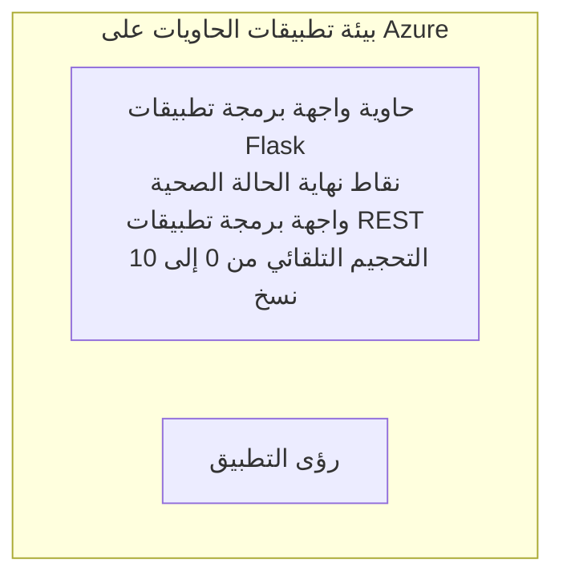

# Simple Flask API - Container App Example

**مسار التعلم:** مبتدئ ⭐ | **الوقت:** 25-35 دقيقة | **التكلفة:** $0-15/شهر

تطبيق Python Flask REST API كامل وعامل مُعبأ في حاوية ومُشغَّل على Azure Container Apps باستخدام Azure Developer CLI (azd). يوضح هذا المثال نشر الحاويات، التحجيم التلقائي، وأساسيات المراقبة.

## 🎯 ما ستتعلمونه

- نشر تطبيق Python مُحوَّل إلى حاوية على Azure
- تكوين التحجيم التلقائي مع التحجيم إلى الصفر
- تنفيذ فحوصات الصحة وفحوصات الجاهزية
- مراقبة سجلات التطبيق والمقاييس
- استخدام Azure Developer CLI للنشر السريع

## 📦 ما هو مدرج

✅ **Flask Application** - REST API كامل مع عمليات CRUD (`src/app.py`)  
✅ **Dockerfile** - تكوين الحاوية جاهز للإنتاج  
✅ **Bicep Infrastructure** - بيئة Container Apps ونشر API  
✅ **AZD Configuration** - إعداد نشر بأمر واحد  
✅ **Health Probes** - تم تكوين فحوصات liveness وreadiness  
✅ **Auto-scaling** - 0-10 نسخ بناءً على حمل HTTP  

## البنية



## المتطلبات المسبقة

### مطلوب
- **Azure Developer CLI (azd)** - [دليل التثبيت](https://learn.microsoft.com/azure/developer/azure-developer-cli/install-azd)
- **اشتراك Azure** - [حساب مجاني](https://azure.microsoft.com/free/)
- **Docker Desktop** - [Install Docker](https://www.docker.com/products/docker-desktop/) (لاختبار محلي)

### التحقق من المتطلبات المسبقة

```bash
# تحقق من إصدار azd (يتطلب 1.5.0 أو أعلى)
azd version

# تحقق من تسجيل الدخول إلى Azure
azd auth login

# تحقق من Docker (اختياري، للاختبار المحلي)
docker --version
```

## ⏱️ الجدول الزمني للنشر

| المرحلة | المدة | ما الذي يحدث |
|-------|----------|--------------||
| إعداد البيئة | 30 ثانية | إنشاء azd environment |
| بناء الحاوية | 2-3 دقائق | Docker build تطبيق Flask |
| توفير البنية التحتية | 3-5 دقائق | إنشاء Container Apps، registry، المراقبة |
| نشر التطبيق | 2-3 دقائق | دفع الصورة ونشرها على Container Apps |
| **الإجمالي** | **8-12 دقائق** | نشر مكتمل وجاهز |

## البدء السريع

```bash
# انتقل إلى المثال
cd examples/container-app/simple-flask-api

# تهيئة البيئة (اختر اسمًا فريدًا)
azd env new myflaskapi

# انشر كل شيء (البنية التحتية + التطبيق)
azd up
# سيُطلب منك:
# 1. اختر اشتراك Azure
# 2. اختر الموقع (مثل eastus2)
# 3. انتظر 8-12 دقيقة لإتمام النشر

# احصل على نقطة النهاية لواجهة برمجة التطبيقات الخاصة بك
azd env get-values

# اختبر واجهة برمجة التطبيقات
curl $(azd env get-value API_ENDPOINT)/health
```

**المخرجات المتوقعة:**
```json
{
  "status": "healthy",
  "timestamp": "2025-11-19T10:30:00Z",
  "service": "simple-flask-api",
  "version": "1.0.0"
}
```

## ✅ التحقق من النشر

### الخطوة 1: التحقق من حالة النشر

```bash
# عرض الخدمات المنشورة
azd show

# الإخراج المتوقع يظهر:
# - الخدمة: api
# - نقطة النهاية: https://ca-api-[env].xxx.azurecontainerapps.io
# - الحالة: قيد التشغيل
```

### الخطوة 2: اختبار نقاط نهاية API

```bash
# الحصول على نقطة نهاية واجهة برمجة التطبيقات
API_URL=$(azd env get-value API_ENDPOINT)

# اختبار الصحة
curl $API_URL/health

# اختبار نقطة نهاية الجذر
curl $API_URL/

# إنشاء عنصر
curl -X POST $API_URL/api/items \
  -H "Content-Type: application/json" \
  -d '{"name": "Test Item", "description": "My first item"}'

# الحصول على جميع العناصر
curl $API_URL/api/items
```

**معايير النجاح:**
- ✅ نقطة نهاية الصحة تُرجع HTTP 200
- ✅ نقطة النهاية الجذرية تعرض معلومات عن API
- ✅ عملية POST تنشئ عنصرًا وتُرجع HTTP 201
- ✅ عملية GET تُرجع العناصر التي تم إنشاؤها

### الخطوة 3: عرض السجلات

```bash
# بث السجلات الحية باستخدام azd monitor
azd monitor --logs

# أو استخدم Azure CLI:
az containerapp logs show --name api --resource-group $RG_NAME --follow

# يجب أن ترى:
# - رسائل بدء تشغيل Gunicorn
# - سجلات طلبات HTTP
# - سجلات معلومات التطبيق
```

## هيكل المشروع

```
simple-flask-api/
├── azure.yaml              # AZD configuration
├── infra/
│   ├── main.bicep         # Main infrastructure
│   ├── main.parameters.json
│   └── app/
│       ├── container-env.bicep
│       └── api.bicep
└── src/
    ├── app.py             # Flask application
    ├── requirements.txt
    └── Dockerfile
```

## نقاط نهاية API

| نقطة النهاية | الطريقة | الوصف |
|----------|--------|-------------|
| `/health` | GET | فحص الصحة |
| `/api/items` | GET | قائمة بكل العناصر |
| `/api/items` | POST | إنشاء عنصر جديد |
| `/api/items/{id}` | GET | الحصول على عنصر محدد |
| `/api/items/{id}` | PUT | تحديث العنصر |
| `/api/items/{id}` | DELETE | حذف العنصر |

## التكوين

### متغيرات البيئة

```bash
# اضبط التكوين المخصص
azd env set PORT 8000
azd env set LOG_LEVEL info
azd env set MAX_REPLICAS 20
```

### تكوين التحجيم

يتوسع API تلقائيًا بناءً على حركة مرور HTTP:
- **الحد الأدنى لنسخ**: 0 (يتوسع إلى الصفر عند الخمول)
- **الحد الأقصى لنسخ**: 10
- **الطلبات المتزامنة لكل نسخة**: 50

## التطوير

### التشغيل محليًا

```bash
# تثبيت التبعيات
cd src
pip install -r requirements.txt

# تشغيل التطبيق
python app.py

# اختبار محليًا
curl http://localhost:8000/health
```

### بناء الحاوية واختبارها

```bash
# بناء صورة Docker
docker build -t flask-api:local ./src

# تشغيل الحاوية محليًا
docker run -p 8000:8000 flask-api:local

# اختبار الحاوية
curl http://localhost:8000/health
```

## النشر

### نشر كامل

```bash
# نشر البنية التحتية والتطبيق
azd up
```

### نشر الكود فقط

```bash
# نشر كود التطبيق فقط (البنية التحتية دون تغيير)
azd deploy api
```

### تحديث التكوين

```bash
# تحديث متغيرات البيئة
azd env set API_KEY "new-api-key"

# إعادة النشر باستخدام التكوين الجديد
azd deploy api
```

## المراقبة

### عرض السجلات

```bash
# بث السجلات الحية باستخدام azd monitor
azd monitor --logs

# أو استخدم Azure CLI لتطبيقات الحاويات:
az containerapp logs show --name api --resource-group $RG_NAME --follow

# عرض آخر 100 سطر
az containerapp logs show --name api --resource-group $RG_NAME --tail 100
```

### مراقبة المقاييس

```bash
# افتح لوحة معلومات Azure Monitor
azd monitor --overview

# عرض مقاييس محددة
az monitor metrics list \
  --resource $(azd show --output json | jq -r '.services.api.resourceId') \
  --metric "Requests,ResponseTime"
```

## الاختبار

### فحص الصحة

```bash
curl $(azd show --output json | jq -r '.services.api.endpoint')/health
```

الاستجابة المتوقعة:
```json
{
  "status": "healthy",
  "timestamp": "2025-11-19T10:30:00Z"
}
```

### إنشاء عنصر

```bash
curl -X POST $(azd show --output json | jq -r '.services.api.endpoint')/api/items \
  -H "Content-Type: application/json" \
  -d '{"name": "Test Item", "description": "A test item"}'
```

### الحصول على كل العناصر

```bash
curl $(azd show --output json | jq -r '.services.api.endpoint')/api/items
```

## تحسين التكلفة

يستخدم هذا النشر ميزة التحجيم إلى الصفر، لذا تدفع فقط عندما يعالج API الطلبات:

- **تكلفة الخمول**: ~$0/الشهر (يتم التحجيم إلى الصفر)
- **تكلفة النشاط**: ~$0.000024/ثانية لكل نسخة
- **التكلفة الشهرية المتوقعة** (استخدام خفيف): $5-15

### تقليل التكاليف أكثر

```bash
# خفض الحد الأقصى لعدد النسخ لبيئة التطوير
azd env set MAX_REPLICAS 3

# استخدم مهلة الخمول الأقصر
azd env set SCALE_TO_ZERO_TIMEOUT 300  # ٥ دقائق
```

## استكشاف الأخطاء وإصلاحها

### الحاوية لا تبدأ

```bash
# تحقق من سجلات الحاوية باستخدام Azure CLI
az containerapp logs show --name api --resource-group $RG_NAME --tail 100

# تحقق من بناء صور Docker محليًا
docker build -t test ./src
```

### API غير متاح

```bash
# تحقق من أن نقطة الدخول خارجية
az containerapp show --name api --resource-group rg-simple-flask-api \
  --query properties.configuration.ingress.external
```

### أوقات استجابة مرتفعة

```bash
# تحقق من استخدام وحدة المعالجة المركزية/الذاكرة
az monitor metrics list \
  --resource $(azd show --output json | jq -r '.services.api.resourceId') \
  --metric "CPUPercentage,MemoryPercentage"

# قم بزيادة الموارد عند الحاجة
az containerapp update --name api --resource-group rg-simple-flask-api \
  --cpu 1.0 --memory 2Gi
```

## تنظيف الموارد

```bash
# احذف جميع الموارد
azd down --force --purge
```

## الخطوات التالية

### توسيع هذا المثال

1. **إضافة قاعدة بيانات** - دمج Azure Cosmos DB أو SQL Database
   ```bash
   # إضافة وحدة Cosmos DB إلى infra/main.bicep
   # تحديث app.py لإضافة اتصال بقاعدة البيانات
   ```

2. **إضافة المصادقة** - تنفيذ Microsoft Entra ID أو مفاتيح API
   ```python
   # أضف وسيط المصادقة إلى app.py
   from functools import wraps
   ```

3. **إعداد CI/CD** - سير عمل GitHub Actions
   ```yaml
   # Create .github/workflows/deploy.yml
   name: Deploy to Azure
   on: [push]
   ```

4. **إضافة Managed Identity** - تأمين الوصول إلى خدمات Azure
   ```bicep
   # Update infra/app/api.bicep
   identity: { type: 'SystemAssigned' }
   ```

### أمثلة ذات صلة

- **[تطبيق قاعدة البيانات](../../../../../examples/database-app)** - مثال كامل مع SQL Database
- **[الخدمات المصغرة](../../../../../examples/container-app/microservices)** - بنية متعددة الخدمات
- **[دليل Container Apps الرئيسي](../README.md)** - جميع أنماط الحاويات

### مصادر التعلم

- 📚 [دورة AZD للمبتدئين](../../../README.md) - الصفحة الرئيسية للدورة
- 📚 [أنماط Container Apps](../README.md) - المزيد من أنماط النشر
- 📚 [معرض قوالب AZD](https://azure.github.io/awesome-azd/) - قوالب المجتمع

## موارد إضافية

### التوثيق
- **[توثيق Flask](https://flask.palletsprojects.com/)** - دليل إطار عمل Flask
- **[Azure Container Apps](https://learn.microsoft.com/azure/container-apps/)** - وثائق Azure الرسمية
- **[Azure Developer CLI](https://learn.microsoft.com/azure/developer/azure-developer-cli/)** - مرجع أوامر azd

### دروس
- **[Container Apps Quickstart](https://learn.microsoft.com/azure/container-apps/quickstart-portal)** - انشر تطبيقك الأول
- **[Python on Azure](https://learn.microsoft.com/azure/developer/python/)** - دليل تطوير Python
- **[Bicep Language](https://learn.microsoft.com/azure/azure-resource-manager/bicep/)** - البنية التحتية ككود

### الأدوات
- **[Azure Portal](https://portal.azure.com)** - إدارة الموارد بصريًا
- **[VS Code Azure Extension](https://marketplace.visualstudio.com/items?itemName=ms-azuretools.vscode-azurecontainerapps)** - تكامل IDE

---

**🎉 تهانينا!** لقد قمت بنشر API Flask جاهز للإنتاج على Azure Container Apps مع التحجيم التلقائي والمراقبة.

**أسئلة؟** [افتح مشكلة](https://github.com/microsoft/AZD-for-beginners/issues) أو راجع [الأسئلة الشائعة](../../../resources/faq.md)

---

<!-- CO-OP TRANSLATOR DISCLAIMER START -->
**تنويه**:
تمت ترجمة هذا المستند باستخدام خدمة الترجمة بالذكاء الاصطناعي [Co-op Translator](https://github.com/Azure/co-op-translator). بينما نسعى للدقة، يرجى العلم أن الترجمات الآلية قد تحتوي على أخطاء أو عدم دقة. يجب اعتبار المستند الأصلي بلغته الأصلية المصدر الرسمي والمعتمد. للمعلومات الهامة، يُنصح بالاستعانة بترجمة بشرية محترفة. نحن غير مسؤولين عن أي سوء فهم أو تفسير ناتج عن استخدام هذه الترجمة.
<!-- CO-OP TRANSLATOR DISCLAIMER END -->