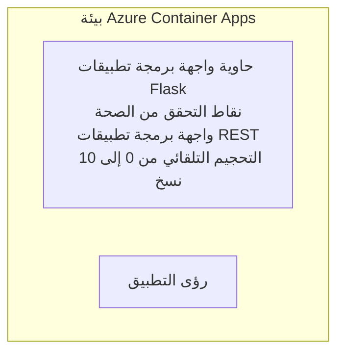

# Simple Flask API - Container App Example

**مسار التعلم:** مبتدئ ⭐ | **الوقت:** 25-35 دقيقة | **التكلفة:** $0-15/شهريًا

نموذج كامل لواجهة REST API بلغة Python باستخدام Flask مُنتشر على Azure Container Apps عبر Azure Developer CLI (azd). يوضح هذا المثال نشر الحاويات، القياس التلقائي، وأسُس المراقبة.

## 🎯 ما الذي ستتعلمه

- نشر تطبيق Python مُحاكى داخل حاوية إلى Azure
- تكوين القياس التلقائي مع مبدأ scale-to-zero
- تنفيذ فحوصات الصحة وفحوصات الجاهزية
- مراقبة سجلات التطبيق والمقاييس
- استخدام Azure Developer CLI للنشر السريع

## 📦 ما المضمن

✅ **تطبيق Flask** - REST API كامل بعمليات CRUD (`src/app.py`)  
✅ **Dockerfile** - تكوين الحاوية جاهز للإنتاج  
✅ **بِسِب للبنية التحتية** - بيئة Container Apps ونشر API  
✅ **تكوين AZD** - إعداد نشر بأمر واحد  
✅ **فحوصات الصحة** - فحوصات Liveness و Readiness مكوَّنة  
✅ **القياس التلقائي** - من 0 إلى 10 نسخ بناءً على حمل HTTP  

## المعمارية


## المتطلبات المسبقة

### مطلوب
- **Azure Developer CLI (azd)** - [دليل التثبيت](https://learn.microsoft.com/azure/developer/azure-developer-cli/install-azd)
- **اشتراك Azure** - [حساب مجاني](https://azure.microsoft.com/free/)
- **Docker Desktop** - [تثبيت Docker](https://www.docker.com/products/docker-desktop/) (لاختبار محلي)

### التحقق من المتطلبات المسبقة

```bash
# تحقق من إصدار azd (يجب أن يكون 1.5.0 أو أعلى)
azd version

# التحقق من تسجيل الدخول إلى Azure
azd auth login

# التحقق من Docker (اختياري، للاختبار المحلي)
docker --version
```

## ⏱️ الجدول الزمني للنشر

| المرحلة | المدة | ما يحدث |
|-------|----------|--------------||
| Environment setup | 30 seconds | Create azd environment |
| Build container | 2-3 minutes | Docker build Flask app |
| Provision infrastructure | 3-5 minutes | Create Container Apps, registry, monitoring |
| Deploy application | 2-3 minutes | Push image and deploy to Container Apps |
| **الإجمالي** | **8-12 دقيقة** | جاهز النشر كاملة |

## البدء السريع

```bash
# انتقل إلى المثال
cd examples/container-app/simple-flask-api

# هيئ البيئة (اختر اسمًا فريدًا)
azd env new myflaskapi

# انشر كل شيء (البنية التحتية + التطبيق)
azd up
# سيُطلب منك:
# 1. اختر اشتراك Azure
# 2. اختر المنطقة (مثل: eastus2)
# انتظر من 8 إلى 12 دقيقة حتى يكتمل النشر

# احصل على نقطة نهاية API الخاصة بك
azd env get-values

# اختبر واجهة برمجة التطبيقات
curl $(azd env get-value API_ENDPOINT)/health
```

**المخرجات المتوقعة:**
```json
{
  "status": "healthy",
  "timestamp": "2025-11-19T10:30:00Z",
  "service": "simple-flask-api",
  "version": "1.0.0"
}
```

## ✅ التحقق من النشر

### الخطوة 1: التحقق من حالة النشر

```bash
# عرض الخدمات المنشورة
azd show

# الناتج المتوقع يظهر:
# - الخدمة: api
# - نقطة النهاية: https://ca-api-[env].xxx.azurecontainerapps.io
# - الحالة: قيد التشغيل
```

### الخطوة 2: اختبار نقاط نهاية الـ API

```bash
# الحصول على نقطة النهاية لواجهة برمجة التطبيقات
API_URL=$(azd env get-value API_ENDPOINT)

# اختبار صحة الخدمة
curl $API_URL/health

# اختبار نقطة النهاية الجذرية
curl $API_URL/

# إنشاء عنصر
curl -X POST $API_URL/api/items \
  -H "Content-Type: application/json" \
  -d '{"name": "Test Item", "description": "My first item"}'

# الحصول على جميع العناصر
curl $API_URL/api/items
```

**معايير النجاح:**
- ✅ تُعيد نقطة /health حالة HTTP 200
- ✅ تعرض نقطة الجذر معلومات الـ API
- ✅ POST ينشئ عنصرًا ويُعيد HTTP 201
- ✅ GET يعيد العناصر المنشأة

### الخطوة 3: عرض السجلات

```bash
# بث السجلات الحية باستخدام azd monitor
azd monitor --logs

# أو استخدم Azure CLI:
az containerapp logs show --name api --resource-group $RG_NAME --follow

# يجب أن ترى:
# - رسائل بدء تشغيل Gunicorn
# - سجلات طلبات HTTP
# - سجلات معلومات التطبيق
```

## هيكل المشروع

```
simple-flask-api/
├── azure.yaml              # AZD configuration
├── infra/
│   ├── main.bicep         # Main infrastructure
│   ├── main.parameters.json
│   └── app/
│       ├── container-env.bicep
│       └── api.bicep
└── src/
    ├── app.py             # Flask application
    ├── requirements.txt
    └── Dockerfile
```

## نقاط نهاية الـ API

| نقطة النهاية | الطريقة | الوصف |
|----------|--------|-------------|
| `/health` | GET | فحص الصحة |
| `/api/items` | GET | سرد جميع العناصر |
| `/api/items` | POST | إنشاء عنصر جديد |
| `/api/items/{id}` | GET | جلب عنصر محدد |
| `/api/items/{id}` | PUT | تحديث عنصر |
| `/api/items/{id}` | DELETE | حذف عنصر |

## التكوين

### متغيرات البيئة

```bash
# اضبط التكوين المخصص
azd env set PORT 8000
azd env set LOG_LEVEL info
azd env set MAX_REPLICAS 20
```

### تكوين القياس

يتدرج الـ API تلقائيًا بناءً على حركة HTTP:
- **الحد الأدنى من النسخ**: 0 (يتدرج إلى الصفر عند الخمول)
- **الحد الأقصى من النسخ**: 10
- **الطلبات المتزامنة لكل نسخة**: 50

## التطوير

### التشغيل محليًا

```bash
# تثبيت التبعيات
cd src
pip install -r requirements.txt

# تشغيل التطبيق
python app.py

# اختبار محليًا
curl http://localhost:8000/health
```

### بناء الحاوية واختبارها

```bash
# بناء صورة Docker
docker build -t flask-api:local ./src

# تشغيل الحاوية محليًا
docker run -p 8000:8000 flask-api:local

# اختبار الحاوية
curl http://localhost:8000/health
```

## النشر

### نشر كامل

```bash
# نشر البنية التحتية والتطبيق
azd up
```

### نشر الشيفرة فقط

```bash
# نشر شفرة التطبيق فقط (البنية التحتية دون تغيير)
azd deploy api
```

### تحديث التكوين

```bash
# تحديث متغيرات البيئة
azd env set API_KEY "new-api-key"

# إعادة النشر بالتكوين الجديد
azd deploy api
```

## المراقبة

### عرض السجلات

```bash
# بث السجلات الحية باستخدام azd monitor
azd monitor --logs

# أو استخدم Azure CLI لتطبيقات الحاويات:
az containerapp logs show --name api --resource-group $RG_NAME --follow

# عرض آخر 100 سطر
az containerapp logs show --name api --resource-group $RG_NAME --tail 100
```

### مراقبة المقاييس

```bash
# افتح لوحة معلومات Azure Monitor
azd monitor --overview

# عرض المقاييس المحددة
az monitor metrics list \
  --resource $(azd show --output json | jq -r '.services.api.resourceId') \
  --metric "Requests,ResponseTime"
```

## الاختبار

### فحص الصحة

```bash
curl $(azd show --output json | jq -r '.services.api.endpoint')/health
```

الاستجابة المتوقعة:
```json
{
  "status": "healthy",
  "timestamp": "2025-11-19T10:30:00Z"
}
```

### إنشاء عنصر

```bash
curl -X POST $(azd show --output json | jq -r '.services.api.endpoint')/api/items \
  -H "Content-Type: application/json" \
  -d '{"name": "Test Item", "description": "A test item"}'
```

### جلب كل العناصر

```bash
curl $(azd show --output json | jq -r '.services.api.endpoint')/api/items
```

## تحسين التكلفة

يستخدم هذا النشر مبدأ scale-to-zero، لذلك تدفع فقط عند معالجة الـ API للطلبات:

- **تكلفة الخمول**: ~$0/شهر (يتدرج إلى الصفر)
- **تكلفة التشغيل**: ~$0.000024/ثانية لكل نسخة
- **التكلفة الشهرية المتوقعة** (استخدام خفيف): $5-15

### تقليل التكاليف أكثر

```bash
# تقليل الحد الأقصى لعدد النسخ لبيئة التطوير
azd env set MAX_REPLICAS 3

# استخدم مهلة خمول أقصر
azd env set SCALE_TO_ZERO_TIMEOUT 300  # ٥ دقائق
```

## استكشاف الأخطاء وإصلاحها

### الحاوية لا تبدأ

```bash
# تحقق من سجلات الحاوية باستخدام Azure CLI
az containerapp logs show --name api --resource-group $RG_NAME --tail 100

# تأكد من بناء صورة Docker محليًا
docker build -t test ./src
```

### واجهة API غير قابلة للوصول

```bash
# تحقّق من أن الـ Ingress خارجي
az containerapp show --name api --resource-group rg-simple-flask-api \
  --query properties.configuration.ingress.external
```

### زمن استجابة مرتفع

```bash
# تحقق من استخدام وحدة المعالجة المركزية/الذاكرة
az monitor metrics list \
  --resource $(azd show --output json | jq -r '.services.api.resourceId') \
  --metric "CPUPercentage,MemoryPercentage"

# قم بزيادة الموارد إذا لزم الأمر
az containerapp update --name api --resource-group rg-simple-flask-api \
  --cpu 1.0 --memory 2Gi
```

## التنظيف

```bash
# حذف جميع الموارد
azd down --force --purge
```

## الخطوات التالية

### توسيع هذا المثال

1. **أضف قاعدة بيانات** - دمج Azure Cosmos DB أو SQL Database
   ```bash
   # إضافة وحدة Cosmos DB إلى infra/main.bicep
   # تحديث app.py لإضافة اتصال بقاعدة البيانات
   ```

2. **أضف المصادقة** - تنفيذ Azure AD أو مفاتيح API
   ```python
   # أضف برنامجًا وسيطًا للمصادقة إلى app.py
   from functools import wraps
   ```

3. **إعداد CI/CD** - سير عمل GitHub Actions
   ```yaml
   # Create .github/workflows/deploy.yml
   name: Deploy to Azure
   on: [push]
   ```

4. **أضف Managed Identity** - تأمين الوصول إلى خدمات Azure
   ```bicep
   # Update infra/app/api.bicep
   identity: { type: 'SystemAssigned' }
   ```

### أمثلة ذات صلة

- **[تطبيق قاعدة البيانات](../../../../../examples/database-app)** - مثال كامل مع SQL Database
- **[الخدمات المصغرة](../../../../../examples/container-app/microservices)** - بنية متعددة الخدمات
- **[دليل Container Apps الرئيسي](../README.md)** - جميع أنماط الحاويات

### موارد التعلم

- 📚 [دورة AZD للمبتدئين](../../../README.md) - الصفحة الرئيسية للدورة
- 📚 [أنماط Container Apps](../README.md) - المزيد من أنماط النشر
- 📚 [معرض قوالب AZD](https://azure.github.io/awesome-azd/) - قوالب المجتمع

## موارد إضافية

### التوثيق
- **[Flask Documentation](https://flask.palletsprojects.com/)** - دليل إطار عمل Flask
- **[Azure Container Apps](https://learn.microsoft.com/azure/container-apps/)** - وثائق Azure الرسمية
- **[Azure Developer CLI](https://learn.microsoft.com/azure/developer/azure-developer-cli/)** - مرجع أوامر azd

### الدروس
- **[Container Apps Quickstart](https://learn.microsoft.com/azure/container-apps/quickstart-portal)** - انشر تطبيقك الأول
- **[Python on Azure](https://learn.microsoft.com/azure/developer/python/)** - دليل تطوير Python
- **[Bicep Language](https://learn.microsoft.com/azure/azure-resource-manager/bicep/)** - البنية التحتية ككود

### الأدوات
- **[بوابة Azure](https://portal.azure.com)** - إدارة الموارد بصريًا
- **[امتداد Azure لـ VS Code](https://marketplace.visualstudio.com/items?itemName=ms-azuretools.vscode-azurecontainerapps)** - تكامل بيئة التطوير

---

**🎉 تهانينا!** لقد نشرت واجهة Flask جاهزة للإنتاج على Azure Container Apps مع قياس تلقائي ومراقبة.

**أسئلة؟** [افتح قضية](https://github.com/microsoft/AZD-for-beginners/issues) أو اطلع على [الأسئلة الشائعة](../../../resources/faq.md)

---

<!-- CO-OP TRANSLATOR DISCLAIMER START -->
إخلاء المسؤولية:
تمت ترجمة هذا المستند باستخدام خدمة الترجمة الآلية Co-op Translator (https://github.com/Azure/co-op-translator). بينما نسعى إلى الدقة، يُرجى ملاحظة أن الترجمات الآلية قد تحتوي على أخطاء أو معلومات غير دقيقة. يجب اعتبار المستند الأصلي بلغته الأصلية المصدر الموثوق. للمعلومات الحساسة أو الحرجة، يُنصح بالاستعانة بترجمة بشرية محترفة. لن نكون مسؤولين عن أي سوء فهم أو تفسير ينشأ عن استخدام هذه الترجمة.
<!-- CO-OP TRANSLATOR DISCLAIMER END -->