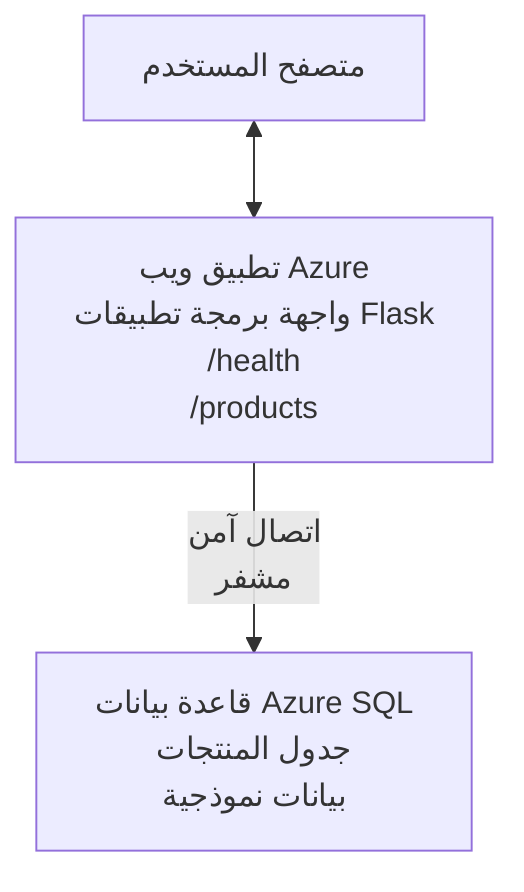

# نشر قاعدة بيانات Microsoft SQL وتطبيق ويب باستخدام AZD

⏱️ **الوقت المقدر**: 20-30 دقيقة | 💰 **التكلفة المقدرة**: ~$15-25/شهريًا | ⭐ **التعقيد**: متوسط

يوضح هذا المثال الكامل والعامل كيفية استخدام [Azure Developer CLI (azd)](https://learn.microsoft.com/azure/developer/azure-developer-cli/) لنشر تطبيق ويب Python Flask مع قاعدة بيانات Microsoft SQL إلى Azure. جميع الشفرات مضمّنة ومختبرة — لا توجد تبعيات خارجية مطلوبة.

## ما الذي ستتعلمه

بإكمال هذا المثال، ستقوم بـ:
- نشر تطبيق متعدد الطبقات (تطبيق ويب + قاعدة بيانات) باستخدام البنية التحتية ككود
- تكوين اتصالات قاعدة بيانات آمنة دون تضمين الأسرار بشكل ثابت في الشفرة
- مراقبة صحة التطبيق باستخدام Application Insights
- إدارة موارد Azure بكفاءة باستخدام أداة AZD CLI
- اتباع أفضل ممارسات Azure للأمان وتحسين التكلفة والقدرة على الرصد

## نظرة عامة على السيناريو
- **تطبيق الويب**: واجهة REST API باستخدام Python Flask مع اتصال بقاعدة بيانات
- **قاعدة البيانات**: قاعدة بيانات Azure SQL مع بيانات نموذجية
- **البنية التحتية**: مُوفَّرة باستخدام Bicep (قوالب معيارية وقابلة لإعادة الاستخدام)
- **النشر**: مؤتمت بالكامل باستخدام أوامر `azd`
- **المراقبة**: Application Insights للسجلات والقياسات

## المتطلبات الأساسية

### الأدوات المطلوبة

قبل البدء، تأكد من تثبيت هذه الأدوات:

1. **[Azure CLI](https://learn.microsoft.com/cli/azure/install-azure-cli)** (الإصدار 2.50.0 أو أعلى)
   ```sh
   az --version
   # المخرجات المتوقعة: azure-cli 2.50.0 أو أعلى
   ```

2. **[Azure Developer CLI (azd)](https://learn.microsoft.com/azure/developer/azure-developer-cli/install-azd)** (الإصدار 1.0.0 أو أعلى)
   ```sh
   azd version
   # الإخراج المتوقع: إصدار azd 1.0.0 أو أعلى
   ```

3. **[Python 3.8+](https://www.python.org/downloads/)** (لتطوير محلي)
   ```sh
   python --version
   # المخرجات المتوقعة: بايثون 3.8 أو أعلى
   ```

4. **[Docker](https://www.docker.com/get-started)** (اختياري، لتطوير محلي في حاوية)
   ```sh
   docker --version
   # الإخراج المتوقع: إصدار Docker 20.10 أو أعلى
   ```

### متطلبات Azure

- اشتراك **Azure** نشط ([إنشاء حساب مجاني](https://azure.microsoft.com/free/))
- أذونات لإنشاء الموارد في اشتراكك
- دور **Owner** أو **Contributor** على الاشتراك أو مجموعة الموارد

### المتطلبات المعرفية

هذا المثال من مستوى **متوسط**. يجب أن تكون على دراية بـ:
- أساسيات تشغيل سطر الأوامر
- مفاهيم السحابة الأساسية (الموارد، مجموعات الموارد)
- فهم أساسي لتطبيقات الويب وقواعد البيانات

**جديد على AZD؟** ابدأ بدليل [البدء السريع](../../docs/chapter-01-foundation/azd-basics.md) أولًا.

## البنية

يقوم هذا المثال بنشر بنية ذات مستويين مع تطبيق ويب وقاعدة بيانات SQL:


**نشر الموارد:**
- **Resource Group**: حاوية لجميع الموارد
- **App Service Plan**: استضافة مبنية على Linux (المستوى B1 لكفاءة التكلفة)
- **Web App**: وقت تشغيل Python 3.11 مع تطبيق Flask
- **SQL Server**: خادم قاعدة بيانات مدار مع TLS 1.2 كحد أدنى
- **SQL Database**: مستوى Basic (2GB، مناسب للتطوير/الاختبار)
- **Application Insights**: المراقبة والسجلات
- **Log Analytics Workspace**: تخزين مركزي للسجلات

**التشبيه**: فكر في هذا كمطعم (تطبيق الويب) به غرفة تبريد (قاعدة البيانات). يطلب الزبائن من القائمة (نقاط نهاية API)، والمطبخ (تطبيق Flask) يستخرج المكونات (البيانات) من الثلاجة. مدير المطعم (Application Insights) يتتبع كل ما يحدث.

## هيكل المجلدات

جميع الملفات مُضمّنة في هذا المثال — لا توجد تبعيات خارجية مطلوبة:

```
examples/database-app/
│
├── README.md                    # This file
├── azure.yaml                   # AZD configuration file
├── .env.sample                  # Sample environment variables
├── .gitignore                   # Git ignore patterns
│
├── infra/                       # Infrastructure as Code (Bicep)
│   ├── main.bicep              # Main orchestration template
│   ├── abbreviations.json      # Azure naming conventions
│   └── resources/              # Modular resource templates
│       ├── sql-server.bicep    # SQL Server configuration
│       ├── sql-database.bicep  # Database configuration
│       ├── app-service-plan.bicep  # Hosting plan
│       ├── app-insights.bicep  # Monitoring setup
│       └── web-app.bicep       # Web application
│
└── src/
    └── web/                    # Application source code
        ├── app.py              # Flask REST API
        ├── requirements.txt    # Python dependencies
        └── Dockerfile          # Container definition
```

**ما وظيفة كل ملف:**
- **azure.yaml**: يخبر AZD ما الذي يتم نشره وأين
- **infra/main.bicep**: ينسق جميع موارد Azure
- **infra/resources/*.bicep**: تعريفات الموارد الفردية (معيارية لإعادة الاستخدام)
- **src/web/app.py**: تطبيق Flask مع منطق قاعدة البيانات
- **requirements.txt**: تبعيات حزم Python
- **Dockerfile**: تعليمات حاوية للنشر

## بدء سريع (خطوة بخطوة)

### الخطوة 1: الاستنساخ والتنقل

```sh
git clone https://github.com/microsoft/AZD-for-beginners.git
cd AZD-for-beginners/examples/database-app
```

**✓ فحص النجاح**: تحقق من رؤية `azure.yaml` ومجلد `infra/`:
```sh
ls
# المتوقّع: README.md، azure.yaml، infra/، src/
```

### الخطوة 2: المصادقة مع Azure

```sh
azd auth login
```

سيفتح هذا المتصفح للمصادقة في Azure. سجّل الدخول باستخدام بيانات اعتماد Azure الخاصة بك.

**✓ فحص النجاح**: يجب أن ترى:
```
Logged in to Azure.
```

### الخطوة 3: تهيئة البيئة

```sh
azd init
```

**ما الذي يحدث**: يقوم AZD بإنشاء تكوين محلي لنشرك.

**المطالبات التي ستراها**:
- **Environment name**: أدخل اسمًا قصيرًا (مثل `dev`, `myapp`)
- **Azure subscription**: اختر اشتراكك من القائمة
- **Azure location**: اختر منطقة (مثل `eastus`, `westeurope`)

**✓ فحص النجاح**: يجب أن ترى:
```
SUCCESS: New project initialized!
```

### الخطوة 4: توفير موارد Azure

```sh
azd provision
```

**ما الذي يحدث**: يقوم AZD بنشر كل البنية التحتية (يستغرق 5-8 دقائق):
1. ينشئ مجموعة الموارد
2. ينشئ خادم SQL وقاعدة البيانات
3. ينشئ App Service Plan
4. ينشئ Web App
5. ينشئ Application Insights
6. يكوّن الشبكات والأمان

**سيُطلب منك**:
- **SQL admin username**: أدخل اسم مستخدم (مثل `sqladmin`)
- **SQL admin password**: أدخل كلمة مرور قوية (احفظها!)

**✓ فحص النجاح**: يجب أن ترى:
```
SUCCESS: Your application was provisioned in Azure in X minutes Y seconds.
You can view the resources created under the resource group rg-<env-name> in Azure Portal:
https://portal.azure.com/#@/resource/subscriptions/.../resourceGroups/rg-<env-name>
```

**⏱️ الوقت**: 5-8 دقائق

### الخطوة 5: نشر التطبيق

```sh
azd deploy
```

**ما الذي يحدث**: يقوم AZD ببناء ونشر تطبيق Flask الخاص بك:
1. يجمع تطبيق Python
2. يبني حاوية Docker
3. يدفعها إلى Azure Web App
4. يهيئ قاعدة البيانات ببيانات نموذجية
5. يبدأ التطبيق

**✓ فحص النجاح**: يجب أن ترى:
```
SUCCESS: Your application was deployed to Azure in X minutes Y seconds.
You can view the resources created under the resource group rg-<env-name> in Azure Portal:
https://portal.azure.com/#@/resource/subscriptions/.../resourceGroups/rg-<env-name>
```

**⏱️ الوقت**: 3-5 دقائق

### الخطوة 6: تصفح التطبيق

```sh
azd browse
```

سيفتح هذا تطبيق الويب المنشور في المتصفح على `https://app-<unique-id>.azurewebsites.net`

**✓ فحص النجاح**: يجب أن ترى مخرجات JSON:
```json
{
  "message": "Welcome to the Database App API",
  "endpoints": {
    "/": "This help message",
    "/health": "Health check endpoint",
    "/products": "List all products",
    "/products/<id>": "Get product by ID"
  }
}
```

### الخطوة 7: اختبار نقاط نهاية API

**فحص الصحة** (تحقق من اتصال قاعدة البيانات):
```sh
curl https://app-<your-id>.azurewebsites.net/health
```

**الاستجابة المتوقعة**:
```json
{
  "status": "healthy",
  "database": "connected"
}
```

**قائمة المنتجات** (بيانات نموذجية):
```sh
curl https://app-<your-id>.azurewebsites.net/products
```

**الاستجابة المتوقعة**:
```json
[
  {
    "id": 1,
    "name": "Laptop",
    "description": "High-performance laptop",
    "price": 1299.99,
    "created_at": "2025-11-19T10:30:00"
  },
  ...
]
```

**الحصول على منتج واحد**:
```sh
curl https://app-<your-id>.azurewebsites.net/products/1
```

**✓ فحص النجاح**: تُعيد جميع النقاط بيانات JSON بدون أخطاء.

---

**🎉 تهانينا!** لقد نجحت في نشر تطبيق ويب مع قاعدة بيانات إلى Azure باستخدام AZD.

## غوص عميق في التكوين

### متغيرات البيئة

يتم إدارة الأسرار بأمان عبر تكوين Azure App Service—**لا تُضمّن الأسرار مطلقًا في شفرة المصدر**.

**مُكوّن تلقائيًا بواسطة AZD**:
- `SQL_CONNECTION_STRING`: سلسلة اتصال القاعدة مع بيانات الاعتماد المشفّرة
- `APPLICATIONINSIGHTS_CONNECTION_STRING`: نقطة نهاية قياس المراقبة
- `SCM_DO_BUILD_DURING_DEPLOYMENT`: يتيح التثبيت التلقائي للاعتمادات أثناء النشر

**أين تُخزن الأسرار**:
1. أثناء `azd provision`، تزود بيانات اعتماد SQL عبر مطالبات آمنة
2. يخزن AZD هذه في ملف `.azure/<env-name>/.env` المحلي (مستبعد من Git)
3. يحقن AZD هذه في تكوين Azure App Service (مشفّر أثناء السكون)
4. يقرأ التطبيق هذه عبر `os.getenv()` أثناء التشغيل

### التطوير المحلي

لاختبار محلي، أنشئ ملف `.env` من العينة:

```sh
cp .env.sample .env
# حرر ملف .env باستخدام معلومات اتصال قاعدة البيانات المحلية لديك
```

**سير عمل التطوير المحلي**:
```sh
# تثبيت التبعيات
cd src/web
pip install -r requirements.txt

# تعيين متغيرات البيئة
export SQL_CONNECTION_STRING="your-local-connection-string"

# تشغيل التطبيق
python app.py
```

**اختبار محليًا**:
```sh
curl http://localhost:8000/health
# متوقع: {"status": "healthy", "database": "connected"}
```

### البنية التحتية ككود

جميع موارد Azure مُعرّفة في **قوالب Bicep** (`infra/` folder):

- **تصميم معياري**: كل نوع مورد له ملفه الخاص لإعادة الاستخدام
- **معاملية**: تخصيص SKUs والمناطق وقواعد التسمية
- **أفضل الممارسات**: يتبع معايير التسمية والأمان في Azure
- **مراقبة بالإصدار**: تغييرات البنية التحتية مُسجلة في Git

**مثال التخصيص**:
لتغيير مستوى قاعدة البيانات، حرّر `infra/resources/sql-database.bicep`:
```bicep
sku: {
  name: 'Standard'  // Changed from 'Basic'
  tier: 'Standard'
  capacity: 10
}
```

## أفضل ممارسات الأمان

يتبع هذا المثال أفضل ممارسات أمان Azure:

### 1. **لا أسرار في شفرة المصدر**
- ✅ تُخزن بيانات الاعتماد في تكوين Azure App Service (مشفّرة)
- ✅ ملفات `.env` مستبعدة من Git عبر `.gitignore`
- ✅ تُمرّر الأسرار عبر معلمات آمنة أثناء التوفير

### 2. **اتصالات مشفّرة**
- ✅ TLS 1.2 كحد أدنى لخادم SQL
- ✅ فرض HTTPS فقط لتطبيق الويب
- ✅ اتصالات قاعدة البيانات تستخدم قنوات مشفّرة

### 3. **أمان الشبكة**
- ✅ جدار حماية خادم SQL مُكوّن للسماح بخدمات Azure فقط
- ✅ الوصول للشبكة العامة مقيد (يمكن تشديده أكثر بواسطة Private Endpoints)
- ✅ تعطيل FTPS على Web App

### 4. **المصادقة والتفويض**
- ⚠️ **الحالي**: مصادقة SQL (اسم مستخدم/كلمة مرور)
- ✅ **توصية للإنتاج**: استخدم Managed Identity من Azure للمصادقة بدون كلمة مرور

**للترقية إلى Managed Identity** (للبيئات الإنتاجية):
1. فعّل Managed Identity على Web App
2. امنح الهوية أذونات SQL
3. حدّث سلسلة الاتصال لاستخدام Managed Identity
4. أزل مصادقة كلمات المرور

### 5. **التدقيق والامتثال**
- ✅ Application Insights يسجّل كل الطلبات والأخطاء
- ✅ تمكين تدقيق SQL Database (يمكن تكوينه للامتثال)
- ✅ وسم جميع الموارد للحوكمة

**قائمة التحقق الأمنية قبل الإنتاج**:
- [ ] تفعيل Azure Defender لـ SQL
- [ ] تكوين Private Endpoints لقاعدة بيانات SQL
- [ ] تفعيل Web Application Firewall (WAF)
- [ ] تنفيذ Azure Key Vault لتدوير الأسرار
- [ ] تكوين مصادقة Azure AD
- [ ] تفعيل تسجيل التشخيص لجميع الموارد

## تحسين التكلفة

**التكاليف الشهرية المقدرة** (حتى نوفمبر 2025):

| Resource | SKU/Tier | Estimated Cost |
|----------|----------|----------------|
| App Service Plan | B1 (Basic) | ~$13/month |
| SQL Database | Basic (2GB) | ~$5/month |
| Application Insights | Pay-as-you-go | ~$2/month (low traffic) |
| **Total** | | **~$20/month** |

**💡 نصائح لتوفير التكاليف**:

1. **استخدم الطبقة المجانية للتعلّم**:
   - App Service: مستوى F1 (مجاني، ساعات محدودة)
   - SQL Database: استخدم Azure SQL Database serverless
   - Application Insights: 5GB/شهر استيعاب مجاني

2. **أوقف الموارد عند عدم الاستخدام**:
   ```sh
   # أوقف تطبيق الويب (لا تزال قاعدة البيانات تُحتسب رسومًا)
   az webapp stop --name <app-name> --resource-group <rg-name>
   
   # أعد التشغيل عند الحاجة
   az webapp start --name <app-name> --resource-group <rg-name>
   ```

3. **احذف كل شيء بعد الاختبار**:
   ```sh
   azd down
   ```
   هذا يزيل كل الموارد ويوقف التحصيل.

4. **مستويات التطوير مقابل الإنتاج**:
   - **تطوير**: مستوى Basic (المستخدم في هذا المثال)
   - **إنتاج**: مستوى Standard/Premium مع التكرار

**مراقبة التكاليف**:
- اعرض التكاليف في [Azure Cost Management](https://portal.azure.com/#view/Microsoft_Azure_CostManagement)
- أنشئ تنبيهات تكلفة لتجنب المفاجآت
- وسم جميع الموارد بـ `azd-env-name` للتتبع

**بديل الطبقة المجانية**:
لأغراض التعلم، يمكنك تعديل `infra/resources/app-service-plan.bicep`:
```bicep
sku: {
  name: 'F1'  // Free tier
  tier: 'Free'
}
```
**ملاحظة**: الطبقة المجانية لها قيود (60 دقيقة/يوم CPU، لا تعمل دائمًا).

## المراقبة وإمكانية الرصد

### تكامل Application Insights

يتضمن هذا المثال **Application Insights** للمراقبة الشاملة:

**ما الذي يُرصد**:
- ✅ طلبات HTTP (الزمن، رموز الحالة، نقاط النهاية)
- ✅ أخطاء واستثناءات التطبيق
- ✅ تسجيل مخصص من تطبيق Flask
- ✅ صحة اتصال قاعدة البيانات
- ✅ مقاييس الأداء (CPU، الذاكرة)

**الوصول إلى Application Insights**:
1. افتح [بوابة Azure](https://portal.azure.com)
2. انتقل إلى مجموعة الموارد الخاصة بك (`rg-<env-name>`)
3. انقر على مورد Application Insights (`appi-<unique-id>`)

**استعلامات مفيدة** (Application Insights → Logs):

**عرض كل الطلبات**:
```kusto
requests
| where timestamp > ago(1h)
| order by timestamp desc
| project timestamp, name, url, resultCode, duration
```

**العثور على الأخطاء**:
```kusto
exceptions
| where timestamp > ago(24h)
| order by timestamp desc
| project timestamp, type, outerMessage, operation_Name
```

**التحقق من نقطة صحة**:
```kusto
requests
| where name contains "health"
| summarize count() by resultCode, bin(timestamp, 1h)
```

### تدقيق قاعدة بيانات SQL

**تمكين تدقيق SQL Database** لتتبع:
- أنماط الوصول إلى قاعدة البيانات
- محاولات تسجيل الدخول الفاشلة
- تغييرات المخطط
- الوصول إلى البيانات (للامتثال)

**الوصول إلى سجلات التدقيق**:
1. بوابة Azure → SQL Database → Auditing
2. عرض السجلات في Log Analytics workspace

### المراقبة في الزمن الحقيقي

**عرض المقاييس الحية**:
1. Application Insights → Live Metrics
2. شاهد الطلبات والإخفاقات والأداء في الزمن الحقيقي

**إعداد التنبيهات**:
أنشئ تنبيهات للأحداث الحرجة:
- أخطاء HTTP 500 > 5 خلال 5 دقائق
- فشل اتصالات قاعدة البيانات
- زمن استجابة مرتفع (>2 ثانية)

**مثال إنشاء تنبيه**:
```sh
az monitor metrics alert create \
  --name "High-Response-Time" \
  --resource-group <rg-name> \
  --scopes <app-insights-resource-id> \
  --condition "avg requests/duration > 2000" \
  --description "Alert when response time exceeds 2 seconds"
```

## استكشاف الأخطاء وإصلاحها
### القضايا الشائعة والحلول

#### 1. `azd provision` fails with "Location not available"

**العَرَض**:
```
Error: The subscription is not registered for the resource type 'components' in the location 'centralus'.
```

**الحل**:
اختر منطقة Azure مختلفة أو سجّل موفر الموارد:
```sh
az provider register --namespace Microsoft.Insights
```

#### 2. SQL Connection Fails During Deployment

**العَرَض**:
```
pyodbc.OperationalError: ('08001', '[08001] [Microsoft][ODBC Driver 18 for SQL Server]TCP Provider...')
```

**الحل**:
- تحقق من أن جدار حماية SQL Server يسمح بخدمات Azure (مُكوّن تلقائيًا)
- تحقق من إدخال كلمة مرور مسؤول SQL بشكل صحيح أثناء `azd provision`
- تأكد من أن SQL Server مُنشأ بالكامل (قد يستغرق 2-3 دقائق)

**تحقق من الاتصال**:
```sh
# من بوابة Azure، انتقل إلى قاعدة بيانات SQL → محرر الاستعلام
# حاول الاتصال باستخدام بيانات الاعتماد الخاصة بك
```

#### 3. Web App Shows "Application Error"

**العَرَض**:
يُظهر المتصفح صفحة خطأ عامة.

**الحل**:
تحقق من سجلات التطبيق:
```sh
# عرض السجلات الأخيرة
az webapp log tail --name <app-name> --resource-group <rg-name>
```

**الأسباب الشائعة**:
- متغيرات بيئة مفقودة (تحقق من App Service → Configuration)
- فشل تثبيت حزم Python (تحقق من سجلات النشر)
- خطأ في تهيئة قاعدة البيانات (تحقق من اتصال SQL)

#### 4. `azd deploy` Fails with "Build Error"

**العَرَض**:
```
Error: Failed to build project
```

**الحل**:
- تأكد من أن `requirements.txt` لا تحتوي على أخطاء في الصياغة
- تحقق من أن Python 3.11 محددة في `infra/resources/web-app.bicep`
- تحقق من أن Dockerfile يحتوي على صورة أساسية صحيحة

**استكشاف الأخطاء محليًا**:
```sh
cd src/web
docker build -t test-app .
docker run -p 8000:8000 test-app
```

#### 5. "Unauthorized" When Running AZD Commands

**العَرَض**:
```
ERROR: (Unauthorized) The client '<id>' with object id '<id>' does not have authorization
```

**الحل**:
أعد المصادقة مع Azure:
```sh
# مطلوب لتدفقات عمل AZD
azd auth login

# اختياري إذا كنت تستخدم أيضًا أوامر Azure CLI مباشرةً
az login
```

تحقق من أن لديك الأذونات الصحيحة (دور Contributor) على الاشتراك.

#### 6. High Database Costs

**العَرَض**:
فاتورة Azure غير متوقعة.

**الحل**:
- تحقق مما إذا نسيت تشغيل `azd down` بعد الاختبار
- تحقق من أن SQL Database يستخدم الفئة Basic (وليس Premium)
- راجع التكاليف في Azure Cost Management
- قم بإعداد تنبيهات التكلفة

### الحصول على المساعدة

**عرض جميع متغيرات بيئة AZD**:
```sh
azd env get-values
```

**تحقق من حالة النشر**:
```sh
az webapp show --name <app-name> --resource-group <rg-name> --query state
```

**الوصول إلى سجلات التطبيق**:
```sh
az webapp log download --name <app-name> --resource-group <rg-name> --log-file app-logs.zip
```

**هل تحتاج لمزيد من المساعدة؟**
- [دليل استكشاف أخطاء AZD وإصلاحها](../../docs/chapter-07-troubleshooting/common-issues.md)
- [استكشاف أخطاء Azure App Service وإصلاحها](https://learn.microsoft.com/azure/app-service/troubleshoot-diagnostic-logs)
- [استكشاف أخطاء Azure SQL وإصلاحها](https://learn.microsoft.com/azure/azure-sql/database/troubleshoot-common-errors-issues)

## تمارين عملية

### التمرين 1: التحقق من نشر التطبيق (مبتدئ)

**الهدف**: التأكد من نشر جميع الموارد وأن التطبيق يعمل.

**الخطوات**:
1. سرد جميع الموارد في مجموعة الموارد الخاصة بك:
   ```sh
   az resource list --resource-group rg-<env-name> --output table
   ```
   **المتوقع**: 6-7 موارد (Web App، SQL Server، SQL Database، App Service Plan، Application Insights، Log Analytics)

2. اختبر جميع نقاط نهاية API:
   ```sh
   curl https://app-<your-id>.azurewebsites.net/
   curl https://app-<your-id>.azurewebsites.net/health
   curl https://app-<your-id>.azurewebsites.net/products
   curl https://app-<your-id>.azurewebsites.net/products/1
   ```
   **المتوقع**: تعيد جميعها JSON صالح بدون أخطاء

3. تحقق من Application Insights:
   - انتقل إلى Application Insights في بوابة Azure
   - اذهب إلى "Live Metrics"
   - قم بتحديث متصفحك على تطبيق الويب
   **المتوقع**: رؤية الطلبات تظهر في الوقت الحقيقي

**معايير النجاح**: وجود جميع الموارد الـ 6-7، إرجاع جميع نقاط النهاية بيانات، تُظهر Live Metrics نشاطًا.

---

### التمرين 2: إضافة نقطة نهاية API جديدة (متوسط)

**الهدف**: توسيع تطبيق Flask بإضافة نقطة نهاية جديدة.

**كود البداية**: نقاط النهاية الحالية في `src/web/app.py`

**الخطوات**:
1. حرر `src/web/app.py` وأضف نقطة نهاية جديدة بعد الدالة `get_product()`:
   ```python
   @app.route('/products/search/<keyword>')
   def search_products(keyword):
       """Search products by name or description."""
       try:
           conn = get_db_connection()
           cursor = conn.cursor()
           cursor.execute(
               "SELECT id, name, description, price, created_at FROM products WHERE name LIKE ? OR description LIKE ?",
               (f'%{keyword}%', f'%{keyword}%')
           )
           
           products = []
           for row in cursor.fetchall():
               products.append({
                   'id': row[0],
                   'name': row[1],
                   'description': row[2],
                   'price': float(row[3]) if row[3] else None,
                   'created_at': row[4].isoformat() if row[4] else None
               })
           
           cursor.close()
           conn.close()
           
           logger.info(f"Search for '{keyword}' returned {len(products)} results")
           return jsonify(products), 200
           
       except Exception as e:
           logger.error(f"Error searching products: {str(e)}")
           return jsonify({'error': str(e)}), 500
   ```

2. انشر التطبيق المحدث:
   ```sh
   azd deploy
   ```

3. اختبر نقطة النهاية الجديدة:
   ```sh
   curl https://app-<your-id>.azurewebsites.net/products/search/laptop
   ```
   **المتوقع**: تُرجع منتجات تطابق "laptop"

**معايير النجاح**: تعمل نقطة النهاية الجديدة، تُرجع نتائج مُرشحة، تظهر في سجلات Application Insights.

---

### التمرين 3: إضافة مراقبة وتنبيهات (متقدم)

**الهدف**: إعداد مراقبة استباقية مع تنبيهات.

**الخطوات**:
1. إنشاء تنبيه لأخطاء HTTP 500:
   ```sh
   # الحصول على معرف مورد Application Insights
   AI_ID=$(az monitor app-insights component show \
     --app appi-<your-id> \
     --resource-group rg-<env-name> \
     --query id -o tsv)
   
   # إنشاء تنبيه
   az monitor metrics alert create \
     --name "High-Error-Rate" \
     --resource-group rg-<env-name> \
     --scopes $AI_ID \
     --condition "count requests/failed > 5" \
     --window-size 5m \
     --evaluation-frequency 1m \
     --description "Alert when >5 failed requests in 5 minutes"
   ```

2. أطلق التنبيه عن طريق التسبب في أخطاء:
   ```sh
   # طلب منتج غير موجود
   for i in {1..10}; do curl https://app-<your-id>.azurewebsites.net/products/999; done
   ```

3. تحقق مما إذا تم تشغيل التنبيه:
   - Azure Portal → Alerts → Alert Rules
   - تحقق من بريدك الإلكتروني (إذا تم تكوينه)

**معايير النجاح**: تم إنشاء قاعدة التنبيه، يتم تشغيلها عند حدوث أخطاء، يتم استلام الإشعارات.

---

### التمرين 4: تغييرات مخطط قاعدة البيانات (متقدم)

**الهدف**: إضافة جدول جديد وتعديل التطبيق لاستخدامه.

**الخطوات**:
1. اتصل بقاعدة بيانات SQL عبر محرر الاستعلام في بوابة Azure

2. أنشئ جدولًا جديدًا `categories`:
   ```sql
   CREATE TABLE categories (
       id INT PRIMARY KEY IDENTITY(1,1),
       name NVARCHAR(50) NOT NULL,
       description NVARCHAR(200)
   );
   
   INSERT INTO categories (name, description) VALUES
   ('Electronics', 'Electronic devices and accessories'),
   ('Office Supplies', 'Office equipment and supplies');
   
   -- Add category to products table
   ALTER TABLE products ADD category_id INT;
   UPDATE products SET category_id = 1; -- Set all to Electronics
   ```

3. حدّث `src/web/app.py` لتضمين معلومات الفئة في الاستجابات

4. انشر واختبر

**معايير النجاح**: وجود الجدول الجديد، تعرض المنتجات معلومات الفئة، يظل التطبيق يعمل.

---

### التمرين 5: تنفيذ التخزين المؤقت (خبير)

**الهدف**: إضافة Azure Redis Cache لتحسين الأداء.

**الخطوات**:
1. أضف Redis Cache إلى `infra/main.bicep`
2. حدّث `src/web/app.py` لتخزين استعلامات المنتجات مؤقتًا
3. قِس تحسين الأداء باستخدام Application Insights
4. قارن أزمنة الاستجابة قبل/بعد التخزين المؤقت

**معايير النجاح**: تم نشر Redis، يعمل التخزين المؤقت، تتحسن أزمنة الاستجابة بأكثر من 50%.

**تلميح**: ابدأ بـ [وثائق Azure Cache for Redis](https://learn.microsoft.com/azure/azure-cache-for-redis/).

---

## التنظيف

لتجنب الرسوم المستمرة، احذف جميع الموارد عند الانتهاء:

```sh
azd down
```

**مطالبة التأكيد**:
```
? Total resources to delete: 7, are you sure you want to continue? (y/N)
```

اكتب `y` للتأكيد.

**✓ فحص النجاح**: 
- تم حذف جميع الموارد من بوابة Azure
- لا توجد رسوم مستمرة
- يمكن حذف المجلد المحلي `.azure/<env-name>`

**بديل** (الاحتفاظ بالبنية التحتية، حذف البيانات):
```sh
# حذف مجموعة الموارد فقط (الاحتفاظ بتكوين AZD)
az group delete --name rg-<env-name> --yes
```
## تعلّم المزيد

### التوثيق ذي الصلة
- [توثيق Azure Developer CLI](https://learn.microsoft.com/azure/developer/azure-developer-cli/)
- [توثيق Azure SQL Database](https://learn.microsoft.com/azure/azure-sql/database/)
- [توثيق Azure App Service](https://learn.microsoft.com/azure/app-service/)
- [توثيق Application Insights](https://learn.microsoft.com/azure/azure-monitor/app/app-insights-overview)
- [مرجع لغة Bicep](https://learn.microsoft.com/azure/azure-resource-manager/bicep/)

### الخطوات التالية في هذه الدورة
- **[مثال Container Apps](../../../../examples/container-app)**: انشر الخدمات المصغرة باستخدام Azure Container Apps
- **[دليل دمج الذكاء الاصطناعي](../../../../docs/ai-foundry)**: أضف قدرات الذكاء الاصطناعي إلى تطبيقك
- **[أفضل ممارسات النشر](../../docs/chapter-04-infrastructure/deployment-guide.md)**: أنماط نشر للإنتاج

### مواضيع متقدمة
- **Managed Identity**: إزالة كلمات المرور واستخدام مصادقة Azure AD
- **Private Endpoints**: تأمين اتصالات قاعدة البيانات داخل شبكة افتراضية
- **CI/CD Integration**: أتمتة عمليات النشر باستخدام GitHub Actions أو Azure DevOps
- **Multi-Environment**: إعداد بيئات التطوير والتجهيز والإنتاج
- **Database Migrations**: استخدم Alembic أو Entity Framework لإصدار مخطط القاعدة

### المقارنة مع طرق أخرى

**AZD مقابل قوالب ARM**:
- ✅ AZD: مستوى تجريد أعلى، أوامر أبسط
- ⚠️ ARM: أكثر تفصيلاً، تحكم أدق

**AZD مقابل Terraform**:
- ✅ AZD: محلي لـ Azure، متكامل مع خدمات Azure
- ⚠️ Terraform: دعم متعدد السحب، نظام بيئي أوسع

**AZD مقابل بوابة Azure**:
- ✅ AZD: قابلة للتكرار، مسيطَر عليها بالإصدار، قابلة للأتمتة
- ⚠️ بوابة Azure: نقرات يدوية، صعوبة في إعادة الإنتاج

**فكر في AZD كـ**: Docker Compose لـ Azure—تكوين مبسّط للنشر المعقد.

---

## الأسئلة المتكررة

**س: هل يمكنني استخدام لغة برمجة مختلفة؟**  
ج: نعم! استبدل `src/web/` بـ Node.js أو C# أو Go أو أي لغة. حدّث `azure.yaml` و Bicep وفقًا لذلك.

**س: كيف أضيف قواعد بيانات إضافية؟**  
ج: أضف وحدة SQL Database أخرى في `infra/main.bicep` أو استخدم PostgreSQL/MySQL من خدمات قواعد بيانات Azure.

**س: هل يمكنني استخدام هذا للإنتاج؟**  
ج: هذا نقطة انطلاق. للإنتاج، أضف: managed identity، private endpoints، التكرار، استراتيجية النسخ الاحتياطي، WAF، ومراقبة محسّنة.

**س: ماذا لو أردت استخدام الحاويات بدل نشر الشيفرة؟**  
ج: اطلع على [مثال Container Apps](../../../../examples/container-app) الذي يستخدم حاويات Docker في جميع الأنحاء.

**س: كيف أتصل بقاعدة البيانات من جهازي المحلي؟**  
ج: أضف عنوان IP الخاص بك إلى جدار حماية SQL Server:
```sh
az sql server firewall-rule create \
  --resource-group rg-<env-name> \
  --server sql-<unique-id> \
  --name AllowMyIP \
  --start-ip-address <your-ip> \
  --end-ip-address <your-ip>
```

**س: هل يمكنني استخدام قاعدة بيانات موجودة بدل إنشاء واحدة جديدة؟**  
ج: نعم، عدّل `infra/main.bicep` للإشارة إلى SQL Server موجود وحدث معلمات سلسلة الاتصال.

---

> **ملاحظة:** يوضح هذا المثال أفضل الممارسات لنشر تطبيق ويب مع قاعدة بيانات باستخدام AZD. يتضمن شيفرة عملية، توثيقًا شاملاً، وتمارين عملية لتعزيز التعلم. للنشر في الإنتاج، راجع متطلبات الأمان، والتدرج، والامتثال، ومتطلبات التكلفة الخاصة بمنظمتك.

**📚 تنقل الدورة:**
- ← السابق: [مثال Container Apps](../../../../examples/container-app)
- → التالي: [دليل دمج الذكاء الاصطناعي](../../../../docs/ai-foundry)
- 🏠 [الصفحة الرئيسية للدورة](../../README.md)

---

<!-- CO-OP TRANSLATOR DISCLAIMER START -->
**Disclaimer**:
تمت ترجمة هذا المستند باستخدام خدمة الترجمة الآلية [Co-op Translator](https://github.com/Azure/co-op-translator). بينما نسعى لتحقيق الدقة، يرجى العلم أن الترجمات الآلية قد تحتوي على أخطاء أو عدم دقة. يجب اعتبار المستند الأصلي بلغته الأصلية المصدر المعتمد. للمعلومات الحساسة، يُنصح بالاستعانة بترجمة بشرية مهنية. نحن غير مسؤولين عن أي سوء فهم أو تفسيرات خاطئة تنشأ عن استخدام هذه الترجمة.
<!-- CO-OP TRANSLATOR DISCLAIMER END -->