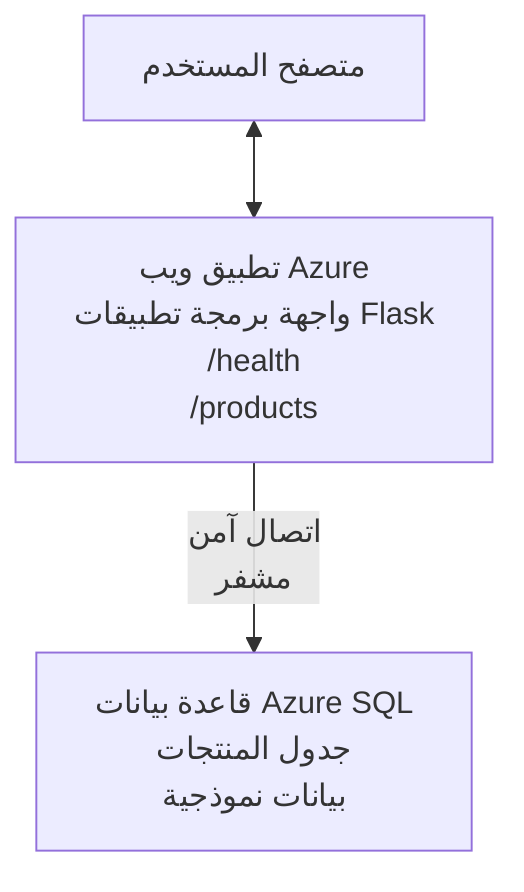

# نشر قاعدة بيانات Microsoft SQL وتطبيق ويب باستخدام AZD

⏱️ **الوقت المقدر**: 20-30 دقيقة | 💰 **التكلفة المقدرة**: ~$15-25/شهريًا | ⭐ **التعقيد**: متوسط

يُظهر هذا **المثال العملي الكامل** كيفية استخدام [Azure Developer CLI (azd)](https://learn.microsoft.com/azure/developer/azure-developer-cli/) لنشر تطبيق ويب Python Flask مع قاعدة بيانات Microsoft SQL إلى Azure. كل الشيفرة مضمّنة ومختبرة — لا توجد تبعيات خارجية مطلوبة.

## ما الذي ستتعلمه

بإكمال هذا المثال، ستتمكّن من:
- نشر تطبيق متعدد الطبقات (تطبيق ويب + قاعدة بيانات) باستخدام البنية التحتية كرمز
- تكوين اتصالات قاعدة بيانات آمنة دون تضمين الأسرار في الشيفرة
- مراقبة صحة التطبيق باستخدام Application Insights
- إدارة موارد Azure بكفاءة باستخدام واجهة سطر أوامر AZD
- اتباع أفضل ممارسات Azure للأمن، وتحسين التكلفة، وقابلية المراقبة

## نظرة عامة على السيناريو
- **تطبيق الويب**: واجهة برمجة تطبيقات REST باستخدام Python Flask مع اتصال بقاعدة البيانات
- **قاعدة البيانات**: قاعدة بيانات Azure SQL مع بيانات نموذجية
- **البنية التحتية**: مُوفّرة باستخدام Bicep (قوالب معيارية وقابلة لإعادة الاستخدام)
- **النشر**: مؤتمت بالكامل باستخدام أوامر `azd`
- **المراقبة**: Application Insights للسجلات والقياسات

## المتطلبات المسبقة

### الأدوات المطلوبة

قبل البدء، تحقق من تثبيت الأدوات التالية:

1. **[Azure CLI](https://learn.microsoft.com/cli/azure/install-azure-cli)** (الإصدار 2.50.0 أو أعلى)
   ```sh
   az --version
   # المخرجات المتوقعة: azure-cli 2.50.0 أو أعلى
   ```

2. **[Azure Developer CLI (azd)](https://learn.microsoft.com/azure/developer/azure-developer-cli/install-azd)** (الإصدار 1.0.0 أو أعلى)
   ```sh
   azd version
   # المخرجات المتوقعة: إصدار azd 1.0.0 أو أعلى
   ```

3. **[Python 3.8+](https://www.python.org/downloads/)** (للتطوير المحلي)
   ```sh
   python --version
   # المخرجات المتوقعة: بايثون 3.8 أو أعلى
   ```

4. **[Docker](https://www.docker.com/get-started)** (اختياري، للتطوير المحلي داخل حاويات)
   ```sh
   docker --version
   # الإخراج المتوقع: إصدار Docker 20.10 أو أعلى
   ```

### متطلبات Azure

- اشتراك نشط في **Azure** ([إنشاء حساب مجاني](https://azure.microsoft.com/free/))
- أذونات لإنشاء الموارد في اشتراكك
- دور **Owner** أو **Contributor** على الاشتراك أو مجموعة الموارد

### المتطلبات المعرفية

هذا مثال على مستوى **متوسط**. يجب أن تكون على دراية بـ:
- عمليات سطر الأوامر الأساسية
- مفاهيم السحابة الأساسية (الموارد، مجموعات الموارد)
- فهم أساسي لتطبيقات الويب وقواعد البيانات

**جديد على AZD؟** ابدأ بـ [دليل البدء](../../docs/chapter-01-foundation/azd-basics.md) أولًا.

## البنية المعمارية

ينشر هذا المثال بنية ذات طبقتين تتضمن تطبيق ويب وقاعدة بيانات SQL:


**نشر الموارد:**
- **Resource Group**: حاوية لجميع الموارد
- **App Service Plan**: استضافة مبنية على Linux (فئة B1 لكفاءة التكلفة)
- **Web App**: وقت تشغيل Python 3.11 مع تطبيق Flask
- **SQL Server**: خادم قاعدة بيانات مُدار مع TLS 1.2 كحد أدنى
- **SQL Database**: فئة Basic (2GB، مناسبة للتطوير/الاختبار)
- **Application Insights**: المراقبة وتسجيل الدخول
- **Log Analytics Workspace**: تخزين السجلات المركزي

**تشبيه**: فكر في هذا كمطعم (تطبيق الويب) مع فريزر (قاعدة البيانات). الزبائن يطلبون من القائمة (نقاط نهاية API)، والمطبخ (تطبيق Flask) يستخرج المكونات (البيانات) من الفريزر. مدير المطعم (Application Insights) يتتبع كل ما يحدث.

## هيكل المجلدات

كل الملفات مضمّنة في هذا المثال — لا توجد تبعيات خارجية مطلوبة:

```
examples/database-app/
│
├── README.md                    # This file
├── azure.yaml                   # AZD configuration file
├── .env.sample                  # Sample environment variables
├── .gitignore                   # Git ignore patterns
│
├── infra/                       # Infrastructure as Code (Bicep)
│   ├── main.bicep              # Main orchestration template
│   ├── abbreviations.json      # Azure naming conventions
│   └── resources/              # Modular resource templates
│       ├── sql-server.bicep    # SQL Server configuration
│       ├── sql-database.bicep  # Database configuration
│       ├── app-service-plan.bicep  # Hosting plan
│       ├── app-insights.bicep  # Monitoring setup
│       └── web-app.bicep       # Web application
│
└── src/
    └── web/                    # Application source code
        ├── app.py              # Flask REST API
        ├── requirements.txt    # Python dependencies
        └── Dockerfile          # Container definition
```

**ما الذي يفعله كل ملف:**
- **azure.yaml**: يخبر AZD بما يتم نشره وأين
- **infra/main.bicep**: ينسق جميع موارد Azure
- **infra/resources/*.bicep**: تعريفات الموارد الفردية (قابلة لإعادة الاستخدام)
- **src/web/app.py**: تطبيق Flask مع منطق قاعدة البيانات
- **requirements.txt**: تبعيات حزم Python
- **Dockerfile**: تعليمات حاوية للنشر

## بدء سريع (خطوة بخطوة)

### الخطوة 1: الاستنساخ والتنقل

```sh
git clone https://github.com/microsoft/AZD-for-beginners.git
cd AZD-for-beginners/examples/database-app
```

**✓ فحص النجاح**: تحقق من رؤية `azure.yaml` ومجلد `infra/`:
```sh
ls
# المتوقَّع: README.md، azure.yaml، infra/، src/
```

### الخطوة 2: المصادقة مع Azure

```sh
azd auth login
```

سيؤدي هذا إلى فتح المتصفح للمصادقة في Azure. قم بتسجيل الدخول باستخدام بيانات اعتماد Azure الخاصة بك.

**✓ فحص النجاح**: يجب أن ترى:
```
Logged in to Azure.
```

### الخطوة 3: تهيئة البيئة

```sh
azd init
```

**ما الذي يحدث**: يقوم AZD بإنشاء تكوين محلي لعملية النشر الخاصة بك.

**المطالبات التي ستراها**:
- **Environment name**: أدخل اسمًا قصيرًا (مثل `dev`, `myapp`)
- **Azure subscription**: حدد اشتراكك من القائمة
- **Azure location**: اختر منطقة (مثل `eastus`, `westeurope`)

**✓ فحص النجاح**: يجب أن ترى:
```
SUCCESS: New project initialized!
```

### الخطوة 4: توفير موارد Azure

```sh
azd provision
```

**ما الذي يحدث**: يقوم AZD بنشر كل البنية التحتية (يستغرق 5-8 دقائق):
1. ينشئ مجموعة الموارد
2. ينشئ خادم SQL وقاعدة البيانات
3. ينشئ App Service Plan
4. ينشئ Web App
5. ينشئ Application Insights
6. يهيئ الشبكات والأمان

**سيُطلب منك**:
- **SQL admin username**: أدخل اسم مستخدم (مثل `sqladmin`)
- **SQL admin password**: أدخل كلمة مرور قوية (احتفظ بها!)

**✓ فحص النجاح**: يجب أن ترى:
```
SUCCESS: Your application was provisioned in Azure in X minutes Y seconds.
You can view the resources created under the resource group rg-<env-name> in Azure Portal:
https://portal.azure.com/#@/resource/subscriptions/.../resourceGroups/rg-<env-name>
```

**⏱️ الوقت**: 5-8 دقائق

### الخطوة 5: نشر التطبيق

```sh
azd deploy
```

**ما الذي يحدث**: يقوم AZD ببناء ونشر تطبيق Flask الخاص بك:
1. يجمع تطبيق Python
2. يبني حاوية Docker
3. يدفعها إلى Azure Web App
4. يهيئ قاعدة البيانات بالبيانات النموذجية
5. يبدأ التطبيق

**✓ فحص النجاح**: يجب أن ترى:
```
SUCCESS: Your application was deployed to Azure in X minutes Y seconds.
You can view the resources created under the resource group rg-<env-name> in Azure Portal:
https://portal.azure.com/#@/resource/subscriptions/.../resourceGroups/rg-<env-name>
```

**⏱️ الوقت**: 3-5 دقائق

### الخطوة 6: تصفح التطبيق

```sh
azd browse
```

سيفتح هذا تطبيق الويب المنشور في المستعرض على `https://app-<unique-id>.azurewebsites.net`

**✓ فحص النجاح**: يجب أن ترى مخرجات JSON:
```json
{
  "message": "Welcome to the Database App API",
  "endpoints": {
    "/": "This help message",
    "/health": "Health check endpoint",
    "/products": "List all products",
    "/products/<id>": "Get product by ID"
  }
}
```

### الخطوة 7: اختبار نقاط نهاية API

**فحص الصحة** (تحقق من اتصال قاعدة البيانات):
```sh
curl https://app-<your-id>.azurewebsites.net/health
```

**الاستجابة المتوقعة**:
```json
{
  "status": "healthy",
  "database": "connected"
}
```

**قائمة المنتجات** (بيانات نموذجية):
```sh
curl https://app-<your-id>.azurewebsites.net/products
```

**الاستجابة المتوقعة**:
```json
[
  {
    "id": 1,
    "name": "Laptop",
    "description": "High-performance laptop",
    "price": 1299.99,
    "created_at": "2025-11-19T10:30:00"
  },
  ...
]
```

**الحصول على منتج واحد**:
```sh
curl https://app-<your-id>.azurewebsites.net/products/1
```

**✓ فحص النجاح**: يجب أن تعيد كل نقاط النهاية بيانات JSON بدون أخطاء.

---

**🎉 تهانينا!** لقد نشرت بنجاح تطبيق ويب مع قاعدة بيانات إلى Azure باستخدام AZD.

## نظرة متعمقة على التكوين

### متغيرات البيئة

تُدار الأسرار بأمان عبر تكوين Azure App Service — **لا تُضمّن الأسرار في الشيفرة المصدرية أبدًا**.

**المُكوّن تلقائيًا بواسطة AZD**:
- `SQL_CONNECTION_STRING`: اتصال قاعدة البيانات مع بيانات اعتماد مشفّرة
- `APPLICATIONINSIGHTS_CONNECTION_STRING`: نقطة نهاية قياس المراقبة
- `SCM_DO_BUILD_DURING_DEPLOYMENT`: يُمكّن التثبيت التلقائي للتبعيات أثناء النشر

**أين تُخزن الأسرار**:
1. أثناء `azd provision`، تقوم بتزويد بيانات اعتماد SQL عبر مطالبات آمنة
2. يخزن AZD هذه في ملفك المحلي `.azure/<env-name>/.env` (مستبعد من Git)
3. يحقنها AZD في تكوين Azure App Service (مشفر أثناء السكون)
4. يقرأ التطبيق هذه المتغيرات عبر `os.getenv()` عند التشغيل

### التطوير المحلي

لاختبار محلي، أنشئ ملف `.env` من العيّنة:

```sh
cp .env.sample .env
# حرر ملف .env ليحتوي على إعداد اتصال قاعدة البيانات المحلية لديك
```

**سير العمل للتطوير المحلي**:
```sh
# تثبيت التبعيات
cd src/web
pip install -r requirements.txt

# تعيين متغيرات البيئة
export SQL_CONNECTION_STRING="your-local-connection-string"

# تشغيل التطبيق
python app.py
```

**الاختبار محليًا**:
```sh
curl http://localhost:8000/health
# متوقع: {"الحالة": "سليمة", "قاعدة البيانات": "متصلة"}
```

### البنية التحتية كرمز

كل موارد Azure مُعرفة في **قوالب Bicep** (`infra/`):

- **تصميم معياري**: كل نوع مورد له ملفه الخاص لإعادة الاستخدام
- **معاملات**: تخصيص SKUs، المناطق، قواعد التسمية
- **أفضل الممارسات**: يتبع معايير Azure الافتراضية وإعدادات الأمان
- **متحكم بالإصدار**: تغييرات البنية التحتية متتبعة في Git

**مثال على التخصيص**:
لتغيير فئة قاعدة البيانات، عدّل `infra/resources/sql-database.bicep`:
```bicep
sku: {
  name: 'Standard'  // Changed from 'Basic'
  tier: 'Standard'
  capacity: 10
}
```

## أفضل ممارسات الأمان

يتبع هذا المثال أفضل ممارسات أمان Azure:

### 1. **لا توجد أسرار في الشيفرة المصدرية**
- ✅ بيانات الاعتماد مخزنة في تكوين Azure App Service (مشفر)
- ✅ ملفات `.env` مستبعدة من Git عبر `.gitignore`
- ✅ الأسرار مُمررة عبر معلمات آمنة أثناء التوفير

### 2. **اتصالات مشفّرة**
- ✅ TLS 1.2 كحد أدنى لخادم SQL
- ✅ فرض HTTPS فقط لتطبيق الويب
- ✅ اتصالات قاعدة البيانات تستخدم قنوات مشفّرة

### 3. **أمن الشبكة**
- ✅ جدار حماية خادم SQL مُكوّن للسماح لخدمات Azure فقط
- ✅ الوصول العام إلى الشبكة مقيد (يمكن تقييده أكثر باستخدام Private Endpoints)
- ✅ تعطيل FTPS على Web App

### 4. **المصادقة والتفويض**
- ⚠️ **الحالي**: مصادقة SQL (اسم المستخدم/كلمة المرور)
- ✅ **توصية الإنتاج**: استخدم Managed Identity للمصادقة بدون كلمة مرور

**للترقية إلى Managed Identity** (للبيئات الإنتاجية):
1. فعل Managed Identity على Web App
2. منح الهوية أذونات SQL
3. حدّث سلسلة الاتصال لاستخدام Managed Identity
4. أزل المصادقة المعتمدة على كلمة المرور

### 5. **التدقيق والامتثال**
- ✅ Application Insights يسجل كل الطلبات والأخطاء
- ✅ تمكين تدقيق SQL Database (يمكن تكوينه للامتثال)
- ✅ جميع الموارد معنونة للحكم والحوكمة

**قائمة فحص الأمان قبل الإنتاج**:
- [ ] تفعيل Azure Defender لقاعدة بيانات SQL
- [ ] تكوين Private Endpoints لقاعدة بيانات SQL
- [ ] تفعيل Web Application Firewall (WAF)
- [ ] تنفيذ Azure Key Vault لتدوير الأسرار
- [ ] تكوين مصادقة Azure AD
- [ ] تفعيل تسجيل التشخيص لكل الموارد

## تحسين التكلفة

**التكاليف الشهرية المقدرة** (حتى نوفمبر 2025):

| Resource | SKU/Tier | Estimated Cost |
|----------|----------|----------------|
| App Service Plan | B1 (Basic) | ~$13/month |
| SQL Database | Basic (2GB) | ~$5/month |
| Application Insights | Pay-as-you-go | ~$2/month (low traffic) |
| **Total** | | **~$20/month** |

**💡 نصائح لتوفير التكلفة**:

1. **استخدم الفئة المجانية للتعلّم**:
   - App Service: فئة F1 (مجانية، ساعات محدودة)
   - SQL Database: استخدم Azure SQL Database serverless
   - Application Insights: 5GB/شهر استيعاب مجاني

2. **أوقف الموارد عندما لا تكون قيد الاستخدام**:
   ```sh
   # أوقف تطبيق الويب (لا تزال قاعدة البيانات تفرض رسومًا)
   az webapp stop --name <app-name> --resource-group <rg-name>
   
   # أعد تشغيله عند الحاجة
   az webapp start --name <app-name> --resource-group <rg-name>
   ```

3. **احذف كل شيء بعد الاختبار**:
   ```sh
   azd down
   ```
   هذا يزيل كل الموارد ويوقف الرسوم.

4. **SKUs للتطوير مقابل الإنتاج**:
   - **التطوير**: فئة Basic (المستخدمة في هذا المثال)
   - **الإنتاج**: فئة Standard/Premium مع توافر زائد

**مراقبة التكلفة**:
- عرض التكاليف في [Azure Cost Management](https://portal.azure.com/#view/Microsoft_Azure_CostManagement)
- إعداد تنبيهات تكلفة لتفادي المفاجآت
- وسم كل الموارد بـ `azd-env-name` للتتبع

**بديل الفئة المجانية**:
لأغراض التعلم، يمكنك تعديل `infra/resources/app-service-plan.bicep`:
```bicep
sku: {
  name: 'F1'  // Free tier
  tier: 'Free'
}
```
**ملاحظة**: الفئة المجانية لها قيود (60 دقيقة/يوم CPU، لا تدعم always-on).

## المراقبة وقابلية الملاحظة

### تكامل Application Insights

يتضمن هذا المثال **Application Insights** للمراقبة الشاملة:

**ما الذي تتم مراقبته**:
- ✅ طلبات HTTP (الزمن، رموز الحالة، نقاط النهاية)
- ✅ أخطاء واستثناءات التطبيق
- ✅ تسجيلات مخصصة من تطبيق Flask
- ✅ حالة اتصال قاعدة البيانات
- ✅ مقاييس الأداء (CPU، الذاكرة)

**الوصول إلى Application Insights**:
1. افتح [بوابة Azure](https://portal.azure.com)
2. انتقل إلى مجموعة الموارد الخاصة بك (`rg-<env-name>`)
3. انقر على مورد Application Insights (`appi-<unique-id>`)

**استعلامات مفيدة** (Application Insights → Logs):

**عرض كل الطلبات**:
```kusto
requests
| where timestamp > ago(1h)
| order by timestamp desc
| project timestamp, name, url, resultCode, duration
```

**العثور على الأخطاء**:
```kusto
exceptions
| where timestamp > ago(24h)
| order by timestamp desc
| project timestamp, type, outerMessage, operation_Name
```

**التحقق من نقطة صحة**:
```kusto
requests
| where name contains "health"
| summarize count() by resultCode, bin(timestamp, 1h)
```

### تدقيق قاعدة بيانات SQL

**تم تمكين تدقيق قاعدة بيانات SQL** لتتبع:
- أنماط الوصول إلى قاعدة البيانات
- محاولات تسجيل الدخول الفاشلة
- تغييرات المخطط
- الوصول إلى البيانات (لأغراض الامتثال)

**الوصول إلى سجلات التدقيق**:
1. بوابة Azure → SQL Database → التدقيق
2. عرض السجلات في Log Analytics workspace

### المراقبة في الوقت الحقيقي

**عرض المقاييس الحية**:
1. Application Insights → Live Metrics
2. شاهد الطلبات، الفشل، والأداء في الوقت الحقيقي

**إعداد التنبيهات**:
أنشئ تنبيهات للأحداث الحرجة:
- أخطاء HTTP 500 > 5 في 5 دقائق
- فشل اتصال قاعدة البيانات
- زمن استجابة مرتفع (>2 ثانية)

**مثال على إنشاء تنبيه**:
```sh
az monitor metrics alert create \
  --name "High-Response-Time" \
  --resource-group <rg-name> \
  --scopes <app-insights-resource-id> \
  --condition "avg requests/duration > 2000" \
  --description "Alert when response time exceeds 2 seconds"
```

## استكشاف الأخطاء وإصلاحها
### المشكلات والحلول الشائعة

#### 1. `azd provision` يفشل مع "الموقع غير متاح"

**العَرَض**:
```
Error: The subscription is not registered for the resource type 'components' in the location 'centralus'.
```

**الحل**:
اختر منطقة Azure مختلفة أو سجّل مزوّد الموارد:
```sh
az provider register --namespace Microsoft.Insights
```

#### 2. فشل اتصال SQL أثناء النشر

**العَرَض**:
```
pyodbc.OperationalError: ('08001', '[08001] [Microsoft][ODBC Driver 18 for SQL Server]TCP Provider...')
```

**الحل**:
- تحقق من أن جدار حماية SQL Server يسمح بخدمات Azure (تم تكوينه تلقائيًا)
- تأكد من إدخال كلمة مرور مسؤول SQL بشكل صحيح أثناء `azd provision`
- تأكد من أن SQL Server مكتمل التهيئة (قد يستغرق 2-3 دقائق)

**التحقق من الاتصال**:
```sh
# من بوابة Azure، انتقل إلى SQL Database → محرّر الاستعلام
# حاول الاتصال باستخدام بيانات الاعتماد الخاصة بك
```

#### 3. تطبيق الويب يظهر "Application Error"

**العَرَض**:
يعرض المتصفح صفحة خطأ عامة.

**الحل**:
تحقق من سجلات التطبيق:
```sh
# عرض السجلات الأخيرة
az webapp log tail --name <app-name> --resource-group <rg-name>
```

**الأسباب الشائعة**:
- متغيرات البيئة مفقودة (تحقق من App Service → Configuration)
- فشل تثبيت حزم Python (تحقق من سجلات النشر)
- خطأ في تهيئة قاعدة البيانات (تحقق من اتصال SQL)

#### 4. فشل `azd deploy` مع "Build Error"

**العَرَض**:
```
Error: Failed to build project
```

**الحل**:
- تأكد من أن `requirements.txt` لا يحتوي على أخطاء نحوية
- تحقق من أن Python 3.11 محددة في `infra/resources/web-app.bicep`
- تأكد من أن Dockerfile يحتوي على صورة أساسية صحيحة

**استكشاف الأخطاء محليًا**:
```sh
cd src/web
docker build -t test-app .
docker run -p 8000:8000 test-app
```

#### 5. "Unauthorized" عند تشغيل أوامر AZD

**العَرَض**:
```
ERROR: (Unauthorized) The client '<id>' with object id '<id>' does not have authorization
```

**الحل**:
أعد المصادقة مع Azure:
```sh
azd auth login
az login
```

تحقق من أن لديك الأذونات الصحيحة (Contributor role) على الاشتراك.

#### 6. تكاليف قاعدة بيانات مرتفعة

**العَرَض**:
فاتورة Azure غير متوقعة.

**الحل**:
- تحقق مما إذا نسيت تشغيل `azd down` بعد الاختبار
- تأكد من أن SQL Database يستخدم الفئة Basic (ليس Premium)
- راجع التكاليف في Azure Cost Management
- قم بإعداد تنبيهات التكاليف

### الحصول على المساعدة

**عرض جميع متغيرات بيئة AZD**:
```sh
azd env get-values
```

**التحقق من حالة النشر**:
```sh
az webapp show --name <app-name> --resource-group <rg-name> --query state
```

**الوصول إلى سجلات التطبيق**:
```sh
az webapp log download --name <app-name> --resource-group <rg-name> --log-file app-logs.zip
```

**هل تحتاج إلى مزيد من المساعدة؟**
- [دليل استكشاف أخطاء AZD وإصلاحها](../../docs/chapter-07-troubleshooting/common-issues.md)
- [استكشاف أخطاء Azure App Service وإصلاحها](https://learn.microsoft.com/azure/app-service/troubleshoot-diagnostic-logs)
- [استكشاف أخطاء Azure SQL وإصلاحها](https://learn.microsoft.com/azure/azure-sql/database/troubleshoot-common-errors-issues)

## تمارين عملية

### التمرين 1: التحقق من نشر تطبيقك (مبتدئ)

**الهدف**: تأكيد نشر جميع الموارد وأن التطبيق يعمل.

**الخطوات**:
1. سرد جميع الموارد في مجموعة الموارد الخاصة بك:
   ```sh
   az resource list --resource-group rg-<env-name> --output table
   ```
   **المتوقع**: 6-7 موارد (Web App, SQL Server, SQL Database, App Service Plan, Application Insights, Log Analytics)

2. اختبار جميع نقاط النهاية API:
   ```sh
   curl https://app-<your-id>.azurewebsites.net/
   curl https://app-<your-id>.azurewebsites.net/health
   curl https://app-<your-id>.azurewebsites.net/products
   curl https://app-<your-id>.azurewebsites.net/products/1
   ```
   **المتوقع**: ترجع جميعها JSON صالح دون أخطاء

3. التحقق من Application Insights:
   - انتقل إلى Application Insights في Azure Portal
   - اذهب إلى "Live Metrics"
   - قم بتحديث متصفحك على تطبيق الويب
   **المتوقع**: رؤية الطلبات تظهر في الوقت الفعلي

**معايير النجاح**: وجود جميع الموارد الـ 6-7، ترجع جميع نقاط النهاية بيانات، تُظهر Live Metrics نشاطًا.

---

### التمرين 2: إضافة نقطة نهاية API جديدة (متوسط)

**الهدف**: توسيع تطبيق Flask بنقطة نهاية جديدة.

**كود البداية**: نقاط النهاية الحالية في `src/web/app.py`

**الخطوات**:
1. عدّل `src/web/app.py` وأضف نقطة نهاية جديدة بعد الدالة `get_product()`:
   ```python
   @app.route('/products/search/<keyword>')
   def search_products(keyword):
       """Search products by name or description."""
       try:
           conn = get_db_connection()
           cursor = conn.cursor()
           cursor.execute(
               "SELECT id, name, description, price, created_at FROM products WHERE name LIKE ? OR description LIKE ?",
               (f'%{keyword}%', f'%{keyword}%')
           )
           
           products = []
           for row in cursor.fetchall():
               products.append({
                   'id': row[0],
                   'name': row[1],
                   'description': row[2],
                   'price': float(row[3]) if row[3] else None,
                   'created_at': row[4].isoformat() if row[4] else None
               })
           
           cursor.close()
           conn.close()
           
           logger.info(f"Search for '{keyword}' returned {len(products)} results")
           return jsonify(products), 200
           
       except Exception as e:
           logger.error(f"Error searching products: {str(e)}")
           return jsonify({'error': str(e)}), 500
   ```

2. انشر التطبيق المحدث:
   ```sh
   azd deploy
   ```

3. اختبر نقطة النهاية الجديدة:
   ```sh
   curl https://app-<your-id>.azurewebsites.net/products/search/laptop
   ```
   **المتوقع**: ترجع المنتجات المطابقة لـ "laptop"

**معايير النجاح**: تعمل نقطة النهاية الجديدة، ترجع نتائج مفلترة، وتظهر في سجلات Application Insights.

---

### التمرين 3: إضافة مراقبة وتنبيهات (متقدم)

**الهدف**: إعداد مراقبة استباقية مع تنبيهات.

**الخطوات**:
1. أنشئ تنبيهًا لأخطاء HTTP 500:
   ```sh
   # الحصول على معرف مورد Application Insights
   AI_ID=$(az monitor app-insights component show \
     --app appi-<your-id> \
     --resource-group rg-<env-name> \
     --query id -o tsv)
   
   # إنشاء تنبيه
   az monitor metrics alert create \
     --name "High-Error-Rate" \
     --resource-group rg-<env-name> \
     --scopes $AI_ID \
     --condition "count requests/failed > 5" \
     --window-size 5m \
     --evaluation-frequency 1m \
     --description "Alert when >5 failed requests in 5 minutes"
   ```

2. قم بإثارة التنبيه عن طريق إحداث أخطاء:
   ```sh
   # طلب منتج غير موجود
   for i in {1..10}; do curl https://app-<your-id>.azurewebsites.net/products/999; done
   ```

3. تحقق مما إذا تم تفعيل التنبيه:
   - Azure Portal → Alerts → Alert Rules
   - تحقق من بريدك الإلكتروني (إذا تم تكوينه)

**معايير النجاح**: تم إنشاء قاعدة التنبيه، تنشط عند حدوث الأخطاء، يتم استلام الإشعارات.

---

### التمرين 4: تغييرات مخطط قاعدة البيانات (متقدم)

**الهدف**: إضافة جدول جديد وتعديل التطبيق لاستخدامه.

**الخطوات**:
1. الاتصال بقاعدة البيانات SQL عبر محرر الاستعلام في Azure Portal

2. إنشاء جدول `categories` جديد:
   ```sql
   CREATE TABLE categories (
       id INT PRIMARY KEY IDENTITY(1,1),
       name NVARCHAR(50) NOT NULL,
       description NVARCHAR(200)
   );
   
   INSERT INTO categories (name, description) VALUES
   ('Electronics', 'Electronic devices and accessories'),
   ('Office Supplies', 'Office equipment and supplies');
   
   -- Add category to products table
   ALTER TABLE products ADD category_id INT;
   UPDATE products SET category_id = 1; -- Set all to Electronics
   ```

3. تحديث `src/web/app.py` لتضمين معلومات الفئة في الاستجابات

4. النشر والاختبار

**معايير النجاح**: وجود الجدول الجديد، عرض المنتجات بمعلومات الفئة، واستمرار عمل التطبيق.

---

### التمرين 5: تنفيذ التخزين المؤقت (خبير)

**الهدف**: إضافة Azure Redis Cache لتحسين الأداء.

**الخطوات**:
1. أضف Redis Cache إلى `infra/main.bicep`
2. حدّث `src/web/app.py` لتخزين نتائج استعلامات المنتجات مؤقتًا
3. قياس تحسّن الأداء باستخدام Application Insights
4. مقارنة أوقات الاستجابة قبل/بعد التخزين المؤقت

**معايير النجاح**: تم نشر Redis، يعمل التخزين المؤقت، وتحسّنت أوقات الاستجابة بأكثر من 50%.

**تلميح**: ابدأ بـ [وثائق Azure Cache for Redis](https://learn.microsoft.com/azure/azure-cache-for-redis/).

---

## التنظيف

لتجنب الرسوم المستمرة، احذف جميع الموارد عند الانتهاء:

```sh
azd down
```

**مطالبة التأكيد**:
```
? Total resources to delete: 7, are you sure you want to continue? (y/N)
```

اكتب `y` للتأكيد.

**✓ فحص النجاح**: 
- تم حذف جميع الموارد من بوابة Azure
- لا توجد رسوم مستمرة
- يمكن حذف المجلد المحلي `.azure/<env-name>`

**بديل** (الإبقاء على البنية التحتية، حذف البيانات):
```sh
# حذف مجموعة الموارد فقط (الاحتفاظ بتكوين AZD)
az group delete --name rg-<env-name> --yes
```
## تعلم المزيد

### الوثائق ذات الصلة
- [توثيق Azure Developer CLI](https://learn.microsoft.com/azure/developer/azure-developer-cli/)
- [توثيق Azure SQL Database](https://learn.microsoft.com/azure/azure-sql/database/)
- [توثيق Azure App Service](https://learn.microsoft.com/azure/app-service/)
- [توثيق Application Insights](https://learn.microsoft.com/azure/azure-monitor/app/app-insights-overview)
- [مرجع لغة Bicep](https://learn.microsoft.com/azure/azure-resource-manager/bicep/)

### الخطوات التالية في هذه الدورة
- **[مثال Container Apps](../../../../examples/container-app)**: نشر الخدمات المصغّرة باستخدام Azure Container Apps
- **[دليل تكامل الذكاء الاصطناعي](../../../../docs/ai-foundry)**: إضافة قدرات الذكاء الاصطناعي إلى تطبيقك
- **[أفضل ممارسات النشر](../../docs/chapter-04-infrastructure/deployment-guide.md)**: أنماط النشر للإنتاج

### مواضيع متقدمة
- **الهوية المدارة**: إزالة كلمات المرور واستخدام مصادقة Azure AD
- **نقاط نهاية خاصة**: تأمين اتصالات قاعدة البيانات داخل شبكة افتراضية
- **دمج CI/CD**: أتمتة النشرات باستخدام GitHub Actions أو Azure DevOps
- **متعدد البيئات**: إعداد بيئات dev و staging و production
- **ترحيل قواعد البيانات**: استخدام Alembic أو Entity Framework لإصدار المخطط

### المقارنة مع نهج أخرى

**AZD مقابل ARM Templates**:
- ✅ AZD: مستوى تجريد أعلى، أوامر أبسط
- ⚠️ ARM: أكثر تفصيلاً، تحكم أدق

**AZD مقابل Terraform**:
- ✅ AZD: مخصص لـ Azure، متكامل مع خدمات Azure
- ⚠️ Terraform: دعم متعدد السحابات، نظام بيئي أوسع

**AZD مقابل Azure Portal**:
- ✅ AZD: قابل للتكرار، يمكن التحكم بإصداراته، قابل للأتمتة
- ⚠️ البوابة: نقرات يدوية، صعب تكراره

**فكر في AZD كـ**: Docker Compose لـ Azure—تكوين مبسّط للنشرات المعقدة.

---

## الأسئلة المتكررة

**س: هل يمكنني استخدام لغة برمجة مختلفة؟**  
ج: نعم! استبدل `src/web/` بـ Node.js أو C# أو Go أو أي لغة. حدّث `azure.yaml` وملف Bicep وفقًا لذلك.

**س: كيف أضيف المزيد من قواعد البيانات؟**  
ج: أضف وحدة SQL Database أخرى في `infra/main.bicep` أو استخدم PostgreSQL/MySQL من خدمات قواعد بيانات Azure.

**س: هل يمكنني استخدام هذا للإنتاج؟**  
ج: هذا نقطة بداية. للإنتاج، أضف: managed identity، نقاط نهاية خاصة، تكرار، استراتيجية نسخ احتياطي، WAF، ومراقبة معززة.

**س: ماذا لو أردت استخدام الحاويات بدلاً من نشر الكود؟**  
ج: اطلع على [مثال Container Apps](../../../../examples/container-app) الذي يستخدم حاويات Docker عبر المشروع.

**س: كيف أتصل بقاعدة البيانات من جهازي المحلي؟**  
ج: أضف عنوان IP الخاص بك إلى جدار حماية SQL Server:
```sh
az sql server firewall-rule create \
  --resource-group rg-<env-name> \
  --server sql-<unique-id> \
  --name AllowMyIP \
  --start-ip-address <your-ip> \
  --end-ip-address <your-ip>
```

**س: هل يمكنني استخدام قاعدة بيانات موجودة بدل إنشاء جديدة؟**  
ج: نعم، عدّل `infra/main.bicep` للإشارة إلى SQL Server موجود وحدّث معلمات سلسلة الاتصال.

---

> **ملاحظة:** هذا المثال يوضّح أفضل الممارسات لنشر تطبيق ويب مع قاعدة بيانات باستخدام AZD. يتضمن كودًا عمليًا، توثيقًا شاملاً، وتمارين عملية لتعزيز التعلم. للنشرات الإنتاجية، راجع متطلبات الأمان، التوسع، الامتثال، والتكاليف الخاصة بمنظمتك.

**📚 تنقل الدورة:**
- ← السابق: [مثال Container Apps](../../../../examples/container-app)
- → التالي: [دليل تكامل الذكاء الاصطناعي](../../../../docs/ai-foundry)
- 🏠 [الصفحة الرئيسية للدورة](../../README.md)

---

<!-- CO-OP TRANSLATOR DISCLAIMER START -->
إخلاء المسؤولية:
تمت ترجمة هذا المستند باستخدام خدمة الترجمة الآلية [Co-op Translator](https://github.com/Azure/co-op-translator). بينما نسعى للحفاظ على الدقة، يُرجى ملاحظة أن الترجمات الآلية قد تحتوي على أخطاء أو عدم دقة. يجب اعتبار المستند الأصلي بلغته المصدر المعتمد. للمعلومات الحرجة، يُنصح بالاعتماد على ترجمة بشرية محترفة. لسنا مسؤولين عن أي سوء فهم أو تفسير خاطئ ينشأ عن استخدام هذه الترجمة.
<!-- CO-OP TRANSLATOR DISCLAIMER END -->