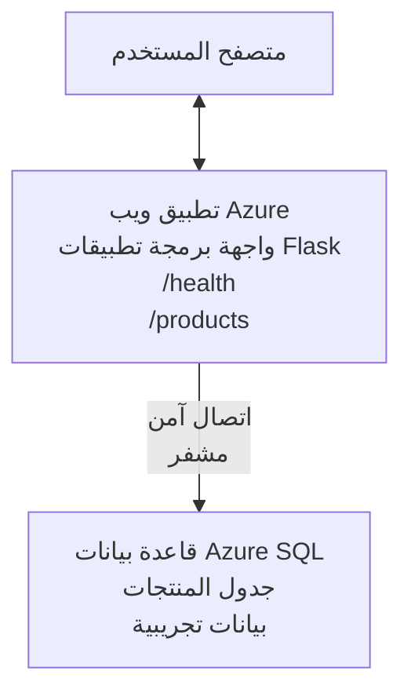

# نشر قاعدة بيانات Microsoft SQL وتطبيق ويب باستخدام AZD

⏱️ **الوقت المقدر**: 20-30 دقيقة | 💰 **التكلفة المقدرة**: ~$15-25/شهر | ⭐ **مستوى الصعوبة**: متوسط

يوضح هذا المثال الكامل والعملي كيفية استخدام [Azure Developer CLI (azd)](https://learn.microsoft.com/azure/developer/azure-developer-cli/) لنشر تطبيق ويب Python Flask مع قاعدة بيانات Microsoft SQL إلى Azure. يتضمن كل الكود ومختبر—لا توجد تبعيات خارجية مطلوبة.

## ما الذي ستتعلمه

من خلال إكمال هذا المثال، سوف:
- نشر تطبيق متعدد الطبقات (تطبيق ويب + قاعدة بيانات) باستخدام البنية التحتية كرمز
- تكوين اتصالات قاعدة بيانات آمنة دون تضمين أسرار في الشيفرة
- مراقبة صحة التطبيق باستخدام Application Insights
- إدارة موارد Azure بكفاءة باستخدام AZD CLI
- اتباع ممارسات Azure الأفضل للأمان، وتحسين التكلفة، والقابلية للملاحظة

## نظرة عامة على السيناريو
- **تطبيق الويب**: واجهة REST API باستخدام Python Flask مع اتصال بقاعدة البيانات
- **قاعدة البيانات**: قاعدة بيانات Azure SQL مع بيانات عينة
- **البنية التحتية**: مُنشأة باستخدام Bicep (قوالب معيارية قابلة لإعادة الاستخدام)
- **النشر**: مؤتمت بالكامل باستخدام أوامر `azd`
- **المراقبة**: Application Insights للسجلات والقياسات

## المتطلبات المسبقة

### الأدوات المطلوبة

قبل البدء، تحقق من تثبيت الأدوات التالية:

1. **[Azure CLI](https://learn.microsoft.com/cli/azure/install-azure-cli)** (الإصدار 2.50.0 أو أعلى)
   ```sh
   az --version
   # الإخراج المتوقع: azure-cli 2.50.0 أو أعلى
   ```

2. **[Azure Developer CLI (azd)](https://learn.microsoft.com/azure/developer/azure-developer-cli/install-azd)** (الإصدار 1.0.0 أو أعلى)
   ```sh
   azd version
   # المخرجات المتوقعة: إصدار azd 1.0.0 أو أعلى
   ```

3. **[Python 3.8+](https://www.python.org/downloads/)** (للتطوير المحلي)
   ```sh
   python --version
   # المخرجات المتوقعة: بايثون 3.8 أو أعلى
   ```

4. **[Docker](https://www.docker.com/get-started)** (اختياري، لتطوير محلي مع الحاويات)
   ```sh
   docker --version
   # الإخراج المتوقع: إصدار Docker 20.10 أو أعلى
   ```

### متطلبات Azure

- اشتراك **Azure** مُفعل ([أنشئ حسابًا مجانيًا](https://azure.microsoft.com/free/))
- أذونات لإنشاء الموارد في اشتراكك
- دور **Owner** أو **Contributor** على الاشتراك أو مجموعة الموارد

### المتطلبات المعرفية

هذا مثال بمستوى **متوسط**. يجب أن تكون على دراية بـ:
- أساسيات استخدام سطر الأوامر
- مفاهيم السحابة الأساسية (الموارد، مجموعات الموارد)
- فهم أساسي لتطبيقات الويب وقواعد البيانات

**جديد على AZD؟** ابدأ أولاً بـ [دليل البدء](../../docs/chapter-01-foundation/azd-basics.md).

## البنية

ينشر هذا المثال بنية من مستويين مع تطبيق ويب وقاعدة بيانات SQL:



**نشر الموارد:**
- **Resource Group**: حاوية لجميع الموارد
- **App Service Plan**: استضافة مبنية على Linux (الطبقة B1 لتوفير التكلفة)
- **Web App**: بيئة تشغيل Python 3.11 مع تطبيق Flask
- **SQL Server**: خادم قاعدة بيانات مُدار مع TLS 1.2 كحد أدنى
- **SQL Database**: الطبقة Basic (2GB، مناسبة للتطوير/الاختبار)
- **Application Insights**: للمراقبة وتسجيل السجلات
- **Log Analytics Workspace**: تخزين مركزي للسجلات

**تمثيل توضيحي**: فكر في هذا كمطعم (تطبيق الويب) مع ثلاجة تخزين (قاعدة البيانات). يطلب الزبائن من القائمة (نقاط نهاية الـ API)، والمطبخ (تطبيق Flask) يستخرج المكونات (البيانات) من الثلاجة. مدير المطعم (Application Insights) يتتبع كل ما يحدث.

## بنية المجلدات

كل الملفات مضمنة في هذا المثال—لا توجد تبعيات خارجية مطلوبة:

```
examples/database-app/
│
├── README.md                    # This file
├── azure.yaml                   # AZD configuration file
├── .env.sample                  # Sample environment variables
├── .gitignore                   # Git ignore patterns
│
├── infra/                       # Infrastructure as Code (Bicep)
│   ├── main.bicep              # Main orchestration template
│   ├── abbreviations.json      # Azure naming conventions
│   └── resources/              # Modular resource templates
│       ├── sql-server.bicep    # SQL Server configuration
│       ├── sql-database.bicep  # Database configuration
│       ├── app-service-plan.bicep  # Hosting plan
│       ├── app-insights.bicep  # Monitoring setup
│       └── web-app.bicep       # Web application
│
└── src/
    └── web/                    # Application source code
        ├── app.py              # Flask REST API
        ├── requirements.txt    # Python dependencies
        └── Dockerfile          # Container definition
```

**ما الذي يفعله كل ملف:**
- **azure.yaml**: يخبر AZD بما يجب نشره وأين
- **infra/main.bicep**: ينظم كل موارد Azure
- **infra/resources/*.bicep**: تعريفات الموارد الفردية (قابلة لإعادة الاستخدام)
- **src/web/app.py**: تطبيق Flask مع منطق قاعدة البيانات
- **requirements.txt**: تبعيات حزم Python
- **Dockerfile**: تعليمات الحاوية للنشر

## بداية سريعة (خطوة بخطوة)

### الخطوة 1: الاستنساخ والتنقل

```sh
git clone https://github.com/microsoft/AZD-for-beginners.git
cd AZD-for-beginners/examples/database-app
```

**✓ التحقق من النجاح**: تأكد من رؤية `azure.yaml` ومجلد `infra/`:
```sh
ls
# المتوقع: README.md، azure.yaml، infra/، src/
```

### الخطوة 2: المصادقة مع Azure

```sh
azd auth login
```

سيفتح هذا متصفحك للمصادقة على Azure. سجّل الدخول باستخدام بيانات اعتماد Azure الخاصة بك.

**✓ التحقق من النجاح**: يجب أن ترى:
```
Logged in to Azure.
```

### الخطوة 3: تهيئة البيئة

```sh
azd init
```

**ما الذي يحدث**: ينشئ AZD تكوينًا محليًا لنشرك.

**المطالبات التي سترى**:
- **Environment name**: أدخل اسمًا مختصرًا (مثل `dev`, `myapp`)
- **Azure subscription**: اختر اشتراكك من القائمة
- **Azure location**: اختر منطقة (مثل `eastus`, `westeurope`)

**✓ التحقق من النجاح**: يجب أن ترى:
```
SUCCESS: New project initialized!
```

### الخطوة 4: توفير موارد Azure

```sh
azd provision
```

**ما الذي يحدث**: يقوم AZD بنشر كل البنية التحتية (يستغرق 5-8 دقائق):
1. ينشئ مجموعة الموارد
2. ينشئ خادم وقاعدة بيانات SQL
3. ينشئ App Service Plan
4. ينشئ Web App
5. ينشئ Application Insights
6. يكوّن الشبكات والأمان

**سيُطلب منك**:
- **SQL admin username**: أدخل اسم مستخدم (مثل `sqladmin`)
- **SQL admin password**: أدخل كلمة مرور قوية (احتفظ بها!)

**✓ التحقق من النجاح**: يجب أن ترى:
```
SUCCESS: Your application was provisioned in Azure in X minutes Y seconds.
You can view the resources created under the resource group rg-<env-name> in Azure Portal:
https://portal.azure.com/#@/resource/subscriptions/.../resourceGroups/rg-<env-name>
```

**⏱️ الوقت**: 5-8 دقائق

### الخطوة 5: نشر التطبيق

```sh
azd deploy
```

**ما الذي يحدث**: يبني AZD وينشر تطبيق Flask الخاص بك:
1. يجمع تطبيق Python
2. يبني حاوية Docker
3. يدفعها إلى Azure Web App
4. يهيئ قاعدة البيانات بالبيانات العينة
5. يطلق التطبيق

**✓ التحقق من النجاح**: يجب أن ترى:
```
SUCCESS: Your application was deployed to Azure in X minutes Y seconds.
You can view the resources created under the resource group rg-<env-name> in Azure Portal:
https://portal.azure.com/#@/resource/subscriptions/.../resourceGroups/rg-<env-name>
```

**⏱️ الوقت**: 3-5 دقائق

### الخطوة 6: تصفح التطبيق

```sh
azd browse
```

يفتح هذا تطبيق الويب الذي نشرته في المتصفح على `https://app-<unique-id>.azurewebsites.net`

**✓ التحقق من النجاح**: يجب أن ترى إخراج JSON:
```json
{
  "message": "Welcome to the Database App API",
  "endpoints": {
    "/": "This help message",
    "/health": "Health check endpoint",
    "/products": "List all products",
    "/products/<id>": "Get product by ID"
  }
}
```

### الخطوة 7: اختبار نقاط نهاية الـ API

**فحص الصحة** (تحقق من اتصال قاعدة البيانات):
```sh
curl https://app-<your-id>.azurewebsites.net/health
```

**الاستجابة المتوقعة**:
```json
{
  "status": "healthy",
  "database": "connected"
}
```

**قائمة المنتجات** (بيانات عينة):
```sh
curl https://app-<your-id>.azurewebsites.net/products
```

**الاستجابة المتوقعة**:
```json
[
  {
    "id": 1,
    "name": "Laptop",
    "description": "High-performance laptop",
    "price": 1299.99,
    "created_at": "2025-11-19T10:30:00"
  },
  ...
]
```

**الحصول على منتج واحد**:
```sh
curl https://app-<your-id>.azurewebsites.net/products/1
```

**✓ التحقق من النجاح**: تعيد كل نقاط النهاية بيانات JSON دون أخطاء.

---

**🎉 تهانينا!** لقد نجحت في نشر تطبيق ويب مع قاعدة بيانات إلى Azure باستخدام AZD.

## استكشاف التكوين بتفصيل

### متغيرات البيئة

يتم إدارة الأسرار بشكل آمن عبر تكوين Azure App Service—**لا تُضمّن الأسرار مطلقًا في الشيفرة المصدرية**.

**المتغيرات المكوَّنة تلقائيًا بواسطة AZD**:
- `SQL_CONNECTION_STRING`: سلسلة اتصال قاعدة البيانات مع بيانات الاعتماد المشفرة
- `APPLICATIONINSIGHTS_CONNECTION_STRING`: نقطة نهاية قياسات المراقبة
- `SCM_DO_BUILD_DURING_DEPLOYMENT`: يتيح التثبيت التلقائي للتبعيات أثناء النشر

**أين تُخزن الأسرار**:
1. أثناء `azd provision`، تزود بيانات اعتماد SQL عبر مطالبات آمنة
2. يخزن AZD هذه في ملفك المحلي `.azure/<env-name>/.env` (مستبعد من Git)
3. يحقن AZD هذه في تكوين Azure App Service (مشفر عند الراحة)
4. يقرأ التطبيق هذه عبر `os.getenv()` وقت التشغيل

### التطوير المحلي

لاختبار محلي، أنشئ ملف `.env` من النموذج:

```sh
cp .env.sample .env
# حرّر ملف .env ليحتوي على إعداد اتصال قاعدة البيانات المحلية
```

**سير عمل التطوير المحلي**:
```sh
# تثبيت التبعيات
cd src/web
pip install -r requirements.txt

# تعيين متغيرات البيئة
export SQL_CONNECTION_STRING="your-local-connection-string"

# تشغيل التطبيق
python app.py
```

**الاختبار محليًا**:
```sh
curl http://localhost:8000/health
# المتوقّع: {"الحالة": "سليمة", "قاعدة البيانات": "متصلة"}
```

### البنية التحتية كرمز

كل موارد Azure معرفة في **قوالب Bicep** (`infra/`):

- **تصميم معياري**: كل نوع مورد له ملفه الخاص لإعادة الاستخدام
- **معاملية**: خصص SKUs، والمناطق، واتفاقيات التسمية
- **أفضل الممارسات**: يتبع معايير التسمية الافتراضية وإعدادات الأمان
- **متحكم فيه بالإصدار**: تغييرات البنية التحتية متتبعة في Git

**مثال للتخصيص**:
لتغيير طبقة قاعدة البيانات، حرّر `infra/resources/sql-database.bicep`:
```bicep
sku: {
  name: 'Standard'  // Changed from 'Basic'
  tier: 'Standard'
  capacity: 10
}
```

## أفضل ممارسات الأمان

يتبع هذا المثال أفضل ممارسات أمان Azure:

### 1. **لا أسرار في الشيفرة المصدرية**
- ✅ تُخزن بيانات الاعتماد في تكوين Azure App Service (مشفر)
- ✅ تُستبعد ملفات `.env` من Git عبر `.gitignore`
- ✅ تُمرر الأسرار عبر معلمات آمنة أثناء التهيئة

### 2. **اتصالات مشفرة**
- ✅ TLS 1.2 كحد أدنى لخادم SQL
- ✅ فرض HTTPS فقط لتطبيق الويب
- ✅ تستخدم اتصالات قاعدة البيانات قنوات مشفرة

### 3. **أمن الشبكات**
- ✅ جدار حماية خادم SQL مكوّن للسماح لخدمات Azure فقط
- ✅ الوصول العام للشبكة مقيد (يمكن تضييقه أكثر باستخدام Private Endpoints)
- ✅ تعطيل FTPS على Web App

### 4. **المصادقة والتفويض**
- ⚠️ **الحالي**: مصادقة SQL (اسم مستخدم/كلمة مرور)
- ✅ **توصية للإنتاج**: استخدم Managed Identity الخاصة بـ Azure للمصادقة بدون كلمة مرور

**للترقية إلى Managed Identity** (للإنتاج):
1. فعِّل Managed Identity على Web App
2. امنح الهوية أذونات SQL
3. حدِّث سلسلة الاتصال لاستخدام Managed Identity
4. أزل المصادقة المعتمدة على كلمة المرور

### 5. **التدقيق والامتثال**
- ✅ تسجل Application Insights كل الطلبات والأخطاء
- ✅ تمكين تدقيق SQL Database (يمكن تكوينه للامتثال)
- ✅ وسم كل الموارد للحوكمة

**قائمة مراجعة الأمان قبل الإنتاج**:
- [ ] تفعيل Azure Defender for SQL
- [ ] تكوين Private Endpoints لقاعدة بيانات SQL
- [ ] تفعيل Web Application Firewall (WAF)
- [ ] تنفيذ Azure Key Vault لتدوير الأسرار
- [ ] تكوين Microsoft Entra ID للمصادقة
- [ ] تفعيل تسجيل التشخيص لكل الموارد

## تحسين التكلفة

**التكاليف الشهرية المقدرة** (حتى نوفمبر 2025):

| Resource | SKU/Tier | Estimated Cost |
|----------|----------|----------------|
| App Service Plan | B1 (Basic) | ~$13/month |
| SQL Database | Basic (2GB) | ~$5/month |
| Application Insights | Pay-as-you-go | ~$2/month (low traffic) |
| **Total** | | **~$20/month** |

**💡 نصائح لتوفير التكاليف**:

1. **استخدم الطبقة المجانية للتعلم**:
   - App Service: طبقة F1 (مجانية، ساعات محدودة)
   - SQL Database: استخدم Azure SQL Database serverless
   - Application Insights: 5GB/شهر استيعاب مجاني

2. **أوقف الموارد عند عدم الاستخدام**:
   ```sh
   # أوقف تطبيق الويب (ستستمر تكاليف قاعدة البيانات)
   az webapp stop --name <app-name> --resource-group <rg-name>
   
   # أعد التشغيل عند الحاجة
   az webapp start --name <app-name> --resource-group <rg-name>
   ```

3. **احذف كل شيء بعد الاختبار**:
   ```sh
   azd down
   ```
   هذا يزيل كل الموارد ويوقف تحصيل الرسوم.

4. **SKUs للتطوير مقابل الإنتاج**:
   - **التطوير**: الطبقة Basic (المستخدمة في هذا المثال)
   - **الإنتاج**: الطبقات Standard/Premium مع التكرار

**مراقبة التكلفة**:
- عرض التكاليف في [Azure Cost Management](https://portal.azure.com/#view/Microsoft_Azure_CostManagement)
- إعداد تنبيهات تكلفة لتجنب المفاجآت
- وسم كل الموارد بـ `azd-env-name` للتتبع

**بديل الطبقة المجانية**:
لأغراض التعلم، يمكنك تعديل `infra/resources/app-service-plan.bicep`:
```bicep
sku: {
  name: 'F1'  // Free tier
  tier: 'Free'
}
```
**ملاحظة**: للطبقة المجانية قيود (60 دقيقة/يوم CPU، غير دائماً مُشغل).

## المراقبة والقابلية للملاحظة

### تكامل Application Insights

يتضمن هذا المثال **Application Insights** للمراقبة الشاملة:

**ما الذي يُراقب**:
- ✅ طلبات HTTP (الزمن، رموز الحالة، نقاط النهاية)
- ✅ أخطاء واستثناءات التطبيق
- ✅ تسجيل مخصص من تطبيق Flask
- ✅ صحة اتصال قاعدة البيانات
- ✅ مقاييس الأداء (CPU، الذاكرة)

**الوصول إلى Application Insights**:
1. افتح [بوابة Azure](https://portal.azure.com)
2. انتقل إلى مجموعة الموارد الخاصة بك (`rg-<env-name>`)
3. انقر على مورد Application Insights (`appi-<unique-id>`)

**استعلامات مفيدة** (Application Insights → Logs):

**عرض كل الطلبات**:
```kusto
requests
| where timestamp > ago(1h)
| order by timestamp desc
| project timestamp, name, url, resultCode, duration
```

**البحث عن الأخطاء**:
```kusto
exceptions
| where timestamp > ago(24h)
| order by timestamp desc
| project timestamp, type, outerMessage, operation_Name
```

**فحص نقطة النهاية الصحية**:
```kusto
requests
| where name contains "health"
| summarize count() by resultCode, bin(timestamp, 1h)
```

### تدقيق قاعدة بيانات SQL

**يتم تمكين تدقيق SQL Database** لتتبع:
- أنماط الوصول إلى قاعدة البيانات
- محاولات تسجيل الدخول الفاشلة
- تغييرات المخطط
- وصول البيانات (للامتثال)

**الوصول إلى سجلات التدقيق**:
1. Azure Portal → SQL Database → Auditing
2. عرض السجلات في Log Analytics workspace

### المراقبة في الوقت الحقيقي

**عرض المقاييس الحية**:
1. Application Insights → Live Metrics
2. مشاهدة الطلبات والفشل والأداء في الوقت الحقيقي

**إعداد التنبيهات**:
أنشئ تنبيهات للحوادث الحرجة:
- أخطاء HTTP 500 > 5 خلال 5 دقائق
- فشل اتصالات قاعدة البيانات
- أوقات استجابة عالية (>2 ثانية)

**مثال لإنشاء تنبيه**:
```sh
az monitor metrics alert create \
  --name "High-Response-Time" \
  --resource-group <rg-name> \
  --scopes <app-insights-resource-id> \
  --condition "avg requests/duration > 2000" \
  --description "Alert when response time exceeds 2 seconds"
```

## استكشاف الأخطاء وإصلاحها
### المشكلات والحلول الشائعة

#### 1. فشل `azd provision` مع "الموقع غير متاح"

**الأعراض**:
```
Error: The subscription is not registered for the resource type 'components' in the location 'centralus'.
```

**الحل**:
اختر منطقة Azure مختلفة أو قم بتسجيل مزود المورد:
```sh
az provider register --namespace Microsoft.Insights
```

#### 2. فشل اتصال SQL أثناء النشر

**الأعراض**:
```
pyodbc.OperationalError: ('08001', '[08001] [Microsoft][ODBC Driver 18 for SQL Server]TCP Provider...')
```

**الحل**:
- تحقق من أن جدار حماية SQL Server يسمح بخدمات Azure (مُكوّن تلقائيًا)
- تحقق من إدخال كلمة مرور مسؤول SQL بشكل صحيح أثناء `azd provision`
- تأكد من أن SQL Server مُجهز بالكامل (قد يستغرق 2-3 دقائق)

**تحقق من الاتصال**:
```sh
# من بوابة Azure، انتقل إلى قاعدة بيانات SQL → محرر الاستعلام
# حاول الاتصال باستخدام بيانات اعتمادك
```

#### 3. تطبيق الويب يعرض "خطأ في التطبيق"

**الأعراض**:
يعرض المتصفح صفحة خطأ عامة.

**الحل**:
تحقق من سجلات التطبيق:
```sh
# عرض السجلات الأخيرة
az webapp log tail --name <app-name> --resource-group <rg-name>
```

**الأسباب الشائعة**:
- متغيرات بيئة مفقودة (تحقق من App Service → التكوين)
- فشل تثبيت حزم Python (تحقق من سجلات النشر)
- خطأ في تهيئة قاعدة البيانات (تحقق من اتصال SQL)

#### 4. فشل `azd deploy` مع "خطأ في البناء"

**الأعراض**:
```
Error: Failed to build project
```

**الحل**:
- تأكد من أن `requirements.txt` لا يحتوي على أخطاء في الصياغة
- تحقق من تحديد Python 3.11 في `infra/resources/web-app.bicep`
- تأكد من أن Dockerfile يحتوي على صورة أساسية صحيحة

**استكشاف الأخطاء محليًا**:
```sh
cd src/web
docker build -t test-app .
docker run -p 8000:8000 test-app
```

#### 5. "غير مصرح" عند تشغيل أوامر AZD

**الأعراض**:
```
ERROR: (Unauthorized) The client '<id>' with object id '<id>' does not have authorization
```

**الحل**:
أعد المصادقة مع Azure:
```sh
# مطلوب لتدفقات عمل AZD
azd auth login

# اختياري إذا كنت تستخدم أيضًا أوامر Azure CLI مباشرةً
az login
```

تحقق من أن لديك الأذونات الصحيحة (دور Contributor) على الاشتراك.

#### 6. تكاليف قاعدة بيانات عالية

**الأعراض**:
فاتورة Azure غير متوقعة.

**الحل**:
- تحقق مما إذا نسيت تشغيل `azd down` بعد الاختبار
- تأكد من أن SQL Database يستخدم الفئة Basic (ليس Premium)
- راجع التكاليف في Azure Cost Management
- قم بإعداد تنبيهات التكلفة

### الحصول على المساعدة

**عرض كل متغيرات بيئة AZD**:
```sh
azd env get-values
```

**تحقق من حالة النشر**:
```sh
az webapp show --name <app-name> --resource-group <rg-name> --query state
```

**الوصول إلى سجلات التطبيق**:
```sh
az webapp log download --name <app-name> --resource-group <rg-name> --log-file app-logs.zip
```

**هل تحتاج إلى مزيد من المساعدة؟**
- [دليل استكشاف أخطاء AZD وإصلاحها](../../docs/chapter-07-troubleshooting/common-issues.md)
- [استكشاف مشكلات Azure App Service](https://learn.microsoft.com/azure/app-service/troubleshoot-diagnostic-logs)
- [استكشاف مشكلات Azure SQL](https://learn.microsoft.com/azure/azure-sql/database/troubleshoot-common-errors-issues)

## تمارين عملية

### التمرين 1: تحقق من نشر التطبيق (مبتدئ)

**الهدف**: التأكد من نشر كل الموارد وأن التطبيق يعمل.

**الخطوات**:
1. قم بسرد كل الموارد في مجموعة الموارد الخاصة بك:
   ```sh
   az resource list --resource-group rg-<env-name> --output table
   ```
   **المتوقع**: 6-7 موارد (Web App, SQL Server, SQL Database, App Service Plan, Application Insights, Log Analytics)

2. اختبر جميع نقاط نهاية API:
   ```sh
   curl https://app-<your-id>.azurewebsites.net/
   curl https://app-<your-id>.azurewebsites.net/health
   curl https://app-<your-id>.azurewebsites.net/products
   curl https://app-<your-id>.azurewebsites.net/products/1
   ```
   **المتوقع**: جميعها تُعيد JSON صالح بدون أخطاء

3. تحقق من Application Insights:
   - انتقل إلى Application Insights في بوابة Azure
   - اذهب إلى "Live Metrics"
   - قم بتحديث المتصفح على تطبيق الويب
   **المتوقع**: رؤية الطلبات تظهر في الوقت الحقيقي

**معايير النجاح**: وجود جميع الموارد الـ6-7، وإرجاع جميع نقاط النهاية للبيانات، وعرض Live Metrics لنشاط.

---

### التمرين 2: إضافة نقطة نهاية API جديدة (متوسط)

**الهدف**: توسيع تطبيق Flask بإضافة نقطة نهاية جديدة.

**كود البدء**: نقاط النهاية الحالية في `src/web/app.py`

**الخطوات**:
1. حرّر `src/web/app.py` وأضف نقطة نهاية جديدة بعد دالة `get_product()`:
   ```python
   @app.route('/products/search/<keyword>')
   def search_products(keyword):
       """Search products by name or description."""
       try:
           conn = get_db_connection()
           cursor = conn.cursor()
           cursor.execute(
               "SELECT id, name, description, price, created_at FROM products WHERE name LIKE ? OR description LIKE ?",
               (f'%{keyword}%', f'%{keyword}%')
           )
           
           products = []
           for row in cursor.fetchall():
               products.append({
                   'id': row[0],
                   'name': row[1],
                   'description': row[2],
                   'price': float(row[3]) if row[3] else None,
                   'created_at': row[4].isoformat() if row[4] else None
               })
           
           cursor.close()
           conn.close()
           
           logger.info(f"Search for '{keyword}' returned {len(products)} results")
           return jsonify(products), 200
           
       except Exception as e:
           logger.error(f"Error searching products: {str(e)}")
           return jsonify({'error': str(e)}), 500
   ```

2. انشر التطبيق المحدث:
   ```sh
   azd deploy
   ```

3. اختبر نقطة النهاية الجديدة:
   ```sh
   curl https://app-<your-id>.azurewebsites.net/products/search/laptop
   ```
   **المتوقع**: يُعيد المنتجات المطابقة لـ "laptop"

**معايير النجاح**: تعمل نقطة النهاية الجديدة، تُعيد نتائج مُفلترة، وتظهر في سجلات Application Insights.

---

### التمرين 3: إضافة مراقبة وتنبيهات (متقدم)

**الهدف**: إعداد مراقبة استباقية مع تنبيهات.

**الخطوات**:
1. أنشئ تنبيهًا لأخطاء HTTP 500:
   ```sh
   # الحصول على معرّف مورد Application Insights
   AI_ID=$(az monitor app-insights component show \
     --app appi-<your-id> \
     --resource-group rg-<env-name> \
     --query id -o tsv)
   
   # إنشاء تنبيه
   az monitor metrics alert create \
     --name "High-Error-Rate" \
     --resource-group rg-<env-name> \
     --scopes $AI_ID \
     --condition "count requests/failed > 5" \
     --window-size 5m \
     --evaluation-frequency 1m \
     --description "Alert when >5 failed requests in 5 minutes"
   ```

2. قم بإثارة التنبيه عن طريق إحداث أخطاء:
   ```sh
   # طلب منتج غير موجود
   for i in {1..10}; do curl https://app-<your-id>.azurewebsites.net/products/999; done
   ```

3. تحقق مما إذا تم تفعيل التنبيه:
   - Azure Portal → Alerts → Alert Rules
   - تحقق من بريدك الإلكتروني (إذا تم تكوينه)

**معايير النجاح**: تم إنشاء قاعدة التنبيه، تتفعل عند حدوث أخطاء، وتُستلم الإشعارات.

---

### التمرين 4: تغييرات مخطط قاعدة البيانات (متقدم)

**الهدف**: إضافة جدول جديد وتعديل التطبيق لاستخدامه.

**الخطوات**:
1. اتصل بقاعدة بيانات SQL عبر محرر الاستعلام في بوابة Azure

2. أنشئ جدولًا جديدًا `categories`:
   ```sql
   CREATE TABLE categories (
       id INT PRIMARY KEY IDENTITY(1,1),
       name NVARCHAR(50) NOT NULL,
       description NVARCHAR(200)
   );
   
   INSERT INTO categories (name, description) VALUES
   ('Electronics', 'Electronic devices and accessories'),
   ('Office Supplies', 'Office equipment and supplies');
   
   -- Add category to products table
   ALTER TABLE products ADD category_id INT;
   UPDATE products SET category_id = 1; -- Set all to Electronics
   ```

3. حدّث `src/web/app.py` لتضمين معلومات الفئة في الاستجابات

4. انشر واختبر

**معايير النجاح**: وجود الجدول الجديد، عرض المنتجات لمعلومات الفئة، واستمرار عمل التطبيق.

---

### التمرين 5: تنفيذ التخزين المؤقت (خبير)

**الهدف**: إضافة Azure Redis Cache لتحسين الأداء.

**الخطوات**:
1. أضف Redis Cache إلى `infra/main.bicep`
2. حدّث `src/web/app.py` لتخزين نتائج استعلامات المنتجات مؤقتًا
3. قِس تحسُّن الأداء باستخدام Application Insights
4. قارن أوقات الاستجابة قبل/بعد التخزين المؤقت

**معايير النجاح**: تم نشر Redis، يعمل التخزين المؤقت، وتحسنت أوقات الاستجابة بأكثر من 50%.

**تلميح**: ابدأ بـ [توثيق Azure Cache for Redis](https://learn.microsoft.com/azure/azure-cache-for-redis/).

---

## التنظيف

لتجنب تكاليف مستمرة، احذف كل الموارد عند الانتهاء:

```sh
azd down
```

**موجه التأكيد**:
```
? Total resources to delete: 7, are you sure you want to continue? (y/N)
```

اكتب `y` للتأكيد.

**✓ فحص النجاح**: 
- تم حذف كل الموارد من بوابة Azure
- لا توجد تكاليف مستمرة
- يمكنك حذف المجلد المحلي `.azure/<env-name>`

**بديل** (الاحتفاظ بالبنية التحتية، حذف البيانات):
```sh
# احذف مجموعة الموارد فقط (احتفظ بتكوين AZD)
az group delete --name rg-<env-name> --yes
```
## تعرف على المزيد

### الوثائق ذات الصلة
- [توثيق Azure Developer CLI](https://learn.microsoft.com/azure/developer/azure-developer-cli/)
- [توثيق Azure SQL Database](https://learn.microsoft.com/azure/azure-sql/database/)
- [توثيق Azure App Service](https://learn.microsoft.com/azure/app-service/)
- [توثيق Application Insights](https://learn.microsoft.com/azure/azure-monitor/app/app-insights-overview)
- [مرجع لغة Bicep](https://learn.microsoft.com/azure/azure-resource-manager/bicep/)

### الخطوات التالية في هذه الدورة
- **[مثال Container Apps](../../../../examples/container-app)**: نشر الخدمات المصغرة باستخدام Azure Container Apps
- **[دليل تكامل الذكاء الاصطناعي](../../../../docs/ai-foundry)**: أضف قدرات الذكاء الاصطناعي إلى تطبيقك
- **[أفضل ممارسات النشر](../../docs/chapter-04-infrastructure/deployment-guide.md)**: أنماط نشر للإنتاج

### مواضيع متقدمة
- **Managed Identity**: إزالة كلمات المرور واستخدام مصادقة Microsoft Entra ID
- **Private Endpoints**: تأمين اتصالات قاعدة البيانات داخل شبكة افتراضية
- **تكامل CI/CD**: أتمتة النشر باستخدام GitHub Actions أو Azure DevOps
- **بيئات متعددة**: إعداد بيئات التطوير، التجريب، والإنتاج
- **ترحيل قواعد البيانات**: استخدم Alembic أو Entity Framework للتحكم في إصدار مخطط القاعدة

### المقارنة مع النهج الأخرى

**AZD مقابل قوالب ARM**:
- ✅ AZD: مستوى تجريد أعلى، أوامر أبسط
- ⚠️ ARM: أكثر إسهابًا، تحكم تفصيلي

**AZD مقابل Terraform**:
- ✅ AZD: مخصص لـ Azure، متكامل مع خدمات Azure
- ⚠️ Terraform: دعم متعدد السحب، نظام بيئي أوسع

**AZD مقابل بوابة Azure**:
- ✅ AZD: قابل للتكرار، خاضع للتحكم بالإصدارات، قابل للأتمتة
- ⚠️ Portal: نقرات يدوية، صعب التكرار

**فكر في AZD كـ**: Docker Compose لـ Azure—تكوين مبسط لنشر معقد.

---

## الأسئلة المتكررة

**س: هل يمكنني استخدام لغة برمجة مختلفة؟**  
ج: نعم! استبدل `src/web/` بـ Node.js أو C# أو Go أو أي لغة. حدّث `azure.yaml` وBicep وفقًا لذلك.

**س: كيف أضيف المزيد من قواعد البيانات؟**  
ج: أضف وحدة SQL Database أخرى في `infra/main.bicep` أو استخدم PostgreSQL/MySQL من خدمات قاعدة بيانات Azure.

**س: هل يمكنني استخدام هذا للإنتاج؟**  
ج: هذه نقطة بداية. للإنتاج، أضف: managed identity، private endpoints، التكرار، استراتيجية النسخ الاحتياطي، WAF، ومراقبة محسنة.

**س: ماذا لو أردت استخدام الحاويات بدلًا من نشر الشيفرة؟**  
ج: اطلع على [مثال Container Apps](../../../../examples/container-app) الذي يستخدم حاويات Docker في جميع النواحي.

**س: كيف أتصل بقاعدة البيانات من جهازي المحلي؟**  
ج: أضف عنوان IP الخاص بك إلى جدار حماية SQL Server:
```sh
az sql server firewall-rule create \
  --resource-group rg-<env-name> \
  --server sql-<unique-id> \
  --name AllowMyIP \
  --start-ip-address <your-ip> \
  --end-ip-address <your-ip>
```

**س: هل يمكنني استخدام قاعدة بيانات موجودة بدلًا من إنشاء واحدة جديدة؟**  
ج: نعم، عدّل `infra/main.bicep` للإشارة إلى SQL Server موجود وحدّث معلمات سلسلة الاتصال.

---

> **ملاحظة:** يوضح هذا المثال أفضل الممارسات لنشر تطبيق ويب مع قاعدة بيانات باستخدام AZD. يتضمن شيفرة عملية، وثائق شاملة، وتمارين عملية لتعزيز التعلم. بالنسبة لنشر الإنتاج، راجع متطلبات الأمان، والقياس، والامتثال، والتكاليف الخاصة بمنظمتك.

**📚 تنقُّل الدورة:**
- ← السابق: [مثال Container Apps](../../../../examples/container-app)
- → التالي: [دليل تكامل الذكاء الاصطناعي](../../../../docs/ai-foundry)
- 🏠 [الصفحة الرئيسية للدورة](../../README.md)

---

<!-- CO-OP TRANSLATOR DISCLAIMER START -->
**تنويه**:
تمت ترجمة هذا المستند باستخدام خدمة الترجمة بالذكاء الاصطناعي [Co-op Translator](https://github.com/Azure/co-op-translator). بينما نسعى للدقة، يرجى العلم أن الترجمات الآلية قد تحتوي على أخطاء أو عدم دقة. يجب اعتبار المستند الأصلي بلغته الأصلية المصدر الرسمي والمعتمد. للمعلومات الهامة، يُنصح بالاستعانة بترجمة بشرية محترفة. نحن غير مسؤولين عن أي سوء فهم أو تفسير ناتج عن استخدام هذه الترجمة.
<!-- CO-OP TRANSLATOR DISCLAIMER END -->