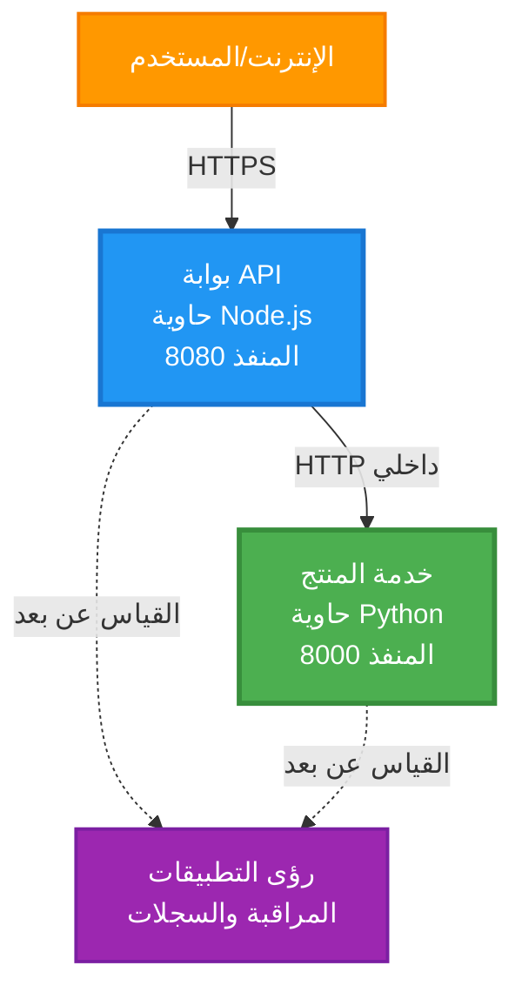
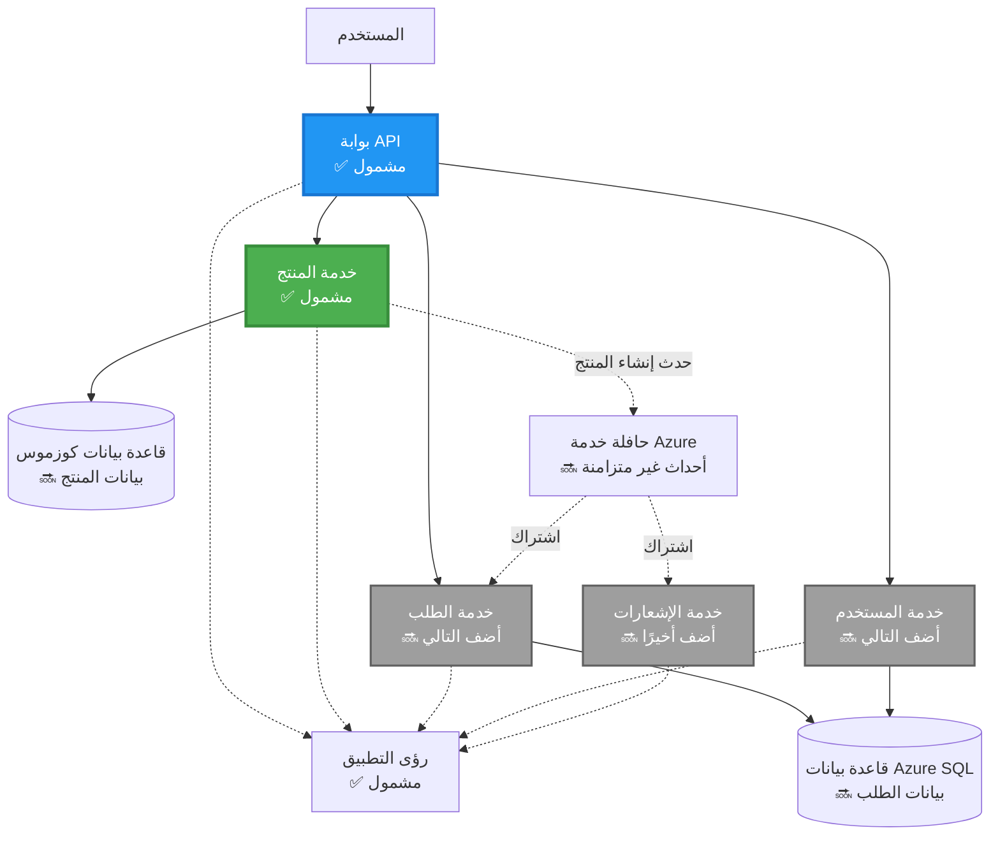
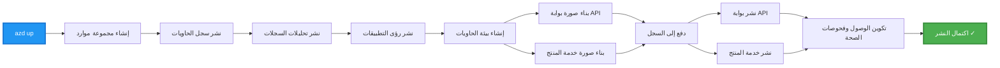
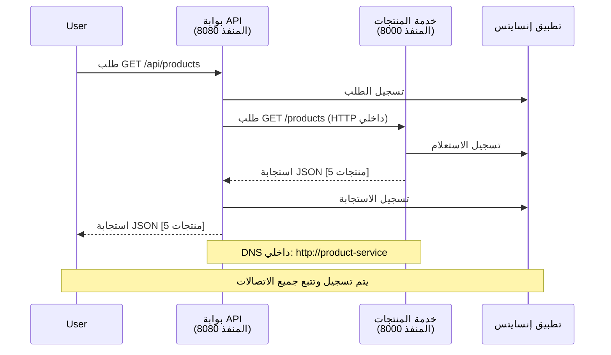

# بنية الخدمات المصغرة - مثال تطبيق الحاويات

⏱️ **الوقت المتوقع**: 25-35 دقيقة | 💰 **التكلفة المتوقعة**: ~$50-100/شهريًا | ⭐ **التعقيد**: متقدم

**📚 مسار التعلم:**
- ← السابق: [واجهة برمجية بسيطة باستخدام Flask](../../../../examples/container-app/simple-flask-api) - أساسيات الحاوية الواحدة
- 🎯 **أنت هنا**: بنية الخدمات المصغرة (أساس من خدمتين)
- → التالي: [دمج الذكاء الاصطناعي](../../../../docs/ai-foundry) - إضافة الذكاء إلى خدماتك
- 🏠 [الصفحة الرئيسية للدورة](../../README.md)

---

بنية خدمات مصغرة **مبسطة ولكن وظيفية** يتم نشرها على Azure Container Apps باستخدام AZD CLI. يوضح هذا المثال التواصل بين الخدمات، تنظيم الحاويات، والمراقبة باستخدام إعداد عملي من خدمتين.

> **📚 نهج التعلم**: يبدأ هذا المثال ببنية بسيطة من خدمتين (بوابة API + خدمة خلفية) يمكنك نشرها فعليًا والتعلم منها. بعد إتقان هذا الأساس، نقدم إرشادات للتوسع إلى نظام خدمات مصغرة كامل.

## ما ستتعلمه

عند إكمال هذا المثال، ستتمكن من:
- نشر عدة حاويات على Azure Container Apps
- تنفيذ التواصل بين الخدمات باستخدام الشبكات الداخلية
- تكوين التوسع بناءً على البيئة وفحص الصحة
- مراقبة التطبيقات الموزعة باستخدام Application Insights
- فهم أنماط نشر الخدمات المصغرة وأفضل الممارسات
- تعلم التوسع التدريجي من البنى البسيطة إلى المعقدة

## البنية

### المرحلة الأولى: ما نبنيه (مضمن في هذا المثال)


**تفاصيل المكونات:**

| المكون | الغرض | الوصول | الموارد |
|--------|-------|--------|---------|
| **بوابة API** | توجيه الطلبات الخارجية إلى الخدمات الخلفية | عام (HTTPS) | 1 vCPU، 2GB RAM، 2-20 نسخ |
| **خدمة المنتجات** | إدارة كتالوج المنتجات باستخدام بيانات في الذاكرة | داخلي فقط | 0.5 vCPU، 1GB RAM، 1-10 نسخ |
| **Application Insights** | تسجيل مركزي وتتبع موزع | بوابة Azure | 1-2 GB/شهريًا من البيانات |

**لماذا نبدأ ببساطة؟**
- ✅ النشر والفهم بسرعة (25-35 دقيقة)
- ✅ تعلم أنماط الخدمات المصغرة الأساسية بدون تعقيد
- ✅ كود عملي يمكنك تعديله وتجربته
- ✅ تكلفة أقل للتعلم (~$50-100/شهريًا مقابل $300-1400/شهريًا)
- ✅ بناء الثقة قبل إضافة قواعد البيانات وصفوف الرسائل

**تشبيه**: فكر في هذا كتعلم القيادة. تبدأ بموقف سيارات فارغ (خدمتين)، تتقن الأساسيات، ثم تتقدم إلى حركة المرور في المدينة (5+ خدمات مع قواعد بيانات).

### المرحلة الثانية: التوسع المستقبلي (بنية مرجعية)

بمجرد إتقان بنية الخدمتين، يمكنك التوسع إلى:


راجع قسم "دليل التوسع" في النهاية للحصول على تعليمات خطوة بخطوة.

## الميزات المضمنة

✅ **اكتشاف الخدمات**: اكتشاف تلقائي يعتمد على DNS بين الحاويات  
✅ **موازنة التحميل**: موازنة تحميل مدمجة عبر النسخ  
✅ **التوسع التلقائي**: التوسع المستقل لكل خدمة بناءً على طلبات HTTP  
✅ **مراقبة الصحة**: فحص الحياة والاستعداد لكلتا الخدمتين  
✅ **التسجيل الموزع**: تسجيل مركزي باستخدام Application Insights  
✅ **الشبكات الداخلية**: تواصل آمن بين الخدمات  
✅ **تنظيم الحاويات**: نشر وتوسع تلقائي  
✅ **تحديثات بدون توقف**: تحديثات متدرجة مع إدارة المراجعات  

## المتطلبات الأساسية

### الأدوات المطلوبة

قبل البدء، تحقق من تثبيت هذه الأدوات:

1. **[Azure Developer CLI (azd)](https://learn.microsoft.com/azure/developer/azure-developer-cli/install-azd)** (الإصدار 1.0.0 أو أعلى)
   ```bash
   azd version
   # الإصدار المتوقع: azd الإصدار 1.0.0 أو أعلى
   ```

2. **[Azure CLI](https://learn.microsoft.com/cli/azure/install-azure-cli)** (الإصدار 2.50.0 أو أعلى)
   ```bash
   az --version
   # الإصدار المتوقع: azure-cli 2.50.0 أو أعلى
   ```

3. **[Docker](https://www.docker.com/get-started)** (للتطوير/الاختبار المحلي - اختياري)
   ```bash
   docker --version
   # الإصدار المتوقع: إصدار Docker 20.10 أو أعلى
   ```

### تحقق من الإعداد الخاص بك

قم بتشغيل هذه الأوامر للتأكد من أنك جاهز:

```bash
# تحقق من Azure Developer CLI
azd version
# ✅ المتوقع: azd الإصدار 1.0.0 أو أعلى

# تحقق من Azure CLI
az --version
# ✅ المتوقع: azure-cli الإصدار 2.50.0 أو أعلى

# تحقق من Docker (اختياري)
docker --version
# ✅ المتوقع: إصدار Docker 20.10 أو أعلى
```

**معايير النجاح**: جميع الأوامر تعيد أرقام الإصدارات التي تطابق أو تتجاوز الحد الأدنى.

### متطلبات Azure

- اشتراك **Azure** نشط ([إنشاء حساب مجاني](https://azure.microsoft.com/free/))
- أذونات لإنشاء الموارد في اشتراكك
- دور **Contributor** على الاشتراك أو مجموعة الموارد

### المتطلبات المعرفية

هذا مثال **متقدم المستوى**. يجب أن تكون قد:
- أكملت مثال [واجهة برمجية بسيطة باستخدام Flask](../../../../examples/container-app/simple-flask-api) 
- لديك فهم أساسي لبنية الخدمات المصغرة
- معرفة بـ REST APIs و HTTP
- فهم مفاهيم الحاويات

**جديد على تطبيقات الحاويات؟** ابدأ بمثال [واجهة برمجية بسيطة باستخدام Flask](../../../../examples/container-app/simple-flask-api) أولاً لتعلم الأساسيات.

## البدء السريع (خطوة بخطوة)

### الخطوة 1: استنساخ وانتقل

```bash
git clone https://github.com/microsoft/AZD-for-beginners.git
cd AZD-for-beginners/examples/microservices
```

**✓ تحقق النجاح**: تحقق من رؤية `azure.yaml`:
```bash
ls
# المتوقع: README.md، azure.yaml، infra/، src/
```

### الخطوة 2: المصادقة مع Azure

```bash
azd auth login
```

يفتح هذا متصفحك للمصادقة مع Azure. قم بتسجيل الدخول باستخدام بيانات اعتماد Azure الخاصة بك.

**✓ تحقق النجاح**: يجب أن ترى:
```
Logged in to Azure.
```

### الخطوة 3: تهيئة البيئة

```bash
azd init
```

**المطالبات التي ستراها**:
- **اسم البيئة**: أدخل اسمًا قصيرًا (مثل `microservices-dev`)
- **اشتراك Azure**: اختر اشتراكك
- **موقع Azure**: اختر منطقة (مثل `eastus`, `westeurope`)

**✓ تحقق النجاح**: يجب أن ترى:
```
SUCCESS: New project initialized!
```

### الخطوة 4: نشر البنية التحتية والخدمات

```bash
azd up
```

**ما يحدث** (يستغرق 8-12 دقيقة):


**✓ تحقق النجاح**: يجب أن ترى:
```
SUCCESS: Your application was deployed to Azure in X minutes Y seconds.
Endpoint: https://api-gateway-<unique-id>.azurecontainerapps.io
```

**⏱️ الوقت**: 8-12 دقيقة

### الخطوة 5: اختبار النشر

```bash
# احصل على نقطة نهاية البوابة
GATEWAY_URL=$(azd env get-values | grep API_GATEWAY_URL | cut -d '=' -f2 | tr -d '"')

# اختبار صحة بوابة API
curl $GATEWAY_URL/health
```

**✅ النتيجة المتوقعة:**
```json
{
  "status": "healthy",
  "service": "api-gateway",
  "timestamp": "2025-11-19T10:30:00Z"
}
```

**اختبار خدمة المنتجات عبر البوابة**:
```bash
# قائمة المنتجات
curl $GATEWAY_URL/api/products
```

**✅ النتيجة المتوقعة:**
```json
[
  {"id":1,"name":"Laptop","price":999.99,"stock":50},
  {"id":2,"name":"Mouse","price":29.99,"stock":200},
  {"id":3,"name":"Keyboard","price":79.99,"stock":150}
]
```

**✓ تحقق النجاح**: كلا النقطتين النهائيتين تعيد بيانات JSON بدون أخطاء.

---

**🎉 تهانينا!** لقد قمت بنشر بنية خدمات مصغرة على Azure!

## هيكل المشروع

جميع ملفات التنفيذ مضمنة—هذا مثال كامل وعملي:

```
microservices/
│
├── README.md                         # This file
├── azure.yaml                        # AZD configuration
├── .gitignore                        # Git ignore patterns
│
├── infra/                           # Infrastructure as Code (Bicep)
│   ├── main.bicep                   # Main orchestration
│   ├── abbreviations.json           # Naming conventions
│   ├── core/                        # Shared infrastructure
│   │   ├── container-apps-environment.bicep  # Container environment + registry
│   │   └── monitor.bicep            # Application Insights + Log Analytics
│   └── app/                         # Service definitions
│       ├── api-gateway.bicep        # API Gateway container app
│       └── product-service.bicep    # Product Service container app
│
└── src/                             # Application source code
    ├── api-gateway/                 # Node.js API Gateway
    │   ├── app.js                   # Express server with routing
    │   ├── package.json             # Node dependencies
    │   └── Dockerfile               # Container definition
    └── product-service/             # Python Product Service
        ├── main.py                  # Flask API with product data
        ├── requirements.txt         # Python dependencies
        └── Dockerfile               # Container definition
```

**ما يفعله كل مكون:**

**البنية التحتية (infra/)**:
- `main.bicep`: ينظم جميع موارد Azure واعتمادياتها
- `core/container-apps-environment.bicep`: ينشئ بيئة تطبيقات الحاويات وسجل الحاويات Azure
- `core/monitor.bicep`: يهيئ Application Insights للتسجيل الموزع
- `app/*.bicep`: تعريفات تطبيقات الحاويات الفردية مع التوسع وفحص الصحة

**بوابة API (src/api-gateway/)**:
- خدمة تواجه الجمهور توجه الطلبات إلى الخدمات الخلفية
- تنفذ التسجيل، معالجة الأخطاء، وتوجيه الطلبات
- توضح التواصل بين الخدمات باستخدام HTTP

**خدمة المنتجات (src/product-service/)**:
- خدمة داخلية مع كتالوج المنتجات (في الذاكرة للتبسيط)
- واجهة REST API مع فحص الصحة
- مثال على نمط الخدمة الخلفية المصغرة

## نظرة عامة على الخدمات

### بوابة API (Node.js/Express)

**المنفذ**: 8080  
**الوصول**: عام (مدخل خارجي)  
**الغرض**: توجيه الطلبات الواردة إلى الخدمات الخلفية المناسبة  

**النقاط النهائية**:
- `GET /` - معلومات الخدمة
- `GET /health` - نقطة فحص الصحة
- `GET /api/products` - توجيه إلى خدمة المنتجات (عرض الكل)
- `GET /api/products/:id` - توجيه إلى خدمة المنتجات (عرض حسب المعرف)

**الميزات الرئيسية**:
- توجيه الطلبات باستخدام axios
- تسجيل مركزي
- معالجة الأخطاء وإدارة المهلات
- اكتشاف الخدمات عبر متغيرات البيئة
- تكامل Application Insights

**إبراز الكود** (`src/api-gateway/app.js`):
```javascript
// الاتصال الداخلي للخدمة
app.get('/api/products', async (req, res) => {
  const response = await axios.get(`${PRODUCT_SERVICE_URL}/products`, {
    timeout: 5000
  });
  res.json(response.data);
});
```

### خدمة المنتجات (Python/Flask)

**المنفذ**: 8000  
**الوصول**: داخلي فقط (لا يوجد مدخل خارجي)  
**الغرض**: إدارة كتالوج المنتجات باستخدام بيانات في الذاكرة  

**النقاط النهائية**:
- `GET /` - معلومات الخدمة
- `GET /health` - نقطة فحص الصحة
- `GET /products` - عرض جميع المنتجات
- `GET /products/<id>` - عرض المنتج حسب المعرف

**الميزات الرئيسية**:
- واجهة RESTful API باستخدام Flask
- متجر منتجات في الذاكرة (بسيط، لا حاجة لقاعدة بيانات)
- مراقبة الصحة باستخدام الفحوصات
- تسجيل منظم
- تكامل Application Insights

**نموذج البيانات**:
```python
{
  "id": 1,
  "name": "Laptop",
  "description": "High-performance laptop",
  "price": 999.99,
  "stock": 50
}
```

**لماذا داخلي فقط؟**
خدمة المنتجات غير مكشوفة للجمهور. يجب أن تمر جميع الطلبات عبر بوابة API، التي توفر:
- الأمان: نقطة وصول محكومة
- المرونة: يمكن تغيير الخلفية دون التأثير على العملاء
- المراقبة: تسجيل الطلبات المركزي

## فهم التواصل بين الخدمات

### كيف تتواصل الخدمات مع بعضها البعض


في هذا المثال، تتواصل بوابة API مع خدمة المنتجات باستخدام **مكالمات HTTP الداخلية**:

```javascript
// بوابة API (src/api-gateway/app.js)
const PRODUCT_SERVICE_URL = process.env.PRODUCT_SERVICE_URL;

// قم بإجراء طلب HTTP داخلي
const response = await axios.get(`${PRODUCT_SERVICE_URL}/products`);
```

**النقاط الرئيسية**:

1. **اكتشاف يعتمد على DNS**: توفر تطبيقات الحاويات تلقائيًا DNS للخدمات الداخلية
   - اسم المجال الكامل لخدمة المنتجات: `product-service.internal.<environment>.azurecontainerapps.io`
   - مبسط كـ: `http://product-service` (تطبيقات الحاويات تحلها)

2. **لا تعرض للجمهور**: خدمة المنتجات لديها `external: false` في Bicep
   - يمكن الوصول إليها فقط داخل بيئة تطبيقات الحاويات
   - لا يمكن الوصول إليها من الإنترنت

3. **متغيرات البيئة**: يتم حقن عناوين URL للخدمات أثناء وقت النشر
   - يقوم Bicep بتمرير اسم المجال الداخلي إلى البوابة
   - لا توجد عناوين URL ثابتة في كود التطبيق

**تشبيه**: فكر في هذا كغرف المكتب. بوابة API هي مكتب الاستقبال (تواجه الجمهور)، وخدمة المنتجات هي غرفة مكتب (داخلية فقط). يجب أن يمر الزوار عبر مكتب الاستقبال للوصول إلى أي غرفة.

## خيارات النشر

### النشر الكامل (موصى به)

```bash
# نشر البنية التحتية والخدمات الاثنين
azd up
```

هذا ينشر:
1. بيئة تطبيقات الحاويات
2. Application Insights
3. سجل الحاويات
4. حاوية بوابة API
5. حاوية خدمة المنتجات

**الوقت**: 8-12 دقيقة

### نشر خدمة فردية

```bash
# قم بنشر خدمة واحدة فقط (بعد azd up الأولي)
azd deploy api-gateway

# أو قم بنشر خدمة المنتج
azd deploy product-service
```

**حالة الاستخدام**: عندما تقوم بتحديث الكود في إحدى الخدمات وترغب في إعادة نشر تلك الخدمة فقط.

### تحديث التكوين

```bash
# تغيير معلمات القياس
azd env set GATEWAY_MAX_REPLICAS 30

# إعادة النشر مع التكوين الجديد
azd up
```

## التكوين

### تكوين التوسع

تم تكوين كلا الخدمتين مع التوسع التلقائي بناءً على HTTP في ملفات Bicep الخاصة بهما:

**بوابة API**:
- الحد الأدنى للنسخ: 2 (دائمًا على الأقل 2 للتوافر)
- الحد الأقصى للنسخ: 20
- مشغل التوسع: 50 طلبًا متزامنًا لكل نسخة

**خدمة المنتجات**:
- الحد الأدنى للنسخ: 1 (يمكن التوسع إلى الصفر إذا لزم الأمر)
- الحد الأقصى للنسخ: 10
- مشغل التوسع: 100 طلب متزامن لكل نسخة

**تخصيص التوسع** (في `infra/app/*.bicep`):
```bicep
scale: {
  minReplicas: 1
  maxReplicas: 10
  rules: [
    {
      name: 'http-scale-rule'
      http: {
        metadata: {
          concurrentRequests: '100'  // Adjust this
        }
      }
    }
  ]
}
```

### تخصيص الموارد

**بوابة API**:
- CPU: 1.0 vCPU
- الذاكرة: 2 GiB
- السبب: معالجة جميع حركة المرور الخارجية

**خدمة المنتجات**:
- CPU: 0.5 vCPU
- الذاكرة: 1 GiB
- السبب: عمليات خفيفة الوزن في الذاكرة

### فحص الصحة

تتضمن كلا الخدمتين فحوصات الحياة والاستعداد:

```bicep
probes: [
  {
    type: 'Liveness'
    httpGet: {
      path: '/health'
      port: 8080
    }
    initialDelaySeconds: 10
    periodSeconds: 30
  }
  {
    type: 'Readiness'
    httpGet: {
      path: '/health'
      port: 8080
    }
    initialDelaySeconds: 5
    periodSeconds: 10
  }
]
```

**ما يعنيه هذا**:
- **الحياة**: إذا فشل فحص الصحة، تقوم تطبيقات الحاويات بإعادة تشغيل الحاوية
- **الاستعداد**: إذا لم تكن جاهزة، تتوقف تطبيقات الحاويات عن توجيه الحركة إلى تلك النسخة

## المراقبة والملاحظة

### عرض سجلات الخدمة

```bash
# بث السجلات من بوابة API
azd logs api-gateway --follow

# عرض سجلات خدمة المنتجات الأخيرة
azd logs product-service --tail 100

# عرض جميع السجلات من كلا الخدمتين
azd logs --follow
```

**الناتج المتوقع**:
```
[api-gateway] API Gateway listening on port 8080
[api-gateway] Product Service URL: http://product-service
[api-gateway] GET /api/products 200 - 45ms
[product-service] Retrieved 5 products
```

### استعلامات Application Insights

قم بالوصول إلى Application Insights في بوابة Azure، ثم قم بتشغيل هذه الاستعلامات:

**العثور على الطلبات البطيئة**:
```kusto
requests
| where timestamp > ago(1h)
| where duration > 1000  // Requests taking >1 second
| summarize count() by name, cloud_RoleName
| order by count_ desc
```

**تتبع المكالمات بين الخدمات**:
```kusto
dependencies
| where timestamp > ago(1h)
| where type == "Http"
| project timestamp, name, target, duration, success
| order by timestamp desc
```

**معدل الأخطاء حسب الخدمة**:
```kusto
exceptions
| where timestamp > ago(24h)
| summarize errorCount = count() by cloud_RoleName, type
| order by errorCount desc
```

**حجم الطلبات بمرور الوقت**:
```kusto
requests
| where timestamp > ago(1h)
| summarize requestCount = count() by bin(timestamp, 5m), cloud_RoleName
| render timechart
```

### الوصول إلى لوحة المراقبة

```bash
# احصل على تفاصيل رؤى التطبيق
azd env get-values | grep APPLICATIONINSIGHTS

# افتح مراقبة بوابة أزور
az monitor app-insights component show \
  --app $(azd env get-values | grep APPLICATIONINSIGHTS_CONNECTION_STRING | cut -d '=' -f2) \
  --resource-group $(azd env get-values | grep AZURE_RESOURCE_GROUP | cut -d '=' -f2) \
  --query "appId" -o tsv
```

### المقاييس الحية

1. انتقل إلى Application Insights في بوابة Azure
2. انقر على "المقاييس الحية"
3. شاهد الطلبات، الأخطاء، والأداء في الوقت الفعلي
4. قم بالاختبار عن طريق تشغيل: `curl $(azd env get-values | grep API_GATEWAY_URL | cut -d '=' -f2 | tr -d '"')/api/products`

## التمارين العملية

### التمرين 1: إضافة نقطة نهاية منتج جديد ⭐ (سهل)

**الهدف**: إضافة نقطة نهاية POST لإنشاء منتجات جديدة

**نقطة البداية**: `src/product-service/main.py`

**الخطوات**:

1. أضف هذه النقطة النهاية بعد وظيفة `get_product` في `main.py`:

```python
@app.route('/products', methods=['POST'])
def create_product():
    """Create a new product"""
    data = request.get_json()
    
    # التحقق من الحقول المطلوبة
    if not data or 'name' not in data or 'price' not in data:
        return jsonify({'error': 'Missing required fields: name, price'}), 400
    
    new_id = max(p['id'] for p in products) + 1
    new_product = {
        'id': new_id,
        'name': data['name'],
        'description': data.get('description', ''),
        'price': float(data['price']),
        'stock': int(data.get('stock', 0))
    }
    products.append(new_product)
    logger.info(f"Created product {new_id}")
    return jsonify(new_product), 201
```

2. أضف مسار POST إلى بوابة API (`src/api-gateway/app.js`):

```javascript
// أضف هذا بعد مسار GET /api/products
app.post('/api/products', async (req, res) => {
  try {
    console.log(`Forwarding POST request to ${PRODUCT_SERVICE_URL}/products`);
    const response = await axios.post(`${PRODUCT_SERVICE_URL}/products`, req.body, {
      timeout: 5000
    });
    res.status(201).json(response.data);
  } catch (error) {
    console.error('Error calling product service:', error.message);
    res.status(503).json({
      error: 'Product service unavailable',
      message: error.message
    });
  }
});
```

3. إعادة نشر كلا الخدمتين:

```bash
azd deploy product-service
azd deploy api-gateway
```

4. اختبار نقطة النهاية الجديدة:

```bash
GATEWAY_URL=$(azd env get-values | grep API_GATEWAY_URL | cut -d '=' -f2 | tr -d '"')

# إنشاء منتج جديد
curl -X POST $GATEWAY_URL/api/products \
  -H "Content-Type: application/json" \
  -d '{"name":"USB Cable","price":9.99,"stock":500}'
```

**✅ النتيجة المتوقعة:**
```json
{"id":6,"name":"USB Cable","description":"","price":9.99,"stock":500}
```

5. التحقق من ظهورها في القائمة:

```bash
curl $GATEWAY_URL/api/products
# يجب أن يظهر الآن 6 منتجات بما في ذلك كابل USB الجديد
```

**معايير النجاح**:
- ✅ طلب POST يعيد HTTP 201
- ✅ المنتج الجديد يظهر في قائمة GET /api/products
- ✅ المنتج يحتوي على معرف يتم زيادته تلقائيًا

**الوقت**: 10-15 دقيقة

---

### التمرين 2: تعديل قواعد التوسع التلقائي ⭐⭐ (متوسط)

**الهدف**: تغيير خدمة المنتج لتتوسع بشكل أكثر عدوانية

**نقطة البداية**: `infra/app/product-service.bicep`

**الخطوات**:

1. افتح `infra/app/product-service.bicep` وابحث عن كتلة `scale` (حوالي السطر 95)

2. قم بالتغيير من:
```bicep
scale: {
  minReplicas: 1
  maxReplicas: 10
  rules: [
    {
      name: 'http-scale-rule'
      http: {
        metadata: {
          concurrentRequests: '100'  // OLD
        }
      }
    }
  ]
}
```

إلى:
```bicep
scale: {
  minReplicas: 2  // Always have 2 running
  maxReplicas: 20  // Allow more scaling
  rules: [
    {
      name: 'http-scale-rule'
      http: {
        metadata: {
          concurrentRequests: '20'  // Scale at lower threshold
        }
      }
    }
  ]
}
```

3. إعادة نشر البنية التحتية:

```bash
azd up
```

4. التحقق من تكوين التوسع الجديد:

```bash
az containerapp show \
  --name $(azd env get-values | grep PRODUCT_SERVICE | head -1 | cut -d '/' -f5) \
  --resource-group $(azd env get-values | grep AZURE_RESOURCE_GROUP | cut -d '=' -f2 | tr -d '"') \
  --query "properties.template.scale" -o json
```

**✅ النتيجة المتوقعة:**
```json
{
  "minReplicas": 2,
  "maxReplicas": 20,
  "rules": [...]
}
```

5. اختبار التوسع التلقائي مع التحميل:

```bash
# إنشاء طلبات متزامنة
for i in {1..500}; do curl $GATEWAY_URL/api/products & done

# مراقبة حدوث التوسع
azd logs product-service --follow
# البحث عن: أحداث توسع تطبيقات الحاويات
```

**معايير النجاح**:
- ✅ خدمة المنتج تعمل دائمًا على الأقل بنسختين
- ✅ تحت التحميل، تتوسع إلى أكثر من نسختين
- ✅ بوابة Azure تعرض قواعد التوسع الجديدة

**الوقت**: 15-20 دقيقة

---

### التمرين 3: إضافة استعلام مراقبة مخصص ⭐⭐ (متوسط)

**الهدف**: إنشاء استعلام مخصص في Application Insights لتتبع أداء واجهة برمجة التطبيقات للمنتجات

**الخطوات**:

1. انتقل إلى Application Insights في بوابة Azure:
   - اذهب إلى بوابة Azure
   - ابحث عن مجموعة الموارد الخاصة بك (rg-microservices-*)
   - انقر على مورد Application Insights

2. انقر على "Logs" في القائمة الجانبية

3. أنشئ هذا الاستعلام:

```kusto
requests
| where timestamp > ago(1h)
| where name contains "products"
| summarize 
    RequestCount = count(),
    AvgDuration = avg(duration),
    P95Duration = percentile(duration, 95),
    SuccessRate = 100.0 * countif(success == true) / count()
  by bin(timestamp, 5m)
| render timechart
```

4. انقر على "Run" لتنفيذ الاستعلام

5. احفظ الاستعلام:
   - انقر على "Save"
   - الاسم: "Product API Performance"
   - الفئة: "Performance"

6. قم بإنشاء حركة مرور اختبارية:

```bash
for i in {1..100}; do curl $GATEWAY_URL/api/products; sleep 1; done
```

7. قم بتحديث الاستعلام لرؤية البيانات

**✅ النتيجة المتوقعة:**
- مخطط يظهر عدد الطلبات على مدار الوقت
- متوسط المدة < 500ms
- معدل النجاح = 100%
- فواصل زمنية مدتها 5 دقائق

**معايير النجاح**:
- ✅ الاستعلام يظهر 100+ طلب
- ✅ معدل النجاح هو 100%
- ✅ متوسط المدة < 500ms
- ✅ المخطط يعرض فواصل زمنية مدتها 5 دقائق

**نتيجة التعلم**: فهم كيفية مراقبة أداء الخدمة باستخدام استعلامات مخصصة

**الوقت**: 10-15 دقيقة

---

### التمرين 4: تنفيذ منطق إعادة المحاولة ⭐⭐⭐ (متقدم)

**الهدف**: إضافة منطق إعادة المحاولة إلى بوابة API عندما تكون خدمة المنتج غير متاحة مؤقتًا

**نقطة البداية**: `src/api-gateway/app.js`

**الخطوات**:

1. تثبيت مكتبة إعادة المحاولة:

```bash
cd src/api-gateway
npm install axios-retry --save
cd ../..
```

2. تحديث `src/api-gateway/app.js` (أضف بعد استيراد axios):

```javascript
const axiosRetry = require('axios-retry');

// تكوين منطق إعادة المحاولة
axiosRetry(axios, {
  retries: 3,
  retryDelay: (retryCount) => {
    return retryCount * 1000; // 1 ثانية، 2 ثانية، 3 ثانية
  },
  retryCondition: (error) => {
    // إعادة المحاولة عند أخطاء الشبكة أو استجابات 5xx
    return axiosRetry.isNetworkOrIdempotentRequestError(error) ||
           (error.response && error.response.status >= 500);
  }
});

console.log('Retry logic configured: 3 retries with exponential backoff');
```

3. إعادة نشر بوابة API:

```bash
azd deploy api-gateway
```

4. اختبار سلوك إعادة المحاولة عن طريق محاكاة فشل الخدمة:

```bash
# تقليص خدمة المنتج إلى 0 (محاكاة الفشل)
az containerapp update \
  --name $(azd env get-values | grep PRODUCT_SERVICE | head -1 | cut -d '/' -f5) \
  --resource-group $(azd env get-values | grep AZURE_RESOURCE_GROUP | cut -d '=' -f2 | tr -d '"') \
  --min-replicas 0 \
  --max-replicas 0

# حاول الوصول إلى المنتجات (سيتم المحاولة 3 مرات)
time curl -v $GATEWAY_URL/api/products
# لاحظ: الاستجابة تستغرق حوالي 6 ثوانٍ (1 ثانية + 2 ثانية + 3 ثوانٍ محاولات)

# استعادة خدمة المنتج
az containerapp update \
  --name $(azd env get-values | grep PRODUCT_SERVICE | head -1 | cut -d '/' -f5) \
  --resource-group $(azd env get-values | grep AZURE_RESOURCE_GROUP | cut -d '=' -f2 | tr -d '"') \
  --min-replicas 1 \
  --max-replicas 10
```

5. عرض سجلات إعادة المحاولة:

```bash
azd logs api-gateway --tail 50
# ابحث عن: رسائل محاولة إعادة المحاولة
```

**✅ السلوك المتوقع:**
- الطلبات تعيد المحاولة 3 مرات قبل الفشل
- كل محاولة انتظار أطول (1 ثانية، 2 ثانية، 3 ثوانٍ)
- الطلبات الناجحة بعد إعادة تشغيل الخدمة
- السجلات تظهر محاولات إعادة المحاولة

**معايير النجاح**:
- ✅ الطلبات تعيد المحاولة 3 مرات قبل الفشل
- ✅ كل محاولة انتظار أطول (تراجع أسي)
- ✅ الطلبات الناجحة بعد إعادة تشغيل الخدمة
- ✅ السجلات تظهر محاولات إعادة المحاولة

**نتيجة التعلم**: فهم أنماط المرونة في الخدمات المصغرة (قواطع الدائرة، إعادة المحاولة، مهلات)

**الوقت**: 20-25 دقيقة

---

## نقطة التحقق المعرفية

بعد إكمال هذا المثال، تحقق من فهمك:

### 1. التواصل بين الخدمات ✓

اختبر معرفتك:
- [ ] هل يمكنك شرح كيف تكتشف بوابة API خدمة المنتج؟ (اكتشاف الخدمة عبر DNS)
- [ ] ماذا يحدث إذا كانت خدمة المنتج معطلة؟ (البوابة تعيد خطأ 503)
- [ ] كيف تضيف خدمة ثالثة؟ (إنشاء ملف Bicep جديد، إضافته إلى main.bicep، إنشاء مجلد src)

**التحقق العملي:**
```bash
# محاكاة فشل الخدمة
az containerapp update --name <product-service-name> --min-replicas 0 --max-replicas 0
curl $GATEWAY_URL/api/products
# ✅ المتوقع: 503 الخدمة غير متوفرة

# استعادة الخدمة
az containerapp update --name <product-service-name> --min-replicas 1 --max-replicas 10
```

### 2. المراقبة والملاحظة ✓

اختبر معرفتك:
- [ ] أين ترى السجلات الموزعة؟ (Application Insights في بوابة Azure)
- [ ] كيف تتبع الطلبات البطيئة؟ (استعلام Kusto: `requests | where duration > 1000`)
- [ ] هل يمكنك تحديد أي خدمة تسببت في خطأ؟ (تحقق من الحقل `cloud_RoleName` في السجلات)

**التحقق العملي:**
```bash
# إنشاء محاكاة طلب بطيء
curl "$GATEWAY_URL/api/products?delay=2000"

# استعلام عن طلبات بطيئة في Application Insights
# الانتقال إلى Azure Portal → Application Insights → Logs
# تشغيل: requests | where duration > 1000 | project timestamp, name, duration, cloud_RoleName
```

### 3. التوسع والأداء ✓

اختبر معرفتك:
- [ ] ما الذي يحفز التوسع التلقائي؟ (قواعد الطلبات المتزامنة HTTP: 50 للبوابة، 100 للمنتج)
- [ ] كم عدد النسخ التي تعمل الآن؟ (تحقق باستخدام `az containerapp revision list`)
- [ ] كيف تقوم بتوسيع خدمة المنتج إلى 5 نسخ؟ (تحديث minReplicas في Bicep)

**التحقق العملي:**
```bash
# إنشاء حمل لاختبار التوسع التلقائي
for i in {1..1000}; do curl $GATEWAY_URL/api/products & done

# مراقبة زيادة النسخ
azd logs api-gateway --follow
# ✅ المتوقع: رؤية أحداث التوسع في السجلات
```

**معايير النجاح**: يمكنك الإجابة على جميع الأسئلة والتحقق باستخدام الأوامر العملية.

---

## تحليل التكلفة

### التكاليف الشهرية المقدرة (لهذا المثال ذو الخدمتين)

| المورد | التكوين | التكلفة المقدرة |
|--------|---------|-----------------|
| بوابة API | 2-20 نسخ، 1 vCPU، 2GB RAM | $30-150 |
| خدمة المنتج | 1-10 نسخ، 0.5 vCPU، 1GB RAM | $15-75 |
| سجل الحاويات | المستوى الأساسي | $5 |
| Application Insights | 1-2 GB/شهر | $5-10 |
| Log Analytics | 1 GB/شهر | $3 |
| **الإجمالي** | | **$58-243/شهر** |

### تفصيل التكلفة حسب الاستخدام

**حركة مرور خفيفة** (اختبار/تعلم): ~$60/شهر
- بوابة API: 2 نسخ × 24/7 = $30
- خدمة المنتج: 1 نسخة × 24/7 = $15
- المراقبة + السجل = $13

**حركة مرور معتدلة** (إنتاج صغير): ~$120/شهر
- بوابة API: متوسط 5 نسخ = $75
- خدمة المنتج: متوسط 3 نسخ = $45
- المراقبة + السجل = $13

**حركة مرور عالية** (فترات مزدحمة): ~$240/شهر
- بوابة API: متوسط 15 نسخة = $225
- خدمة المنتج: متوسط 8 نسخ = $120
- المراقبة + السجل = $13

### نصائح لتقليل التكلفة

1. **التوسع إلى الصفر للتطوير**:
   ```bicep
   scale: {
     minReplicas: 0  // Save $30-40/month when not in use
     maxReplicas: 10
   }
   ```

2. **استخدام خطة الاستهلاك لـ Cosmos DB** (عند إضافتها):
   - الدفع فقط مقابل ما تستخدمه
   - لا توجد رسوم دنيا

3. **تعيين أخذ العينات لـ Application Insights**:
   ```javascript
   appInsights.defaultClient.config.samplingPercentage = 50; // عينات 50% من الطلبات
   ```

4. **تنظيف الموارد عند عدم الحاجة**:
   ```bash
   azd down --force --purge
   ```

### خيارات المستوى المجاني

للتعلم/الاختبار، ضع في اعتبارك:
- ✅ استخدام أرصدة Azure المجانية ($200 لأول 30 يومًا مع الحسابات الجديدة)
- ✅ الحفاظ على الحد الأدنى من النسخ (يوفر ~50% من التكاليف)
- ✅ الحذف بعد الاختبار (لا توجد رسوم مستمرة)
- ✅ التوسع إلى الصفر بين جلسات التعلم

**مثال**: تشغيل هذا المثال لمدة ساعتين/يوم × 30 يومًا = ~$5/شهر بدلًا من $60/شهر

---

## مرجع سريع لحل المشاكل

### المشكلة: `azd up` يفشل مع "Subscription not found"

**الحل**:
```bash
# تسجيل الدخول مرة أخرى مع الاشتراك الصريح
az account set --subscription <your-subscription-id>
azd env set AZURE_SUBSCRIPTION_ID <your-subscription-id>
azd up
```

### المشكلة: بوابة API تعيد 503 "خدمة المنتج غير متاحة"

**التشخيص**:
```bash
# تحقق من سجلات خدمة المنتج
azd logs product-service --tail 50

# تحقق من صحة خدمة المنتج
az containerapp show \
  --name $(azd env get-values | grep PRODUCT_SERVICE | head -1 | cut -d '/' -f5) \
  --resource-group $(azd env get-values | grep AZURE_RESOURCE_GROUP | cut -d '=' -f2 | tr -d '"') \
  --query "properties.runningStatus"
```

**الأسباب الشائعة**:
1. خدمة المنتج لم تبدأ (تحقق من السجلات لأخطاء Python)
2. فشل فحص الصحة (تحقق من عمل نقطة النهاية `/health`)
3. فشل بناء صورة الحاوية (تحقق من السجل للصورة)

### المشكلة: التوسع التلقائي لا يعمل

**التشخيص**:
```bash
# تحقق من عدد النسخ الحالي
az containerapp revision list \
  --name $(azd env get-values | grep API_GATEWAY | head -1 | cut -d '/' -f5) \
  --resource-group $(azd env get-values | grep AZURE_RESOURCE_GROUP | cut -d '=' -f2 | tr -d '"') \
  --query "[].properties.replicas"

# قم بإنشاء حمل للاختبار
for i in {1..1000}; do curl $GATEWAY_URL/api/products & done

# راقب أحداث التوسع
azd logs api-gateway --follow | grep -i scale
```

**الأسباب الشائعة**:
1. التحميل غير كافٍ لتحفيز قاعدة التوسع (تحتاج >50 طلبًا متزامنًا)
2. الحد الأقصى للنسخ تم الوصول إليه بالفعل (تحقق من تكوين Bicep)
3. قاعدة التوسع غير مهيأة بشكل صحيح في Bicep (تحقق من قيمة concurrentRequests)

### المشكلة: Application Insights لا تعرض السجلات

**التشخيص**:
```bash
# تحقق من تعيين سلسلة الاتصال
azd env get-values | grep APPLICATIONINSIGHTS

# تحقق مما إذا كانت الخدمات ترسل القياسات عن بعد
az monitor app-insights component show \
  --app $(azd env get-values | grep APPLICATIONINSIGHTS_NAME | cut -d '=' -f2 | tr -d '"') \
  --resource-group $(azd env get-values | grep AZURE_RESOURCE_GROUP | cut -d '=' -f2 | tr -d '"') \
  --query "properties.InstrumentationKey"
```

**الأسباب الشائعة**:
1. سلسلة الاتصال لم يتم تمريرها إلى الحاوية (تحقق من متغيرات البيئة)
2. SDK الخاص بـ Application Insights غير مهيأ (تحقق من الاستيرادات في الكود)
3. جدار الحماية يحجب التتبع (نادر، تحقق من قواعد الشبكة)

### المشكلة: بناء Docker يفشل محليًا

**التشخيص**:
```bash
# اختبار بناء بوابة API
cd src/api-gateway
docker build -t test-gateway .

# اختبار بناء خدمة المنتج
cd ../product-service
docker build -t test-product .
```

**الأسباب الشائعة**:
1. الاعتماديات مفقودة في package.json/requirements.txt
2. أخطاء في صياغة Dockerfile
3. مشاكل الشبكة أثناء تنزيل الاعتماديات

**ما زلت تواجه مشكلة؟** راجع [دليل المشاكل الشائعة](../../docs/troubleshooting/common-issues.md) أو [استكشاف مشاكل Azure Container Apps](https://learn.microsoft.com/azure/container-apps/troubleshooting)

---

## التنظيف

لتجنب الرسوم المستمرة، احذف جميع الموارد:

```bash
azd down --force --purge
```

**موجه التأكيد**:
```
? Total resources to delete: 6, are you sure you want to continue? (y/N)
```

اكتب `y` للتأكيد.

**ما الذي يتم حذفه**:
- بيئة تطبيقات الحاويات
- كلا تطبيقات الحاويات (البوابة وخدمة المنتج)
- سجل الحاويات
- Application Insights
- مساحة عمل Log Analytics
- مجموعة الموارد

**✓ تحقق من التنظيف**:
```bash
az group list --query "[?starts_with(name,'rg-microservices')]" --output table
```

يجب أن يعود فارغًا.

---

## دليل التوسع: من 2 إلى 5+ خدمات

بمجرد إتقانك لهذه البنية ذات الخدمتين، إليك كيفية التوسع:

### المرحلة 1: إضافة قاعدة بيانات للتخزين (الخطوة التالية)

**إضافة Cosmos DB لخدمة المنتج**:

1. إنشاء `infra/core/cosmos.bicep`:
   ```bicep
   resource cosmosAccount 'Microsoft.DocumentDB/databaseAccounts@2023-04-15' = {
     name: name
     location: location
     kind: 'GlobalDocumentDB'
     properties: {
       databaseAccountOfferType: 'Standard'
       consistencyPolicy: { defaultConsistencyLevel: 'Session' }
       locations: [{ locationName: location, failoverPriority: 0 }]
     }
   }
   ```

2. تحديث خدمة المنتج لاستخدام Azure Cosmos DB Python SDK بدلًا من البيانات في الذاكرة

3. التكلفة الإضافية المقدرة: ~$25/شهر (بدون خادم)

### المرحلة 2: إضافة خدمة ثالثة (إدارة الطلبات)

**إنشاء خدمة الطلبات**:

1. مجلد جديد: `src/order-service/` (Python/Node.js/C#)
2. Bicep جديد: `infra/app/order-service.bicep`
3. تحديث بوابة API لتوجيه `/api/orders`
4. إضافة قاعدة بيانات Azure SQL لتخزين الطلبات

**تصبح البنية**:
```
API Gateway → Product Service (Cosmos DB)
           → Order Service (Azure SQL)
```

### المرحلة 3: إضافة التواصل غير المتزامن (Service Bus)

**تنفيذ بنية تعتمد على الأحداث**:

1. إضافة Azure Service Bus: `infra/core/servicebus.bicep`
2. خدمة المنتج تنشر أحداث "ProductCreated"
3. خدمة الطلبات تشترك في أحداث المنتج
4. إضافة خدمة الإشعارات لمعالجة الأحداث

**النمط**: طلب/استجابة (HTTP) + يعتمد على الأحداث (Service Bus)

### المرحلة 4: إضافة مصادقة المستخدم

**تنفيذ خدمة المستخدم**:

1. إنشاء `src/user-service/` (Go/Node.js)
2. إضافة Azure AD B2C أو مصادقة JWT مخصصة
3. بوابة API تتحقق من الرموز قبل التوجيه
4. الخدمات تتحقق من أذونات المستخدم

### المرحلة 5: جاهزية الإنتاج

**إضافة هذه المكونات**:
- ✅ Azure Front Door (توزيع التحميل العالمي)
- ✅ Azure Key Vault (إدارة الأسرار)
- ✅ Azure Monitor Workbooks (لوحات معلومات مخصصة)
- ✅ خط أنابيب CI/CD (GitHub Actions)
- ✅ عمليات النشر الزرقاء والخضراء
- ✅ هوية مُدارة لجميع الخدمات

**تكلفة بنية الإنتاج الكاملة**: ~$300-1,400/شهر

---

## تعلم المزيد

### الوثائق ذات الصلة
- [وثائق Azure Container Apps](https://learn.microsoft.com/azure/container-apps/)
- [دليل بنية الخدمات المصغرة](https://learn.microsoft.com/azure/architecture/guide/architecture-styles/microservices)
- [Application Insights للتتبع الموزع](https://learn.microsoft.com/azure/azure-monitor/app/distributed-tracing)
- [وثائق Azure Developer CLI](https://learn.microsoft.com/azure/developer/azure-developer-cli/)

### الخطوات التالية في هذه الدورة
- ← السابق: [واجهة برمجة تطبيقات Flask بسيطة](../../../../examples/container-app/simple-flask-api) - مثال مبتدئ لحاوية واحدة
- → التالي: [دليل دمج الذكاء الاصطناعي](../../../../docs/ai-foundry) - إضافة قدرات الذكاء الاصطناعي
- 🏠 [الصفحة الرئيسية للدورة](../../README.md)

### المقارنة: متى تستخدم ماذا

| الميزة | حاوية واحدة | الخدمات المصغرة (هذا) | Kubernetes (AKS) |
|--------|-------------|-----------------------|------------------|
| **حالة الاستخدام** | تطبيقات بسيطة | تطبيقات معقدة | تطبيقات مؤسسية |
| **القابلية للتوسع** | خدمة واحدة | التوسع لكل خدمة | أقصى مرونة |
| **التعقيد** | منخفض | متوسط | عالي |
| **حجم الفريق** | 1-3 مطورين | 3-10 مطورين | 10+ مطورين |
| **التكلفة** | ~$15-50/شهر | ~$60-250/شهر | ~$150-500/شهر |
| **وقت النشر** | 5-10 دقائق | 8-12 دقيقة | 15-30 دقيقة |
| **أفضل استخدام** | النماذج الأولية، MVPs | تطبيقات الإنتاج | الشبكات المتقدمة، السحابة المتعددة |

**التوصية**: ابدأ باستخدام Container Apps (هذا المثال)، وانتقل إلى AKS فقط إذا كنت بحاجة إلى ميزات محددة لـ Kubernetes.

---

## الأسئلة الشائعة

**س: لماذا فقط خدمتين بدلاً من 5+؟**  
ج: تقدم تعليمي. تعلم الأساسيات (التواصل بين الخدمات، المراقبة، التوسع) باستخدام مثال بسيط قبل إضافة التعقيد. الأنماط التي تتعلمها هنا تنطبق على بنى تحتوي على 100 خدمة.

**س: هل يمكنني إضافة المزيد من الخدمات بنفسي؟**  
ج: بالتأكيد! اتبع دليل التوسع أعلاه. كل خدمة جديدة تتبع نفس النمط: إنشاء مجلد src، إنشاء ملف Bicep، تحديث azure.yaml، النشر.

**س: هل هذا جاهز للإنتاج؟**  
ج: إنه أساس قوي. للإنتاج، أضف: الهوية المُدارة، Key Vault، قواعد بيانات دائمة، خط أنابيب CI/CD، تنبيهات المراقبة، واستراتيجية النسخ الاحتياطي.

**س: لماذا لا نستخدم Dapr أو أي شبكة خدمات أخرى؟**  
ج: اجعل الأمور بسيطة للتعلم. بمجرد فهمك لشبكات Container Apps الأصلية، يمكنك إضافة Dapr للسيناريوهات المتقدمة (إدارة الحالة، pub/sub، الروابط).

**س: كيف يمكنني تصحيح الأخطاء محليًا؟**  
ج: قم بتشغيل الخدمات محليًا باستخدام Docker:  
```bash
cd src/api-gateway
docker build -t local-gateway .
docker run -p 8080:8080 -e PRODUCT_SERVICE_URL=http://localhost:8000 local-gateway
```
  
**س: هل يمكنني استخدام لغات برمجة مختلفة؟**  
ج: نعم! هذا المثال يظهر Node.js (البوابة) + Python (خدمة المنتجات). يمكنك دمج أي لغات تعمل في الحاويات: C#، Go، Java، Ruby، PHP، إلخ.

**س: ماذا لو لم يكن لدي أرصدة Azure؟**  
ج: استخدم الطبقة المجانية من Azure (الأيام الـ30 الأولى مع الحسابات الجديدة تحصل على أرصدة بقيمة $200) أو قم بالنشر لفترات اختبار قصيرة واحذفها فورًا. هذا المثال يكلف حوالي $2/يوم.

**س: كيف يختلف هذا عن Azure Kubernetes Service (AKS)؟**  
ج: Container Apps أبسط (لا تحتاج إلى معرفة Kubernetes) ولكنه أقل مرونة. AKS يمنحك التحكم الكامل في Kubernetes ولكنه يتطلب خبرة أكبر. ابدأ بـ Container Apps، وانتقل إلى AKS إذا لزم الأمر.

**س: هل يمكنني استخدام هذا مع خدمات Azure الحالية؟**  
ج: نعم! يمكنك الاتصال بقواعد البيانات الحالية، حسابات التخزين، Service Bus، إلخ. قم بتحديث ملفات Bicep للإشارة إلى الموارد الحالية بدلاً من إنشاء موارد جديدة.

---

> **🎓 ملخص مسار التعلم**: لقد تعلمت نشر بنية متعددة الخدمات مع التوسع التلقائي، الشبكات الداخلية، المراقبة المركزية، وأنماط جاهزة للإنتاج. هذا الأساس يجهزك لأنظمة موزعة معقدة وبنى خدمات صغيرة للمؤسسات.

**📚 تنقل الدورة:**
- ← السابق: [Simple Flask API](../../../../examples/container-app/simple-flask-api)
- → التالي: [Database Integration Example](../../../../database-app)
- 🏠 [الصفحة الرئيسية للدورة](../../README.md)
- 📖 [أفضل ممارسات Container Apps](../../docs/deployment/deployment-guide.md)

---

**✨ تهانينا!** لقد أكملت مثال الخدمات الصغيرة. أنت الآن تفهم كيفية بناء، نشر، ومراقبة التطبيقات الموزعة على Azure Container Apps. جاهز لإضافة قدرات الذكاء الاصطناعي؟ تحقق من [دليل دمج الذكاء الاصطناعي](../../../../docs/ai-foundry)!

---

<!-- CO-OP TRANSLATOR DISCLAIMER START -->
**إخلاء المسؤولية**:  
تم ترجمة هذا المستند باستخدام خدمة الترجمة بالذكاء الاصطناعي [Co-op Translator](https://github.com/Azure/co-op-translator). بينما نسعى لتحقيق الدقة، يرجى العلم أن الترجمات الآلية قد تحتوي على أخطاء أو عدم دقة. يجب اعتبار المستند الأصلي بلغته الأصلية المصدر الموثوق. للحصول على معلومات حاسمة، يُوصى بالترجمة البشرية الاحترافية. نحن غير مسؤولين عن أي سوء فهم أو تفسيرات خاطئة ناتجة عن استخدام هذه الترجمة.
<!-- CO-OP TRANSLATOR DISCLAIMER END -->