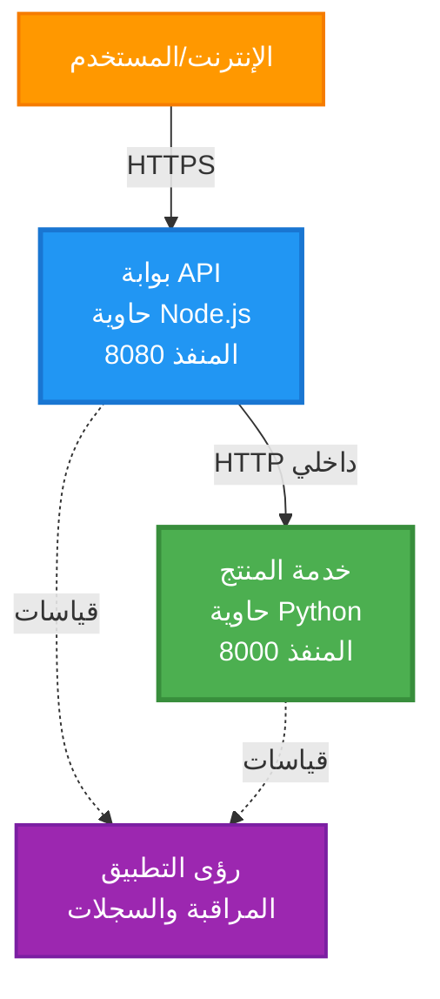
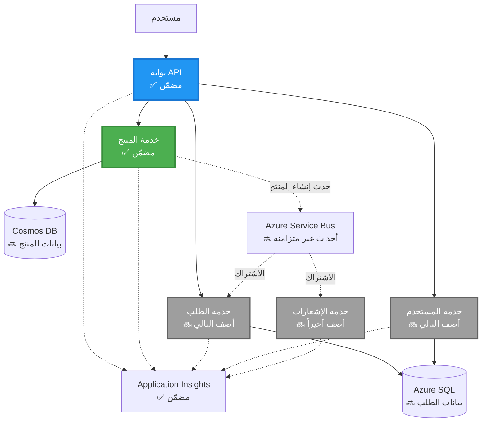
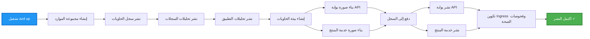
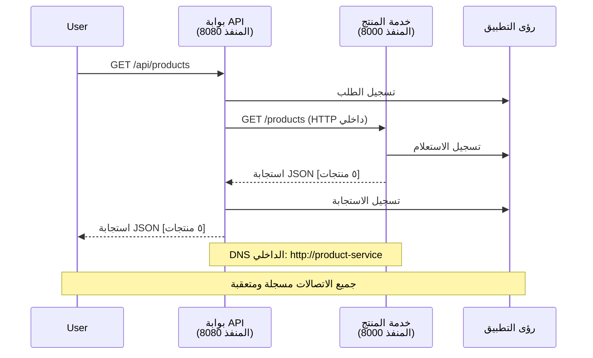

# بنية الخدمات المصغرة - مثال تطبيق الحاويات

⏱️ **الوقت المقدر**: 25-35 دقيقة | 💰 **التكلفة المقدرة**: ~$50-100/شهر | ⭐ **التعقيد**: متقدم

**📚 مسار التعلم:**
- ← السابق: [واجهة برمجة تطبيقات Flask بسيطة](../../../../examples/container-app/simple-flask-api) - أساسيات الحاوية الواحدة
- 🎯 **أنت هنا**: بنية الخدمات المصغرة (أساس من خدمتين)
- → التالي: [تكامل الذكاء الاصطناعي](../../../../docs/ai-foundry) - أضف ذكاءً إلى خدماتك
- 🏠 [الصفحة الرئيسية للدورة](../../README.md)

---

بنية خدمات مصغرة **مبسطة لكنها عملية** مُنشَرة على Azure Container Apps باستخدام AZD CLI. يوضح هذا المثال التواصل بين الخدمات، تنظيم الحاويات، والمراقبة من خلال إعداد عملي مؤلَّف من خدمتين.

> **📚 نهج التعلم**: يبدأ هذا المثال ببنية بسيطة من خدمتين (بوابة API + خدمة الواجهة الخلفية) يمكنك نشرها والتعلم منها فعليًا. بعد إتقان هذا الأساس، نقدم إرشادات لتوسيعها إلى نظام خدمات مصغرة كامل.

## ما ستتعلم

بإكمال هذا المثال، ستتمكن من:
- نشر حاويات متعددة على Azure Container Apps
- تنفيذ تواصل بين الخدمات عبر الشبكات الداخلية
- تهيئة التحجيم بناءً على البيئة وفحوصات الصحة
- مراقبة التطبيقات الموزعة باستخدام Application Insights
- فهم أنماط نشر الخدمات المصغرة وأفضل الممارسات
- تعلم التوسع التدريجي من البسيط إلى البنيات المعقدة

## البنية

### المرحلة 1: ما الذي نبنيه (مضمّن في هذا المثال)


**تفاصيل المكونات:**

| المكون | الغرض | الوصول | الموارد |
|-----------|---------|--------|-----------|
| **بوابة API** | يوجّه الطلبات الخارجية إلى خدمات الواجهة الخلفية | عام (HTTPS) | 1 vCPU، 2GB ذاكرة، 2-20 نُسخ |
| **خدمة المنتجات** | يدير فهرس المنتجات ببيانات مخزنة في الذاكرة | داخلي فقط | 0.5 vCPU، 1GB ذاكرة، 1-10 نُسخ |
| **Application Insights** | تسجيل مركزي وتتبع موزّع | بوابة Azure | 1-2 GB/شهر استيعاب بيانات |

**لماذا نبدأ ببساطة؟**
- ✅ انشر وافهم بسرعة (25-35 دقيقة)
- ✅ تعلم أنماط الخدمات المصغرة الأساسية بدون تعقيد
- ✅ شيفرة عملية يمكنك تعديلها والتجربة عليها
- ✅ تكلفة أقل للتعلّم (~$50-100/شهر مقابل $300-1400/شهر)
- ✅ ابنِ الثقة قبل إضافة قواعد البيانات وطوابير الرسائل

**تشبيه**: فكر في هذا مثل تعلم القيادة. تبدأ بموقف سيارات فارغ (خدمتان)، تتقن الأساسيات، ثم تتقدم إلى حركة المرور في المدينة (5+ خدمات مع قواعد بيانات).

### المرحلة 2: التوسع المستقبلي (بنية مرجعية)

بمجرد أن تتقن بنية الخدمتين، يمكنك التوسع إلى:


انظر قسم "دليل التوسع" في النهاية للحصول على تعليمات خطوة بخطوة.

## الميزات المضمنة

✅ **اكتشاف الخدمات**: اكتشاف تلقائي قائم على DNS بين الحاويات  
✅ **موازنة التحميل**: موازنة تحميل مدمجة عبر النسخ  
✅ **التحجيم التلقائي**: تحجيم مستقل لكل خدمة بناءً على طلبات HTTP  
✅ **مراقبة الصحة**: فحوصات liveness وreadiness لكلتا الخدمتين  
✅ **التسجيل الموزع**: تسجيل مركزي باستخدام Application Insights  
✅ **الشبكات الداخلية**: تواصل آمن بين الخدمات  
✅ **تنسيق الحاويات**: نشر وتحجيم تلقائي  
✅ **تحديثات بدون توقف**: تحديثات تدريجية مع إدارة الإصدارات  

## المتطلبات المسبقة

### الأدوات المطلوبة

قبل البدء، تحقق من تثبيت هذه الأدوات:

1. **[Azure Developer CLI (azd)](https://learn.microsoft.com/azure/developer/azure-developer-cli/install-azd)** (الإصدار 1.0.0 أو أحدث)
   ```bash
   azd version
   # المخرجات المتوقعة: azd بالإصدار 1.0.0 أو أعلى
   ```

2. **[Azure CLI](https://learn.microsoft.com/cli/azure/install-azure-cli)** (الإصدار 2.50.0 أو أحدث)
   ```bash
   az --version
   # الإخراج المتوقع: azure-cli 2.50.0 أو أعلى
   ```

3. **[Docker](https://www.docker.com/get-started)** (للتطوير/الاختبار المحلي - اختياري)
   ```bash
   docker --version
   # الإخراج المتوقع: إصدار Docker 20.10 أو أعلى
   ```

### تحقق من إعدادك

شغّل هذه الأوامر لتأكيد أن النظام جاهز:

```bash
# تحقق من Azure Developer CLI
azd version
# ✅ متوقع: إصدار azd 1.0.0 أو أعلى

# تحقق من Azure CLI
az --version
# ✅ متوقع: إصدار azure-cli 2.50.0 أو أعلى

# تحقق من Docker (اختياري)
docker --version
# ✅ متوقع: إصدار Docker 20.10 أو أعلى
```

**معايير النجاح**: تُرجع جميع الأوامر أرقام إصدار تساوي أو تتجاوز الحد الأدنى.

### متطلبات Azure

- اشتراك **Azure** نشط ([إنشاء حساب مجاني](https://azure.microsoft.com/free/))
- أذونات لإنشاء موارد في اشتراكك
- دور **Contributor** على الاشتراك أو مجموعة الموارد

### المتطلبات المعرفية

هذا مثال على مستوى **متقدم**. يجب أن تكون لديك:
- أن تكون قد أكملت مثال [واجهة برمجة تطبيقات Flask بسيطة](../../../../examples/container-app/simple-flask-api) 
- فهم أساسي لبنية الخدمات المصغرة
- دراية بـ REST APIs و HTTP
- فهم لمفاهيم الحاويات

**جديد على Container Apps؟** ابدأ أولًا بمثال [واجهة برمجة تطبيقات Flask بسيطة](../../../../examples/container-app/simple-flask-api) لتعلّم الأساسيات.

## بدء سريع (خطوة بخطوة)

### الخطوة 1: الاستنساخ والتنقل

```bash
git clone https://github.com/microsoft/AZD-for-beginners.git
cd AZD-for-beginners/examples/microservices
```

**✓ فحص النجاح**: تأكد من رؤية `azure.yaml`:
```bash
ls
# المتوقع: README.md, azure.yaml, infra/, src/
```

### الخطوة 2: المصادقة مع Azure

```bash
azd auth login
```

يفتح هذا المتصفح للمصادقة مع Azure. سجّل الدخول باستخدام بيانات اعتماد Azure الخاصة بك.

**✓ فحص النجاح**: يجب أن ترى:
```
Logged in to Azure.
```

### الخطوة 3: تهيئة البيئة

```bash
azd init
```

**المطالبات التي سترىها**:
- **اسم البيئة**: أدخل اسمًا مختصرًا (مثال: `microservices-dev`)
- **اشتراك Azure**: اختر اشتراكك
- **منطقة Azure**: اختر منطقة (مثال: `eastus`, `westeurope`)

**✓ فحص النجاح**: يجب أن ترى:
```
SUCCESS: New project initialized!
```

### الخطوة 4: نشر البنية التحتية والخدمات

```bash
azd up
```

**ما الذي يحدث** (يستغرق 8-12 دقيقة):


**✓ فحص النجاح**: يجب أن ترى:
```
SUCCESS: Your application was deployed to Azure in X minutes Y seconds.
Endpoint: https://api-gateway-<unique-id>.azurecontainerapps.io
```

**⏱️ الوقت**: 8-12 دقيقة

### الخطوة 5: اختبار النشر

```bash
# الحصول على نقطة نهاية البوابة
GATEWAY_URL=$(azd env get-values | grep API_GATEWAY_URL | cut -d '=' -f2 | tr -d '"')

# اختبار صحة بوابة واجهة برمجة التطبيقات
curl $GATEWAY_URL/health
```

**✅ المخرجات المتوقعة:**
```json
{
  "status": "healthy",
  "service": "api-gateway",
  "timestamp": "2025-11-19T10:30:00Z"
}
```

**اختبر خدمة المنتجات عبر البوابة**:
```bash
# قائمة المنتجات
curl $GATEWAY_URL/api/products
```

**✅ المخرجات المتوقعة:**
```json
[
  {"id":1,"name":"Laptop","price":999.99,"stock":50},
  {"id":2,"name":"Mouse","price":29.99,"stock":200},
  {"id":3,"name":"Keyboard","price":79.99,"stock":150}
]
```

**✓ فحص النجاح**: كلا نقطتي النهاية تُرجعان بيانات JSON بدون أخطاء.

---

**🎉 تهانينا!** لقد نشرت بنية خدمات مصغرة على Azure!

## هيكل المشروع

جميع ملفات التنفيذ مُضمَّنة—هذا مثال كامل وقابل للعمل:

```
microservices/
│
├── README.md                         # This file
├── azure.yaml                        # AZD configuration
├── .gitignore                        # Git ignore patterns
│
├── infra/                           # Infrastructure as Code (Bicep)
│   ├── main.bicep                   # Main orchestration
│   ├── abbreviations.json           # Naming conventions
│   ├── core/                        # Shared infrastructure
│   │   ├── container-apps-environment.bicep  # Container environment + registry
│   │   └── monitor.bicep            # Application Insights + Log Analytics
│   └── app/                         # Service definitions
│       ├── api-gateway.bicep        # API Gateway container app
│       └── product-service.bicep    # Product Service container app
│
└── src/                             # Application source code
    ├── api-gateway/                 # Node.js API Gateway
    │   ├── app.js                   # Express server with routing
    │   ├── package.json             # Node dependencies
    │   └── Dockerfile               # Container definition
    └── product-service/             # Python Product Service
        ├── main.py                  # Flask API with product data
        ├── requirements.txt         # Python dependencies
        └── Dockerfile               # Container definition
```

**ماذا يفعل كل مكون:**

**البنية التحتية (infra/)**:
- `main.bicep`: يُنسّق جميع موارد Azure واعتمادياتها
- `core/container-apps-environment.bicep`: ينشئ بيئة Container Apps وسجل الحاويات الخاص بـ Azure
- `core/monitor.bicep`: يُعدُّ Application Insights للتسجيل الموزع
- `app/*.bicep`: تعريفات تطبيقات الحاويات الفردية مع إعدادات التحجيم وفحوصات الصحة

**بوابة API (src/api-gateway/)**:
- خدمة مُواجهَة للعامة توجّه الطلبات إلى خدمات الواجهة الخلفية
- تنفّذ التسجيل، ومعالجة الأخطاء، وإعادة توجيه الطلبات
- توضح تواصل HTTP بين الخدمات

**خدمة المنتجات (src/product-service/)**:
- خدمة داخلية تحتوي على فهرس منتجات (مخزّن في الذاكرة للبساطة)
- واجهة REST مع فحوصات الصحة
- مثال على نمط خدمة خلفية مصغرة

## نظرة عامة على الخدمات

### بوابة API (Node.js/Express)

**المنفذ**: 8080  
**الوصول**: عام (دخول خارجي)  
**الغرض**: توجيه الطلبات الواردة إلى خدمات الواجهة الخلفية المناسبة  

**نقاط النهاية**:
- `GET /` - معلومات عن الخدمة
- `GET /health` - نقطة فحص الحالة
- `GET /api/products` - إعادة توجيه إلى خدمة المنتجات (قائمة الكل)
- `GET /api/products/:id` - إعادة توجيه إلى خدمة المنتجات (جلب حسب المعرف)

**الميزات الرئيسية**:
- توجيه الطلبات باستخدام axios
- تسجيل مركزي
- معالجة الأخطاء وإدارة المهلات
- اكتشاف الخدمات عبر متغيرات البيئة
- تكامل مع Application Insights

**تسليط الضوء على الشيفرة** (`src/api-gateway/app.js`):
```javascript
// التواصل الداخلي بين الخدمات
app.get('/api/products', async (req, res) => {
  const response = await axios.get(`${PRODUCT_SERVICE_URL}/products`, {
    timeout: 5000
  });
  res.json(response.data);
});
```

### خدمة المنتجات (Python/Flask)

**المنفذ**: 8000  
**الوصول**: داخلي فقط (لا دخول خارجي)  
**الغرض**: يدير فهرس المنتجات ببيانات مخزنة في الذاكرة  

**نقاط النهاية**:
- `GET /` - معلومات عن الخدمة
- `GET /health` - نقطة فحص الحالة
- `GET /products` - عرض جميع المنتجات
- `GET /products/<id>` - جلب المنتج حسب المعرف

**الميزات الرئيسية**:
- واجهة RESTful باستخدام Flask
- مخزن منتجات في الذاكرة (بسيط، لا حاجة لقاعدة بيانات)
- مراقبة الصحة باستخدام الفحوصات
- تسجيل منظم
- تكامل مع Application Insights

**نموذج البيانات**:
```python
{
  "id": 1,
  "name": "Laptop",
  "description": "High-performance laptop",
  "price": 999.99,
  "stock": 50
}
```

**لماذا داخلي فقط؟**
خدمة المنتجات غير مكشوفة للعامة. يجب أن تمر كل الطلبات عبر بوابة API، والتي توفر:
- الأمان: نقطة وصول مُتحكم بها
- المرونة: يمكن تغيير الواجهة الخلفية دون التأثير على العملاء
- المراقبة: تسجيل مركزي للطلبات

## فهم تواصل الخدمات

### كيف تتواصل الخدمات مع بعضها


في هذا المثال، تتواصل بوابة API مع خدمة المنتجات باستخدام **نداءات HTTP داخلية**:

```javascript
// بوابة واجهة برمجة التطبيقات (src/api-gateway/app.js)
const PRODUCT_SERVICE_URL = process.env.PRODUCT_SERVICE_URL;

// إجراء طلب HTTP داخلي
const response = await axios.get(`${PRODUCT_SERVICE_URL}/products`);
```

**النقاط الرئيسية**:

1. **الاكتشاف القائم على DNS**: توفر Container Apps تلقائيًا DNS للخدمات الداخلية
   - اسم المجال المؤهل لخدمة المنتجات: `product-service.internal.<environment>.azurecontainerapps.io`
   - مبسّطًا إلى: `http://product-service` (تحله Container Apps)

2. **لا تعرض علنًا**: تحتوي خدمة المنتجات على `external: false` في Bicep
   - متاحة فقط داخل بيئة Container Apps
   - لا يمكن الوصول إليها من الإنترنت

3. **متغيرات البيئة**: يتم حقن عناوين URL للخدمات وقت النشر
   - يمرر Bicep اسم المجال المؤهل الداخلي إلى البوابة
   - لا عناوين URL مضمنة ثابتة في شيفرة التطبيق

**تشبيه**: فكر في هذا كغرف المكاتب. بوابة API هي مكتب الاستقبال (مواجه للعامة)، وخدمة المنتجات هي غرفة مكتب (داخلية فقط). يجب على الزوار المرور عبر الاستقبال للوصول لأي مكتب.

## خيارات النشر

### نشر كامل (موصى به)

```bash
# نشر البنية التحتية والخدمتين
azd up
```

يُنشِئ هذا النشر:
1. بيئة Container Apps
2. Application Insights
3. سجل الحاويات
4. حاوية بوابة API
5. حاوية خدمة المنتجات

**الوقت**: 8-12 دقيقة

### نشر خدمة فردية

```bash
# انشر خدمة واحدة فقط (بعد التشغيل الأولي لـ azd up)
azd deploy api-gateway

# أو انشر خدمة المنتج
azd deploy product-service
```

**حالة الاستخدام**: عندما تقوم بتحديث الشيفرة في خدمة واحدة وترغب في إعادة نشر تلك الخدمة فقط.

### تحديث التكوين

```bash
# تغيير معلمات التحجيم
azd env set GATEWAY_MAX_REPLICAS 30

# إعادة النشر بالتكوين الجديد
azd up
```

## التهيئة

### إعدادات التحجيم

تم تكوين كلتا الخدمتين مع تحجيم تلقائي قائم على HTTP في ملفات Bicep الخاصة بهما:

**بوابة API**:
- الحد الأدنى من النسخ: 2 (دائمًا على الأقل 2 من أجل التوافر)
- الحد الأقصى من النسخ: 20
- مُحرِّك التحجيم: 50 طلبًا متزامنًا لكل نسخة

**خدمة المنتجات**:
- الحد الأدنى من النسخ: 1 (يمكن أن تنخفض إلى الصفر إذا لزم الأمر)
- الحد الأقصى من النسخ: 10
- مُحرِّك التحجيم: 100 طلب متزامن لكل نسخة

**تخصيص التحجيم** (في `infra/app/*.bicep`):
```bicep
scale: {
  minReplicas: 1
  maxReplicas: 10
  rules: [
    {
      name: 'http-scale-rule'
      http: {
        metadata: {
          concurrentRequests: '100'  // Adjust this
        }
      }
    }
  ]
}
```

### تخصيص الموارد

**بوابة API**:
- CPU: 1.0 vCPU
- الذاكرة: 2 GiB
- السبب: تتعامل مع كل حركة المرور الخارجية

**خدمة المنتجات**:
- CPU: 0.5 vCPU
- الذاكرة: 1 GiB
- السبب: عمليات خفيفة في الذاكرة

### فحوصات الصحة

تتضمن كلتا الخدمتين فحوصات liveness و readiness:

```bicep
probes: [
  {
    type: 'Liveness'
    httpGet: {
      path: '/health'
      port: 8080
    }
    initialDelaySeconds: 10
    periodSeconds: 30
  }
  {
    type: 'Readiness'
    httpGet: {
      path: '/health'
      port: 8080
    }
    initialDelaySeconds: 5
    periodSeconds: 10
  }
]
```

**ما يعنيه هذا**:
- **Liveness**: إذا فشل فحص الصحة، تعيد Container Apps تشغيل الحاوية
- **Readiness**: إذا لم تكن جاهزة، توقف Container Apps توجيه الحركة لتلك النسخة

## الرصد وقابلية الملاحظة

### عرض سجلات الخدمة

```bash
# عرض السجلات باستخدام azd monitor
azd monitor --logs

# أو استخدم Azure CLI لتطبيقات الحاويات المحددة:
# بث السجلات من بوابة API
az containerapp logs show --name api-gateway --resource-group $RG_NAME --follow

# عرض السجلات الأخيرة لخدمة المنتج
az containerapp logs show --name product-service --resource-group $RG_NAME --tail 100
```

**المخرجات المتوقعة**:
```
[api-gateway] API Gateway listening on port 8080
[api-gateway] Product Service URL: http://product-service
[api-gateway] GET /api/products 200 - 45ms
[product-service] Retrieved 5 products
```

### استعلامات Application Insights

ادخل إلى Application Insights في بوابة Azure، ثم شغّل هذه الاستعلامات:

**العثور على الطلبات البطيئة**:
```kusto
requests
| where timestamp > ago(1h)
| where duration > 1000  // Requests taking >1 second
| summarize count() by name, cloud_RoleName
| order by count_ desc
```

**تتبع نداءات الخدمة إلى الخدمة**:
```kusto
dependencies
| where timestamp > ago(1h)
| where type == "Http"
| project timestamp, name, target, duration, success
| order by timestamp desc
```

**معدل الأخطاء حسب الخدمة**:
```kusto
exceptions
| where timestamp > ago(24h)
| summarize errorCount = count() by cloud_RoleName, type
| order by errorCount desc
```

**حجم الطلبات عبر الزمن**:
```kusto
requests
| where timestamp > ago(1h)
| summarize requestCount = count() by bin(timestamp, 5m), cloud_RoleName
| render timechart
```

### الوصول إلى لوحة مراقبة

```bash
# الحصول على تفاصيل Application Insights
azd env get-values | grep APPLICATIONINSIGHTS

# افتح مراقبة بوابة Azure
az monitor app-insights component show \
  --app $(azd env get-values | grep APPLICATIONINSIGHTS_CONNECTION_STRING | cut -d '=' -f2) \
  --resource-group $(azd env get-values | grep AZURE_RESOURCE_GROUP | cut -d '=' -f2) \
  --query "appId" -o tsv
```

### المقاييس الحية

1. اذهب إلى Application Insights في بوابة Azure
2. انقر على "Live Metrics"
3. شاهد الطلبات، الإخفاقات، والأداء في الوقت الحقيقي
4. اختبر بتشغيل: `curl $(azd env get-values | grep API_GATEWAY_URL | cut -d '=' -f2 | tr -d '"')/api/products`

## تمارين عملية

### التمرين 1: إضافة نقطة نهاية منتج جديدة ⭐ (سهل)

**الهدف**: إضافة نقطة نهاية POST لإنشاء منتجات جديدة

**نقطة البدء**: `src/product-service/main.py`

**الخطوات**:

1. أضف هذه النقطة النهائية بعد دالة `get_product` في `main.py`:

```python
@app.route('/products', methods=['POST'])
def create_product():
    """Create a new product"""
    data = request.get_json()
    
    # التحقق من الحقول المطلوبة
    if not data or 'name' not in data or 'price' not in data:
        return jsonify({'error': 'Missing required fields: name, price'}), 400
    
    new_id = max(p['id'] for p in products) + 1
    new_product = {
        'id': new_id,
        'name': data['name'],
        'description': data.get('description', ''),
        'price': float(data['price']),
        'stock': int(data.get('stock', 0))
    }
    products.append(new_product)
    logger.info(f"Created product {new_id}")
    return jsonify(new_product), 201
```

2. أضف مسار POST إلى بوابة API (`src/api-gateway/app.js`):

```javascript
// أضف هذا بعد مسار GET /api/products
app.post('/api/products', async (req, res) => {
  try {
    console.log(`Forwarding POST request to ${PRODUCT_SERVICE_URL}/products`);
    const response = await axios.post(`${PRODUCT_SERVICE_URL}/products`, req.body, {
      timeout: 5000
    });
    res.status(201).json(response.data);
  } catch (error) {
    console.error('Error calling product service:', error.message);
    res.status(503).json({
      error: 'Product service unavailable',
      message: error.message
    });
  }
});
```

3. إعادة نشر الخدمتين:

```bash
azd deploy product-service
azd deploy api-gateway
```

4. اختبر نقطة النهاية الجديدة:

```bash
GATEWAY_URL=$(azd env get-values | grep API_GATEWAY_URL | cut -d '=' -f2 | tr -d '"')

# إنشاء منتج جديد
curl -X POST $GATEWAY_URL/api/products \
  -H "Content-Type: application/json" \
  -d '{"name":"USB Cable","price":9.99,"stock":500}'
```

**✅ المخرجات المتوقعة:**
```json
{"id":6,"name":"USB Cable","description":"","price":9.99,"stock":500}
```

5. تحقق من ظهوره في القائمة:

```bash
curl $GATEWAY_URL/api/products
# يجب الآن عرض 6 منتجات، بما في ذلك كابل USB الجديد
```

**معايير النجاح**:
- ✅ يعيد طلب POST رمز الحالة HTTP 201
- ✅ يظهر منتج جديد في قائمة GET /api/products
- ✅ المنتج له معرف متزايد تلقائيًا

**الوقت**: 10-15 دقيقة

---

### التمرين 2: تعديل قواعد التحجيم التلقائي ⭐⭐ (متوسط)

**الهدف**: تغيير خدمة المنتجات لتتوسع بشكل أكثر عدوانية

**نقطة البداية**: `infra/app/product-service.bicep`

**الخطوات**:

1. افتح `infra/app/product-service.bicep` وابحث عن كتلة `scale` (حوالي السطر 95)

2. غيّر من:
```bicep
scale: {
  minReplicas: 1
  maxReplicas: 10
  rules: [
    {
      name: 'http-scale-rule'
      http: {
        metadata: {
          concurrentRequests: '100'  // OLD
        }
      }
    }
  ]
}
```

إلى:
```bicep
scale: {
  minReplicas: 2  // Always have 2 running
  maxReplicas: 20  // Allow more scaling
  rules: [
    {
      name: 'http-scale-rule'
      http: {
        metadata: {
          concurrentRequests: '20'  // Scale at lower threshold
        }
      }
    }
  ]
}
```

3. أعد نشر البنية التحتية:

```bash
azd up
```

4. تحقق من تكوين التحجيم الجديد:

```bash
az containerapp show \
  --name $(azd env get-values | grep PRODUCT_SERVICE | head -1 | cut -d '/' -f5) \
  --resource-group $(azd env get-values | grep AZURE_RESOURCE_GROUP | cut -d '=' -f2 | tr -d '"') \
  --query "properties.template.scale" -o json
```

**✅ المخرجات المتوقعة:**
```json
{
  "minReplicas": 2,
  "maxReplicas": 20,
  "rules": [...]
}
```

5. اختبر التحجيم التلقائي مع حمل:

```bash
# توليد طلبات متزامنة
for i in {1..500}; do curl $GATEWAY_URL/api/products & done

# راقب حدوث التحجيم باستخدام واجهة سطر أوامر Azure
az containerapp logs show --name product-service --resource-group $RG_NAME --follow
# ابحث عن: أحداث تحجيم تطبيقات الحاويات
```

**معايير النجاح**:
- ✅ تعمل خدمة المنتجات دائمًا على الأقل بنسختين
- ✅ تحت الحمل، تتوسع إلى أكثر من نسختين
- ✅ يعرض Azure Portal قواعد التحجيم الجديدة

**الوقت**: 15-20 دقيقة

---

### التمرين 3: إضافة استعلام مراقبة مخصص ⭐⭐ (متوسط)

**الهدف**: إنشاء استعلام مخصص في Application Insights لتتبع أداء واجهة برمجة تطبيقات المنتج

**الخطوات**:

1. انتقل إلى Application Insights في Azure Portal:
   - اذهب إلى Azure Portal
   - ابحث عن مجموعة الموارد الخاصة بك (rg-microservices-*)
   - انقر على مورد Application Insights

2. انقر على "Logs" في القائمة اليسرى

3. أنشئ هذا الاستعلام:

```kusto
requests
| where timestamp > ago(1h)
| where name contains "products"
| summarize 
    RequestCount = count(),
    AvgDuration = avg(duration),
    P95Duration = percentile(duration, 95),
    SuccessRate = 100.0 * countif(success == true) / count()
  by bin(timestamp, 5m)
| render timechart
```

4. انقر على "Run" لتشغيل الاستعلام

5. احفظ الاستعلام:
   - انقر على "Save"
   - الاسم: "أداء واجهة برمجة تطبيقات المنتج"
   - الفئة: "الأداء"

6. قم بتوليد حركة اختبار:

```bash
for i in {1..100}; do curl $GATEWAY_URL/api/products; sleep 1; done
```

7. قم بتحديث الاستعلام لرؤية البيانات

**✅ المخرجات المتوقعة:**
- مخطط يوضح عدد الطلبات مع مرور الوقت
- متوسط المدة < 500ms
- معدل النجاح = 100%
- فواصل زمنية لمدة 5 دقائق

**معايير النجاح**:
- ✅ يظهر الاستعلام أكثر من 100 طلب
- ✅ معدل النجاح 100%
- ✅ متوسط المدة < 500ms
- ✅ يعرض المخطط فواصل زمنية مدتها 5 دقائق

**نتيجة التعلم**: فهم كيفية مراقبة أداء الخدمة باستخدام استعلامات مخصصة

**الوقت**: 10-15 دقيقة

---

### التمرين 4: تنفيذ منطق إعادة المحاولة ⭐⭐⭐ (متقدم)

**الهدف**: إضافة منطق إعادة المحاولة إلى API Gateway عندما تكون خدمة المنتجات غير متاحة مؤقتًا

**نقطة البداية**: `src/api-gateway/app.js`

**الخطوات**:

1. ثبّت مكتبة إعادة المحاولة:

```bash
cd src/api-gateway
npm install axios-retry --save
cd ../..
```

2. حدّث `src/api-gateway/app.js` (أضف بعد استيراد axios):

```javascript
const axiosRetry = require('axios-retry');

// تكوين منطق إعادة المحاولة
axiosRetry(axios, {
  retries: 3,
  retryDelay: (retryCount) => {
    return retryCount * 1000; // 1 ث، 2 ث، 3 ث
  },
  retryCondition: (error) => {
    // أعد المحاولة عند أخطاء الشبكة أو استجابات 5xx
    return axiosRetry.isNetworkOrIdempotentRequestError(error) ||
           (error.response && error.response.status >= 500);
  }
});

console.log('Retry logic configured: 3 retries with exponential backoff');
```

3. أعد نشر API Gateway:

```bash
azd deploy api-gateway
```

4. اختبر سلوك إعادة المحاولة بمحاكاة فشل الخدمة:

```bash
# ضبط مقياس خدمة المنتج إلى 0 (محاكاة فشل)
az containerapp update \
  --name $(azd env get-values | grep PRODUCT_SERVICE | head -1 | cut -d '/' -f5) \
  --resource-group $(azd env get-values | grep AZURE_RESOURCE_GROUP | cut -d '=' -f2 | tr -d '"') \
  --min-replicas 0 \
  --max-replicas 0

# محاولة الوصول إلى المنتجات (سيُعاد المحاولة 3 مرات)
time curl -v $GATEWAY_URL/api/products
# ملاحظة: تستغرق الاستجابة حوالي 6 ثوانٍ (1 ث + 2 ث + 3 ث من المحاولات)

# استعادة خدمة المنتج
az containerapp update \
  --name $(azd env get-values | grep PRODUCT_SERVICE | head -1 | cut -d '/' -f5) \
  --resource-group $(azd env get-values | grep AZURE_RESOURCE_GROUP | cut -d '=' -f2 | tr -d '"') \
  --min-replicas 1 \
  --max-replicas 10
```

5. عرض سجلات إعادة المحاولة:

```bash
az containerapp logs show --name api-gateway --resource-group $RG_NAME --tail 50
# ابحث عن: رسائل محاولة إعادة المحاولة
```

**✅ السلوك المتوقع:**
- تحاول الطلبات إعادة المحاولة 3 مرات قبل الفشل
- تنتظر كل محاولة إعادة لفترة أطول (1s، 2s، 3s)
- الطلبات تنجح بعد إعادة تشغيل الخدمة
- تُظهر السجلات محاولات إعادة المحاولة

**معايير النجاح**:
- ✅ تحاول الطلبات إعادة المحاولة 3 مرات قبل الفشل
- ✅ تنتظر كل محاولة إعادة أطول (تراجع أُسّي)
- ✅ الطلبات تنجح بعد إعادة تشغيل الخدمة
- ✅ تُظهر السجلات محاولات إعادة المحاولة

**نتيجة التعلم**: فهم أنماط المرونة في الخدمات المصغرة (قواطع الدائرة، إعادة المحاولة، المهلات)

**الوقت**: 20-25 دقيقة

---

## نقطة التحقق من المعرفة

بعد إكمال هذا المثال، تحقق من فهمك:

### 1. الاتصال بالخدمات ✓

اختبر معرفتك:
- [ ] هل يمكنك شرح كيف يكتشف API Gateway خدمة المنتجات؟ (اكتشاف الخدمة قائم على DNS)
- [ ] ماذا يحدث إذا كانت خدمة المنتجات متوقفة؟ (تعيد البوابة خطأ 503)
- [ ] كيف ستضيف خدمة ثالثة؟ (إنشاء ملف Bicep جديد، إضافته إلى main.bicep، إنشاء مجلد src)

**التحقق العملي:**
```bash
# محاكاة فشل الخدمة
az containerapp update --name <product-service-name> --min-replicas 0 --max-replicas 0
curl $GATEWAY_URL/api/products
# ✅ متوقع: 503 الخدمة غير متاحة

# استعادة الخدمة
az containerapp update --name <product-service-name> --min-replicas 1 --max-replicas 10
```

### 2. المراقبة والملاحظة ✓

اختبر معرفتك:
- [ ] أين ترى السجلات الموزعة؟ (Application Insights في Azure Portal)
- [ ] كيف تتتبع الطلبات البطيئة؟ (استعلام Kusto: `requests | where duration > 1000`)
- [ ] هل يمكنك تحديد أي خدمة سببت الخطأ؟ (افحص الحقل `cloud_RoleName` في السجلات)

**التحقق العملي:**
```bash
# توليد محاكاة لطلب بطيء
curl "$GATEWAY_URL/api/products?delay=2000"

# إجراء استعلام في Application Insights عن الطلبات البطيئة
# انتقل إلى بوابة Azure → Application Insights → السجلات
# شغّل: requests | where duration > 1000 | project timestamp, name, duration, cloud_RoleName
```

### 3. التحجيم والأداء ✓

اختبر معرفتك:
- [ ] ما الذي يطلق التحجيم التلقائي؟ (قواعد الطلبات المتزامنة عبر HTTP: 50 للبوابة، 100 للمنتج)
- [ ] كم عدد النسخ العاملة الآن؟ (تحقق باستخدام `az containerapp revision list`)
- [ ] كيف ستزيد خدمة المنتجات إلى 5 نسخ؟ (حدّث minReplicas في Bicep)

**التحقق العملي:**
```bash
# توليد حمل لاختبار التحجيم التلقائي
for i in {1..1000}; do curl $GATEWAY_URL/api/products & done

# مراقبة زيادة النسخ باستخدام واجهة سطر أوامر Azure
az containerapp logs show --name api-gateway --resource-group $RG_NAME --follow
# ✅ المتوقع: رؤية أحداث التحجيم في السجلات
```

**معايير النجاح**: يمكنك الإجابة على جميع الأسئلة والتحقق باستخدام أوامر عملية.

---

## تحليل التكلفة

### التكاليف الشهرية المقدرة (لهذا المثال المكوّن من خدمتين)

| المورد | التكوين | التكلفة المقدرة |
|----------|--------------|----------------|
| API Gateway | 2-20 replicas, 1 vCPU, 2GB RAM | $30-150 |
| خدمة المنتجات | 1-10 replicas, 0.5 vCPU, 1GB RAM | $15-75 |
| Container Registry | Basic tier | $5 |
| Application Insights | 1-2 GB/month | $5-10 |
| Log Analytics | 1 GB/month | $3 |
| **الإجمالي** | | **$58-243/month** |

### تفصيل التكلفة حسب الاستخدام

**حركة مرور خفيفة** (اختبار/تعلم): ~$60/month
- API Gateway: 2 replicas × 24/7 = $30
- خدمة المنتجات: 1 replica × 24/7 = $15
- المراقبة + السجل = $13

**حركة مرور معتدلة** (إنتاج صغير): ~$120/month
- API Gateway: 5 avg replicas = $75
- خدمة المنتجات: 3 avg replicas = $45
- المراقبة + السجل = $13

**حركة مرور عالية** (فترات مزدحمة): ~$240/month
- API Gateway: 15 avg replicas = $225
- خدمة المنتجات: 8 avg replicas = $120
- المراقبة + السجل = $13

### نصائح تحسين التكلفة

1. **التحجيم إلى صفر أثناء التطوير**:
   ```bicep
   scale: {
     minReplicas: 0  // Save $30-40/month when not in use
     maxReplicas: 10
   }
   ```

2. **استخدم خطة الاستهلاك لـ Cosmos DB** (عند إضافتها):
   - ادفع فقط مقابل ما تستخدمه
   - لا يوجد حد أدنى للرسوم

3. **اضبط عيّنة Application Insights**:
   ```javascript
   appInsights.defaultClient.config.samplingPercentage = 50; // اختر عينة من 50٪ من الطلبات
   ```

4. **نظّف الموارد عند عدم الحاجة**:
   ```bash
   azd down --force --purge
   ```

### خيارات الطبقة المجانية

للتعلم/الاختبار، ضع في الاعتبار:
- ✅ استخدم أرصدة Azure المجانية ($200 لأول 30 يومًا للحسابات الجديدة)
- ✅ احتفظ بالحد الأدنى من النسخ (يوفر ~50% من التكلفة)
- ✅ احذف بعد الاختبار (لا توجد رسوم مستمرة)
- ✅ قم بالتحجيم إلى صفر بين جلسات التعلم

**مثال**: تشغيل هذا المثال 2 ساعة/اليوم × 30 يوم = ~$5/month بدلاً من $60/month

---

## مرجع سريع لاستكشاف الأخطاء وإصلاحها

### المشكلة: فشل `azd up` مع "Subscription not found"

**الحل**:
```bash
# تسجيل الدخول مرة أخرى باستخدام اشتراك صريح
az account set --subscription <your-subscription-id>
azd env set AZURE_SUBSCRIPTION_ID <your-subscription-id>
azd up
```

### المشكلة: API Gateway تعيد 503 "Product service unavailable"

**التشخيص**:
```bash
# التحقق من سجلات خدمة المنتج باستخدام Azure CLI
az containerapp logs show --name product-service --resource-group $RG_NAME --tail 50

# التحقق من حالة خدمة المنتج
az containerapp show \
  --name $(azd env get-values | grep PRODUCT_SERVICE | head -1 | cut -d '/' -f5) \
  --resource-group $(azd env get-values | grep AZURE_RESOURCE_GROUP | cut -d '=' -f2 | tr -d '"') \
  --query "properties.runningStatus"
```

**الأسباب الشائعة**:
1. خدمة المنتجات لم تبدأ (تحقق من السجلات لأخطاء Python)
2. فشل فحص الصحة (تحقق من أن نقطة النهاية `/health` تعمل)
3. فشل بناء صورة الحاوية (تحقق من السجل عن الصورة)

### المشكلة: التحجيم التلقائي لا يعمل

**التشخيص**:
```bash
# تحقق من عدد النسخ الحالية
az containerapp revision list \
  --name $(azd env get-values | grep API_GATEWAY | head -1 | cut -d '/' -f5) \
  --resource-group $(azd env get-values | grep AZURE_RESOURCE_GROUP | cut -d '=' -f2 | tr -d '"') \
  --query "[].properties.replicas"

# توليد حمل للاختبار
for i in {1..1000}; do curl $GATEWAY_URL/api/products & done

# مراقبة أحداث التوسع باستخدام Azure CLI
az containerapp logs show --name api-gateway --resource-group $RG_NAME --follow | grep -i scale
```

**الأسباب الشائعة**:
1. الحمل غير كافٍ لتفعيل قاعدة التحجيم (تحتاج >50 طلبًا متزامنًا)
2. تم الوصول إلى الحد الأقصى للنسخ بالفعل (تحقق من تكوين Bicep)
3. قاعدة التحجيم مُكونة بشكل خاطئ في Bicep (تحقق من قيمة concurrentRequests)

### المشكلة: Application Insights لا يعرض السجلات

**التشخيص**:
```bash
# تحقق من تعيين سلسلة الاتصال
azd env get-values | grep APPLICATIONINSIGHTS

# تحقق مما إذا كانت الخدمات ترسل بيانات القياس عن بُعد
az monitor app-insights component show \
  --app $(azd env get-values | grep APPLICATIONINSIGHTS_NAME | cut -d '=' -f2 | tr -d '"') \
  --resource-group $(azd env get-values | grep AZURE_RESOURCE_GROUP | cut -d '=' -f2 | tr -d '"') \
  --query "properties.InstrumentationKey"
```

**الأسباب الشائعة**:
1. لم يتم تمرير سلسلة الاتصال إلى الحاوية (تحقق من متغيرات البيئة)
2. لم يتم تكوين SDK الخاص بـ Application Insights (تحقق من الاستيرادات في الشيفرة)
3. الجدار الناري يمنع بيانات القياس عن بُعد (نادر، تحقق من قواعد الشبكة)

### المشكلة: فشل بناء Docker محليًا

**التشخيص**:
```bash
# اختبار بناء بوابة واجهة برمجة التطبيقات
cd src/api-gateway
docker build -t test-gateway .

# اختبار بناء خدمة المنتج
cd ../product-service
docker build -t test-product .
```

**الأسباب الشائعة**:
1. تبعيات مفقودة في package.json/requirements.txt
2. أخطاء في صياغة Dockerfile
3. مشكلات في الشبكة عند تنزيل التبعيات

**ما زلت عالقًا؟** راجع [دليل المشكلات الشائعة](../../docs/chapter-07-troubleshooting/common-issues.md) أو [استكشاف أخطاء Azure Container Apps وإصلاحها](https://learn.microsoft.com/azure/container-apps/troubleshooting)

---

## التنظيف

لتجنب الرسوم المستمرة، احذف جميع الموارد:

```bash
azd down --force --purge
```

**موجه التأكيد**:
```
? Total resources to delete: 6, are you sure you want to continue? (y/N)
```

اكتب `y` للتأكيد.

**ما الذي سيتم حذفه**:
- بيئة Container Apps
- كلا تطبيقي الحاوية (البوابة وخدمة المنتجات)
- سجل الحاويات
- Application Insights
- مساحة عمل Log Analytics
- مجموعة الموارد

**✓ التحقق من التنظيف**:
```bash
az group list --query "[?starts_with(name,'rg-microservices')]" --output table
```

يجب أن يُرجع فارغًا.

---

## دليل التوسع: من خدمتين إلى 5+ خدمات

بمجرد إتقانك لبنية الخدمتين هذه، إليك كيفية التوسع:

### المرحلة 1: إضافة التخزين الدائم لقاعدة البيانات (الخطوة التالية)

**إضافة Cosmos DB لخدمة المنتجات**:

1. أنشئ `infra/core/cosmos.bicep`:
   ```bicep
   resource cosmosAccount 'Microsoft.DocumentDB/databaseAccounts@2023-04-15' = {
     name: name
     location: location
     kind: 'GlobalDocumentDB'
     properties: {
       databaseAccountOfferType: 'Standard'
       consistencyPolicy: { defaultConsistencyLevel: 'Session' }
       locations: [{ locationName: location, failoverPriority: 0 }]
     }
   }
   ```

2. حدّث خدمة المنتجات لاستخدام Azure Cosmos DB Python SDK بدلاً من البيانات في الذاكرة

3. التكلفة الإضافية المقدرة: ~$25/month (بدون خادم)

### المرحلة 2: إضافة خدمة ثالثة (إدارة الطلبات)

**إنشاء خدمة الطلبات**:

1. مجلد جديد: `src/order-service/` (Python/Node.js/C#)
2. Bicep جديد: `infra/app/order-service.bicep`
3. حدّث API Gateway لتوجيه `/api/orders`
4. أضف Azure SQL Database لتخزين الطلبات بشكل دائم

**تصبح البنية**:
```
API Gateway → Product Service (Cosmos DB)
           → Order Service (Azure SQL)
```

### المرحلة 3: إضافة الاتصال اللا تزامني (Service Bus)

**تنفيذ بنية مدفوعة بالأحداث**:

1. أضف Azure Service Bus: `infra/core/servicebus.bicep`
2. تنشر خدمة المنتجات أحداث "ProductCreated"
3. تشترك خدمة الطلبات في أحداث المنتج
4. أضف خدمة الإشعارات لمعالجة الأحداث

**النمط**: طلب/استجابة (HTTP) + مدفوع بالأحداث (Service Bus)

### المرحلة 4: إضافة مصادقة المستخدم

**تنفيذ خدمة المستخدم**:

1. أنشئ `src/user-service/` (Go/Node.js)
2. أضف Azure AD B2C أو مصادقة JWT مخصصة
3. يقوم API Gateway بالتحقق من الرموز قبل التوجيه
4. تتحقق الخدمات من أذونات المستخدم

### المرحلة 5: الاستعداد للإنتاج

**أضف هذه المكونات**:
- ✅ Azure Front Door (موازنة تحميل عالمية)
- ✅ Azure Key Vault (إدارة الأسرار)
- ✅ Azure Monitor Workbooks (لوحات تحكم مخصصة)
- ✅ خط أنابيب CI/CD (GitHub Actions)
- ✅ نشر أزرق-أخضر
- ✅ Managed Identity لجميع الخدمات

**تكلفة البنية الكاملة للإنتاج**: ~$300-1,400/month

---

## اعرف المزيد

### الوثائق ذات الصلة
- [توثيق Azure Container Apps](https://learn.microsoft.com/azure/container-apps/)
- [دليل بنية الخدمات المصغرة](https://learn.microsoft.com/azure/architecture/guide/architecture-styles/microservices)
- [Application Insights للتتبع الموزع](https://learn.microsoft.com/azure/azure-monitor/app/distributed-tracing)
- [توثيق Azure Developer CLI](https://learn.microsoft.com/azure/developer/azure-developer-cli/)

### الخطوات التالية في هذه الدورة
- ← السابق: [واجهة Flask بسيطة](../../../../examples/container-app/simple-flask-api) - مثال مبتدئ بالحاوية الواحدة
- → التالي: [دليل دمج الذكاء الاصطناعي](../../../../docs/ai-foundry) - أضف قدرات الذكاء الاصطناعي
- 🏠 [الصفحة الرئيسية للدورة](../../README.md)

### المقارنة: متى تستخدم أي خيار

| الميزة | حاوية واحدة | خدمات مصغرة (هذه) | Kubernetes (AKS) |
|---------|-----------------|---------------------|------------------|
| حالة الاستخدام | تطبيقات بسيطة | تطبيقات معقدة | تطبيقات على مستوى المؤسسات |
| قابلية التوسع | خدمة واحدة | تحجيم لكل خدمة | أقصى درجات المرونة |
| التعقيد | منخفض | متوسط | مرتفع |
| حجم الفريق | 1-3 مطورين | 3-10 مطورين | 10+ مطورين |
| التكلفة | ~$15-50/month | ~$60-250/month | ~$150-500/month |
| زمن النشر | 5-10 minutes | 8-12 minutes | 15-30 minutes
| **مناسب لـ** | MVPs، النماذج الأولية | تطبيقات الإنتاج | متعدد السحابات، الشبكات المتقدمة |

**التوصية**: ابدأ بـ Container Apps (هذا المثال)، انتقل إلى AKS فقط إذا كنت بحاجة إلى ميزات خاصة بـ Kubernetes.

---

## الأسئلة الشائعة

**س: لماذا خدمتان فقط بدلًا من 5+؟**  
ج: تقدم تعليمي. اتقن الأساسيات (الاتصال بين الخدمات، المراقبة، التحجيم) بمثال بسيط قبل إضافة التعقيد. الأنماط التي تتعلمها هنا تنطبق على معماريات تتكون من 100 خدمة.

**س: هل يمكنني إضافة المزيد من الخدمات بنفسي؟**  
ج: بالتأكيد! اتبع دليل التوسيع أعلاه. كل خدمة جديدة تتبع نفس النمط: أنشئ مجلد src، أنشئ ملف Bicep، حدّث azure.yaml، ثم انشر.

**س: هل هذا جاهز للإنتاج؟**  
ج: إنه أساس قوي. للإنتاج، أضف: managed identity، Key Vault، قواعد بيانات دائمة، خط أنابيب CI/CD، تنبيهات المراقبة، واستراتيجية نسخ احتياطي.

**س: لماذا لا نستخدم Dapr أو شبكة خدمات أخرى؟**  
ج: اجعل الأمر بسيطًا للتعلّم. بمجرد أن تفهم الشبكات الأصلية لـ Container Apps، يمكنك إضافة Dapr لحالات متقدمة (إدارة الحالة، النشر/الاشتراك، الربط).

**س: كيف أقوم بتصحيح الأخطاء محليًا؟**  
ج: قم بتشغيل الخدمات محليًا باستخدام Docker:  
```bash
cd src/api-gateway
docker build -t local-gateway .
docker run -p 8080:8080 -e PRODUCT_SERVICE_URL=http://localhost:8000 local-gateway
```

**س: هل يمكنني استخدام لغات برمجة مختلفة؟**  
ج: نعم! يُظهر هذا المثال Node.js (البوابة) + Python (خدمة المنتج). يمكنك خلط أي لغات تعمل داخل حاويات: C#، Go، Java، Ruby، PHP، إلخ.

**س: ماذا لو لم تكن لدي أرصدة Azure؟**  
ج: استخدم المستوى المجاني لـ Azure (الأيام الثلاثون الأولى للحسابات الجديدة تحصل على $200 أرصدة) أو انشر للاختبار لفترات قصيرة ثم احذف فورا. تكلفته في هذا المثال تقريبًا ~$2/يوم.

**س: ما الفرق بين هذا و Azure Kubernetes Service (AKS)؟**  
ج: Container Apps أبسط (لا حاجة لمعرفة Kubernetes) لكنه أقل مرونة. يمنحك AKS تحكمًا كاملاً في Kubernetes لكنه يتطلب خبرة أكبر. ابدأ بـ Container Apps، ثم انتقل إلى AKS إذا لزم الأمر.

**س: هل يمكنني استخدام هذا مع خدمات Azure الموجودة؟**  
ج: نعم! يمكنك الاتصال بقواعد بيانات موجودة، حسابات التخزين، Service Bus، إلخ. حدّث ملفات Bicep للإشارة إلى الموارد الموجودة بدلاً من إنشاء موارد جديدة.

---

> **🎓 ملخص مسار التعلم**: لقد تعلّمت نشر بنية متعددة الخدمات مع التحجيم التلقائي، الشبكات الداخلية، المراقبة المركزية، وأنماط جاهزة للإنتاج. هذا الأساس يجهّزك لأنظمة موزعة معقدة ومعماريات مايكروخدمات للمؤسسات.

**📚 تنقل المقرر:**
- ← السابق: [Simple Flask API](../../../../examples/container-app/simple-flask-api)
- → التالي: [Database Integration Example](../../../../database-app)
- 🏠 [الصفحة الرئيسية للدورة](../../README.md)
- 📖 [أفضل ممارسات Container Apps](../../docs/chapter-04-infrastructure/deployment-guide.md)

---

**✨ تهانينا!** لقد أكملت مثال المايكروسيرفيس. أنت الآن تفهم كيفية بناء ونشر ومراقبة التطبيقات الموزعة على Azure Container Apps. هل أنت مستعد لإضافة قدرات الذكاء الاصطناعي؟ اطلع على [دليل دمج الذكاء الاصطناعي](../../../../docs/ai-foundry)!

---

<!-- CO-OP TRANSLATOR DISCLAIMER START -->
إخلاء المسؤولية:
تمت ترجمة هذا المستند باستخدام خدمة الترجمة الآلية Co-op Translator (https://github.com/Azure/co-op-translator). بينما نسعى إلى الدقة، يُرجى ملاحظة أن الترجمات الآلية قد تحتوي على أخطاء أو عدم دقة. يجب اعتبار المستند الأصلي بلغته الأصلية المصدر المعتمد. للمعلومات الحرجة، يُنصح بالاستعانة بترجمة بشرية محترفة. نحن غير مسؤولين عن أي سوء فهم أو تفسير ينشأ عن استخدام هذه الترجمة.
<!-- CO-OP TRANSLATOR DISCLAIMER END -->