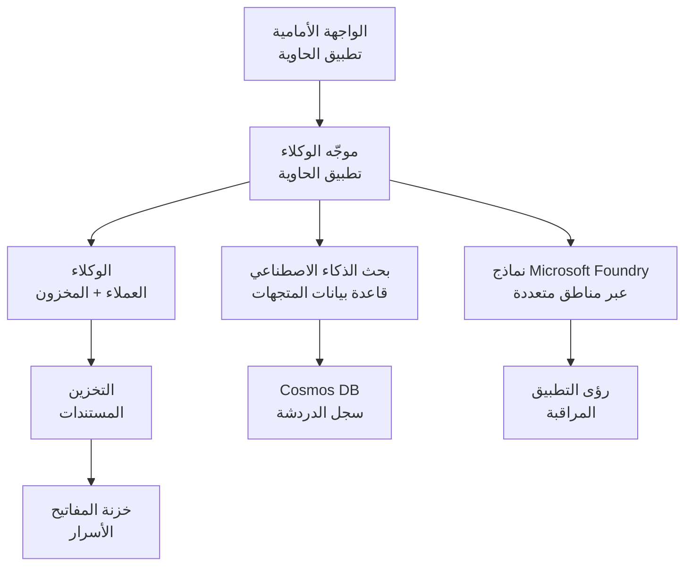

# حل متعدد الوكلاء للبيع بالتجزئة - قالب البنية التحتية

**الفصل 5: حزمة النشر للإنتاج**
- **📚 الصفحة الرئيسية للدورة**: [AZD للمبتدئين](../../README.md)
- **📖 الفصل ذو الصلة**: [الفصل 5: حلول الذكاء الاصطناعي متعددة الوكلاء](../../README.md#-chapter-5-multi-agent-ai-solutions-advanced)
- **📝 دليل السيناريو**: [العمارة الكاملة](../retail-scenario.md)
- **🎯 النشر السريع**: [نقرة واحدة للنشر](../../../../examples/retail-multiagent-arm-template)

> **⚠️ قالب البنية التحتية فقط**  
> يقوم قالب ARM هذا بنشر **موارد Azure** لنظام متعدد الوكلاء.  
>  
> **ما يتم نشره (15-25 دقيقة):**
> - ✅ خدمات Microsoft Foundry Models (gpt-4.1، gpt-4.1-mini، نماذج التضمين عبر 3 مناطق)
> - ✅ خدمة Azure AI Search (فارغة، جاهزة لإنشاء الفهرس)
> - ✅ تطبيقات الحاويات (صور نائبة، جاهزة لكودك)
> - ✅ التخزين، Cosmos DB، Key Vault، Application Insights
>  
> **ما لا يتم تضمينه (يتطلب تطوير):**
> - ❌ كود تنفيذ الوكلاء (Customer Agent، Inventory Agent)
> - ❌ منطق التوجيه ونقاط نهاية API
> - ❌ واجهة الدردشة للواجهة الأمامية
> - ❌ مخططات فهارس البحث وأنابيب بيانات
> - ❌ **الجهد التقديري للتطوير: 80-120 ساعة**
>  
> **استخدم هذا القالب إذا:**
> - ✅ تريد توفير بنية تحتية في Azure لمشروع متعدد الوكلاء
> - ✅ تخطط لتطوير تنفيذ الوكلاء بشكل منفصل
> - ✅ تحتاج إلى أساس بنية تحتية جاهز للإنتاج
>  
> **لا تستخدمه إذا:**
> - ❌ تتوقع عرضًا توضيحيًا متعدد الوكلاء يعمل فورًا
> - ❌ تبحث عن أمثلة كود تطبيق كاملة

## نظرة عامة

يحتوي هذا الدليل على قالب Azure Resource Manager (ARM) شامل لنشر **أساس البنية التحتية** لنظام دعم العملاء متعدد الوكلاء. يقوم القالب بتوفير جميع خدمات Azure اللازمة، مُهيأة ومتصلة بشكل صحيح، وجاهزة لتطوير تطبيقك.

**بعد النشر، ستحصل على:** بنية تحتية Azure جاهزة للإنتاج  
**لإكمال النظام، تحتاج إلى:** كود الوكلاء، واجهة المستخدم الأمامية، وتكوين البيانات (انظر [دليل العمارة](../retail-scenario.md))

## 🎯 ما يتم نشره

### البنية التحتية الأساسية (الحالة بعد النشر)

✅ **خدمات Microsoft Foundry Models** (جاهزة لاستدعاءات API)
  - المنطقة الأساسية: نشر gpt-4.1 (سعة 20K TPM)
  - المنطقة الثانوية: نشر gpt-4.1-mini (سعة 10K TPM)
  - المنطقة الثالثة: نموذج تضمين نصي (سعة 30K TPM)
  - منطقة التقييم: نموذج التقييم gpt-4.1 (سعة 15K TPM)
  - **الحالة:** تعمل بالكامل - يمكن إجراء استدعاءات API فورًا

✅ **خدمة Azure AI Search** (فارغة - جاهزة للتكوين)
  - تم تمكين إمكانيات البحث المتجهية
  - الطبقة القياسية مع 1 قسم، 1 نسخة
  - **الحالة:** الخدمة تعمل، ولكنها تتطلب إنشاء فهرس
  - **الإجراء المطلوب:** أنشئ فهرس البحث بالمخطط الخاص بك

✅ **حساب Azure Storage** (فارغ - جاهز للتحميلات)
  - حاويات Blob: `documents`, `uploads`
  - تكوين آمن (HTTPS فقط، لا وصول عام)
  - **الحالة:** جاهز لاستقبال الملفات
  - **الإجراء المطلوب:** قم بتحميل بيانات المنتجات والوثائق الخاصة بك

⚠️ **بيئة تطبيقات الحاويات** (صور عنصر نائب مُنشَرة)
  - تطبيق موجه الوكلاء (صورة nginx الافتراضية)
  - تطبيق الواجهة الأمامية (صورة nginx الافتراضية)
  - تم تكوين التحجيم التلقائي (0-10 نسخ)
  - **الحالة:** حاويات عنصر نائب قيد التشغيل
  - **الإجراء المطلوب:** ابنِ ونشر تطبيقات الوكلاء الخاصة بك

✅ **Azure Cosmos DB** (فارغ - جاهز للبيانات)
  - تم تهيئة قاعدة البيانات والحاوية مسبقًا
  - مُحسَّن لعمليات ذات زمن استجابة منخفض
  - تم تمكين TTL للتنظيف التلقائي
  - **الحالة:** جاهز لتخزين تاريخ المحادثات

✅ **Azure Key Vault** (اختياري - جاهز للأسرار)
  - تم تمكين الحذف الناعم
  - تم تكوين RBAC للهوية المُدارة
  - **الحالة:** جاهز لتخزين مفاتيح API وسلاسل الاتصال

✅ **Application Insights** (اختياري - المراقبة نشطة)
  - متصل بمساحة عمل Log Analytics
  - تم تكوين مقاييس وتنبيهات مخصصة
  - **الحالة:** جاهز لاستقبال البيانات التشغيلية من تطبيقاتك

✅ **Document Intelligence** (جاهز لاستدعاءات API)
  - فئة S0 للأحمال الإنتاجية
  - **الحالة:** جاهز لمعالجة الوثائق المحمّلة

✅ **Bing Search API** (جاهز لاستدعاءات API)
  - فئة S1 للبحث في الوقت الفعلي
  - **الحالة:** جاهز لاستعلامات البحث على الويب

### أوضاع النشر

| الوضع | سعة OpenAI | نسخ الحاويات | طبقة البحث | تكرار التخزين | مناسب لـ |
|------|-----------------|---------------------|-------------|-------------------|----------|
| **الحد الأدنى** | 10K-20K TPM | 0-2 نسخ | Basic | LRS (محلي) | التطوير/الاختبار، التعلم، إثبات المفهوم |
| **القياسي** | 30K-60K TPM | 2-5 نسخ | Standard | ZRS (منطقة) | الإنتاج، حركة متوسطة (<10K مستخدم) |
| **الممتاز** | 80K-150K TPM | 5-10 نسخ، متكرر عبر المناطق | Premium | GRS (جغرافي) | المؤسسات، حركة عالية (>10K مستخدم)، اتفاقية مستوى الخدمة 99.99% |

**تأثير التكلفة:**
- **من الحد الأدنى → إلى القياسي:** زيادة تكلفة تقريبًا 4x ($100-370/mo → $420-1,450/mo)
- **من القياسي → إلى الممتاز:** زيادة تكلفة تقريبًا 3x ($420-1,450/mo → $1,150-3,500/mo)
- **اختر بناءً على:** الحمل المتوقع، متطلبات اتفاقية مستوى الخدمة، قيود الميزانية

**تخطيط السعة:**
- **TPM (Tokens Per Minute):** الإجمالي عبر جميع عمليات نشر النماذج
- **نسخ الحاويات:** نطاق التحجيم التلقائي (الحد الأدنى-الحد الأقصى للنسخ)
- **طبقة البحث:** تؤثر على أداء الاستعلام وحدود حجم الفهرس

## 📋 المتطلبات المسبقة

### الأدوات المطلوبة
1. **Azure CLI** (الإصدار 2.50.0 أو أعلى)
   ```bash
   az --version  # تحقق من الإصدار
   az login      # مصادقة
   ```

2. **اشتراك Azure نشط** مع صلاحية Owner أو Contributor
   ```bash
   az account show  # تحقق من الاشتراك
   ```

### حصص Azure المطلوبة

قبل النشر، تحقق من وجود حصص كافية في المناطق المستهدفة:

```bash
# تحقق من توفر نماذج Microsoft Foundry في منطقتك
az cognitiveservices account list-skus \
  --kind OpenAI \
  --location eastus2

# تحقق من حصة OpenAI (مثال على gpt-4.1)
az cognitiveservices usage list \
  --location eastus2 \
  --query "[?name.value=='OpenAI.Standard.gpt-4.1']"

# تحقق من حصة تطبيقات الحاويات
az provider show \
  --namespace Microsoft.App \
  --query "resourceTypes[?resourceType=='managedEnvironments'].locations"
```

**الحد الأدنى من الحصص المطلوبة:**
- **Microsoft Foundry Models:** 3-4 عمليات نشر للنماذج عبر المناطق
  - gpt-4.1: 20K TPM (Tokens Per Minute)
  - gpt-4.1-mini: 10K TPM
  - text-embedding-ada-002: 30K TPM
  - **ملاحظة:** قد يكون لدى gpt-4.1 قائمة انتظار في بعض المناطق - تحقق من [توفر النماذج](https://learn.microsoft.com/azure/ai-services/openai/concepts/models)
- **Container Apps:** بيئة مُدارة + 2-10 نسخ حاويات
- **AI Search:** الطبقة القياسية (Basic غير كافية للبحث المتجهي)
- **Cosmos DB:** إنتاجية مخصصة قياسية

**إذا كانت الحصة غير كافية:**
1. اذهب إلى Azure Portal → Quotas → طلب زيادة
2. أو استخدم Azure CLI:
   ```bash
   az support tickets create \
     --ticket-name "OpenAI-Quota-Increase" \
     --severity "minimal" \
     --description "Request quota increase for Microsoft Foundry Models gpt-4.1 in eastus2"
   ```
3. فكر في استخدام مناطق بديلة ذات توفر

## 🚀 النشر السريع

### الخيار 1: باستخدام Azure CLI

```bash
# استنساخ أو تنزيل ملفات القالب
git clone <repository-url>
cd examples/retail-multiagent-arm-template

# اجعل البرنامج النصي للنشر قابلاً للتنفيذ
chmod +x deploy.sh

# انشر بالإعدادات الافتراضية
./deploy.sh -g myResourceGroup

# انشر لبيئة الإنتاج مع الميزات المتميزة
./deploy.sh -g myProdRG -e prod -m premium -l eastus2
```

### الخيار 2: باستخدام بوابة Azure

[](https://portal.azure.com/#create/Microsoft.Template/uri/https%3A%2F%2Fraw.githubusercontent.com%2Fmicrosoft%2Fazd-for-beginners%2Fmain%2Fexamples%2Fretail-multiagent-arm-template%2Fazuredeploy.json)

### الخيار 3: باستخدام Azure CLI مباشرة

```bash
# إنشاء مجموعة موارد
az group create --name myResourceGroup --location eastus2

# نشر القالب
az deployment group create \
  --resource-group myResourceGroup \
  --template-file azuredeploy.json \
  --parameters azuredeploy.parameters.json
```

## ⏱️ الجدول الزمني للنشر

### ما يمكن توقعه

| المرحلة | المدة | ما الذي يحدث |
|-------|----------|--------------||
| **التحقق من القالب** | 30-60 ثانية | تقوم Azure بالتحقق من بناء جملة قالب ARM والمعاملات |
| **إعداد مجموعة الموارد** | 10-20 ثانية | ينشئ مجموعة الموارد (إذا لزم الأمر) |
| **توفير OpenAI** | 5-8 دقائق | ينشئ 3-4 حسابات OpenAI وينشر النماذج |
| **تطبيقات الحاويات** | 3-5 دقائق | ينشئ البيئة وينشر الحاويات العنصر النائب |
| **البحث والتخزين** | 2-4 دقائق | يوفر خدمة AI Search وحسابات التخزين |
| **Cosmos DB** | 2-3 دقائق | ينشئ قاعدة البيانات ويهيئ الحاويات |
| **إعداد المراقبة** | 2-3 دقائق | يهيئ Application Insights وLog Analytics |
| **تكوين RBAC** | 1-2 دقائق | يكوّن الهويات المُدارة والأذونات |
| **إجمالي النشر** | **15-25 دقيقة** | البنية التحتية الكاملة جاهزة |

**بعد النشر:**
- ✅ **البنية التحتية جاهزة:** تم توفير جميع خدمات Azure وتشغيلها
- ⏱️ **تطوير التطبيق:** 80-120 ساعة (مسؤوليتك)
- ⏱️ **تكوين الفهرس:** 15-30 دقيقة (يتطلب المخطط الخاص بك)
- ⏱️ **تحميل البيانات:** يختلف حسب حجم مجموعة البيانات
- ⏱️ **الاختبار والتحقق:** 2-4 ساعات

---

## ✅ التحقق من نجاح النشر

### الخطوة 1: تحقق من توفير الموارد (2 دقيقة)

```bash
# تحقق من نشر جميع الموارد بنجاح
az resource list \
  --resource-group myResourceGroup \
  --query "[?provisioningState!='Succeeded'].{Name:name, Status:provisioningState, Type:type}" \
  --output table
```

**المتوقع:** جدول فارغ (جميع الموارد تظهر حالة "Succeeded")

### الخطوة 2: تحقق من عمليات نشر Microsoft Foundry Models (3 دقائق)

```bash
# سرد جميع حسابات OpenAI
az cognitiveservices account list \
  --resource-group myResourceGroup \
  --query "[?kind=='OpenAI'].{Name:name, Location:location, Status:properties.provisioningState}" \
  --output table

# تحقق من عمليات نشر النماذج للمنطقة الرئيسية
OPENAI_NAME=$(az cognitiveservices account list \
  --resource-group myResourceGroup \
  --query "[?kind=='OpenAI'] | [0].name" -o tsv)

az cognitiveservices account deployment list \
  --name $OPENAI_NAME \
  --resource-group myResourceGroup \
  --output table
```

**المتوقع:** 
- 3-4 حسابات OpenAI (الأساسية، الثانوية، الثالثة، مناطق التقييم)
- 1-2 عمليات نشر للنماذج لكل حساب (gpt-4.1، gpt-4.1-mini، text-embedding-ada-002)

### الخطوة 3: اختبار نقاط نهاية البنية التحتية (5 دقائق)

```bash
# الحصول على عناوين URL لتطبيق الحاوية
az containerapp list \
  --resource-group myResourceGroup \
  --query "[].{Name:name, URL:properties.configuration.ingress.fqdn, Status:properties.runningStatus}" \
  --output table

# اختبار نقطة نهاية الموجّه (ستُرجع صورة عنصر نائب)
ROUTER_URL=$(az containerapp show \
  --name retail-router \
  --resource-group myResourceGroup \
  --query "properties.configuration.ingress.fqdn" -o tsv)

echo "Testing: https://$ROUTER_URL"
curl -I https://$ROUTER_URL || echo "Container running (placeholder image - expected)"
```

**المتوقع:** 
- تظهر تطبيقات الحاويات حالة "Running"
- يستجيب nginx العنصر النائب برمز HTTP 200 أو 404 (لا يوجد كود تطبيق بعد)

### الخطوة 4: التحقق من وصول API لنماذج Microsoft Foundry Models (3 دقائق)

```bash
# الحصول على نقطة نهاية OpenAI والمفتاح
OPENAI_ENDPOINT=$(az cognitiveservices account show \
  --name $OPENAI_NAME \
  --resource-group myResourceGroup \
  --query "properties.endpoint" -o tsv)

OPENAI_KEY=$(az cognitiveservices account keys list \
  --name $OPENAI_NAME \
  --resource-group myResourceGroup \
  --query "key1" -o tsv)

# اختبار نشر gpt-4.1
curl "${OPENAI_ENDPOINT}openai/deployments/gpt-4.1/chat/completions?api-version=2024-08-01-preview" \
  -H "Content-Type: application/json" \
  -H "api-key: $OPENAI_KEY" \
  -d '{
    "messages": [{"role": "user", "content": "Say hello"}],
    "max_tokens": 10
  }'
```

**المتوقع:** استجابة JSON مكتملة المحادثة (تؤكد أن OpenAI تعمل)

### ما الذي يعمل مقابل ما الذي لا يعمل

**✅ يعمل بعد النشر:**
- تم نشر نماذج Microsoft Foundry Models وتقبل استدعاءات API
- خدمة AI Search تعمل (فارغة، لا توجد فهارس بعد)
- تطبيقات الحاويات تعمل (صور nginx عنصر نائب)
- حسابات التخزين قابلة للوصول وجاهزة للتحميلات
- Cosmos DB جاهز لعمليات البيانات
- Application Insights يجمع بيانات القياسات للبنية التحتية
- Key Vault جاهز لتخزين الأسرار

**❌ لا يعمل بعد (يتطلب تطوير):**
- نقاط نهاية الوكلاء (لا يوجد كود تطبيق منشور)
- وظيفة الدردشة (تتطلب تنفيذ الواجهة الأمامية + الخلفية)
- استعلامات البحث (لم يتم إنشاء فهرس البحث بعد)
- خط أنابيب معالجة الوثائق (لا توجد بيانات محمّلة)
- القياسات المخصصة (تتطلب تهيئة التطبيق بالقياسات)

**الخطوات التالية:** انظر [تكوين ما بعد النشر](../../../../examples/retail-multiagent-arm-template) لتطوير ونشر تطبيقك

---

## ⚙️ خيارات التكوين

### معلمات القالب

| المعامل | النوع | الافتراضي | الوصف |
|-----------|------|---------|-------------|
| `projectName` | string | "retail" | بادئة لجميع أسماء الموارد |
| `location` | string | موقع مجموعة الموارد | المنطقة الأساسية للنشر |
| `secondaryLocation` | string | "westus2" | المنطقة الثانوية لنشر متعدد المناطق |
| `tertiaryLocation` | string | "francecentral" | المنطقة لنموذج التضمين |
| `environmentName` | string | "dev" | تسمية البيئة (dev/staging/prod) |
| `deploymentMode` | string | "standard" | تكوين النشر (minimal/standard/premium) |
| `enableMultiRegion` | bool | true | تمكين النشر متعدد المناطق |
| `enableMonitoring` | bool | true | تمكين Application Insights والتسجيل |
| `enableSecurity` | bool | true | تمكين Key Vault والأمان المحسّن |

### تخصيص المعاملات

قم بتحرير `azuredeploy.parameters.json`:

```json
{
  "$schema": "https://schema.management.azure.com/schemas/2019-04-01/deploymentParameters.json#",
  "contentVersion": "1.0.0.0",
  "parameters": {
    "projectName": {
      "value": "mycompany"
    },
    "environmentName": {
      "value": "prod"
    },
    "deploymentMode": {
      "value": "premium"
    },
    "location": {
      "value": "eastus2"
    }
  }
}
```

## 🏗️ نظرة عامة على العمارة


## 📖 استخدام برنامج النشر النصي

يوفر البرنامج النصي `deploy.sh` تجربة نشر تفاعلية:

```bash
# عرض المساعدة
./deploy.sh --help

# نشر أساسي
./deploy.sh -g myResourceGroup

# نشر متقدم مع إعدادات مخصصة
./deploy.sh \
  -g myProductionRG \
  -p companyname \
  -e prod \
  -m premium \
  -l eastus2

# نشر للتطوير بدون تعدد المناطق
./deploy.sh \
  -g myDevRG \
  -e dev \
  -m minimal \
  --no-multi-region \
  --no-security
```

### ميزات البرنامج النصي

- ✅ **التحقق من المتطلبات المسبقة** (Azure CLI، حالة تسجيل الدخول، ملفات القالب)
- ✅ **إدارة مجموعة الموارد** (ينشئها إذا لم تكن موجودة)
- ✅ **التحقق من القالب** قبل النشر
- ✅ **مراقبة التقدم** بمخرجات ملونة
- ✅ **عرض مخرجات النشر**
- ✅ **إرشادات ما بعد النشر**

## 📊 مراقبة النشر

### تحقق من حالة النشر

```bash
# عرض عمليات النشر
az deployment group list --resource-group myResourceGroup --output table

# الحصول على تفاصيل النشر
az deployment group show \
  --resource-group myResourceGroup \
  --name retail-deployment-YYYYMMDD-HHMMSS

# مراقبة تقدم النشر
az deployment group create \
  --resource-group myResourceGroup \
  --template-file azuredeploy.json \
  --parameters azuredeploy.parameters.json \
  --verbose
```

### مخرجات النشر

بعد النشر الناجح، المخرجات التالية متاحة:

- **رابط الواجهة الأمامية**: نقطة نهاية عامة لواجهة الويب
- **رابط الموجه**: نقطة نهاية API لموجه الوكلاء
- **نقاط نهاية OpenAI**: نقاط نهاية خدمة OpenAI الأساسية والثانوية
- **خدمة البحث**: نقطة نهاية خدمة Azure AI Search
- **حساب التخزين**: اسم حساب التخزين للوثائق
- **Key Vault**: اسم Key Vault (إذا تم تمكينه)
- **Application Insights**: اسم خدمة المراقبة (إذا تم تمكينها)

## 🔧 ما بعد النشر: الخطوات التالية
> **📝 Important:** البنية التحتية مُنشأة، ولكن عليك تطوير ونشر كود التطبيق.

### Phase 1: Develop Agent Applications (Your Responsibility)

The ARM template creates **تطبيقات حاويات فارغة** with placeholder nginx images. You must:

**التطوير المطلوب:**
1. **تنفيذ الوكيل** (30-40 ساعة)
   - وكيل خدمة العملاء مع تكامل gpt-4.1
   - وكيل المخزون مع تكامل gpt-4.1-mini
   - منطق توجيه الوكلاء

2. **تطوير الواجهة الأمامية** (20-30 ساعة)
   - واجهة مستخدم الدردشة (React/Vue/Angular)
   - وظيفة تحميل الملفات
   - عرض الردود وتنسيقها

3. **خدمات الخادم الخلفي** (12-16 ساعة)
   - موجِّه FastAPI أو Express
   - وسيط المصادقة
   - تكامل القياس عن بُعد

See: [Architecture Guide](../retail-scenario.md) for detailed implementation patterns and code examples

### Phase 2: Configure AI Search Index (15-30 minutes)

Create a search index matching your data model:

```bash
# احصل على تفاصيل خدمة البحث
SEARCH_NAME=$(az search service list \
  --resource-group myResourceGroup \
  --query "[0].name" -o tsv)

SEARCH_KEY=$(az search admin-key show \
  --service-name $SEARCH_NAME \
  --resource-group myResourceGroup \
  --query "primaryKey" -o tsv)

# أنشئ فهرسًا باستخدام المخطط الخاص بك (مثال)
curl -X POST "https://${SEARCH_NAME}.search.windows.net/indexes?api-version=2023-11-01" \
  -H "Content-Type: application/json" \
  -H "api-key: ${SEARCH_KEY}" \
  -d '{
    "name": "products",
    "fields": [
      {"name": "id", "type": "Edm.String", "key": true},
      {"name": "title", "type": "Edm.String", "searchable": true},
      {"name": "content", "type": "Edm.String", "searchable": true},
      {"name": "category", "type": "Edm.String", "filterable": true},
      {"name": "content_vector", "type": "Collection(Edm.Single)", 
       "searchable": true, "dimensions": 1536, "vectorSearchProfile": "default"}
    ],
    "vectorSearch": {
      "algorithms": [{"name": "default", "kind": "hnsw"}],
      "profiles": [{"name": "default", "algorithm": "default"}]
    }
  }'
```

**الموارد:**
- [AI Search Index Schema Design](https://learn.microsoft.com/azure/search/search-what-is-an-index)
- [Vector Search Configuration](https://learn.microsoft.com/azure/search/vector-search-how-to-create-index)

### Phase 3: Upload Your Data (Time varies)

Once you have product data and documents:

```bash
# الحصول على تفاصيل حساب التخزين
STORAGE_NAME=$(az storage account list \
  --resource-group myResourceGroup \
  --query "[0].name" -o tsv)

STORAGE_KEY=$(az storage account keys list \
  --account-name $STORAGE_NAME \
  --resource-group myResourceGroup \
  --query "[0].value" -o tsv)

# قم بتحميل مستنداتك
az storage blob upload-batch \
  --destination documents \
  --source /path/to/your/product/docs \
  --account-name $STORAGE_NAME \
  --account-key $STORAGE_KEY

# مثال: تحميل ملف واحد
az storage blob upload \
  --container-name documents \
  --name "product-manual.pdf" \
  --file /path/to/product-manual.pdf \
  --account-name $STORAGE_NAME \
  --account-key $STORAGE_KEY
```

### Phase 4: Build and Deploy Your Applications (8-12 hours)

Once you've developed your agent code:

```bash
# 1. أنشئ سجل حاويات Azure (إذا لزم الأمر)
az acr create \
  --name myregistry \
  --resource-group myResourceGroup \
  --sku Basic

# 2. قم ببناء ودفع صورة موجه الوكيل
docker build -t myregistry.azurecr.io/agent-router:v1 /path/to/your/router/code
az acr login --name myregistry
docker push myregistry.azurecr.io/agent-router:v1

# 3. قم ببناء ودفع صورة الواجهة الأمامية
docker build -t myregistry.azurecr.io/frontend:v1 /path/to/your/frontend/code
docker push myregistry.azurecr.io/frontend:v1

# 4. قم بتحديث تطبيقات الحاويات باستخدام صورك
az containerapp update \
  --name retail-router \
  --resource-group myResourceGroup \
  --image myregistry.azurecr.io/agent-router:v1

az containerapp update \
  --name retail-frontend \
  --resource-group myResourceGroup \
  --image myregistry.azurecr.io/frontend:v1

# 5. قم بتكوين متغيرات البيئة
az containerapp update \
  --name retail-router \
  --resource-group myResourceGroup \
  --set-env-vars \
    OPENAI_ENDPOINT=secretref:openai-endpoint \
    OPENAI_KEY=secretref:openai-key \
    SEARCH_ENDPOINT=secretref:search-endpoint \
    SEARCH_KEY=secretref:search-key
```

### Phase 5: Test Your Application (2-4 hours)

```bash
# احصل على رابط تطبيقك
ROUTER_URL=$(az containerapp show \
  --name retail-router \
  --resource-group myResourceGroup \
  --query "properties.configuration.ingress.fqdn" -o tsv)

# اختبر نقطة نهاية الوكيل (بمجرد نشر الشيفرة الخاصة بك)
curl -X POST "https://${ROUTER_URL}/chat" \
  -H "Content-Type: application/json" \
  -d '{
    "message": "Hello, I need help with my order",
    "agent": "customer"
  }'

# تحقق من سجلات التطبيق
az containerapp logs show \
  --name retail-router \
  --resource-group myResourceGroup \
  --follow
```

### Implementation Resources

**الهندسة المعمارية والتصميم:**
- 📖 [Complete Architecture Guide](../retail-scenario.md) - أنماط تنفيذية مفصّلة
- 📖 [Multi-Agent Design Patterns](https://learn.microsoft.com/azure/architecture/ai-ml/guide/multi-agent-systems)

**أمثلة على الشيفرة:**
- 🔗 [Microsoft Foundry Models Chat Sample](https://github.com/Azure-Samples/azure-search-openai-demo) - نمط RAG
- 🔗 [Semantic Kernel](https://github.com/microsoft/semantic-kernel) - إطار عمل للوكلاء (C#)
- 🔗 [LangChain Azure](https://github.com/langchain-ai/langchain) - تنسيق الوكلاء (Python)
- 🔗 [AutoGen](https://github.com/microsoft/autogen) - محادثات متعددة الوكلاء

**الجهد الإجمالي المقدر:**
- نشر البنية التحتية: 15-25 دقيقة (✅ مكتمل)
- تطوير التطبيق: 80-120 ساعة (🔨 عملك)
- الاختبار والتحسين: 15-25 ساعة (🔨 عملك)

## 🛠️ استكشاف الأخطاء وإصلاحها

### المشكلات الشائعة

#### 1. تجاوز الحصة المسموحة لنماذج Microsoft Foundry

```bash
# تحقق من استخدام الحصة الحالية
az cognitiveservices usage list --location eastus2

# طلب زيادة الحصة
az support tickets create \
  --ticket-name "OpenAI-Quota-Increase" \
  --severity "minimal" \
  --description "Request quota increase for Microsoft Foundry Models in region X"
```

#### 2. فشل نشر تطبيقات الحاويات

```bash
# تحقق من سجلات تطبيق الحاوية
az containerapp logs show \
  --name retail-router \
  --resource-group myResourceGroup \
  --follow

# أعد تشغيل تطبيق الحاوية
az containerapp revision restart \
  --name retail-router \
  --resource-group myResourceGroup
```

#### 3. تهيئة خدمة البحث

```bash
# التحقق من حالة خدمة البحث
az search service show \
  --name <search-service-name> \
  --resource-group myResourceGroup

# اختبار اتصال خدمة البحث
curl -X GET "https://<search-service-name>.search.windows.net/indexes?api-version=2023-11-01" \
  -H "api-key: <search-admin-key>"
```

### التحقق من النشر

```bash
# تحقق من إنشاء جميع الموارد
az resource list \
  --resource-group myResourceGroup \
  --output table

# تحقق من صحة الموارد
az resource list \
  --resource-group myResourceGroup \
  --query "[?provisioningState!='Succeeded'].{Name:name, Status:provisioningState, Type:type}" \
  --output table
```

## 🔐 اعتبارات الأمان

### إدارة المفاتيح
- تُخزن جميع الأسرار في Azure Key Vault (عند التمكين)
- تستخدم تطبيقات الحاويات الهوية المُدارة للمصادقة
- تحتوي حسابات التخزين على إعدادات افتراضية آمنة (HTTPS فقط، لا وصول عام إلى blob)

### أمان الشبكة
- تستخدم تطبيقات الحاويات الشبكات الداخلية حيثما أمكن
- تم تكوين خدمة البحث بخيار النقاط النهائية الخاصة
- تم تكوين Cosmos DB بأدنى الأذونات اللازمة

### تكوين RBAC
```bash
# تعيين الأدوار اللازمة للهوية المُدارة
az role assignment create \
  --assignee <container-app-managed-identity> \
  --role "Cognitive Services OpenAI User" \
  --scope <openai-resource-id>
```

## 💰 تحسين التكلفة

### تقديرات التكلفة (شهريًا، بالدولار الأمريكي)

| الوضع | OpenAI | تطبيقات الحاويات | البحث | التخزين | الإجمالي المقدر |
|------|--------|----------------|--------|---------|------------|
| الحد الأدنى | $50-200 | $20-50 | $25-100 | $5-20 | $100-370 |
| القياسي | $200-800 | $100-300 | $100-300 | $20-50 | $420-1450 |
| الممتاز | $500-2000 | $300-800 | $300-600 | $50-100 | $1150-3500 |

### مراقبة التكاليف

```bash
# إعداد تنبيهات الميزانية
az consumption budget create \
  --account-name <subscription-id> \
  --budget-name "retail-budget" \
  --amount 500 \
  --time-grain Monthly \
  --start-date 2024-01-01 \
  --end-date 2024-12-31
```

## 🔄 التحديثات والصيانة

### تحديثات القالب
- استخدم نظام التحكم بالإصدار لملفات قالب ARM
- اختبر التغييرات في بيئة التطوير أولاً
- استخدم وضع النشر التزايدي للتحديثات

### تحديثات الموارد
```bash
# تحديث باستخدام المعلمات الجديدة
az deployment group create \
  --resource-group myResourceGroup \
  --template-file azuredeploy.json \
  --parameters azuredeploy.parameters.json \
  --mode Incremental
```

### النسخ الاحتياطي والاسترداد
- تم تمكين النسخ الاحتياطي التلقائي لقاعدة بيانات Cosmos DB
- تم تمكين الحذف الناعم لمفتاح Key Vault
- يتم الاحتفاظ بإصدارات تطبيق الحاوية للرجوع للخلف

## 📞 الدعم

- **مشكلات القالب**: [GitHub Issues](https://github.com/microsoft/azd-for-beginners/issues)
- **دعم Azure**: [Azure Support Portal](https://portal.azure.com/#blade/Microsoft_Azure_Support/HelpAndSupportBlade)
- **المجتمع**: [Azure AI Discord](https://discord.gg/microsoft-azure)

---

**⚡ جاهز لنشر حل الوكلاء المتعددين الخاص بك؟**

ابدأ بـ: `./deploy.sh -g myResourceGroup`

---

<!-- CO-OP TRANSLATOR DISCLAIMER START -->
إخلاء المسؤولية:
تم ترجمة هذا المستند باستخدام خدمة الترجمة الآلية Co-op Translator (https://github.com/Azure/co-op-translator). بينما نسعى للحفاظ على الدقة، يرجى العلم أن الترجمات الآلية قد تحتوي على أخطاء أو معلومات غير دقيقة. يجب اعتبار المستند الأصلي بلغته الأصلية المصدر المرجعي والموثوق. للمعلومات الحرجة، يُنصَح بالاستعانة بترجمة احترافية بشرية. نحن غير مسؤولين عن أي سوء فهم أو تفسيرات خاطئة ناتجة عن استخدام هذه الترجمة.
<!-- CO-OP TRANSLATOR DISCLAIMER END -->