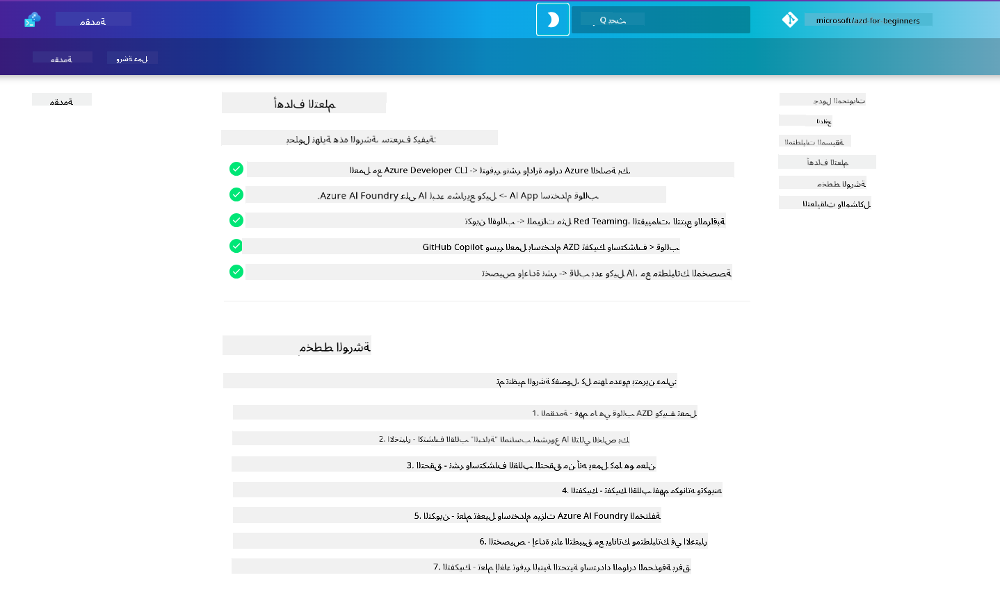

<!--
CO_OP_TRANSLATOR_METADATA:
{
  "original_hash": "9cc966416ab431c38b2ab863884b196c",
  "translation_date": "2025-09-24T11:46:24+00:00",
  "source_file": "workshop/README.md",
  "language_code": "ar"
}
-->
# ورشة عمل AZD لمطوري الذكاء الاصطناعي

مرحبًا بكم في ورشة العمل العملية لتعلم Azure Developer CLI (AZD) مع التركيز على نشر تطبيقات الذكاء الاصطناعي. تساعدك هذه الورشة على اكتساب فهم عملي لقوالب AZD في 3 خطوات:

1. **الاكتشاف** - العثور على القالب المناسب لك.
1. **النشر** - نشر القالب والتحقق من أنه يعمل.
1. **التخصيص** - تعديل القالب وتكراره ليصبح خاصًا بك!

خلال هذه الورشة، سيتم تقديم أدوات وعمليات تطوير أساسية لمساعدتك في تبسيط رحلتك التطويرية من البداية إلى النهاية.

<br/>

## دليل عبر المتصفح

دروس الورشة مكتوبة بصيغة Markdown. يمكنك تصفحها مباشرة على GitHub - أو تشغيل معاينة عبر المتصفح كما هو موضح في الصورة أدناه.



لاستخدام هذا الخيار - قم بعمل fork للمستودع إلى ملفك الشخصي، ثم قم بتشغيل GitHub Codespaces. بمجرد أن يصبح الطرفية في VS Code نشطًا، اكتب هذا الأمر:

```bash title="" linenums="0"
mkdocs serve > /dev/null 2>&1 &
```

في غضون ثوانٍ قليلة، ستظهر نافذة منبثقة. اختر خيار `Open in browser`. سيتم فتح الدليل المستند إلى الويب الآن في علامة تبويب جديدة في المتصفح. بعض فوائد هذه المعاينة:

1. **بحث مدمج** - ابحث عن الكلمات الرئيسية أو الدروس بسرعة.
1. **أيقونة النسخ** - مرر فوق كتل الأكواد لرؤية هذا الخيار.
1. **تبديل الثيم** - قم بالتبديل بين الثيمات الداكنة والفاتحة.
1. **الحصول على المساعدة** - انقر على أيقونة Discord في التذييل للانضمام!

<br/>

## نظرة عامة على الورشة

**المدة:** 3-4 ساعات  
**المستوى:** مبتدئ إلى متوسط  
**المتطلبات الأساسية:** معرفة بأساسيات Azure، مفاهيم الذكاء الاصطناعي، VS Code وأدوات سطر الأوامر.

هذه ورشة عمل عملية حيث تتعلم من خلال التطبيق. بمجرد الانتهاء من التمارين، نوصي بمراجعة منهج AZD للمبتدئين لمواصلة رحلتك التعليمية في أفضل ممارسات الأمان والإنتاجية.

| الوقت | الوحدة | الهدف |
|:---|:---|:---|
| 15 دقيقة | [المقدمة](docs/instructions/0-Introduction.md) | تحديد الأهداف وفهم السياق |
| 30 دقيقة | [اختيار قالب الذكاء الاصطناعي](docs/instructions/1-Select-AI-Template.md) | استكشاف الخيارات واختيار البداية |
| 30 دقيقة | [التحقق من قالب الذكاء الاصطناعي](docs/instructions/2-Validate-AI-Template.md) | نشر الحل الافتراضي على Azure |
| 30 دقيقة | [تفكيك قالب الذكاء الاصطناعي](docs/instructions/3-Deconstruct-AI-Template.md) | استكشاف الهيكل والتكوين |
| 30 دقيقة | [تكوين قالب الذكاء الاصطناعي](docs/instructions/4-Configure-AI-Template.md) | تفعيل وتجربة الميزات المتاحة |
| 30 دقيقة | [تخصيص قالب الذكاء الاصطناعي](docs/instructions/5-Customize-AI-Template.md) | تعديل القالب ليناسب احتياجاتك |
| 30 دقيقة | [إزالة البنية التحتية](docs/instructions/6-Teardown-Infrastructure.md) | تنظيف وإطلاق الموارد |
| 15 دقيقة | [الختام والخطوات التالية](docs/instructions/7-Wrap-up.md) | موارد التعلم، تحدي الورشة |

<br/>

## ما الذي ستتعلمه؟

فكر في قالب AZD كبيئة تعليمية لاستكشاف القدرات والأدوات المختلفة لتطوير شامل على Azure AI Foundry. بنهاية هذه الورشة، يجب أن تكون لديك فكرة واضحة عن الأدوات والمفاهيم المختلفة في هذا السياق.

| المفهوم | الهدف |
|:---|:---|
| **Azure Developer CLI** | فهم أوامر الأداة وعملياتها |
| **قوالب AZD** | فهم هيكل المشروع وتكوينه |
| **وكيل الذكاء الاصطناعي من Azure** | إنشاء ونشر مشروع Azure AI Foundry |
| **بحث الذكاء الاصطناعي من Azure** | تمكين هندسة السياق مع الوكلاء |
| **المراقبة** | استكشاف التتبع، المراقبة والتقييمات |
| **اختبار الأمان** | استكشاف الاختبارات العدائية والحلول |

<br/>

## هيكل الورشة

تم تصميم الورشة لتأخذك في رحلة من اكتشاف القالب إلى نشره، تفكيكه، وتخصيصه - باستخدام قالب البداية الرسمي [Getting Started with AI Agents](https://github.com/Azure-Samples/get-started-with-ai-agents) كأساس.

### [الوحدة 1: اختيار قالب الذكاء الاصطناعي](docs/instructions/1-Select-AI-Template.md) (30 دقيقة)

- ما هي قوالب الذكاء الاصطناعي؟
- أين يمكنني العثور على قوالب الذكاء الاصطناعي؟
- كيف يمكنني البدء في بناء وكلاء الذكاء الاصطناعي؟
- **المعمل**: البداية السريعة مع GitHub Codespaces

### [الوحدة 2: التحقق من قالب الذكاء الاصطناعي](docs/instructions/2-Validate-AI-Template.md) (30 دقيقة)

- ما هي بنية قالب الذكاء الاصطناعي؟
- ما هو سير العمل لتطوير AZD؟
- كيف يمكنني الحصول على المساعدة في تطوير AZD؟
- **المعمل**: نشر والتحقق من قالب وكلاء الذكاء الاصطناعي

### [الوحدة 3: تفكيك قالب الذكاء الاصطناعي](docs/instructions/3-Deconstruct-AI-Template.md) (30 دقيقة)

- استكشاف بيئتك في `.azure/`
- استكشاف إعداد الموارد في `infra/`
- استكشاف تكوين AZD في `azure.yaml`
- **المعمل**: تعديل متغيرات البيئة وإعادة النشر

### [الوحدة 4: تكوين قالب الذكاء الاصطناعي](docs/instructions/4-Configure-AI-Template.md) (30 دقيقة)
- استكشاف: توليد معزز للاسترجاع
- استكشاف: تقييم الوكلاء واختبار الأمان
- استكشاف: التتبع والمراقبة
- **المعمل**: استكشاف وكيل الذكاء الاصطناعي + المراقبة

### [الوحدة 5: تخصيص قالب الذكاء الاصطناعي](docs/instructions/5-Customize-AI-Template.md) (30 دقيقة)
- تعريف: متطلبات السيناريو
- تكوين: متغيرات البيئة لـ AZD
- تنفيذ: نقاط دورة الحياة للمهام الإضافية
- **المعمل**: تخصيص القالب لسيناريو خاص بي

### [الوحدة 6: إزالة البنية التحتية](docs/instructions/6-Teardown-Infrastructure.md) (30 دقيقة)
- ملخص: ما هي قوالب AZD؟
- ملخص: لماذا استخدام Azure Developer CLI؟
- الخطوات التالية: جرب قالبًا مختلفًا!
- **المعمل**: إزالة البنية التحتية وتنظيفها

<br/>

## تحدي الورشة

هل ترغب في تحدي نفسك للقيام بالمزيد؟ إليك بعض الاقتراحات للمشاريع - أو شارك أفكارك معنا!!

| المشروع | الوصف |
|:---|:---|
|1. **تفكيك قالب ذكاء اصطناعي معقد** | استخدم سير العمل والأدوات التي قمنا بتوضيحها وشاهد إذا كنت تستطيع نشر، التحقق، وتخصيص قالب حل ذكاء اصطناعي مختلف. _ماذا تعلمت؟_|
|2. **تخصيص مع سيناريو خاص بك** | حاول كتابة وثيقة متطلبات المنتج (PRD) لسيناريو مختلف. ثم استخدم GitHub Copilot في مستودع القالب الخاص بك في وضع نموذج الوكيل - واطلب منه إنشاء سير عمل تخصيص لك. _ماذا تعلمت؟ كيف يمكنك تحسين هذه الاقتراحات؟_|
| | |

## هل لديك ملاحظات؟

1. قم بنشر مشكلة على هذا المستودع - ضع علامة `Workshop` لتسهيل التعرف عليها.
1. انضم إلى Discord الخاص بـ Azure AI Foundry - تواصل مع زملائك!

| | | 
|:---|:---|
| **📚 الصفحة الرئيسية للدورة**| [AZD للمبتدئين](../README.md)|
| **📖 الوثائق** | [ابدأ مع قوالب الذكاء الاصطناعي](https://learn.microsoft.com/en-us/azure/ai-foundry/how-to/develop/ai-template-get-started)|
| **🛠️ قوالب الذكاء الاصطناعي** | [قوالب Azure AI Foundry](https://ai.azure.com/templates) |
|**🚀 الخطوات التالية** | [قم بالتحدي](../../../workshop) |
| | |

<br/>

---

**السابق:** [دليل استكشاف أخطاء الذكاء الاصطناعي](../docs/troubleshooting/ai-troubleshooting.md) | **التالي:** ابدأ مع [المعمل 1: أساسيات AZD](../../../workshop/lab-1-azd-basics)

**هل أنت مستعد لبدء بناء تطبيقات الذكاء الاصطناعي باستخدام AZD؟**

[ابدأ المعمل 1: أساسيات AZD →](./lab-1-azd-basics/README.md)

---

