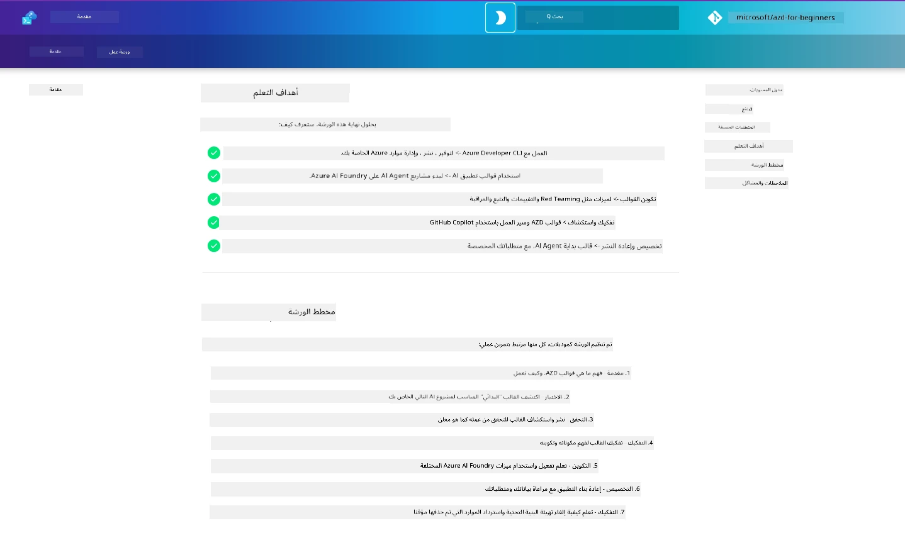

<div align="center">
  <div style="background: linear-gradient(135deg, #0078d4, #106ebe); border-radius: 10px; padding: 20px; margin: 20px 0; box-shadow: 0 4px 15px rgba(0, 120, 212, 0.3); border: 2px solid #005a9e;">
    <h2 style="color: white; margin: 0; font-size: 24px; text-shadow: 1px 1px 2px rgba(0,0,0,0.3);">
      🎯 ورشة عمل AZD لمطوري الذكاء الاصطناعي
    </h2>
    <p style="color: white; margin: 10px 0 0 0; font-size: 16px; text-shadow: 1px 1px 2px rgba(0,0,0,0.3);">
      <strong>ورشة عمل تطبيقية لبناء تطبيقات الذكاء الاصطناعي باستخدام Azure Developer CLI.</strong><br>
      أكمل 7 وحدات لإتقان قوالب AZD وسيناريوهات نشر الذكاء الاصطناعي.
    </p>
    <div style="margin-top: 15px;">
      <span style="background: rgba(255,255,255,0.2); padding: 5px 10px; border-radius: 15px; color: white; font-size: 14px;">
        📅 آخر تحديث: فبراير 2026
      </span>
    </div>
  </div>
</div>

# ورشة عمل AZD لمطوري الذكاء الاصطناعي

مرحبًا بك في ورشة العمل العملية لتعلّم Azure Developer CLI (AZD) مع التركيز على نشر تطبيقات الذكاء الاصطناعي. تساعدك هذه الورشة على اكتساب فهم تطبيقي لقوالب AZD في 3 خطوات:

1. **الاكتشاف** - العثور على القالب المناسب لك.
1. **النشر** - نشر والتحقق من أنه يعمل
1. **التخصيص** - تعديله والتكرار لجعله خاصًا بك!

على مدار هذه الورشة، سيتم أيضًا تعريفك بأدوات وتدفقات عمل مطوري النواة، لمساعدتك في تبسيط رحلة التطوير من البداية إلى النهاية.

<br/>

## دليل المستعرض

دروس الورشة مكتوبة بصيغة Markdown. يمكنك تصفحها مباشرةً على GitHub - أو تشغيل معاينة في المتصفح كما هو موضح في لقطة الشاشة أدناه.



لاستخدام هذا الخيار - قم بعمل fork للمستودع إلى ملفك الشخصي، وشغّل GitHub Codespaces. بمجرد أن يصبح طرفية VS Code نشطة، اكتب هذا الأمر:

```bash title="" linenums="0"
mkdocs serve > /dev/null 2>&1 &
```

بعد ثوانٍ قليلة، سترى مربع حوار منبثق. حدد الخيار `فتح في المتصفح`. سيفتح الدليل المستند إلى الويب الآن في علامة تبويب متصفح جديدة. بعض فوائد هذه المعاينة:

1. **بحث مدمج** - اعثر على كلمات أو دروس بسرعة.
1. **رمز النسخ** - مرر فوق كتل الشيفرة لرؤية هذا الخيار
1. **مبدّل السمة** - التبديل بين الوضع الداكن والفاتح
1. **الحصول على المساعدة** - انقر أيقونة Discord في التذييل للانضمام!

<br/>

## نظرة عامة على الورشة

**المدة:** 3-4 ساعات  
**المستوى:** من المبتدئ إلى المتوسط  
**المتطلبات المسبقة:** الإلمام بـ Azure، مفاهيم الذكاء الاصطناعي، VS Code وأدوات سطر الأوامر.

هذه ورشة عملية تتعلم فيها من خلال التطبيق. بمجرد إكمال التمارين، نوصي بمراجعة منهج "AZD For Beginners" لمواصلة رحلتك التعليمية نحو ممارسات أفضل في الأمن والإنتاجية.

| Time| Module  | Objective |
|:---|:---|:---|
| 15 دقيقة | [المقدمة](docs/instructions/0-Introduction.md) | تهيئة السياق، فهم الأهداف |
| 30 دقيقة | [اختر قالب الذكاء الاصطناعي](docs/instructions/1-Select-AI-Template.md) | استكشاف الخيارات واختيار البداية | 
| 30 دقيقة | [تحقق من قالب الذكاء الاصطناعي](docs/instructions/2-Validate-AI-Template.md) | نشر الحل الافتراضي إلى Azure |
| 30 دقيقة | [تفكيك قالب الذكاء الاصطناعي](docs/instructions/3-Deconstruct-AI-Template.md) | استكشاف البنية والتكوين |
| 30 دقيقة | [تكوين قالب الذكاء الاصطناعي](docs/instructions/4-Configure-AI-Template.md) | تفعيل وتجربة الميزات المتاحة |
| 30 دقيقة | [تخصيص قالب الذكاء الاصطناعي](docs/instructions/5-Customize-AI-Template.md) | تكييف القالب وفق احتياجاتك |
| 30 دقيقة | [تفكيك البنية التحتية](docs/instructions/6-Teardown-Infrastructure.md) | تنظيف وإصدار الموارد |
| 15 دقيقة | [الخلاصة والخطوات التالية](docs/instructions/7-Wrap-up.md) | موارد التعلم، تحدي الورشة |

<br/>

## ماذا ستتعلم

فكّر في قالب AZD كحوض رمل تعليمي لاستكشاف القدرات والأدوات المختلفة لتطوير نهاية إلى نهاية على Microsoft Foundry. بنهاية هذه الورشة، ينبغي أن يكون لديك فهم حدسي للأدوات والمفاهيم المختلفة في هذا السياق.

| Concept  | Objective |
|:---|:---|
| **Azure Developer CLI** | فهم أوامر الأداة وتدفقات العمل |
| **قوالب AZD**| فهم بنية المشروع والتكوين |
| **Azure AI Agent**| توفير ونشر مشروع Microsoft Foundry  |
| **Azure AI Search**| تمكين هندسة السياق مع الوكلاء |
| **Observability**| استكشاف التتبع والمراقبة والتقييمات |
| **Red Teaming**| استكشاف الاختبار العدائي والتدابير التخفيفية |

<br/>

## هيكل الورشة

تم تنظيم الورشة لتأخذك في رحلة من اكتشاف القالب، إلى النشر، التفكيك، والتخصيص - مستخدمة القالب الرسمي [البدء مع وكلاء الذكاء الاصطناعي](https://github.com/Azure-Samples/get-started-with-ai-agents) كنقطة انطلاق.

### [الوحدة 1: اختر قالب الذكاء الاصطناعي](docs/instructions/1-Select-AI-Template.md) (30 دقيقة)

- ما هي قوالب الذكاء الاصطناعي؟
- أين يمكنني العثور على قوالب الذكاء الاصطناعي؟
- كيف أبدأ في بناء وكلاء الذكاء الاصطناعي؟
- **المعمل**: بدء سريع باستخدام GitHub Codespaces

### [الوحدة 2: تحقق من قالب الذكاء الاصطناعي](docs/instructions/2-Validate-AI-Template.md) (30 دقيقة)

- ما هي بنية قالب الذكاء الاصطناعي؟
- ما هو سير عمل تطوير AZD؟
- كيف يمكنني الحصول على مساعدة في تطوير AZD؟
- **المعمل**: نشر والتحقق من قالب وكلاء الذكاء الاصطناعي

### [الوحدة 3: تفكيك قالب الذكاء الاصطناعي](docs/instructions/3-Deconstruct-AI-Template.md) (30 دقيقة)

- استكشف بيئتك في `.azure/` 
- استكشف إعداد الموارد في `infra/` 
- استكشف تكوين AZD في `azure.yaml`s
- **المعمل**: تعديل متغيرات البيئة وإعادة النشر

### [الوحدة 4: تكوين قالب الذكاء الاصطناعي](docs/instructions/4-Configure-AI-Template.md) (30 دقيقة)
- استكشاف: التوليد المعزز بالاسترجاع
- استكشاف: تقييم الوكلاء وRed Teaming
- استكشاف: التتبع والمراقبة
- **المعمل**: استكشاف وكيل الذكاء الاصطناعي + قابلية المراقبة 

### [الوحدة 5: تخصيص قالب الذكاء الاصطناعي](docs/instructions/5-Customize-AI-Template.md) (30 دقيقة)
- تحديد: مستند متطلبات المنتج (PRD) مع متطلبات السيناريو
- هيكلة: متغيرات البيئة لـ AZD
- تنفيذ: خطافات دورة الحياة للمهام المضافة
- **المعمل**: تخصيص القالب للسيناريو الخاص بي

### [الوحدة 6: تفكيك البنية التحتية](docs/instructions/6-Teardown-Infrastructure.md) (30 دقيقة)
- ملخص: ما هي قوالب AZD؟
- ملخص: لماذا نستخدم Azure Developer CLI؟
- الخطوات التالية: جرب قالبًا مختلفًا!
- **المعمل**: إلغاء توفير البنية التحتية وتنظيفها

<br/>

## تحدي الورشة

هل تريد تحدي نفسك للقيام بالمزيد؟ إليك بعض اقتراحات المشاريع — أو شاركنا أفكارك!!

| Project | Description |
|:---|:---|
|1. **تفكيك قالب ذكاء اصطناعي معقد** | استخدم سير العمل والأدوات التي وضحناها وانظر إن كنت تستطيع نشر، التحقق، وتخصيص قالب حل ذكاء اصطناعي مختلف. _ماذا تعلمت؟_|
|2. **التخصيص وفق سينارك**  | حاول كتابة PRD (مستند متطلبات المنتج) لسيناريو مختلف. ثم استخدم GitHub Copilot في مستودع القالب الخاص بك في Agent Model - واطلب منه توليد سير عمل تخصيص لك. _ماذا تعلمت؟ كيف يمكنك تحسين هذه الاقتراحات؟_|
| | |

## هل لديك ملاحظات؟

1. انشر Issue في هذا المستودع - ضع عليها العلامة `Workshop` لتسهيل الأمر.
1. انضم إلى Discord الخاص بـ Microsoft Foundry - تواصل مع زملائك!


| | | 
|:---|:---|
| **📚 الصفحة الرئيسية للدورة**| [AZD للمبتدئين](../README.md)|
| **📖 التوثيق** | [البدء باستخدام قوالب AI](https://learn.microsoft.com/en-us/azure/ai-foundry/how-to/develop/ai-template-get-started)|
| **🛠️قوالب AI** | [قوالب Microsoft Foundry](https://ai.azure.com/templates) |
|**🚀 الخطوات التالية** | [ابدأ الورشة](../../../workshop) |
| | |

<br/>

---

**التنقل:** [المقرر الرئيسي](../README.md) | [المقدمة](docs/instructions/0-Introduction.md) | [الوحدة 1: اختيار القالب](docs/instructions/1-Select-AI-Template.md)

**هل أنت مستعد لبدء بناء تطبيقات الذكاء الاصطناعي باستخدام AZD؟**

[ابدأ الورشة: المقدمة →](docs/instructions/0-Introduction.md)

---

<!-- CO-OP TRANSLATOR DISCLAIMER START -->
إخلاء المسؤولية:
تمت ترجمة هذا المستند باستخدام خدمة الترجمة الآلية [Co-op Translator](https://github.com/Azure/co-op-translator). بينما نسعى لتحقيق الدقة، يُرجى ملاحظة أن الترجمات الآلية قد تحتوي على أخطاء أو عناصر غير دقيقة. ينبغي اعتبار المستند الأصلي بلغته الأصلية المصدر المرجعي والموثوق. بالنسبة للمعلومات الحيوية أو الحرجة، يُنصح بالاستعانة بترجمة بشرية محترفة. لا نتحمل أي مسؤولية عن أي سوء فهم أو تفسير خاطئ ينشأ عن استخدام هذه الترجمة.
<!-- CO-OP TRANSLATOR DISCLAIMER END -->