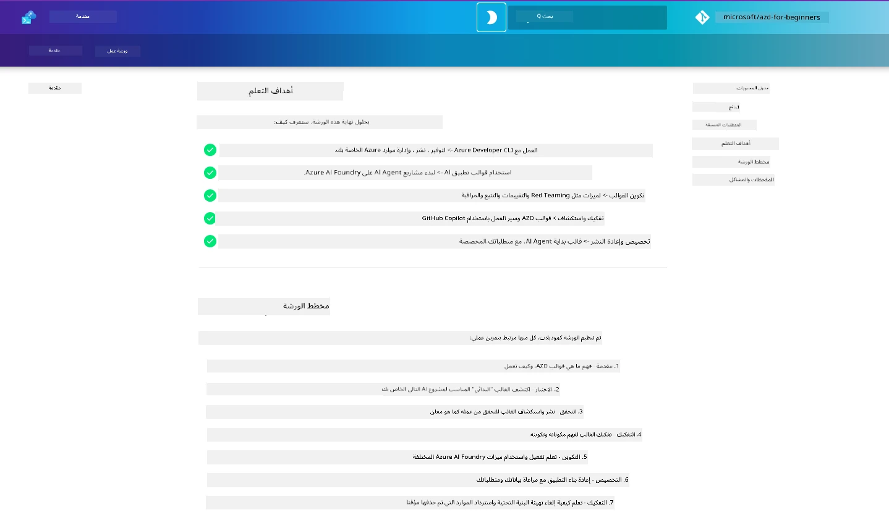

<div align="center">
  <div style="background: linear-gradient(135deg, #0078d4, #106ebe); border-radius: 10px; padding: 20px; margin: 20px 0; box-shadow: 0 4px 15px rgba(0, 120, 212, 0.3); border: 2px solid #005a9e;">
    <h2 style="color: white; margin: 0; font-size: 24px; text-shadow: 1px 1px 2px rgba(0,0,0,0.3);">
      🎯 ورشة عمل AZD لمطوري الذكاء الاصطناعي
    </h2>
    <p style="color: white; margin: 10px 0 0 0; font-size: 16px; text-shadow: 1px 1px 2px rgba(0,0,0,0.3);">
      <strong>ورشة عمل عملية لبناء تطبيقات الذكاء الاصطناعي باستخدام Azure Developer CLI.</strong><br>
      أكمل 7 وحدات لإتقان قوالب AZD وسير عمل نشر الذكاء الاصطناعي.
    </p>
    <div style="margin-top: 15px;">
      <span style="background: rgba(255,255,255,0.2); padding: 5px 10px; border-radius: 15px; color: white; font-size: 14px;">
        📅 آخر تحديث: مارس 2026
      </span>
    </div>
  </div>
</div>

# AZD لمطوري الذكاء الاصطناعي

مرحبًا بك في ورشة العمل العملية لتعلّم Azure Developer CLI (AZD) مع التركيز على نشر تطبيقات الذكاء الاصطناعي. تساعدك هذه الورشة على اكتساب فهم عملي لقوالب AZD من خلال 3 خطوات:

1. **اكتشاف** - العثور على القالب المناسب لك.
1. **النشر** - نشر والتحقق من أن العملية تعمل
1. **التخصيص** - عدِّل وكرر لتجعله خاصًا بك!

Over the course of this workshop, you will also be introduced to core developer tools and workflows, to help you streamline your end-to-end development journey.

<br/>

## دليل عبر المتصفح

دروس الورشة مكتوبة بتنسيق Markdown. يمكنك التنقل فيها مباشرة في GitHub - أو تشغيل معاينة عبر المتصفح كما هو موضح في لقطة الشاشة أدناه.



To use this option - fork the repository to your profile, and launch GitHub Codespaces. Once the VS Code terminal is active, type this command:

This browser preview works in GitHub Codespaces, dev containers, or a local clone with Python and MkDocs installed.

```bash title="" linenums="0"
mkdocs serve > /dev/null 2>&1 &
```

In a few seconds, you will see a pop-up dialog. Select the option to `Open in browser`. The web-based guide will now open in a new browser tab. Some benefits of this preview:

1. **بحث مدمج** - ابحث عن كلمات مفتاحية أو دروس بسرعة.
1. **أيقونة النسخ** - مرر المؤشر فوق كتل الشيفرة لرؤية هذا الخيار
1. **تبديل السمة** - التبديل بين السمات الداكنة والفاتحة
1. **الحصول على المساعدة** - انقر على أيقونة Discord في التذييل للانضمام!

<br/>

## نظرة عامة على الورشة

**المدة:** 3-4 ساعات  
**المستوى:** من المبتدئ إلى المتوسط  
**المتطلبات المسبقة:** دراية بـ Azure، مفاهيم الذكاء الاصطناعي، VS Code وأدوات سطر الأوامر.

هذه ورشة عمل عملية تتعلم فيها بالممارسة. بمجرد إكمال التمارين، نوصي بمراجعة منهج AZD للمبتدئين لمتابعة رحلة التعلم الخاصة بك في ممارسات الأمان والإنتاجية.

| الوقت| الوحدة  | الهدف |
|:---|:---|:---|
| 15 mins | [المقدمة](docs/instructions/0-Introduction.md) | تحديد الإطار، وفهم الأهداف |
| 30 mins | [اختيار قالب الذكاء الاصطناعي](docs/instructions/1-Select-AI-Template.md) | استكشاف الخيارات واختيار نقطة بداية | 
| 30 mins | [التحقق من قالب الذكاء الاصطناعي](docs/instructions/2-Validate-AI-Template.md) | نشر الحل الافتراضي إلى Azure |
| 30 mins | [تفكيك قالب الذكاء الاصطناعي](docs/instructions/3-Deconstruct-AI-Template.md) | استكشاف البنية والتكوين |
| 30 mins | [تهيئة قالب الذكاء الاصطناعي](docs/instructions/4-Configure-AI-Template.md) | تفعيل وتجربة الميزات المتاحة |
| 30 mins | [تخصيص قالب الذكاء الاصطناعي](docs/instructions/5-Customize-AI-Template.md) | تكييف القالب لاحتياجاتك |
| 30 mins | [تفكيك البنية التحتية](docs/instructions/6-Teardown-Infrastructure.md) | تنظيف وإطلاق الموارد |
| 15 mins | [الخلاصة والخطوات التالية](docs/instructions/7-Wrap-up.md) | مصادر التعلم، تحدي الورشة |

<br/>

## ما الذي ستتعلمه

فكر في قالب AZD كصندوق رمل تعليمي لاستكشاف القدرات والأدوات المختلفة لتطوير شامل من البداية للنهاية على Microsoft Foundry. بنهاية هذه الورشة، ينبغي أن يكون لديك حس حدسي تجاه أدوات ومفاهيم متعددة في هذا السياق.

| المفهوم  | الهدف |
|:---|:---|
| **Azure Developer CLI** | فهم أوامر الأداة وسير العمل|
| **قوالب AZD**| فهم بنية المشروع والتكوين|
| **Azure AI Agent**| تهيئة ونشر مشروع Microsoft Foundry  |
| **Azure AI Search**| تمكين هندسة السياق باستخدام الوكلاء |
| **قابلية المراقبة**| استكشاف التتبّع، المراقبة والتقييمات |
| **الهجوم الأحمر (Red Teaming)**| استكشاف الاختبار العدائي ووسائل التخفيف |

<br/>

## هيكل الورشة

تم هيكلة الورشة لتأخذك في رحلة من اكتشاف القالب، إلى النشر، التفكيك، والتخصيص - باستخدام القالب الرسمي [Getting Started with AI Agents](https://github.com/Azure-Samples/get-started-with-ai-agents) كنقطة انطلاق.

### [الوحدة 1: اختيار قالب الذكاء الاصطناعي](docs/instructions/1-Select-AI-Template.md) (30 mins)

- ما هي قوالب الذكاء الاصطناعي؟
- أين يمكنني العثور على قوالب الذكاء الاصطناعي؟
- كيف أبدأ ببناء وكلاء الذكاء الاصطناعي؟
- **المعمل**: بداية سريعة في Codespaces أو dev container

### [الوحدة 2: التحقق من قالب الذكاء الاصطناعي](docs/instructions/2-Validate-AI-Template.md) (30 mins)

- ما هي بنية قالب الذكاء الاصطناعي؟
- ما هو سير عمل تطوير AZD؟
- كيف أحصل على مساعدة في تطوير AZD؟
- **المعمل**: نشر والتحقق من قالب وكلاء الذكاء الاصطناعي

### [الوحدة 3: تفكيك قالب الذكاء الاصطناعي](docs/instructions/3-Deconstruct-AI-Template.md) (30 mins)

- استكشف بيئتك في `.azure/` 
- استكشف إعداد الموارد في `infra/` 
- استكشف تكوين AZD في `azure.yaml`s
- **المعمل**: تعديل متغيرات البيئة وإعادة النشر

### [الوحدة 4: تهيئة قالب الذكاء الاصطناعي](docs/instructions/4-Configure-AI-Template.md) (30 mins)
- استكشاف: التوليد المدعوم بالاسترجاع
- استكشاف: تقييم الوكلاء والفريق الأحمر
- استكشاف: التتبّع والمراقبة
- **المعمل**: استكشاف وكيل الذكاء الاصطناعي + المراقبة 

### [الوحدة 5: تخصيص قالب الذكاء الاصطناعي](docs/instructions/5-Customize-AI-Template.md) (30 mins)
- تعريف: وثيقة متطلبات المنتج (PRD) مع متطلبات السيناريو
- تهيئة: متغيرات البيئة لـ AZD
- تنفيذ: خطافات دورة الحياة للمهام الإضافية
- **المعمل**: تخصيص القالب لسيناري الخاص بي

### [الوحدة 6: تفكيك البنية التحتية](docs/instructions/6-Teardown-Infrastructure.md) (30 mins)
- مراجعة: ما هي قوالب AZD؟
- مراجعة: لماذا استخدام Azure Developer CLI؟
- الخطوات التالية: جرّب قالبًا مختلفًا!
- **المعمل**: إلغاء تجهيز البنية التحتية والتنظيف

<br/>

## تحدي الورشة

هل تريد تحدي نفسك لتقوم بالمزيد؟ إليك بعض اقتراحات المشاريع — أو شاركنا أفكارك!!

| المشروع | الوصف |
|:---|:---|
|1. **تفكيك قالب ذكاء اصطناعي معقد** | استخدم سير العمل والأدوات التي استعرضناها وانظر إن كنت تستطيع نشر، التحقق، وتخصيص قالب حل ذكاء اصطناعي مختلف. _ماذا تعلمت؟_|
|2. **تخصيص وفق سيناريوك**  | حاول كتابة PRD (وثيقة متطلبات المنتج) لسيناريو مختلف. ثم استخدم GitHub Copilot في مستودع القالب الخاص بك في Agent Model - واطلب منه إنشاء سير عمل تخصيص لك. _ماذا تعلمت؟ كيف يمكنك تحسين هذه الاقتراحات؟_|
| | |

## هل لديك ملاحظات؟

1. أنشئ issue في هذا المستودع - ضع الوسم `Workshop` لسهولة الفرز.
1. انضم إلى خادم Microsoft Foundry على Discord - تواصل مع زملائك!


| | | 
|:---|:---|
| **📚 الصفحة الرئيسية للدورة**| [AZD للمبتدئين](../README.md)|
| **📖 التوثيق** | [البدء مع قوالب الذكاء الاصطناعي](https://learn.microsoft.com/en-us/azure/ai-foundry/how-to/develop/ai-template-get-started)|
| **🛠️ قوالب AI** | [قوالب Microsoft Foundry](https://ai.azure.com/templates) |
|**🚀 الخطوات التالية** | [ابدأ الورشة](#نظرة-عامة-على-الورشة) |
| | |

<br/>

---

**التنقل:** [الدورة الرئيسية](../README.md) | [المقدمة](docs/instructions/0-Introduction.md) | [الوحدة 1: اختيار القالب](docs/instructions/1-Select-AI-Template.md)

**هل أنت مستعد لبدء بناء تطبيقات الذكاء الاصطناعي باستخدام AZD؟**

[ابدأ الورشة: المقدمة →](docs/instructions/0-Introduction.md)

---

<!-- CO-OP TRANSLATOR DISCLAIMER START -->
**Disclaimer**:
تمت ترجمة هذا المستند باستخدام خدمة الترجمة الآلية [Co-op Translator](https://github.com/Azure/co-op-translator). بينما نسعى لتحقيق الدقة، يُرجى ملاحظة أن الترجمات الآلية قد تحتوي على أخطاء أو عدم دقة. يجب اعتبار المستند الأصلي بلغته الأصلية المصدر المعتمد. للمعلومات الحرجة، يُنصح بالاعتماد على ترجمة بشرية محترفة. نحن غير مسؤولين عن أي سوء فهم أو تفسيرات خاطئة تنشأ عن استخدام هذه الترجمة.
<!-- CO-OP TRANSLATOR DISCLAIMER END -->