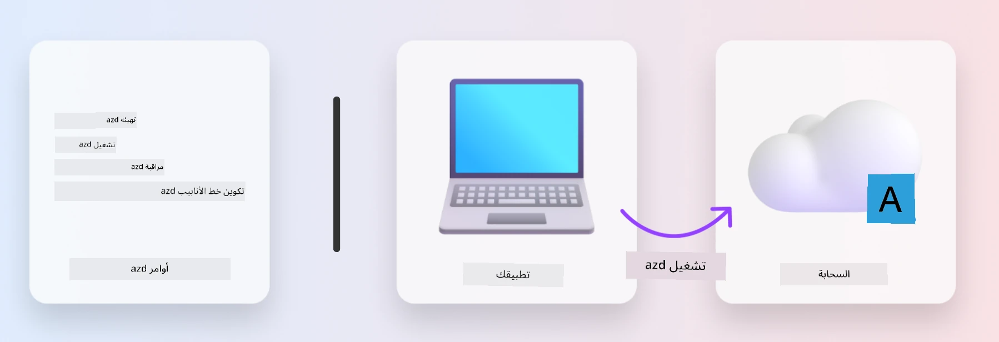

# 1. اختر قالب

!!! tip "مع نهاية هذه الوحدة ستتمكن من"

    - [ ] وصف ما هي قوالب AZD
    - [ ] اكتشاف واستخدام قوالب AZD للذكاء الاصطناعي
    - [ ] البدء بقالب AI Agents
    - [ ] **المختبر 1:** الدليل السريع لـ AZD مع GitHub Codespaces

---

## 1. تشبيه البناء

بناء تطبيق ذكاء اصطناعي حديث وجاهز للمؤسسات من الصفر يمكن أن يكون مهمة شاقة. إنه يشبه إلى حد ما بناء منزلك الجديد بنفسك، طوبة بعد طوبة. نعم، يمكن القيام به! لكن ليس بالضرورة أن يكون أنسب طريقة للوصول إلى النتيجة المطلوبة!

بدلاً من ذلك، غالبًا ما نبدأ بمخطط تصميم موجود، ونعمل مع مهندس معماري لتخصيصه وفقًا لمتطلباتنا الشخصية. وهذا بالضبط هو النهج الذي يجب اتباعه عند بناء التطبيقات الذكية. أولاً، ابحث عن هندسة تصميم جيدة تناسب مجال مشكلتك. ثم اعمل مع مهندس حلول لتخصيص وتطوير الحل لسيناريوك الخاص.

ولكن أين يمكننا العثور على هذه المخططات التصميمية؟ وكيف نجد مهندسًا معماريًا مستعدًا لتعليمنا كيفية تخصيص ونشر هذه المخططات بأنفسنا؟ في هذه الورشة، نجيب عن تلك الأسئلة من خلال تقديم ثلاث تقنيات:

1. [Azure Developer CLI](https://aka.ms/azd) - أداة مفتوحة المصدر تسرع مسار المطور من التطوير المحلي (البناء) إلى النشر في السحابة (الشحن).
1. [Microsoft Foundry Templates](https://ai.azure.com/templates) - مستودعات مفتوحة المصدر موحدة تحتوي على أمثلة شيفرة وملفات البنية التحتية والتكوين لنشر هندسة حل الذكاء الاصطناعي.
1. [GitHub Copilot Agent Mode](https://code.visualstudio.com/docs/copilot/chat/chat-agent-mode) - وكيل برمجي مستند إلى معرفة Azure، يمكنه إرشادنا في التنقل داخل قاعدة الشيفرة وإجراء التعديلات باستخدام اللغة الطبيعية.

مع هذه الأدوات بين يديك، يمكننا الآن _اكتشاف_ القالب المناسب، و_نشره_ للتحقق من أنه يعمل، و_تخصيصه_ ليناسب سيناريوهاتنا الخاصة. هيا نغوص ونتعلم كيف تعمل هذه الأدوات.

---

## 2. Azure Developer CLI

The [Azure Developer CLI](https://learn.microsoft.com/en-us/azure/developer/azure-developer-cli/) (or `azd`) is an open-source commandline tool that can speed up your code-to-cloud journey with a set of developer-friendly commands that work consistently across your IDE (development) and CI/CD (devops) environments.

With `azd`, your deployment journey can be as simple as:

- `azd init` - Initializes a new AI project from an existing AZD template.
- `azd up` - Provisions infrastructure and deploy your application in one step.
- `azd monitor` - Get real-time monitoring and diagnostics for your deployed application.
- `azd pipeline config` - Setup CI/CD pipelines to automate deployment to Azure.

**🎯 | EXERCISE**: <br/> استكشف أداة سطر الأوامر `azd` في بيئة GitHub Codespaces الخاصة بك الآن. ابدأ بكتابة هذا الأمر لرؤية ما يمكن للأداة فعله:

```bash title="" linenums="0"
azd help
```



---

## 3. قالب AZD

For `azd` to achieve this, it needs to know the infrastructure to provision, the configuration settings to enforce, and the application to deploy. This is where [AZD templates](https://learn.microsoft.com/en-us/azure/developer/azure-developer-cli/azd-templates?tabs=csharp) come in. 

AZD templates are open-source repositories that combine sample code with infrastructure and configuraton files required for deploying the solution architecture.
By using an _Infrastructure-as-Code_ (IaC) approach, they allow template resource definitions and configuration settings to be version-controller (just like the app source code) - creating reusable and consistent workflows across users of that project.

When creating or reusing an AZD template for _your_ scenario, consider these questions:

1. What are you building? → Is there a template that has starter code for that scenario?
1. How is your solution architected? → Is there a template that has the necessary resources?
1. How is your solution deployed? → Think `azd deploy` with pre/post-processing hooks!
1. How can you optimize it further? → Think built-in monitoring and automation pipelines!

**🎯 | EXERCISE**: <br/> 
قم بزيارة معرض [Awesome AZD](https://azure.github.io/awesome-azd/) واستخدم عوامل التصفية لاستكشاف أكثر من 250 قالبًا متاحًا حاليًا. تحقق مما إذا كان يمكنك العثور على ما يتوافق مع متطلبات سيناريو _خاصتك_.


---

## 4. قوالب تطبيقات الذكاء الاصطناعي

بالنسبة للتطبيقات المدعومة بالذكاء الاصطناعي، توفر Microsoft قوالب متخصصة تتميز بـ **Microsoft Foundry** و **Foundry Agents**. هذه القوالب تسرع مسارك لبناء تطبيقات ذكية وجاهزة للإنتاج.

### قوالب Microsoft Foundry و Foundry Agents

اختر قالبًا أدناه للنشر. كل قالب متاح على [Awesome AZD](https://azure.github.io/awesome-azd/) ويمكن تهيئته بأمر واحد.

| القالب | الوصف | أمر النشر |
|----------|-------------|----------------|
| **[دردشة الذكاء الاصطناعي مع RAG](https://azure.github.io/awesome-azd/?tags=ai&tags=rag)** | تطبيق دردشة مع توليد معزز بالاسترجاع باستخدام Microsoft Foundry | `azd init -t azure-samples/azure-search-openai-demo` |
| **[قالب بدء خدمة Foundry Agent](https://azure.github.io/awesome-azd/?tags=ai&tags=agents)** | بناء وكلاء ذكاء اصطناعي باستخدام Foundry Agents لتنفيذ المهام ذاتيًا | `azd init -t azure-samples/foundry-agent-service-starter` |
| **[تنسيق متعدد الوكلاء](https://azure.github.io/awesome-azd/?tags=ai&tags=agents)** | تنسيق عدة Foundry Agents لعمليات سير عمل معقدة | `azd init -t azure-samples/multi-agent-orchestration` |
| **[ذكاء المستندات AI](https://azure.github.io/awesome-azd/?tags=ai&tags=document)** | استخراج وتحليل المستندات باستخدام نماذج Microsoft Foundry | `azd init -t azure-samples/ai-document-processing` |
| **[بوت المحادثة الذكي](https://azure.github.io/awesome-azd/?tags=ai&tags=bot)** | بناء روبوتات محادثة ذكية بدمج Microsoft Foundry | `azd init -t azure-samples/ai-chat-protocol` |
| **[توليد صور AI](https://azure.github.io/awesome-azd/?tags=ai&tags=dalle)** | توليد صور باستخدام DALL-E عبر Microsoft Foundry | `azd init -t azure-samples/ai-image-generation` |
| **[عميل Semantic Kernel](https://azure.github.io/awesome-azd/?tags=ai&tags=semantic-kernel)** | وكلاء ذكاء اصطناعي باستخدام Semantic Kernel مع Foundry Agents | `azd init -t azure-samples/semantic-kernel-agent` |
| **[نظام متعدد الوكلاء AutoGen](https://azure.github.io/awesome-azd/?tags=ai&tags=autogen)** | أنظمة متعددة الوكلاء باستخدام إطار AutoGen | `azd init -t azure-samples/autogen-multi-agent` |

### البدء السريع

1. **تصفح القوالب**: قم بزيارة [https://azure.github.io/awesome-azd/](https://azure.github.io/awesome-azd/) وقم بالتصفية حسب `AI`, `Agents`, أو `Microsoft Foundry`
2. **اختر قالبك**: اختر واحدًا يتوافق مع حالة استخدامك
3. **تهيئة**: نفّذ أمر `azd init` للقالب الذي اخترته
4. **نشر**: نفّذ `azd up` لتوفير ونشر

**🎯 | EXERCISE**: <br/>
اختر أحد القوالب أعلاه بناءً على سيناريوك:

- **هل تبني روبوت دردشة؟** → ابدأ بـ **دردشة الذكاء الاصطناعي مع RAG** أو **بوت المحادثة الذكي**
- **هل تحتاج وكلاء مستقلين؟** → جرّب **قالب بدء خدمة Foundry Agent** أو **تنسيق متعدد الوكلاء**
- **معالجة المستندات؟** → استخدم **ذكاء المستندات AI**
- **هل تريد مساعدة في الترميز بالذكاء الاصطناعي؟** → استكشف **عميل Semantic Kernel** أو **نظام متعدد الوكلاء AutoGen**

```bash title="Example: Deploy the AI Chat with RAG template" linenums="0"
azd init -t azure-samples/azure-search-openai-demo
azd up
```

!!! info "استكشف المزيد من القوالب"
    يحتوي معرض [Awesome AZD Gallery](https://azure.github.io/awesome-azd/) على أكثر من 250 قالبًا. استخدم عوامل التصفية للعثور على القوالب التي تتطابق مع متطلباتك المحددة للغة والإطار وخدمات Azure.

---

<!-- CO-OP TRANSLATOR DISCLAIMER START -->
إخلاء المسؤولية:
تمت ترجمة هذا المستند باستخدام خدمة الترجمة الآلية Co-op Translator (https://github.com/Azure/co-op-translator). بينما نسعى لتحقيق الدقة، يرجى العلم أن الترجمات الآلية قد تحتوي على أخطاء أو عدم دقة. يجب اعتبار المستند الأصلي بلغته الأصلية هو المرجع الموثوق. للمعلومات الحرجة، يُنصح بالاستعانة بترجمة بشرية محترفة. لا نتحمل أي مسؤولية عن أي سوء فهم أو تفسيرات خاطئة ناشئة عن استخدام هذه الترجمة.
<!-- CO-OP TRANSLATOR DISCLAIMER END -->