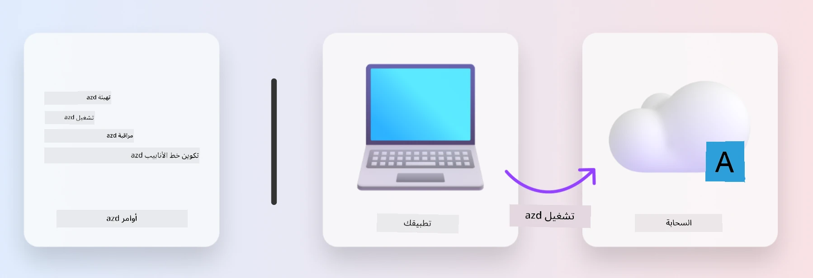
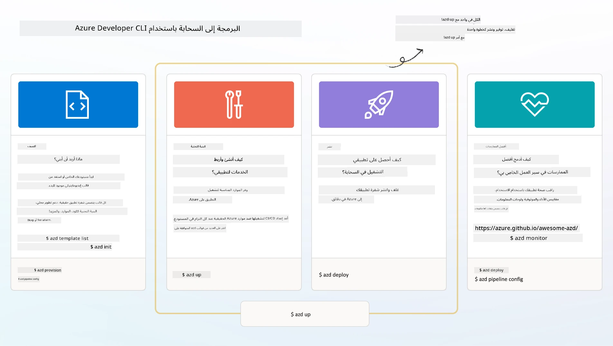

# 1. اختر قالبًا

!!! tip "بنهاية هذه الوحدة ستكون قادرًا على"

    - [ ] وصف ماهية قوالب AZD
    - [ ] اكتشاف واستخدام قوالب AZD للذكاء الاصطناعي
    - [ ] البدء بقالب AI Agents
    - [ ] **المختبر 1:** بدء سريعة لـ AZD في Codespaces أو حاوية تطوير

---

## 1. تشبيه البنّاء

بناء تطبيق ذكاء اصطناعي حديث وجاهز للمؤسسات _من الصفر_ يمكن أن يكون شاقًا. إنه يشبه إلى حد ما بناء منزلك الجديد بنفسك، لبنة تلو الأخرى. نعم، يمكن تنفيذ ذلك! لكن ليس هذا هو الطريقة الأكثر فاعلية للحصول على النتيجة المرجوة!

بدلاً من ذلك، غالبًا ما نبدأ بمخطط تصميم موجود، ونعمل مع مهندس معماري لتخصيصه وفقًا لمتطلباتنا الشخصية. وهذا بالضبط هو النهج الذي يجب اتباعه عند بناء التطبيقات الذكية. أولًا، اعثر على بنية تصميم جيدة تناسب مجال مشكلتك. ثم اعمل مع مهندس حلول لتخصيص وتطوير الحل لسيناريوهتك الخاصة.

ولكن من أين نجد هذه المخططات التصميمية؟ وكيف نجد مهندسًا معماريًا مستعدًا لتعليمنا كيفية تخصيص ونشر هذه المخططات بمفردنا؟ في هذه الورشة، نجيب عن تلك الأسئلة من خلال تعريفك بثلاث تقنيات:

1. [Azure Developer CLI](https://aka.ms/azd) - أداة مفتوحة المصدر تُسرّع مسار المطور من التطوير المحلي (البناء) إلى النشر السحابي (الإرسال).
1. [Microsoft Foundry Templates](https://ai.azure.com/templates) - مستودعات مفتوحة المصدر موحدة تحتوي على أمثلة كود وملفات بنية تحتية وتكوين لنشر معماريات حلول الذكاء الاصطناعي.
1. [GitHub Copilot Agent Mode](https://code.visualstudio.com/docs/copilot/chat/chat-agent-mode) - وكيل ترميز مُؤسس على معرفة Azure، يمكنه إرشادنا في التنقل عبر قاعدة الشفرة وإجراء التغييرات - باستخدام اللغة الطبيعية.

مع هذه الأدوات في اليد، يمكننا الآن _اكتشاف_ القالب المناسب، _نشره_ للتحقق من عمله، و_تخصيصه_ ليلائم سيناريوهاتنا المحددة. هيا نغوص ونتعلم كيف تعمل هذه الأدوات.


---

## 2. Azure Developer CLI

The [Azure Developer CLI](https://learn.microsoft.com/en-us/azure/developer/azure-developer-cli/) (or `azd`) is an open-source commandline tool that can speed up your code-to-cloud journey with a set of developer-friendly commands that work consistently across your IDE (development) and CI/CD (devops) environments.

With `azd`, your deployment journey can be as simple as:

- `azd init` - Initializes a new AI project from an existing AZD template.
- `azd up` - Provisions infrastructure and deploy your application in one step.
- `azd monitor` - Get real-time monitoring and diagnostics for your deployed application.
- `azd pipeline config` - Setup CI/CD pipelines to automate deployment to Azure.

**🎯 | EXERCISE**: <br/> استكشف أداة سطر الأوامر `azd` في بيئة الورشة الحالية لديك الآن. يمكن أن تكون هذه GitHub Codespaces، أو حاوية تطوير، أو نسخة محلية مع تثبيت المتطلبات المسبقة. ابدأ بكتابة هذا الأمر لرؤية ما يمكن للأداة القيام به:

```bash title="" linenums="0"
azd help
```



---

## 3. قالب AZD

For `azd` to achieve this, it needs to know the infrastructure to provision, the configuration settings to enforce, and the application to deploy. This is where [AZD templates](https://learn.microsoft.com/en-us/azure/developer/azure-developer-cli/azd-templates?tabs=csharp) come in. 

قوالب AZD هي مستودعات مفتوحة المصدر تجمع بين أمثلة الكود وملفات البنية التحتية والتكوين المطلوبة لنشر بنية الحل.
من خلال اتباع نهج _البنية التحتية كرمز_ (IaC)، تسمح بتعريفات موارد القالب وإعدادات التكوين لتكون خاضعة للتحكّم بالإصدارات (تمامًا مثل شفرة التطبيق المصدرية) - مما يخلق تدفقات عمل قابلة لإعادة الاستخدام ومتسقة عبر مستخدمي ذلك المشروع.

عند إنشاء أو إعادة استخدام قالب AZD لسيناريو _خاصتك_، ضع في اعتبارك هذه الأسئلة:

1. ماذا تبني؟ → هل يوجد قالب يحتوي على كود مبدئي لذلك السيناريو؟
1. كيف تم هندسة الحل لديك؟ → هل يوجد قالب يحتوي على الموارد اللازمة؟
1. كيف يتم نشر حلك؟ → فكّر في `azd deploy` مع خطوات المعالجة المسبقة/اللاحقة!
1. كيف يمكنك تحسينه أكثر؟ → فكّر في المراقبة المدمجة وأنابيب الأتمتة!

**🎯 | EXERCISE**: <br/> 
قم بزيارة معرض [Awesome AZD](https://azure.github.io/awesome-azd/) واستخدم المرشحات لاستكشاف أكثر من 250 قالبًا متاحًا حاليًا. انظر إذا كان بإمكانك العثور على واحد يتوافق مع متطلبات سيناريو _خاصتك_.



---

## 4. قوالب تطبيقات الذكاء الاصطناعي

بالنسبة للتطبيقات المدعومة بالذكاء الاصطناعي، توفر Microsoft قوالب متخصصة تتضمن **Microsoft Foundry** و**Foundry Agents**. هذه القوالب تسرع طريقك لبناء تطبيقات ذكية وجاهزة للإنتاج.

### قوالب Microsoft Foundry و Foundry Agents

اختر قالبًا أدناه لنشره. كل قالب متاح على [Awesome AZD](https://azure.github.io/awesome-azd/) ويمكن تهيئته بأمر واحد.

| Template | Description | Deploy Command |
|----------|-------------|----------------|
| **[AI Chat with RAG](https://azure.github.io/awesome-azd/?tags=ai&tags=rag)** | تطبيق دردشة مع توليد معزز بالاسترجاع باستخدام Microsoft Foundry | `azd init -t azure-samples/azure-search-openai-demo` |
| **[Foundry Agent Service Starter](https://azure.github.io/awesome-azd/?tags=ai&tags=agents)** | قالب لبدء بناء وكلاء ذكاء اصطناعي باستخدام Foundry Agents لتنفيذ المهام بشكل مستقل | `azd init -t azure-samples/foundry-agent-service-starter` |
| **[Multi-Agent Orchestration](https://azure.github.io/awesome-azd/?tags=ai&tags=agents)** | تنسيق عدة Foundry Agents لسير عمل معقّد | `azd init -t azure-samples/multi-agent-orchestration` |
| **[AI Document Intelligence](https://azure.github.io/awesome-azd/?tags=ai&tags=document)** | استخراج وتحليل المستندات باستخدام نماذج Microsoft Foundry | `azd init -t azure-samples/ai-document-processing` |
| **[Conversational AI Bot](https://azure.github.io/awesome-azd/?tags=ai&tags=bot)** | بناء روبوتات دردشة ذكية مع تكامل Microsoft Foundry | `azd init -t azure-samples/ai-chat-protocol` |
| **[AI Image Generation](https://azure.github.io/awesome-azd/?tags=ai&tags=dalle)** | توليد صور باستخدام DALL-E عبر Microsoft Foundry | `azd init -t azure-samples/ai-image-generation` |
| **[Semantic Kernel Agent](https://azure.github.io/awesome-azd/?tags=ai&tags=semantic-kernel)** | وكلاء ذكاء اصطناعي يستخدمون Semantic Kernel مع Foundry Agents | `azd init -t azure-samples/semantic-kernel-agent` |
| **[AutoGen Multi-Agent](https://azure.github.io/awesome-azd/?tags=ai&tags=autogen)** | أنظمة متعددة الوكلاء باستخدام إطار عمل AutoGen | `azd init -t azure-samples/autogen-multi-agent` |

### البداية السريعة

1. **تصفّح القوالب**: قم بزيارة [https://azure.github.io/awesome-azd/](https://azure.github.io/awesome-azd/) واستخدم الفلاتر حسب `AI`، `Agents`، أو `Microsoft Foundry`
2. **اختر قالبك**: اختر واحدًا يتطابق مع حالة استخدامك
3. **تهيئة**: شغّل أمر `azd init` للقالب الذي اخترته
4. **نشر**: شغّل `azd up` لتوفير الموارد ونشرها

**🎯 | EXERCISE**: <br/>
اختر أحد القوالب أعلاه بناءً على سيناريوك:

- **تبني روبوت دردشة؟** → ابدأ بـ **AI Chat with RAG** أو **Conversational AI Bot**
- **تحتاج وكلاء مستقلين؟** → جرّب **Foundry Agent Service Starter** أو **Multi-Agent Orchestration**
- **معالجة المستندات؟** → استخدم **AI Document Intelligence**
- **تريد مساعدًا للترميز بالذكاء الاصطناعي؟** → استكشف **Semantic Kernel Agent** أو **AutoGen Multi-Agent**

```bash title="Example: Deploy the AI Chat with RAG template" linenums="0"
azd init -t azure-samples/azure-search-openai-demo
azd up
```

!!! info "استكشف مزيدًا من القوالب"
    يحتوي معرض [Awesome AZD Gallery](https://azure.github.io/awesome-azd/) على أكثر من 250 قالبًا. استخدم الفلاتر للعثور على القوالب التي تتطابق مع متطلباتك الخاصة للغة، والإطار، وخدمات Azure.

---

<!-- CO-OP TRANSLATOR DISCLAIMER START -->
**إخلاء المسؤولية**:
تمت ترجمة هذا المستند باستخدام خدمة الترجمة الآلية [Co-op Translator](https://github.com/Azure/co-op-translator). بينما نسعى للدقة، يرجى العلم أن الترجمات الآلية قد تحتوي على أخطاء أو عدم دقة. يجب اعتبار المستند الأصلي بلغته الأصلية المصدر المعتمد. للمعلومات الحرجة، يُنصح باللجوء إلى ترجمة بشرية مهنية. نحن غير مسؤولين عن أي سوء تفاهم أو تفسيرات خاطئة ناتجة عن استخدام هذه الترجمة.
<!-- CO-OP TRANSLATOR DISCLAIMER END -->