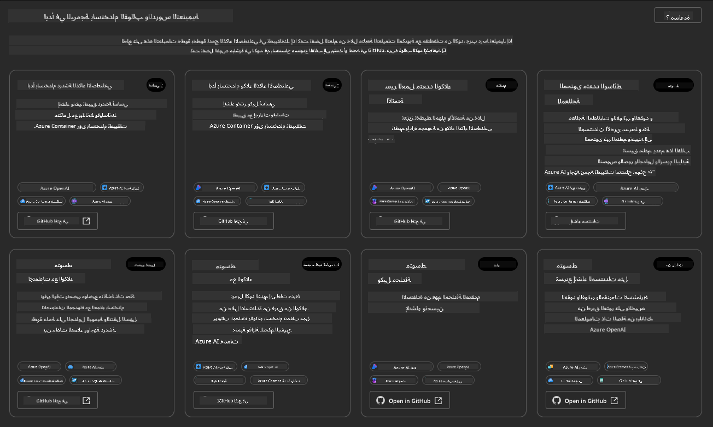
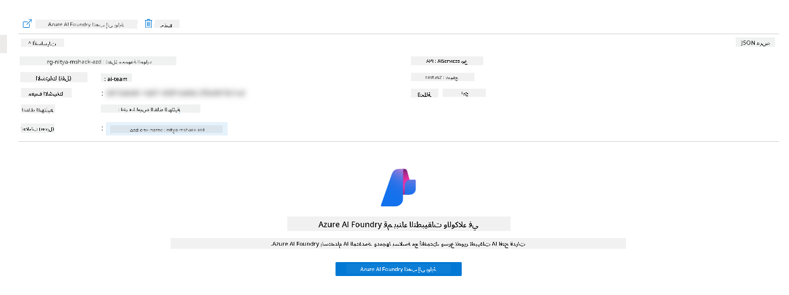
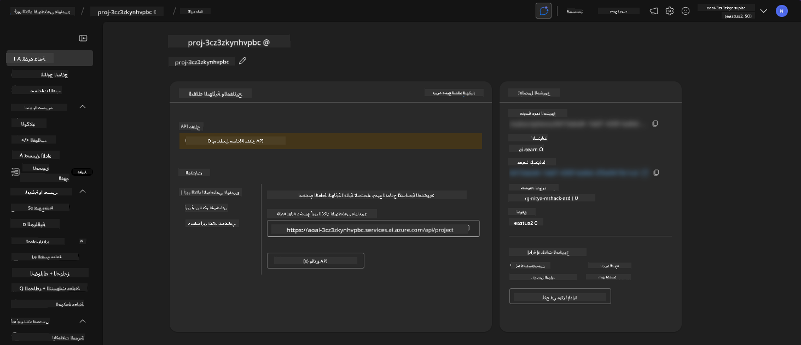
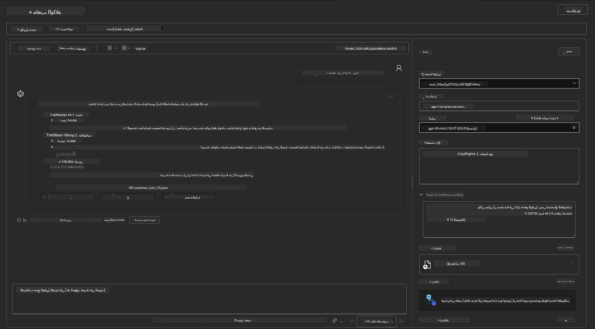
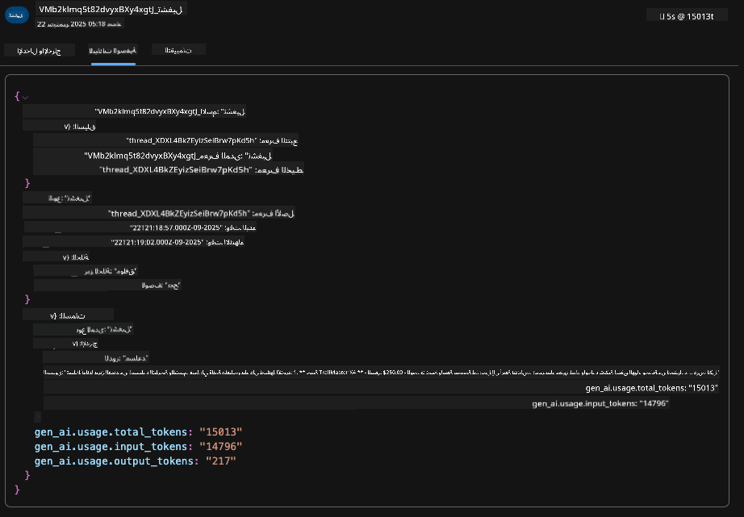

<!--
CO_OP_TRANSLATOR_METADATA:
{
  "original_hash": "7816c6ec50c694c331e7c6092371be4d",
  "translation_date": "2025-09-24T12:10:59+00:00",
  "source_file": "workshop/docs/instructions/2-Validate-AI-Template.md",
  "language_code": "ar"
}
-->
# 2. التحقق من صحة القالب

!!! tip "بنهاية هذه الوحدة ستكون قادرًا على"

- [ ] تحليل بنية الحلول الذكية
- [ ] فهم سير عمل نشر AZD
- [ ] استخدام GitHub Copilot للحصول على مساعدة في استخدام AZD
- [ ] **المختبر 2:** نشر والتحقق من صحة قالب وكلاء الذكاء الاصطناعي

---

## 1. المقدمة

[Azure Developer CLI](https://learn.microsoft.com/en-us/azure/developer/azure-developer-cli/) أو `azd` هو أداة مفتوحة المصدر تعمل على تبسيط سير عمل المطور عند بناء ونشر التطبيقات على Azure.

[قوالب AZD](https://learn.microsoft.com/azure/developer/azure-developer-cli/azd-templates) هي مستودعات قياسية تتضمن كود تطبيقات تجريبية، أصول _البنية التحتية ككود_، وملفات تكوين `azd` لتوفير بنية حلول متكاملة. يصبح توفير البنية التحتية بسيطًا مثل تنفيذ أمر `azd provision` - بينما يسمح استخدام `azd up` بتوفير البنية التحتية **ونشر التطبيق** في خطوة واحدة!

نتيجة لذلك، يمكن أن يكون بدء عملية تطوير التطبيق بسيطًا مثل العثور على _قالب AZD Starter_ المناسب الذي يقترب من احتياجات التطبيق والبنية التحتية - ثم تخصيص المستودع ليناسب متطلبات السيناريو الخاص بك.

قبل أن نبدأ، دعنا نتأكد من تثبيت Azure Developer CLI لديك.

1. افتح نافذة VS Code واكتب هذا الأمر:

      ```bash title="" linenums="0"
      azd version
      ```

1. يجب أن ترى شيئًا مثل هذا!

      ```bash title="" linenums="0"
      azd version 1.19.0 (commit b3d68cea969b2bfbaa7b7fa289424428edb93e97)
      ```

**أنت الآن جاهز لاختيار ونشر قالب باستخدام azd**

---

## 2. اختيار القالب

تأتي منصة Azure AI Foundry مع [مجموعة من قوالب AZD الموصى بها](https://learn.microsoft.com/en-us/azure/ai-foundry/how-to/develop/ai-template-get-started) التي تغطي سيناريوهات الحلول الشائعة مثل _أتمتة سير العمل متعدد الوكلاء_ و_معالجة المحتوى متعدد الوسائط_. يمكنك أيضًا اكتشاف هذه القوالب من خلال زيارة بوابة Azure AI Foundry.

1. قم بزيارة [https://ai.azure.com/templates](https://ai.azure.com/templates)
1. قم بتسجيل الدخول إلى بوابة Azure AI Foundry عندما يُطلب منك ذلك - سترى شيئًا مثل هذا.



**الخيارات الأساسية** هي قوالب البداية الخاصة بك:

1. [ ] [البدء مع دردشة الذكاء الاصطناعي](https://github.com/Azure-Samples/get-started-with-ai-chat) الذي ينشر تطبيق دردشة أساسي _مع بياناتك_ على Azure Container Apps. استخدم هذا لاستكشاف سيناريو دردشة الذكاء الاصطناعي الأساسي.
1. [X] [البدء مع وكلاء الذكاء الاصطناعي](https://github.com/Azure-Samples/get-started-with-ai-agents) الذي ينشر أيضًا وكيل ذكاء اصطناعي قياسي (مع خدمة Azure AI Agent). استخدم هذا للتعرف على حلول الذكاء الاصطناعي الوكيلية التي تتضمن الأدوات والنماذج.

قم بزيارة الرابط الثاني في علامة تبويب جديدة في المتصفح (أو انقر على `Open in GitHub` للبطاقة ذات الصلة). يجب أن ترى المستودع الخاص بهذا القالب AZD. خذ دقيقة لاستكشاف ملف README. تبدو بنية التطبيق كما يلي:


---

## 3. تفعيل القالب

دعونا نحاول نشر هذا القالب والتأكد من أنه صالح. سنتبع الإرشادات في قسم [البدء](https://github.com/Azure-Samples/get-started-with-ai-agents?tab=readme-ov-file#getting-started).

1. انقر على [هذا الرابط](https://github.com/codespaces/new/Azure-Samples/get-started-with-ai-agents) - أكد الإجراء الافتراضي لـ `Create codespace`
1. يفتح هذا علامة تبويب جديدة في المتصفح - انتظر حتى يتم تحميل جلسة GitHub Codespaces
1. افتح نافذة VS Code في Codespaces - واكتب الأمر التالي:

   ```bash title="" linenums="0"
   azd up
   ```

أكمل خطوات سير العمل التي سيتم تشغيلها:

1. سيتم مطالبتك بتسجيل الدخول إلى Azure - اتبع التعليمات للمصادقة
1. أدخل اسم بيئة فريد لك - على سبيل المثال، استخدمت `nitya-mshack-azd`
1. سيؤدي ذلك إلى إنشاء مجلد `.azure/` - سترى مجلدًا فرعيًا باسم البيئة
1. سيتم مطالبتك باختيار اسم الاشتراك - اختر الافتراضي
1. سيتم مطالبتك بموقع - استخدم `East US 2`

الآن، انتظر حتى يكتمل التوفير. **يستغرق هذا 10-15 دقيقة**

1. عند الانتهاء، ستظهر رسالة SUCCESS في وحدة التحكم مثل هذه:
      ```bash title="" linenums="0"
      SUCCESS: Your up workflow to provision and deploy to Azure completed in 10 minutes 17 seconds.
      ```
1. سيكون لديك الآن مجموعة موارد مخصصة في بوابة Azure باسم البيئة:


1. **أنت الآن جاهز للتحقق من صحة البنية التحتية والتطبيق المنشور**.

---

## 4. التحقق من صحة القالب

1. قم بزيارة صفحة [مجموعات الموارد](https://portal.azure.com/#browse/resourcegroups) في بوابة Azure - قم بتسجيل الدخول عندما يُطلب منك ذلك
1. انقر على مجموعة الموارد لاسم بيئتك - سترى الصفحة أعلاه

- انقر على مورد Azure Container Apps
- انقر على رابط Application Url في قسم _Essentials_ (أعلى اليمين)

1. يجب أن ترى واجهة مستخدم أمامية للتطبيق المستضاف مثل هذا:


1. حاول طرح بعض [الأسئلة التجريبية](https://github.com/Azure-Samples/get-started-with-ai-agents/blob/main/docs/sample_questions.md)

- اسأل: ```ما هي عاصمة فرنسا؟``` 
- اسأل: ```ما هو أفضل خيمة تحت 200 دولار لشخصين، وما الميزات التي تتضمنها؟```

1. يجب أن تحصل على إجابات مشابهة لما هو موضح أدناه. _لكن كيف يعمل هذا؟_


---

## 5. التحقق من صحة الوكيل

يقوم تطبيق Azure Container App بنشر نقطة نهاية تتصل بوكيل الذكاء الاصطناعي الذي تم توفيره في مشروع Azure AI Foundry لهذا القالب. دعونا نلقي نظرة على ما يعنيه ذلك.

1. عد إلى صفحة _Overview_ لمجموعة الموارد الخاصة بك في بوابة Azure

1. انقر على مورد `Azure AI Foundry` في تلك القائمة

1. يجب أن ترى هذا. انقر على زر `Go to Azure AI Foundry Portal`. 


1. يجب أن ترى صفحة مشروع Foundry لتطبيق الذكاء الاصطناعي الخاص بك


1. انقر على `Agents` - سترى الوكيل الافتراضي الذي تم توفيره في مشروعك


1. اختره - وسترى تفاصيل الوكيل. لاحظ ما يلي:

- يستخدم الوكيل البحث في الملفات بشكل افتراضي (دائمًا)
- يشير `Knowledge` الخاص بالوكيل إلى أنه تم تحميل 32 ملفًا (للبحث في الملفات)


1. ابحث عن خيار `Data+indexes` في القائمة اليسرى وانقر للحصول على التفاصيل.

- يجب أن ترى 32 ملف بيانات تم تحميلها للمعرفة.
- ستتوافق هذه مع 12 ملفًا للعميل و20 ملفًا للمنتجات تحت `src/files` 


**لقد تحققت من صحة تشغيل الوكيل!**

1. تعتمد استجابات الوكيل على المعرفة الموجودة في تلك الملفات.
1. يمكنك الآن طرح أسئلة تتعلق بتلك البيانات، والحصول على استجابات مستندة.
1. مثال: يصف `customer_info_10.json` المشتريات الثلاثة التي قامت بها "Amanda Perez"

عد إلى علامة التبويب في المتصفح مع نقطة نهاية تطبيق Container واسأل: `ما هي المنتجات التي تمتلكها Amanda Perez؟`. يجب أن ترى شيئًا مثل هذا:


---

## 6. ملعب الوكيل

دعونا نبني بعض الحدس حول قدرات Azure AI Foundry، من خلال تجربة الوكيل في ملعب الوكلاء.

1. عد إلى صفحة `Agents` في Azure AI Foundry - اختر الوكيل الافتراضي
1. انقر على خيار `Try in Playground` - يجب أن تحصل على واجهة ملعب مثل هذه
1. اسأل نفس السؤال: `ما هي المنتجات التي تمتلكها Amanda Perez؟`



تحصل على نفس الاستجابة (أو مشابهة) - ولكنك تحصل أيضًا على معلومات إضافية يمكنك استخدامها لفهم جودة، تكلفة، وأداء تطبيقك الوكلي. على سبيل المثال:

1. لاحظ أن الاستجابة تستشهد بملفات البيانات المستخدمة "لتأسيس" الاستجابة
1. مرر فوق أي من هذه تسميات الملفات - هل تتطابق البيانات مع استفسارك والاستجابة المعروضة؟

ترى أيضًا صف _الإحصائيات_ أسفل الاستجابة.

1. مرر فوق أي مقياس - على سبيل المثال، الأمان. سترى شيئًا مثل هذا
1. هل تتطابق التقييمات المقدرة مع حدسك لمستوى أمان الاستجابة؟


---

## 7. المراقبة المدمجة

المراقبة تتعلق بتجهيز تطبيقك لتوليد بيانات يمكن استخدامها لفهم، تصحيح، وتحسين عملياته. للحصول على فكرة عن ذلك:

1. انقر على زر `View Run Info` - يجب أن ترى هذه العرضة. هذا مثال على [تتبع الوكيل](https://learn.microsoft.com/en-us/azure/ai-foundry/how-to/develop/trace-agents-sdk#view-trace-results-in-the-azure-ai-foundry-agents-playground) أثناء العمل. _يمكنك أيضًا الحصول على هذه العرضة بالنقر على Thread Logs في القائمة العلوية_.

- احصل على فكرة عن خطوات التشغيل والأدوات التي يستخدمها الوكيل
- فهم إجمالي عدد الرموز (مقابل استخدام رموز الإخراج) للاستجابة
- فهم التأخير وأين يتم إنفاق الوقت في التنفيذ


1. انقر على علامة التبويب `Metadata` لرؤية سمات إضافية للتشغيل، التي قد توفر سياقًا مفيدًا لتصحيح المشكلات لاحقًا.



1. انقر على علامة التبويب `Evaluations` لرؤية التقييمات التلقائية التي تم إجراؤها على استجابة الوكيل. تتضمن هذه التقييمات تقييمات الأمان (مثل، إيذاء النفس) وتقييمات خاصة بالوكيل (مثل، حل النية، الالتزام بالمهمة).


1. أخيرًا وليس آخرًا، انقر على علامة التبويب `Monitoring` في القائمة الجانبية.

- اختر علامة التبويب `Resource usage` في الصفحة المعروضة - وشاهد المقاييس.
- تتبع استخدام التطبيق من حيث التكاليف (الرموز) والتحميل (الطلبات).
- تتبع تأخير التطبيق إلى أول بايت (معالجة الإدخال) وآخر بايت (الإخراج).


---

## 8. متغيرات البيئة

حتى الآن، قمنا بالسير عبر النشر في المتصفح - وتحققنا من أن البنية التحتية قد تم توفيرها وأن التطبيق يعمل. ولكن للعمل مع التطبيق _كود أولًا_، نحتاج إلى تكوين بيئة التطوير المحلية لدينا مع المتغيرات ذات الصلة المطلوبة للعمل مع هذه الموارد. يجعل استخدام `azd` الأمر سهلاً.

1. يستخدم Azure Developer CLI [متغيرات البيئة](https://learn.microsoft.com/en-us/azure/developer/azure-developer-cli/manage-environment-variables?tabs=bash) لتخزين وإدارة إعدادات التكوين لنشر التطبيقات.

1. يتم تخزين متغيرات البيئة في `.azure/<env-name>/.env` - هذا يحدد نطاقها إلى البيئة `env-name` المستخدمة أثناء النشر ويساعدك على عزل البيئات بين أهداف النشر المختلفة في نفس المستودع.

1. يتم تحميل متغيرات البيئة تلقائيًا بواسطة أمر `azd` كلما نفذ أمرًا معينًا (مثل، `azd up`). لاحظ أن `azd` لا يقرأ تلقائيًا متغيرات البيئة _على مستوى نظام التشغيل_ (مثل، التي تم تعيينها في الصدفة) - بدلاً من ذلك استخدم `azd set env` و`azd get env` لنقل المعلومات داخل النصوص.

دعونا نجرب بعض الأوامر:

1. احصل على جميع متغيرات البيئة التي تم تعيينها لـ `azd` في هذه البيئة:

      ```bash title="" linenums="0"
      azd env get-values
      ```
      
ترى شيئًا مثل:

      ```bash title="" linenums="0"
      AZURE_AI_AGENT_DEPLOYMENT_NAME="gpt-4o-mini"
      AZURE_AI_AGENT_NAME="agent-template-assistant"
      AZURE_AI_EMBED_DEPLOYMENT_NAME="text-embedding-3-small"
      AZURE_AI_EMBED_DIMENSIONS=100
      ...
      ```

1. احصل على قيمة محددة - على سبيل المثال، أريد أن أعرف ما إذا كنا قد قمنا بتعيين قيمة `AZURE_AI_AGENT_MODEL_NAME`

      ```bash title="" linenums="0"
      azd env get-value AZURE_AI_AGENT_MODEL_NAME 
      ```
      
ترى شيئًا مثل هذا - لم يتم تعيينه افتراضيًا!

      ```bash title="" linenums="0"
      ERROR: key 'AZURE_AI_AGENT_MODEL_NAME' not found in the environment values
      ```

1. قم بتعيين متغير بيئة جديد لـ `azd`. هنا، نقوم بتحديث اسم نموذج الوكيل. _ملاحظة: أي تغييرات يتم إجراؤها ستنعكس فورًا في ملف `.azure/<env-name>/.env`.

      ```bash title="" linenums="0"
      azd env set AZURE_AI_AGENT_MODEL_NAME gpt-4.1
      azd env set AZURE_AI_AGENT_MODEL_VERSION 2025-04-14
      azd env set AZURE_AI_AGENT_DEPLOYMENT_CAPACITY 150
      ```

الآن، يجب أن نجد أن القيمة قد تم تعيينها:

      ```bash title="" linenums="0"
      azd env get-value AZURE_AI_AGENT_MODEL_NAME 
      ```

1. لاحظ أن بعض الموارد دائمة (مثل، نشر النماذج) وستتطلب أكثر من مجرد `azd up` لإجبار إعادة النشر. دعونا نحاول إزالة النشر الأصلي وإعادة النشر مع تغيير متغيرات البيئة.

1. **تحديث** إذا كنت قد قمت سابقًا بنشر البنية التحتية باستخدام قالب azd - يمكنك _تحديث_ حالة متغيرات البيئة المحلية بناءً على الحالة الحالية لنشر Azure باستخدام هذا الأمر:
      ```bash title="" linenums="0"
      azd env refresh
      ```

      هذه طريقة قوية لمزامنة متغيرات البيئة عبر بيئتين أو أكثر من بيئات التطوير المحلية (مثل فريق يضم عدة مطورين) - مما يسمح للبنية التحتية المنشورة بأن تكون المصدر الأساسي لحالة متغيرات البيئة. يمكن لأعضاء الفريق ببساطة تحديث المتغيرات للعودة إلى حالة التزامن.

---

## 9. تهانينا 🏆

لقد أكملت للتو سير عمل شامل حيث:

- [X] اخترت قالب AZD الذي تريد استخدامه
- [X] أطلقت القالب باستخدام GitHub Codespaces
- [X] نشرت القالب وتأكدت من أنه يعمل

---

